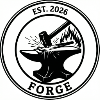

# FORGE 🦀



Framework for OSCAL Risk & Governance Execution

[](https://sonarcloud.io/summary/new_code?id=policy-forge_forge)
[](https://sonarcloud.io/summary/new_code?id=policy-forge_forge)
[](https://sonarcloud.io/summary/new_code?id=policy-forge_forge)
[](https://sonarcloud.io/summary/new_code?id=policy-forge_forge)
[](https://sonarcloud.io/summary/new_code?id=policy-forge_forge)

FORGE is a high-performance Rust CLI designed for the Agent-Native software era. It bridges the gap between human-written security policies and autonomous execution by converting Markdown governance into OSCAL (Open Security Controls Assessment Language)—the industry standard for machine-readable compliance.

## 🚀 Why FORGE?

In the world of Agentic AI, natural language documentation is a liability. Agents suffer from "semantic ambiguity," leading to hallucinations and inconsistent security enforcement. FORGE "forges" abstract policy into deterministic, schema-validated artifacts that provide AI agents with a Shared Truth Layer.

By providing a high-fidelity, machine-navigable roadmap of a system's rules, FORGE allows agents to not just write code, but to understand the guardrails they must operate within.

## 🛠️ Key Architectural Pillars

1. High-Fidelity Machine Readability

FORGE ingest human-centric Markdown and produces structured OSCAL Catalogs and Component Definitions.

Zero-Shot Success: Reduces token waste by providing agents with deterministic schemas rather than ambiguous prose.

Requirement Atomization: Automatically splits compound "Must X and Must Y" statements into individual, addressable controls.

2. Deterministic Agentic Guardrails

In agentic coding, an agent often has the power to modify its environment. FORGE creates the Guardrail Layer:

Stable Identifiers: UUID v5 generation ensures that every security control has a persistent identity, allowing agents to track compliance state across sessions.

Traceability: Source-to-OSCAL mapping ensures every machine rule is linked back to the original policy intent.

3. Agentic Interoperability & Enforcement

FORGE acts as a translation layer for the modern security stack. It enables the transition from "Policy-as-Prose" to Policy-as-Code:

Tooling Integration: Compatible with Open Policy Agent (OPA), GitHub Advanced Security, and standard CI/CD scanners.

MCP Native: Designed to feed into the Model Context Protocol (MCP), allowing agents to query system governance as easily as they query a database.

## ✨ Features

- **Markdown to OSCAL** — Convert policy documents into OSCAL Catalogs or Component Definitions
- **Multi-format output** — JSON, XML, and YAML with round-trip fidelity between all three
- **Schema validation** — Validate supported OSCAL v1.2.0–v1.2.3 declarations against the pinned v1.2.3 JSON schemas with semantic checks
- **Format conversion** — Export existing OSCAL artifacts between JSON, XML, and YAML
- **Requirement atomization** — Automatically split compound policy statements into individual controls
- **Deterministic IDs** — UUID v5 generation ensures stable identifiers across re-conversions
- **Citation extraction** — URLs and references extracted into OSCAL back-matter resources
- **Traceability** — Source-to-OSCAL element mapping embedded as provenance metadata
- **Zero network dependencies** — Reads and writes local files only

## 🚦 Quick Start

```bash
# Install (requires Rust 1.93.0+)
git clone https://github.com/policy-forge/forge.git
cd forge
cargo build --release

# Convert a policy to an OSCAL Catalog (JSON)
./target/release/forge convert tests/fixtures/sample_policy.md --strategy catalog --format json

# Convert to an OSCAL Component Definition
./target/release/forge convert tests/fixtures/sample_policy.md --strategy component --format json --source-profile profile.json

# Validate a generated OSCAL artifact
./target/release/forge validate catalog.json
```

## Usage

### Convert

Convert a Markdown policy document into an OSCAL artifact.

```bash
# OSCAL Catalog (groups, controls, statements)
forge convert policy.md --strategy catalog --format json

# OSCAL Component Definition (--source-profile required)
forge convert policy.md --strategy component --source-profile baseline.json --format json

# Output as XML or YAML
forge convert policy.md --strategy catalog --format xml
forge convert policy.md --strategy catalog --format yaml

# Write to a file instead of stdout
forge convert policy.md --strategy catalog --format json --output catalog.json

# Override max input file size (default: 10 MB)
forge convert large-policy.md --strategy catalog --format json --max-size 20
```
### Export

Convert an existing OSCAL artifact between formats. Auto-detects the input format from the file extension.

```bash
# JSON to XML
forge export catalog.json --format xml

# XML to YAML
forge export catalog.xml --format yaml

# YAML to JSON, written to a file
forge export catalog.yaml --format json --output catalog.json
```

### Validate

Validate an OSCAL artifact against FORGE's pinned OSCAL v1.2.3 JSON schema. Auto-detection selects Catalog, Component Definition, Profile, or Control Mapping from the document root; `metadata.oscal-version` is reported but never selects or downloads a schema.
The explicit `--schema-type` override supports Catalog, Component Definition, and Control Mapping; Profile documents currently require auto-detection.

```bash
# Validate with human-readable output
forge validate catalog.json

# Machine-parseable JSON output
forge validate catalog.json --format json

# Override auto-detected model type
forge validate artifact.json --schema-type catalog

# Validate an OSCAL Control Mapping artifact
forge validate mapping.json --schema-type mapping
```

Newly generated Catalog, Component Definition, Profile, Assessment Plan, and
SSP artifacts declare OSCAL `1.2.3`. Existing Catalog, Component Definition,
and Profile inputs declaring `1.2.0`, `1.2.1`, `1.2.2`, or `1.2.3` remain
supported when they satisfy the v1.2.3 compatibility schema. Export preserves
both `metadata.version` and the imported `metadata.oscal-version`; it does not
silently upgrade declarations. Validation, export, and built-in compatibility
checks are offline and use only vendored schemas.

Optional oscal-cli round trips are interoperability evidence, not v1.2.3
schema certification. In particular, oscal-cli v1.0.3 documents an OSCAL
v1.1.2 model baseline, so FORGE labels its results advisory. See
[OSCAL compatibility and schema upgrades](docs/OSCAL_COMPATIBILITY.md).

### Drift

Compare committed and newly generated OSCAL JSON without printing policy
content. The versioned comparison ignores only FORGE's volatile root `uuid` and
`metadata.last-modified`; every other field remains significant.

```bash
# Human-readable status
forge drift committed/catalog.json staged/catalog.json

# Machine-readable status for CI
forge drift committed/catalog.json staged/catalog.json --format json
```

Exit codes are `0` for clean, `1` for drift, and `2` for invalid, unsupported,
or mismatched inputs. Run `forge validate` on generated artifacts before drift
comparison in enforcement workflows.

### Control Mapping

Publish explicit, human-reviewed Catalog/Profile relationships as OSCAL v1.2.3
Control Mapping JSON. FORGE validates declarations and references; it does not
generate relationships or make compliance determinations.

```bash
# Create an unapproved manifest scaffold with fingerprints and inventories
forge mapping init --source source.json --target target.json \
  --output mapping-manifest.json

# Build Mapping JSON and a separate deterministic review report
forge mapping build --manifest mapping-manifest.json \
  --output mapping.json --report mapping-report.json --report-format json

# Check current resources against a prior Mapping baseline
forge mapping check --manifest mapping-manifest.json \
  --baseline mapping.json --report-format json --fail-on any
```

Mapping commands are local-file-only and JSON-only. Profiles require an
explicit resolved Catalog companion and reviewer attestation in the manifest.
FORGE preserves but does not authenticate reviewer identity or authority, and
users remain responsible for rights to process framework content. Exit codes are `0` for a
completed build/check with no selected review impact, `1` when a completed
check triggers `--fail-on`, and `2` when trustworthy analysis is impossible.
Reports default to identifiers, counts, and hashes; `--include-excerpts` is an
explicit sensitive-output opt-in.

### Policy Lifecycle

Bind a policy version's declared review state to exact local source and generated
OSCAL bytes. Lifecycle history is append-only and deterministic; FORGE preserves
declared actors and roles but does not authenticate identity or authority.

```bash
# Create a draft record with a date-only review schedule
forge lifecycle init --source policy.md --artifact catalog.json \
  --output policy-lifecycle.json --policy-key access-control \
  --version-key v1 --title "Access Control Policy" --owner alice \
  --party alice=owner,author --party bob=reviewer --party carol=approver \
  --next-review 2027-08-25 --separate-reviewer-approver

# Append reviewed transitions with explicit event times
forge lifecycle transition --record policy-lifecycle.json --to in-review \
  --actor bob --role reviewer --at 2026-08-25T17:00:00Z \
  --rationale "Review completed" --apply
forge lifecycle transition --record policy-lifecycle.json --to approved \
  --actor carol --role approver --at 2026-08-25T18:00:00Z \
  --rationale "Approved for publication" --apply

# Deterministic CI status; exit 1 means lifecycle action is required
forge lifecycle status --record policy-lifecycle.json \
  --as-of 2026-08-25 --format json

# Group an explicit portfolio by owner and next-review date
forge lifecycle queue --record policy-lifecycle.json \
  --as-of 2026-08-25 --format json

# Export deterministic unsigned approval evidence; refuses drifted approvals
forge lifecycle attest --record policy-lifecycle.json \
  --output approval-attestation.json
```

`lifecycle check` validates one record or an explicitly supplied portfolio,
including supersession links and cycles. `status` never emits policy prose by
default. Re-review transitions can link bounded PRD-057 findings with repeatable
`--impact-finding-id` values. Exit codes are `0` for a valid record under the
selected gate, `1` for a valid action-required result, and `2` for an invalid
record or transition.

### Global Options

```bash
# Verbose: show pipeline stage information on stderr
forge -v convert policy.md --strategy catalog --format json

# Quiet: suppress all non-essential output
forge -q convert policy.md --strategy catalog --format json
```

### Project Configuration (`.forge.toml`)

Check in a `.forge.toml` to make repository command defaults reviewable and reusable:

```toml
schema-version = 1

[convert]
strategy = "catalog"
format = "json"
output = "generated/oscal"
jobs = 0
summary = false

[validate]
format = "text"
timeout-seconds = 30
```

```bash
# Explicit inputs only — strategy/format/output come from the project file
forge convert policies/policy-a.md policies/policy-b.md

# Validate the configuration without side effects
forge config check
```

Precedence per setting: explicit CLI > `$FORGE_JOBS` environment override > project config > built-in default.
See [Project Configuration](docs/project-configuration.md) for the full schema,
path rules, and selection order (`--config` > `$FORGE_CONFIG` > discovery).

> Note: a checked-in config makes option resolution deterministic; generated
> OSCAL artifacts still embed runtime UUID/timestamp metadata and are not yet
> byte-reproducible.

## 📦 Installation

### From crates.io

```bash
cargo install forge
```

### Pre-built binaries

Download the latest release for your platform from [GitHub Releases](https://github.com/policy-forge/forge/releases):

| Platform | Architecture | Archive |
|---|---|---|
| Linux | x86_64 | `forge-*-x86_64-unknown-linux-gnu.tar.gz` |
| macOS | x86_64 (Intel) | `forge-*-x86_64-apple-darwin.tar.gz` |
| macOS | aarch64 (Apple Silicon) | `forge-*-aarch64-apple-darwin.tar.gz` |
| Windows | x86_64 | `forge-*-x86_64-pc-windows-msvc.zip` |

**Linux / macOS (one-liner):**
```bash
curl -fsSL https://github.com/policy-forge/forge/releases/latest/download/forge-$(uname -m)-$(uname -s | tr '[:upper:]' '[:lower:]').tar.gz | tar xz && sudo mv forge /usr/local/bin/
```

**Windows (PowerShell):**
```powershell
Invoke-WebRequest -Uri "https://github.com/policy-forge/forge/releases/latest/download/forge-x86_64-pc-windows-msvc.zip" -OutFile forge.zip; Expand-Archive forge.zip -DestinationPath .; Remove-Item forge.zip
```

Each release includes SHA-256 checksums and [SLSA Level 3](https://slsa.dev/) provenance attestation.

### From source

```bash
git clone https://github.com/policy-forge/forge.git
cd forge
cargo build --release
```

## Input Format

FORGE accepts Markdown files (`.md` / `.markdown`) with optional YAML frontmatter:

```markdown
---
title: "Access Control Policy"
version: "2.0"
author: "Security Team"
date: "2026-01-15"
---

# Access Control

All users must authenticate before accessing systems.

## Authentication Requirements

- Users must use multi-factor authentication
- Passwords must be at least 12 characters
- Sessions must timeout after 30 minutes of inactivity

## Authorization

- Access must follow principle of least privilege
- Role-based access control must be enforced
```

Headings become OSCAL groups and controls. List items, tables, and paragraphs become control statements. Compound requirements like "Systems must X and must Y" are automatically split into atomic statements.

PDF (`.pdf`) and DOCX (`.docx`) documents are also accepted directly — headings and list styles are mapped to the same document model as Markdown. Plain-text formats can be pre-converted with [pandoc](https://pandoc.org/) or [markitdown](https://github.com/microsoft/markitdown) if needed.

25 sample policies are included in `example_data/` covering topics from acceptable use to incident response.

Each release includes SHA-256 checksums and [SLSA Level 3](https://slsa.dev/) provenance attestation.

## 🏗️ How It Works: The Deterministic Pipeline

FORGE processes governance through a rigorous nine-stage pipeline:
Ingest → Parse → Extract → Assemble → Atomize → Assign IDs → Map to OSCAL → Serialize → Validate

This ensures that the output is not just "valid JSON," but a semantically accurate representation of your security intent.

## 🗺️ Roadmap

FORGE is on the v1.1.0 release line. The original 50-item roadmap is complete:

- Phase 1 — Foundation: Markdown-to-OSCAL Catalog and Component Definition pipeline, deterministic UUIDs, traceability, validation, golden files, error handling, and benchmarks.
- Phase 2 — Control Layer & Multi-Format: JSON/XML/YAML output, round-trip checks, export subcommand, Profile generation, parameter tailoring, modality tagging, and parameter extraction.
- Phase 3 — Ecosystem & Community: oscal-cli integration, trace reports, diff reports, batch conversion, summary dashboards, Assessment Plan scaffolding, SSP templates, community examples, documentation, cross-platform CI, and release automation.

Future work such as Assessment Results, POA&M, built-in Profile Resolution, GRC integrations, web/API mode, and hosted documentation should be tracked in a new v1.x/v2 roadmap rather than reopened against the completed Phase 1–3 plan.

See `docs/FORGE_PRODUCT_ROADMAP.md` for the reconciled roadmap.

## 🤝 Contributing

FORGE is built for the community. We welcome PRs for new language bindings, MCP adapters, and enhanced semantic validators.

### Local quality gates

```bash
# Run the same checks used by CI
./scripts/ci-local.sh

# Install local git pre-commit hook
./scripts/install-hooks.sh
```

You can bypass the local hook once with:

```bash
SKIP_FORGE_PRECOMMIT=1 git commit -m "your message"
```

And enable stricter hook checks (bench + audit + deny) with:

```bash
FORGE_PRECOMMIT_STRICT=1 git commit -m "your message"
```

Policy Forge: Forging the rules that power the agents.

## License

MIT
