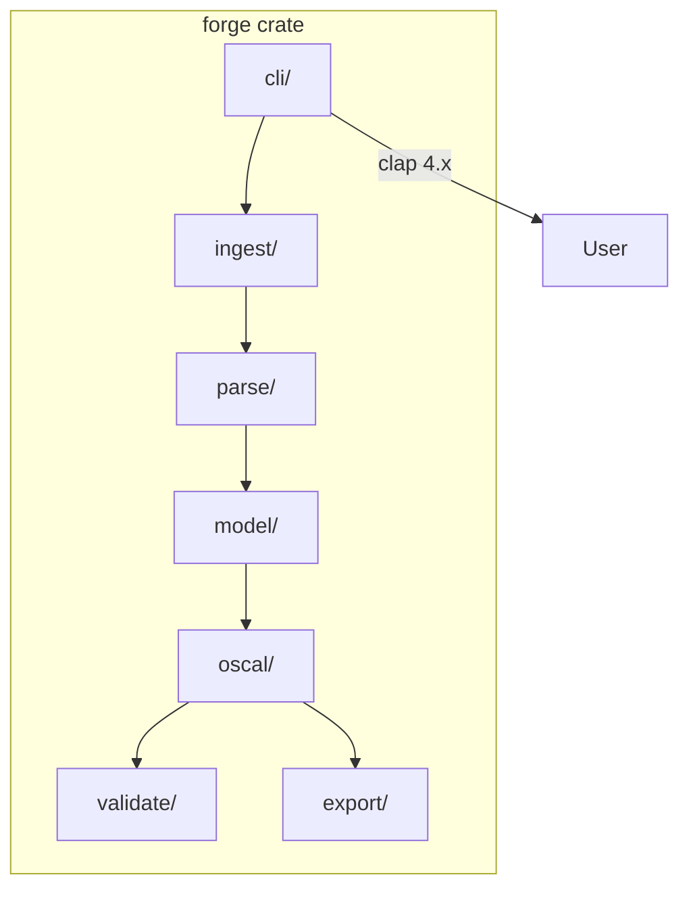
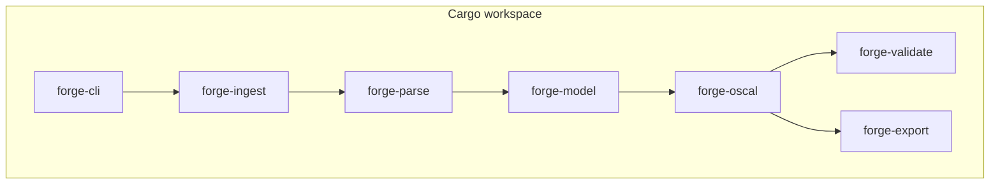
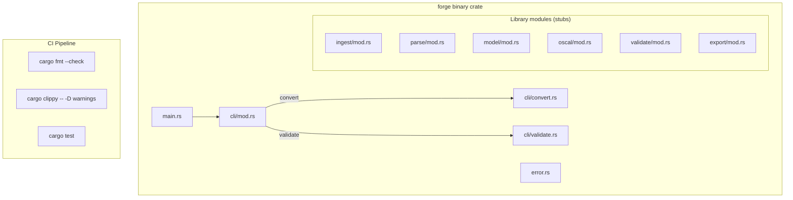
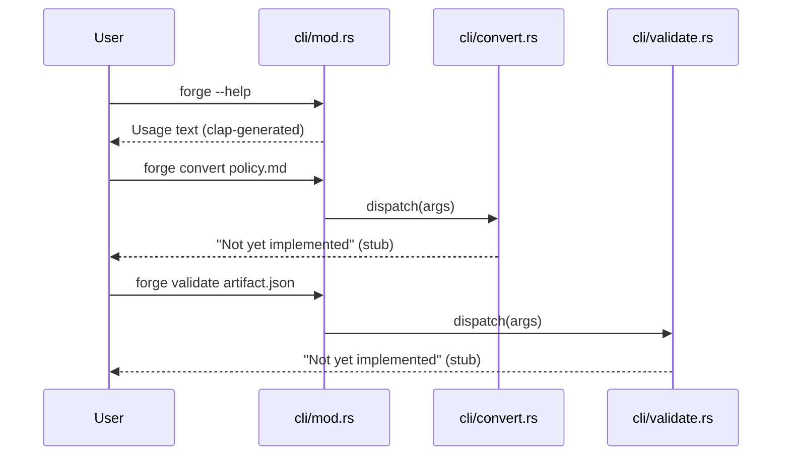

# 001-ar-project-scaffolding

> **Document Type:** Architecture Review
> **Audience:** LLM agents, human reviewers
> **Status:** Proposed
> **Last Updated:** 2026-02-10 <!-- @auto -->
> **Owner:** Brian Luby <!-- @human-required -->
> **Deciders:** Brian Luby <!-- @human-required -->

---

## Review Tier Legend

| Marker | Tier | Speckit Behavior |
|--------|------|------------------|
| 🔴 `@human-required` | Human Generated | Prompt human to author; blocks until complete |
| 🟡 `@human-review` | LLM + Human Review | LLM drafts → prompt human to confirm/edit; blocks until confirmed |
| 🟢 `@llm-autonomous` | LLM Autonomous | LLM completes; no prompt; logged for audit |
| ⚪ `@auto` | Auto-generated | System fills (timestamps, links); no prompt |

---

## Document Completion Order

> ⚠️ **For LLM Agents:** Complete sections in this order. Do not fill downstream sections until upstream human-required inputs exist.

1. **Summary (Decision)** → requires human input first
2. **Context (Problem Space)** → requires human input
3. **Decision Drivers** → requires human input (prioritized)
4. **Driving Requirements** → extract from PRD, human confirms
5. **Options Considered** → LLM drafts after drivers exist, human reviews
6. **Decision (Selected + Rationale)** → requires human decision
7. **Implementation Guardrails** → LLM drafts, human reviews
8. **Everything else** → can proceed after decision is made

---

## Linkage ⚪ `@auto`

| Document | ID | Relationship |
|----------|-----|--------------|
| Parent PRD | [001-prd-project-scaffolding](../PRD/001-prd-project-scaffolding.md) | Requirements this architecture satisfies |
| Security Review | 001-sec-project-scaffolding.md | Security implications of this decision |
| Supersedes | — | N/A (greenfield) |
| Superseded By | — | |

---

## Summary

### Decision 🔴 `@human-required`
> Use clap 4.x derive macros for CLI, thiserror for error types, and a flat module layout matching the pipeline stages (`cli`, `ingest`, `parse`, `model`, `oscal`, `validate`, `export`) within a single Cargo crate.

### TL;DR for Agents 🟡 `@human-review`
> FORGE starts as a single-crate Rust project with clap derive-based CLI. Module layout mirrors the conversion pipeline stages. Error types use thiserror with a single top-level `ForgeError` enum. Do NOT create a Cargo workspace yet — expand to multi-crate only when justified by concrete need (constitution principle I). CI enforces fmt, clippy, and test from day one.

---

## Context

### Problem Space 🔴 `@human-required`
The FORGE project needs a foundational structure that supports 49 subsequent work items spanning ingestion, parsing, OSCAL generation, validation, and export. The architecture must establish module boundaries, CLI framework, error handling patterns, and CI quality gates that all future code builds upon. A poor foundation will cause cascading refactors; an over-engineered foundation will slow initial velocity.

### Decision Scope 🟡 `@human-review`

**This AR decides:**
- CLI framework and argument parsing pattern
- Module directory structure and naming
- Error type strategy (crate-level enum vs per-module enums)
- CI pipeline composition

**This AR does NOT decide:**
- Domain model struct definitions — deferred to 005-ar-domain-model
- Markdown parsing crate selection — deferred to 002-ar-markdown-ingestion
- OSCAL serialization approach — deferred to 009-ar-catalog-groups-controls
- When to split into a Cargo workspace — evaluated at each milestone

### Current State 🟢 `@llm-autonomous`
N/A — greenfield implementation. The repository contains only configuration files, documentation, and CLAUDE.md.

### Driving Requirements 🟡 `@human-review`

| PRD Req ID | Requirement Summary | Architectural Implication |
|------------|---------------------|---------------------------|
| M-1 | Project compiles with `cargo build` | Must produce a valid Rust binary |
| M-2 | CLI uses clap with `convert` and `validate` subcommands | CLI framework must support subcommand routing |
| M-3 | `forge --help` prints usage | CLI must generate help text from definitions |
| M-4 | Module structure: cli, ingest, parse, model, oscal, validate, export | Directory layout mirrors pipeline stages |
| M-5 | Error types with thiserror | Error handling pattern must be established |
| M-6 | CI enforces fmt, clippy, test | Pipeline must run quality gates |

**PRD Constraints inherited:**
- From constitution: Rust latest stable, clap 4.x, thiserror, TDD mandatory
- From constitution principle X: Simplicity & Pragmatism — YAGNI

---

## Decision Drivers 🔴 `@human-required`

1. **Simplicity:** Start minimal; avoid over-engineering for hypothetical future needs *(constitution principle X)*
2. **Extensibility:** Module boundaries must allow downstream WIs to add code without structural refactoring
3. **Developer velocity:** Solo developer must move fast; minimize boilerplate *(constitution capacity: 1 engineer)*
4. **Quality enforcement:** Code quality gates must be active from sprint 1 *(constitution quality gates)*

---

## Options Considered 🟡 `@human-review`

### Option 0: Status Quo / Do Nothing

**Description:** No project exists. Cannot build, test, or run anything.

| Driver | Rating | Notes |
|--------|--------|-------|
| Simplicity | N/A | Nothing to evaluate |
| Extensibility | ❌ Poor | No foundation to extend |
| Developer velocity | ❌ Poor | All downstream WIs blocked |
| Quality enforcement | ❌ Poor | No CI, no gates |

**Why not viable:** Every subsequent work item depends on project scaffolding existing.

---

### Option 1: Single Crate + Flat Modules (Recommended)

**Description:** Single `forge` crate with top-level modules for each pipeline stage. Clap derive macros for CLI. Single `ForgeError` enum with thiserror. GitHub Actions CI.



| Driver | Rating | Notes |
|--------|--------|-------|
| Simplicity | ✅ Good | Single crate, minimal boilerplate |
| Extensibility | ✅ Good | Module boundaries allow code addition without refactoring |
| Developer velocity | ✅ Good | Single `cargo build` compiles everything; fast iteration |
| Quality enforcement | ✅ Good | CI runs fmt/clippy/test on single crate |

**Pros:**
- Simplest possible start — one Cargo.toml, one build
- Module boundaries are logical, not crate boundaries — easy to refactor later
- Compile times are fast for a single crate (< few seconds initially)
- Matches constitution principle X (YAGNI)

**Cons:**
- All code in one crate means no independent compilation of modules
- As codebase grows (Phase 2+), compile times may increase

---

### Option 2: Cargo Workspace from Day One

**Description:** Create a Cargo workspace with separate crates: `forge-cli`, `forge-ingest`, `forge-parse`, `forge-model`, `forge-oscal`, `forge-validate`, `forge-export`.



| Driver | Rating | Notes |
|--------|--------|-------|
| Simplicity | ❌ Poor | 7 Cargo.toml files, inter-crate dependency management from sprint 1 |
| Extensibility | ✅ Good | True crate isolation; independent compilation |
| Developer velocity | ⚠️ Medium | More boilerplate; cross-crate changes require version coordination |
| Quality enforcement | ✅ Good | CI runs `cargo test --workspace` |

**Pros:**
- True crate-level isolation per constitution principle I
- Independent compile units (faster incremental builds later)

**Cons:**
- Massive over-engineering for sprint 1 — only 1 module will have real code
- Cross-crate dependency management overhead for a solo developer
- Violates YAGNI — most crates will be empty stubs for months

---

## Decision

### Selected Option 🔴 `@human-required`
> **Option 1: Single Crate + Flat Modules**

### Rationale 🔴 `@human-required`
Option 1 is the simplest approach that meets all requirements. The module structure provides logical separation matching the pipeline stages, while keeping everything in a single crate minimizes boilerplate for a solo developer in the early sprints. Constitution principle I (Crate-First) is a target architecture, not a day-one mandate — the constitution says "every feature begins as standalone crate" for features, not scaffolding. Workspace extraction can happen at a milestone boundary (MS-2 or MS-4) when crate boundaries are proven by real code.

#### Simplest Implementation Comparison 🟡 `@human-review`

| Aspect | Simplest Possible | Selected Option | Justification for Complexity |
|--------|-------------------|-----------------|------------------------------|
| Components | Single main.rs | Single crate with 7 modules | PRD M-4 requires the module structure |
| Dependencies | No external deps | clap + thiserror | PRD M-2 and M-5 require these |
| Patterns | Println CLI | Clap derive subcommands | PRD M-3 requires --help generation |

**Complexity justified by:** The selected option IS the simplest approach that meets PRD requirements M-1 through M-6.

### Architecture Diagram 🟡 `@human-review`



---

## Technical Specification

### Component Overview 🟡 `@human-review`

| Component | Responsibility | Interface | Dependencies |
|-----------|---------------|-----------|--------------|
| main.rs | Entry point; CLI dispatch | Binary entry | cli module |
| cli/mod.rs | Clap CLI definition, subcommand routing | CLI arguments | clap 4.x |
| cli/convert.rs | Convert subcommand handler (stub) | CLI handler | ingest, parse, model, oscal, export |
| cli/validate.rs | Validate subcommand handler (stub) | CLI handler | validate |
| error.rs | ForgeError enum with thiserror | Error type | thiserror |
| ingest/mod.rs | File reading (stub) | Library API | std::fs |
| parse/mod.rs | Markdown parsing (stub) | Library API | — |
| model/mod.rs | Domain model (stub) | Library API | — |
| oscal/mod.rs | OSCAL generation (stub) | Library API | — |
| validate/mod.rs | Schema validation (stub) | Library API | — |
| export/mod.rs | Output serialization (stub) | Library API | — |

### Data Flow 🟢 `@llm-autonomous`



### Interface Definitions 🟡 `@human-review`

```rust
// CLI structure (clap derive)
#[derive(Parser)]
#[command(name = "forge", about = "FORGE — Framework for OSCAL Risk & Governance Execution")]
struct Cli {
    #[command(subcommand)]
    command: Commands,
}

#[derive(Subcommand)]
enum Commands {
    /// Convert a policy document to OSCAL
    Convert {
        /// Input file path
        input: PathBuf,
        /// Conversion strategy
        #[arg(long, value_enum)]
        strategy: Option<Strategy>,
        /// Output format
        #[arg(long, value_enum, default_value = "json")]
        format: OutputFormat,
        /// Output file path (default: stdout)
        #[arg(long)]
        output: Option<PathBuf>,
    },
    /// Validate an OSCAL artifact against schemas
    Validate {
        /// Path to OSCAL artifact
        input: PathBuf,
    },
}

// Error types (thiserror)
#[derive(Debug, thiserror::Error)]
pub enum ForgeError {
    #[error("I/O error: {0}")]
    Io(#[from] std::io::Error),
    #[error("Parse error: {0}")]
    Parse(String),
    #[error("Validation error: {0}")]
    Validation(String),
    #[error("Configuration error: {0}")]
    Config(String),
}
```

### Key Algorithms/Patterns 🟡 `@human-review`

**Pattern:** Subcommand dispatch via clap derive
```
1. main() → Cli::parse()
2. Match on Commands variant
3. Dispatch to handler function
4. Handler returns Result<(), ForgeError>
5. main() converts error to exit code
```

---

## Constraints & Boundaries

### Technical Constraints 🟡 `@human-review`

**Inherited from PRD:**
- Rust latest stable toolchain
- clap 4.x for CLI (constitution technology stack)
- thiserror for error types (constitution principle VIII)
- TDD mandatory (constitution principle IV)

**Added by this Architecture:**
- Single crate until workspace extraction is justified at a milestone boundary
- Error types in a single `error.rs` file (not per-module) to avoid premature abstraction
- Module stubs must compile and pass `cargo test` even if empty
- CI must run on every push: fmt check → clippy → test

### Architectural Boundaries 🟡 `@human-review`

- **Owns:** All source files in `src/`
- **Interfaces With:** GitHub Actions CI, Cargo build system
- **Must Not Touch:** Documentation files (docs/), configuration (.specify/)

### Implementation Guardrails 🟡 `@human-review`

> ⚠️ **Critical for LLM Agents:**

- [ ] **DO NOT** create a Cargo workspace in this sprint — single crate only *(YAGNI)*
- [ ] **DO NOT** add dependencies beyond clap and thiserror *(PRD W-1, W-2)*
- [ ] **DO NOT** implement actual conversion or validation logic — stubs only *(PRD W-1)*
- [ ] **MUST** use clap derive macros, not builder pattern *(decision above)*
- [ ] **MUST** ensure all module stubs compile and `cargo test` passes *(PRD M-1, M-6)*
- [ ] **MUST** set up CI with fmt, clippy, and test gates *(PRD M-6)*

---

## Consequences 🟡 `@human-review`

### Positive
- Minimal setup time — single crate compiles in seconds
- Clear module boundaries guide future development
- CI gates prevent quality degradation from sprint 1
- Error type foundation prevents ad-hoc error handling in later WIs

### Negative
- No crate-level isolation — all modules share the same Cargo.toml
- Refactoring to workspace will require moving files (one-time cost at milestone)

### Risks & Mitigations

| Risk | Likelihood | Impact | Mitigation |
|------|------------|--------|------------|
| Module structure proves inadequate | Low | Low | Modules are logical boundaries — rename/split is cheap |
| Single-crate compile times grow | Med | Low | Extract hot modules to workspace at MS-2 or MS-4 |

---

## Implementation Guidance

### Suggested Implementation Order 🟢 `@llm-autonomous`
1. `cargo init` or manual Cargo.toml setup with clap and thiserror deps
2. Create `src/error.rs` with ForgeError enum
3. Create module stub files (mod.rs for each: ingest, parse, model, oscal, validate, export)
4. Create `src/cli/mod.rs` with clap derive Cli struct and Commands enum
5. Wire main.rs to parse CLI and dispatch subcommands
6. Write unit tests for CLI parsing and error Display
7. Set up CI pipeline (GitHub Actions or equivalent)

### Testing Strategy 🟢 `@llm-autonomous`

| Layer | Test Type | Coverage Target | Notes |
|-------|-----------|-----------------|-------|
| Unit | CLI argument parsing | 90% | Test all subcommands, flags, error cases |
| Unit | Error type Display | 100% | All variants produce readable messages |
| Integration | `forge --help` | Happy path | Verify output contains expected subcommands |
| CI | Quality gates | 100% pass | fmt, clippy, test |

### Anti-patterns to Avoid 🟡 `@human-review`
- **Don't:** Create empty trait definitions "for future use"
  - **Why:** Premature abstraction — traits should emerge from concrete implementations
  - **Instead:** Add traits when WI-5 (domain model) or WI-9 (OSCAL generation) needs polymorphism
- **Don't:** Add `#[allow(dead_code)]` to suppress warnings on stubs
  - **Why:** Hides real unused code later
  - **Instead:** Use `todo!()` or minimal implementations that satisfy the type system

---

## Compliance & Cross-cutting Concerns

### Security Considerations 🟡 `@human-review`
- Authentication: N/A — local CLI tool
- Authorization: N/A
- Data handling: No data processing in scaffolding sprint

### Observability 🟢 `@llm-autonomous`
- **Logging:** Not yet needed; add `tracing` crate in a later sprint when pipeline has observable stages
- **Metrics:** N/A for scaffolding
- **Tracing:** N/A for scaffolding

### Error Handling Strategy 🟢 `@llm-autonomous`
```
Error Category → Handling Approach
├── CLI argument errors → clap auto-generates help message + exit(2)
├── Subcommand stub → print "not yet implemented" + exit(0)
└── Unknown errors → ForgeError Display + exit(1)
```

---

## Migration Plan (if applicable) 🟡 `@human-review`

N/A — greenfield project. No migration required.

### Rollback Plan 🔴 `@human-required`

N/A — greenfield scaffolding. If the structure proves wrong, it's refactored in a subsequent sprint (cost is low in sprint 1).

---

## Open Questions 🟡 `@human-review`

No open questions for this work item.

---

## Changelog ⚪ `@auto`

| Version | Date | Author | Changes |
|---------|------|--------|---------|
| 0.1 | 2026-02-10 | LLM (Claude) | Initial proposal |

---

## Decision Record ⚪ `@auto`

| Date | Event | Details |
|------|-------|---------|
| 2026-02-10 | Proposed | Initial draft created from PRD 001 |

---

## Traceability Matrix 🟢 `@llm-autonomous`

| PRD Req ID | Decision Driver | Option Rating | Component | Notes |
|------------|-----------------|---------------|-----------|-------|
| M-1 | Simplicity | Option 1: ✅ | Cargo.toml + main.rs | cargo build produces binary |
| M-2 | Extensibility | Option 1: ✅ | cli/mod.rs | clap derive with Commands enum |
| M-3 | Developer velocity | Option 1: ✅ | cli/mod.rs | clap auto-generates help |
| M-4 | Extensibility | Option 1: ✅ | src/ module dirs | 7 pipeline-stage modules |
| M-5 | Simplicity | Option 1: ✅ | error.rs | Single ForgeError enum |
| M-6 | Quality enforcement | Option 1: ✅ | CI pipeline | fmt + clippy + test |

---

## Review Checklist 🟢 `@llm-autonomous`

Before marking as Accepted:
- [x] All PRD Must Have requirements appear in Driving Requirements
- [x] Option 0 (Status Quo) is documented
- [x] Simplest Implementation comparison is completed
- [x] Decision drivers are prioritized and addressed
- [x] At least 2 options were seriously considered
- [x] Constraints distinguish inherited vs. new
- [x] Component names are consistent across all diagrams and tables
- [x] Implementation guardrails reference specific PRD constraints
- [x] Rollback triggers and authority are defined (N/A — greenfield)
- [x] Security review is linked or N/A documented
- [x] No open questions blocking implementation
