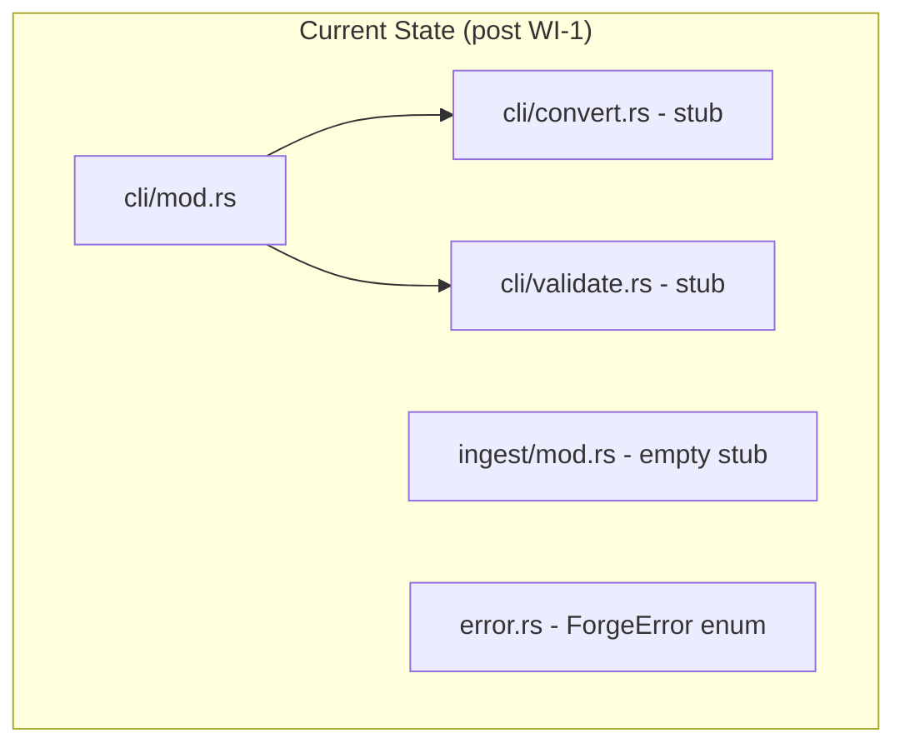
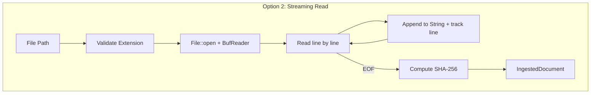
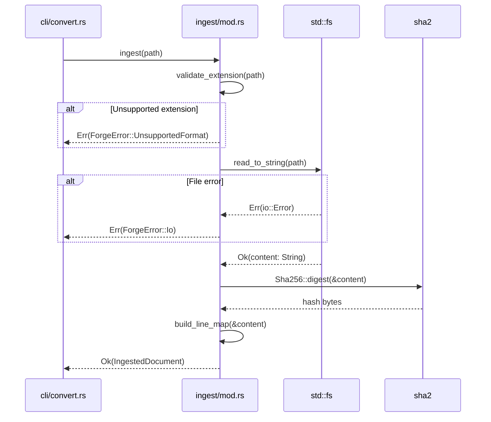
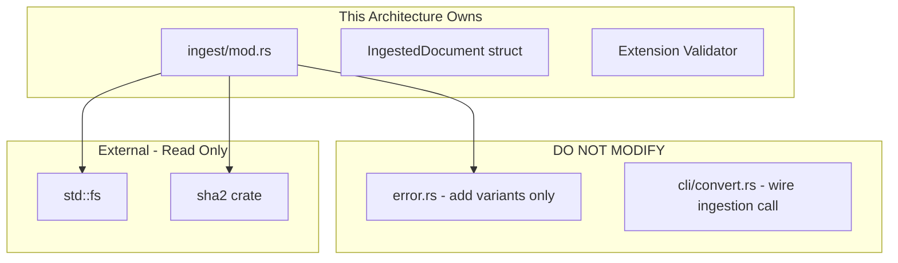

# 002-ar-markdown-ingestion

> **Document Type:** Architecture Review
> **Audience:** LLM agents, human reviewers
> **Status:** Proposed
> **Last Updated:** 2026-02-10 <!-- @auto -->
> **Owner:** Brian Luby <!-- @human-required -->
> **Deciders:** Brian Luby <!-- @human-required -->

---

## Review Tier Legend

| Marker | Tier | Speckit Behavior |
|--------|------|------------------|
| 🔴 `@human-required` | Human Generated | Prompt human to author; blocks until complete |
| 🟡 `@human-review` | LLM + Human Review | LLM drafts → prompt human to confirm/edit; blocks until confirmed |
| 🟢 `@llm-autonomous` | LLM Autonomous | LLM completes; no prompt; logged for audit |
| ⚪ `@auto` | Auto-generated | System fills (timestamps, links); no prompt |

---

## Document Completion Order

> ⚠️ **For LLM Agents:** Complete sections in this order. Do not fill downstream sections until upstream human-required inputs exist.

1. **Summary (Decision)** → requires human input first
2. **Context (Problem Space)** → requires human input
3. **Decision Drivers** → requires human input (prioritized)
4. **Driving Requirements** → extract from PRD, human confirms
5. **Options Considered** → LLM drafts after drivers exist, human reviews
6. **Decision (Selected + Rationale)** → requires human decision
7. **Implementation Guardrails** → LLM drafts, human reviews
8. **Everything else** → can proceed after decision is made

---

## Linkage ⚪ `@auto`

| Document | ID | Relationship |
|----------|-----|--------------|
| Parent PRD | [002-prd-markdown-ingestion](../PRD/002-prd-markdown-ingestion.md) | Requirements this architecture satisfies |
| Security Review | 002-sec-markdown-ingestion.md | Security implications of this decision |
| Supersedes | — | N/A |
| Superseded By | — | |

---

## Summary

### Decision 🔴 `@human-required`
> Use `pulldown-cmark` as an event-based Markdown parser with a thin ingestion layer that reads files via `std::fs::read_to_string`, validates format by extension, tracks line numbers with a simple offset map, and produces an `IngestedDocument` struct for downstream consumption.

### TL;DR for Agents 🟡 `@human-review`
> FORGE ingestion is a thin layer: read file, validate `.md`/`.markdown` extension, store raw content with a line-number offset map, and compute SHA-256 hash. Use `pulldown-cmark` (selected per roadmap Q2) for all Markdown parsing in this and downstream WIs. Do NOT implement structural extraction here — that is WI-3/WI-4. Do NOT accept PDF or DOCX input — Markdown only per ADR-001.

---

## Context

### Problem Space 🔴 `@human-required`
The FORGE CLI skeleton exists from WI-1 but has no ability to read documents from the filesystem. The conversion pipeline is completely blocked: no file can enter the system. This AR must decide how to implement the ingestion layer — specifically, the file reading strategy, format detection mechanism, Markdown parsing crate selection, and the data structure that carries ingested content into the structural extraction layer (WI-3, WI-4). The decision must balance simplicity (this is a small work item) against extensibility (the ingestion output feeds the entire pipeline).

### Decision Scope 🟡 `@human-review`

**This AR decides:**
- How files are read from disk (in-memory vs streaming)
- How input format is detected and validated
- Which Markdown parsing crate to use
- The shape of the `IngestedDocument` output struct
- How line number tracking is implemented

**This AR does NOT decide:**
- How headings are extracted into a section tree — deferred to 003-ar-structural-extraction-headings
- How clauses and tables are extracted — deferred to 004-ar-structural-extraction-clauses
- The domain model structure — deferred to 005-ar-domain-model
- Content hashing algorithm selection beyond SHA-256

### Current State 🟢 `@llm-autonomous`
WI-1 (project scaffolding) is complete. The project has a clap CLI with `convert` and `validate` subcommands, module stubs for `ingest/`, `parse/`, `model/`, `oscal/`, `validate/`, `export/`, and a `ForgeError` enum with thiserror. The `ingest` module is an empty stub. No file reading capability exists.



### Driving Requirements 🟡 `@human-review`

| PRD Req ID | Requirement Summary | Architectural Implication |
|------------|---------------------|---------------------------|
| M-1 | Read a Markdown file from filesystem path, return content as string | Must use `std::fs` or equivalent; output is a `String` |
| M-2 | Detect format by extension (.md, .markdown), reject unsupported | Format detection logic; error variant for unsupported format |
| M-3 | Preserve line number tracking (1-based) | Line map or offset tracking data structure |
| M-4 | Non-zero exit code and descriptive error for missing/unreadable files | Error handling integration with ForgeError |
| S-1 | Validate UTF-8 encoding | `read_to_string` naturally enforces this |
| S-2 | Record source file path and SHA-256 content hash | Hash computation; struct field for metadata |

**PRD Constraints inherited:**
- From ADR-001: Markdown-only input (no PDF, no DOCX)
- From constitution principle X: YAGNI — do not over-engineer the ingestion layer
- From constitution principle IV: TDD mandatory
- From constitution principle XI: Dependencies at latest stable versions

---

## Decision Drivers 🔴 `@human-required`

1. **Simplicity:** Ingestion is a thin layer; do not over-engineer *(constitution principle X, YAGNI)*
2. **Correctness:** Every line must map to its original source line number for traceability *(Parent PRD M-10)*
3. **Crate selection confidence:** The Markdown parser must be reliable, well-maintained, and CommonMark-compliant *(roadmap Q2 answer: pulldown-cmark)*
4. **Error quality:** File-not-found, permission denied, and unsupported format errors must be clear and actionable *(constitution principle VIII)*

---

## Options Considered 🟡 `@human-review`

### Option 0: Status Quo / Do Nothing

**Description:** Leave the `ingest` module as an empty stub. The CLI cannot read any files.

| Driver | Rating | Notes |
|--------|--------|-------|
| Simplicity | N/A | Nothing to evaluate |
| Correctness | ❌ Poor | No file can enter the pipeline |
| Crate selection | ❌ Poor | No parsing crate integrated |
| Error quality | ❌ Poor | No errors to report — command does nothing |

**Why not viable:** Every downstream WI (WI-3 through WI-50) depends on file ingestion existing.

---

### Option 1: In-Memory Read with `read_to_string` + pulldown-cmark (Recommended)

**Description:** Read the entire file into memory as a `String` using `std::fs::read_to_string` (which validates UTF-8). Detect format by file extension. Build a line offset map by scanning for newlines. Compute SHA-256 hash. Return an `IngestedDocument` struct. Add `pulldown-cmark` as a dependency for downstream use.

```mermaid
graph TD
    subgraph "Option 1: In-Memory Read"
        Input[File Path] --> Validate[Validate Extension]
        Validate -->|".md" / ".markdown"| Read[std::fs::read_to_string]
        Validate -->|other| Err1[ForgeError::UnsupportedFormat]
        Read -->|Ok| Hash[Compute SHA-256]
        Read -->|Err: not found| Err2[ForgeError::Io]
        Read -->|Err: not UTF-8| Err3[ForgeError::Io]
        Hash --> LineMap[Build Line Offset Map]
        LineMap --> Output[IngestedDocument]
    end
```

| Driver | Rating | Notes |
|--------|--------|-------|
| Simplicity | ✅ Good | Single function, ~50 lines of code |
| Correctness | ✅ Good | `read_to_string` validates UTF-8; line map is simple scan |
| Crate selection | ✅ Good | pulldown-cmark: MIT, pure Rust, CommonMark, well-maintained |
| Error quality | ✅ Good | `std::io::Error` maps cleanly to ForgeError variants |

**Pros:**
- Simplest possible implementation — one allocation, one read
- `read_to_string` provides automatic UTF-8 validation (satisfies S-1 for free)
- Policy documents are small (typically <1MB) — no need for streaming
- Line map construction is O(n) single pass
- pulldown-cmark is the most widely used Markdown parser in the Rust ecosystem

**Cons:**
- Entire file in memory — not suitable for very large files (>10MB)
- No streaming capability (acceptable per PRD A-2: documents typically under 1MB)

---

### Option 2: Streaming Read with BufReader + comrak

**Description:** Use `BufReader` to read the file line-by-line, building content and line map incrementally. Use `comrak` as the Markdown parser for full GFM support.



| Driver | Rating | Notes |
|--------|--------|-------|
| Simplicity | ⚠️ Medium | More code: BufReader, line iteration, incremental building |
| Correctness | ✅ Good | Line tracking is inherent in line-by-line reading |
| Crate selection | ⚠️ Medium | comrak: full GFM but larger dependency footprint |
| Error quality | ✅ Good | Same error handling capability |

**Pros:**
- Handles very large files with constant memory
- Line-by-line reading naturally provides line tracking
- comrak has full GFM support out of the box

**Cons:**
- Over-engineered for <1MB policy documents — violates YAGNI
- Multiple allocations per line (String per line + final concatenation)
- comrak has a larger dependency tree than pulldown-cmark
- Streaming adds complexity without measurable benefit for the expected workload

---

## Decision

### Selected Option 🔴 `@human-required`
> **Option 1: In-Memory Read with `read_to_string` + pulldown-cmark**

### Rationale 🔴 `@human-required`
Option 1 is the simplest approach that meets all Must Have requirements. Policy documents are small text files — in-memory reading is the obvious choice. `read_to_string` gives us UTF-8 validation for free. The line offset map is a trivial O(n) scan. pulldown-cmark was explicitly selected in the roadmap (Q2 answer) and is the de facto standard Markdown parser in Rust. Streaming (Option 2) adds complexity for a hypothetical large-file scenario that violates YAGNI — the roadmap explicitly sizes policy documents at <1MB (PRD A-2) and the performance benchmark target (WI-24) is 50 pages, well within memory bounds.

#### Simplest Implementation Comparison 🟡 `@human-review`

| Aspect | Simplest Possible | Selected Option | Justification for Complexity |
|--------|-------------------|-----------------|------------------------------|
| File reading | `read_to_string` only | `read_to_string` + extension check | PRD M-2 requires format detection |
| Dependencies | stdlib only | stdlib + sha2 + pulldown-cmark | PRD S-2 requires hash; pulldown-cmark needed by WI-3/WI-4 |
| Line tracking | None | Line offset map | PRD M-3 requires line number preservation |
| Data structure | Raw String | IngestedDocument struct | PRD M-3, S-2 require structured output |

**Complexity justified by:** Each addition beyond the simplest `read_to_string` is directly required by a PRD requirement (M-2 format detection, M-3 line tracking, S-2 content hash).

### Architecture Diagram 🟡 `@human-review`

```mermaid
graph TD
    subgraph "Ingestion Layer (WI-2)"
        Input[File Path from CLI] --> ExtCheck[Extension Validator]
        ExtCheck -->|".md" / ".markdown"| FileRead[File Reader - read_to_string]
        ExtCheck -->|unsupported| ErrFormat[ForgeError::UnsupportedFormat]
        FileRead -->|Ok: String| HashCalc[SHA-256 Hash Calculator]
        FileRead -->|Err| ErrIo[ForgeError::Io]
        HashCalc --> LineMapper[Line Offset Map Builder]
        LineMapper --> DocBuilder[IngestedDocument Constructor]
        DocBuilder --> Output[IngestedDocument]
    end

    subgraph "Downstream (WI-3, WI-4)"
        Output --> WI3[Heading Extraction]
        Output --> WI4[Clause Extraction]
    end
```

---

## Technical Specification

### Component Overview 🟡 `@human-review`

| Component | Responsibility | Interface | Dependencies |
|-----------|---------------|-----------|--------------|
| Extension Validator | Check file extension is `.md` or `.markdown` (case-insensitive) | `validate_extension(path) -> Result<(), ForgeError>` | std::path |
| File Reader | Read file content as UTF-8 string | `std::fs::read_to_string` | std::fs |
| SHA-256 Hash Calculator | Compute content hash for traceability | `compute_hash(content) -> String` | sha2 crate |
| Line Offset Map Builder | Build line-number-to-offset mapping | `build_line_map(content) -> Vec<SourceLine>` | None |
| IngestedDocument Constructor | Assemble all data into output struct | `ingest(path) -> Result<IngestedDocument, ForgeError>` | All above |

### Data Flow 🟢 `@llm-autonomous`



### Interface Definitions 🟡 `@human-review`

```rust
use std::path::{Path, PathBuf};

/// Result of ingesting a source document from the filesystem.
pub struct IngestedDocument {
    /// Original filesystem path
    pub file_path: PathBuf,
    /// Raw file content (UTF-8 validated)
    pub content: String,
    /// SHA-256 hex digest of content
    pub content_hash: String,
    /// Lines with 1-based line numbers
    pub lines: Vec<SourceLine>,
}

/// A single line from the source document with its line number.
pub struct SourceLine {
    /// 1-based line number in the source file
    pub line_number: usize,
    /// Text content of this line (without trailing newline)
    pub text: String,
}

/// Ingest a Markdown document from the filesystem.
///
/// Validates the file extension, reads the file as UTF-8,
/// computes a SHA-256 hash, and builds a line map.
///
/// # Errors
///
/// Returns `ForgeError::UnsupportedFormat` if the file extension
/// is not `.md` or `.markdown`.
/// Returns `ForgeError::Io` if the file cannot be read.
pub fn ingest(path: &Path) -> Result<IngestedDocument, ForgeError>;
```

### Key Algorithms/Patterns 🟡 `@human-review`

**Pattern:** Line Offset Map Construction
```
1. Read entire file content as String
2. Split content on '\n' boundaries
3. For each line, record (1-based line number, text)
4. Return Vec<SourceLine>
```

**Pattern:** Extension Validation
```
1. Extract extension from path via path.extension()
2. Convert to lowercase for case-insensitive comparison
3. Match against ["md", "markdown"]
4. Return Ok(()) or Err(ForgeError::UnsupportedFormat)
```

---

## Constraints & Boundaries

### Technical Constraints 🟡 `@human-review`

**Inherited from PRD:**
- Markdown-only input per ADR-001
- Rust latest stable toolchain
- TDD mandatory (constitution principle IV)
- Dependencies at latest stable versions (constitution principle XI)

**Added by this Architecture:**
- File reading uses `std::fs::read_to_string` (in-memory, not streaming)
- Maximum practical file size: ~10MB (no explicit enforcement; larger files will work but use proportional memory)
- SHA-256 via the `sha2` crate (pure Rust, MIT licensed)
- pulldown-cmark added as dependency but not used in ingestion — consumed by WI-3 and WI-4

### Architectural Boundaries 🟡 `@human-review`



- **Owns:** `ingest/mod.rs`, `IngestedDocument` and `SourceLine` types
- **Interfaces With:** `error.rs` (add `UnsupportedFormat` variant), `cli/convert.rs` (call `ingest`)
- **Must Not Touch:** `parse/`, `model/`, `oscal/`, `validate/`, `export/` modules

### Implementation Guardrails 🟡 `@human-review`

> ⚠️ **Critical for LLM Agents:**

- [ ] **DO NOT** implement Markdown structural parsing (headings, lists, tables) in this WI — ingestion reads raw content only *(scope boundary: WI-3, WI-4)*
- [ ] **DO NOT** accept PDF, DOCX, or any non-Markdown format — return `ForgeError::UnsupportedFormat` *(ADR-001)*
- [ ] **DO NOT** use streaming/BufReader — `read_to_string` is sufficient *(YAGNI, constitution principle X)*
- [ ] **DO NOT** add pulldown-cmark parsing logic in the ingest module — it is a dependency for downstream WIs only
- [ ] **MUST** validate file extension case-insensitively (`.MD`, `.Md` are valid) *(PRD EC-5)*
- [ ] **MUST** return descriptive error messages that suggest external converters for PDF/DOCX *(PRD C-1)*
- [ ] **MUST** use 1-based line numbers in SourceLine *(PRD M-3)*
- [ ] **MUST** write tests before implementation (TDD) *(constitution principle IV)*

---

## Consequences 🟡 `@human-review`

### Positive
- Minimal code footprint (~50-80 lines) — easy to review, test, and maintain
- UTF-8 validation is free via `read_to_string`
- Line map provides foundation for all downstream traceability (Parent PRD M-10)
- SHA-256 hash enables content-based caching and change detection
- pulldown-cmark dependency unlocked for WI-3 and WI-4

### Negative
- Entire file loaded into memory — not suitable for multi-gigabyte files (not a realistic concern for policy documents)
- No format auto-detection from content — relies entirely on file extension

### Risks & Mitigations

| Risk | Likelihood | Impact | Mitigation |
|------|------------|--------|------------|
| Non-UTF-8 files cause confusing errors | Low | Low | `read_to_string` returns `io::Error` with "invalid UTF-8" message; wrap with context |
| File extension is missing | Low | Low | Treat as unsupported format with helpful error |
| sha2 crate adds unwanted dependency weight | Low | Low | sha2 is pure Rust, well-maintained, minimal transitive deps |

---

## Implementation Guidance

### Suggested Implementation Order 🟢 `@llm-autonomous`
1. Add `sha2` and `pulldown-cmark` to `Cargo.toml`
2. Define `IngestedDocument` and `SourceLine` structs in `ingest/mod.rs`
3. Add `UnsupportedFormat` variant to `ForgeError` in `error.rs`
4. Implement `validate_extension` (private helper)
5. Implement `build_line_map` (private helper)
6. Implement `compute_hash` (private helper)
7. Implement public `ingest(path: &Path)` function composing the above
8. Wire `ingest` call into `cli/convert.rs`
9. Write unit tests for all happy paths and error cases

### Testing Strategy 🟢 `@llm-autonomous`

| Layer | Test Type | Coverage Target | Notes |
|-------|-----------|-----------------|-------|
| Unit | Extension validation | 100% | .md, .markdown, .MD, .pdf, .docx, no extension |
| Unit | File reading | Happy path + errors | Real temp files; test missing file, empty file |
| Unit | Line map construction | 100% | 0 lines, 1 line, multi-line, trailing newline |
| Unit | SHA-256 hash | Deterministic | Same content produces same hash |
| Integration | CLI `forge convert` | Happy path + error | Verify exit codes and error messages |

### Reference Implementations 🟡 `@human-review`
- `std::fs::read_to_string` documentation *(internal — Rust stdlib)*
- `sha2` crate README for digest computation *(external — requires human approval)*

### Anti-patterns to Avoid 🟡 `@human-review`
- **Don't:** Read the file as bytes and manually check encoding
  - **Why:** Duplicates what `read_to_string` already does; adds code with no benefit
  - **Instead:** Let `read_to_string` handle UTF-8 validation; wrap the error with context
- **Don't:** Parse Markdown structure (headings, lists) in the ingest module
  - **Why:** Violates scope boundaries; ingestion is file I/O only
  - **Instead:** Return raw content; let WI-3 and WI-4 handle structural extraction
- **Don't:** Accept any file extension and guess format from content
  - **Why:** Error-prone; harder to give actionable error messages
  - **Instead:** Explicit extension matching with clear error messages per ADR-001

---

## Compliance & Cross-cutting Concerns

### Security Considerations 🟡 `@human-review`
- Authentication: N/A — local CLI tool
- Authorization: N/A
- Data handling: Policy documents may contain sensitive content; no data leaves the local filesystem
- Path handling: Use `Path` APIs; do not manually construct paths from strings; canonicalize before reading to prevent symlink traversal

### Observability 🟢 `@llm-autonomous`
- **Logging:** Not yet needed; `tracing` will be added in a later sprint
- **Metrics:** N/A for ingestion
- **Tracing:** N/A for ingestion

### Error Handling Strategy 🟢 `@llm-autonomous`
```
Error Category → Handling Approach
├── File not found → ForgeError::Io with "file not found" context
├── Permission denied → ForgeError::Io with "permission denied" context
├── Invalid UTF-8 → ForgeError::Io with "invalid UTF-8 encoding" context
├── Unsupported format → ForgeError::UnsupportedFormat with suggestion
└── Empty file → Not an error; return IngestedDocument with empty content
```

---

## Migration Plan (if applicable) 🟡 `@human-review`

N/A — greenfield implementation on top of WI-1 scaffolding. No migration required.

### Rollback Plan 🔴 `@human-required`

N/A — greenfield ingestion layer. If the approach proves wrong, the ingest module is small enough (~50-80 lines) to rewrite entirely. Rollback cost is negligible.

---

## Open Questions 🟡 `@human-review`

No open questions for this work item.

---

## Changelog ⚪ `@auto`

| Version | Date | Author | Changes |
|---------|------|--------|---------|
| 0.1 | 2026-02-10 | LLM (Claude) | Initial proposal |

---

## Decision Record ⚪ `@auto`

| Date | Event | Details |
|------|-------|---------|
| 2026-02-10 | Proposed | Initial draft created from PRD 002 |

---

## Traceability Matrix 🟢 `@llm-autonomous`

| PRD Req ID | Decision Driver | Option Rating | Component | Notes |
|------------|-----------------|---------------|-----------|-------|
| M-1 | Simplicity | Option 1: ✅ | File Reader | `read_to_string` reads file as String |
| M-2 | Error quality | Option 1: ✅ | Extension Validator | Case-insensitive .md/.markdown check |
| M-3 | Correctness | Option 1: ✅ | Line Offset Map Builder | 1-based line numbers via newline scan |
| M-4 | Error quality | Option 1: ✅ | ingest() function | Maps io::Error to ForgeError with context |
| S-1 | Correctness | Option 1: ✅ | File Reader | `read_to_string` validates UTF-8 automatically |
| S-2 | Correctness | Option 1: ✅ | SHA-256 Hash Calculator | sha2 crate computes deterministic hash |

---

## Review Checklist 🟢 `@llm-autonomous`

Before marking as Accepted:
- [x] All PRD Must Have requirements appear in Driving Requirements
- [x] Option 0 (Status Quo) is documented
- [x] Simplest Implementation comparison is completed
- [x] Decision drivers are prioritized and addressed
- [x] At least 2 options were seriously considered
- [x] Constraints distinguish inherited vs. new
- [x] Component names are consistent across all diagrams and tables
- [x] Implementation guardrails reference specific PRD constraints
- [x] Rollback triggers and authority are defined (N/A — greenfield)
- [x] Security review is linked or N/A documented
- [x] No open questions blocking implementation
