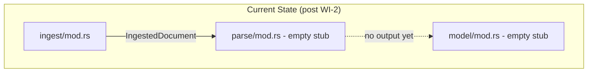
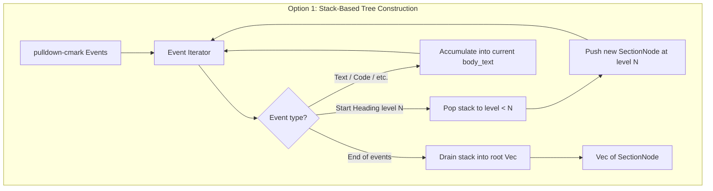
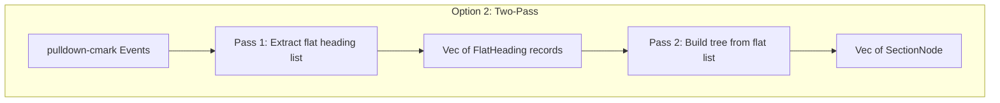
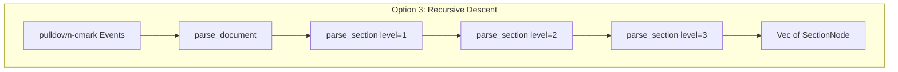
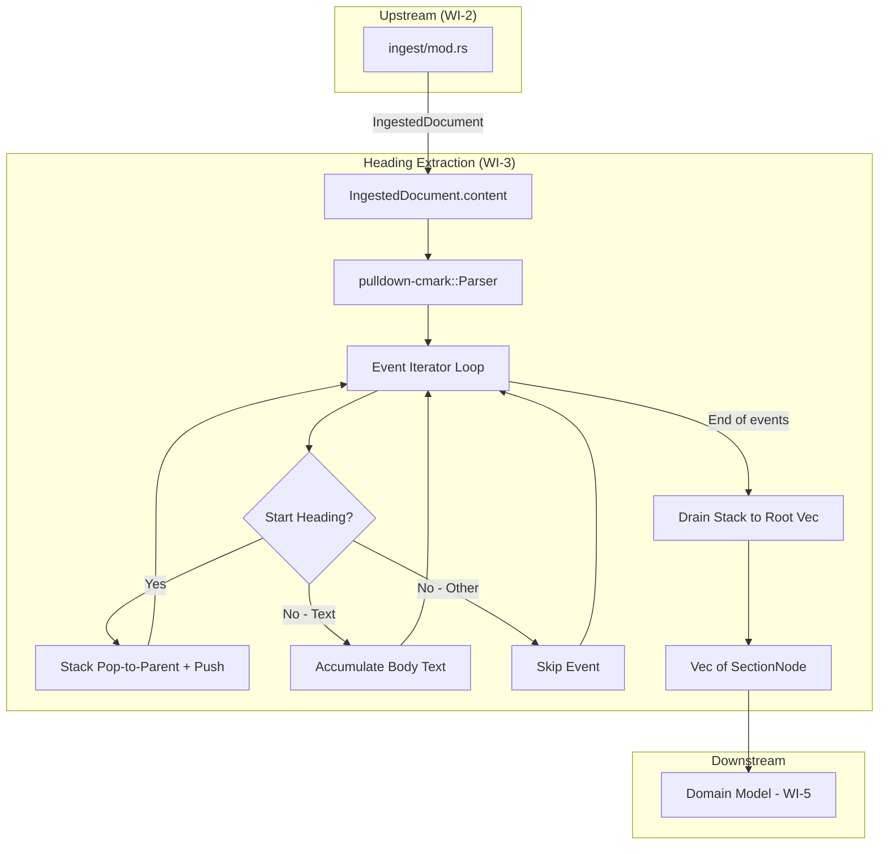
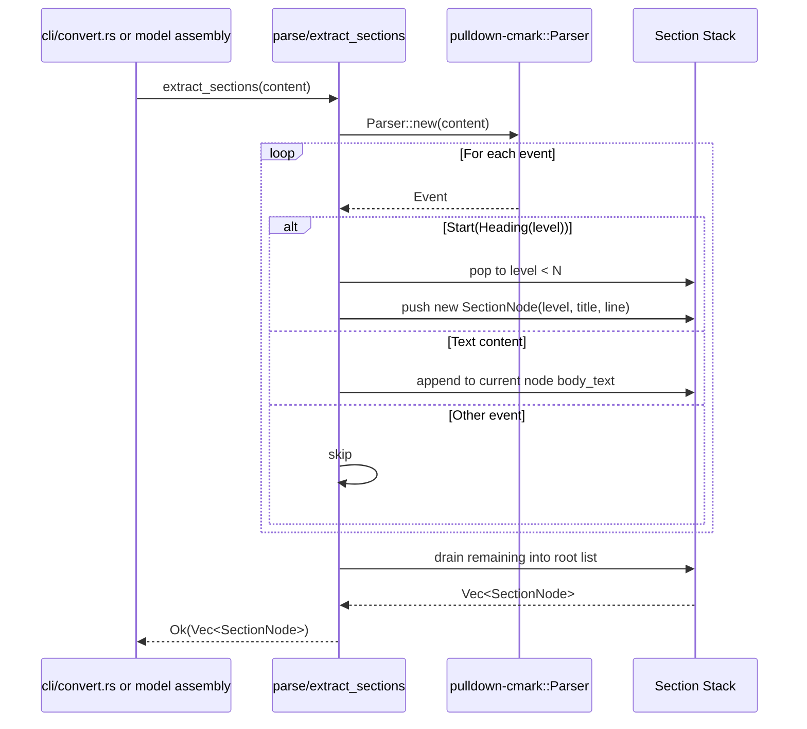
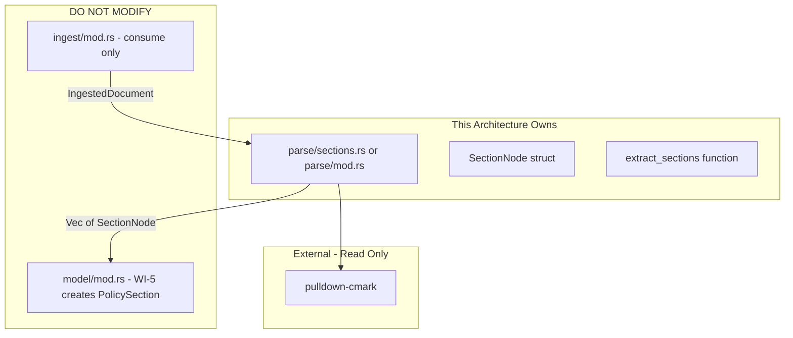

# 003-ar-structural-extraction-headings

> **Document Type:** Architecture Review
> **Audience:** LLM agents, human reviewers
> **Status:** Proposed
> **Last Updated:** 2026-02-10 <!-- @auto -->
> **Owner:** Brian Luby <!-- @human-required -->
> **Deciders:** Brian Luby <!-- @human-required -->

---

## Review Tier Legend

| Marker | Tier | Speckit Behavior |
|--------|------|------------------|
| 🔴 `@human-required` | Human Generated | Prompt human to author; blocks until complete |
| 🟡 `@human-review` | LLM + Human Review | LLM drafts → prompt human to confirm/edit; blocks until confirmed |
| 🟢 `@llm-autonomous` | LLM Autonomous | LLM completes; no prompt; logged for audit |
| ⚪ `@auto` | Auto-generated | System fills (timestamps, links); no prompt |

---

## Document Completion Order

> ⚠️ **For LLM Agents:** Complete sections in this order. Do not fill downstream sections until upstream human-required inputs exist.

1. **Summary (Decision)** → requires human input first
2. **Context (Problem Space)** → requires human input
3. **Decision Drivers** → requires human input (prioritized)
4. **Driving Requirements** → extract from PRD, human confirms
5. **Options Considered** → LLM drafts after drivers exist, human reviews
6. **Decision (Selected + Rationale)** → requires human decision
7. **Implementation Guardrails** → LLM drafts, human reviews
8. **Everything else** → can proceed after decision is made

---

## Linkage ⚪ `@auto`

| Document | ID | Relationship |
|----------|-----|--------------|
| Parent PRD | [003-prd-structural-extraction-headings](../PRD/003-prd-structural-extraction-headings.md) | Requirements this architecture satisfies |
| Security Review | 003-sec-structural-extraction-headings.md | Security implications of this decision |
| Supersedes | — | N/A |
| Superseded By | — | |

---

## Summary

### Decision 🔴 `@human-required`
> Use a stack-based tree construction algorithm that consumes `pulldown-cmark` heading events to build a `Vec<SectionNode>` hierarchy, where each node records its title, heading level (1-6), source line number, optional body text, and child sections.

### TL;DR for Agents 🟡 `@human-review`
> Heading extraction iterates `pulldown-cmark` events using a stack-based algorithm. When a `Start(Heading)` event is encountered, push a new `SectionNode` onto the stack; when the heading level is equal to or higher than the current stack top, pop back to the correct parent. The result is a `Vec<SectionNode>` tree. Do NOT extract lists or tables here — that is WI-4. Do NOT construct `PolicySection` domain model structs — that is WI-5. Handle irregular heading levels (H1 directly to H3) by treating the deeper heading as a child of the nearest shallower heading.

---

## Context

### Problem Space 🔴 `@human-required`
After ingestion (WI-2), the Markdown content is a flat stream of text. To generate OSCAL Catalog groups, the pipeline needs to understand the document's hierarchical structure — which sections contain which subsections. Markdown headings (H1-H6) define this hierarchy. The architectural challenge is choosing how to traverse the pulldown-cmark event stream and construct a tree from a linear sequence of heading events, especially when real-world documents may skip heading levels (e.g., H1 directly to H3), have multiple top-level headings, or have no headings at all.

### Decision Scope 🟡 `@human-review`

**This AR decides:**
- The algorithm for constructing a section tree from pulldown-cmark heading events
- The data structure for section nodes (title, level, line number, body, children)
- How irregular heading nesting (skipped levels) is handled
- How body text between headings is captured and attributed

**This AR does NOT decide:**
- Extraction of lists, bullet points, and tables — deferred to 004-ar-structural-extraction-clauses
- The `PolicySection` domain model struct — deferred to 005-ar-domain-model
- How sections map to OSCAL Catalog groups — deferred to 009-ar-catalog-groups-controls

### Current State 🟢 `@llm-autonomous`
WI-1 (scaffolding) provides the project structure with a `parse/` module stub. WI-2 (ingestion) provides an `IngestedDocument` with raw Markdown content and line number tracking. The `parse` module is an empty stub. No Markdown structural extraction exists.



### Driving Requirements 🟡 `@human-review`

| PRD Req ID | Requirement Summary | Architectural Implication |
|------------|---------------------|---------------------------|
| M-1 | Extract all Markdown headings (H1-H6) into hierarchical section tree | Tree data structure; pulldown-cmark event traversal |
| M-2 | Each section includes title text, heading level, source line number | SectionNode struct with these fields |
| M-3 | Parent-child relationships: heading N is child of nearest heading N-1 or lower | Stack-based or recursive tree construction algorithm |
| M-4 | Handle irregular heading nesting without panicking or losing sections | Robust algorithm for skipped levels |
| S-1 | Capture text content between headings as section body | Body text accumulation between heading events |
| S-2 | Section tree printable as debug output | `Debug` derive on SectionNode |

**PRD Constraints inherited:**
- From constitution principle IV: TDD mandatory
- From constitution principle X: YAGNI — simple tree, no premature abstractions
- From PRD technical constraints: O(n) performance in document size

---

## Decision Drivers 🔴 `@human-required`

1. **Correctness:** The tree must accurately reflect the heading hierarchy for all well-formed and irregular documents *(PRD M-1, M-3, M-4)*
2. **Simplicity:** A single-pass O(n) algorithm with minimal state *(constitution principle X, PRD performance constraint)*
3. **Robustness:** No panics or data loss on irregular input (skipped levels, no headings, multiple H1s) *(PRD M-4)*
4. **Traceability:** Every section node must track its source line number for downstream OSCAL traceability *(Parent PRD M-10)*

---

## Options Considered 🟡 `@human-review`

### Option 0: Status Quo / Do Nothing

**Description:** Leave the `parse` module empty. No heading extraction.

| Driver | Rating | Notes |
|--------|--------|-------|
| Correctness | ❌ Poor | No section tree produced |
| Simplicity | N/A | Nothing to evaluate |
| Robustness | ❌ Poor | No functionality |
| Traceability | ❌ Poor | No section-level line tracking |

**Why not viable:** The domain model (WI-5), OSCAL Catalog generation (WI-9), and all downstream WIs require a section hierarchy.

---

### Option 1: Stack-Based Tree Construction (Recommended)

**Description:** Iterate through pulldown-cmark events in a single pass. Maintain a stack of `(heading_level, SectionNode)` pairs. When a new heading event is encountered at level N, pop the stack until the top has level < N, then push the new section as a child of the new top. Between heading events, accumulate text into the current section's body_text. Convert source byte offsets to line numbers using the line map from WI-2.



| Driver | Rating | Notes |
|--------|--------|-------|
| Correctness | ✅ Good | Stack naturally handles nesting; pop-to-level handles skips |
| Simplicity | ✅ Good | Single pass, O(n), ~80-100 lines |
| Robustness | ✅ Good | Skipped levels handled by pop semantics; no panics |
| Traceability | ✅ Good | Source offset from pulldown-cmark events → line number via map |

**Pros:**
- Single-pass O(n) — processes each event exactly once
- Stack semantics naturally model heading nesting
- Handles skipped levels gracefully (H1 → H3: H3 becomes child of H1)
- Handles multiple H1s (each starts a new top-level section)
- Well-understood pattern for tree construction from a linear stream

**Cons:**
- Requires careful stack management (off-by-one potential in level comparison)
- Body text accumulation requires tracking "current section" state

---

### Option 2: Two-Pass with Flat List then Tree Assembly

**Description:** First pass: extract all headings into a flat list with (level, title, line_number, body_range). Second pass: iterate the flat list and build the tree by comparing levels.



| Driver | Rating | Notes |
|--------|--------|-------|
| Correctness | ✅ Good | Two separate concerns: extraction and tree building |
| Simplicity | ⚠️ Medium | Two passes; intermediate FlatHeading type; more code |
| Robustness | ✅ Good | Same handling of irregular levels in pass 2 |
| Traceability | ✅ Good | Same line number tracking |

**Pros:**
- Cleaner separation of extraction and tree building
- Flat list is easier to test independently
- Second pass operates on simple data (no event stream parsing)

**Cons:**
- Two passes over the data (O(2n) — still linear but unnecessary work)
- Intermediate `FlatHeading` struct adds a type with no downstream use
- More total code for the same result
- Body text range tracking between headings is more complex with a flat list

---

### Option 3: Recursive Descent Parser

**Description:** Implement a recursive descent parser that consumes pulldown-cmark events. Each level calls a function like `parse_section(level)` that recursively calls itself for deeper headings.



| Driver | Rating | Notes |
|--------|--------|-------|
| Correctness | ✅ Good | Recursive structure mirrors heading nesting |
| Simplicity | ⚠️ Medium | Recursive functions; stack depth limited to 6 but harder to reason about |
| Robustness | ⚠️ Medium | Skipped levels require special handling in recursion; more complex edge cases |
| Traceability | ✅ Good | Same line number tracking |

**Pros:**
- Conceptually clean mapping from heading levels to recursion depth
- Natural for tree construction

**Cons:**
- Harder to handle irregular nesting (H1 → H3 skip requires backtracking or special cases)
- Need to pass mutable event iterator through recursive calls (lifetime complexity in Rust)
- More cognitive overhead for maintainers than a simple stack loop
- Over-engineered for 6 levels of headings

---

## Decision

### Selected Option 🔴 `@human-required`
> **Option 1: Stack-Based Tree Construction**

### Rationale 🔴 `@human-required`
Option 1 is the simplest single-pass algorithm that correctly handles all heading patterns including irregular nesting. The stack-based approach is a well-known pattern for constructing trees from linear streams — it naturally handles "pop to parent level" semantics that make skipped heading levels work correctly. Option 2 adds an unnecessary intermediate representation and second pass. Option 3 introduces recursive complexity with Rust lifetime challenges (mutable iterator through recursive calls) for no measurable benefit. For a maximum of 6 heading levels and typical documents with dozens of headings, all options have equivalent performance — simplicity is the differentiator.

#### Simplest Implementation Comparison 🟡 `@human-review`

| Aspect | Simplest Possible | Selected Option | Justification for Complexity |
|--------|-------------------|-----------------|------------------------------|
| Data structure | Flat list of headings | Tree of SectionNode | PRD M-3 requires parent-child relationships |
| Algorithm | Regex heading match | Stack-based event processing | PRD M-4 requires robustness; regex fails in code blocks |
| Body text | Ignore non-heading content | Accumulate between headings | PRD S-1 requires body text capture |
| Line numbers | No tracking | Offset-to-line conversion | PRD M-2 requires source line numbers |

**Complexity justified by:** The tree structure (vs flat list) is required by PRD M-3 (parent-child relationships). The event-based approach (vs regex) is required by PRD M-4 (robustness with irregular nesting and code blocks containing `#` characters).

### Architecture Diagram 🟡 `@human-review`



---

## Technical Specification

### Component Overview 🟡 `@human-review`

| Component | Responsibility | Interface | Dependencies |
|-----------|---------------|-----------|--------------|
| SectionNode | Data structure for section tree nodes | Struct with title, level, line, body, children | None |
| Event Iterator | Iterate pulldown-cmark events from content | `pulldown-cmark::Parser::new(content)` | pulldown-cmark |
| Stack-Based Builder | Construct section tree from heading events | `extract_sections(content) -> Result<Vec<SectionNode>, ForgeError>` | pulldown-cmark |
| Offset-to-Line Converter | Convert byte offsets to 1-based line numbers | `offset_to_line(offset, content) -> usize` | None |

### Data Flow 🟢 `@llm-autonomous`



### Interface Definitions 🟡 `@human-review`

```rust
/// A node in the section hierarchy tree, representing one Markdown heading
/// and its associated content.
#[derive(Debug, Clone, PartialEq)]
pub struct SectionNode {
    /// Heading title text (e.g., "Access Control" from "## Access Control")
    pub title: String,
    /// Heading level: 1 for H1, 2 for H2, ..., 6 for H6
    pub heading_level: u8,
    /// Source line number in the original document (1-based)
    pub source_line: usize,
    /// Text content between this heading and the next heading (if any)
    pub body_text: Option<String>,
    /// Child sections (headings at deeper levels nested under this one)
    pub children: Vec<SectionNode>,
}

/// Extract a hierarchical section tree from Markdown content.
///
/// Parses the content using pulldown-cmark, identifies heading events,
/// and constructs a tree where deeper headings are children of shallower ones.
///
/// # Arguments
/// * `content` - Raw Markdown content string
///
/// # Returns
/// A vector of top-level SectionNode trees. Multiple H1 headings produce
/// multiple top-level entries.
///
/// # Errors
/// Returns `ForgeError::Parse` if the content cannot be parsed.
pub fn extract_sections(content: &str) -> Result<Vec<SectionNode>, ForgeError>;
```

### Key Algorithms/Patterns 🟡 `@human-review`

**Pattern:** Stack-Based Heading Tree Construction
```
Algorithm: extract_sections(content)
Input: Markdown content string
Output: Vec<SectionNode> — forest of section trees

1. Initialize empty stack: Vec<(u8, SectionNode)>
2. Initialize empty root list: Vec<SectionNode>
3. For each (event, range) in pulldown-cmark::Parser::new(content):
   a. If event is Start(Heading { level, .. }):
      - Convert range.start byte offset to line number
      - Collect text events until End(Heading)
      - Create new SectionNode { title, level, source_line, body: None, children: [] }
      - While stack.last().level >= level:
        * Pop (popped_level, popped_node) from stack
        * If stack is empty: push popped_node to root list
        * Else: push popped_node to stack.last().children
      - Push new node onto stack
   b. If event is Text/Code/SoftBreak and stack is non-empty:
      - Append to stack.last().body_text
   c. Otherwise: skip
4. Drain stack (pop all remaining, attaching to parents or root list)
5. Return root list
```

**Complexity:** O(n) where n = number of events. Each event is processed once. Stack operations are bounded by heading depth (max 6).

---

## Constraints & Boundaries

### Technical Constraints 🟡 `@human-review`

**Inherited from PRD:**
- Rust latest stable toolchain
- pulldown-cmark as Markdown parser (selected in WI-2)
- TDD mandatory (constitution principle IV)
- O(n) performance in document size (PRD technical constraint)

**Added by this Architecture:**
- SectionNode is the output type — not `PolicySection` (that is WI-5 domain model)
- Stack-based single-pass construction — no multi-pass or recursive descent
- Source line numbers derived from pulldown-cmark byte offset ranges
- Empty documents produce an empty `Vec<SectionNode>`

### Architectural Boundaries 🟡 `@human-review`



- **Owns:** `parse/` module (heading extraction logic), `SectionNode` struct
- **Interfaces With:** `ingest/mod.rs` (consumes IngestedDocument.content), `model/` (downstream consumer in WI-5)
- **Must Not Touch:** `ingest/`, `model/`, `oscal/`, `cli/` (except wiring the call)

### Implementation Guardrails 🟡 `@human-review`

> ⚠️ **Critical for LLM Agents:**

- [ ] **DO NOT** extract lists, tables, or clause content — that is WI-4 *(scope boundary: 004-ar-structural-extraction-clauses)*
- [ ] **DO NOT** create `PolicySection` structs from the domain model — that is WI-5 *(scope boundary: 005-ar-domain-model)*
- [ ] **DO NOT** use regex for heading detection — pulldown-cmark events are the correct approach *(PRD M-4 robustness)*
- [ ] **DO NOT** panic on irregular heading levels — handle gracefully *(PRD M-4)*
- [ ] **MUST** produce correct parent-child relationships for all heading level combinations *(PRD M-3)*
- [ ] **MUST** preserve source line numbers on every SectionNode *(PRD M-2)*
- [ ] **MUST** handle documents with no headings (return empty Vec) *(PRD EC-1)*
- [ ] **MUST** handle documents starting with deep headings (e.g., H3 first) *(PRD EC-2)*
- [ ] **MUST** write tests before implementation (TDD) *(constitution principle IV)*

---

## Consequences 🟡 `@human-review`

### Positive
- Single-pass O(n) algorithm — efficient even for large documents
- Stack-based approach handles all heading irregularities naturally
- `SectionNode` is a clean intermediate type that decouples parsing from domain model
- Correct body text attribution gives downstream WIs section content to work with
- Foundation for OSCAL group generation in WI-9

### Negative
- SectionNode is an intermediate type that will be converted to PolicySection in WI-5 — one mapping step
- Body text accumulation captures all non-heading content (including lists/tables) as raw text; WI-4 will re-parse this content for clause extraction

### Risks & Mitigations

| Risk | Likelihood | Impact | Mitigation |
|------|------------|--------|------------|
| Off-by-one in stack level comparison | Med | Med | Comprehensive unit tests with all level combinations |
| pulldown-cmark offset accuracy for line numbers | Low | Med | Test with known documents; verify line numbers against manual count |
| Body text duplication with WI-4 clause extraction | Low | Low | Body text is optional; WI-4 can work from the same content independently |

---

## Implementation Guidance

### Suggested Implementation Order 🟢 `@llm-autonomous`
1. Define `SectionNode` struct in `parse/mod.rs` (or `parse/sections.rs`)
2. Implement `offset_to_line` helper to convert byte offsets to line numbers
3. Write failing tests for basic heading extraction (single H1, H1+H2, H1+H2+H3)
4. Implement `extract_sections` with stack-based algorithm
5. Write tests for irregular nesting (H1→H3 skip, H3 as first heading, multiple H1s)
6. Write tests for body text capture between headings
7. Write tests for edge cases (no headings, empty headings, deeply nested)
8. Wire `extract_sections` into the pipeline (called from convert handler)

### Testing Strategy 🟢 `@llm-autonomous`

| Layer | Test Type | Coverage Target | Notes |
|-------|-----------|-----------------|-------|
| Unit | Basic heading extraction | 100% | H1 only, H1+H2, H1+H2+H3 |
| Unit | Irregular nesting | 100% | H1→H3 skip, H3 first, multiple H1s |
| Unit | Body text capture | 100% | Text between headings, empty sections |
| Unit | Edge cases | 100% | No headings, empty heading text, H6 |
| Unit | Line number accuracy | 100% | Verify against known fixtures |
| Integration | Full pipeline | Happy path | Ingest → extract → verify tree |

### Reference Implementations 🟡 `@human-review`
- pulldown-cmark event iteration: `Parser::new_ext(content, Options::empty())` *(internal — crate API)*
- pulldown-cmark offset tracking: `Parser::new(content).into_offset_iter()` for byte ranges *(internal — crate API)*

### Anti-patterns to Avoid 🟡 `@human-review`
- **Don't:** Use regex like `/^#{1,6}\s/` to find headings
  - **Why:** Fails when `#` appears in code blocks, HTML comments, or link anchors
  - **Instead:** Use pulldown-cmark `Start(Heading)` events which handle all edge cases
- **Don't:** Build a flat list and then convert to a tree in a second pass
  - **Why:** Unnecessary complexity; single-pass stack is simpler and more efficient
  - **Instead:** Build the tree directly during the event iteration
- **Don't:** Assume strict heading nesting (H1 → H2 → H3 → ...)
  - **Why:** Real-world documents skip levels; the parser must be tolerant
  - **Instead:** Pop stack to the nearest valid parent level

---

## Compliance & Cross-cutting Concerns

### Security Considerations 🟡 `@human-review`
- Authentication: N/A — local CLI tool
- Authorization: N/A
- Data handling: Parsing already-ingested trusted content; no new external input processed

### Observability 🟢 `@llm-autonomous`
- **Logging:** Not yet needed; add `tracing` in a later sprint
- **Metrics:** N/A for heading extraction
- **Tracing:** N/A for heading extraction

### Error Handling Strategy 🟢 `@llm-autonomous`
```
Error Category → Handling Approach
├── Empty content → Return empty Vec<SectionNode> (not an error)
├── No headings found → Return empty Vec<SectionNode> (not an error)
├── Irregular heading levels → Handle gracefully via stack semantics
└── pulldown-cmark parse failure → ForgeError::Parse (unlikely for valid UTF-8)
```

---

## Migration Plan (if applicable) 🟡 `@human-review`

N/A — greenfield implementation on top of WI-1 scaffolding and WI-2 ingestion.

### Rollback Plan 🔴 `@human-required`

N/A — greenfield heading extraction. If the stack-based algorithm proves inadequate, the `extract_sections` function can be reimplemented with the same interface contract. Rollback cost is low (~100 lines).

---

## Open Questions 🟡 `@human-review`

No open questions for this work item.

---

## Changelog ⚪ `@auto`

| Version | Date | Author | Changes |
|---------|------|--------|---------|
| 0.1 | 2026-02-10 | LLM (Claude) | Initial proposal |

---

## Decision Record ⚪ `@auto`

| Date | Event | Details |
|------|-------|---------|
| 2026-02-10 | Proposed | Initial draft created from PRD 003 |

---

## Traceability Matrix 🟢 `@llm-autonomous`

| PRD Req ID | Decision Driver | Option Rating | Component | Notes |
|------------|-----------------|---------------|-----------|-------|
| M-1 | Correctness | Option 1: ✅ | extract_sections | All H1-H6 headings extracted |
| M-2 | Traceability | Option 1: ✅ | SectionNode | title, level, source_line fields |
| M-3 | Correctness | Option 1: ✅ | Stack-Based Builder | Stack pop semantics enforce parent-child |
| M-4 | Robustness | Option 1: ✅ | Stack-Based Builder | Skipped levels handled by pop-to-parent |
| S-1 | Correctness | Option 1: ✅ | Stack-Based Builder | Body text accumulated between headings |
| S-2 | Simplicity | Option 1: ✅ | SectionNode | `#[derive(Debug)]` on struct |

---

## Review Checklist 🟢 `@llm-autonomous`

Before marking as Accepted:
- [x] All PRD Must Have requirements appear in Driving Requirements
- [x] Option 0 (Status Quo) is documented
- [x] Simplest Implementation comparison is completed
- [x] Decision drivers are prioritized and addressed
- [x] At least 2 options were seriously considered
- [x] Constraints distinguish inherited vs. new
- [x] Component names are consistent across all diagrams and tables
- [x] Implementation guardrails reference specific PRD constraints
- [x] Rollback triggers and authority are defined (N/A — greenfield)
- [x] Security review is linked or N/A documented
- [x] No open questions blocking implementation
