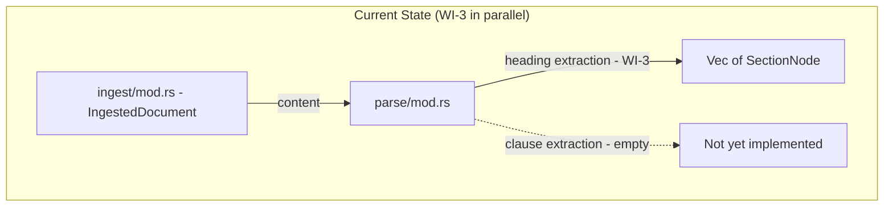
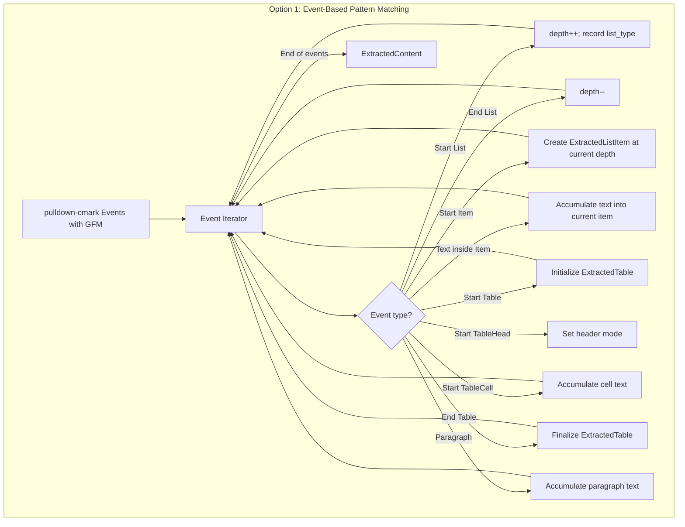
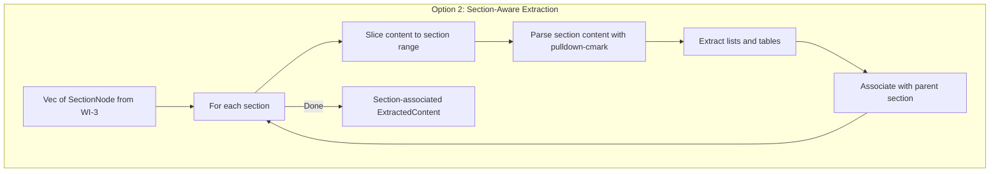
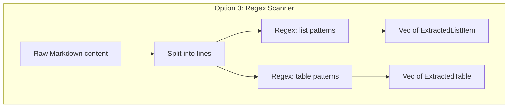
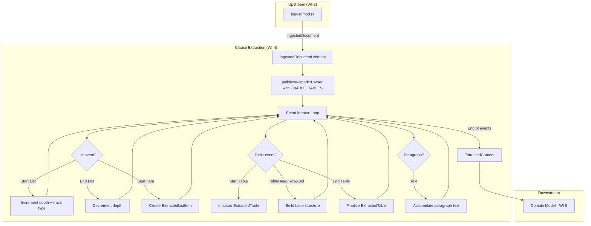
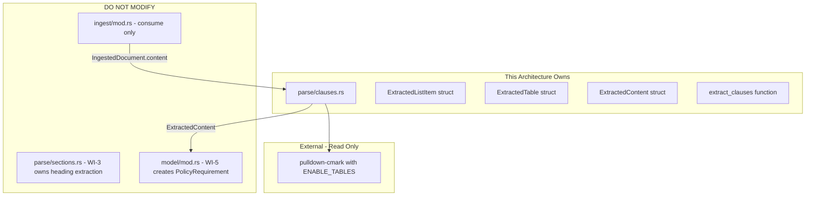

# 004-ar-structural-extraction-clauses

> **Document Type:** Architecture Review
> **Audience:** LLM agents, human reviewers
> **Status:** Proposed
> **Last Updated:** 2026-02-10 <!-- @auto -->
> **Owner:** Brian Luby <!-- @human-required -->
> **Deciders:** Brian Luby <!-- @human-required -->

---

## Review Tier Legend

| Marker | Tier | Speckit Behavior |
|--------|------|------------------|
| 🔴 `@human-required` | Human Generated | Prompt human to author; blocks until complete |
| 🟡 `@human-review` | LLM + Human Review | LLM drafts → prompt human to confirm/edit; blocks until confirmed |
| 🟢 `@llm-autonomous` | LLM Autonomous | LLM completes; no prompt; logged for audit |
| ⚪ `@auto` | Auto-generated | System fills (timestamps, links); no prompt |

---

## Document Completion Order

> ⚠️ **For LLM Agents:** Complete sections in this order. Do not fill downstream sections until upstream human-required inputs exist.

1. **Summary (Decision)** → requires human input first
2. **Context (Problem Space)** → requires human input
3. **Decision Drivers** → requires human input (prioritized)
4. **Driving Requirements** → extract from PRD, human confirms
5. **Options Considered** → LLM drafts after drivers exist, human reviews
6. **Decision (Selected + Rationale)** → requires human decision
7. **Implementation Guardrails** → LLM drafts, human reviews
8. **Everything else** → can proceed after decision is made

---

## Linkage ⚪ `@auto`

| Document | ID | Relationship |
|----------|-----|--------------|
| Parent PRD | [004-prd-structural-extraction-clauses](../PRD/004-prd-structural-extraction-clauses.md) | Requirements this architecture satisfies |
| Security Review | 004-sec-structural-extraction-clauses.md | Security implications of this decision |
| Supersedes | — | N/A |
| Superseded By | — | |

---

## Summary

### Decision 🔴 `@human-required`
> Use `pulldown-cmark` event-based clause pattern matching with nesting depth tracking to extract ordered lists, unordered lists, and GFM tables into typed intermediate structs (`ExtractedListItem`, `ExtractedTable`), each carrying source line numbers for traceability.

### TL;DR for Agents 🟡 `@human-review`
> Clause extraction uses pulldown-cmark with the `ENABLE_TABLES` option to consume list and table events from the Markdown event stream. Track nesting depth via a counter incremented on `Start(List)` / decremented on `End(List)`. For tables, track `Start(Table)`, `TableHead`, `TableRow`, `TableCell` events to build structured output. Each extracted element records its source line number. Do NOT classify items as requirements vs informational — that is downstream logic. Do NOT atomize compound statements — that is WI-6. This WI runs in parallel with WI-3 (heading extraction).

---

## Context

### Problem Space 🔴 `@human-required`
WI-3 extracts the heading hierarchy (the organizational skeleton), but the actual policy requirements live inside sections as numbered lists, bullet points, and tables. Without clause extraction, the pipeline has a section tree with no content — no individual policy statements to convert into OSCAL controls. The architectural challenge is efficiently extracting these structural elements from the pulldown-cmark event stream while preserving nesting depth for lists, table structure for tabular data, and source line numbers for traceability. The extraction must be robust against varied Markdown formatting: inline markup in list items, empty table cells, deeply nested lists, and mixed list types.

### Decision Scope 🟡 `@human-review`

**This AR decides:**
- How list items (ordered and unordered) are extracted from pulldown-cmark events
- How table structure (headers, rows, cells) is extracted
- How nesting depth is tracked for list items
- How inline Markdown formatting within list items is handled (stripped or preserved)
- The data structures (`ExtractedListItem`, `ExtractedTable`) for extracted content

**This AR does NOT decide:**
- How headings are extracted — decided in 003-ar-structural-extraction-headings
- How list items become `PolicyRequirement` structs — deferred to 005-ar-domain-model
- How compound statements are split — deferred to WI-6 (requirement atomization)
- How normative vs advisory language is detected — deferred to WI-33
- How extracted content is associated with sections — decided by the integration in WI-5

### Current State 🟢 `@llm-autonomous`
WI-1 (scaffolding) provides the project structure with `parse/` module stub. WI-2 (ingestion) provides `IngestedDocument` with raw content. WI-3 (heading extraction, developed in parallel) will provide `Vec<SectionNode>` with the section hierarchy. The clause extraction module does not yet exist. pulldown-cmark is already a dependency from WI-2.



### Driving Requirements 🟡 `@human-review`

| PRD Req ID | Requirement Summary | Architectural Implication |
|------------|---------------------|---------------------------|
| M-1 | Extract ordered (numbered) list items with text and source line | Event-based list detection; ListType::Ordered tracking |
| M-2 | Extract unordered (bullet) list items with text and source line | Event-based list detection; ListType::Unordered tracking |
| M-3 | Extract Markdown tables preserving headers, rows, cells | GFM table extension; structured ExtractedTable output |
| M-4 | All extracted elements include source line number | Byte offset to line number conversion |
| M-5 | Handle nested list items preserving nesting depth | Depth counter on Start(List)/End(List) |
| S-1 | Associate extracted items with parent section | Integration concern (addressed by WI-5 assembly) |
| S-2 | Capture paragraph text as section body content | Paragraph event accumulation |

**PRD Constraints inherited:**
- From constitution principle IV: TDD mandatory
- From constitution principle X: YAGNI — extract, don't classify or atomize
- From PRD technical constraints: pulldown-cmark with GFM tables; O(n) performance

---

## Decision Drivers 🔴 `@human-required`

1. **Completeness:** Every list item and table in the document must be extracted — no data loss *(PRD M-1, M-2, M-3)*
2. **Fidelity:** Text content, nesting depth, table structure, and line numbers must be accurately preserved *(PRD M-4, M-5)*
3. **Simplicity:** Extract raw structural elements without classification or transformation *(constitution principle X, YAGNI)*
4. **Parallelism:** This module must work independently of heading extraction (WI-3) against the same content *(roadmap: WI-3 and WI-4 are parallel)*

---

## Options Considered 🟡 `@human-review`

### Option 0: Status Quo / Do Nothing

**Description:** Leave clause extraction unimplemented. The section tree from WI-3 has headings but no content.

| Driver | Rating | Notes |
|--------|--------|-------|
| Completeness | ❌ Poor | No list items or tables extracted |
| Fidelity | ❌ Poor | No data to be faithful to |
| Simplicity | N/A | Nothing to evaluate |
| Parallelism | N/A | Nothing to parallelize |

**Why not viable:** Without clause extraction, the pipeline has a section tree with no requirement content. WI-5 (domain model) and all OSCAL generation WIs are blocked.

---

### Option 1: Event-Based Pattern Matching with Depth Counter (Recommended)

**Description:** Iterate pulldown-cmark events with the `ENABLE_TABLES` option. Use a nesting depth counter: increment on `Start(List)`, decrement on `End(List)`. For each `Start(Item)`, collect child text events into a list item record with the current depth. For tables, use state tracking through `Start(Table)` / `Start(TableHead)` / `Start(TableRow)` / `Start(TableCell)` events. Convert byte offsets to line numbers.



| Driver | Rating | Notes |
|--------|--------|-------|
| Completeness | ✅ Good | Processes all list and table events |
| Fidelity | ✅ Good | Depth counter accurate; table structure preserved |
| Simplicity | ✅ Good | Single pass, depth counter + state machine |
| Parallelism | ✅ Good | Independent of heading extraction; operates on same content |

**Pros:**
- Single-pass O(n) over the event stream
- Depth counter naturally handles arbitrary nesting levels
- GFM table extension is a single flag (`Options::ENABLE_TABLES`)
- Clean separation: extract structure, defer classification to downstream WIs
- Same pulldown-cmark parser as WI-3 — consistent parsing behavior

**Cons:**
- Table event tracking requires a small state machine (header mode vs data mode)
- Inline formatting (bold, links, code spans) within list items needs explicit handling (strip or normalize)
- Paragraph text captured alongside lists may overlap with WI-3 body text capture

---

### Option 2: Section-Aware Extraction (Extract Within Section Boundaries)

**Description:** Instead of extracting all clauses globally, first consume the section tree from WI-3, then for each section, re-parse only the section's content range to extract its lists and tables.



| Driver | Rating | Notes |
|--------|--------|-------|
| Completeness | ✅ Good | All content within sections is extracted |
| Fidelity | ✅ Good | Same extraction quality |
| Simplicity | ⚠️ Medium | Requires WI-3 output first; content slicing is complex |
| Parallelism | ❌ Poor | Cannot run in parallel with WI-3; depends on its output |

**Pros:**
- Extracted items are automatically associated with their parent section
- No need for separate section-association step in WI-5

**Cons:**
- Breaks parallelism with WI-3 (must wait for section tree)
- Content slicing requires tracking section byte ranges — error-prone
- Re-parsing content per section means multiple parser instances (O(n*s) where s = sections)
- Complicates the interface: requires both content AND section tree as input

---

### Option 3: Custom Text Scanner (Regex-Based)

**Description:** Use regex patterns to identify list items (lines matching `^\s*\d+\.\s` or `^\s*[-*]\s`) and table rows (lines matching `^\|.+\|$`).



| Driver | Rating | Notes |
|--------|--------|-------|
| Completeness | ⚠️ Medium | Misses lists/tables inside code blocks; edge cases with lazy continuation |
| Fidelity | ❌ Poor | Cannot accurately track nesting; no understanding of Markdown semantics |
| Simplicity | ⚠️ Medium | Regex patterns become complex for edge cases |
| Parallelism | ✅ Good | Independent of WI-3 |

**Pros:**
- No dependency on pulldown-cmark event model
- Conceptually straightforward for simple cases

**Cons:**
- Fails on code blocks containing list-like patterns (false positives)
- Cannot correctly handle lazy continuation lines in list items
- Nesting depth from indentation is fragile (tabs vs spaces)
- Table detection misses tables without leading pipes
- Reinvents what pulldown-cmark already does correctly
- Violates the principle of using the established parser

---

## Decision

### Selected Option 🔴 `@human-required`
> **Option 1: Event-Based Pattern Matching with Depth Counter**

### Rationale 🔴 `@human-required`
Option 1 is the simplest correct approach. It preserves parallelism with WI-3 (both can independently process the same content), uses the same pulldown-cmark parser for consistency, and handles all Markdown edge cases (code blocks, lazy continuation, nested lists) that regex (Option 3) would miss. Option 2 breaks the parallelism constraint from the roadmap and introduces unnecessary coupling to WI-3's output. The depth counter is a proven pattern for tracking nesting — it is both simple and correct. The GFM table extension adds full table support with a single flag.

#### Simplest Implementation Comparison 🟡 `@human-review`

| Aspect | Simplest Possible | Selected Option | Justification for Complexity |
|--------|-------------------|-----------------|------------------------------|
| List extraction | Extract top-level items only | Extract with nesting depth | PRD M-5 requires nested list support |
| Table extraction | Skip tables | Full GFM table parsing | PRD M-3 requires table preservation |
| Text handling | Raw event text | Strip inline formatting | PRD EC-4 requires clean text content |
| Data types | Vec of strings | Typed ExtractedListItem + ExtractedTable | PRD M-1, M-2, M-3 require distinct types with metadata |

**Complexity justified by:** Nesting depth tracking (PRD M-5), GFM table support (PRD M-3), and typed output structs (PRD M-1, M-2) are all explicit Must Have requirements. Each structural element beyond "extract flat text" traces directly to a PRD requirement.

### Architecture Diagram 🟡 `@human-review`



---

## Technical Specification

### Component Overview 🟡 `@human-review`

| Component | Responsibility | Interface | Dependencies |
|-----------|---------------|-----------|--------------|
| ExtractedListItem | Data structure for a single list item | Struct: text, source_line, nesting_depth, list_type | None |
| ExtractedTable | Data structure for a parsed table | Struct: headers, rows, source_line | None |
| ExtractedContent | Container for all extracted elements | Struct: list_items, tables, paragraphs | None |
| ListType | Enum distinguishing ordered vs unordered | Enum: Ordered, Unordered | None |
| Clause Extractor | Event-based extraction from pulldown-cmark | `extract_clauses(content) -> Result<ExtractedContent, ForgeError>` | pulldown-cmark |
| Inline Text Normalizer | Strip or normalize inline Markdown formatting | `normalize_inline(events) -> String` | pulldown-cmark |

### Data Flow 🟢 `@llm-autonomous`

```mermaid
sequenceDiagram
    participant Caller as cli/convert.rs or model assembly
    participant Ext as parse/clauses.rs
    participant PC as pulldown-cmark::Parser

    Caller->>Ext: extract_clauses(content)
    Ext->>PC: Parser::new_ext(content, Options::ENABLE_TABLES)
    loop For each event
        PC-->>Ext: Event
        alt Start(List(Some(1))) — ordered
            Ext->>Ext: depth++; push ListType::Ordered
        else Start(List(None)) — unordered
            Ext->>Ext: depth++; push ListType::Unordered
        else End(List)
            Ext->>Ext: depth--; pop list type
        else Start(Item)
            Ext->>Ext: begin new ExtractedListItem
        else Text/Code/SoftBreak inside Item
            Ext->>Ext: append to current item text
        else End(Item)
            Ext->>Ext: finalize current item, add to results
        else Start(Table)
            Ext->>Ext: begin new ExtractedTable
        else TableHead / TableRow / TableCell events
            Ext->>Ext: build table headers and rows
        else End(Table)
            Ext->>Ext: finalize table, add to results
        end
    end
    Ext-->>Caller: Ok(ExtractedContent)
```

### Interface Definitions 🟡 `@human-review`

```rust
/// Distinguishes ordered (numbered) from unordered (bullet) lists.
#[derive(Debug, Clone, PartialEq, Eq)]
pub enum ListType {
    /// Numbered list (1. 2. 3.)
    Ordered,
    /// Bullet list (- or *)
    Unordered,
}

/// A single list item extracted from Markdown content.
#[derive(Debug, Clone)]
pub struct ExtractedListItem {
    /// Full text content of the list item (inline formatting stripped)
    pub text: String,
    /// Source line number in the original document (1-based)
    pub source_line: usize,
    /// Nesting depth: 0 = top-level, 1 = first nested level, etc.
    pub nesting_depth: u8,
    /// Whether the parent list is ordered or unordered
    pub list_type: ListType,
}

/// A table extracted from Markdown content.
#[derive(Debug, Clone)]
pub struct ExtractedTable {
    /// Column header strings
    pub headers: Vec<String>,
    /// Data rows; each row is a vector of cell strings
    pub rows: Vec<Vec<String>>,
    /// Source line number (1-based) of the table start
    pub source_line: usize,
}

/// Container for all structural elements extracted from a document.
#[derive(Debug, Clone)]
pub struct ExtractedContent {
    /// All list items found in the document
    pub list_items: Vec<ExtractedListItem>,
    /// All tables found in the document
    pub tables: Vec<ExtractedTable>,
    /// Paragraph text blocks (non-list, non-table, non-heading content)
    pub paragraphs: Vec<ExtractedParagraph>,
}

/// A paragraph block extracted from Markdown content.
#[derive(Debug, Clone)]
pub struct ExtractedParagraph {
    /// Text content of the paragraph
    pub text: String,
    /// Source line number (1-based)
    pub source_line: usize,
}

/// Extract list items, tables, and paragraphs from Markdown content.
///
/// Uses pulldown-cmark with GFM table extension to parse the event stream.
/// Tracks nesting depth for list items and preserves table structure.
///
/// # Arguments
/// * `content` - Raw Markdown content string
///
/// # Returns
/// An `ExtractedContent` containing all list items, tables, and paragraphs.
///
/// # Errors
/// Returns `ForgeError::Parse` if extraction fails.
pub fn extract_clauses(content: &str) -> Result<ExtractedContent, ForgeError>;
```

### Key Algorithms/Patterns 🟡 `@human-review`

**Pattern:** Nesting Depth Counter for Lists
```
State: depth = 0, list_type_stack = []

On Start(List(ordered)):
  depth += 1
  list_type_stack.push(if ordered { Ordered } else { Unordered })

On End(List):
  depth -= 1
  list_type_stack.pop()

On Start(Item):
  current_item = ExtractedListItem {
    text: "",
    source_line: offset_to_line(range.start),
    nesting_depth: depth - 1,  // 0-based (depth=1 means top-level)
    list_type: list_type_stack.last(),
  }

On Text/Code/SoftBreak inside Item:
  current_item.text += normalized_text

On End(Item):
  results.list_items.push(current_item)
```

**Pattern:** Table State Machine
```
State: in_table = false, in_header = false, current_row = []

On Start(Table): in_table = true; init ExtractedTable
On Start(TableHead): in_header = true
On Start(TableRow): current_row = []
On Start(TableCell): current_cell = ""
On Text inside cell: current_cell += text
On End(TableCell): current_row.push(current_cell)
On End(TableRow/TableHead):
  if in_header: table.headers = current_row; in_header = false
  else: table.rows.push(current_row)
On End(Table): finalize table; in_table = false
```

---

## Constraints & Boundaries

### Technical Constraints 🟡 `@human-review`

**Inherited from PRD:**
- Rust latest stable toolchain
- pulldown-cmark with GFM table extension (PRD selected approach)
- TDD mandatory (constitution principle IV)
- O(n) performance in document size (PRD technical constraint)

**Added by this Architecture:**
- `Options::ENABLE_TABLES` must be set for pulldown-cmark parser
- Inline Markdown formatting (bold, italic, code spans, links) is stripped to plain text
- Nesting depth is 0-based (0 = top-level list item)
- Empty table cells produce empty strings (not omitted)
- Paragraph text is captured separately from list items

### Architectural Boundaries 🟡 `@human-review`



- **Owns:** `parse/clauses.rs` (or equivalent), `ExtractedListItem`, `ExtractedTable`, `ExtractedContent`, `extract_clauses`
- **Interfaces With:** `ingest/mod.rs` (consumes content), `model/` (downstream consumer in WI-5)
- **Must Not Touch:** `parse/sections.rs` (WI-3 heading extraction), `model/`, `oscal/`

### Implementation Guardrails 🟡 `@human-review`

> ⚠️ **Critical for LLM Agents:**

- [ ] **DO NOT** extract headings — that is WI-3 *(scope boundary: 003-ar-structural-extraction-headings)*
- [ ] **DO NOT** classify list items as requirements vs informational — that is downstream logic
- [ ] **DO NOT** atomize compound statements — that is WI-6 *(scope boundary: 006-prd-requirement-atomization)*
- [ ] **DO NOT** detect normative vs advisory language — that is WI-33
- [ ] **MUST** enable `Options::ENABLE_TABLES` on the pulldown-cmark parser *(PRD M-3)*
- [ ] **MUST** track nesting depth using a counter, not indentation parsing *(PRD M-5)*
- [ ] **MUST** preserve source line numbers on every extracted element *(PRD M-4)*
- [ ] **MUST** handle inline Markdown formatting by stripping to plain text *(PRD EC-4)*
- [ ] **MUST** handle empty table cells as empty strings *(PRD EC-5)*
- [ ] **MUST** write tests before implementation (TDD) *(constitution principle IV)*

---

## Consequences 🟡 `@human-review`

### Positive
- Complete extraction of all list items and tables — no data loss from the source document
- Accurate nesting depth tracking enables correct representation of hierarchical requirements
- Table structure preservation enables downstream tabular policy content handling
- Independent of WI-3 — can be developed and tested in parallel
- Type-safe intermediate structures make downstream integration (WI-5) straightforward

### Negative
- Inline formatting is stripped — if formatting carries semantic meaning (e.g., bold = emphasis on normative verbs), it is lost at this stage
- Paragraph text capture may partially overlap with WI-3 body text capture; WI-5 assembly must reconcile
- ExtractedContent is a flat collection — section association happens in WI-5, not here

### Risks & Mitigations

| Risk | Likelihood | Impact | Mitigation |
|------|------------|--------|------------|
| pulldown-cmark table events differ between versions | Low | Med | Pin to specific version; test table event sequence |
| Inline formatting stripping loses meaningful content | Low | Low | Preserve a `raw_text` field if needed later; currently YAGNI |
| Deeply nested lists (5+) cause depth tracking issues | Low | Low | Depth counter has no maximum; test with deep nesting |
| Mixed list types (ordered containing unordered) | Med | Low | list_type_stack handles mixed types correctly |

---

## Implementation Guidance

### Suggested Implementation Order 🟢 `@llm-autonomous`
1. Define `ListType`, `ExtractedListItem`, `ExtractedTable`, `ExtractedParagraph`, `ExtractedContent` structs
2. Write failing tests for basic ordered list extraction (3 items)
3. Implement list extraction with depth counter
4. Write tests for unordered lists, nested lists, mixed list types
5. Write failing tests for table extraction (header + 3 rows)
6. Implement table extraction with state machine
7. Write tests for edge cases: empty tables, empty cells, deeply nested lists
8. Write tests for inline formatting stripping
9. Implement paragraph text capture
10. Wire `extract_clauses` into the pipeline

### Testing Strategy 🟢 `@llm-autonomous`

| Layer | Test Type | Coverage Target | Notes |
|-------|-----------|-----------------|-------|
| Unit | Ordered list extraction | 100% | 0, 1, 5 items; verify text and line numbers |
| Unit | Unordered list extraction | 100% | Bullet items with `-`, `*`, `+` markers |
| Unit | Nested lists | 100% | 2-level, 3-level, 4-level nesting; mixed types |
| Unit | Table extraction | 100% | Header-only, header+rows, empty cells |
| Unit | Inline formatting | 100% | Bold, italic, code, links — all stripped |
| Unit | Edge cases | 100% | No lists/tables, empty document, list in code block (not extracted) |
| Unit | Line number accuracy | 100% | Verify against known fixtures |
| Integration | Full pipeline | Happy path | Ingest → extract clauses → verify output |

### Reference Implementations 🟡 `@human-review`
- pulldown-cmark GFM tables: `Options::ENABLE_TABLES` flag *(internal — crate API)*
- pulldown-cmark list events: `Event::Start(Tag::List(..))`, `Event::Start(Tag::Item)` *(internal — crate API)*

### Anti-patterns to Avoid 🟡 `@human-review`
- **Don't:** Use regex to detect list items (`/^\s*\d+\.\s/`)
  - **Why:** Misidentifies content in code blocks; cannot handle continuation lines or lazy paragraphs
  - **Instead:** Use pulldown-cmark events which correctly handle all Markdown syntax
- **Don't:** Track nesting by counting indentation whitespace
  - **Why:** Tabs vs spaces ambiguity; Markdown allows varied indentation for list continuation
  - **Instead:** Use `Start(List)` / `End(List)` event pairs as the authoritative nesting signals
- **Don't:** Try to associate list items with sections in this module
  - **Why:** Couples clause extraction to heading extraction; breaks parallelism
  - **Instead:** Let WI-5 (domain model assembly) handle section association using source line ranges
- **Don't:** Preserve inline Markdown formatting in extracted text
  - **Why:** Downstream consumers (domain model, OSCAL generators) need plain text
  - **Instead:** Strip to plain text; if raw markup is needed later, add a `raw_text` field (YAGNI for now)

---

## Compliance & Cross-cutting Concerns

### Security Considerations 🟡 `@human-review`
- Authentication: N/A — local CLI tool
- Authorization: N/A
- Data handling: Parsing already-ingested trusted content; no new external input

### Observability 🟢 `@llm-autonomous`
- **Logging:** Not yet needed; add `tracing` in a later sprint
- **Metrics:** N/A for clause extraction
- **Tracing:** N/A for clause extraction

### Error Handling Strategy 🟢 `@llm-autonomous`
```
Error Category → Handling Approach
├── Empty content → Return empty ExtractedContent (not an error)
├── No lists or tables → Return ExtractedContent with empty vectors
├── Malformed table → Best-effort extraction; skip malformed rows
└── pulldown-cmark parse failure → ForgeError::Parse (unlikely for valid UTF-8)
```

---

## Migration Plan (if applicable) 🟡 `@human-review`

N/A — greenfield implementation alongside WI-3 heading extraction.

### Rollback Plan 🔴 `@human-required`

N/A — greenfield clause extraction. If the approach proves wrong, `extract_clauses` can be reimplemented with the same interface. Rollback cost is low (~120-150 lines).

---

## Open Questions 🟡 `@human-review`

No open questions for this work item.

---

## Changelog ⚪ `@auto`

| Version | Date | Author | Changes |
|---------|------|--------|---------|
| 0.1 | 2026-02-10 | LLM (Claude) | Initial proposal |

---

## Decision Record ⚪ `@auto`

| Date | Event | Details |
|------|-------|---------|
| 2026-02-10 | Proposed | Initial draft created from PRD 004 |

---

## Traceability Matrix 🟢 `@llm-autonomous`

| PRD Req ID | Decision Driver | Option Rating | Component | Notes |
|------------|-----------------|---------------|-----------|-------|
| M-1 | Completeness | Option 1: ✅ | Clause Extractor | Ordered list items extracted with text |
| M-2 | Completeness | Option 1: ✅ | Clause Extractor | Unordered list items extracted with text |
| M-3 | Completeness | Option 1: ✅ | Clause Extractor + GFM | Tables extracted with headers, rows, cells |
| M-4 | Fidelity | Option 1: ✅ | All extracted structs | source_line field on every element |
| M-5 | Fidelity | Option 1: ✅ | Clause Extractor | Depth counter tracks nesting |
| S-1 | Parallelism | Option 1: ⚠️ | WI-5 assembly | Association deferred to domain model |
| S-2 | Completeness | Option 1: ✅ | Clause Extractor | Paragraphs captured separately |

---

## Review Checklist 🟢 `@llm-autonomous`

Before marking as Accepted:
- [x] All PRD Must Have requirements appear in Driving Requirements
- [x] Option 0 (Status Quo) is documented
- [x] Simplest Implementation comparison is completed
- [x] Decision drivers are prioritized and addressed
- [x] At least 2 options were seriously considered
- [x] Constraints distinguish inherited vs. new
- [x] Component names are consistent across all diagrams and tables
- [x] Implementation guardrails reference specific PRD constraints
- [x] Rollback triggers and authority are defined (N/A — greenfield)
- [x] Security review is linked or N/A documented
- [x] No open questions blocking implementation
