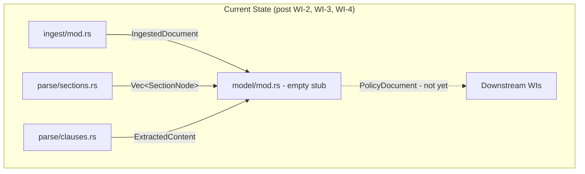
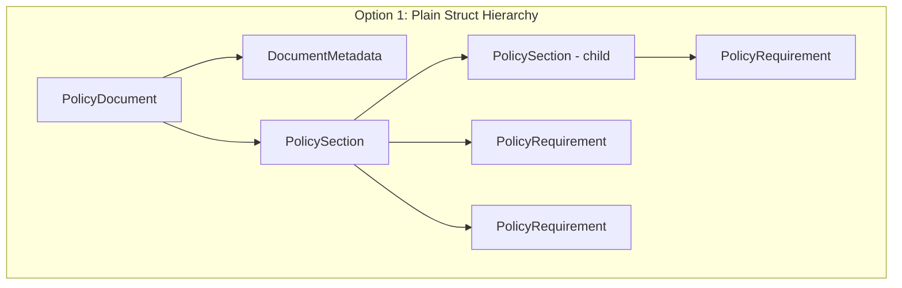
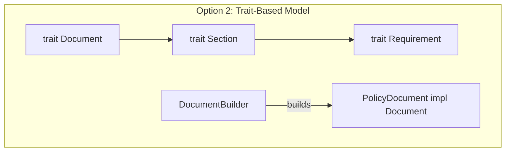
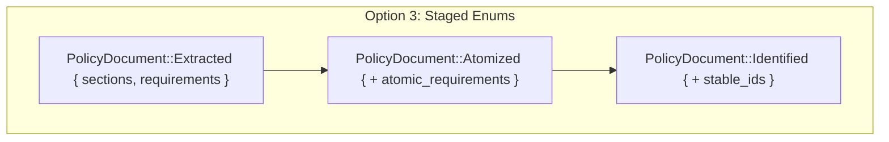
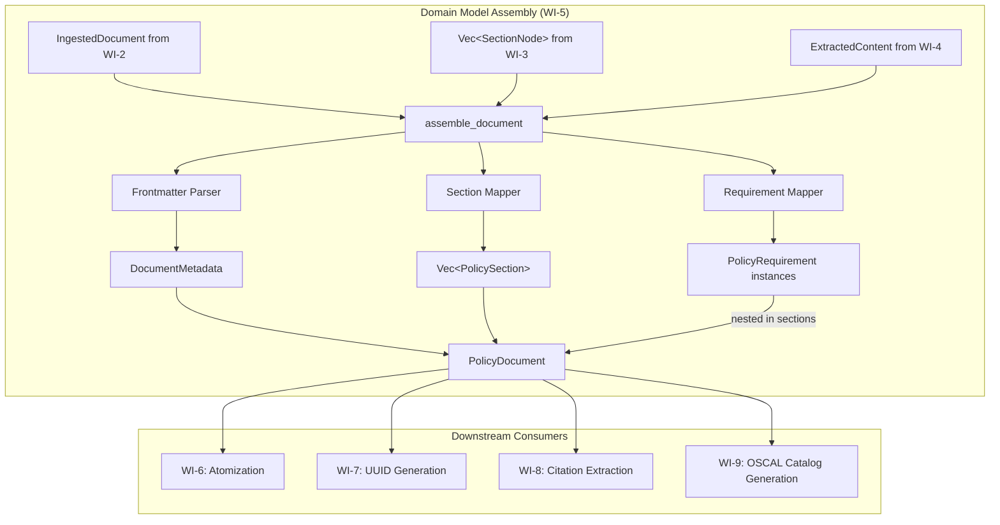
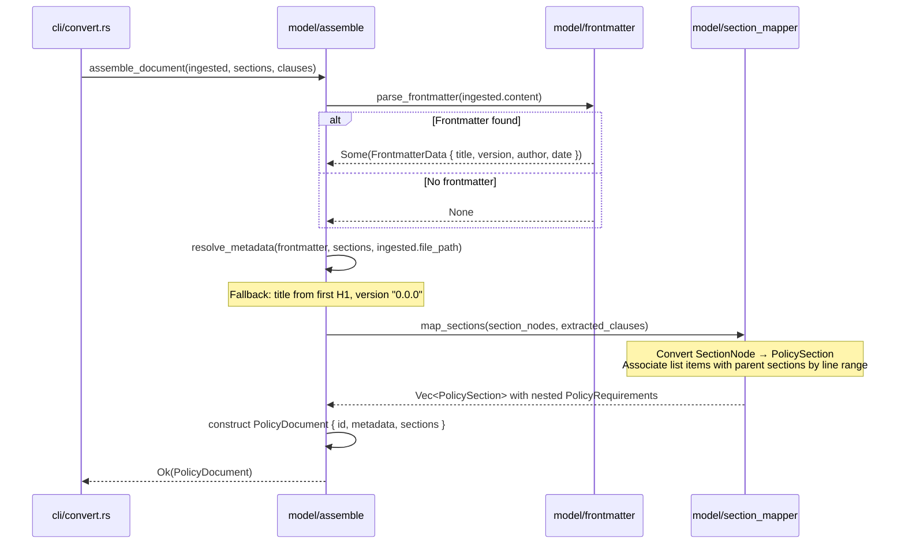
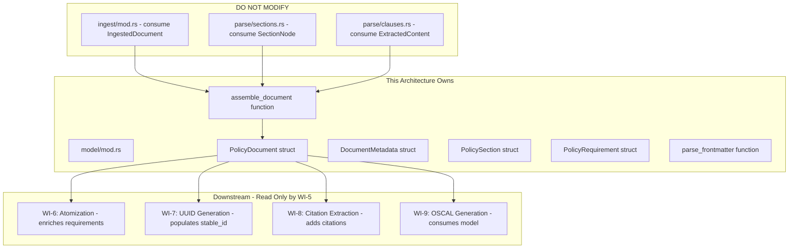

# 005-ar-domain-model

> **Document Type:** Architecture Review
> **Audience:** LLM agents, human reviewers
> **Status:** Proposed
> **Last Updated:** 2026-02-10 <!-- @auto -->
> **Owner:** Brian Luby <!-- @human-required -->
> **Deciders:** Brian Luby <!-- @human-required -->

---

## Review Tier Legend

| Marker | Tier | Speckit Behavior |
|--------|------|------------------|
| 🔴 `@human-required` | Human Generated | Prompt human to author; blocks until complete |
| 🟡 `@human-review` | LLM + Human Review | LLM drafts → prompt human to confirm/edit; blocks until confirmed |
| 🟢 `@llm-autonomous` | LLM Autonomous | LLM completes; no prompt; logged for audit |
| ⚪ `@auto` | Auto-generated | System fills (timestamps, links); no prompt |

---

## Document Completion Order

> ⚠️ **For LLM Agents:** Complete sections in this order. Do not fill downstream sections until upstream human-required inputs exist.

1. **Summary (Decision)** → requires human input first
2. **Context (Problem Space)** → requires human input
3. **Decision Drivers** → requires human input (prioritized)
4. **Driving Requirements** → extract from PRD, human confirms
5. **Options Considered** → LLM drafts after drivers exist, human reviews
6. **Decision (Selected + Rationale)** → requires human decision
7. **Implementation Guardrails** → LLM drafts, human reviews
8. **Everything else** → can proceed after decision is made

---

## Linkage ⚪ `@auto`

| Document | ID | Relationship |
|----------|-----|--------------|
| Parent PRD | [005-prd-domain-model](../PRD/005-prd-domain-model.md) | Requirements this architecture satisfies |
| Security Review | 005-sec-domain-model.md | Security implications of this decision |
| Supersedes | — | N/A |
| Superseded By | — | |

---

## Summary

### Decision 🔴 `@human-required`
> Implement a plain Rust struct hierarchy (`PolicyDocument` → `PolicySection` → `PolicyRequirement`) with `Option` fields for data populated by later WIs (stable_id, citations, modality), assembled by an `assemble_document` function that bridges ingestion/extraction output to the domain model. Metadata extracted from YAML frontmatter via `serde_yaml` with first-heading fallback.

### TL;DR for Agents 🟡 `@human-review`
> The domain model is a struct hierarchy in `model/mod.rs`: `PolicyDocument` contains `DocumentMetadata` and `Vec<PolicySection>`, which contain `Vec<PolicyRequirement>`. Use `Option` for fields populated by later WIs (stable_id from WI-7, citations from WI-8, modality from WI-33). The `assemble_document` function takes output from WI-2 (IngestedDocument), WI-3 (Vec<SectionNode>), and WI-4 (ExtractedContent) and produces a PolicyDocument. Do NOT include OSCAL-specific fields — this model is format-agnostic. Do NOT generate stable IDs or extract citations — those are WI-7 and WI-8.

---

## Context

### Problem Space 🔴 `@human-required`
After ingestion (WI-2), heading extraction (WI-3), and clause extraction (WI-4), the pipeline has three separate outputs: raw content with metadata, a section hierarchy tree, and a flat collection of extracted list items and tables. Without a unified domain model, every downstream WI (WI-6 atomization, WI-7 UUID generation, WI-8 citations, WI-9+ OSCAL generation) would need to understand and juggle these three separate data structures. The domain model is the critical architectural boundary — it decouples the "ingestion side" from the "generation side" of the pipeline. The challenge is designing a model that is rich enough for all downstream consumers while remaining format-agnostic (no OSCAL-specific fields) and extensible for data added by later WIs.

### Decision Scope 🟡 `@human-review`

**This AR decides:**
- The struct hierarchy for the internal domain model (PolicyDocument, PolicySection, PolicyRequirement, DocumentMetadata)
- How ingestion and extraction outputs are assembled into the domain model
- How frontmatter metadata is parsed and extracted
- Which fields use `Option` for later enrichment by downstream WIs
- How extracted list items are associated with their parent sections

**This AR does NOT decide:**
- How requirements are atomized (compound splitting) — deferred to WI-6
- How stable UUIDs are generated — deferred to WI-7 (007-ar-uuid-generation)
- How citations are extracted — deferred to WI-8
- How the domain model maps to OSCAL structures — deferred to WI-9+
- Normative vs advisory classification — deferred to WI-33

### Current State 🟢 `@llm-autonomous`
WI-1 provides the project structure with `model/mod.rs` as an empty stub. WI-2 provides `IngestedDocument` with file path, raw content, content hash, and line map. WI-3 provides `Vec<SectionNode>` with the heading hierarchy (title, level, line, body, children). WI-4 provides `ExtractedContent` with list items, tables, and paragraphs. The `model` module is an empty stub.



### Driving Requirements 🟡 `@human-review`

| PRD Req ID | Requirement Summary | Architectural Implication |
|------------|---------------------|---------------------------|
| M-1 | PolicyDocument struct with metadata and collection of PolicySections | Top-level struct definition |
| M-2 | PolicySection with title, heading level, source line, body, children, requirements | Recursive section struct matching heading tree |
| M-3 | PolicyRequirement with text, source line, and placeholder for stable_id | Requirement struct with Option<String> for stable_id |
| M-4 | DocumentMetadata with title and version from frontmatter or first heading | Frontmatter parsing with fallback logic |
| M-5 | Assembly function wiring WI-2, WI-3, WI-4 outputs into PolicyDocument | Public function bridging extraction to domain model |
| M-6 | All structs preserve source line numbers for traceability | source_line field on sections and requirements |
| S-1 | PolicyDocument implements Debug with human-readable summary | `#[derive(Debug)]` + Display or summary method |
| S-2 | DocumentMetadata includes optional author and date fields | Optional frontmatter fields |

**PRD Constraints inherited:**
- From constitution principle X: YAGNI — design for current needs with `Option` fields for future enrichment
- From constitution principle III: Contract-first — define types before implementation
- From constitution principle IV: TDD mandatory
- From PRD: Domain model must be decoupled from OSCAL structure

---

## Decision Drivers 🔴 `@human-required`

1. **Decoupling:** The model must be independent of both input format (Markdown) and output format (OSCAL) — it is the canonical internal representation *(PRD design constraint)*
2. **Extensibility:** Later WIs (WI-6 through WI-8) will enrich the model with new data (stable IDs, atomized requirements, citations) without breaking existing code *(PRD R-1 mitigation)*
3. **Completeness:** Every piece of data from extraction (sections, requirements, metadata, line numbers) must be representable in the model *(PRD M-1 through M-6)*
4. **Simplicity:** Plain Rust structs with derives — no trait abstractions, no generics, no builder pattern unless justified *(constitution principle X)*

---

## Options Considered 🟡 `@human-review`

### Option 0: Status Quo / Do Nothing

**Description:** Leave the `model` module empty. Downstream WIs consume extraction output types directly.

| Driver | Rating | Notes |
|--------|--------|-------|
| Decoupling | ❌ Poor | OSCAL generators coupled to extraction types |
| Extensibility | ❌ Poor | Cannot add fields without modifying extraction types |
| Completeness | ❌ Poor | No unified representation |
| Simplicity | ⚠️ Medium | No new types, but consumers become complex |

**Why not viable:** Without a domain model, every downstream WI must understand and juggle three separate extraction outputs (`IngestedDocument`, `Vec<SectionNode>`, `ExtractedContent`). This creates tight coupling between ingestion and OSCAL generation, making changes to either side cascade through the entire pipeline.

---

### Option 1: Plain Struct Hierarchy with Option Fields (Recommended)

**Description:** Define a hierarchy of plain Rust structs: `PolicyDocument` → `PolicySection` → `PolicyRequirement`, plus `DocumentMetadata`. Use `Option` for fields populated by later WIs (stable_id, citations, modality, parameters). An `assemble_document` function takes the three extraction outputs and produces a `PolicyDocument`. Frontmatter parsed via `serde_yaml` with fallback to first heading for title.



| Driver | Rating | Notes |
|--------|--------|-------|
| Decoupling | ✅ Good | No OSCAL fields; no extraction-format fields |
| Extensibility | ✅ Good | `Option` fields allow incremental enrichment |
| Completeness | ✅ Good | All extraction data representable |
| Simplicity | ✅ Good | Plain structs with derives; no indirection |

**Pros:**
- Maximum simplicity — plain structs, no trait objects, no generics
- `Option` fields for future data (stable_id, citations) enable non-breaking evolution
- `#[derive(Debug, Clone)]` provides debugging and data flow flexibility
- Assembly function creates a clear boundary between extraction and domain
- serde_yaml for frontmatter is a standard, well-maintained approach

**Cons:**
- `Option` fields must be checked by downstream consumers (Some vs None)
- Assembly function requires understanding three input types
- Frontmatter parsing adds serde_yaml dependency

---

### Option 2: Trait-Based Domain Model with Builder Pattern

**Description:** Define traits (`Document`, `Section`, `Requirement`) with default implementations, then use a builder pattern to construct the domain model incrementally. Each WI adds fields by implementing trait methods.



| Driver | Rating | Notes |
|--------|--------|-------|
| Decoupling | ✅ Good | Traits abstract over concrete types |
| Extensibility | ✅ Good | New traits or trait methods for new capabilities |
| Completeness | ✅ Good | Traits can express any interface |
| Simplicity | ❌ Poor | Traits, builders, and impl blocks for 3 simple structs |

**Pros:**
- Maximum abstraction — future changes can swap implementations
- Builder pattern prevents partially initialized structs
- Trait-based polymorphism enables testing with mock implementations

**Cons:**
- Massive over-engineering for 3 simple data structs
- Violates YAGNI (constitution principle X) — traits with single implementations
- Constitution explicitly warns: "Don't create traits with a single implementation unless testing requires it"
- Builder pattern adds boilerplate with no clear benefit for these data-carrying structs
- Adds cognitive overhead for downstream WI implementors

---

### Option 3: Enum-Based Model with Variants per WI Stage

**Description:** Use Rust enums to represent the domain model at different pipeline stages. Each stage adds more data, producing a new variant.



| Driver | Rating | Notes |
|--------|--------|-------|
| Decoupling | ✅ Good | Each stage is a distinct type |
| Extensibility | ⚠️ Medium | Adding a new stage requires a new variant |
| Completeness | ✅ Good | Each variant carries exactly its data |
| Simplicity | ❌ Poor | Multiple variants; pattern matching everywhere |

**Pros:**
- Type-safe pipeline stages — impossible to use unenriched data where enriched data is expected
- No `Option` fields — each variant has exactly the data it needs

**Cons:**
- Explosion of types as WIs add stages (extracted, atomized, identified, cited, ...)
- Every consumer must match on the variant to access data
- Moving data from one variant to the next is verbose
- Over-engineered for the current pipeline — could be considered at a much later stage if type safety proves necessary

---

## Decision

### Selected Option 🔴 `@human-required`
> **Option 1: Plain Struct Hierarchy with Option Fields**

### Rationale 🔴 `@human-required`
Option 1 is the simplest approach that meets all requirements while remaining extensible for later WIs. The domain model is fundamentally a data-carrying hierarchy — it does not need traits (Option 2) or staged variants (Option 3). Constitution principle X (YAGNI) explicitly warns against premature abstraction, and the constitution's anti-pattern "Don't create traits with a single implementation" directly applies here. `Option` fields are the idiomatic Rust approach for data that is incrementally populated by later pipeline stages. The `assemble_document` function provides a clean boundary that can be tested independently.

#### Simplest Implementation Comparison 🟡 `@human-review`

| Aspect | Simplest Possible | Selected Option | Justification for Complexity |
|--------|-------------------|-----------------|------------------------------|
| Data model | Pass extraction types through | Dedicated struct hierarchy | PRD design constraint: decouple from extraction types |
| Metadata | Hardcoded title/version | Frontmatter parsing with fallback | PRD M-4 requires metadata extraction from source |
| Assembly | Manual field-by-field | assemble_document function | PRD M-5 requires wiring three extraction outputs |
| Future fields | Add fields when needed | Option fields defined now | PRD W-1/W-2/W-3 indicate future enrichment; Option is zero-cost |

**Complexity justified by:** The dedicated struct hierarchy (vs passing extraction types) is required by the PRD design constraint that the domain model be format-agnostic. Frontmatter parsing is required by PRD M-4. The assembly function is required by PRD M-5. Option fields add no runtime cost but prevent breaking changes when WI-6 through WI-8 add data.

### Architecture Diagram 🟡 `@human-review`



---

## Technical Specification

### Component Overview 🟡 `@human-review`

| Component | Responsibility | Interface | Dependencies |
|-----------|---------------|-----------|--------------|
| PolicyDocument | Top-level domain model struct | Struct: id, metadata, sections | None |
| DocumentMetadata | Document-level metadata | Struct: title, version, author, date, source_path | None |
| PolicySection | Hierarchical section representation | Struct: title, level, line, body, children, requirements | None |
| PolicyRequirement | Individual policy requirement | Struct: stable_id (Option), text, source_line, nesting_depth | None |
| Frontmatter Parser | Extract metadata from YAML frontmatter | `parse_frontmatter(content) -> Option<FrontmatterData>` | serde_yaml |
| Section Mapper | Convert SectionNode tree to PolicySection tree | `map_sections(nodes, clauses) -> Vec<PolicySection>` | None |
| Document Assembler | Wire all inputs into PolicyDocument | `assemble_document(ingested, sections, clauses) -> Result<PolicyDocument, ForgeError>` | All above |

### Data Flow 🟢 `@llm-autonomous`



### Interface Definitions 🟡 `@human-review`

```rust
use std::path::PathBuf;

/// Top-level domain model for a parsed policy document.
///
/// This is the canonical internal representation consumed by all
/// downstream pipeline stages (atomization, UUID generation, OSCAL generation).
#[derive(Debug, Clone)]
pub struct PolicyDocument {
    /// Document identifier (derived from filename or frontmatter)
    pub id: String,
    /// Document-level metadata
    pub metadata: DocumentMetadata,
    /// Top-level sections (may contain nested children)
    pub sections: Vec<PolicySection>,
}

/// Metadata about the source document.
#[derive(Debug, Clone)]
pub struct DocumentMetadata {
    /// Document title (from frontmatter or first H1 heading)
    pub title: String,
    /// Document version (from frontmatter or default "0.0.0")
    pub version: String,
    /// Document author (from frontmatter, optional)
    pub author: Option<String>,
    /// Document date (from frontmatter, optional)
    pub date: Option<String>,
    /// Path to the source file
    pub source_path: PathBuf,
    /// SHA-256 hash of source content (from IngestedDocument)
    pub content_hash: Option<String>,
}

/// A section within a policy document, mapped from a Markdown heading.
#[derive(Debug, Clone)]
pub struct PolicySection {
    /// Section title (heading text)
    pub title: String,
    /// Heading level: 1 for H1, 2 for H2, ..., 6 for H6
    pub heading_level: u8,
    /// Source line number in the original document (1-based)
    pub source_line: usize,
    /// Text content between this heading and the first child heading or next sibling
    pub body_text: Option<String>,
    /// Child sections (deeper heading levels)
    pub children: Vec<PolicySection>,
    /// Policy requirements extracted from list items within this section
    pub requirements: Vec<PolicyRequirement>,
}

/// An individual policy requirement extracted from a list item.
#[derive(Debug, Clone)]
pub struct PolicyRequirement {
    /// Stable identifier — None until populated by WI-7 (UUID generation)
    pub stable_id: Option<String>,
    /// Full text of the requirement
    pub text: String,
    /// Source line number in the original document (1-based)
    pub source_line: usize,
    /// Nesting depth from extraction (0 = top-level)
    pub nesting_depth: u8,
}

/// Assemble a PolicyDocument from ingestion and extraction outputs.
///
/// Bridges the three extraction outputs into a unified domain model:
/// - IngestedDocument provides file path, content hash, raw content
/// - Vec<SectionNode> provides heading hierarchy
/// - ExtractedContent provides list items, tables, paragraphs
///
/// # Errors
/// Returns `ForgeError::Parse` if frontmatter is present but cannot be parsed
/// (warning emitted, falls back to defaults).
pub fn assemble_document(
    ingested: &IngestedDocument,
    sections: Vec<SectionNode>,
    clauses: ExtractedContent,
) -> Result<PolicyDocument, ForgeError>;
```

### Key Algorithms/Patterns 🟡 `@human-review`

**Pattern:** Frontmatter Extraction
```
1. Check if content starts with "---\n"
2. Find the closing "---\n" delimiter
3. Extract the YAML between delimiters
4. Deserialize with serde_yaml into FrontmatterData { title, version, author, date }
5. If parsing fails: warn and return None
6. If no frontmatter: return None
```

**Pattern:** Metadata Resolution with Fallback
```
1. If frontmatter.title exists → use it
2. Else if sections[0] is an H1 → use its title
3. Else → use filename (without extension)
4. If frontmatter.version exists → use it
5. Else → default to "0.0.0"
```

**Pattern:** Section Mapping with Requirement Association
```
1. For each SectionNode from WI-3:
   a. Create a PolicySection with title, level, source_line, body_text
   b. Determine the line range for this section:
      - Start: this section's source_line
      - End: next sibling's source_line (or document end)
   c. Find all ExtractedListItems whose source_line falls within this range
   d. Convert matching list items to PolicyRequirement structs
   e. Recursively map child SectionNodes
2. Return Vec<PolicySection>
```

---

## Constraints & Boundaries

### Technical Constraints 🟡 `@human-review`

**Inherited from PRD:**
- Rust latest stable toolchain
- TDD mandatory (constitution principle IV)
- Domain model decoupled from OSCAL structure (PRD design constraint)
- serde_yaml for frontmatter parsing (PRD selected approach)

**Added by this Architecture:**
- All domain model structs derive `Debug` and `Clone`
- `Option` fields for data populated by later WIs: `stable_id`, `content_hash`
- Assembly function is the sole entry point for domain model construction — no ad-hoc construction
- Frontmatter parsing is fault-tolerant: malformed YAML causes a warning, not an error
- Section-to-requirement association uses source line ranges, not explicit parent references

### Architectural Boundaries 🟡 `@human-review`



- **Owns:** `model/` module, all domain model structs, assembly function, frontmatter parser
- **Interfaces With:** `ingest/` (consumes IngestedDocument), `parse/` (consumes SectionNode and ExtractedContent)
- **Must Not Touch:** `ingest/`, `parse/`, `oscal/`, `cli/` (except wiring the assembly call)

### Implementation Guardrails 🟡 `@human-review`

> ⚠️ **Critical for LLM Agents:**

- [ ] **DO NOT** include OSCAL-specific fields in the domain model (no `group_id`, `control_id`, `oscal_version` on domain structs) *(PRD design constraint)*
- [ ] **DO NOT** generate stable UUIDs — leave `stable_id` as `None`; WI-7 populates this *(scope boundary: 007-prd-uuid-generation)*
- [ ] **DO NOT** extract citations — that is WI-8 *(scope boundary: 008-prd-citation-extraction)*
- [ ] **DO NOT** atomize compound statements — that is WI-6 *(scope boundary: 006-prd-requirement-atomization)*
- [ ] **DO NOT** create traits for the domain model structs — plain structs only *(constitution anti-pattern: no traits with single implementation)*
- [ ] **MUST** use `Option` for fields populated by later WIs *(extensibility driver)*
- [ ] **MUST** derive `Debug` and `Clone` on all domain model structs *(PRD S-1)*
- [ ] **MUST** fall back to first H1 heading for title if no frontmatter exists *(PRD M-4, AC-3)*
- [ ] **MUST** default version to `"0.0.0"` when not found in frontmatter *(PRD AC-3)*
- [ ] **MUST** preserve source line numbers on all sections and requirements *(PRD M-6)*
- [ ] **MUST** write tests before implementation (TDD) *(constitution principle IV)*

---

## Consequences 🟡 `@human-review`

### Positive
- Clean architectural boundary between ingestion/extraction and OSCAL generation
- All downstream WIs (WI-6 through WI-18+) consume a single, well-defined type (PolicyDocument)
- `Option` fields enable incremental enrichment without breaking changes
- Frontmatter parsing handles real-world documents with or without YAML metadata
- Source line numbers preserved through the entire model for traceability
- Assembly function is independently testable

### Negative
- `Option` fields require downstream consumers to handle `None` cases
- Assembly function depends on three input types from three different WIs — integration complexity
- Frontmatter parsing adds serde_yaml dependency (already used elsewhere in the project)
- Section-to-requirement association by line range is an approximation (assumes list items belong to the most recent heading)

### Risks & Mitigations

| Risk | Likelihood | Impact | Mitigation |
|------|------------|--------|------------|
| Domain model needs significant changes for OSCAL generation (WI-9) | Med | Med | Option fields absorb new data; struct can add fields without breaking |
| Section-to-requirement line-range association misattributes requirements | Low | Med | Test with varied document layouts; use section end boundary heuristic |
| Frontmatter format varies across real-world documents | Low | Low | Fault-tolerant parsing with fallback; support common YAML fields |
| serde_yaml parsing failure on edge-case YAML | Low | Low | Catch deserialization errors; fall back to defaults with warning |

---

## Implementation Guidance

### Suggested Implementation Order 🟢 `@llm-autonomous`
1. Define `PolicyDocument`, `DocumentMetadata`, `PolicySection`, `PolicyRequirement` structs in `model/mod.rs`
2. Write failing tests for struct construction (basic happy path)
3. Implement `parse_frontmatter` helper (detect `---` delimiters, deserialize with serde_yaml)
4. Write tests for frontmatter: present, absent, malformed
5. Implement metadata resolution with fallback (frontmatter → first H1 → filename)
6. Write tests for metadata resolution: all fallback paths
7. Implement section mapping (`SectionNode` → `PolicySection`) with recursive children
8. Implement requirement association (ExtractedListItem → PolicyRequirement, matched by line range)
9. Write tests for section mapping and requirement association
10. Implement `assemble_document` composing all the above
11. Write integration tests: full Markdown → PolicyDocument round-trip
12. Wire assembly call into `cli/convert.rs`

### Testing Strategy 🟢 `@llm-autonomous`

| Layer | Test Type | Coverage Target | Notes |
|-------|-----------|-----------------|-------|
| Unit | Struct construction | 100% | PolicyDocument, PolicySection, PolicyRequirement |
| Unit | Frontmatter parsing | 100% | Present, absent, malformed, partial fields |
| Unit | Metadata resolution | 100% | Frontmatter path, H1 fallback, filename fallback |
| Unit | Section mapping | 100% | Flat sections, nested sections, empty sections |
| Unit | Requirement association | 100% | Items within sections, items outside sections |
| Unit | Edge cases | 100% | Empty document, no headings, no requirements |
| Integration | Full assembly | Happy path | Ingest → extract → assemble → verify all fields |

### Reference Implementations 🟡 `@human-review`
- Parent PRD data model diagram (docs/FORGE_PRD.md, Data Model section) *(internal — conceptual model)*
- serde_yaml deserialization: `serde_yaml::from_str::<FrontmatterData>(yaml)` *(external — requires human approval)*

### Anti-patterns to Avoid 🟡 `@human-review`
- **Don't:** Include OSCAL-specific fields (`group_id`, `control_id`, `oscal_version`) in the domain model
  - **Why:** Creates tight coupling between parsing and OSCAL generation; prevents format-agnostic reuse
  - **Instead:** Keep the model pure; OSCAL mapping happens in WI-9+ in the `oscal/` module
- **Don't:** Use required fields for data populated by later WIs
  - **Why:** Forces dummy values that obscure whether data has been populated
  - **Instead:** Use `Option<T>` — `None` means "not yet populated"; `Some(value)` means "enriched"
- **Don't:** Create a `PolicyDocumentBuilder` with builder pattern
  - **Why:** Over-engineering for data structs; the assembly function is sufficient
  - **Instead:** Direct struct construction in `assemble_document`
- **Don't:** Make the assembly function accept a single "extraction result" super-type
  - **Why:** Creating an intermediate aggregation type adds indirection with no benefit
  - **Instead:** Accept the three extraction outputs directly as function parameters

---

## Compliance & Cross-cutting Concerns

### Security Considerations 🟡 `@human-review`
- Authentication: N/A — internal data structures only
- Authorization: N/A
- Data handling: Domain model contains policy requirement text, which may be sensitive; no data leaves local process
- YAML parsing: serde_yaml is well-maintained and resistant to YAML bombs; policy frontmatter is small

### Observability 🟢 `@llm-autonomous`
- **Logging:** Not yet needed; assembly could log section/requirement counts at `DEBUG` level in a later sprint
- **Metrics:** N/A for domain model
- **Tracing:** N/A for domain model

### Error Handling Strategy 🟢 `@llm-autonomous`
```
Error Category → Handling Approach
├── Malformed frontmatter YAML → Warn + fall back to heading/defaults
├── No frontmatter → Not an error; use heading fallback
├── No headings and no frontmatter → Use filename as title; version "0.0.0"
├── Empty document → Return PolicyDocument with empty sections
├── serde_yaml deserialization error → Catch, warn, use defaults
└── Assembly logic error → ForgeError::Parse with context
```

---

## Migration Plan (if applicable) 🟡 `@human-review`

N/A — greenfield implementation building on WI-1 scaffolding and WI-2/WI-3/WI-4 extraction outputs.

### Rollback Plan 🔴 `@human-required`

N/A — greenfield domain model. If the struct hierarchy proves inadequate, the types can be refactored. Since all downstream code depends on these types, a major refactor would have wide impact — but the `Option` field strategy specifically mitigates this by allowing additive changes.

---

## Open Questions 🟡 `@human-review`

No open questions for this work item.

---

## Changelog ⚪ `@auto`

| Version | Date | Author | Changes |
|---------|------|--------|---------|
| 0.1 | 2026-02-10 | LLM (Claude) | Initial proposal |

---

## Decision Record ⚪ `@auto`

| Date | Event | Details |
|------|-------|---------|
| 2026-02-10 | Proposed | Initial draft created from PRD 005 |

---

## Traceability Matrix 🟢 `@llm-autonomous`

| PRD Req ID | Decision Driver | Option Rating | Component | Notes |
|------------|-----------------|---------------|-----------|-------|
| M-1 | Completeness | Option 1: ✅ | PolicyDocument | id + metadata + sections |
| M-2 | Completeness | Option 1: ✅ | PolicySection | title, level, line, body, children, requirements |
| M-3 | Extensibility | Option 1: ✅ | PolicyRequirement | text, line, depth + Option<stable_id> |
| M-4 | Completeness | Option 1: ✅ | Frontmatter Parser + Metadata Resolution | YAML frontmatter with H1/filename fallback |
| M-5 | Completeness | Option 1: ✅ | Document Assembler | Wires IngestedDocument + SectionNode + ExtractedContent |
| M-6 | Completeness | Option 1: ✅ | PolicySection + PolicyRequirement | source_line on all structs |
| S-1 | Simplicity | Option 1: ✅ | PolicyDocument | `#[derive(Debug)]` provides human-readable output |
| S-2 | Extensibility | Option 1: ✅ | DocumentMetadata | Optional author and date fields |

---

## Review Checklist 🟢 `@llm-autonomous`

Before marking as Accepted:
- [x] All PRD Must Have requirements appear in Driving Requirements
- [x] Option 0 (Status Quo) is documented
- [x] Simplest Implementation comparison is completed
- [x] Decision drivers are prioritized and addressed
- [x] At least 2 options were seriously considered
- [x] Constraints distinguish inherited vs. new
- [x] Component names are consistent across all diagrams and tables
- [x] Implementation guardrails reference specific PRD constraints
- [x] Rollback triggers and authority are defined (N/A — greenfield)
- [x] Security review is linked or N/A documented
- [x] No open questions blocking implementation
