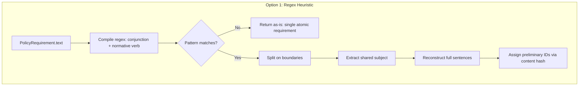
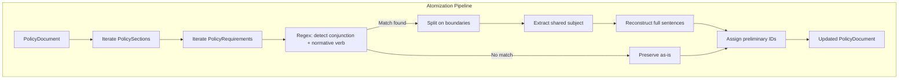
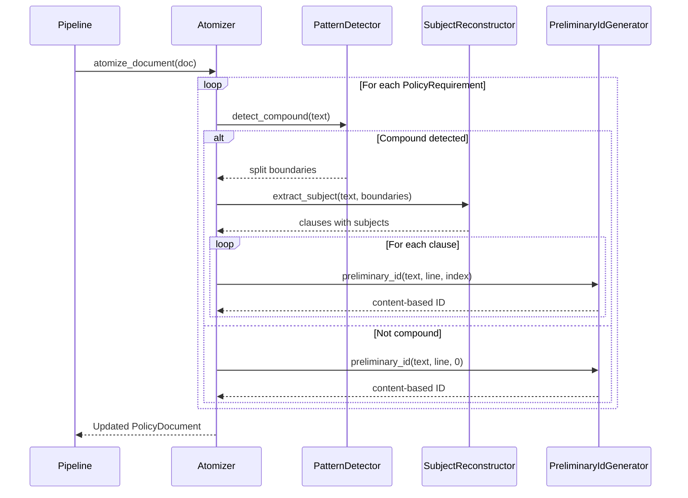

# 006-ar-requirement-atomization

> **Document Type:** Architecture Review
> **Audience:** LLM agents, human reviewers
> **Status:** Proposed
> **Last Updated:** 2026-02-10 <!-- @auto -->
> **Owner:** Brian Luby <!-- @human-required -->
> **Deciders:** Brian Luby <!-- @human-required -->

---

## Review Tier Legend

| Marker | Tier | Speckit Behavior |
|--------|------|------------------|
| 🔴 `@human-required` | Human Generated | Prompt human to author; blocks until complete |
| 🟡 `@human-review` | LLM + Human Review | LLM drafts → prompt human to confirm/edit; blocks until confirmed |
| 🟢 `@llm-autonomous` | LLM Autonomous | LLM completes; no prompt; logged for audit |
| ⚪ `@auto` | Auto-generated | System fills (timestamps, links); no prompt |

---

## Document Completion Order

> ⚠️ **For LLM Agents:** Complete sections in this order. Do not fill downstream sections until upstream human-required inputs exist.

1. **Summary (Decision)** → requires human input first
2. **Context (Problem Space)** → requires human input
3. **Decision Drivers** → requires human input (prioritized)
4. **Driving Requirements** → extract from PRD, human confirms
5. **Options Considered** → LLM drafts after drivers exist, human reviews
6. **Decision (Selected + Rationale)** → requires human decision
7. **Implementation Guardrails** → LLM drafts, human reviews
8. **Everything else** → can proceed after decision is made

---

## Linkage ⚪ `@auto`

| Document | ID | Relationship |
|----------|-----|--------------|
| Parent PRD | [006-prd-requirement-atomization](../PRD/006-prd-requirement-atomization.md) | Requirements this architecture satisfies |
| Security Review | 006-sec-requirement-atomization.md | Security implications of this decision |
| Supersedes | — | N/A |
| Superseded By | — | |

---

## Summary

### Decision 🔴 `@human-required`
> Use a regex-based heuristic splitter that detects conjunction + normative verb patterns (e.g., "and must", "or shall") and splits compound policy statements into atomic requirements, reconstructing the shared subject for each split clause.

### TL;DR for Agents 🟡 `@human-review`
> The atomizer is a pure function in the `parse` module that splits compound policy statements on conjunction + normative verb boundaries using compiled regex patterns. It reconstructs the shared subject (text before the first normative verb) for each split clause, assigns deterministic preliminary IDs via content hashing, and preserves source line numbers. Do NOT split on conjunctions without an accompanying normative verb (e.g., "logging and monitoring" stays intact). Do NOT use NLP or ML; heuristic regex only.

---

## Context

### Problem Space 🔴 `@human-required`
Policy documents frequently express multiple obligations in a single compound statement: "Systems must enforce MFA and must require complex passwords." When mapped directly to OSCAL controls without splitting, the result is a single control that conflates independently assessable requirements. A compound control forces all-or-nothing assessment and prevents granular compliance tracking. The atomizer must split compound statements into individual atomic requirements while being conservative — it must only split on clear syntactic patterns to avoid incorrect decomposition (per product principle P-1: Correctness over convenience).

### Decision Scope 🟡 `@human-review`

**This AR decides:**
- The algorithm for detecting and splitting compound policy statements
- The pattern-matching approach (regex vs NLP vs manual string splitting)
- How shared subjects are reconstructed for split clauses
- The preliminary ID assignment strategy for atomic requirements

**This AR does NOT decide:**
- Deterministic UUID v5 generation — deferred to 007-ar-uuid-generation
- Citation extraction from requirement text — deferred to 008-ar-citation-extraction
- OSCAL control mapping from atomized requirements — deferred to 009-ar-catalog-groups-controls
- Normative vs advisory classification ("must" vs "should") — deferred to WI-33

### Current State 🟢 `@llm-autonomous`
The domain model (WI-5) provides `PolicyDocument` with `PolicySection` and `PolicyRequirement` structs. Requirements exist as raw text strings extracted from Markdown clauses. No splitting or atomization logic exists — compound statements pass through as single `PolicyRequirement` entries.

### Driving Requirements 🟡 `@human-review`

| PRD Req ID | Requirement Summary | Architectural Implication |
|------------|---------------------|---------------------------|
| M-1 | Detect compound statements with conjunction + normative verb and split into atomic requirements | Core algorithm must identify splitting boundaries |
| M-2 | Each atomic requirement contains complete text including shared subject/context | Subject reconstruction logic required |
| M-3 | Single atomic statements pass through unchanged | Algorithm must have a no-op path for non-compound input |
| M-4 | Preliminary stable IDs are deterministic (same input = same ID) | ID generation must be a pure function of content |
| M-5 | Preserve source line numbers on each atomic requirement | Source metadata must propagate through splitting |
| M-6 | Operate on PolicyDocument and return updated PolicyDocument | Function signature must accept and return domain model types |

**PRD Constraints inherited:**
- From constitution principle X: YAGNI — heuristic splitting only, no NLP/ML
- From constitution principle IV: TDD mandatory
- From product principle P-1: Conservative splitting — when in doubt, do not split

---

## Decision Drivers 🔴 `@human-required`

1. **Correctness:** Splits must be accurate — no false splits on non-compound patterns (e.g., "logging and monitoring") *(traces to PRD M-1, M-3)*
2. **Determinism:** Same input must produce identical output across runs *(traces to PRD M-4, product principle P-3)*
3. **Simplicity:** Minimal complexity, no external NLP dependencies *(constitution principle X)*
4. **Completeness:** Shared subject must be reconstructed for each split clause to produce valid sentences *(traces to PRD M-2)*

---

## Options Considered 🟡 `@human-review`

### Option 0: Status Quo / Do Nothing

**Description:** Leave compound statements as single `PolicyRequirement` entries. Each compound statement maps to one OSCAL control.

| Driver | Rating | Notes |
|--------|--------|-------|
| Correctness | ❌ Poor | Compound controls conflate multiple obligations; cannot be independently assessed |
| Determinism | ✅ Good | No processing = deterministic, but incorrect output |
| Simplicity | ✅ Good | No code to write |
| Completeness | ❌ Poor | Compound statements are not decomposed at all |

**Why not viable:** Parent PRD M-2 explicitly requires compound statement splitting. Without atomization, downstream OSCAL controls are ambiguous and untestable, violating the core value proposition.

---

### Option 1: Regex-Based Heuristic Splitting (Recommended)

**Description:** Use compiled regex patterns to detect conjunction + normative verb boundaries ("and must", "or shall", "and should", etc.). Split only when a normative verb follows a conjunction. Reconstruct the shared subject (text before the first normative verb) for each split clause.



| Driver | Rating | Notes |
|--------|--------|-------|
| Correctness | ✅ Good | Only splits on explicit conjunction + normative verb pairs; conservative by design |
| Determinism | ✅ Good | Regex matching is deterministic; no randomness or ordering concerns |
| Simplicity | ✅ Good | Single `regex` crate dependency; straightforward pattern matching |
| Completeness | ✅ Good | Subject reconstruction ensures each split clause is a valid sentence |

**Pros:**
- Conservative: only splits when a normative verb follows a conjunction, avoiding false positives on phrases like "logging and monitoring"
- Deterministic: regex matching produces identical results for identical input
- Simple: relies on the well-maintained `regex` crate already used elsewhere in the project
- Testable: each splitting pattern is independently verifiable with unit tests

**Cons:**
- Cannot handle complex sentence structures (subordinate clauses, parentheticals)
- May miss compound patterns that do not follow the conjunction + normative verb template
- Subject reconstruction heuristic may produce awkward phrasing for edge cases

---

### Option 2: NLP Sentence Segmentation

**Description:** Use an NLP library (e.g., `rust-bert` or similar) to perform clause-level parsing and split compound sentences based on semantic understanding.

| Driver | Rating | Notes |
|--------|--------|-------|
| Correctness | ⚠️ Medium | Better handling of complex sentences, but non-deterministic output across model versions |
| Determinism | ❌ Poor | ML model output can vary across versions, hardware, and batch sizes |
| Simplicity | ❌ Poor | Heavy dependency (rust-bert pulls in libtorch); large binary size; complex build |
| Completeness | ✅ Good | NLP models can reconstruct sentence context more naturally |

**Pros:**
- Handles complex sentence structures, subordinate clauses, and unusual phrasing
- Potentially higher accuracy on diverse, poorly-structured policy documents

**Cons:**
- Violates product principle P-3 (Deterministic and auditable): model inference is non-deterministic
- Violates constitution principle X (YAGNI): massive dependency for a problem heuristics can solve
- Adds 500MB+ to binary size (libtorch)
- Build complexity (C++ FFI, platform-specific builds)

---

### Option 3: Rule-Based Manual String Splitting (No Regex)

**Description:** Use plain string operations (`contains()`, `split()`, `find()`) to detect and split on conjunction + normative verb patterns without the `regex` crate.

| Driver | Rating | Notes |
|--------|--------|-------|
| Correctness | ⚠️ Medium | Fragile for varied patterns; hard to handle case insensitivity and optional whitespace |
| Determinism | ✅ Good | String operations are deterministic |
| Simplicity | ⚠️ Medium | Zero new dependencies, but more verbose and error-prone code |
| Completeness | ⚠️ Medium | Subject reconstruction is harder without capture groups |

**Pros:**
- Zero external dependencies beyond std
- No regex compilation overhead

**Cons:**
- Fragile: hard to handle variations (case, whitespace, punctuation) without regex
- More lines of code with higher defect density
- No capture groups for subject extraction
- Regex crate is already in the project dependency tree (or will be for WI-8 citation extraction)

---

## Decision

### Selected Option 🔴 `@human-required`
> **Option 1: Regex-Based Heuristic Splitting**

### Rationale 🔴 `@human-required`

Option 1 is the correct choice because it satisfies all four decision drivers. The regex approach is deterministic (P-3), conservative (P-1), simple (YAGNI), and produces complete sentences via subject reconstruction. NLP (Option 2) is rejected because it violates determinism and YAGNI. Manual string splitting (Option 3) is rejected because it is more fragile and verbose without meaningful benefit, especially since the `regex` crate will be needed for WI-8 (citation extraction) regardless.

#### Simplest Implementation Comparison 🟡 `@human-review`

| Aspect | Simplest Possible | Selected Option | Justification for Complexity |
|--------|-------------------|-----------------|------------------------------|
| Components | Single function with string splitting | Regex compiler + splitter + subject reconstructor | PRD M-1 requires accurate detection; regex provides reliable pattern matching |
| Dependencies | stdlib only | `regex` crate | regex crate needed for robust pattern matching; also needed by WI-8 |
| Patterns | Split on literal "and must" | Regex pattern for all conjunction + normative verb combinations | PRD M-1, S-1, S-2 require handling multiple verbs and conjunctions |

**Complexity justified by:** PRD M-1 requires accurate detection of compound patterns across multiple normative verbs and conjunctions. Regex provides the pattern matching capability needed without over-engineering into NLP territory.

### Architecture Diagram 🟡 `@human-review`



---

## Technical Specification

### Component Overview 🟡 `@human-review`

| Component | Responsibility | Interface | Dependencies |
|-----------|---------------|-----------|--------------|
| Atomizer | Detect and split compound statements | `atomize_document(PolicyDocument) -> Result<PolicyDocument, ForgeError>` | regex, domain model |
| PatternDetector | Compile and match conjunction + normative verb regex | Internal regex matching | regex crate |
| SubjectReconstructor | Extract shared subject and prepend to split clauses | Internal string manipulation | None |
| PreliminaryIdGenerator | Generate deterministic content-based IDs | `preliminary_id(&str, usize, usize) -> String` | std::hash or similar |

### Data Flow 🟢 `@llm-autonomous`



### Interface Definitions 🟡 `@human-review`

```rust
use regex::Regex;

/// Result of atomizing a single policy requirement
pub struct AtomizationResult {
    /// The atomic requirements produced (1 if already atomic, N if split)
    pub requirements: Vec<PolicyRequirement>,
    /// Whether the original statement was split
    pub was_split: bool,
    /// The original compound text (if split)
    pub original_text: Option<String>,
}

/// Atomize all requirements in a PolicyDocument.
/// Replaces compound PolicyRequirements with their atomic parts.
pub fn atomize_document(document: PolicyDocument) -> Result<PolicyDocument, ForgeError>;

/// Atomize a single policy requirement text.
/// Returns one or more atomic requirement texts.
pub fn atomize_requirement(requirement: &PolicyRequirement) -> Result<AtomizationResult, ForgeError>;

/// Generate a preliminary stable ID for an atomic requirement.
/// Based on content hash; will be replaced by UUID v5 in WI-7.
pub fn preliminary_id(text: &str, source_line: usize, atom_index: usize) -> String;

/// Compiled regex pattern for conjunction + normative verb detection.
/// Pattern: \b(and|or)\s+(must|shall|should|will)\b
/// This matches "and must", "or shall", "and should", etc.
fn build_split_pattern() -> Regex;
```

### Key Algorithms/Patterns 🟡 `@human-review`

**Pattern:** Conservative Conjunction + Normative Verb Splitting
```
1. Compile regex: \b(and|or)\s+(must|shall|should|will)\b
2. For each PolicyRequirement:
   a. Match regex against requirement text
   b. If no match: return requirement as-is (atomic)
   c. If match(es) found:
      i.   Extract subject = text before first normative verb occurrence
      ii.  Split text at each conjunction+verb boundary
      iii. For each clause: prepend shared subject if clause lacks its own
      iv.  Trim and normalize whitespace
      v.   Generate preliminary ID for each clause: hash(text + source_line + atom_index)
3. Replace original PolicyRequirement with N atomic PolicyRequirements
```

---

## Constraints & Boundaries

### Technical Constraints 🟡 `@human-review`

**Inherited from PRD:**
- Conservative splitting: only split when normative verb follows conjunction (PRD M-1, risk R-1)
- Deterministic output: same input always produces same split results (PRD M-4)
- TDD mandatory (constitution principle IV)

**Added by this Architecture:**
- **Regex crate:** `regex` at latest stable version for pattern matching
- **Pure function:** Atomizer must be side-effect-free (no I/O, no global state)
- **Linear performance:** O(n * m) where n = requirements count, m = average text length
- **ReDoS protection:** Regex patterns must be bounded; no catastrophic backtracking

### Architectural Boundaries 🟡 `@human-review`

- **Owns:** `atomize_document`, `atomize_requirement`, `preliminary_id`, pattern detection logic
- **Interfaces With:** Domain model structs from WI-5 (`PolicyDocument`, `PolicySection`, `PolicyRequirement`)
- **Must Not Touch:** UUID generation (WI-7), citation extraction (WI-8), OSCAL mapping (WI-9+)

### Implementation Guardrails 🟡 `@human-review`

> ⚠️ **Critical for LLM Agents:**

- [x] **DO NOT** split on conjunctions without a following normative verb — "logging and monitoring" must stay intact *(PRD M-3, EC-1, EC-5)*
- [x] **DO NOT** use NLP, ML, or any non-deterministic processing *(product principle P-3, PRD W-2)*
- [x] **DO NOT** modify the text of atomic (non-compound) statements — pass through unchanged *(PRD M-3)*
- [x] **DO NOT** generate UUID v5 identifiers — use preliminary content-based IDs only *(PRD W-1)*
- [x] **MUST** reconstruct the shared subject for each split clause so every atomic requirement is a complete sentence *(PRD M-2)*
- [x] **MUST** preserve source line numbers from the original requirement on each atomic requirement *(PRD M-5)*
- [x] **MUST** test regex patterns against adversarial input to prevent ReDoS *(security consideration)*

---

## Consequences 🟡 `@human-review`

### Positive
- Conservative splitting ensures no false decompositions
- Deterministic regex-based approach produces identical output across runs
- Simple, auditable algorithm with no external NLP dependencies
- Each atomic requirement is a complete, readable sentence

### Negative
- Cannot handle complex sentence structures (subordinate clauses, parentheticals)
- May miss compound patterns that do not follow the conjunction + normative verb template
- Subject reconstruction heuristic may produce awkward phrasing for edge cases

### Risks & Mitigations

| Risk | Likelihood | Impact | Mitigation |
|------|------------|--------|------------|
| False splits on non-compound "and"/"or" | Low (mitigated by normative verb requirement) | Med | Only split when normative verb follows conjunction; comprehensive test fixtures |
| Subject reconstruction produces incomplete sentences | Med | Low | Test with diverse fixtures; accept imperfect phrasing for edge cases |
| Regex ReDoS on adversarial input | Low | Med | Use bounded patterns; test with long repetitive strings; regex crate has built-in protections |

---

## Implementation Guidance

### Suggested Implementation Order 🟢 `@llm-autonomous`
1. Define `AtomizationResult` struct and function signatures
2. Implement `build_split_pattern()` with compiled regex
3. Implement `atomize_requirement()` with pattern detection and splitting
4. Implement subject extraction and reconstruction
5. Implement `preliminary_id()` with content-based hashing
6. Implement `atomize_document()` to walk all sections/requirements
7. Write comprehensive unit tests for all edge cases

### Testing Strategy 🟢 `@llm-autonomous`

| Layer | Test Type | Coverage Target | Notes |
|-------|-----------|-----------------|-------|
| Unit | atomize_requirement (compound) | 100% of AC-1, AC-2 | Test each conjunction + verb combination |
| Unit | atomize_requirement (atomic) | 100% of AC-3, AC-4 | Verify no-op for non-compound |
| Unit | preliminary_id determinism | 100% of AC-5, AC-6 | Same input = same output |
| Unit | Edge cases | EC-1 through EC-8 | "and" without verb, empty text, 3+ splits |
| Integration | atomize_document | AC-7, AC-8 | Full document pipeline |

### Anti-patterns to Avoid 🟡 `@human-review`
- **Don't:** Split on every "and"/"or" without checking for normative verbs
  - **Why:** Produces false splits on phrases like "encrypt and store" or "logging and monitoring"
  - **Instead:** Only split when a normative verb ("must", "shall", "should", "will") follows the conjunction
- **Don't:** Use thread-dependent ordering or non-deterministic processing
  - **Why:** Output must be identical across runs per principle P-3
  - **Instead:** Process requirements sequentially in document order
- **Don't:** Import NLP crates or ML models
  - **Why:** Violates YAGNI and determinism requirements
  - **Instead:** Stick to regex heuristics; document limitations

---

## Compliance & Cross-cutting Concerns

### Security Considerations 🟡 `@human-review`
- Authentication: N/A — local CLI tool
- Authorization: N/A
- Data handling: Policy text is processed in memory; no external transmission
- ReDoS: Regex patterns must be tested against adversarial input

### Observability 🟢 `@llm-autonomous`
- **Logging:** Log at DEBUG level: number of requirements processed, number split, number preserved
- **Metrics:** Count of compound vs atomic requirements per document
- **Tracing:** N/A for this module

### Error Handling Strategy 🟢 `@llm-autonomous`
```
Error Category → Handling Approach
├── Empty requirement text → Preserve as-is, no error
├── Regex compilation failure → ForgeError::Parse at startup (should not happen with static patterns)
├── Subject extraction failure → Preserve original text as-is, log warning
└── Zero requirements in document → Return document unchanged, no error
```

---

## Migration Plan (if applicable) 🟡 `@human-review`

N/A — greenfield implementation. No migration required.

### Rollback Plan 🔴 `@human-required`

N/A — greenfield feature. If the atomization logic proves incorrect, it is revised in a subsequent sprint. The atomizer is a pure function with no side effects — removing it returns behavior to the pre-WI-6 state (compound statements pass through as-is).

---

## Open Questions 🟡 `@human-review`

No open questions for this work item.

---

## Changelog ⚪ `@auto`

| Version | Date | Author | Changes |
|---------|------|--------|---------|
| 0.1 | 2026-02-10 | LLM (Claude) | Initial proposal |

---

## Decision Record ⚪ `@auto`

| Date | Event | Details |
|------|-------|---------|
| 2026-02-10 | Proposed | Initial draft created from PRD 006 |

---

## Traceability Matrix 🟢 `@llm-autonomous`

| PRD Req ID | Decision Driver | Option Rating | Component | Notes |
|------------|-----------------|---------------|-----------|-------|
| M-1 | Correctness | Option 1: ✅ | Atomizer + PatternDetector | Regex detects conjunction + normative verb pairs |
| M-2 | Completeness | Option 1: ✅ | SubjectReconstructor | Shared subject prepended to each split clause |
| M-3 | Correctness | Option 1: ✅ | Atomizer | No-match path returns requirement unchanged |
| M-4 | Determinism | Option 1: ✅ | PreliminaryIdGenerator | Content hash is deterministic |
| M-5 | Correctness | Option 1: ✅ | Atomizer | Source line propagated to all split requirements |
| M-6 | Simplicity | Option 1: ✅ | Atomizer | Accepts and returns PolicyDocument |
| S-1 | Correctness | Option 1: ✅ | PatternDetector | Regex matches all conjunction+verb boundaries in text |
| S-2 | Correctness | Option 1: ✅ | PatternDetector | Mixed conjunctions handled by same regex |

---

## Review Checklist 🟢 `@llm-autonomous`

Before marking as Accepted:
- [x] All PRD Must Have requirements appear in Driving Requirements
- [x] Option 0 (Status Quo) is documented
- [x] Simplest Implementation comparison is completed
- [x] Decision drivers are prioritized and addressed
- [x] At least 2 options were seriously considered
- [x] Constraints distinguish inherited vs. new
- [x] Component names are consistent across all diagrams and tables
- [x] Implementation guardrails reference specific PRD constraints
- [x] Rollback triggers and authority are defined (N/A — greenfield)
- [x] Security review is linked or N/A documented
- [x] No open questions blocking implementation
