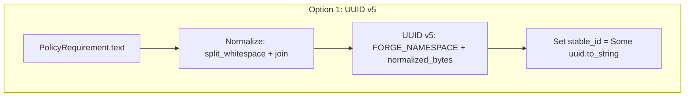
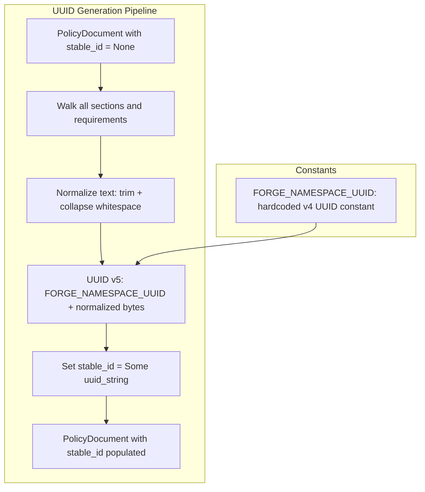
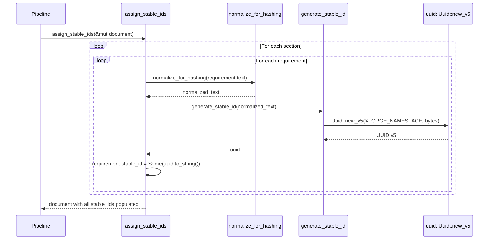

# 007-ar-uuid-generation

> **Document Type:** Architecture Review
> **Audience:** LLM agents, human reviewers
> **Status:** Proposed
> **Last Updated:** 2026-02-10 <!-- @auto -->
> **Owner:** Brian Luby <!-- @human-required -->
> **Deciders:** Brian Luby <!-- @human-required -->

---

## Review Tier Legend

| Marker | Tier | Speckit Behavior |
|--------|------|------------------|
| 🔴 `@human-required` | Human Generated | Prompt human to author; blocks until complete |
| 🟡 `@human-review` | LLM + Human Review | LLM drafts → prompt human to confirm/edit; blocks until confirmed |
| 🟢 `@llm-autonomous` | LLM Autonomous | LLM completes; no prompt; logged for audit |
| ⚪ `@auto` | Auto-generated | System fills (timestamps, links); no prompt |

---

## Document Completion Order

> ⚠️ **For LLM Agents:** Complete sections in this order. Do not fill downstream sections until upstream human-required inputs exist.

1. **Summary (Decision)** → requires human input first
2. **Context (Problem Space)** → requires human input
3. **Decision Drivers** → requires human input (prioritized)
4. **Driving Requirements** → extract from PRD, human confirms
5. **Options Considered** → LLM drafts after drivers exist, human reviews
6. **Decision (Selected + Rationale)** → requires human decision
7. **Implementation Guardrails** → LLM drafts, human reviews
8. **Everything else** → can proceed after decision is made

---

## Linkage ⚪ `@auto`

| Document | ID | Relationship |
|----------|-----|--------------|
| Parent PRD | [007-prd-uuid-generation](../PRD/007-prd-uuid-generation.md) | Requirements this architecture satisfies |
| Security Review | 007-sec-uuid-generation.md | Security implications of this decision |
| Supersedes | — | N/A |
| Superseded By | — | |

---

## Summary

### Decision 🔴 `@human-required`
> Use the `uuid` crate with UUID v5 (namespace + SHA-1 hash of normalized content) for deterministic identifier generation, with a fixed FORGE namespace UUID constant and whitespace normalization before hashing.

### TL;DR for Agents 🟡 `@human-review`
> Every `PolicyRequirement` gets a deterministic UUID v5 via `Uuid::new_v5(&FORGE_NAMESPACE_UUID, normalized_text.as_bytes())`. Text is normalized by `split_whitespace().collect::<Vec<&str>>().join(" ")` before hashing, so whitespace-only changes do not alter the UUID. The `FORGE_NAMESPACE_UUID` is a hardcoded v4 UUID constant — changing it is a breaking change that invalidates all previously generated IDs. Do NOT use UUID v4 (random). Do NOT over-normalize (no lowercasing, no punctuation stripping).

---

## Context

### Problem Space 🔴 `@human-required`
After atomization (WI-6), each `PolicyRequirement` needs a stable, deterministic identifier so that the same policy content always produces the same OSCAL output. Without deterministic IDs, every conversion run produces different UUIDs, making diffs meaningless, breaking traceability across re-conversions, and violating product principle P-3 (Deterministic and auditable). The parent PRD explicitly states: "Generating new UUIDs on every run breaks traceability and makes diffs meaningless." The identifier scheme must also be resilient to trivial formatting changes (whitespace edits) while sensitive to substantive text changes.

### Decision Scope 🟡 `@human-review`

**This AR decides:**
- The UUID version and generation algorithm for `PolicyRequirement.stable_id`
- The content normalization strategy before hashing
- The FORGE namespace UUID management approach
- The function interface for stable ID generation

**This AR does NOT decide:**
- UUID v4 generation for OSCAL artifact-level identifiers (document UUIDs) — deferred to WI-11
- CLI warning on stable ID changes between conversions — deferred to WI-43
- Case-insensitive or Unicode normalization — explicitly deferred (PRD W-3)
- Persistence of stable IDs — UUID v5 is deterministic by design, no persistence needed

### Current State 🟢 `@llm-autonomous`
After WI-6, `PolicyRequirement` structs have a `stable_id: Option<String>` field that is `None`. Preliminary content-based IDs from WI-6 exist but are not RFC 4122 compliant UUIDs. No UUID generation logic exists in the codebase.

### Driving Requirements 🟡 `@human-review`

| PRD Req ID | Requirement Summary | Architectural Implication |
|------------|---------------------|---------------------------|
| M-1 | Generate UUID v5 using FORGE namespace + normalized text | Must use `uuid` crate v5 feature with fixed namespace |
| M-2 | Normalize text: trim + collapse whitespace before hashing | Normalization function required before UUID generation |
| M-3 | Populate PolicyRequirement.stable_id for every requirement | Must walk entire PolicyDocument tree |
| M-4 | Identical text produces identical UUID across runs | Pure function, no randomness or runtime state |
| M-5 | Substantive text changes produce different UUID | Normalization must not be so aggressive as to erase real differences |

**PRD Constraints inherited:**
- From parent PRD M-8: Stable identifiers across re-conversions of same content
- From parent PRD EC-5: Whitespace-only changes must not alter the UUID
- From parent PRD EC-6: Substantive changes must alter the UUID
- From constitution principle X: YAGNI — minimal normalization only

---

## Decision Drivers 🔴 `@human-required`

1. **Determinism:** Same content must always produce the same UUID *(traces to PRD M-1, M-4, parent PRD M-8)*
2. **Whitespace resilience:** Trivial formatting changes must not alter IDs *(traces to PRD M-2, parent PRD EC-5)*
3. **Sensitivity:** Substantive text changes must produce different IDs *(traces to PRD M-5, parent PRD EC-6)*
4. **Simplicity:** Minimal normalization, standard crate, no custom hashing *(constitution principle X)*

---

## Options Considered 🟡 `@human-review`

### Option 0: Status Quo / Do Nothing

**Description:** Leave `PolicyRequirement.stable_id` as `None`. Use preliminary IDs from WI-6 or generate random UUIDs at OSCAL serialization time.

| Driver | Rating | Notes |
|--------|--------|-------|
| Determinism | ❌ Poor | Random UUIDs are non-deterministic; preliminary IDs are not RFC 4122 |
| Whitespace resilience | N/A | No UUID to protect |
| Sensitivity | N/A | No UUID to compare |
| Simplicity | ✅ Good | No code to write |

**Why not viable:** Parent PRD M-8 and product principle P-3 explicitly require deterministic, stable identifiers. Random UUIDs violate this and are rejected in the parent PRD Decision Log.

---

### Option 1: Deterministic UUID v5 with `uuid` Crate (Recommended)

**Description:** Use the `uuid` crate's UUID v5 implementation with a fixed FORGE namespace UUID. Normalize text by trimming and collapsing whitespace before hashing. The `uuid` crate implements RFC 4122 UUID v5 (SHA-1 hash of namespace + name).



| Driver | Rating | Notes |
|--------|--------|-------|
| Determinism | ✅ Good | UUID v5 is deterministic by definition: same namespace + same name = same UUID |
| Whitespace resilience | ✅ Good | split_whitespace + join collapses all whitespace variations to single spaces |
| Sensitivity | ✅ Good | Any non-whitespace text change produces a different SHA-1 hash = different UUID |
| Simplicity | ✅ Good | Standard crate (uuid), idiomatic Rust normalization, 3 lines of core logic |

**Pros:**
- RFC 4122 compliant — standard UUID format recognized by all tools
- `uuid` crate is the de facto Rust UUID library (MIT/Apache-2.0, widely used)
- Pure function: `fn(&str) -> Uuid` with no side effects or state
- Rust's `split_whitespace()` handles Unicode whitespace, tabs, newlines, and multiple spaces
- Negligible performance cost (SHA-1 hash of short strings)

**Cons:**
- UUID v5 uses SHA-1, which is cryptographically broken — acceptable here because this is content-addressing, not security
- Changing the namespace UUID is a breaking change requiring migration
- Theoretical SHA-1 collision risk — negligible at policy document scale (hundreds of requirements, not billions)

---

### Option 2: Random UUID v4

**Description:** Generate a random UUID v4 for each requirement using `Uuid::new_v4()`.

| Driver | Rating | Notes |
|--------|--------|-------|
| Determinism | ❌ Poor | Random by definition — every run produces different UUIDs |
| Whitespace resilience | N/A | Not applicable — UUIDs are random regardless of content |
| Sensitivity | N/A | Not applicable — UUIDs change every run regardless |
| Simplicity | ✅ Good | Single function call, no normalization needed |

**Pros:**
- Simplest implementation (one line of code)
- No namespace management

**Cons:**
- Fundamentally violates the core requirement: deterministic, stable identifiers
- Every conversion run produces different output — diffs are meaningless
- Explicitly rejected in parent PRD Decision Log

---

### Option 3: Custom Hash-Based IDs (Non-UUID)

**Description:** Generate identifiers using a custom scheme: SHA-256 hash of content, truncated to a fixed length, formatted as a hex string (e.g., `forge-a1b2c3d4e5f6`).

| Driver | Rating | Notes |
|--------|--------|-------|
| Determinism | ✅ Good | Hash is deterministic |
| Whitespace resilience | ✅ Good | Can normalize before hashing |
| Sensitivity | ✅ Good | Different content = different hash |
| Simplicity | ⚠️ Medium | Custom format; not RFC 4122 compliant; OSCAL expects UUIDs |

**Pros:**
- SHA-256 is cryptographically stronger than SHA-1
- Custom format could be shorter or more readable

**Cons:**
- OSCAL expects RFC 4122 UUIDs for element identifiers — custom format requires validation workarounds
- Non-standard format may confuse downstream tools
- Reinvents what the `uuid` crate already provides
- Adds unnecessary complexity per YAGNI

---

## Decision

### Selected Option 🔴 `@human-required`
> **Option 1: Deterministic UUID v5 with `uuid` Crate**

### Rationale 🔴 `@human-required`

UUID v5 is the correct choice because it is deterministic by design (same namespace + same name = same UUID), producing RFC 4122 compliant identifiers that OSCAL tooling expects. The `uuid` crate is the standard Rust implementation, already identified as the likely choice in the parent PRD tool evaluation. Random UUID v4 (Option 2) is explicitly rejected in the parent PRD Decision Log. Custom hash-based IDs (Option 3) violate the OSCAL expectation of RFC 4122 UUIDs and add unnecessary complexity.

#### Simplest Implementation Comparison 🟡 `@human-review`

| Aspect | Simplest Possible | Selected Option | Justification for Complexity |
|--------|-------------------|-----------------|------------------------------|
| Components | Single hash function | Normalizer + UUID v5 generator + tree walker | PRD M-2 requires normalization; M-3 requires walking all requirements |
| Dependencies | stdlib hash | `uuid` crate with v5 feature | OSCAL requires RFC 4122 UUIDs; `uuid` crate provides this |
| Patterns | Hash to hex string | Namespace UUID + normalize + UUID v5 | PRD M-1 specifies UUID v5; parent PRD Spike-4 validates this approach |

**Complexity justified by:** The selected option IS the simplest approach that produces RFC 4122 compliant deterministic UUIDs as required by OSCAL and PRD M-1.

### Architecture Diagram 🟡 `@human-review`



---

## Technical Specification

### Component Overview 🟡 `@human-review`

| Component | Responsibility | Interface | Dependencies |
|-----------|---------------|-----------|--------------|
| FORGE_NAMESPACE_UUID | Fixed namespace constant for all UUID v5 generation | `pub const Uuid` | uuid crate |
| normalize_for_hashing | Trim and collapse whitespace in text | `pub fn(&str) -> String` | None (stdlib) |
| generate_stable_id | Generate deterministic UUID v5 from text | `pub fn(&str) -> Uuid` | uuid crate, normalize_for_hashing |
| assign_stable_ids | Walk PolicyDocument tree and populate stable_id fields | `pub fn(&mut PolicyDocument)` | generate_stable_id, domain model |

### Data Flow 🟢 `@llm-autonomous`



### Interface Definitions 🟡 `@human-review`

```rust
use uuid::Uuid;

/// Fixed namespace UUID for all FORGE content-addressed identifier generation.
/// Fixed namespace UUID for all FORGE content-addressed identifier generation.
/// Implementation MUST generate a fresh project-specific v4 UUID once and hardcode it here.
/// DO NOT use well-known namespace UUIDs (DNS, URL, OID, X500) from RFC 4122.
/// WARNING: Changing this value will change ALL generated stable_ids and is a breaking change.
pub const FORGE_NAMESPACE_UUID: Uuid = Uuid::from_bytes([
    // 16 bytes — PLACEHOLDER: generate a real v4 UUID during implementation
    // e.g. via `uuidgen` CLI or `Uuid::new_v4()` and hardcode the bytes
    0xAA, 0xBB, 0xCC, 0xDD, 0xEE, 0xFF, 0x00, 0x11,
    0x22, 0x33, 0x44, 0x55, 0x66, 0x77, 0x88, 0x99,
]);

/// Normalize text for stable ID generation.
/// Trims leading/trailing whitespace and collapses internal whitespace runs to a single space.
/// Uses Rust's split_whitespace() which handles Unicode whitespace, tabs, newlines.
pub fn normalize_for_hashing(text: &str) -> String {
    text.split_whitespace().collect::<Vec<&str>>().join(" ")
}

/// Generate a deterministic UUID v5 from requirement text.
/// The text is normalized before hashing to ensure whitespace-insensitivity.
pub fn generate_stable_id(text: &str) -> Uuid {
    let normalized = normalize_for_hashing(text);
    Uuid::new_v5(&FORGE_NAMESPACE_UUID, normalized.as_bytes())
}

/// Populate stable_id on all PolicyRequirements in a PolicyDocument.
/// Walks the full section tree recursively.
pub fn assign_stable_ids(document: &mut PolicyDocument) {
    for section in &mut document.sections {
        assign_stable_ids_to_section(section);
    }
}

fn assign_stable_ids_to_section(section: &mut PolicySection) {
    for requirement in &mut section.requirements {
        let uuid = generate_stable_id(&requirement.text);
        requirement.stable_id = Some(uuid.to_string());
    }
    for child in &mut section.children {
        assign_stable_ids_to_section(child);
    }
}
```

### Key Algorithms/Patterns 🟡 `@human-review`

**Pattern:** Content-Addressed Identifier Generation
```
1. Define FORGE_NAMESPACE_UUID as compile-time constant (v4 UUID, generated once)
2. For each PolicyRequirement:
   a. Normalize text: split_whitespace().collect().join(" ")
   b. Generate UUID: Uuid::new_v5(&FORGE_NAMESPACE_UUID, normalized.as_bytes())
   c. Set stable_id = Some(uuid.to_string())
3. Result: every requirement has a deterministic, RFC 4122 UUID v5
```

---

## Constraints & Boundaries

### Technical Constraints 🟡 `@human-review`

**Inherited from PRD:**
- Deterministic: same content must always produce the same UUID (PRD M-4, parent PRD M-8)
- Whitespace-insensitive: trivial formatting changes must not alter UUID (PRD M-2, parent PRD EC-5)
- Content-sensitive: substantive changes must produce different UUID (PRD M-5, parent PRD EC-6)

**Added by this Architecture:**
- **uuid crate:** Latest stable version with `v5` feature enabled
- **Pure function:** `generate_stable_id` must be side-effect-free
- **Namespace immutability:** `FORGE_NAMESPACE_UUID` is a compile-time constant; changing it is a breaking change
- **No over-normalization:** Only whitespace normalization; no lowercasing, no punctuation removal, no Unicode normalization

### Architectural Boundaries 🟡 `@human-review`

- **Owns:** `FORGE_NAMESPACE_UUID`, `normalize_for_hashing`, `generate_stable_id`, `assign_stable_ids`
- **Interfaces With:** Domain model structs from WI-5 (`PolicyDocument`, `PolicySection`, `PolicyRequirement`)
- **Must Not Touch:** Requirement atomization (WI-6), citation extraction (WI-8), OSCAL generation (WI-9+)

### Implementation Guardrails 🟡 `@human-review`

> ⚠️ **Critical for LLM Agents:**

- [x] **DO NOT** use UUID v4 (random) for requirement identifiers — violates determinism *(parent PRD Decision Log)*
- [x] **DO NOT** hash raw un-normalized text — whitespace changes would produce different UUIDs *(PRD M-2)*
- [x] **DO NOT** make the namespace UUID configurable at runtime — accidental changes break ID stability *(PRD S-1)*
- [x] **DO NOT** over-normalize (lowercasing, punctuation removal) — risks false collisions on distinct requirements *(PRD W-3)*
- [x] **MUST** use `uuid` crate with UUID v5 and the fixed `FORGE_NAMESPACE_UUID` *(PRD M-1)*
- [x] **MUST** normalize with `split_whitespace().join(" ")` before hashing *(PRD M-2)*
- [x] **MUST** populate `stable_id` on every `PolicyRequirement` in the document tree *(PRD M-3)*

---

## Consequences 🟡 `@human-review`

### Positive
- Deterministic output enables meaningful diffs between conversion runs
- Whitespace normalization prevents trivial edits from breaking ID stability
- RFC 4122 compliant UUIDs integrate seamlessly with OSCAL tooling
- Pure function design makes the logic trivially testable

### Negative
- UUID v5 uses SHA-1 (cryptographically broken) — acceptable for content-addressing, not security
- Changing the namespace UUID invalidates all previously generated IDs (breaking change)
- Normalization is whitespace-only; other trivial changes (e.g., adding/removing a trailing period) will change the UUID

### Risks & Mitigations

| Risk | Likelihood | Impact | Mitigation |
|------|------------|--------|------------|
| Namespace UUID needs to change in the future | Low | Med | Document as versioned constant; any change requires a documented migration path |
| SHA-1 collision on different requirement texts | Extremely Low | Low | Negligible at policy document scale (hundreds, not billions of requirements) |
| Normalization too lenient (whitespace only) | Low | Low | Start conservative; extend normalization in later WIs if user feedback warrants it |

---

## Implementation Guidance

### Suggested Implementation Order 🟢 `@llm-autonomous`
1. Add `uuid` crate with `v5` feature to `Cargo.toml`
2. Generate and hardcode `FORGE_NAMESPACE_UUID` constant
3. Implement `normalize_for_hashing` function
4. Implement `generate_stable_id` function
5. Implement `assign_stable_ids` to walk PolicyDocument tree
6. Write TDD tests: determinism, normalization, sensitivity, edge cases
7. Verify Spike-4 acceptance criteria pass

### Testing Strategy 🟢 `@llm-autonomous`

| Layer | Test Type | Coverage Target | Notes |
|-------|-----------|-----------------|-------|
| Unit | Determinism (same text = same UUID) | AC-1 | Core contract |
| Unit | Normalization (whitespace variants = same UUID) | AC-2 | Whitespace resilience |
| Unit | Sensitivity (text change = different UUID) | AC-3 | Content sensitivity |
| Unit | All requirements populated | AC-4 | No None values after assign_stable_ids |
| Unit | Valid UUID v5 format | AC-5 | Version nibble = 5, correct variant bits |
| Unit | Edge cases (empty text, Unicode whitespace, nested sections) | EC-1 through EC-5 | Boundary conditions |

### Anti-patterns to Avoid 🟡 `@human-review`
- **Don't:** Use UUID v4 for requirement identifiers
  - **Why:** Non-deterministic; every run produces different output
  - **Instead:** Use UUID v5 with fixed namespace
- **Don't:** Hash raw text without normalization
  - **Why:** Whitespace changes alter the hash, violating EC-5
  - **Instead:** Normalize with split_whitespace().join(" ") first
- **Don't:** Make FORGE_NAMESPACE_UUID configurable or environment-dependent
  - **Why:** Different namespace = different UUIDs for same content
  - **Instead:** Hardcode as a compile-time constant

---

## Compliance & Cross-cutting Concerns

### Security Considerations 🟡 `@human-review`
- Authentication: N/A — local CLI tool, pure computation
- Authorization: N/A
- Data handling: Requirement text is hashed (SHA-1 via UUID v5); the UUID is derived from policy content but the content cannot be recovered from the UUID
- SHA-1: Used for content-addressing, not cryptographic security; acceptable per RFC 4122

### Observability 🟢 `@llm-autonomous`
- **Logging:** Log at DEBUG level: normalized text and generated UUID for each requirement (C-1)
- **Metrics:** Count of requirements with stable_ids assigned
- **Tracing:** N/A for this module

### Error Handling Strategy 🟢 `@llm-autonomous`
```
Error Category → Handling Approach
├── Empty requirement text → Generate UUID from empty string (well-defined behavior)
├── Unicode whitespace → Handled by Rust's split_whitespace() (supports Unicode)
├── Missing stable_id after assign → Logic error; should not occur if function completes
└── Requirements at all nesting depths → Recursive walk covers full tree
```

---

## Migration Plan (if applicable) 🟡 `@human-review`

N/A — greenfield implementation. No migration required.

### Rollback Plan 🔴 `@human-required`

N/A — greenfield feature. If the UUID generation logic proves incorrect, the `generate_stable_id` function can be updated and all IDs will regenerate deterministically on the next run. No persistence to migrate.

---

## Open Questions 🟡 `@human-review`

No open questions for this work item.

---

## Changelog ⚪ `@auto`

| Version | Date | Author | Changes |
|---------|------|--------|---------|
| 0.1 | 2026-02-10 | LLM (Claude) | Initial proposal |

---

## Decision Record ⚪ `@auto`

| Date | Event | Details |
|------|-------|---------|
| 2026-02-10 | Proposed | Initial draft created from PRD 007 |

---

## Traceability Matrix 🟢 `@llm-autonomous`

| PRD Req ID | Decision Driver | Option Rating | Component | Notes |
|------------|-----------------|---------------|-----------|-------|
| M-1 | Determinism | Option 1: ✅ | generate_stable_id | UUID v5 with FORGE namespace |
| M-2 | Whitespace resilience | Option 1: ✅ | normalize_for_hashing | split_whitespace().join(" ") |
| M-3 | Determinism | Option 1: ✅ | assign_stable_ids | Recursive tree walk populates all stable_ids |
| M-4 | Determinism | Option 1: ✅ | generate_stable_id | Pure function, same input = same output |
| M-5 | Sensitivity | Option 1: ✅ | generate_stable_id | Different text = different SHA-1 hash = different UUID |
| S-1 | Simplicity | Option 1: ✅ | FORGE_NAMESPACE_UUID | Documented constant with warning comment |
| S-2 | Simplicity | Option 1: ✅ | generate_stable_id | Accepts &str, reusable for other content-addressed IDs |

---

## Review Checklist 🟢 `@llm-autonomous`

Before marking as Accepted:
- [x] All PRD Must Have requirements appear in Driving Requirements
- [x] Option 0 (Status Quo) is documented
- [x] Simplest Implementation comparison is completed
- [x] Decision drivers are prioritized and addressed
- [x] At least 2 options were seriously considered
- [x] Constraints distinguish inherited vs. new
- [x] Component names are consistent across all diagrams and tables
- [x] Implementation guardrails reference specific PRD constraints
- [x] Rollback triggers and authority are defined (N/A — greenfield)
- [x] Security review is linked or N/A documented
- [x] No open questions blocking implementation
