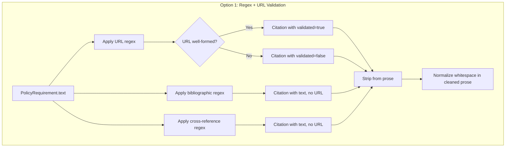
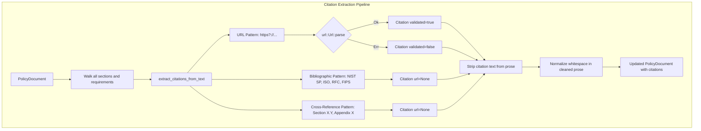
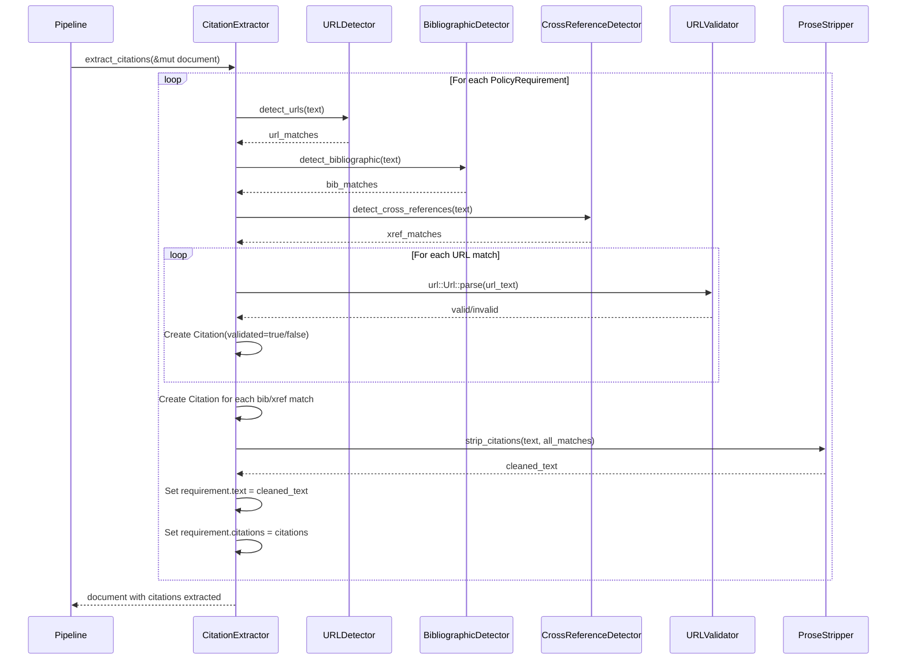

# 008-ar-citation-extraction

> **Document Type:** Architecture Review
> **Audience:** LLM agents, human reviewers
> **Status:** Proposed
> **Last Updated:** 2026-02-10 <!-- @auto -->
> **Owner:** Brian Luby <!-- @human-required -->
> **Deciders:** Brian Luby <!-- @human-required -->

---

## Review Tier Legend

| Marker | Tier | Speckit Behavior |
|--------|------|------------------|
| 🔴 `@human-required` | Human Generated | Prompt human to author; blocks until complete |
| 🟡 `@human-review` | LLM + Human Review | LLM drafts → prompt human to confirm/edit; blocks until confirmed |
| 🟢 `@llm-autonomous` | LLM Autonomous | LLM completes; no prompt; logged for audit |
| ⚪ `@auto` | Auto-generated | System fills (timestamps, links); no prompt |

---

## Document Completion Order

> ⚠️ **For LLM Agents:** Complete sections in this order. Do not fill downstream sections until upstream human-required inputs exist.

1. **Summary (Decision)** → requires human input first
2. **Context (Problem Space)** → requires human input
3. **Decision Drivers** → requires human input (prioritized)
4. **Driving Requirements** → extract from PRD, human confirms
5. **Options Considered** → LLM drafts after drivers exist, human reviews
6. **Decision (Selected + Rationale)** → requires human decision
7. **Implementation Guardrails** → LLM drafts, human reviews
8. **Everything else** → can proceed after decision is made

---

## Linkage ⚪ `@auto`

| Document | ID | Relationship |
|----------|-----|--------------|
| Parent PRD | [008-prd-citation-extraction](../PRD/008-prd-citation-extraction.md) | Requirements this architecture satisfies |
| Security Review | 008-sec-citation-extraction.md | Security implications of this decision |
| Supersedes | — | N/A |
| Superseded By | — | |

---

## Summary

### Decision 🔴 `@human-required`
> Use the `regex` crate for citation pattern detection (URLs, bibliographic references, cross-references) combined with the `url` crate for URL well-formedness validation, implemented as a pipeline enrichment pass that extracts citations into a `Citation` model and produces cleaned prose text.

### TL;DR for Agents 🟡 `@human-review`
> Citation extraction is a pure enrichment function `extract_citations(&mut PolicyDocument)` that scans each `PolicyRequirement.text` for three pattern types: inline URLs (regex for http/https), bibliographic references (regex for NIST SP, ISO, RFC, FIPS patterns), and cross-references (regex for "Section X.Y", "Appendix X", "Table N"). Detected patterns are extracted into `Citation` structs linked to their source requirement, and the citation text is stripped from the prose. Malformed URLs are preserved with `validated: false` — never silently dropped. Do NOT embed OSCAL back matter logic here; citation extraction produces the data model only.

---

## Context

### Problem Space 🔴 `@human-required`
Policy documents embed citations, URLs, and cross-references directly in requirement prose. If left in place during OSCAL generation, they pollute control statement text and violate the OSCAL convention that references belong in back matter as structured resources. Without extraction, citations would appear as unstructured text in prose or remarks fields, making them unsearchable, unlinkable, and inconsistent with NIST guidance. Parent PRD M-9 requires citations to be extracted into OSCAL back matter as resources, and M-11 prohibits storing arbitrary data in remarks. This work item provides the extraction layer that identifies citations and separates them from prose, producing clean text for OSCAL control statements and a structured citation collection for back matter assembly in WI-12.

### Decision Scope 🟡 `@human-review`

**This AR decides:**
- The pattern detection approach for URLs, bibliographic references, and cross-references
- The `Citation` struct design and its relationship to `PolicyRequirement`
- How extracted citations are stripped from prose text
- How malformed URLs are handled (preserved with unvalidated flag)

**This AR does NOT decide:**
- OSCAL back matter resource generation — deferred to 012-ar-back-matter
- Citation deduplication across requirements — deferred to WI-12
- URL reachability validation (network requests) — explicitly out of scope
- NLP-based citation detection — deferred per YAGNI

### Current State 🟢 `@llm-autonomous`
After WI-5, `PolicyRequirement` structs contain raw text that may include inline URLs, bibliographic references, and cross-references. No citation detection or extraction logic exists. The `PolicyRequirement` struct does not yet have a `citations` field.

### Driving Requirements 🟡 `@human-review`

| PRD Req ID | Requirement Summary | Architectural Implication |
|------------|---------------------|---------------------------|
| M-1 | Detect inline URLs (http://, https://) and extract into Citation objects | URL regex pattern required |
| M-2 | Strip extracted citation text from requirement prose | Text replacement and whitespace normalization after stripping |
| M-3 | Citation struct: id, requirement_id, text, url (optional) | Data model extension to PolicyRequirement |
| M-4 | Each Citation linked to its source PolicyRequirement | FK relationship in Citation struct |
| M-5 | Malformed URLs preserved with unvalidated flag | `url` crate for validation; `validated: bool` field on Citation |
| M-6 | Pipeline enrichment function on PolicyDocument | Function signature: `extract_citations(&mut PolicyDocument)` |

**PRD Constraints inherited:**
- From parent PRD M-9: Citations must be extracted into back matter, not embedded in prose
- From parent PRD M-11: No arbitrary data in remarks fields
- From parent PRD EC-7: Malformed URLs preserved with annotation, not silently dropped
- From constitution principle X: YAGNI — regex/pattern matching only, no NLP

---

## Decision Drivers 🔴 `@human-required`

1. **Extraction accuracy:** URLs and references must be reliably detected without false positives *(traces to PRD M-1)*
2. **Data preservation:** No citation data may be silently lost, including malformed URLs *(traces to PRD M-5, parent PRD EC-7)*
3. **Clean prose:** Extracted citations must be stripped cleanly, leaving readable prose *(traces to PRD M-2)*
4. **Simplicity:** Pattern matching only; no NLP or network requests *(constitution principle X)*

---

## Options Considered 🟡 `@human-review`

### Option 0: Status Quo / Do Nothing

**Description:** Leave citations embedded in requirement prose text. OSCAL control statements would contain raw URLs and reference text.

| Driver | Rating | Notes |
|--------|--------|-------|
| Extraction accuracy | ❌ Poor | No extraction occurs |
| Data preservation | ❌ Poor | Citations remain as unstructured text, not machine-queryable |
| Clean prose | ❌ Poor | Prose cluttered with URLs and reference strings |
| Simplicity | ✅ Good | No code to write |

**Why not viable:** Parent PRD M-9 explicitly requires citations to be extracted into OSCAL back matter as resources. Leaving them in prose violates M-9 and M-11.

---

### Option 1: Regex Pattern Matching + URL Validation (Recommended)

**Description:** Use the `regex` crate to detect three types of citation patterns in requirement text: (1) inline URLs via HTTP/HTTPS regex, (2) bibliographic references via patterns for well-known standards (NIST SP, ISO, RFC, FIPS), and (3) cross-references via patterns for section/appendix/table references. Use the `url` crate to validate detected URLs for well-formedness. Extract matched patterns into `Citation` structs and strip them from prose.



| Driver | Rating | Notes |
|--------|--------|-------|
| Extraction accuracy | ✅ Good | Regex patterns are well-suited for URL, standard-name, and section-reference patterns |
| Data preservation | ✅ Good | Malformed URLs preserved with validated=false; nothing silently dropped |
| Clean prose | ✅ Good | Matched text stripped; whitespace normalized after removal |
| Simplicity | ✅ Good | Two well-established crates (regex, url); straightforward patterns |

**Pros:**
- `regex` crate is already needed for WI-6 (atomization) — no new dependency category
- `url` crate provides reliable, standards-compliant URL validation (WHATWG URL Standard)
- Pattern-by-pattern approach is independently testable for each citation type
- Functional transformation: `(text) -> (cleaned_text, Vec<Citation>)` is easy to test

**Cons:**
- Bibliographic reference patterns are limited to known standard naming conventions (NIST SP, ISO, RFC, FIPS)
- May miss non-standard citation formats or unusual reference styles
- Cross-reference detection may produce false positives on ambiguous patterns

---

### Option 2: Parser Combinator Approach (nom)

**Description:** Use the `nom` parser combinator library to build a structured parser for citation patterns within requirement text.

| Driver | Rating | Notes |
|--------|--------|-------|
| Extraction accuracy | ✅ Good | Structured parsing handles nested and complex patterns well |
| Data preservation | ✅ Good | Parser can capture all matched and unmatched segments |
| Clean prose | ✅ Good | Parser naturally separates citation from non-citation text |
| Simplicity | ❌ Poor | Significant learning curve; overkill for flat pattern matching |

**Pros:**
- Powerful compositional parsing; handles complex nested patterns
- Well-suited for structured, formal grammars

**Cons:**
- Citation detection is flat pattern matching, not hierarchical parsing — nom is overkill
- Steeper learning curve and more verbose code than regex for this use case
- `nom` is not already in the dependency tree; regex is

---

### Option 3: Rule Engine with Configurable Patterns

**Description:** Implement a rule engine that loads citation patterns from a configuration file, enabling users to extend or customize citation detection.

| Driver | Rating | Notes |
|--------|--------|-------|
| Extraction accuracy | ⚠️ Medium | Accuracy depends on rule quality and configuration |
| Data preservation | ✅ Good | Rules can include preservation and flagging logic |
| Clean prose | ✅ Good | Rules define extraction and cleanup behavior |
| Simplicity | ❌ Poor | Configuration format, rule loading, validation — all unnecessary complexity for MVP |

**Pros:**
- Extensible: users can add custom citation patterns
- Configurable: different organizations can tune detection for their naming conventions

**Cons:**
- Massive over-engineering for the current use case — only well-known patterns needed for MVP
- Requires configuration file format, validation, error handling for malformed rules
- Violates YAGNI — no user has requested configurable patterns

---

## Decision

### Selected Option 🔴 `@human-required`
> **Option 1: Regex Pattern Matching + URL Validation**

### Rationale 🔴 `@human-required`

Option 1 is the right choice because citation detection is fundamentally flat pattern matching: URLs follow well-defined syntax, bibliographic references follow standard naming conventions, and cross-references follow structural patterns. Regex provides the right level of capability without the overhead of parser combinators (Option 2) or a configurable rule engine (Option 3). The `regex` crate is already in the dependency tree (or will be for WI-6), and the `url` crate provides standards-compliant validation. This follows constitution principle X (YAGNI) and product principle P-1 (Correctness over convenience).

#### Simplest Implementation Comparison 🟡 `@human-review`

| Aspect | Simplest Possible | Selected Option | Justification for Complexity |
|--------|-------------------|-----------------|------------------------------|
| Components | String contains() check for "http" | 3 regex patterns + url validation + stripping + normalization | PRD M-1 requires accurate URL extraction; S-1/S-2 require bibliographic and cross-ref detection |
| Dependencies | stdlib only | regex + url crates | regex needed for reliable pattern matching; url needed for well-formedness validation (PRD M-5) |
| Patterns | Single URL check | URL + bibliographic + cross-reference patterns | PRD S-1 and S-2 require bibliographic and cross-reference extraction |

**Complexity justified by:** PRD M-1 through M-6 require extraction of three citation types with validation and prose cleanup. The selected option provides the minimum capability to satisfy these requirements.

### Architecture Diagram 🟡 `@human-review`



---

## Technical Specification

### Component Overview 🟡 `@human-review`

| Component | Responsibility | Interface | Dependencies |
|-----------|---------------|-----------|--------------|
| CitationExtractor | Orchestrate citation extraction across PolicyDocument | `extract_citations(&mut PolicyDocument) -> Result<(), ForgeError>` | regex, url, domain model |
| URLDetector | Detect inline HTTP/HTTPS URLs in text | Internal regex matching | regex crate |
| BibliographicDetector | Detect standard references (NIST SP, ISO, RFC, FIPS) | Internal regex matching | regex crate |
| CrossReferenceDetector | Detect section/appendix/table references | Internal regex matching | regex crate |
| URLValidator | Validate detected URLs for well-formedness | `url::Url::parse()` | url crate |
| ProseStripper | Remove citation text and normalize whitespace | Internal string processing | None (stdlib) |
| Citation | Data model for extracted citations | Struct | None |

### Data Flow 🟢 `@llm-autonomous`



### Interface Definitions 🟡 `@human-review`

```rust
use url::Url;

/// A citation extracted from policy requirement text.
#[derive(Debug, Clone)]
pub struct Citation {
    /// Unique identifier for this citation
    pub id: String,
    /// ID of the PolicyRequirement this citation was extracted from
    pub requirement_id: String,
    /// Display text of the citation (standard name, reference label, URL text)
    pub text: String,
    /// URL if the citation contains a link; None for bibliographic/cross-refs
    pub url: Option<String>,
    /// Whether the URL (if present) is well-formed; false for malformed URLs
    pub validated: bool,
}

/// Enrichment function: extract citations from all requirements in a document.
/// Modifies requirements in place: strips citation text from prose, populates citations field.
pub fn extract_citations(
    document: &mut PolicyDocument,
) -> Result<(), ForgeError>;

/// Lower-level: extract citations from a single requirement's text.
/// Returns (cleaned_text, extracted_citations).
pub fn extract_citations_from_text(
    requirement_id: &str,
    text: &str,
) -> Result<(String, Vec<Citation>), ForgeError>;

// PolicyRequirement gains a citations field:
// pub citations: Vec<Citation>,  // populated by WI-8
```

### Key Algorithms/Patterns 🟡 `@human-review`

**Pattern:** Multi-Pattern Citation Extraction and Prose Cleaning
```
1. Compile regex patterns (once, reuse across calls):
   a. URL pattern: https?://[^\s\)\]>]+
   b. Bibliographic: \b(NIST SP|ISO|RFC|FIPS)\s+\d+[\w\-\.]*(\s+Rev\.?\s+\d+)?[\w\s,]*
   c. Cross-reference: \b(Section|Appendix|Table)\s+[\dA-Z]+(\.\d+)*\b
2. For each PolicyRequirement.text:
   a. Apply all three patterns, collecting matches with positions
   b. For each URL match: validate with url::Url::parse()
      - Ok → Citation { validated: true }
      - Err → Citation { validated: false }
   c. For each bibliographic match: Citation { url: None, validated: true }
   d. For each cross-reference match: Citation { url: None, validated: true }
   e. Strip all matched text from prose (replace with empty string)
   f. Normalize whitespace: collapse double spaces, trim
3. Update requirement: text = cleaned_prose, citations = extracted_citations
```

---

## Constraints & Boundaries

### Technical Constraints 🟡 `@human-review`

**Inherited from PRD:**
- Citations must be extracted, not left in prose (parent PRD M-9)
- No arbitrary data in remarks fields (parent PRD M-11)
- Malformed URLs preserved with annotation (parent PRD EC-7)
- No network requests during conversion (parent PRD technical constraints)

**Added by this Architecture:**
- **regex crate:** Latest stable version for pattern detection
- **url crate:** Latest stable version for URL validation
- **Idempotent:** Running extraction twice produces the same result (PRD S-3)
- **No back matter logic:** This module extracts citations into the data model only; OSCAL back matter assembly is WI-12
- **Conservative patterns:** Bibliographic and cross-reference patterns match known naming conventions only; ambiguous text is not extracted

### Architectural Boundaries 🟡 `@human-review`

- **Owns:** `extract_citations`, `extract_citations_from_text`, `Citation` struct, URL/bibliographic/cross-reference regex patterns
- **Interfaces With:** Domain model structs from WI-5 (`PolicyDocument`, `PolicySection`, `PolicyRequirement`)
- **Must Not Touch:** OSCAL back matter generation (WI-12), OSCAL link element generation (WI-12), citation deduplication (WI-12)

### Implementation Guardrails 🟡 `@human-review`

> ⚠️ **Critical for LLM Agents:**

- [x] **DO NOT** silently drop malformed URLs — preserve with `validated: false` *(parent PRD EC-7)*
- [x] **DO NOT** embed OSCAL back matter logic in this module — extraction produces data model only *(PRD W-1)*
- [x] **DO NOT** perform network requests to validate URL reachability *(PRD W-3, parent PRD technical constraints)*
- [x] **DO NOT** use overly aggressive regex that matches ordinary text as citations *(risk R-3)*
- [x] **MUST** extract inline URLs and strip them from prose *(PRD M-1, M-2)*
- [x] **MUST** link each Citation to its source PolicyRequirement *(PRD M-4)*
- [x] **MUST** normalize whitespace in cleaned prose after stripping citations *(PRD M-2)*

---

## Consequences 🟡 `@human-review`

### Positive
- Clean prose text for OSCAL control statements, free of embedded URLs and references
- Structured citation data model enables machine-queryable back matter in WI-12
- Malformed URLs are preserved, not lost, satisfying compliance tooling requirements
- Independently testable enrichment pass decoupled from parsing and OSCAL generation

### Negative
- Bibliographic detection limited to known standard naming conventions; may miss organization-specific references
- Cross-reference detection may miss unconventional patterns (e.g., "refer to paragraph 4.2.1")
- Prose cleanup after stripping may leave minor grammatical artifacts ("must comply with requirements" after URL removal)

### Risks & Mitigations

| Risk | Likelihood | Impact | Mitigation |
|------|------------|--------|------------|
| Bibliographic patterns miss organization-specific references | Med | Med | Start with NIST SP, ISO, RFC, FIPS; expand pattern library based on user feedback |
| Aggressive citation stripping damages prose readability | Low | Med | Test with realistic policy text; normalize whitespace after stripping |
| Cross-reference false positives on ordinary text | Med | Low | Require structural cues ("Section X.Y" with capital S and number); conservative matching |

---

## Implementation Guidance

### Suggested Implementation Order 🟢 `@llm-autonomous`
1. Define `Citation` struct and add `citations: Vec<Citation>` field to `PolicyRequirement`
2. Implement URL detection regex and URL validation via `url` crate
3. Implement bibliographic reference detection regex (NIST SP, ISO, RFC, FIPS)
4. Implement cross-reference detection regex (Section, Appendix, Table)
5. Implement `extract_citations_from_text` with all three pattern types
6. Implement prose stripping and whitespace normalization
7. Implement `extract_citations` to walk PolicyDocument tree
8. Write comprehensive unit tests for each citation type and edge cases

### Testing Strategy 🟢 `@llm-autonomous`

| Layer | Test Type | Coverage Target | Notes |
|-------|-----------|-----------------|-------|
| Unit | URL extraction | AC-1, AC-2 | Single and multiple URLs |
| Unit | URL validation | AC-4 | Malformed URL preserved with validated=false |
| Unit | Bibliographic extraction | AC-6 | NIST SP, ISO, RFC patterns |
| Unit | Cross-reference extraction | AC-7 | Section, Appendix, Table patterns |
| Unit | Prose cleaning | AC-1, AC-5 | No residual citation text; normalized whitespace |
| Unit | Edge cases | EC-1 through EC-7 | No citations, parenthesized URLs, duplicate URLs |
| Integration | Full document extraction | AC-5 | All requirements processed |

### Anti-patterns to Avoid 🟡 `@human-review`
- **Don't:** Silently drop malformed URLs
  - **Why:** Violates parent PRD EC-7 and loses data
  - **Instead:** Preserve with `validated: false` annotation
- **Don't:** Embed OSCAL back matter assembly logic
  - **Why:** Couples extraction to OSCAL serialization; WI-12 handles back matter
  - **Instead:** Extract into `Citation` structs; let WI-12 consume them
- **Don't:** Match overly broad patterns for cross-references
  - **Why:** "section" in lowercase prose text would produce false positives
  - **Instead:** Require capital letter and number: `Section \d+(\.\d+)*`

---

## Compliance & Cross-cutting Concerns

### Security Considerations 🟡 `@human-review`
- Authentication: N/A — local CLI tool
- Authorization: N/A
- Data handling: Policy text and URLs are processed; URLs from policy documents may point to internal or sensitive resources
- ReDoS: Regex patterns must be bounded; URL regex in particular must not backtrack on long input
- No network access: URLs are extracted and validated syntactically only, never fetched

### Observability 🟢 `@llm-autonomous`
- **Logging:** Log at DEBUG level: count of citations extracted per requirement by type (URL, bibliographic, cross-reference)
- **Metrics:** Total citations extracted per document; count of malformed URLs
- **Tracing:** N/A for this module

### Error Handling Strategy 🟢 `@llm-autonomous`
```
Error Category → Handling Approach
├── No citations in text → Return text unchanged, empty citations vec
├── Malformed URL detected → Create Citation with validated=false (per EC-7)
├── Regex compilation failure → ForgeError::Parse at startup (should not happen with static patterns)
├── Prose normalization edge cases → Collapse whitespace, trim; accept minor grammatical artifacts
└── Zero requirements in document → Return document unchanged, no error
```

---

## Migration Plan (if applicable) 🟡 `@human-review`

N/A — greenfield implementation. No migration required.

### Rollback Plan 🔴 `@human-required`

N/A — greenfield feature. If citation extraction logic proves incorrect, it is revised in a subsequent sprint. The extractor is a pipeline enrichment pass — removing it returns behavior to the pre-WI-8 state (citations remain in prose text).

---

## Open Questions 🟡 `@human-review`

No open questions for this work item.

---

## Changelog ⚪ `@auto`

| Version | Date | Author | Changes |
|---------|------|--------|---------|
| 0.1 | 2026-02-10 | LLM (Claude) | Initial proposal |

---

## Decision Record ⚪ `@auto`

| Date | Event | Details |
|------|-------|---------|
| 2026-02-10 | Proposed | Initial draft created from PRD 008 |

---

## Traceability Matrix 🟢 `@llm-autonomous`

| PRD Req ID | Decision Driver | Option Rating | Component | Notes |
|------------|-----------------|---------------|-----------|-------|
| M-1 | Extraction accuracy | Option 1: ✅ | URLDetector | Regex detects http/https URLs |
| M-2 | Clean prose | Option 1: ✅ | ProseStripper | Strips citation text, normalizes whitespace |
| M-3 | Data preservation | Option 1: ✅ | Citation struct | Fields: id, requirement_id, text, url, validated |
| M-4 | Data preservation | Option 1: ✅ | CitationExtractor | Each Citation linked to source requirement |
| M-5 | Data preservation | Option 1: ✅ | URLValidator | Malformed URLs get validated=false |
| M-6 | Simplicity | Option 1: ✅ | CitationExtractor | Pipeline enrichment on PolicyDocument |
| S-1 | Extraction accuracy | Option 1: ✅ | BibliographicDetector | Patterns for NIST SP, ISO, RFC, FIPS |
| S-2 | Extraction accuracy | Option 1: ✅ | CrossReferenceDetector | Patterns for Section, Appendix, Table |
| S-3 | Clean prose | Option 1: ✅ | CitationExtractor | Idempotent: second run finds no citations |

---

## Review Checklist 🟢 `@llm-autonomous`

Before marking as Accepted:
- [x] All PRD Must Have requirements appear in Driving Requirements
- [x] Option 0 (Status Quo) is documented
- [x] Simplest Implementation comparison is completed
- [x] Decision drivers are prioritized and addressed
- [x] At least 2 options were seriously considered
- [x] Constraints distinguish inherited vs. new
- [x] Component names are consistent across all diagrams and tables
- [x] Implementation guardrails reference specific PRD constraints
- [x] Rollback triggers and authority are defined (N/A — greenfield)
- [x] Security review is linked or N/A documented
- [x] No open questions blocking implementation
