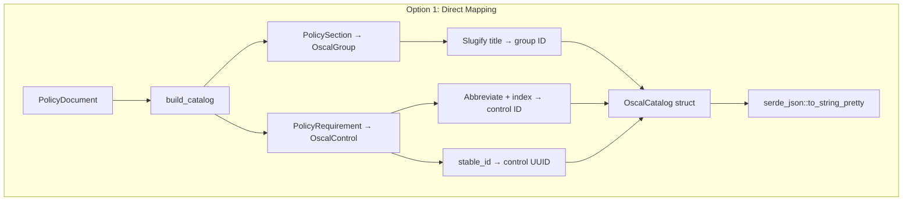
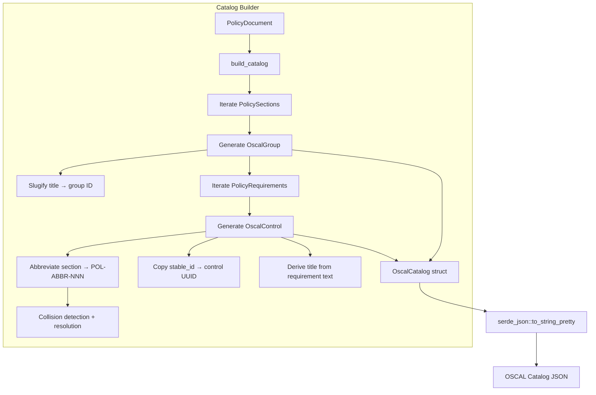
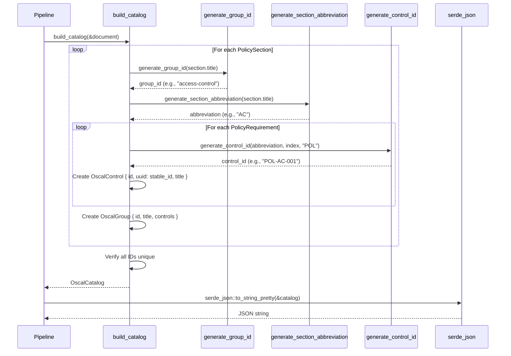

# 009-ar-catalog-groups-controls

> **Document Type:** Architecture Review
> **Audience:** LLM agents, human reviewers
> **Status:** Proposed
> **Last Updated:** 2026-02-10 <!-- @auto -->
> **Owner:** Brian Luby <!-- @human-required -->
> **Deciders:** Brian Luby <!-- @human-required -->

---

## Review Tier Legend

| Marker | Tier | Speckit Behavior |
|--------|------|------------------|
| 🔴 `@human-required` | Human Generated | Prompt human to author; blocks until complete |
| 🟡 `@human-review` | LLM + Human Review | LLM drafts → prompt human to confirm/edit; blocks until confirmed |
| 🟢 `@llm-autonomous` | LLM Autonomous | LLM completes; no prompt; logged for audit |
| ⚪ `@auto` | Auto-generated | System fills (timestamps, links); no prompt |

---

## Document Completion Order

> ⚠️ **For LLM Agents:** Complete sections in this order. Do not fill downstream sections until upstream human-required inputs exist.

1. **Summary (Decision)** → requires human input first
2. **Context (Problem Space)** → requires human input
3. **Decision Drivers** → requires human input (prioritized)
4. **Driving Requirements** → extract from PRD, human confirms
5. **Options Considered** → LLM drafts after drivers exist, human reviews
6. **Decision (Selected + Rationale)** → requires human decision
7. **Implementation Guardrails** → LLM drafts, human reviews
8. **Everything else** → can proceed after decision is made

---

## Linkage ⚪ `@auto`

| Document | ID | Relationship |
|----------|-----|--------------|
| Parent PRD | [009-prd-catalog-groups-controls](../PRD/009-prd-catalog-groups-controls.md) | Requirements this architecture satisfies |
| Security Review | 009-sec-catalog-groups-controls.md | Security implications of this decision |
| Supersedes | — | N/A |
| Superseded By | — | |

---

## Summary

### Decision 🔴 `@human-required`
> Implement a direct mapping from the domain model to OSCAL Catalog JSON using custom Rust structs with `serde::Serialize` derives: `PolicySection` maps to `OscalGroup`, `PolicyRequirement` maps to `OscalControl`, with deterministic control IDs following the `POL-{ABBR}-{NNN}` pattern and group IDs derived from slugified section titles.

### TL;DR for Agents 🟡 `@human-review`
> The Catalog builder is a pure function `build_catalog(&PolicyDocument) -> Result<OscalCatalog, ForgeError>` in the `oscal` module. It maps sections to groups (slugified title = group ID) and requirements to controls (pattern `POL-{ABBR}-{NNN}` where ABBR = initials of significant words in section title). Controls get their UUID from `PolicyRequirement.stable_id` (WI-7). Serialize with `serde_json`. Do NOT add statement parts (WI-10), metadata (WI-11), or back matter (WI-12) in this work item. Do NOT use `serde_json::Value` — use typed structs. Do NOT mutate the domain model during building.

---

## Context

### Problem Space 🔴 `@human-required`
The pipeline now has a fully enriched `PolicyDocument` with atomized requirements, stable UUIDs, and extracted citations. However, no mechanism exists to convert this domain model into OSCAL output. The Catalog model is the foundational OSCAL artifact — it defines groups of controls that represent the organizational structure and individual requirements of the source policy. Without this mapping layer, the pipeline produces only an internal representation with no OSCAL output, and all downstream work items (statement parts, metadata, back matter, component definitions) have no structure to build upon. The core architectural question is how to map the domain model hierarchy to OSCAL's group/control hierarchy while generating human-readable, deterministic, unique control IDs.

### Decision Scope 🟡 `@human-review`

**This AR decides:**
- The mapping strategy from domain model (PolicySection/PolicyRequirement) to OSCAL (Group/Control)
- The control ID generation algorithm (pattern, abbreviation derivation, collision handling)
- The group ID generation algorithm (slugification)
- The OSCAL Catalog struct design with serde serialization
- The Catalog builder function interface

**This AR does NOT decide:**
- Control statement parts and prose content — deferred to 010-ar-catalog-statement-parts
- OSCAL metadata assembly (uuid, title, last-modified) — deferred to WI-11
- Back matter resource generation from citations — deferred to WI-12
- End-to-end CLI wiring — deferred to WI-13
- OSCAL JSON schema validation — deferred to WI-19

### Current State 🟢 `@llm-autonomous`
After WI-5 through WI-8, the `PolicyDocument` contains enriched `PolicySection` and `PolicyRequirement` structs with atomized text, stable UUIDs, and extracted citations. No OSCAL data structures or serialization logic exists in the codebase.

### Driving Requirements 🟡 `@human-review`

| PRD Req ID | Requirement Summary | Architectural Implication |
|------------|---------------------|---------------------------|
| M-1 | Map each PolicySection to an OSCAL group, preserving order | Direct mapping with order preservation |
| M-2 | Group ID from section title; group title matches section title | Slugification algorithm needed |
| M-3 | Map each PolicyRequirement to an OSCAL control in parent group | Direct mapping within group context |
| M-4 | Control ID: human-readable, `POL-{ABBR}-{NNN}` pattern | Abbreviation derivation and zero-padded indexing |
| M-5 | Control title from requirement text | Truncation strategy for long text |
| M-6 | Control UUID from PolicyRequirement.stable_id | Direct assignment from WI-7 output |
| M-7 | Serialize to valid JSON via serde/serde_json | Custom structs with Serialize derives |
| M-8 | Control IDs unique across entire Catalog | Collision detection and resolution |

**PRD Constraints inherited:**
- From parent PRD M-3: Valid OSCAL v1.2.0 Catalog with controls in groups
- From parent PRD M-7: JSON output format
- From parent PRD M-8: UUIDs from WI-7
- From constitution technology stack: serde + serde_json for serialization

---

## Decision Drivers 🔴 `@human-required`

1. **OSCAL compliance:** Generated Catalog must match OSCAL v1.2.0 JSON structure *(traces to PRD M-7, parent PRD M-3)*
2. **Human-readable IDs:** Control IDs must be meaningful and traceable to source sections *(traces to PRD M-4)*
3. **Uniqueness:** No duplicate control or group IDs across the entire Catalog *(traces to PRD M-8)*
4. **Simplicity:** Pure function mapping, typed structs, no unnecessary abstraction *(constitution principle X)*

---

## Options Considered 🟡 `@human-review`

### Option 0: Status Quo / Do Nothing

**Description:** No OSCAL generation. The pipeline produces only the internal domain model.

| Driver | Rating | Notes |
|--------|--------|-------|
| OSCAL compliance | ❌ Poor | No OSCAL output at all |
| Human-readable IDs | N/A | No IDs generated |
| Uniqueness | N/A | No IDs to collide |
| Simplicity | ✅ Good | No code to write |

**Why not viable:** Parent PRD M-3 requires valid OSCAL Catalog generation. Without this, the pipeline delivers no user value. All downstream WIs (WI-10 through WI-18) are blocked.

---

### Option 1: Direct Mapping with Custom Serde Structs (Recommended)

**Description:** Define custom Rust structs (`OscalCatalog`, `OscalGroup`, `OscalControl`) with `#[derive(Serialize)]` and `#[serde(rename = "...")]` attributes for OSCAL-compliant field naming. Implement a `build_catalog()` pure function that directly maps domain model entities to OSCAL structs. Generate control IDs via a deterministic abbreviation algorithm with collision detection.



| Driver | Rating | Notes |
|--------|--------|-------|
| OSCAL compliance | ✅ Good | Typed structs enforce correct JSON shape; serde rename handles field naming |
| Human-readable IDs | ✅ Good | POL-{ABBR}-{NNN} pattern is meaningful and scannable |
| Uniqueness | ✅ Good | Abbreviation tracker + collision detection ensure global uniqueness |
| Simplicity | ✅ Good | Direct mapping with no intermediate representation |

**Pros:**
- Type-safe: Rust compiler catches structural errors at compile time
- Deterministic: slugification and abbreviation are pure functions
- Incremental: controls are shells (ID, title, UUID) that WI-10, WI-11, WI-12 extend
- Familiar: serde/serde_json is the standard Rust serialization stack

**Cons:**
- Custom OSCAL structs must be manually kept in sync with OSCAL v1.2.0 schema
- Abbreviation algorithm may produce non-intuitive abbreviations for unusual section titles
- Placeholder metadata fields required until WI-11

---

### Option 2: Configurable Mapping Rules

**Description:** Define mapping rules in a configuration file (e.g., TOML/YAML) that specify how sections map to groups and how control IDs are generated. The builder reads rules and applies them dynamically.

| Driver | Rating | Notes |
|--------|--------|-------|
| OSCAL compliance | ✅ Good | Rules can encode OSCAL structure |
| Human-readable IDs | ✅ Good | Rules allow customization of ID patterns |
| Uniqueness | ✅ Good | Rules can include collision resolution logic |
| Simplicity | ❌ Poor | Config format, parsing, validation, default handling — massive over-engineering |

**Pros:**
- Flexible: users can customize mapping for different policy structures
- Extensible: new mapping patterns added via configuration, not code

**Cons:**
- Violates YAGNI: no user has requested configurable mapping
- Configuration adds a new file format, parser, validator, and error surface
- Harder to test: must test both the rule engine and specific rule configurations
- Solo developer overhead: maintaining config documentation and migration

---

### Option 3: Intermediate Representation (IR)

**Description:** Convert the domain model to an intermediate representation (IR) that is neither the domain model nor OSCAL, then map the IR to OSCAL. The IR would be a normalized, flattened structure optimized for OSCAL generation.

| Driver | Rating | Notes |
|--------|--------|-------|
| OSCAL compliance | ✅ Good | IR can be designed to map cleanly to OSCAL |
| Human-readable IDs | ✅ Good | IDs generated during IR construction |
| Uniqueness | ✅ Good | IR normalizes IDs before OSCAL mapping |
| Simplicity | ❌ Poor | Extra layer between domain model and OSCAL adds complexity without clear benefit |

**Pros:**
- Decouples domain model evolution from OSCAL serialization
- IR could serve multiple output formats (Catalog, Component Definition)

**Cons:**
- Extra abstraction layer with no demonstrated need — violates YAGNI
- Two mappings to maintain (domain → IR, IR → OSCAL) instead of one
- Delayed delivery for speculative future benefit
- Domain model is already stable enough for direct mapping

---

## Decision

### Selected Option 🔴 `@human-required`
> **Option 1: Direct Mapping with Custom Serde Structs**

### Rationale 🔴 `@human-required`

Option 1 is the simplest approach that produces correct OSCAL output. The domain model (PolicySection, PolicyRequirement) maps naturally to OSCAL structures (Group, Control) — there is no impedance mismatch that justifies an intermediate representation (Option 3) or a configurable mapping engine (Option 2). Custom serde structs provide compile-time type safety, and the `POL-{ABBR}-{NNN}` pattern produces human-readable, deterministic control IDs. This follows constitution principle X (YAGNI) and the product roadmap's sprint-level scope.

#### Simplest Implementation Comparison 🟡 `@human-review`

| Aspect | Simplest Possible | Selected Option | Justification for Complexity |
|--------|-------------------|-----------------|------------------------------|
| Components | Manual JSON string concatenation | Typed OSCAL structs + serde_json | PRD M-7 requires valid JSON; serde provides correctness guarantees |
| Dependencies | stdlib only | serde + serde_json | Constitution technology stack mandates serde for serialization |
| Patterns | Sequential numeric IDs | POL-{ABBR}-{NNN} with abbreviation + collision detection | PRD M-4 requires human-readable IDs traceable to source sections |

**Complexity justified by:** PRD M-4 requires human-readable control IDs traceable to sections. PRD M-8 requires global uniqueness. The abbreviation algorithm and collision detector are the minimum complexity needed to satisfy these requirements.

### Architecture Diagram 🟡 `@human-review`



---

## Technical Specification

### Component Overview 🟡 `@human-review`

| Component | Responsibility | Interface | Dependencies |
|-----------|---------------|-----------|--------------|
| OscalCatalog | Top-level Catalog struct with groups | `#[derive(Serialize)]` struct | serde |
| OscalGroup | Group struct with controls and nested groups | `#[derive(Serialize)]` struct | serde |
| OscalControl | Control struct with id, uuid, title | `#[derive(Serialize)]` struct | serde |
| OscalMetadata | Placeholder metadata (populated by WI-11) | `#[derive(Serialize)]` struct | serde |
| build_catalog | Map PolicyDocument to OscalCatalog | `pub fn(&PolicyDocument) -> Result<OscalCatalog, ForgeError>` | domain model, serde_json |
| generate_group_id | Slugify section title to group ID | `fn(&str) -> String` | None |
| generate_section_abbreviation | Derive abbreviation from section title | `fn(&str) -> String` | None |
| generate_control_id | Create POL-{ABBR}-{NNN} control ID | `fn(&str, usize, &str) -> String` | None |

### Data Flow 🟢 `@llm-autonomous`



### Interface Definitions 🟡 `@human-review`

```rust
use serde::Serialize;

/// OSCAL Catalog root structure.
/// Metadata and back matter are placeholders — populated by WI-11 and WI-12.
#[derive(Debug, Serialize)]
pub struct OscalCatalog {
    /// Placeholder UUID — populated by WI-11
    pub uuid: String,
    /// Placeholder metadata — populated by WI-11
    pub metadata: OscalMetadata,
    /// Groups mapped from PolicySections
    #[serde(skip_serializing_if = "Vec::is_empty")]
    pub groups: Vec<OscalGroup>,
}

/// OSCAL Group mapped from a PolicySection.
#[derive(Debug, Serialize)]
pub struct OscalGroup {
    /// Human-readable group ID (e.g., "access-control")
    pub id: String,
    /// Group title from PolicySection.title
    pub title: String,
    /// Controls mapped from PolicyRequirements
    #[serde(skip_serializing_if = "Vec::is_empty")]
    pub controls: Vec<OscalControl>,
    /// Nested child groups (from nested PolicySections)
    #[serde(skip_serializing_if = "Vec::is_empty")]
    pub groups: Vec<OscalGroup>,
}

/// OSCAL Control mapped from a PolicyRequirement.
#[derive(Debug, Serialize)]
pub struct OscalControl {
    /// Human-readable control ID (e.g., "POL-AC-001")
    pub id: String,
    /// Stable UUID from PolicyRequirement.stable_id (WI-7)
    pub uuid: String,
    /// Control title derived from requirement text
    pub title: String,
    // parts: Vec<OscalPart> — added by WI-10
    // props: Vec<OscalProp> — added by later WIs
    // links: Vec<OscalLink> — added by WI-12
}

/// Placeholder metadata struct — fully implemented in WI-11.
#[derive(Debug, Serialize)]
pub struct OscalMetadata {
    pub title: String,
    #[serde(rename = "last-modified")]
    pub last_modified: String,
    pub version: String,
    #[serde(rename = "oscal-version")]
    pub oscal_version: String,
}

/// Build an OSCAL Catalog from a PolicyDocument.
/// Pure function: reads domain model, produces OSCAL struct. No side effects.
pub fn build_catalog(document: &PolicyDocument) -> Result<OscalCatalog, ForgeError>;

/// Generate a group ID from a section title.
/// Slugifies: lowercase, replace spaces/special chars with hyphens, strip non-alphanumeric.
/// Example: "Access Control Policies" -> "access-control-policies"
fn generate_group_id(section_title: &str) -> String;

/// Generate a section abbreviation from a section title.
/// Takes initials of significant words (skip stop words: "and", "the", "of", "for").
/// Example: "Access Control" -> "AC", "Incident Response and Recovery" -> "IR"
fn generate_section_abbreviation(section_title: &str) -> String;

/// Generate a control ID from section abbreviation and requirement index.
/// Pattern: {prefix}-{abbreviation}-{NNN} (zero-padded 3 digits, extending if >999).
/// Example: generate_control_id("AC", 0, "POL") -> "POL-AC-001"
fn generate_control_id(
    section_abbreviation: &str,
    requirement_index: usize,
    prefix: &str,
) -> String;
```

### Key Algorithms/Patterns 🟡 `@human-review`

**Pattern:** Section Title Abbreviation with Collision Resolution
```
1. For each section title:
   a. Split into words
   b. Remove stop words ("and", "the", "of", "for", "in", "to")
   c. Take first letter of each remaining word, uppercase
   d. Result: abbreviation (e.g., "Access Control" → "AC")
2. Track used abbreviations across entire Catalog
3. On collision (two sections produce same abbreviation):
   a. Append numeric suffix: "AC", "AC2"
   b. Or use longer abbreviation: take first two letters of first word
4. For each control ID:
   a. Format: POL-{ABBR}-{NNN} where NNN is 1-indexed, zero-padded
   b. Track all control IDs; verify global uniqueness

Group ID Slugification:
1. Lowercase the title
2. Replace non-alphanumeric characters with hyphens
3. Collapse consecutive hyphens
4. Trim leading/trailing hyphens
```

---

## Constraints & Boundaries

### Technical Constraints 🟡 `@human-review`

**Inherited from PRD:**
- OSCAL v1.2.0 Catalog JSON structure (parent PRD M-3)
- JSON output format (parent PRD M-7)
- UUIDs from WI-7 stable_id (parent PRD M-8)
- serde + serde_json for serialization (constitution technology stack)

**Added by this Architecture:**
- **Pure function:** `build_catalog` must be read-only on the domain model; no side effects
- **Typed structs:** All OSCAL structures are custom Rust structs with `#[derive(Serialize)]`; no `serde_json::Value`
- **Placeholder fields:** `uuid` and `metadata` use placeholder values until WI-11
- **Control ID uniqueness:** Global uniqueness enforced at build time; error if collision cannot be resolved
- **Determinism:** Same input PolicyDocument always produces identical JSON output

### Architectural Boundaries 🟡 `@human-review`

- **Owns:** `OscalCatalog`, `OscalGroup`, `OscalControl`, `OscalMetadata` structs; `build_catalog`, `generate_group_id`, `generate_section_abbreviation`, `generate_control_id` functions
- **Interfaces With:** Domain model structs from WI-5 (`PolicyDocument`, `PolicySection`, `PolicyRequirement`); `serde_json` for serialization
- **Must Not Touch:** Statement parts (WI-10), metadata population (WI-11), back matter (WI-12), domain model mutation

### Implementation Guardrails 🟡 `@human-review`

> ⚠️ **Critical for LLM Agents:**

- [x] **DO NOT** add statement parts, prose, or `parts[]` to controls — deferred to WI-10 *(PRD W-1)*
- [x] **DO NOT** populate real metadata (uuid, title, last-modified) — deferred to WI-11 *(PRD W-2)*
- [x] **DO NOT** add back matter or link elements — deferred to WI-12 *(PRD W-3)*
- [x] **DO NOT** use `serde_json::Value` for OSCAL structures — use typed structs *(implementation guidance)*
- [x] **DO NOT** mutate the `PolicyDocument` during Catalog building — read-only transformation *(implementation guidance)*
- [x] **DO NOT** generate UUIDs in the builder — use `stable_id` from WI-7 *(PRD M-6)*
- [x] **MUST** generate unique control IDs following `POL-{ABBR}-{NNN}` pattern *(PRD M-4, M-8)*
- [x] **MUST** preserve section and requirement ordering in generated groups and controls *(PRD M-1, M-3)*
- [x] **MUST** serialize with `serde_json` producing valid, parseable JSON *(PRD M-7)*

---

## Consequences 🟡 `@human-review`

### Positive
- Type-safe OSCAL structs prevent structural errors at compile time
- Human-readable control IDs enable compliance engineers to trace controls to source sections
- Pure function design makes the builder trivially testable
- Incremental: shell controls are extended by WI-10, WI-11, WI-12 without modifying the builder

### Negative
- Custom OSCAL structs must be manually kept in sync with OSCAL v1.2.0 schema changes
- Abbreviation algorithm may produce non-intuitive results for unusual section titles
- Placeholder metadata fields make the output not yet schema-valid (resolved by WI-11)

### Risks & Mitigations

| Risk | Likelihood | Impact | Mitigation |
|------|------------|--------|------------|
| Control ID abbreviation collisions | Med | Med | Collision detection with numeric suffix fallback |
| Nested section hierarchy complicates mapping | Low | Med | Start with flat group mapping; add nested group support iteratively |
| PolicyDocument structure changes break builder | Low | Med | Use stable domain model interface from WI-5; Rust compiler catches breaking changes |

---

## Implementation Guidance

### Suggested Implementation Order 🟢 `@llm-autonomous`
1. Define `OscalCatalog`, `OscalGroup`, `OscalControl`, `OscalMetadata` structs with serde derives
2. Implement `generate_group_id` (slugification)
3. Implement `generate_section_abbreviation` (initials of significant words)
4. Implement `generate_control_id` (POL-{ABBR}-{NNN} pattern)
5. Implement `build_catalog` with section-to-group and requirement-to-control mapping
6. Add collision detection for both group IDs and control IDs
7. Write comprehensive unit tests for all mapping and ID generation logic
8. Verify JSON output via `serde_json::to_string_pretty`

### Testing Strategy 🟢 `@llm-autonomous`

| Layer | Test Type | Coverage Target | Notes |
|-------|-----------|-----------------|-------|
| Unit | generate_group_id | Various titles | Slugification, special chars, Unicode |
| Unit | generate_section_abbreviation | AC-1, AC-2 | Common titles, stop words, edge cases |
| Unit | generate_control_id | AC-2 | Pattern compliance, zero-padding, >999 |
| Unit | build_catalog (groups) | AC-1 | Section → group mapping, ordering |
| Unit | build_catalog (controls) | AC-2, AC-3, AC-4 | Requirement → control mapping, UUID, title |
| Unit | ID uniqueness | AC-6 | Collision detection with diverse inputs |
| Unit | JSON serialization | AC-5 | Valid JSON, correct field names |
| Unit | Edge cases | EC-1 through EC-7 | Zero sections, empty groups, special chars |

### Anti-patterns to Avoid 🟡 `@human-review`
- **Don't:** Use `serde_json::Value` for OSCAL structures
  - **Why:** Loses type safety and compile-time correctness guarantees
  - **Instead:** Define typed structs with `#[derive(Serialize)]`
- **Don't:** Hard-code section abbreviations
  - **Why:** Breaks for any section title not in the hard-coded list
  - **Instead:** Derive abbreviations algorithmically from section titles
- **Don't:** Mutate the PolicyDocument during Catalog building
  - **Why:** Side effects make the builder harder to test and reason about
  - **Instead:** Read-only access to domain model; produce new OSCAL structs

---

## Compliance & Cross-cutting Concerns

### Security Considerations 🟡 `@human-review`
- Authentication: N/A — local CLI tool
- Authorization: N/A
- Data handling: Policy requirement text appears in control titles and will be present in generated OSCAL JSON output
- No external input: Builder operates only on the already-validated domain model

### Observability 🟢 `@llm-autonomous`
- **Logging:** Log at DEBUG level: number of groups generated, number of controls generated, any ID collisions resolved
- **Metrics:** Group count, control count, collision count per document
- **Tracing:** N/A for this module

### Error Handling Strategy 🟢 `@llm-autonomous`
```
Error Category → Handling Approach
├── PolicyRequirement.stable_id is None → ForgeError with message requiring WI-7 to run first
├── Section title is empty → Generate group ID from section index (e.g., "group-1")
├── Control ID collision unresolvable → ForgeError with collision details
├── Zero sections in document → Return Catalog with empty groups[] (valid OSCAL)
└── Serialization error → ForgeError wrapping serde_json error (should not happen with typed structs)
```

---

## Migration Plan (if applicable) 🟡 `@human-review`

N/A — greenfield implementation. No migration required.

### Rollback Plan 🔴 `@human-required`

N/A — greenfield feature. If the Catalog builder proves incorrect, the OSCAL structs and builder function are revised in a subsequent sprint. No persisted state to migrate.

---

## Open Questions 🟡 `@human-review`

No open questions for this work item.

---

## Changelog ⚪ `@auto`

| Version | Date | Author | Changes |
|---------|------|--------|---------|
| 0.1 | 2026-02-10 | LLM (Claude) | Initial proposal |

---

## Decision Record ⚪ `@auto`

| Date | Event | Details |
|------|-------|---------|
| 2026-02-10 | Proposed | Initial draft created from PRD 009 |

---

## Traceability Matrix 🟢 `@llm-autonomous`

| PRD Req ID | Decision Driver | Option Rating | Component | Notes |
|------------|-----------------|---------------|-----------|-------|
| M-1 | OSCAL compliance | Option 1: ✅ | build_catalog | Sections mapped to groups preserving order |
| M-2 | OSCAL compliance | Option 1: ✅ | generate_group_id | Slugified title = group ID |
| M-3 | OSCAL compliance | Option 1: ✅ | build_catalog | Requirements mapped to controls in parent group |
| M-4 | Human-readable IDs | Option 1: ✅ | generate_control_id | POL-{ABBR}-{NNN} pattern |
| M-5 | Human-readable IDs | Option 1: ✅ | build_catalog | Title derived from requirement text |
| M-6 | OSCAL compliance | Option 1: ✅ | build_catalog | UUID from PolicyRequirement.stable_id |
| M-7 | OSCAL compliance | Option 1: ✅ | OscalCatalog + serde_json | Typed struct serialization |
| M-8 | Uniqueness | Option 1: ✅ | build_catalog + collision detection | Global uniqueness enforced at build time |
| S-1 | Uniqueness | Option 1: ✅ | generate_group_id + collision detection | Group ID collision resolution |
| S-2 | OSCAL compliance | Option 1: ✅ | OscalGroup | Nested groups for nested sections |
| S-3 | Human-readable IDs | Option 1: ✅ | generate_section_abbreviation | Deterministic abbreviation algorithm |

---

## Review Checklist 🟢 `@llm-autonomous`

Before marking as Accepted:
- [x] All PRD Must Have requirements appear in Driving Requirements
- [x] Option 0 (Status Quo) is documented
- [x] Simplest Implementation comparison is completed
- [x] Decision drivers are prioritized and addressed
- [x] At least 2 options were seriously considered
- [x] Constraints distinguish inherited vs. new
- [x] Component names are consistent across all diagrams and tables
- [x] Implementation guardrails reference specific PRD constraints
- [x] Rollback triggers and authority are defined (N/A — greenfield)
- [x] Security review is linked or N/A documented
- [x] No open questions blocking implementation
