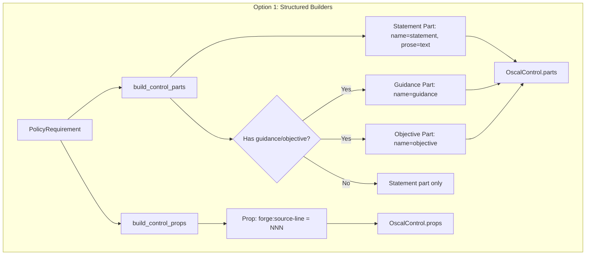
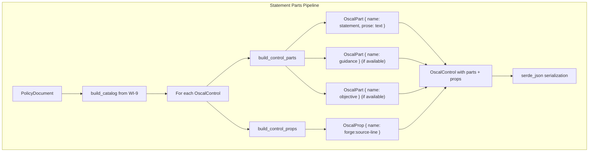
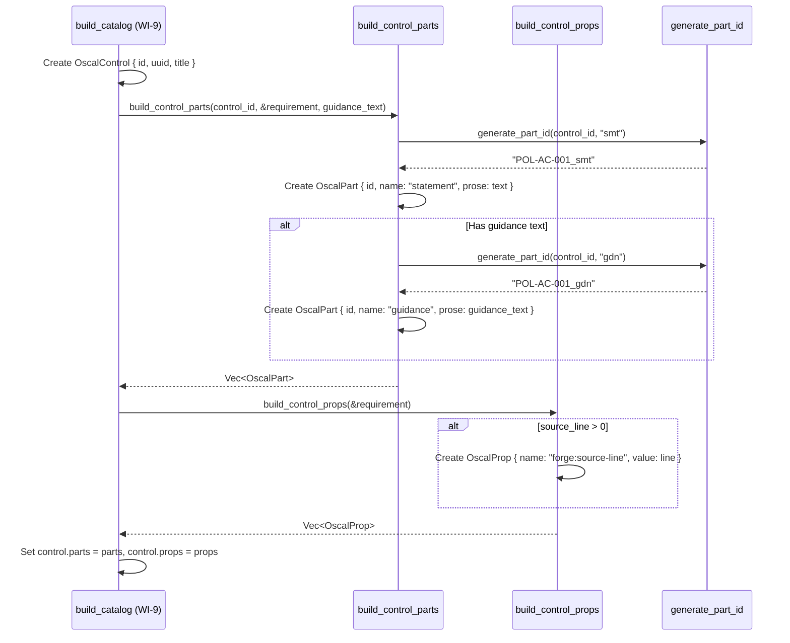

# 010-ar-catalog-statement-parts

> **Document Type:** Architecture Review
> **Audience:** LLM agents, human reviewers
> **Status:** Proposed
> **Last Updated:** 2026-02-10 <!-- @auto -->
> **Owner:** Brian Luby <!-- @human-required -->
> **Deciders:** Brian Luby <!-- @human-required -->

---

## Review Tier Legend

| Marker | Tier | Speckit Behavior |
|--------|------|------------------|
| 🔴 `@human-required` | Human Generated | Prompt human to author; blocks until complete |
| 🟡 `@human-review` | LLM + Human Review | LLM drafts → prompt human to confirm/edit; blocks until confirmed |
| 🟢 `@llm-autonomous` | LLM Autonomous | LLM completes; no prompt; logged for audit |
| ⚪ `@auto` | Auto-generated | System fills (timestamps, links); no prompt |

---

## Document Completion Order

> ⚠️ **For LLM Agents:** Complete sections in this order. Do not fill downstream sections until upstream human-required inputs exist.

1. **Summary (Decision)** → requires human input first
2. **Context (Problem Space)** → requires human input
3. **Decision Drivers** → requires human input (prioritized)
4. **Driving Requirements** → extract from PRD, human confirms
5. **Options Considered** → LLM drafts after drivers exist, human reviews
6. **Decision (Selected + Rationale)** → requires human decision
7. **Implementation Guardrails** → LLM drafts, human reviews
8. **Everything else** → can proceed after decision is made

---

## Linkage ⚪ `@auto`

| Document | ID | Relationship |
|----------|-----|--------------|
| Parent PRD | [010-prd-catalog-statement-parts](../PRD/010-prd-catalog-statement-parts.md) | Requirements this architecture satisfies |
| Security Review | 010-sec-catalog-statement-parts.md | Security implications of this decision |
| Supersedes | — | N/A |
| Superseded By | — | |

---

## Summary

### Decision 🔴 `@human-required`
> Extend the WI-9 Catalog builder with a `build_control_parts` function that generates OSCAL `parts[]` arrays for each control, using structured `OscalPart` and `OscalProp` builders. Statement parts use the `{control-id}_smt` ID convention, structured metadata uses `prop` elements, and `remarks` is never used for structured data.

### TL;DR for Agents 🟡 `@human-review`
> Each OscalControl gets a `parts: Vec<OscalPart>` populated by `build_control_parts(control_id, &requirement)`. The primary part is `name: "statement"`, `id: "{control-id}_smt"`, `prose: requirement.text`. Structured metadata (source line) goes into `props: Vec<OscalProp>` with namespaced names (e.g., `forge:source-line`). Do NOT store any structured data in `remarks`. Do NOT add `param` elements (WI-34). Do NOT add back matter links (WI-12). Guidance and objective parts are generated only when the domain model provides explicit signals; default all requirement text to statement parts.

---

## Context

### Problem Space 🔴 `@human-required`
After WI-9, the Catalog builder produces controls with IDs, titles, and UUIDs — but no content. In OSCAL, a control without `parts[]` is a hollow shell: it declares a control exists but says nothing about what it requires. The actual policy requirement text must be placed in a `parts[]` entry with `name: "statement"` and the requirement prose. Additionally, structured metadata (source line numbers, original identifiers) must be expressed as `props`, not dumped into `remarks` fields — NIST explicitly warns against misusing remarks for structured data (parent PRD M-11). This work item transforms shell controls into content-bearing OSCAL controls.

### Decision Scope 🟡 `@human-review`

**This AR decides:**
- How statement parts are generated from PolicyRequirement text
- The part ID naming convention (`{control-id}_smt`, `{control-id}_gdn`, `{control-id}_obj`)
- How structured metadata is expressed as `OscalProp` elements
- The `OscalPart` and `OscalProp` struct design
- How multi-part controls (guidance, objectives) are handled

**This AR does NOT decide:**
- Catalog group and control structure — completed in 009-ar-catalog-groups-controls
- OSCAL metadata assembly — deferred to WI-11
- Back matter resources and link patterns — deferred to WI-12
- Parameter (`param`) extraction — deferred to WI-34
- OSCAL JSON schema validation — deferred to WI-19

### Current State 🟢 `@llm-autonomous`
After WI-9, `OscalControl` structs have `id`, `uuid`, and `title` fields but no `parts[]` or `props[]`. The `PolicyRequirement` struct provides `text`, `source_line`, `nesting_depth`, and `citations` fields. The Catalog builder can serialize to valid JSON but controls are semantically empty.

### Driving Requirements 🟡 `@human-review`

| PRD Req ID | Requirement Summary | Architectural Implication |
|------------|---------------------|---------------------------|
| M-1 | Every control has `parts[]` with at least one `name: "statement"` part | Part generation mandatory for all controls |
| M-2 | Statement part `prose` populated from PolicyRequirement.text | Direct text mapping |
| M-3 | Part IDs follow `{control-id}_smt` convention | Deterministic ID derivation from control ID |
| M-4 | Structured metadata as `prop` elements, never in `remarks` | OscalProp struct; no remarks field on controls |
| M-5 | Integrate with WI-9 Catalog builder | Extend existing OscalControl struct with parts and props fields |
| M-6 | Valid OSCAL v1.2.0 JSON structure for parts | serde serialization with correct field naming |

**PRD Constraints inherited:**
- From parent PRD M-3: Valid OSCAL Catalog with complete controls
- From parent PRD M-11: No arbitrary data in remarks
- From constitution principle X: YAGNI — start with statement parts, add guidance/objective best-effort
- From constitution principle IV: TDD mandatory

---

## Decision Drivers 🔴 `@human-required`

1. **Content completeness:** Every control must contain its policy requirement text in a statement part *(traces to PRD M-1, M-2)*
2. **OSCAL compliance:** Parts must follow OSCAL v1.2.0 naming and ID conventions *(traces to PRD M-3, M-6)*
3. **Props over remarks:** Structured metadata must use props, never remarks *(traces to PRD M-4, parent PRD M-11)*
4. **Simplicity:** Extend existing builder with minimal new abstractions *(constitution principle X)*

---

## Options Considered 🟡 `@human-review`

### Option 0: Status Quo / Do Nothing

**Description:** Leave controls without parts[]. Controls have IDs and titles but no statement content.

| Driver | Rating | Notes |
|--------|--------|-------|
| Content completeness | ❌ Poor | Controls are semantically empty; no policy text in OSCAL output |
| OSCAL compliance | ⚠️ Medium | Structurally valid but functionally useless; no downstream consumer can use the Catalog |
| Props over remarks | N/A | No metadata attached to controls at all |
| Simplicity | ✅ Good | No code to write |

**Why not viable:** A Catalog without statement parts is a skeleton with no content. It cannot communicate policy requirements to profiles, component definitions, or assessment plans. Parent PRD M-3 requires complete controls.

---

### Option 1: Structured Builders Extending WI-9 (Recommended)

**Description:** Add `OscalPart` and `OscalProp` structs to the OSCAL module. Implement `build_control_parts(control_id, &PolicyRequirement, guidance_text: Option<&str>) -> Vec<OscalPart>` and `build_control_props(&PolicyRequirement) -> Vec<OscalProp>` as composable builder functions that the WI-9 `build_catalog` function calls when constructing each `OscalControl`. Statement parts are generated for all requirements. Guidance parts are generated when `guidance_text` is present and non-empty. Objective parts are deferred until the domain model provides an explicit signal.



| Driver | Rating | Notes |
|--------|--------|-------|
| Content completeness | ✅ Good | Every control gets a statement part with full prose |
| OSCAL compliance | ✅ Good | Part names, IDs, and structure follow OSCAL v1.2.0 conventions |
| Props over remarks | ✅ Good | OscalProp for metadata; no remarks field defined |
| Simplicity | ✅ Good | Two builder functions composed into existing build_catalog; no new abstractions |

**Pros:**
- Builder functions are independently testable — unit test `build_control_parts` without Catalog context
- Naturally extends the WI-9 Catalog builder — controls gain `parts` and `props` fields
- Statement parts are generated for all controls; guidance/objective are additive
- `OscalProp` provides a type-safe way to attach metadata without `remarks` misuse

**Cons:**
- Multi-part detection (guidance vs. statement) requires signals not yet in the domain model for most documents
- Part ID suffix convention (`_smt`, `_gdn`, `_obj`) is FORGE-specific, not OSCAL-mandated (though consistent with NIST SP 800-53 annotated examples)

---

### Option 2: Direct Inline Mapping (No Separate Builder)

**Description:** Generate parts directly inside the `build_catalog` function, inline with control creation. No separate `build_control_parts` function.

| Driver | Rating | Notes |
|--------|--------|-------|
| Content completeness | ✅ Good | Statement parts generated for all controls |
| OSCAL compliance | ✅ Good | Same structure as Option 1 |
| Props over remarks | ✅ Good | Same approach as Option 1 |
| Simplicity | ⚠️ Medium | Simpler call graph but harder to test independently; build_catalog grows larger |

**Pros:**
- Fewer functions — all logic in one place
- No need to decide on builder function boundaries

**Cons:**
- `build_catalog` becomes monolithic and harder to test
- Cannot unit test parts generation independently of Catalog building
- Violates separation of concerns as the function grows with WI-10, WI-11, WI-12

---

### Option 3: Template-Based Generation

**Description:** Define part templates (e.g., in TOML or as Rust constants) that specify the structure of parts for different control types. The builder applies templates to controls based on content classification.

| Driver | Rating | Notes |
|--------|--------|-------|
| Content completeness | ✅ Good | Templates ensure consistent part structure |
| OSCAL compliance | ✅ Good | Templates can enforce OSCAL conventions |
| Props over remarks | ✅ Good | Templates define prop placement |
| Simplicity | ❌ Poor | Template format, loading, application logic — massive over-engineering for MVP |

**Pros:**
- Extensible: new part structures added via templates without code changes
- Consistent: templates enforce uniform part structure across controls

**Cons:**
- Violates YAGNI: all controls currently get the same statement part structure
- Template format, parsing, validation, and application engine are unnecessary complexity
- No user has requested template customization
- Adds a new configuration surface with its own error modes

---

## Decision

### Selected Option 🔴 `@human-required`
> **Option 1: Structured Builders Extending WI-9**

### Rationale 🔴 `@human-required`

Option 1 provides the right balance of testability and simplicity. Separate builder functions (`build_control_parts`, `build_control_props`) are independently testable and compose naturally into the WI-9 `build_catalog` function. This is simpler than templates (Option 3), which add unnecessary abstraction for a problem that does not require customization. It is more testable than inline mapping (Option 2), which would make `build_catalog` monolithic. The structured builder approach follows constitution principle X (YAGNI) while maintaining clean separation of concerns.

#### Simplest Implementation Comparison 🟡 `@human-review`

| Aspect | Simplest Possible | Selected Option | Justification for Complexity |
|--------|-------------------|-----------------|------------------------------|
| Components | Inline string concatenation in build_catalog | OscalPart + OscalProp structs + builder functions | PRD M-6 requires valid OSCAL JSON; typed structs ensure correctness |
| Dependencies | None new | None new (serde already present) | Extends existing serde-based structs from WI-9 |
| Patterns | Single statement part per control | Statement + optional guidance/objective + props | PRD M-4 requires props for metadata; S-1/S-2 require multi-part support |

**Complexity justified by:** PRD M-4 requires props for structured metadata (separate from parts). PRD S-1/S-2 require optional guidance/objective parts. The builder function pattern is the minimum structure needed to support current requirements and the multi-part extension path.

### Architecture Diagram 🟡 `@human-review`



---

## Technical Specification

### Component Overview 🟡 `@human-review`

| Component | Responsibility | Interface | Dependencies |
|-----------|---------------|-----------|--------------|
| OscalPart | OSCAL part struct (statement, guidance, objective) | `#[derive(Serialize)]` struct | serde |
| OscalProp | OSCAL property struct for structured metadata | `#[derive(Serialize)]` struct | serde |
| build_control_parts | Generate parts array for a control | `pub fn(&str, &PolicyRequirement, Option<&str>) -> Vec<OscalPart>` | domain model |
| build_control_props | Generate props array for a control | `pub fn(&PolicyRequirement) -> Vec<OscalProp>` | domain model |
| generate_part_id | Create part ID from control ID and suffix | `fn(&str, &str) -> String` | None |

### Data Flow 🟢 `@llm-autonomous`



### Interface Definitions 🟡 `@human-review`

```rust
use serde::Serialize;

/// An OSCAL control part (statement, guidance, objective).
#[derive(Debug, Clone, Serialize)]
pub struct OscalPart {
    /// Part ID following {control-id}_{suffix} convention
    pub id: String,
    /// Part name: "statement", "guidance", "objective", or "item"
    pub name: String,
    /// Human-readable text content of the part
    pub prose: String,
    /// Nested sub-parts (e.g., enumerated sub-items within a statement)
    #[serde(skip_serializing_if = "Vec::is_empty")]
    pub parts: Vec<OscalPart>,
    /// Properties on this part
    #[serde(skip_serializing_if = "Vec::is_empty")]
    pub props: Vec<OscalProp>,
}

/// An OSCAL property for structured metadata on controls or parts.
#[derive(Debug, Clone, Serialize)]
pub struct OscalProp {
    /// Property name (e.g., "forge:source-line")
    pub name: String,
    /// Property value (e.g., "42")
    pub value: String,
}

/// Generate statement parts for a control from a PolicyRequirement.
/// Always produces at least one part with name: "statement".
/// Produces a guidance part when guidance_text is Some(non_empty).
/// Objective parts deferred until domain model provides a signal.
pub fn build_control_parts(
    control_id: &str,
    requirement: &PolicyRequirement,
    guidance_text: Option<&str>,
) -> Vec<OscalPart>;

/// Generate props for a control from a PolicyRequirement.
/// Structured metadata (source line, etc.) expressed as props.
/// Never stores structured data in remarks.
pub fn build_control_props(
    requirement: &PolicyRequirement,
) -> Vec<OscalProp>;

/// Generate a part ID from a control ID and a suffix.
/// Convention: {control-id}_{suffix}
/// Example: generate_part_id("POL-AC-001", "smt") -> "POL-AC-001_smt"
fn generate_part_id(control_id: &str, suffix: &str) -> String {
    format!("{}_{}", control_id, suffix)
}

// Extension to OscalControl from WI-9:
// pub struct OscalControl {
//     pub id: String,
//     pub uuid: String,
//     pub title: String,
//     pub parts: Vec<OscalPart>,   // added by WI-10
//     pub props: Vec<OscalProp>,   // added by WI-10
// }
```

### Key Algorithms/Patterns 🟡 `@human-review`

**Pattern:** Statement Part Generation with Metadata Props
```
1. For each PolicyRequirement:
   a. Generate statement part:
      - id = "{control-id}_smt"
      - name = "statement"
      - prose = requirement.text
   b. If guidance text available (domain model signal):
      - Generate guidance part: id = "{control-id}_gdn", name = "guidance"
   c. If objective text available (domain model signal):
      - Generate objective part: id = "{control-id}_obj", name = "objective"
2. For metadata props:
   a. If requirement.source_line > 0:
      - Create OscalProp { name: "forge:source-line", value: source_line.to_string() }
3. Assign parts and props to OscalControl
4. NEVER create a remarks field with structured data
```

**Part ID Suffix Convention:**

| Part Type | Suffix | Example |
|-----------|--------|---------|
| Statement | `_smt` | `POL-AC-001_smt` |
| Guidance | `_gdn` | `POL-AC-001_gdn` |
| Objective | `_obj` | `POL-AC-001_obj` |
| Item (sub-part) | `_smt.a`, `_smt.b` | `POL-AC-001_smt.a` |

---

## Constraints & Boundaries

### Technical Constraints 🟡 `@human-review`

**Inherited from PRD:**
- OSCAL v1.2.0 parts structure (parent PRD M-3)
- No arbitrary data in remarks (parent PRD M-11)
- TDD mandatory (constitution principle IV)
- serde + serde_json for serialization (constitution technology stack)

**Added by this Architecture:**
- **Part ID convention:** `{control-id}_{suffix}` using standard suffixes (_smt, _gdn, _obj)
- **Props namespace:** FORGE-specific props use `forge:` prefix to avoid collision with standard OSCAL prop names
- **Statement part mandatory:** Every control must have at least one statement part
- **No remarks field:** `OscalControl` does not define a `remarks` field; structured data goes to `props`
- **Composable builders:** `build_control_parts` and `build_control_props` are independently testable functions

### Architectural Boundaries 🟡 `@human-review`

- **Owns:** `OscalPart`, `OscalProp` structs; `build_control_parts`, `build_control_props`, `generate_part_id` functions
- **Interfaces With:** `OscalControl` from WI-9 (extends with `parts` and `props` fields); `PolicyRequirement` from WI-5
- **Must Not Touch:** Catalog group/control structure (WI-9), metadata (WI-11), back matter (WI-12), parameter extraction (WI-34)

### Implementation Guardrails 🟡 `@human-review`

> ⚠️ **Critical for LLM Agents:**

- [x] **DO NOT** store structured data (source lines, IDs, classifications) in `remarks` — use `props` *(parent PRD M-11)*
- [x] **DO NOT** add `param` elements to parts — deferred to WI-34 *(PRD W-1)*
- [x] **DO NOT** add back matter links within part prose — deferred to WI-12 *(PRD W-2)*
- [x] **DO NOT** embed JSON or structured formats within `prose` — prose is human-readable text *(implementation guidance)*
- [x] **DO NOT** generate parts without IDs — every part must have a deterministic ID *(PRD M-3)*
- [x] **MUST** generate at least one statement part per control *(PRD M-1)*
- [x] **MUST** use `{control-id}_smt` convention for statement part IDs *(PRD M-3)*
- [x] **MUST** use `forge:` prefix for FORGE-specific prop names *(risk R-3 mitigation)*
- [x] **MUST** default all requirement text to statement parts; guidance/objective only when explicitly signaled *(PRD assumption A-3)*

---

## Consequences 🟡 `@human-review`

### Positive
- Controls become content-bearing: policy requirement text is present in OSCAL output
- Type-safe `OscalPart` and `OscalProp` structs prevent structural errors
- Props provide machine-queryable metadata without violating NIST remarks guidance
- Builder functions are independently testable and composable with the WI-9 Catalog builder

### Negative
- Multi-part detection (guidance vs. statement) is limited by current domain model signals
- Part ID suffix convention is FORGE-specific; may not match all OSCAL tooling expectations
- Adding `forge:` namespace prefix is non-standard (though avoids collision with OSCAL-defined props)

### Risks & Mitigations

| Risk | Likelihood | Impact | Mitigation |
|------|------------|--------|------------|
| Source policy text does not clearly distinguish statement from guidance | Med | Med | Default all text to statement parts; refine classification in later WIs |
| Prop naming conflicts with future OSCAL prop names | Low | Low | Use `forge:` prefix for all FORGE-specific props |
| Part generation changes when domain model evolves | Low | Med | Builder functions accept PolicyRequirement interface; Rust compiler catches breaking changes |

---

## Implementation Guidance

### Suggested Implementation Order 🟢 `@llm-autonomous`
1. Define `OscalPart` and `OscalProp` structs with serde derives
2. Add `parts: Vec<OscalPart>` and `props: Vec<OscalProp>` fields to `OscalControl`
3. Implement `generate_part_id` helper
4. Implement `build_control_parts` — statement part for all, guidance/objective best-effort
5. Implement `build_control_props` — source line and other metadata as props
6. Integrate builder functions into `build_catalog` from WI-9
7. Write unit tests: statement parts, part IDs, props, no-remarks enforcement, edge cases
8. Verify JSON output matches OSCAL v1.2.0 parts structure

### Testing Strategy 🟢 `@llm-autonomous`

| Layer | Test Type | Coverage Target | Notes |
|-------|-----------|-----------------|-------|
| Unit | build_control_parts (statement) | AC-1, AC-2 | Every control gets statement part with correct prose |
| Unit | Part ID convention | AC-2 | {control-id}_smt pattern verified |
| Unit | build_control_props | AC-3 | forge:source-line prop generated |
| Unit | No remarks misuse | AC-4 | No OscalControl has remarks with structured data |
| Unit | Integration with WI-9 builder | AC-5 | Controls retain IDs/titles, gain parts/props |
| Unit | JSON output structure | AC-6 | Parts array matches OSCAL v1.2.0 shape |
| Unit | Multi-part (guidance) | AC-7 | Guidance part generated when signal present |
| Unit | Edge cases | EC-1 through EC-6 | Empty text, Markdown formatting, special chars |

### Anti-patterns to Avoid 🟡 `@human-review`
- **Don't:** Store source line numbers or structured data in `remarks`
  - **Why:** Violates parent PRD M-11 and NIST guidance; not machine-queryable
  - **Instead:** Use `OscalProp` with `forge:` prefix
- **Don't:** Generate parts without IDs
  - **Why:** Parts without IDs cannot be referenced by profiles or assessments
  - **Instead:** Every part gets `{control-id}_{suffix}` ID
- **Don't:** Hardcode multi-part structure before domain model provides signals
  - **Why:** Over-engineering; domain model may not distinguish statement from guidance text yet
  - **Instead:** Default to statement parts; add guidance/objective incrementally

---

## Compliance & Cross-cutting Concerns

### Security Considerations 🟡 `@human-review`
- Authentication: N/A — local CLI tool
- Authorization: N/A
- Data handling: Policy requirement text appears in part prose and will be present in generated OSCAL JSON
- No external input: Builder operates on the already-validated domain model

### Observability 🟢 `@llm-autonomous`
- **Logging:** Log at DEBUG level: number of parts generated per control, part types generated
- **Metrics:** Total parts count, controls with multi-part structure vs. single statement
- **Tracing:** N/A for this module

### Error Handling Strategy 🟢 `@llm-autonomous`
```
Error Category → Handling Approach
├── Empty requirement text → Generate statement part with empty prose, log warning
├── source_line = 0 → Skip forge:source-line prop (no prop for unknown source)
├── No guidance/objective signal → Generate statement part only (no error)
├── Control ID missing → ForgeError (should not happen if WI-9 ran correctly)
└── Markdown formatting in prose → Preserve as-is in prose field
```

---

## Migration Plan (if applicable) 🟡 `@human-review`

N/A — greenfield implementation. This extends WI-9's OscalControl struct with new fields.

### Rollback Plan 🔴 `@human-required`

N/A — greenfield feature. If parts generation proves incorrect, the builder functions are revised in a subsequent sprint. Removing `build_control_parts` returns controls to the WI-9 state (shells without parts). No persisted state to migrate.

---

## Open Questions 🟡 `@human-review`

No open questions for this work item.

---

## Changelog ⚪ `@auto`

| Version | Date | Author | Changes |
|---------|------|--------|---------|
| 0.1 | 2026-02-10 | LLM (Claude) | Initial proposal |

---

## Decision Record ⚪ `@auto`

| Date | Event | Details |
|------|-------|---------|
| 2026-02-10 | Proposed | Initial draft created from PRD 010 |

---

## Traceability Matrix 🟢 `@llm-autonomous`

| PRD Req ID | Decision Driver | Option Rating | Component | Notes |
|------------|-----------------|---------------|-----------|-------|
| M-1 | Content completeness | Option 1: ✅ | build_control_parts | Every control gets at least one statement part |
| M-2 | Content completeness | Option 1: ✅ | build_control_parts | Prose from PolicyRequirement.text |
| M-3 | OSCAL compliance | Option 1: ✅ | generate_part_id | {control-id}_smt convention |
| M-4 | Props over remarks | Option 1: ✅ | build_control_props | OscalProp with forge: prefix |
| M-5 | Simplicity | Option 1: ✅ | build_control_parts + build_control_props | Composed into WI-9 build_catalog |
| M-6 | OSCAL compliance | Option 1: ✅ | OscalPart + serde | Valid OSCAL v1.2.0 parts JSON |
| S-1 | OSCAL compliance | Option 1: ✅ | build_control_parts | Guidance part with _gdn suffix |
| S-2 | OSCAL compliance | Option 1: ✅ | build_control_parts | Objective part with _obj suffix |
| S-3 | Content completeness | Option 1: ✅ | build_control_parts | Paragraph breaks preserved in prose |

---

## Review Checklist 🟢 `@llm-autonomous`

Before marking as Accepted:
- [x] All PRD Must Have requirements appear in Driving Requirements
- [x] Option 0 (Status Quo) is documented
- [x] Simplest Implementation comparison is completed
- [x] Decision drivers are prioritized and addressed
- [x] At least 2 options were seriously considered
- [x] Constraints distinguish inherited vs. new
- [x] Component names are consistent across all diagrams and tables
- [x] Implementation guardrails reference specific PRD constraints
- [x] Rollback triggers and authority are defined (N/A — greenfield)
- [x] Security review is linked or N/A documented
- [x] No open questions blocking implementation
