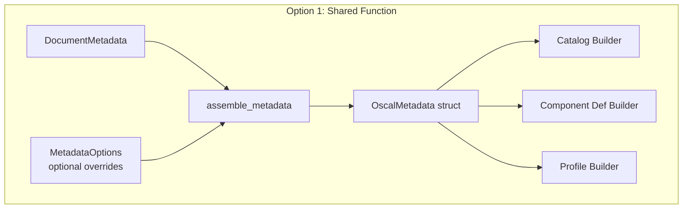
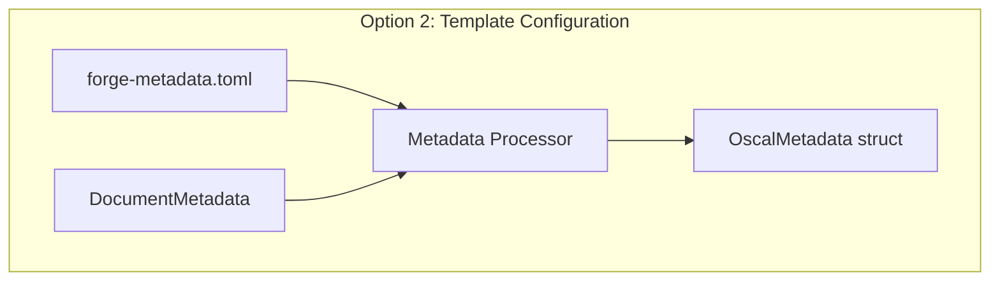
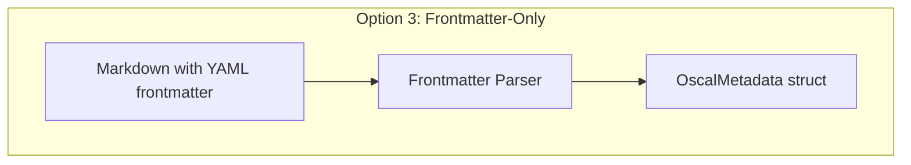
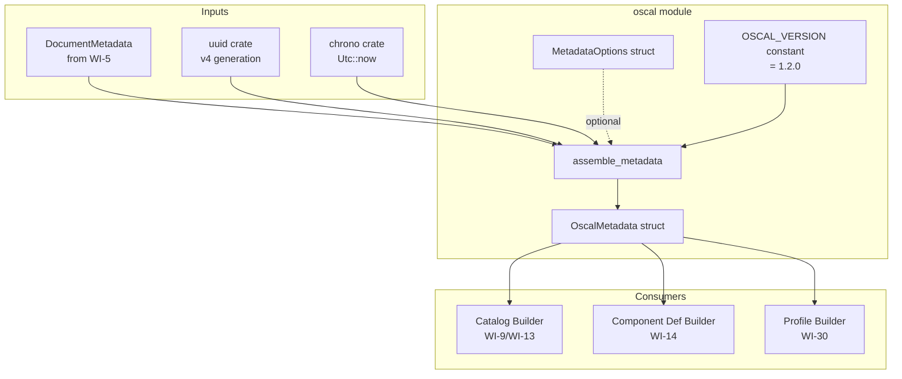
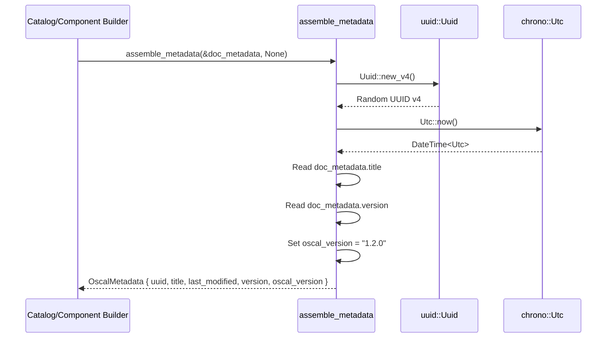

# 011-ar-oscal-metadata

> **Document Type:** Architecture Review
> **Audience:** LLM agents, human reviewers
> **Status:** Proposed
> **Last Updated:** 2026-02-10 <!-- @auto -->
> **Owner:** Brian Luby <!-- @human-required -->
> **Deciders:** Brian Luby <!-- @human-required -->

---

## Review Tier Legend

| Marker | Tier | Speckit Behavior |
|--------|------|------------------|
| 🔴 `@human-required` | Human Generated | Prompt human to author; blocks until complete |
| 🟡 `@human-review` | LLM + Human Review | LLM drafts → prompt human to confirm/edit; blocks until confirmed |
| 🟢 `@llm-autonomous` | LLM Autonomous | LLM completes; no prompt; logged for audit |
| ⚪ `@auto` | Auto-generated | System fills (timestamps, links); no prompt |

---

## Document Completion Order

> ⚠️ **For LLM Agents:** Complete sections in this order. Do not fill downstream sections until upstream human-required inputs exist.

1. **Summary (Decision)** → requires human input first
2. **Context (Problem Space)** → requires human input
3. **Decision Drivers** → requires human input (prioritized)
4. **Driving Requirements** → extract from PRD, human confirms
5. **Options Considered** → LLM drafts after drivers exist, human reviews
6. **Decision (Selected + Rationale)** → requires human decision
7. **Implementation Guardrails** → LLM drafts, human reviews
8. **Everything else** → can proceed after decision is made

---

## Linkage ⚪ `@auto`

| Document | ID | Relationship |
|----------|-----|--------------|
| Parent PRD | [011-prd-oscal-metadata](../PRD/011-prd-oscal-metadata.md) | Requirements this architecture satisfies |
| Parent PRD (top-level) | [FORGE_PRD](../FORGE_PRD.md) | Parent requirement M-5 (metadata fields) |
| Security Review | N/A | No separate security review required — no external input processing |
| Supersedes | — | N/A (greenfield) |
| Superseded By | — | |

---

## Summary

### Decision 🔴 `@human-required`
> Use a shared `assemble_metadata` function in the `oscal` module that accepts `DocumentMetadata` and optional `MetadataOptions` overrides, returning an `OscalMetadata` struct serializable to OSCAL-compliant JSON. UUID v4 for artifact instance identity, `chrono` for ISO 8601 timestamps, and a module-level constant for `oscal-version`.

### TL;DR for Agents 🟡 `@human-review`
> OSCAL metadata is generated by a single shared function (`assemble_metadata`) that all artifact generators (Catalog, Component Definition, Profile) call. It produces a struct with five required fields: `uuid` (v4 random per generation), `title` (from `PolicyDocument`), `last-modified` (UTC ISO 8601), `version` (from `PolicyDocument`), and `oscal-version` (hardcoded `"1.2.0"`). Testing uses injectable overrides for UUID and timestamp via `MetadataOptions`. Do NOT use UUID v5 for artifact instance UUIDs — v5 is for content-based stable IDs (WI-7). Do NOT duplicate metadata logic across artifact generators.

---

## Context

### Problem Space 🔴 `@human-required`
Every OSCAL artifact requires a `metadata` object with five mandatory fields: `uuid`, `title`, `last-modified`, `version`, and `oscal-version`. Without correctly assembled metadata, no generated artifact passes schema validation, making the entire OSCAL generation pipeline useless. The metadata must be assembled consistently across all artifact types (Catalog, Component Definition, Profile) to avoid divergent behavior and maintenance burden. The design challenge is balancing simplicity (hardcoded builder) against configurability (template-based or frontmatter-driven) while keeping the implementation testable with deterministic overrides.

### Decision Scope 🟡 `@human-review`

**This AR decides:**
- How OSCAL metadata is assembled (function signature, data flow, struct design)
- Where the metadata assembly logic lives (module placement)
- How deterministic testing is supported (injectable overrides vs mocking)
- Which crates provide UUID and timestamp functionality

**This AR does NOT decide:**
- Optional metadata fields (roles, parties, responsible-parties, locations) — deferred to future WIs
- Metadata `props` or `links` — deferred to WI-12 (back matter) and WI-17 (traceability)
- Schema validation of metadata — deferred to WI-19

### Current State 🟢 `@llm-autonomous`
N/A — greenfield implementation. The `oscal` module exists as a stub from WI-1 scaffolding. WI-9 and WI-10 build Catalog groups/controls but no metadata assembly exists yet.

### Driving Requirements 🟡 `@human-review`

| PRD Req ID | Requirement Summary | Architectural Implication |
|------------|---------------------|---------------------------|
| M-1 | Generate `uuid` field as valid UUID v4 per artifact | Must integrate `uuid` crate; each generation produces a unique instance ID |
| M-2 | Populate `title` from `PolicyDocument.metadata.title` | Must accept `DocumentMetadata` as input |
| M-3 | Populate `version` from `PolicyDocument.metadata.version` | Same input dependency on `DocumentMetadata` |
| M-4 | Generate `last-modified` as ISO 8601 UTC timestamp | Must integrate a datetime crate (`chrono` or `time`) |
| M-5 | Set `oscal-version` to `"1.2.0"` | Hardcoded constant, trivially updatable |
| M-6 | Shared function reusable by all artifact generators | Must be a standalone function, not embedded in any single builder |
| S-1 | Injectable timestamp override for testing | Function signature must accept optional overrides |
| S-2 | Injectable UUID override for testing | Same optional overrides pattern |

**PRD Constraints inherited:**
- From constitution: Rust latest stable, TDD mandatory, `thiserror` for errors
- From constitution principle X: YAGNI — only the five required fields

---

## Decision Drivers 🔴 `@human-required`

1. **Reusability:** Single metadata function shared across all OSCAL artifact generators *(traces to PRD M-6)*
2. **Testability:** Deterministic tests without mocking or time-freezing hacks *(traces to PRD S-1, S-2)*
3. **Simplicity:** Minimal code, no over-abstraction *(constitution principle X)*
4. **OSCAL Compliance:** Generated metadata must satisfy OSCAL v1.2.0 required fields *(traces to PRD M-1 through M-5)*

---

## Options Considered 🟡 `@human-review`

### Option 0: Status Quo / Do Nothing

**Description:** No metadata assembly exists. Each artifact generator (Catalog, Component Definition) would need to construct metadata inline.

| Driver | Rating | Notes |
|--------|--------|-------|
| Reusability | ❌ Poor | Each artifact duplicates metadata logic |
| Testability | ❌ Poor | No shared test infrastructure for metadata |
| Simplicity | ⚠️ Medium | Each generator is self-contained but duplicated |
| OSCAL Compliance | ❌ Poor | No guarantee of consistent metadata across artifacts |

**Why not viable:** Duplicating metadata assembly across Catalog, Component Definition, and Profile generators violates DRY, creates maintenance burden, and risks inconsistent output.

---

### Option 1: Shared Function with Struct Return and Injectable Overrides

**Description:** A standalone `assemble_metadata` function in the `oscal` module that takes `&DocumentMetadata` and optional `MetadataOptions` (UUID and timestamp overrides). Returns an `OscalMetadata` struct with serde derives for JSON serialization. UUID v4 via `uuid` crate, timestamps via `chrono` crate.



| Driver | Rating | Notes |
|--------|--------|-------|
| Reusability | ✅ Good | Single function, called by all generators |
| Testability | ✅ Good | Injectable overrides enable deterministic tests |
| Simplicity | ✅ Good | One function, one struct, one options struct |
| OSCAL Compliance | ✅ Good | All required fields populated, serde renames handle OSCAL naming |

**Pros:**
- Single point of change for metadata logic
- `MetadataOptions` provides clean test seam without mocking frameworks
- `OscalMetadata` struct is strongly typed and serde-serializable
- Consistent with constitution principle X (simplest that works)

**Cons:**
- `MetadataOptions` adds a parameter for production code that only tests use (minor API noise)

---

### Option 2: Configurable Metadata Template

**Description:** A metadata template system where users provide a TOML/YAML configuration file with metadata defaults. The function reads the config, merges with `DocumentMetadata`, and produces metadata.



| Driver | Rating | Notes |
|--------|--------|-------|
| Reusability | ✅ Good | Shared processor, configurable |
| Testability | ⚠️ Medium | Need to manage test config files |
| Simplicity | ❌ Poor | Config file parsing, merging logic, file discovery — all for 5 fields |
| OSCAL Compliance | ✅ Good | Can produce compliant metadata |

**Pros:**
- Users can customize metadata without code changes
- Supports organizational metadata (roles, parties) in the future

**Cons:**
- Massive over-engineering for 5 required fields
- Introduces config file dependency and discovery logic
- Violates YAGNI — no user has requested config-driven metadata
- Adds `toml`/`serde_yaml` dependency for configuration parsing

---

### Option 3: Metadata from Document Frontmatter Only

**Description:** Derive all metadata exclusively from YAML frontmatter in the Markdown source. No separate assembly function — metadata is a direct mapping from parsed frontmatter fields.



| Driver | Rating | Notes |
|--------|--------|-------|
| Reusability | ⚠️ Medium | Tightly coupled to frontmatter parsing; reuse requires frontmatter input |
| Testability | ⚠️ Medium | Tests require Markdown fixtures with specific frontmatter |
| Simplicity | ⚠️ Medium | Simple concept but tightly coupled to input format |
| OSCAL Compliance | ⚠️ Medium | Auto-generated fields (uuid, last-modified, oscal-version) still need code |

**Pros:**
- Metadata is close to the source document

**Cons:**
- Cannot generate `uuid` (v4), `last-modified` (timestamp), or `oscal-version` from frontmatter — these are generation-time values
- Tightly couples metadata to input parsing, breaking the pipeline stage separation
- Doesn't work for Component Definition or Profile (different metadata sources)
- Frontmatter may not exist in source documents

---

## Decision

### Selected Option 🔴 `@human-required`
> **Option 1: Shared Function with Struct Return and Injectable Overrides**

### Rationale 🔴 `@human-required`

Option 1 is the simplest approach that meets all requirements. Three of the five metadata fields (`uuid`, `last-modified`, `oscal-version`) are generation-time values that cannot come from source documents, making Options 2 and 3 insufficient without the same core logic. The `MetadataOptions` pattern provides clean test seams without framework-level mocking. A single `assemble_metadata` function ensures consistent metadata across all artifact types — exactly what PRD M-6 requires.

#### Simplest Implementation Comparison 🟡 `@human-review`

| Aspect | Simplest Possible | Selected Option | Justification for Complexity |
|--------|-------------------|-----------------|------------------------------|
| Components | Inline metadata in each builder | Shared function + struct | PRD M-6 requires shared reuse |
| Dependencies | No deps (hardcode UUID) | `uuid` + `chrono` crates | PRD M-1 requires valid UUID v4; PRD M-4 requires valid ISO 8601 |
| Patterns | Direct field assignment | Function with optional overrides | PRD S-1/S-2 require test-injectable overrides |

**Complexity justified by:** The selected option IS the simplest approach that meets PRD requirements M-1 through M-6 and S-1/S-2. The `MetadataOptions` pattern is the only addition beyond the minimal implementation, and it eliminates the need for mocking frameworks in tests.

### Architecture Diagram 🟡 `@human-review`



---

## Technical Specification

### Component Overview 🟡 `@human-review`

| Component | Responsibility | Interface | Dependencies |
|-----------|---------------|-----------|--------------|
| `assemble_metadata` | Produce `OscalMetadata` from `DocumentMetadata` + options | `fn(&DocumentMetadata, Option<MetadataOptions>) -> Result<OscalMetadata, ForgeError>` | `uuid`, `chrono` |
| `OscalMetadata` | Serializable metadata struct with 5 required fields | `#[derive(Serialize)]` struct | `serde` |
| `MetadataOptions` | Optional overrides for UUID and timestamp (testing) | Plain struct with `Option` fields | None |
| `OSCAL_VERSION` | Constant for OSCAL version string | `const &str` | None |

### Data Flow 🟢 `@llm-autonomous`



### Interface Definitions 🟡 `@human-review`

```rust
use chrono::{DateTime, Utc};
use serde::Serialize;
use uuid::Uuid;

/// OSCAL specification version constant
const OSCAL_VERSION: &str = "1.2.0";

/// OSCAL metadata for any artifact type (Catalog, Component Definition, Profile).
/// Serializes to OSCAL-compliant JSON with hyphenated field names.
#[derive(Debug, Clone, Serialize)]
pub struct OscalMetadata {
    /// UUID v4 — unique per artifact generation instance
    pub uuid: Uuid,
    /// Document title from PolicyDocument.metadata.title
    pub title: String,
    /// ISO 8601 UTC timestamp of artifact generation
    #[serde(rename = "last-modified")]
    pub last_modified: DateTime<Utc>,
    /// Document version from PolicyDocument.metadata.version
    pub version: String,
    /// OSCAL specification version — always "1.2.0"
    #[serde(rename = "oscal-version")]
    pub oscal_version: String,
}

/// Options for overriding auto-generated metadata values (primarily for testing)
#[derive(Debug, Default)]
pub struct MetadataOptions {
    /// Override the auto-generated UUID v4 (for deterministic tests)
    pub uuid_override: Option<Uuid>,
    /// Override the auto-generated timestamp (for deterministic tests)
    pub timestamp_override: Option<DateTime<Utc>>,
}

/// Assemble OSCAL metadata from a PolicyDocument's DocumentMetadata.
///
/// Produces a complete OscalMetadata struct with all five required fields.
/// Uses UUID v4 for artifact identity and current UTC timestamp unless overridden.
pub fn assemble_metadata(
    doc_metadata: &DocumentMetadata,
    options: Option<MetadataOptions>,
) -> Result<OscalMetadata, ForgeError> {
    let opts = options.unwrap_or_default();
    Ok(OscalMetadata {
        uuid: opts.uuid_override.unwrap_or_else(Uuid::new_v4),
        title: doc_metadata.title.clone(),
        last_modified: opts.timestamp_override.unwrap_or_else(Utc::now),
        version: doc_metadata.version.clone(),
        oscal_version: OSCAL_VERSION.to_string(),
    })
}
```

### Key Algorithms/Patterns 🟡 `@human-review`

**Pattern:** Injectable overrides for deterministic testing
```
1. Caller passes MetadataOptions with fixed UUID and timestamp
2. assemble_metadata uses overrides when present, defaults when absent
3. Production code passes None; test code passes Some(MetadataOptions { ... })
4. No mocking framework needed — pure function composition
```

---

## Constraints & Boundaries

### Technical Constraints 🟡 `@human-review`

**Inherited from PRD:**
- Rust latest stable toolchain
- TDD mandatory (constitution principle IV)
- `thiserror` for error types (constitution principle VIII)
- `serde` for serialization (constitution technology stack)

**Added by this Architecture:**
- `uuid` crate for UUID v4 generation — required by PRD M-1
- `chrono` crate for ISO 8601 timestamp formatting — required by PRD M-4
- `OSCAL_VERSION` as a module-level constant — single point of change for version bumps
- `OscalMetadata` struct must use `#[serde(rename)]` for OSCAL-compliant field names

### Architectural Boundaries 🟡 `@human-review`

- **Owns:** `assemble_metadata` function, `OscalMetadata` struct, `MetadataOptions` struct, `OSCAL_VERSION` constant
- **Interfaces With:** `DocumentMetadata` struct from WI-5 (domain model), Catalog Builder (WI-9/WI-13), Component Def Builder (WI-14)
- **Must Not Touch:** Domain model structs (WI-5), CLI argument parsing (WI-1), Catalog group/control assembly (WI-9/WI-10)

### Implementation Guardrails 🟡 `@human-review`

> ⚠️ **Critical for LLM Agents:**

- [x] **DO NOT** use UUID v5 for artifact instance UUIDs — v5 is for content-based stable IDs (WI-7); artifact UUIDs must be v4 (random per instance) *(from PRD M-1)*
- [x] **DO NOT** duplicate metadata assembly logic in each artifact generator *(from PRD M-6)*
- [x] **DO NOT** store arbitrary data in metadata `remarks` fields *(from Parent PRD M-11)*
- [x] **DO NOT** use local timezone for `last-modified` — must be UTC *(OSCAL spec requirement)*
- [x] **MUST** use injectable overrides for UUID and timestamp to enable deterministic tests *(from PRD S-1, S-2)*
- [x] **MUST** hardcode `oscal-version` as `"1.2.0"` via a constant *(from PRD M-5)*
- [x] **MUST** derive `Serialize` on `OscalMetadata` with `#[serde(rename)]` for hyphenated OSCAL field names *(OSCAL JSON compliance)*

---

## Consequences 🟡 `@human-review`

### Positive
- Single point of metadata logic — all artifact types produce consistent metadata
- Deterministic tests without mocking frameworks — `MetadataOptions` provides clean test seams
- Trivial OSCAL version bumps — change one constant when targeting future OSCAL versions
- Strongly typed struct prevents missing fields at compile time

### Negative
- `MetadataOptions` parameter is only used in tests — minor API noise in production paths
- Adding optional metadata fields later requires extending the struct (low cost)

### Risks & Mitigations

| Risk | Likelihood | Impact | Mitigation |
|------|------------|--------|------------|
| `chrono` timestamp format differs from OSCAL tools' expectations | Low | Med | Use RFC 3339 formatting; validate against NIST example artifacts |
| OSCAL v1.3.0 changes required metadata fields | Low | Low | Constant `OSCAL_VERSION` and typed struct make updates straightforward |

---

## Implementation Guidance

### Suggested Implementation Order 🟢 `@llm-autonomous`
1. Define `OSCAL_VERSION` constant in `oscal` module
2. Define `OscalMetadata` struct with serde derives and rename attributes
3. Define `MetadataOptions` struct with `Default` derive
4. Implement `assemble_metadata` function
5. Write unit tests with injected overrides (fixed UUID, fixed timestamp)
6. Write unit tests for default behavior (UUID v4 format check, timestamp format check)
7. Write test verifying unique UUIDs across successive calls

### Testing Strategy 🟢 `@llm-autonomous`

| Layer | Test Type | Coverage Target | Notes |
|-------|-----------|-----------------|-------|
| Unit | `assemble_metadata` with overrides | 100% | Verify all 5 fields populated correctly |
| Unit | UUID v4 format validation | 100% | Parse generated UUID; check version nibble |
| Unit | ISO 8601 timestamp format | 100% | Parse generated timestamp with `chrono` |
| Unit | Default version handling | 100% | Input "0.0.0" → output "0.0.0" |
| Unit | Unique UUIDs per generation | 100% | Two calls produce different UUIDs |
| Integration | Catalog builder uses metadata | Key paths | Verify metadata appears in Catalog JSON |

### Anti-patterns to Avoid 🟡 `@human-review`
- **Don't:** Generate UUID v5 for artifact instance IDs
  - **Why:** UUID v5 is content-based and deterministic — two conversions of the same document would get the same artifact UUID, conflating distinct generation instances
  - **Instead:** Use UUID v4 (random) for artifact instance identity; UUID v5 is used in WI-7 for requirement stable IDs
- **Don't:** Use `std::time::SystemTime` directly for timestamps
  - **Why:** Manual formatting is error-prone and may not produce valid ISO 8601
  - **Instead:** Use `chrono::Utc::now()` with built-in RFC 3339 formatting
- **Don't:** Create a `MetadataBuilder` with fluent API
  - **Why:** Over-engineering for a struct with 5 fields and a simple construction pattern
  - **Instead:** Direct function returning the struct

---

## Compliance & Cross-cutting Concerns

### Security Considerations 🟡 `@human-review`
- Authentication: N/A — local CLI tool
- Authorization: N/A
- Data handling: Title and version from source policy flow through; no transformation or sanitization needed (metadata is pass-through)

### Observability 🟢 `@llm-autonomous`
- **Logging:** Not yet needed for metadata assembly; add `tracing` spans in a later sprint
- **Metrics:** N/A
- **Tracing:** N/A

### Error Handling Strategy 🟢 `@llm-autonomous`
```
Error Category → Handling Approach
├── DocumentMetadata missing title → Use empty string (with warning via tracing)
├── DocumentMetadata missing version → Default to "0.0.0"
└── UUID/Chrono failures → Highly unlikely; propagate as ForgeError
```

---

## Migration Plan (if applicable) 🟡 `@human-review`

N/A — greenfield implementation. No migration required.

### Rollback Plan 🔴 `@human-required`

N/A — greenfield component. If the pattern proves wrong, refactoring is cheap since only one function and one struct are involved.

---

## Open Questions 🟡 `@human-review`

No open questions for this work item.

---

## Changelog ⚪ `@auto`

| Version | Date | Author | Changes |
|---------|------|--------|---------|
| 0.1 | 2026-02-10 | LLM (Claude) | Initial proposal |

---

## Decision Record ⚪ `@auto`

| Date | Event | Details |
|------|-------|---------|
| 2026-02-10 | Proposed | Initial draft created from PRD 011 |

---

## Traceability Matrix 🟢 `@llm-autonomous`

| PRD Req ID | Decision Driver | Option Rating | Component | Notes |
|------------|-----------------|---------------|-----------|-------|
| M-1 | OSCAL Compliance | Option 1: ✅ | `assemble_metadata` + `uuid` crate | UUID v4 generated per call |
| M-2 | Reusability | Option 1: ✅ | `OscalMetadata.title` | Read from `DocumentMetadata.title` |
| M-3 | Reusability | Option 1: ✅ | `OscalMetadata.version` | Read from `DocumentMetadata.version` |
| M-4 | OSCAL Compliance | Option 1: ✅ | `assemble_metadata` + `chrono` crate | UTC ISO 8601 timestamp |
| M-5 | Simplicity | Option 1: ✅ | `OSCAL_VERSION` constant | Hardcoded "1.2.0" |
| M-6 | Reusability | Option 1: ✅ | `assemble_metadata` function | Single shared function for all artifact types |
| S-1 | Testability | Option 1: ✅ | `MetadataOptions.timestamp_override` | Injectable timestamp |
| S-2 | Testability | Option 1: ✅ | `MetadataOptions.uuid_override` | Injectable UUID |

---

## Review Checklist 🟢 `@llm-autonomous`

Before marking as Accepted:
- [x] All PRD Must Have requirements appear in Driving Requirements
- [x] Option 0 (Status Quo) is documented
- [x] Simplest Implementation comparison is completed
- [x] Decision drivers are prioritized and addressed
- [x] At least 2 options were seriously considered
- [x] Constraints distinguish inherited vs. new
- [x] Component names are consistent across all diagrams and tables
- [x] Implementation guardrails reference specific PRD constraints
- [x] Rollback triggers and authority are defined (N/A — greenfield)
- [x] Security review is linked or N/A documented
- [x] No open questions blocking implementation
