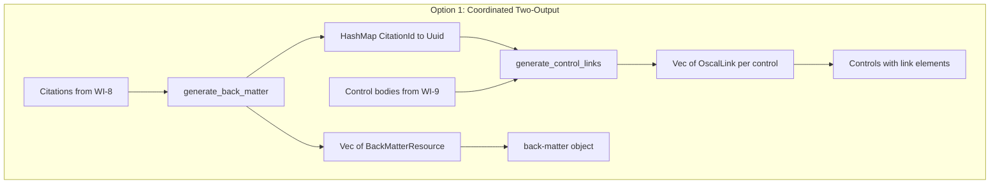
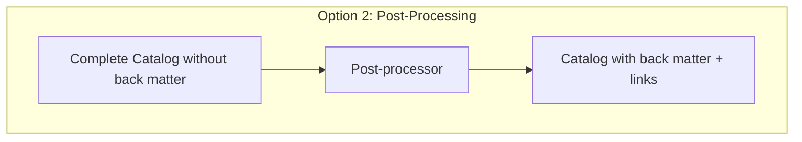
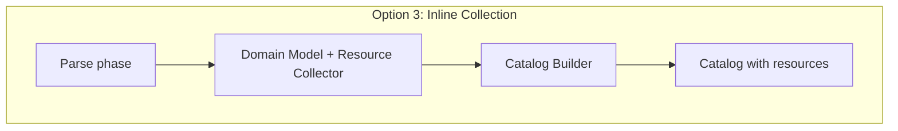
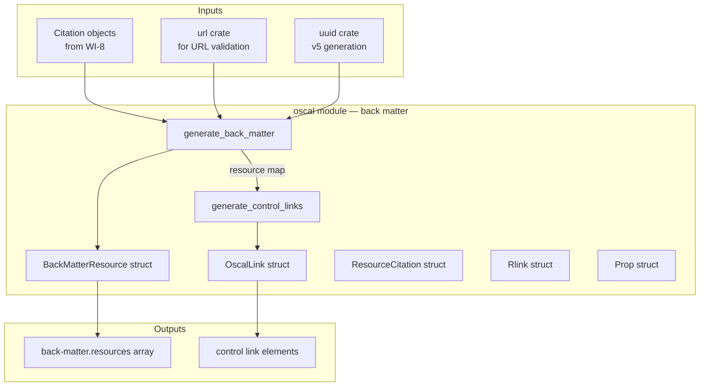
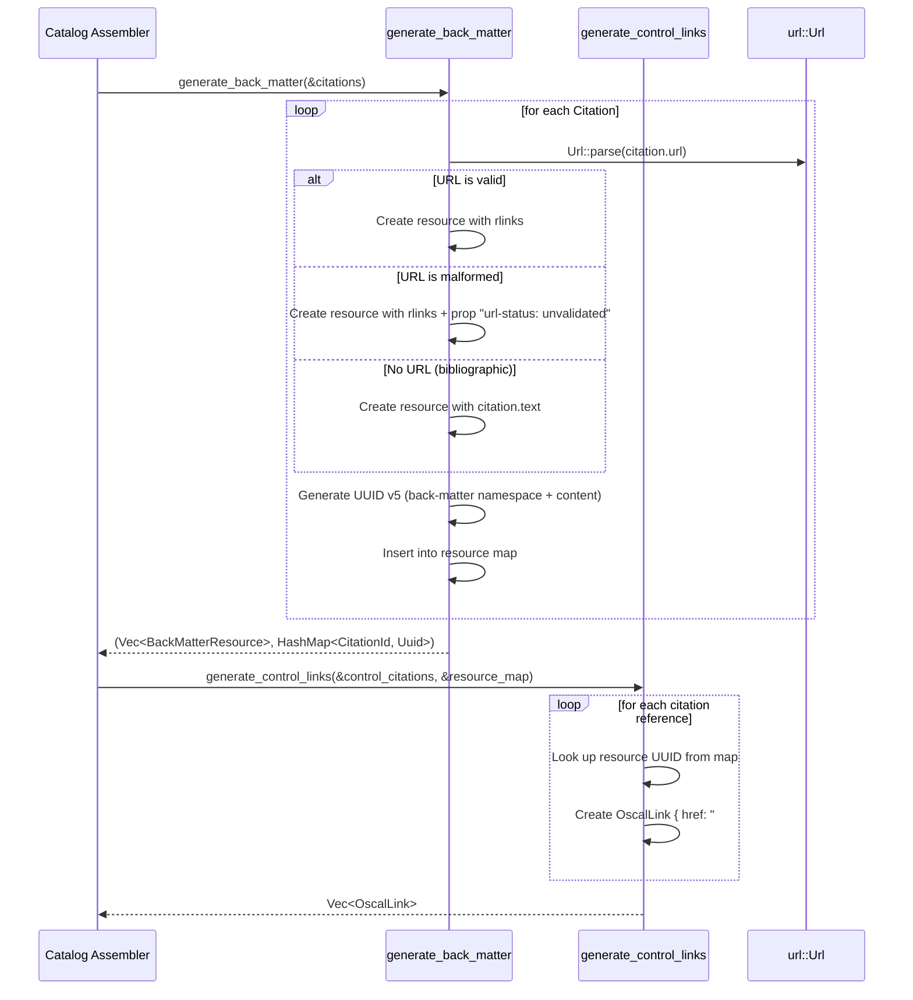

# 012-ar-back-matter

> **Document Type:** Architecture Review
> **Audience:** LLM agents, human reviewers
> **Status:** Proposed
> **Last Updated:** 2026-02-10 <!-- @auto -->
> **Owner:** Brian Luby <!-- @human-required -->
> **Deciders:** Brian Luby <!-- @human-required -->

---

## Review Tier Legend

| Marker | Tier | Speckit Behavior |
|--------|------|------------------|
| 🔴 `@human-required` | Human Generated | Prompt human to author; blocks until complete |
| 🟡 `@human-review` | LLM + Human Review | LLM drafts → prompt human to confirm/edit; blocks until confirmed |
| 🟢 `@llm-autonomous` | LLM Autonomous | LLM completes; no prompt; logged for audit |
| ⚪ `@auto` | Auto-generated | System fills (timestamps, links); no prompt |

---

## Document Completion Order

> ⚠️ **For LLM Agents:** Complete sections in this order. Do not fill downstream sections until upstream human-required inputs exist.

1. **Summary (Decision)** → requires human input first
2. **Context (Problem Space)** → requires human input
3. **Decision Drivers** → requires human input (prioritized)
4. **Driving Requirements** → extract from PRD, human confirms
5. **Options Considered** → LLM drafts after drivers exist, human reviews
6. **Decision (Selected + Rationale)** → requires human decision
7. **Implementation Guardrails** → LLM drafts, human reviews
8. **Everything else** → can proceed after decision is made

---

## Linkage ⚪ `@auto`

| Document | ID | Relationship |
|----------|-----|--------------|
| Parent PRD | [012-prd-back-matter](../PRD/012-prd-back-matter.md) | Requirements this architecture satisfies |
| Parent PRD (top-level) | [FORGE_PRD](../FORGE_PRD.md) | Parent requirements M-9, M-11 |
| Security Review | N/A | Low risk — no external content fetching |
| Supersedes | — | N/A (greenfield) |
| Superseded By | — | |

---

## Summary

### Decision 🔴 `@human-required`
> Use a dedicated `BackMatterBuilder` that receives extracted `Citation` objects, classifies them (URL vs bibliographic), generates deterministic UUID v5 resources, and produces both the `back-matter` object and control `link` elements in a single coordinated pass. Malformed URLs are preserved with `prop` annotations.

### TL;DR for Agents 🟡 `@human-review`
> Back matter generation is a two-output process: (1) `generate_back_matter` produces `BackMatterResource` entries from extracted `Citation` objects, and (2) `generate_control_links` produces `OscalLink` elements that wire control bodies to their referenced resources via `href="#<resource-uuid>"`. URL-based citations become `rlinks`, bibliographic citations become `citation.text` entries. Resource UUIDs use UUID v5 with a dedicated back-matter namespace for determinism. Do NOT embed citation text in control prose or in `remarks` fields. Do NOT generate random UUIDs for resources — they must be deterministic.

---

## Context

### Problem Space 🔴 `@human-required`
Policy documents contain citations, cross-references, and bibliographic references to external standards (NIST SP 800-53, ISO 27001) and internal procedures. OSCAL mandates these be represented as structured resources in `back-matter`, linked from control bodies via `link` elements — not embedded inline in prose or dumped into `remarks`. WI-8 extracts `Citation` objects from policy text. This work item must convert those citations into OSCAL-compliant `back-matter.resources[]` entries and wire `link` elements into control bodies so that the reference graph is machine-navigable. The challenge is coordinating two outputs (resources and links) while maintaining deterministic UUIDs and handling malformed URLs gracefully.

### Decision Scope 🟡 `@human-review`

**This AR decides:**
- How citations are converted into OSCAL back matter resources
- How back matter resource UUIDs are generated (namespace, determinism)
- How control bodies link to back matter resources
- How malformed URLs are handled

**This AR does NOT decide:**
- Citation extraction from source text — handled by WI-8
- Evidence/attachment resources (binary files) — deferred to Phase 3
- XML/YAML serialization of back matter — deferred to WI-26/WI-27
- Back matter for Component Definition — same pattern applies, wired in WI-14

### Current State 🟢 `@llm-autonomous`
N/A — greenfield implementation. WI-8 provides extracted `Citation` objects. WI-9/WI-10 provide the Catalog control skeleton. No back matter generation exists.

### Driving Requirements 🟡 `@human-review`

| PRD Req ID | Requirement Summary | Architectural Implication |
|------------|---------------------|---------------------------|
| M-1 | Generate `back-matter` with `resources[]` from citations | Need a function that produces structured resource entries |
| M-2 | URL-based citations produce resources with `rlinks[]` | Must classify citations by type (URL vs bibliographic) |
| M-3 | Bibliographic citations produce resources with `citation.text` | Two code paths based on citation classification |
| M-4 | Resource UUIDs are deterministic (UUID v5) | Requires a dedicated namespace UUID for back matter |
| M-5 | Each resource has a `title` field | Derive from citation text or URL |
| M-6 | Controls link to resources via `link` elements with `href="#<uuid>"` | Need a resource-UUID map and link generation function |
| M-7 | No arbitrary data in `remarks` fields | All citation data uses `prop`, `link`, or `resource` patterns |
| M-8 | Malformed URLs preserved with `prop` annotation | URL validation + conditional prop attachment |

**PRD Constraints inherited:**
- From constitution: Rust latest stable, TDD mandatory, `thiserror` for errors
- From Parent PRD M-11: No arbitrary data in `remarks` fields

---

## Decision Drivers 🔴 `@human-required`

1. **NIST Compliance:** Citations must be in `back-matter` resources, not prose or `remarks` *(traces to PRD M-7, Parent PRD M-11)*
2. **Link Integrity:** Every control-citation link must resolve to a valid back matter resource UUID *(traces to PRD M-6)*
3. **Determinism:** Same citation content produces same resource UUID across re-conversions *(traces to PRD M-4)*
4. **Robustness:** Malformed URLs must not crash the pipeline or silently drop data *(traces to PRD M-8)*

---

## Options Considered 🟡 `@human-review`

### Option 0: Status Quo / Do Nothing

**Description:** No back matter generation. Citations extracted by WI-8 are discarded or left inline in control prose.

| Driver | Rating | Notes |
|--------|--------|-------|
| NIST Compliance | ❌ Poor | Citations in prose violates NIST guidance |
| Link Integrity | ❌ Poor | No resources to link to |
| Determinism | N/A | No resources generated |
| Robustness | ❌ Poor | Citation data lost |

**Why not viable:** Parent PRD M-9 mandates citations be extracted into back matter as resources. Discarding citations or embedding them in prose violates the OSCAL model and makes the output non-compliant.

---

### Option 1: Coordinated Two-Output Builder (Recommended)

**Description:** A `generate_back_matter` function produces `Vec<BackMatterResource>` from citations, building a `HashMap<CitationId, Uuid>` as a side product. A companion `generate_control_links` function uses the resource map to produce `OscalLink` elements for control bodies. Both functions are called during catalog assembly.



| Driver | Rating | Notes |
|--------|--------|-------|
| NIST Compliance | ✅ Good | Citations in back matter, links in controls — correct OSCAL pattern |
| Link Integrity | ✅ Good | Resource map guarantees link-to-resource correspondence |
| Determinism | ✅ Good | UUID v5 with dedicated namespace ensures stable resource IDs |
| Robustness | ✅ Good | Malformed URLs preserved with `prop` annotation |

**Pros:**
- Clean separation: resource generation and link generation are distinct steps
- Resource map provides compile-time guarantee that links reference real resources
- Two small, focused functions — easy to test independently
- Consistent with OSCAL best practice (resources in back matter, links in body)

**Cons:**
- Requires coordination between two function calls during assembly (minor orchestration complexity)
- Resource map is an intermediate data structure (small memory cost)

---

### Option 2: Post-Processing Pass

**Description:** Build the entire Catalog without back matter first, then run a post-processing pass that scans control prose for citation markers, extracts them into back matter, and inserts links.



| Driver | Rating | Notes |
|--------|--------|-------|
| NIST Compliance | ✅ Good | End result is compliant |
| Link Integrity | ⚠️ Medium | Post-processor must correctly identify all citation markers in JSON |
| Determinism | ✅ Good | Same UUIDs if same citations detected |
| Robustness | ⚠️ Medium | Post-processing on serialized JSON is fragile |

**Pros:**
- Decouples back matter from the main assembly pipeline
- Can be added without modifying existing builders

**Cons:**
- Operating on already-serialized JSON or partially-built structures is error-prone
- Citation markers in prose must survive serialization intact (fragile)
- Harder to test — requires full catalog assembly before back matter can be tested
- Violates pipeline stage separation principle

---

### Option 3: Inline Collection During Parsing

**Description:** Collect back matter resources during the parsing phase (WI-3/WI-4) as citations are encountered. Pass the accumulated resources through the pipeline alongside the domain model.



| Driver | Rating | Notes |
|--------|--------|-------|
| NIST Compliance | ✅ Good | Resources are correctly placed |
| Link Integrity | ⚠️ Medium | Resources collected before controls exist; linking requires back-reference |
| Determinism | ✅ Good | Same citations produce same resources |
| Robustness | ⚠️ Medium | Parsing phase should not know about OSCAL structure |

**Pros:**
- Resources are collected early, available throughout the pipeline
- No separate assembly step needed

**Cons:**
- Breaks separation of concerns: parsing phase generates OSCAL-specific structures
- Resource collection in the parser couples input parsing to output format
- Control-to-resource links still need a separate step (controls don't exist during parsing)
- Violates the pipeline stage architecture (parsing should produce domain model, not OSCAL structures)

---

## Decision

### Selected Option 🔴 `@human-required`
> **Option 1: Coordinated Two-Output Builder**

### Rationale 🔴 `@human-required`

Option 1 maintains clean pipeline stage separation: citations come from WI-8 (domain model stage), back matter resources are generated in the OSCAL assembly stage, and links are inserted into controls during catalog assembly. The resource map provides a type-safe bridge between the two outputs. Options 2 and 3 either break stage separation (Option 3) or operate on fragile intermediate representations (Option 2). Option 1 is the simplest approach that correctly separates concerns while maintaining link integrity.

#### Simplest Implementation Comparison 🟡 `@human-review`

| Aspect | Simplest Possible | Selected Option | Justification for Complexity |
|--------|-------------------|-----------------|------------------------------|
| Components | Dump citations in prose | Two functions + resource map | PRD M-7/M-9 require back matter, not inline prose |
| Dependencies | No URL validation | `url` crate for validation | PRD M-8 requires malformed URL detection |
| Patterns | Single function | Two coordinated functions | Resources and links are distinct outputs consumed differently |

**Complexity justified by:** OSCAL requires citations in back matter (not prose) with control-body links. The two-function pattern is the minimum structure to produce two coordinated outputs (resources and links) from a single input (citations).

### Architecture Diagram 🟡 `@human-review`



---

## Technical Specification

### Component Overview 🟡 `@human-review`

| Component | Responsibility | Interface | Dependencies |
|-----------|---------------|-----------|--------------|
| `generate_back_matter` | Convert citations to OSCAL resources + build resource map | `fn(&[Citation]) -> Result<(Vec<BackMatterResource>, HashMap<CitationId, Uuid>), ForgeError>` | `uuid`, `url` |
| `generate_control_links` | Produce link elements for controls given their citations | `fn(&[Citation], &HashMap<CitationId, Uuid>) -> Vec<OscalLink>` | None |
| `BackMatterResource` | Serializable OSCAL resource struct | `#[derive(Serialize)]` | `serde` |
| `OscalLink` | Serializable OSCAL link element for control bodies | `#[derive(Serialize)]` | `serde` |
| `Rlink` | URL-based link within a resource | `#[derive(Serialize)]` | `serde` |
| `ResourceCitation` | Bibliographic citation text within a resource | `#[derive(Serialize)]` | `serde` |
| `Prop` | OSCAL property annotation (name-value pair) | `#[derive(Serialize)]` | `serde` |

### Data Flow 🟢 `@llm-autonomous`



### Interface Definitions 🟡 `@human-review`

```rust
use serde::Serialize;
use std::collections::HashMap;
use uuid::Uuid;

/// A single OSCAL back matter resource generated from a Citation.
#[derive(Debug, Clone, Serialize)]
pub struct BackMatterResource {
    pub uuid: Uuid,
    pub title: String,
    #[serde(skip_serializing_if = "Option::is_none")]
    pub description: Option<String>,
    #[serde(skip_serializing_if = "Option::is_none")]
    pub citation: Option<ResourceCitation>,
    #[serde(skip_serializing_if = "Vec::is_empty")]
    pub rlinks: Vec<Rlink>,
    #[serde(skip_serializing_if = "Vec::is_empty")]
    pub props: Vec<Prop>,
}

/// Bibliographic citation text within a resource.
#[derive(Debug, Clone, Serialize)]
pub struct ResourceCitation {
    pub text: String,
}

/// Resolvable link to external content.
#[derive(Debug, Clone, Serialize)]
pub struct Rlink {
    pub href: String,
    #[serde(rename = "media-type", skip_serializing_if = "Option::is_none")]
    pub media_type: Option<String>,
}

/// OSCAL link element for control bodies.
#[derive(Debug, Clone, Serialize)]
pub struct OscalLink {
    pub href: String,   // "#<resource-uuid>"
    pub rel: String,    // "reference"
    #[serde(skip_serializing_if = "Option::is_none")]
    pub text: Option<String>,
}

/// OSCAL property annotation (name-value pair).
#[derive(Debug, Clone, Serialize)]
pub struct Prop {
    pub name: String,
    pub value: String,
}

/// Generate back matter resources from extracted citations.
/// Returns resources and a map from citation IDs to resource UUIDs.
pub fn generate_back_matter(
    citations: &[Citation],
) -> Result<(Vec<BackMatterResource>, HashMap<String, Uuid>), ForgeError>;

/// Generate link elements for a control given its associated citations.
pub fn generate_control_links(
    citations: &[Citation],
    resource_map: &HashMap<String, Uuid>,
) -> Vec<OscalLink>;
```

### Key Algorithms/Patterns 🟡 `@human-review`

**Pattern:** Citation classification and resource generation
```
For each Citation:
1. Check if Citation.url exists
2. If URL exists:
   a. Attempt url::Url::parse(url)
   b. If parse succeeds → create rlink with href=url
   c. If parse fails → create rlink with href=url + prop(url-status=unvalidated)
3. If no URL (bibliographic):
   a. Create citation.text from Citation.text
4. Generate UUID v5 = uuid_v5(BACK_MATTER_NAMESPACE, citation_content_hash)
5. Create BackMatterResource with uuid, title, rlinks/citation, props
6. Store citation_id → resource_uuid in map
```

**Pattern:** Dedicated UUID v5 namespace
```
BACK_MATTER_NAMESPACE = UUID v5 derived from "forge:back-matter" in FORGE's root namespace
This prevents UUID collisions between back matter resources and control IDs.
```

---

## Constraints & Boundaries

### Technical Constraints 🟡 `@human-review`

**Inherited from PRD:**
- No arbitrary data in `remarks` fields (Parent PRD M-11)
- Deterministic UUIDs for identical content (Parent PRD M-8)
- TDD mandatory (constitution principle IV)
- Rust latest stable, `thiserror` for errors

**Added by this Architecture:**
- `url` crate for URL validation — required by PRD M-8 (malformed URL detection)
- Dedicated UUID v5 namespace for back matter resources — prevents collisions with control UUIDs
- `#[serde(skip_serializing_if)]` annotations on optional fields — clean JSON output
- Resource map as intermediate data structure bridging resource generation and link generation

### Architectural Boundaries 🟡 `@human-review`

- **Owns:** `generate_back_matter`, `generate_control_links`, all back matter struct types
- **Interfaces With:** `Citation` objects from WI-8, Control bodies from WI-9/WI-10, Catalog assembler from WI-13
- **Must Not Touch:** Citation extraction logic (WI-8), control/group structure (WI-9), statement parts (WI-10)

### Implementation Guardrails 🟡 `@human-review`

> ⚠️ **Critical for LLM Agents:**

- [x] **DO NOT** embed citation text inline in control prose — extract into back matter and link *(from PRD M-7, Parent PRD M-9)*
- [x] **DO NOT** store citation text, URLs, or structured metadata in `remarks` fields *(from PRD M-7, Parent PRD M-11)*
- [x] **DO NOT** use UUID v4 (random) for back matter resource UUIDs — must be deterministic v5 *(from PRD M-4)*
- [x] **DO NOT** silently drop malformed URLs — preserve them with `prop` annotation *(from PRD M-8)*
- [x] **MUST** use a dedicated UUID v5 namespace for back matter resources to prevent collisions *(from PRD M-4)*
- [x] **MUST** generate `link` elements with `rel: "reference"` and `href: "#<uuid>"` in control bodies *(from PRD M-6)*
- [x] **MUST** flag malformed URLs with `prop name="url-status" value="unvalidated"` *(from PRD M-8, Parent PRD EC-7)*

---

## Consequences 🟡 `@human-review`

### Positive
- Full NIST compliance: citations in back matter, links in controls, no `remarks` misuse
- Deterministic resource UUIDs enable stable re-conversion and meaningful diffs
- Resource map guarantees link-to-resource integrity at generation time
- Malformed URLs are preserved (no data loss) with clear annotation

### Negative
- Two coordinated function calls required during assembly (minor orchestration)
- Resource map is an intermediate data structure that must be threaded through assembly

### Risks & Mitigations

| Risk | Likelihood | Impact | Mitigation |
|------|------------|--------|------------|
| Citation extraction (WI-8) produces incomplete data | Med | Med | Validate Citation objects before resource generation; warn on empty citations |
| `url` crate rejects valid-but-unusual URLs | Low | Low | Only use `url::Url::parse` for malformed detection; preserve original URL regardless |
| Back matter resource UUIDs conflict with control UUIDs | Low | High | Dedicated UUID v5 namespace prevents collisions by design |

---

## Implementation Guidance

### Suggested Implementation Order 🟢 `@llm-autonomous`
1. Define back matter struct types (`BackMatterResource`, `Rlink`, `ResourceCitation`, `OscalLink`, `Prop`)
2. Define UUID v5 namespace constant for back matter (`BACK_MATTER_NAMESPACE`)
3. Implement `generate_back_matter` with citation classification and resource generation
4. Implement `generate_control_links` using the resource map
5. Write unit tests for URL-based citations → rlinks resources
6. Write unit tests for bibliographic citations → citation.text resources
7. Write unit tests for malformed URL handling (prop annotation)
8. Write unit tests for link generation and href correctness
9. Write integration test: citations → back matter + links → verify link-resource correspondence

### Testing Strategy 🟢 `@llm-autonomous`

| Layer | Test Type | Coverage Target | Notes |
|-------|-----------|-----------------|-------|
| Unit | URL citation → rlink resource | 100% | Valid URL produces correct rlink |
| Unit | Bibliographic citation → citation.text | 100% | Non-URL produces correct citation element |
| Unit | Malformed URL → resource + prop | 100% | Prop annotation with "url-status: unvalidated" |
| Unit | Deterministic UUIDs | 100% | Same citation → same resource UUID |
| Unit | Link generation | 100% | href="#uuid" matches resource UUID |
| Unit | Zero citations | 100% | Empty back matter / no resources |
| Integration | Citations → back matter + control links | Key paths | Full coordination test |

### Anti-patterns to Avoid 🟡 `@human-review`
- **Don't:** Leave citation text inline in control statement prose
  - **Why:** Violates NIST OSCAL guidance; citations belong in back matter
  - **Instead:** Extract into back matter resources and insert `link` elements in controls
- **Don't:** Use `remarks` for citation metadata
  - **Why:** Parent PRD M-11 prohibits arbitrary data in `remarks`
  - **Instead:** Use `prop` for structured annotations, `link` for references
- **Don't:** Use random UUID v4 for resource identifiers
  - **Why:** Breaks determinism; re-conversion produces different UUIDs
  - **Instead:** UUID v5 with dedicated back matter namespace + citation content hash

---

## Compliance & Cross-cutting Concerns

### Security Considerations 🟡 `@human-review`
- Authentication: N/A — local CLI tool
- Authorization: N/A
- Data handling: URLs from citations are preserved as-is in rlinks (never fetched); citation text may contain sensitive organizational references

### Observability 🟢 `@llm-autonomous`
- **Logging:** Warn on malformed URLs (log the URL and the resource UUID it was assigned)
- **Metrics:** N/A
- **Tracing:** N/A

### Error Handling Strategy 🟢 `@llm-autonomous`
```
Error Category → Handling Approach
├── Malformed URL → Preserve in rlinks, add prop "url-status: unvalidated"
├── Empty citation text → Warn, generate resource with empty title
├── Citation with no URL and no text → Warn, skip resource generation
├── UUID generation failure → Propagate as ForgeError (highly unlikely)
└── Orphan link (citation not in map) → Warn, skip link generation
```

---

## Migration Plan (if applicable) 🟡 `@human-review`

N/A — greenfield implementation. No migration required.

### Rollback Plan 🔴 `@human-required`

N/A — greenfield component. If the approach proves wrong, the two functions and struct types can be refactored without affecting upstream pipeline stages.

---

## Open Questions 🟡 `@human-review`

No open questions for this work item.

---

## Changelog ⚪ `@auto`

| Version | Date | Author | Changes |
|---------|------|--------|---------|
| 0.1 | 2026-02-10 | LLM (Claude) | Initial proposal |

---

## Decision Record ⚪ `@auto`

| Date | Event | Details |
|------|-------|---------|
| 2026-02-10 | Proposed | Initial draft created from PRD 012 |

---

## Traceability Matrix 🟢 `@llm-autonomous`

| PRD Req ID | Decision Driver | Option Rating | Component | Notes |
|------------|-----------------|---------------|-----------|-------|
| M-1 | NIST Compliance | Option 1: ✅ | `generate_back_matter` | Produces resources array from citations |
| M-2 | NIST Compliance | Option 1: ✅ | `BackMatterResource.rlinks` | URL citations → rlinks entries |
| M-3 | NIST Compliance | Option 1: ✅ | `BackMatterResource.citation` | Bibliographic citations → citation.text |
| M-4 | Determinism | Option 1: ✅ | UUID v5 + namespace | Dedicated back matter namespace |
| M-5 | NIST Compliance | Option 1: ✅ | `BackMatterResource.title` | Derived from citation text/URL |
| M-6 | Link Integrity | Option 1: ✅ | `generate_control_links` | href="#uuid" linking |
| M-7 | NIST Compliance | Option 1: ✅ | All structs | No `remarks` usage anywhere |
| M-8 | Robustness | Option 1: ✅ | `Prop` with url-status | Malformed URLs annotated, not dropped |

---

## Review Checklist 🟢 `@llm-autonomous`

Before marking as Accepted:
- [x] All PRD Must Have requirements appear in Driving Requirements
- [x] Option 0 (Status Quo) is documented
- [x] Simplest Implementation comparison is completed
- [x] Decision drivers are prioritized and addressed
- [x] At least 2 options were seriously considered
- [x] Constraints distinguish inherited vs. new
- [x] Component names are consistent across all diagrams and tables
- [x] Implementation guardrails reference specific PRD constraints
- [x] Rollback triggers and authority are defined (N/A — greenfield)
- [x] Security review is linked or N/A documented
- [x] No open questions blocking implementation
