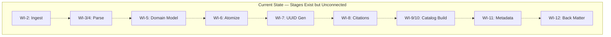
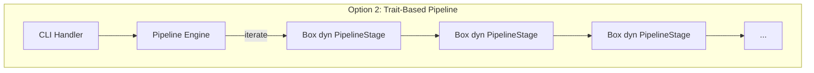
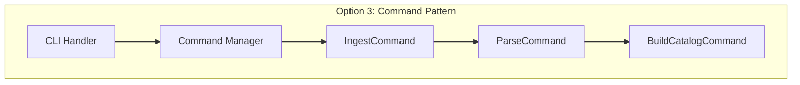
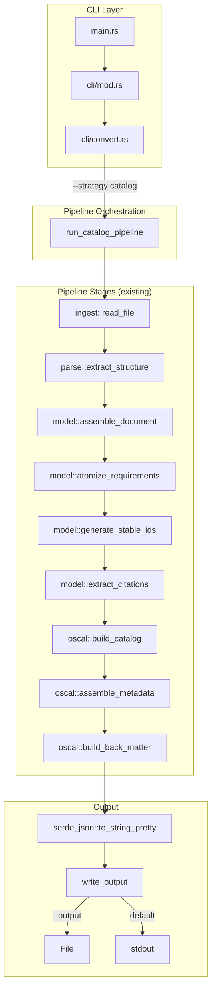
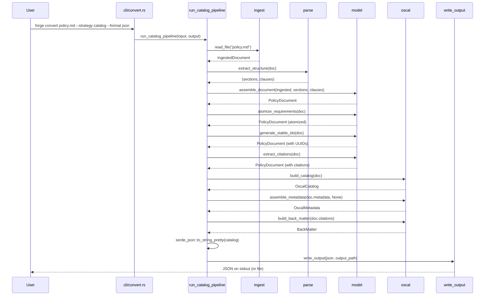

# 013-ar-catalog-pipeline

> **Document Type:** Architecture Review
> **Audience:** LLM agents, human reviewers
> **Status:** Proposed
> **Last Updated:** 2026-02-10 <!-- @auto -->
> **Owner:** Brian Luby <!-- @human-required -->
> **Deciders:** Brian Luby <!-- @human-required -->

---

## Review Tier Legend

| Marker | Tier | Speckit Behavior |
|--------|------|------------------|
| 🔴 `@human-required` | Human Generated | Prompt human to author; blocks until complete |
| 🟡 `@human-review` | LLM + Human Review | LLM drafts → prompt human to confirm/edit; blocks until confirmed |
| 🟢 `@llm-autonomous` | LLM Autonomous | LLM completes; no prompt; logged for audit |
| ⚪ `@auto` | Auto-generated | System fills (timestamps, links); no prompt |

---

## Document Completion Order

> ⚠️ **For LLM Agents:** Complete sections in this order. Do not fill downstream sections until upstream human-required inputs exist.

1. **Summary (Decision)** → requires human input first
2. **Context (Problem Space)** → requires human input
3. **Decision Drivers** → requires human input (prioritized)
4. **Driving Requirements** → extract from PRD, human confirms
5. **Options Considered** → LLM drafts after drivers exist, human reviews
6. **Decision (Selected + Rationale)** → requires human decision
7. **Implementation Guardrails** → LLM drafts, human reviews
8. **Everything else** → can proceed after decision is made

---

## Linkage ⚪ `@auto`

| Document | ID | Relationship |
|----------|-----|--------------|
| Parent PRD | [013-prd-catalog-pipeline](../PRD/013-prd-catalog-pipeline.md) | Requirements this architecture satisfies |
| Parent PRD (top-level) | [FORGE_PRD](../FORGE_PRD.md) | Parent requirements M-3, M-7 |
| Security Review | N/A | No new input parsing; wires existing stages |
| Supersedes | — | N/A (greenfield) |
| Superseded By | — | |

---

## Summary

### Decision 🔴 `@human-required`
> Use a sequential function composition pattern via a single `run_catalog_pipeline` orchestrator function that calls each existing pipeline stage in order, threading typed intermediate results. Output to stdout by default or to a file via `--output`. Use `serde_json::to_string_pretty` for JSON serialization.

### TL;DR for Agents 🟡 `@human-review`
> The catalog pipeline is a single orchestrator function (`run_catalog_pipeline`) that calls existing stage functions in sequence: ingest → parse → assemble domain model → atomize → generate UUIDs → extract citations → build catalog groups/controls → build statement parts → assemble metadata → build back matter → serialize to JSON. Output goes to stdout by default or to a file via `--output`. Each stage returns `Result<T, ForgeError>` and errors propagate via `?`. Do NOT re-implement any pipeline stage logic — call the existing functions. Do NOT use dynamic dispatch or a trait-based pipeline abstraction — direct function calls are the correct level of abstraction for one strategy.

---

## Context

### Problem Space 🔴 `@human-required`
After 12 sprints of building individual pipeline stages (WI-1 through WI-12), no single command exists that converts a Markdown policy document into an OSCAL Catalog. Each stage has been implemented and tested in isolation, but they have never been wired together. This work item integrates all upstream stages into a single `forge convert --strategy catalog --format json` invocation. The architectural challenge is choosing the right abstraction level for pipeline composition: too little structure and the orchestrator becomes a fragile chain of calls; too much structure and we over-engineer with traits and dynamic dispatch for what is currently a single strategy. The pipeline must support stdout output (for composability with `jq`, `|`, etc.) and file output (for practical workflows).

### Decision Scope 🟡 `@human-review`

**This AR decides:**
- How pipeline stages are composed into an end-to-end flow
- How `--strategy catalog`, `--format json`, and `--output` CLI flags are handled
- How output is routed (stdout vs file)
- How errors propagate through the pipeline

**This AR does NOT decide:**
- Component Definition pipeline (`--strategy component`) — deferred to WI-18
- XML/YAML output formats — deferred to WI-26/WI-27
- Schema validation of output — deferred to WI-19
- Traceability embedding — deferred to WI-16/WI-17

### Current State 🟢 `@llm-autonomous`
All individual pipeline stages (WI-1 through WI-12) are implemented and tested. The `cli/convert.rs` handler exists as a stub from WI-1 scaffolding. The `--strategy` and `--format` flags are defined in the clap struct but dispatch to "not yet implemented" stubs.



### Driving Requirements 🟡 `@human-review`

| PRD Req ID | Requirement Summary | Architectural Implication |
|------------|---------------------|---------------------------|
| M-1 | Full pipeline: ingest → parse → normalize → map → assemble → serialize | Must compose all stage functions in sequence |
| M-2 | `--strategy catalog` flag on convert subcommand | CLI dispatch routes to catalog pipeline |
| M-3 | `--format json` flag on convert subcommand | JSON serialization via `serde_json` |
| M-4 | Default output to stdout | Write to stdout when no `--output` flag |
| M-5 | `--output <path>` flag for file output | File creation and writing |
| M-6 | Output is syntactically valid JSON | `serde_json` guarantees valid JSON |
| M-7 | Automated smoke test | Integration test in `cargo test` |
| S-1 | Pretty-printed JSON by default | `serde_json::to_string_pretty` |
| S-2 | Non-zero exit code on pipeline failure | Error propagation to CLI exit |

**PRD Constraints inherited:**
- From constitution: Rust latest stable, TDD mandatory, `thiserror` for errors, clap 4.x for CLI
- From constitution principle X: YAGNI — no over-abstraction

---

## Decision Drivers 🔴 `@human-required`

1. **Simplicity:** Minimal integration code — call existing functions, don't re-implement *(constitution principle X)*
2. **Correctness:** Pipeline produces valid OSCAL Catalog with all required components *(traces to PRD M-1, Parent PRD M-3)*
3. **Composability:** stdout default enables CLI composition with `jq`, pipes, redirection *(traces to PRD M-4)*
4. **Debuggability:** Errors from any stage propagate clearly to the user *(traces to PRD S-2)*

---

## Options Considered 🟡 `@human-review`

### Option 0: Status Quo / Do Nothing

**Description:** Leave the convert command stub in place. Users cannot run an end-to-end conversion.

| Driver | Rating | Notes |
|--------|--------|-------|
| Simplicity | N/A | Nothing to evaluate |
| Correctness | ❌ Poor | No output produced |
| Composability | ❌ Poor | No command to compose |
| Debuggability | ❌ Poor | No pipeline to debug |

**Why not viable:** This is the MS-2 milestone exit criteria. Without end-to-end conversion, FORGE has no user-facing capability.

---

### Option 1: Sequential Function Composition (Recommended)

```mermaid
graph TD
    subgraph "Option 1: Sequential Composition"
        CLI[CLI Handler] --> RCP[run_catalog_pipeline]
        RCP --> |1| ING[ingest::read_file]
        ING --> |2| PARSE[parse::extract_structure]
        PARSE --> |3| MODEL[model::assemble_document]
        MODEL --> |4| ATOM[model::atomize_requirements]
        ATOM --> |5| UUID[model::generate_stable_ids]
        UUID --> |6| CIT[model::extract_citations]
        CIT --> |7| CAT[oscal::build_catalog]
        CAT --> |8| META[oscal::assemble_metadata]
        META --> |9| BM[oscal::build_back_matter]
        BM --> |10| JSON[serde_json::to_string_pretty]
        JSON --> OUT{output?}
        OUT -->|stdout| STDOUT[print to stdout]
        OUT -->|file| FILE[write to file]
    end
```

**Description:** A single `run_catalog_pipeline` function that calls each stage function in sequence using `?` for error propagation. Each stage returns a typed `Result<T, ForgeError>` and the orchestrator threads the output of each stage into the input of the next.



| Driver | Rating | Notes |
|--------|--------|-------|
| Simplicity | ✅ Good | Direct function calls; no abstraction layers |
| Correctness | ✅ Good | Each stage tested independently; composition is straightforward |
| Composability | ✅ Good | stdout default enables piping |
| Debuggability | ✅ Good | `?` propagation gives clear error origin |

**Pros:**
- Simplest possible integration — one function, sequential calls
- Each stage is already tested; orchestrator only tests the wiring
- Error source is clear from the `?` propagation chain
- No runtime overhead from dynamic dispatch
- Easy to read and maintain

**Cons:**
- Adding a second strategy (component) requires either another orchestrator or refactoring (acceptable — WI-18 handles this)
- No parallelism between stages (acceptable — stages have data dependencies)

---

### Option 2: Pipeline Trait with Stages

**Description:** Define a `PipelineStage` trait with an `execute` method. Each stage implements the trait. The orchestrator iterates over a `Vec<Box<dyn PipelineStage>>` and executes each stage in order.



| Driver | Rating | Notes |
|--------|--------|-------|
| Simplicity | ❌ Poor | Trait definition, type erasure, intermediate value boxing |
| Correctness | ⚠️ Medium | Dynamic dispatch adds runtime complexity |
| Composability | ✅ Good | Same output behavior |
| Debuggability | ⚠️ Medium | Dynamic dispatch obscures error origin; type erasure hides intermediate values |

**Pros:**
- Highly extensible — add stages without modifying the engine
- Composable pipeline configuration

**Cons:**
- Massive over-engineering for 1 strategy with 10 stages
- Requires `Any`-like intermediate value passing or a generic pipeline value type
- Type safety lost at stage boundaries (each stage produces different types)
- Violates YAGNI — no current need for dynamic stage composition
- Harder to read and debug than direct function calls

---

### Option 3: Command Pattern with Undo

**Description:** Each pipeline stage is a Command object with `execute` and `undo` methods. The orchestrator runs commands in sequence and can roll back on failure.



| Driver | Rating | Notes |
|--------|--------|-------|
| Simplicity | ❌ Poor | Command objects, undo logic, manager — extreme complexity |
| Correctness | ⚠️ Medium | Undo semantics are unclear for a conversion pipeline |
| Composability | ✅ Good | Same output behavior |
| Debuggability | ⚠️ Medium | Command indirection adds cognitive load |

**Pros:**
- Supports rollback/undo
- Highly structured execution model

**Cons:**
- Extreme over-engineering — there is nothing to "undo" in a conversion pipeline
- Conversion is a pure transformation; rollback has no semantic meaning
- Adds 3x the code for no benefit over Option 1
- Violates YAGNI and constitution principle X (Simplicity & Pragmatism)

---

## Decision

### Selected Option 🔴 `@human-required`
> **Option 1: Sequential Function Composition**

### Rationale 🔴 `@human-required`

Option 1 is the simplest approach that meets all requirements. The pipeline has exactly one strategy (catalog), one output format (JSON), and stages with strict data dependencies that preclude parallelism. Direct function calls provide type safety, clear error propagation, and zero abstraction overhead. Options 2 and 3 introduce significant complexity (traits, dynamic dispatch, command objects) for hypothetical future extensibility that is already planned for specific work items (WI-18 for component strategy, WI-26/WI-27 for additional formats). When those WIs arrive, a targeted refactoring is far cheaper than carrying premature abstraction through 12+ intervening sprints.

#### Simplest Implementation Comparison 🟡 `@human-review`

| Aspect | Simplest Possible | Selected Option | Justification for Complexity |
|--------|-------------------|-----------------|------------------------------|
| Components | Inline all logic in CLI handler | Orchestrator function + CLI handler | Orchestrator is testable independently of CLI |
| Dependencies | No new deps | `serde_json` (already present) | PRD M-6 requires valid JSON output |
| Patterns | Single function | Single function with `?` chaining | Identical — this IS the simplest approach |

**Complexity justified by:** The selected option IS the simplest possible approach. Extracting the orchestrator into `run_catalog_pipeline` (vs inline in CLI handler) provides testability without adding complexity.

### Architecture Diagram 🟡 `@human-review`



---

## Technical Specification

### Component Overview 🟡 `@human-review`

| Component | Responsibility | Interface | Dependencies |
|-----------|---------------|-----------|--------------|
| `cli/convert.rs` | Parse CLI flags, dispatch to pipeline | CLI handler | clap 4.x |
| `run_catalog_pipeline` | Compose all pipeline stages in sequence | `fn(&Path, Option<&Path>, u64) -> Result<(), ForgeError>` | All pipeline stage modules |
| `write_output` | Route JSON string to stdout or file | `fn(&str, Option<&Path>) -> Result<(), ForgeError>` | `std::fs`, `std::io` |

### Data Flow 🟢 `@llm-autonomous`



### Interface Definitions 🟡 `@human-review`

```rust
use std::path::Path;

/// Run the full catalog conversion pipeline from Markdown file to OSCAL JSON.
///
/// Composes all pipeline stages in sequence:
/// ingest → parse → model → atomize → uuid → citations → catalog → metadata → back matter → JSON
///
/// # Arguments
/// * `input_path` - Path to the Markdown policy document
/// * `output_path` - Optional output file path (defaults to stdout)
///
/// # Errors
/// Returns `ForgeError` if any pipeline stage fails.
pub fn run_catalog_pipeline(
    input_path: &Path,
    output_path: Option<&Path>,
    max_size_bytes: u64,
) -> Result<(), ForgeError> {
    // 1. Ingest
    let ingested = ingest::read_file(input_path, max_size_bytes)?;

    // 2. Parse structure
    let sections = parse::extract_sections(&ingested)?;
    let clauses = parse::extract_clauses(&ingested)?;

    // 3. Assemble domain model
    let mut document = model::assemble_document(ingested, sections, clauses)?;

    // 4. Normalize
    document = model::atomize_requirements(document)?;
    document = model::generate_stable_ids(document)?;
    document = model::extract_citations(document)?;

    // 5. Build OSCAL Catalog
    let catalog = oscal::build_catalog(&document)?;

    // 6. Assemble metadata and back matter
    let metadata = oscal::assemble_metadata(&document.metadata, None)?;
    let back_matter = oscal::build_back_matter(&document)?;

    // 7. Combine into final artifact
    let artifact = oscal::assemble_catalog(catalog, metadata, back_matter)?;

    // 8. Serialize to JSON
    let json = serde_json::to_string_pretty(&artifact)
        .map_err(|e| ForgeError::Serialization(e.to_string()))?;

    // 9. Output
    write_output(&json, output_path)
}

/// Write JSON string to file or stdout.
pub fn write_output(json: &str, output_path: Option<&Path>) -> Result<(), ForgeError> {
    match output_path {
        Some(path) => std::fs::write(path, json)
            .map_err(ForgeError::Io),
        None => {
            println!("{json}");
            Ok(())
        }
    }
}
```

### Key Algorithms/Patterns 🟡 `@human-review`

**Pattern:** Sequential function composition with `?` error propagation
```
1. Each stage returns Result<T, ForgeError>
2. Orchestrator chains calls with ? operator
3. First stage failure short-circuits the pipeline
4. ForgeError variants identify the failing stage
5. CLI handler converts ForgeError to exit code + user message
```

**Pattern:** Output routing
```
1. Check if --output flag was provided
2. If Some(path) → write JSON to file via std::fs::write
3. If None → print JSON to stdout via println!
4. stdout enables CLI composition: forge convert ... | jq .catalog.groups
```

---

## Constraints & Boundaries

### Technical Constraints 🟡 `@human-review`

**Inherited from PRD:**
- clap 4.x for CLI (constitution technology stack)
- TDD mandatory (constitution principle IV)
- `thiserror` for error types (constitution principle VIII)
- `serde` + `serde_json` for JSON serialization

**Added by this Architecture:**
- `run_catalog_pipeline` must be a standalone function (testable without CLI)
- JSON output via `serde_json::to_string_pretty` (human-readable by default)
- stdout as default output (no `--output` flag = stdout)
- `write_output` as a separate function for testability

### Architectural Boundaries 🟡 `@human-review`

- **Owns:** `run_catalog_pipeline` orchestrator function, `write_output` function, CLI flag handling for `--strategy catalog --format json --output`
- **Interfaces With:** All pipeline stage modules (ingest, parse, model, oscal, export)
- **Must Not Touch:** Individual pipeline stage implementations (WI-2 through WI-12) — call them, don't modify them

### Implementation Guardrails 🟡 `@human-review`

> ⚠️ **Critical for LLM Agents:**

- [x] **DO NOT** re-implement any pipeline stage logic in the orchestrator — call the existing functions *(integration, not reimplementation)*
- [x] **DO NOT** use trait objects, dynamic dispatch, or a generic pipeline engine *(YAGNI — one strategy)*
- [x] **DO NOT** catch and silently swallow errors from pipeline stages — propagate via `?` *(from PRD S-2)*
- [x] **DO NOT** hardcode output to a file without supporting stdout *(from PRD M-4)*
- [x] **MUST** support `--output <path>` for file output *(from PRD M-5)*
- [x] **MUST** default to stdout when `--output` is not provided *(from PRD M-4)*
- [x] **MUST** produce pretty-printed JSON by default *(from PRD S-1)*
- [x] **MUST** include an automated smoke test in `cargo test` *(from PRD M-7)*

---

## Consequences 🟡 `@human-review`

### Positive
- First user-facing capability — `forge convert` produces real OSCAL output
- MS-2 milestone exit criteria met — valid OSCAL Catalog from Markdown
- Minimal integration code — orchestrator is ~30 lines calling existing functions
- stdout default enables immediate CLI composition with `jq`, `grep`, pipe chains

### Negative
- Sequential execution — no parallelism (acceptable given data dependencies between stages)
- Adding the component strategy (WI-18) will require either a second orchestrator or refactoring to a dispatch pattern

### Risks & Mitigations

| Risk | Likelihood | Impact | Mitigation |
|------|------------|--------|------------|
| Interface mismatches between pipeline stages discovered during integration | Med | Med | Each WI designed against shared domain model; integration tests catch mismatches |
| JSON output shape doesn't match expected OSCAL structure | Low | Med | Smoke test validates structure; schema validation in WI-19 confirms |
| Large documents cause slow pipeline execution | Low | Low | Performance benchmarking in WI-24; this sprint focuses on correctness |

---

## Implementation Guidance

### Suggested Implementation Order 🟢 `@llm-autonomous`
1. Implement `write_output` function (stdout vs file)
2. Implement `run_catalog_pipeline` orchestrator calling all stage functions
3. Wire CLI handler: parse `--strategy catalog`, `--format json`, `--output` flags
4. Dispatch `--strategy catalog` to `run_catalog_pipeline`
5. Create sample Markdown policy fixture for smoke test
6. Write smoke test: fixture → pipeline → validate JSON structure
7. Write edge case tests: missing file, empty file, no sections
8. Test `--output` flag writes to file correctly

### Testing Strategy 🟢 `@llm-autonomous`

| Layer | Test Type | Coverage Target | Notes |
|-------|-----------|-----------------|-------|
| Unit | `write_output` to file | 100% | Verify file creation and content |
| Unit | `write_output` to stdout | 100% | Capture stdout and verify |
| Integration | Full pipeline smoke test | Key paths | Sample policy → JSON with catalog, metadata, groups, controls |
| Integration | Missing file error | Error path | Non-zero exit code, descriptive error |
| Integration | Empty file error | Error path | Non-zero exit code, descriptive error |
| Integration | `--output` flag | Happy path | File created with correct JSON content |
| Integration | No `--strategy` flag | Error path | Descriptive error about missing flag |

### Anti-patterns to Avoid 🟡 `@human-review`
- **Don't:** Build a separate copy of pipeline logic instead of calling existing stage functions
  - **Why:** The entire point of WI-13 is integration, not reimplementation
  - **Instead:** Call the functions from WI-2 through WI-12 directly
- **Don't:** Skip the smoke test because unit tests for each stage pass
  - **Why:** Integration bugs live at the boundaries between stages (type mismatches, data shape assumptions)
  - **Instead:** Write a smoke test that runs the full pipeline end-to-end
- **Don't:** Create a `Pipeline` trait or generic stage abstraction
  - **Why:** YAGNI — there is currently one strategy; WI-18 will add component strategy with targeted changes
  - **Instead:** Direct function calls in a single orchestrator function

---

## Compliance & Cross-cutting Concerns

### Security Considerations 🟡 `@human-review`
- Authentication: N/A — local CLI tool
- Authorization: N/A
- Data handling: The `--output` flag writes to a user-specified path; `std::fs::write` provides safe behavior (no path traversal risk). Output files should be treated with same sensitivity as source policy.

### Observability 🟢 `@llm-autonomous`
- **Logging:** Not yet needed; add `tracing` spans around pipeline stages in a later sprint
- **Metrics:** N/A
- **Tracing:** N/A

### Error Handling Strategy 🟢 `@llm-autonomous`
```
Error Category → Handling Approach
├── File not found → ForgeError::Io, non-zero exit code
├── Empty/unreadable file → ForgeError::Parse, non-zero exit code
├── Parse failure → ForgeError::Parse, descriptive message
├── Assembly failure → ForgeError variant from failing stage
├── Serialization failure → ForgeError::Serialization
├── Output write failure → ForgeError::Io
└── All errors → propagate to CLI handler → stderr message + exit(1)
```

---

## Migration Plan (if applicable) 🟡 `@human-review`

N/A — greenfield integration. No migration required.

### Rollback Plan 🔴 `@human-required`

N/A — this is the first integration point. If the pipeline composition approach proves wrong, the orchestrator function is ~30 lines and trivially refactored. Individual pipeline stages are unaffected.

---

## Open Questions 🟡 `@human-review`

No open questions for this work item.

---

## Changelog ⚪ `@auto`

| Version | Date | Author | Changes |
|---------|------|--------|---------|
| 0.1 | 2026-02-10 | LLM (Claude) | Initial proposal |

---

## Decision Record ⚪ `@auto`

| Date | Event | Details |
|------|-------|---------|
| 2026-02-10 | Proposed | Initial draft created from PRD 013 |

---

## Traceability Matrix 🟢 `@llm-autonomous`

| PRD Req ID | Decision Driver | Option Rating | Component | Notes |
|------------|-----------------|---------------|-----------|-------|
| M-1 | Correctness | Option 1: ✅ | `run_catalog_pipeline` | Full stage composition |
| M-2 | Correctness | Option 1: ✅ | `cli/convert.rs` | `--strategy catalog` dispatch |
| M-3 | Correctness | Option 1: ✅ | `cli/convert.rs` | `--format json` dispatch |
| M-4 | Composability | Option 1: ✅ | `write_output` | stdout default |
| M-5 | Composability | Option 1: ✅ | `write_output` | `--output <path>` flag |
| M-6 | Correctness | Option 1: ✅ | `serde_json::to_string_pretty` | Valid JSON guaranteed |
| M-7 | Debuggability | Option 1: ✅ | Integration test | Smoke test in `cargo test` |
| S-1 | Composability | Option 1: ✅ | `serde_json::to_string_pretty` | Pretty-printed by default |
| S-2 | Debuggability | Option 1: ✅ | `?` propagation | Non-zero exit on failure |

---

## Review Checklist 🟢 `@llm-autonomous`

Before marking as Accepted:
- [x] All PRD Must Have requirements appear in Driving Requirements
- [x] Option 0 (Status Quo) is documented
- [x] Simplest Implementation comparison is completed
- [x] Decision drivers are prioritized and addressed
- [x] At least 2 options were seriously considered
- [x] Constraints distinguish inherited vs. new
- [x] Component names are consistent across all diagrams and tables
- [x] Implementation guardrails reference specific PRD constraints
- [x] Rollback triggers and authority are defined (N/A — first integration)
- [x] Security review is linked or N/A documented
- [x] No open questions blocking implementation
