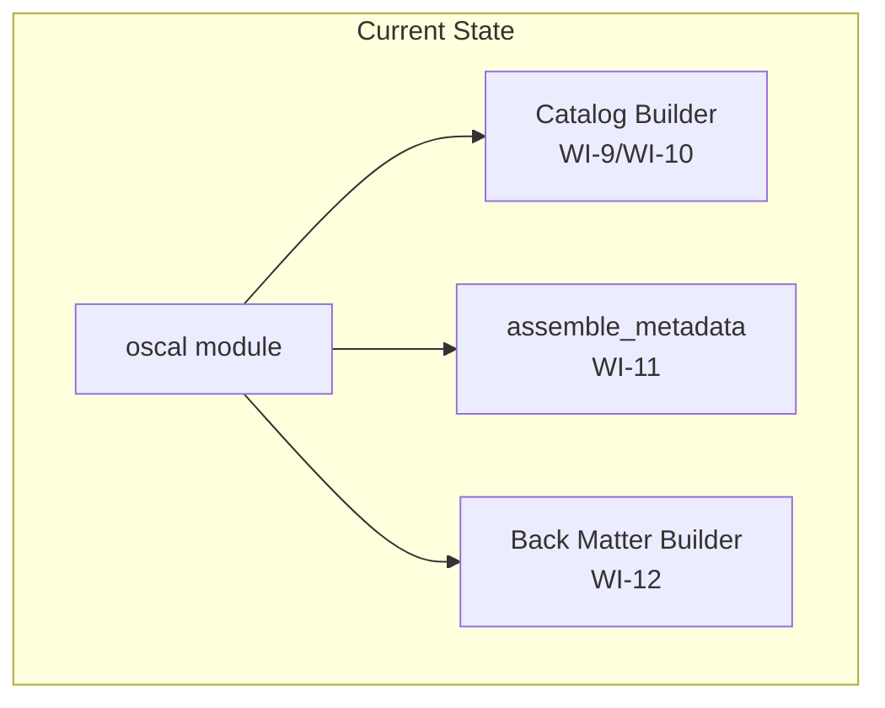
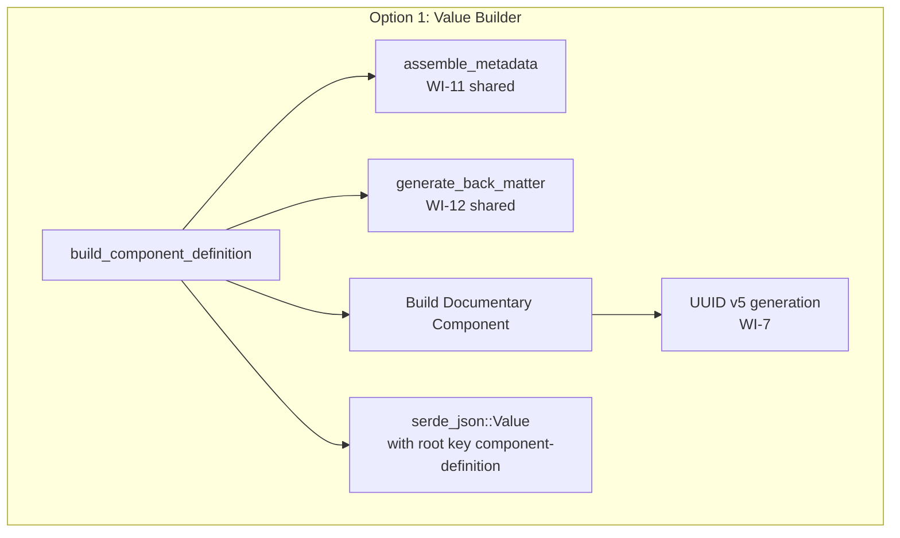
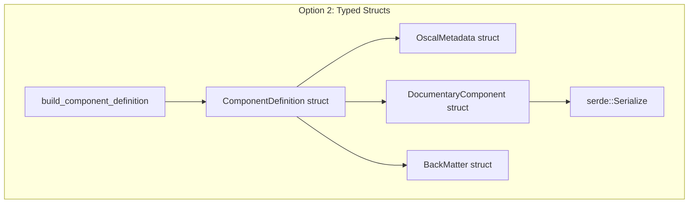
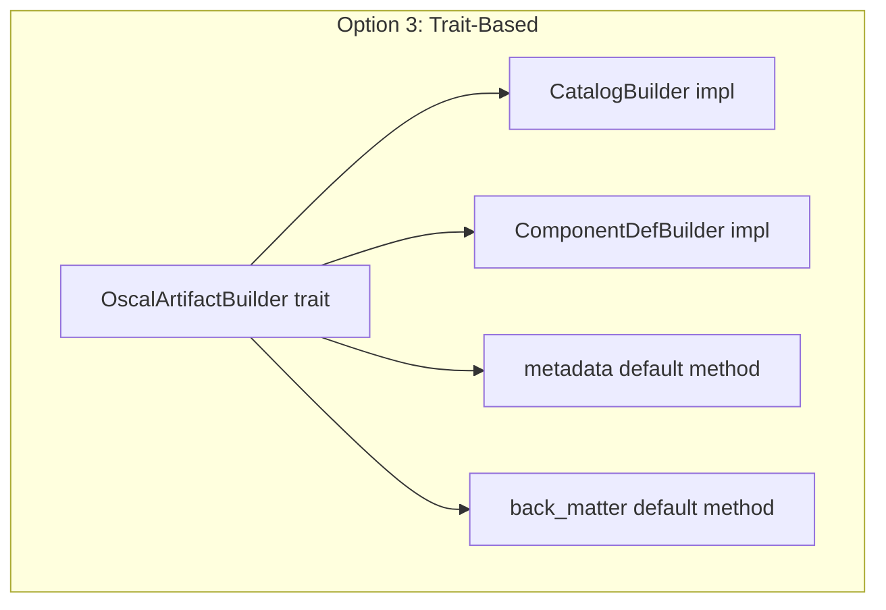
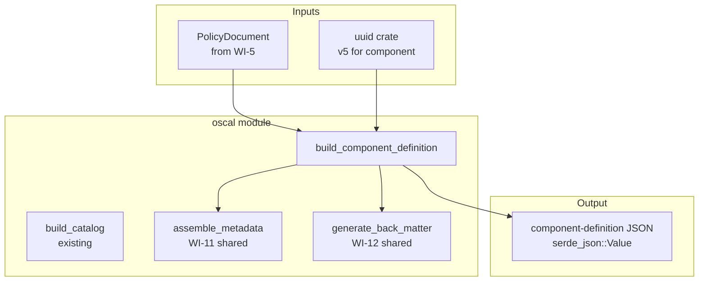
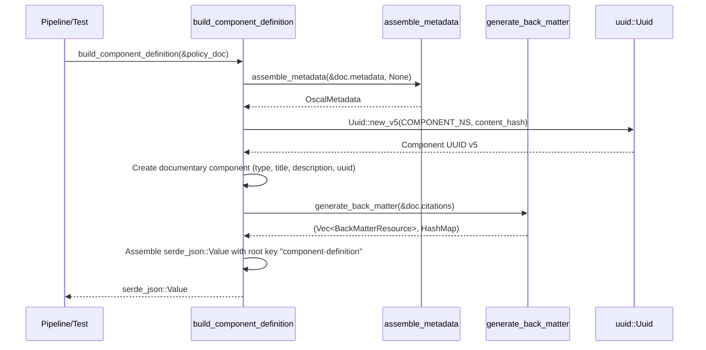

# 014-ar-component-definition-structure

> **Document Type:** Architecture Review
> **Audience:** LLM agents, human reviewers
> **Status:** Proposed
> **Last Updated:** 2026-02-10 <!-- @auto -->
> **Owner:** Brian Luby <!-- @human-required -->
> **Deciders:** Brian Luby <!-- @human-required -->

---

## Review Tier Legend

| Marker | Tier | Speckit Behavior |
|--------|------|------------------|
| 🔴 `@human-required` | Human Generated | Prompt human to author; blocks until complete |
| 🟡 `@human-review` | LLM + Human Review | LLM drafts → prompt human to confirm/edit; blocks until confirmed |
| 🟢 `@llm-autonomous` | LLM Autonomous | LLM completes; no prompt; logged for audit |
| ⚪ `@auto` | Auto-generated | System fills (timestamps, links); no prompt |

---

## Document Completion Order

> ⚠️ **For LLM Agents:** Complete sections in this order. Do not fill downstream sections until upstream human-required inputs exist.

1. **Summary (Decision)** → requires human input first
2. **Context (Problem Space)** → requires human input
3. **Decision Drivers** → requires human input (prioritized)
4. **Driving Requirements** → extract from PRD, human confirms
5. **Options Considered** → LLM drafts after drivers exist, human reviews
6. **Decision (Selected + Rationale)** → requires human decision
7. **Implementation Guardrails** → LLM drafts, human reviews
8. **Everything else** → can proceed after decision is made

---

## Linkage ⚪ `@auto`

| Document | ID | Relationship |
|----------|-----|--------------|
| Parent PRD | [014-prd-component-definition-structure](../PRD/014-prd-component-definition-structure.md) | Requirements this architecture satisfies |
| Parent PRD (top-level) | [FORGE_PRD](../FORGE_PRD.md) | Parent requirements M-4, M-5 |
| Related AR | [011-ar-oscal-metadata](011-ar-oscal-metadata.md) | Metadata assembly pattern reused |
| Related AR | [012-ar-back-matter](012-ar-back-matter.md) | Back matter pattern reused |
| Security Review | N/A | No new input processing |
| Supersedes | — | N/A (greenfield) |
| Superseded By | — | |

---

## Summary

### Decision 🔴 `@human-required`
> Use a `build_component_definition` function in the `oscal` module that mirrors the Catalog builder pattern, producing a `serde_json::Value` with the `component-definition` root key. The function reuses WI-11 metadata assembly and WI-12 back matter generation. It creates exactly one documentary component of type `"policy"` with a deterministic UUID v5.

### TL;DR for Agents 🟡 `@human-review`
> The Component Definition builder follows the same `serde_json::Value` pattern as the Catalog builder. It produces a JSON object with root key `"component-definition"` containing: document-level metadata (via WI-11 `assemble_metadata`), a `components` array with one documentary component of `type: "policy"`, and optional back matter (via WI-12). The documentary component gets a deterministic UUID v5 (content-based, same WI-7 infrastructure), and its `control-implementations` array is left empty for WI-15 to populate. Do NOT create typed Component Definition structs yet — use `serde_json::Value` for consistency with the Catalog builder. Do NOT populate `control-implementations` — that is WI-15's responsibility.

---

## Context

### Problem Space 🔴 `@human-required`
The Catalog pipeline (WI-9 through WI-13) handles the catalog-first strategy where policy requirements become controls. However, many organizations use the component-first strategy: representing their security policy as a documentary component that "implements" controls from an external baseline (e.g., NIST SP 800-53). The OSCAL Component Definition model supports this via documentary components of type `"policy"`. This work item creates the structural envelope — the Component Definition document with its documentary component — that WI-15 populates with `implemented-requirements` and WI-18 wires into the end-to-end pipeline. The architectural decision centers on whether to reuse the Catalog's `serde_json::Value` pattern, create dedicated typed structs, or use a shared trait-based approach across artifact types.

### Decision Scope 🟡 `@human-review`

**This AR decides:**
- How the Component Definition JSON structure is built (builder pattern, struct types, or Value construction)
- How metadata and back matter are integrated (reuse vs duplicate)
- How the documentary component is created (UUID, type, title, description)
- What module the builder lives in

**This AR does NOT decide:**
- `control-implementations` and `implemented-requirements` — deferred to WI-15
- End-to-end `--strategy component` CLI wiring — deferred to WI-18
- Schema validation — deferred to WI-19
- Traceability props/links — deferred to WI-16/WI-17

### Current State 🟢 `@llm-autonomous`
The Catalog builder (WI-9/WI-10/WI-13) is complete, producing OSCAL Catalog JSON via `serde_json::Value` construction. The metadata assembly (WI-11) and back matter generation (WI-12) are implemented as shared functions. The `oscal` module contains Catalog-specific code but no Component Definition support.



### Driving Requirements 🟡 `@human-review`

| PRD Req ID | Requirement Summary | Architectural Implication |
|------------|---------------------|---------------------------|
| M-1 | JSON root key `"component-definition"` | Builder must produce correct OSCAL root structure |
| M-2 | Required OSCAL metadata (uuid, title, last-modified, version, oscal-version) | Must reuse WI-11 metadata assembly |
| M-3 | `components` array with one documentary component of type `"policy"` | Single component with correct type field |
| M-4 | Component UUID is deterministic (UUID v5, content-based) | Must use WI-7 UUID v5 infrastructure |
| M-5 | Component title from `PolicyDocument.metadata.title` | Pass-through from domain model |
| M-6 | Component description derived from PolicyDocument | Generate a standard description string |
| M-7 | Reuse WI-11 metadata assembly function | Shared function call, not duplicate code |

**PRD Constraints inherited:**
- From constitution: Rust latest stable, TDD mandatory, `thiserror` for errors
- From constitution principle X: YAGNI — build only the structural envelope
- Consistent `serde_json::Value` pattern with Catalog builder (per PRD decision log)

---

## Decision Drivers 🔴 `@human-required`

1. **Pattern Consistency:** Component Definition builder should mirror the Catalog builder pattern *(consistency across artifact types)*
2. **Reuse:** Metadata and back matter assembly must not be duplicated *(DRY, traces to PRD M-7)*
3. **Simplicity:** Build only the structural envelope; leave control-implementations for WI-15 *(YAGNI)*
4. **Determinism:** Documentary component UUID must be stable across re-conversions *(traces to PRD M-4, Parent PRD M-8)*

---

## Options Considered 🟡 `@human-review`

### Option 0: Status Quo / Do Nothing

**Description:** No Component Definition builder exists. Only Catalog strategy is available.

| Driver | Rating | Notes |
|--------|--------|-------|
| Pattern Consistency | N/A | Nothing to evaluate |
| Reuse | N/A | No builder to reuse patterns |
| Simplicity | N/A | No code |
| Determinism | N/A | No UUIDs generated |

**Why not viable:** Parent PRD M-4 requires Component Definition generation. MS-3 milestone depends on it. The component-first strategy is a core user need (User Story 2).

---

### Option 1: serde_json::Value Builder (Mirror Catalog Pattern) — Recommended

**Description:** A `build_component_definition` function that constructs the Component Definition using `serde_json::Value` (json! macro or Value construction), mirroring the Catalog builder pattern. Calls `assemble_metadata` (WI-11) and `generate_back_matter` (WI-12) for shared concerns.



| Driver | Rating | Notes |
|--------|--------|-------|
| Pattern Consistency | ✅ Good | Same `serde_json::Value` pattern as Catalog builder |
| Reuse | ✅ Good | Calls shared metadata and back matter functions |
| Simplicity | ✅ Good | One function, mirrors existing pattern |
| Determinism | ✅ Good | UUID v5 for component, v4 for document (consistent with WI-7) |

**Pros:**
- Zero learning curve — same pattern as Catalog builder
- Shared functions for metadata and back matter — no duplication
- Flexible for rapid iteration during WI-14/WI-15 development
- `serde_json::Value` allows easy structural additions in WI-15

**Cons:**
- No compile-time enforcement of Component Definition shape (runtime validation only)
- Can be refactored to typed structs later when all OSCAL models are stable

---

### Option 2: Dedicated Typed Component Definition Structs

**Description:** Define Rust structs (`ComponentDefinition`, `DocumentaryComponent`, etc.) with serde derives that compile-time enforce the OSCAL Component Definition JSON shape.



| Driver | Rating | Notes |
|--------|--------|-------|
| Pattern Consistency | ❌ Poor | Different pattern from Catalog builder (which uses Value) |
| Reuse | ✅ Good | Can call shared functions, populate struct fields |
| Simplicity | ⚠️ Medium | More upfront code; struct definitions for all Component Definition elements |
| Determinism | ✅ Good | Same UUID approach regardless of builder pattern |

**Pros:**
- Compile-time shape enforcement — invalid JSON structures caught at compile time
- Self-documenting — struct fields describe the OSCAL model
- Better IDE support (autocomplete, type checking)

**Cons:**
- Inconsistent with Catalog builder (which uses `serde_json::Value`)
- Premature rigidity — WI-15 will modify the structure (add control-implementations), requiring struct changes
- More upfront code for the same result (valid JSON)
- Refactoring to typed structs should happen holistically for all OSCAL models (post WI-19), not piecemeal

---

### Option 3: Shared Trait-Based Approach

**Description:** Define an `OscalArtifactBuilder` trait that both Catalog and Component Definition builders implement. Shared behavior (metadata, back matter) is provided by trait default methods or a common base.



| Driver | Rating | Notes |
|--------|--------|-------|
| Pattern Consistency | ⚠️ Medium | New pattern for both builders; requires refactoring Catalog |
| Reuse | ✅ Good | Trait default methods share behavior |
| Simplicity | ❌ Poor | Trait definition, generics/associated types, refactoring Catalog builder |
| Determinism | ✅ Good | Same UUID approach |

**Pros:**
- Formal contract for OSCAL artifact builders
- Shared behavior via trait defaults
- Extensible for Profile builder (WI-30)

**Cons:**
- Requires refactoring the existing Catalog builder to implement the trait
- Premature abstraction — only 2 builders exist; traits should emerge from concrete implementations (constitution principle X)
- Trait with a single implementation is an anti-pattern per the constitution
- Adds complexity without solving a current problem

---

## Decision

### Selected Option 🔴 `@human-required`
> **Option 1: serde_json::Value Builder (Mirror Catalog Pattern)**

### Rationale 🔴 `@human-required`

Option 1 maintains consistency with the established Catalog builder pattern, which uses `serde_json::Value` for flexible JSON construction. The Component Definition structure will be modified by WI-15 (adding control-implementations), making the flexible `Value` approach preferable to rigid typed structs during the build-out phase. The trait-based approach (Option 3) is premature with only two builders — per the constitution, traits should emerge from concrete implementations when polymorphism is actually needed (possibly at WI-30 when a third builder exists). Typed structs (Option 2) can be introduced as a holistic refactoring after all OSCAL models are working and stable (post WI-19).

#### Simplest Implementation Comparison 🟡 `@human-review`

| Aspect | Simplest Possible | Selected Option | Justification for Complexity |
|--------|-------------------|-----------------|------------------------------|
| Components | Hardcode JSON string | Value builder + shared functions | PRD M-2/M-7 require metadata reuse; hardcoded JSON is unmaintainable |
| Dependencies | No new deps | uuid (v5), serde_json (already present) | PRD M-4 requires deterministic component UUID |
| Patterns | Single function | Single function mirroring Catalog pattern | Pattern consistency reduces cognitive load |

**Complexity justified by:** The selected option IS the simplest approach that meets PRD requirements. The Value builder is identical in complexity to the Catalog builder, and reusing shared functions avoids duplication.

### Architecture Diagram 🟡 `@human-review`



---

## Technical Specification

### Component Overview 🟡 `@human-review`

| Component | Responsibility | Interface | Dependencies |
|-----------|---------------|-----------|--------------|
| `build_component_definition` | Produce Component Definition JSON Value | `fn(&PolicyDocument) -> Result<serde_json::Value, ForgeError>` | `assemble_metadata`, `generate_back_matter`, `uuid` |
| `assemble_metadata` (WI-11) | Generate OSCAL metadata block | Shared function | `uuid`, `chrono` |
| `generate_back_matter` (WI-12) | Generate back matter from citations | Shared function | `uuid`, `url` |

### Data Flow 🟢 `@llm-autonomous`



### Interface Definitions 🟡 `@human-review`

```rust
use serde_json::Value;

/// Build an OSCAL Component Definition JSON structure from a PolicyDocument.
///
/// Produces a `serde_json::Value` with root key `"component-definition"` containing:
/// - Document-level UUID (v4) and metadata (via WI-11 assemble_metadata)
/// - One documentary component (type: "policy") with UUID (v5), title, description
/// - Empty `control-implementations` placeholder (populated by WI-15)
/// - Optional back matter (via WI-12 generate_back_matter)
///
/// # Arguments
/// * `document` - The parsed PolicyDocument from the domain model
///
/// # Errors
/// Returns `ForgeError` if metadata assembly or back matter generation fails.
pub fn build_component_definition(
    document: &PolicyDocument,
) -> Result<Value, ForgeError> {
    // 1. Assemble metadata (reuse WI-11)
    let metadata = assemble_metadata(&document.metadata, None)?;

    // 2. Generate documentary component
    let component_uuid = generate_component_uuid(document);
    let title = document.metadata.title.clone();
    let component = serde_json::json!({
        "uuid": component_uuid.to_string(),
        "type": "policy",
        "title": title,
        "description": format!(
            "Documentary component representing the {} policy document.",
            title
        ),
        "control-implementations": []
    });

    // 3. Build back matter (reuse WI-12)
    let back_matter = generate_back_matter(&document.citations)?;

    // 4. Assemble component-definition root
    let mut comp_def = serde_json::json!({
        "component-definition": {
            "uuid": Uuid::new_v4().to_string(),
            "metadata": metadata,
            "components": [component]
        }
    });

    // Only include back-matter if there are resources
    if !back_matter.0.is_empty() {
        if let Some(obj) = comp_def
            .get_mut("component-definition")
            .and_then(|v| v.as_object_mut())
        {
            obj.insert(
                "back-matter".to_string(),
                serde_json::json!({ "resources": back_matter.0 }),
            );
        }
    }

    Ok(comp_def)
}

/// Generate a deterministic UUID v5 for the documentary component.
/// Uses the COMPONENT_NAMESPACE and policy document content hash.
fn generate_component_uuid(document: &PolicyDocument) -> Uuid {
    let content = format!("{}{}", document.metadata.title, document.metadata.version);
    Uuid::new_v5(&COMPONENT_NAMESPACE, content.as_bytes())
}
```

### Key Algorithms/Patterns 🟡 `@human-review`

**Pattern:** Mirror Catalog builder
```
1. build_component_definition mirrors build_catalog in structure
2. Both call assemble_metadata for metadata block
3. Both call generate_back_matter for back matter
4. Both produce serde_json::Value with OSCAL-specific root key
5. Difference: component-definition has "components" array, catalog has "groups" array
```

**Pattern:** Deterministic component UUID
```
1. Component UUID = UUID v5 from COMPONENT_NAMESPACE + content hash
2. Content hash = hash of title + version (stable across re-conversions)
3. Document-level UUID = UUID v4 (random per generation, distinct from component)
```

---

## Constraints & Boundaries

### Technical Constraints 🟡 `@human-review`

**Inherited from PRD:**
- Rust latest stable, TDD mandatory
- `thiserror` for error types
- `serde` + `serde_json` for JSON construction and serialization
- UUID v5 for content-based deterministic IDs (WI-7 pattern)
- UUID v4 for document-level artifact instance ID (WI-11 pattern)

**Added by this Architecture:**
- `serde_json::Value` builder pattern (consistent with Catalog builder)
- `COMPONENT_NAMESPACE` UUID v5 namespace constant (distinct from back-matter namespace)
- `control-implementations` array present but empty (placeholder for WI-15)
- Description format: `"Documentary component representing the {title} policy document."`

### Architectural Boundaries 🟡 `@human-review`

- **Owns:** `build_component_definition` function, `generate_component_uuid` helper, `COMPONENT_NAMESPACE` constant
- **Interfaces With:** `assemble_metadata` (WI-11), `generate_back_matter` (WI-12), `PolicyDocument` (WI-5)
- **Must Not Touch:** Catalog builder (WI-9/WI-10/WI-13), metadata assembly internals (WI-11), back matter internals (WI-12)

### Implementation Guardrails 🟡 `@human-review`

> ⚠️ **Critical for LLM Agents:**

- [x] **DO NOT** duplicate metadata assembly logic — call `assemble_metadata` from WI-11 *(from PRD M-7)*
- [x] **DO NOT** use UUID v4 for the documentary component UUID — must be deterministic v5 *(from PRD M-4)*
- [x] **DO NOT** populate `control-implementations` with real data — leave as empty array for WI-15 *(from PRD W-1)*
- [x] **DO NOT** create typed Component Definition structs — use `serde_json::Value` for consistency *(from decision log)*
- [x] **DO NOT** use `remarks` for arbitrary data *(from Parent PRD M-11)*
- [x] **MUST** produce JSON with root key `"component-definition"` (hyphenated) *(from PRD M-1)*
- [x] **MUST** set documentary component `type` to `"policy"` *(from PRD M-3)*
- [x] **MUST** derive component title from `PolicyDocument.metadata.title` *(from PRD M-5)*

---

## Consequences 🟡 `@human-review`

### Positive
- Component Definition builder mirrors Catalog builder — consistent codebase patterns
- Metadata and back matter reuse eliminates duplication
- Empty `control-implementations` provides a clean extension point for WI-15
- Deterministic component UUID enables stable re-conversion

### Negative
- `serde_json::Value` doesn't provide compile-time shape enforcement (acceptable during iteration; refactor to typed structs post WI-19)
- One policy document = one component limits multi-document workflows (acceptable for current scope)

### Risks & Mitigations

| Risk | Likelihood | Impact | Mitigation |
|------|------------|--------|------------|
| Component Definition JSON shape differs from NIST examples | Low | Med | Compare against OSCAL Research sample; schema validation in WI-19 |
| WI-15 modifies the component structure in unexpected ways | Low | Low | `serde_json::Value` is flexible; WI-15 adds to the existing structure |
| Component UUID collides with Catalog control UUIDs | Low | High | Separate UUID v5 namespace (`COMPONENT_NAMESPACE`) prevents collisions |

---

## Implementation Guidance

### Suggested Implementation Order 🟢 `@llm-autonomous`
1. Define `COMPONENT_NAMESPACE` UUID v5 constant
2. Implement `generate_component_uuid` helper
3. Implement `build_component_definition` using `serde_json::json!` macro
4. Write unit test: verify root key is `"component-definition"`
5. Write unit test: verify metadata fields present and correct
6. Write unit test: verify `components` array has one entry with `type: "policy"`
7. Write unit test: verify component UUID is deterministic (same input → same UUID)
8. Write unit test: verify empty `control-implementations` array exists
9. Write unit test: verify default title/description handling for missing metadata

### Testing Strategy 🟢 `@llm-autonomous`

| Layer | Test Type | Coverage Target | Notes |
|-------|-----------|-----------------|-------|
| Unit | Root key structure | 100% | `"component-definition"` as root |
| Unit | Metadata completeness | 100% | All 5 metadata fields present |
| Unit | Component type | 100% | `"type": "policy"` |
| Unit | Component UUID determinism | 100% | Same input → same UUID |
| Unit | Different UUID per document | 100% | Different input → different UUID |
| Unit | Title/description derivation | 100% | Title from PolicyDocument, description generated |
| Unit | Empty control-implementations | 100% | Placeholder array present |
| Unit | Missing metadata defaults | Key paths | Empty title → "Untitled Policy Document", no version → "0.0.0" |
| Integration | Catalog + Component consistency | Key paths | Both produce consistent metadata |

### Anti-patterns to Avoid 🟡 `@human-review`
- **Don't:** Create a `ComponentDefinition` struct with serde derives at this stage
  - **Why:** Premature — the structure will be modified by WI-15 (control-implementations); refactor to typed structs holistically post WI-19
  - **Instead:** Use `serde_json::Value` (json! macro) consistent with Catalog builder
- **Don't:** Include control-implementation content at this stage
  - **Why:** That is WI-15's responsibility; mixing concerns across WIs creates merge conflicts and unclear ownership
  - **Instead:** Leave `control-implementations` as an empty array
- **Don't:** Define an `OscalArtifactBuilder` trait
  - **Why:** Only 2 builders exist; traits should emerge from 3+ concrete implementations per constitution principles
  - **Instead:** Two parallel functions with shared utility calls

---

## Compliance & Cross-cutting Concerns

### Security Considerations 🟡 `@human-review`
- Authentication: N/A — local CLI tool
- Authorization: N/A
- Data handling: Policy document title and description flow through to JSON output; no transformation or sanitization needed

### Observability 🟢 `@llm-autonomous`
- **Logging:** Not yet needed; add `tracing` spans in a later sprint
- **Metrics:** N/A
- **Tracing:** N/A

### Error Handling Strategy 🟢 `@llm-autonomous`
```
Error Category → Handling Approach
├── Empty PolicyDocument title → Default to "Untitled Policy Document"
├── Missing PolicyDocument version → Default to "0.0.0" (via DocumentMetadata defaults)
├── Metadata assembly failure → Propagate ForgeError
├── Back matter generation failure → Propagate ForgeError
└── JSON construction failure → Highly unlikely with json! macro; propagate if occurs
```

---

## Migration Plan (if applicable) 🟡 `@human-review`

N/A — greenfield implementation. No migration required.

### Rollback Plan 🔴 `@human-required`

N/A — greenfield component. The builder function is self-contained and does not modify any existing code. If the approach proves wrong, the function can be replaced without affecting the Catalog pipeline.

---

## Open Questions 🟡 `@human-review`

No open questions for this work item.

---

## Changelog ⚪ `@auto`

| Version | Date | Author | Changes |
|---------|------|--------|---------|
| 0.1 | 2026-02-10 | LLM (Claude) | Initial proposal |

---

## Decision Record ⚪ `@auto`

| Date | Event | Details |
|------|-------|---------|
| 2026-02-10 | Proposed | Initial draft created from PRD 014 |

---

## Traceability Matrix 🟢 `@llm-autonomous`

| PRD Req ID | Decision Driver | Option Rating | Component | Notes |
|------------|-----------------|---------------|-----------|-------|
| M-1 | Pattern Consistency | Option 1: ✅ | `build_component_definition` | Root key `"component-definition"` |
| M-2 | Reuse | Option 1: ✅ | `assemble_metadata` (WI-11) | All 5 metadata fields via shared function |
| M-3 | Pattern Consistency | Option 1: ✅ | Documentary component | `type: "policy"` in components array |
| M-4 | Determinism | Option 1: ✅ | `generate_component_uuid` | UUID v5 with dedicated namespace |
| M-5 | Simplicity | Option 1: ✅ | Component title field | From `PolicyDocument.metadata.title` |
| M-6 | Simplicity | Option 1: ✅ | Component description field | Generated description string |
| M-7 | Reuse | Option 1: ✅ | `assemble_metadata` call | Single shared function, not duplicated |

---

## Review Checklist 🟢 `@llm-autonomous`

Before marking as Accepted:
- [x] All PRD Must Have requirements appear in Driving Requirements
- [x] Option 0 (Status Quo) is documented
- [x] Simplest Implementation comparison is completed
- [x] Decision drivers are prioritized and addressed
- [x] At least 2 options were seriously considered
- [x] Constraints distinguish inherited vs. new
- [x] Component names are consistent across all diagrams and tables
- [x] Implementation guardrails reference specific PRD constraints
- [x] Rollback triggers and authority are defined (N/A — greenfield)
- [x] Security review is linked or N/A documented
- [x] No open questions blocking implementation
