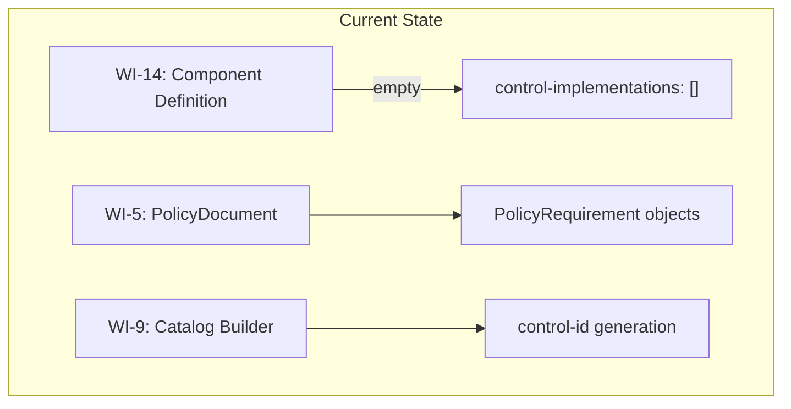
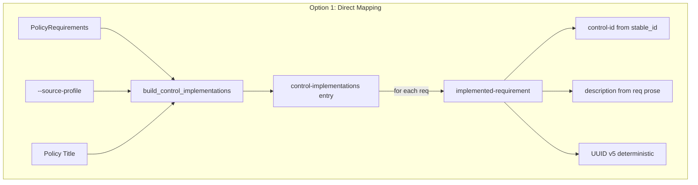
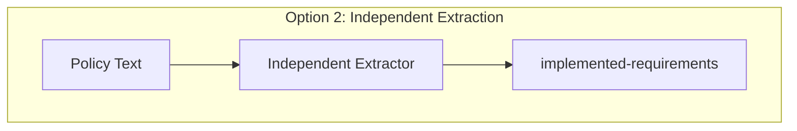
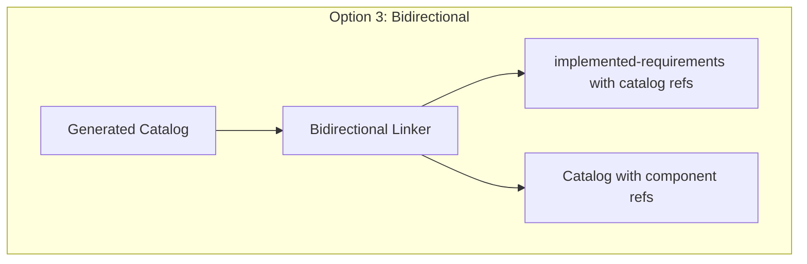
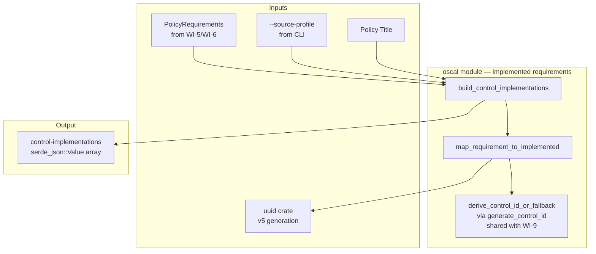
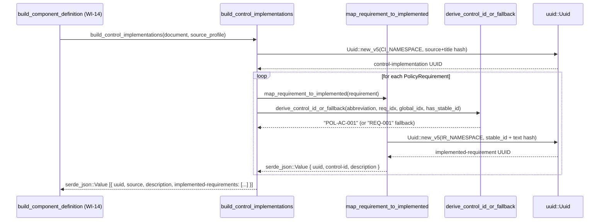

# 015-ar-component-implemented-requirements

> **Document Type:** Architecture Review
> **Audience:** LLM agents, human reviewers
> **Status:** Proposed
> **Last Updated:** 2026-02-10 <!-- @auto -->
> **Owner:** Brian Luby <!-- @human-required -->
> **Deciders:** Brian Luby <!-- @human-required -->

---

## Review Tier Legend

| Marker | Tier | Speckit Behavior |
|--------|------|------------------|
| 🔴 `@human-required` | Human Generated | Prompt human to author; blocks until complete |
| 🟡 `@human-review` | LLM + Human Review | LLM drafts → prompt human to confirm/edit; blocks until confirmed |
| 🟢 `@llm-autonomous` | LLM Autonomous | LLM completes; no prompt; logged for audit |
| ⚪ `@auto` | Auto-generated | System fills (timestamps, links); no prompt |

---

## Document Completion Order

> ⚠️ **For LLM Agents:** Complete sections in this order. Do not fill downstream sections until upstream human-required inputs exist.

1. **Summary (Decision)** → requires human input first
2. **Context (Problem Space)** → requires human input
3. **Decision Drivers** → requires human input (prioritized)
4. **Driving Requirements** → extract from PRD, human confirms
5. **Options Considered** → LLM drafts after drivers exist, human reviews
6. **Decision (Selected + Rationale)** → requires human decision
7. **Implementation Guardrails** → LLM drafts, human reviews
8. **Everything else** → can proceed after decision is made

---

## Linkage ⚪ `@auto`

| Document | ID | Relationship |
|----------|-----|--------------|
| Parent PRD | [015-prd-component-implemented-requirements](../PRD/015-prd-component-implemented-requirements.md) | Requirements this architecture satisfies |
| Parent PRD (top-level) | [FORGE_PRD](../FORGE_PRD.md) | Parent requirements M-4, M-8 |
| Related AR | [014-ar-component-definition-structure](014-ar-component-definition-structure.md) | Component Definition structure this extends |
| Related AR | [011-ar-oscal-metadata](011-ar-oscal-metadata.md) | Metadata pattern |
| Security Review | N/A | No new input processing beyond CLI flag |
| Supersedes | — | N/A (greenfield) |
| Superseded By | — | |

---

## Summary

### Decision 🔴 `@human-required`
> Use a direct mapping approach: a `build_control_implementations` function that walks the `PolicyDocument`'s section tree depth-first, maps each `PolicyRequirement` to an `implemented-requirement` entry with a deterministic UUID v5, a `control-id` derived from section-aware generation via `generate_control_id` (matching the Catalog builder's scheme, e.g., `POL-AC-001`), and a `description` containing the requirement prose as the implementation narrative. All implemented-requirements are grouped under a single `control-implementations` entry whose `source` references the `--source-profile` value.

### TL;DR for Agents 🟡 `@human-review`
> Implemented-requirements are generated by a `build_control_implementations` function that takes `&PolicyDocument` and the `--source-profile` value. It walks the document's section tree depth-first and produces a `serde_json::Value` array containing one `control-implementations` entry with: a deterministic UUID v5, the `source` profile reference, a `description` indicating the policy context, and an `implemented-requirements` array where each entry has a UUID v5, a `control-id` (generated via section-aware `generate_control_id`, matching the Catalog builder's scheme), and a `description` (the requirement prose). The output is injected into the Component Definition's documentary component from WI-14. Do NOT validate control-ids against the source profile (deferred to WI-19). Do NOT use `remarks` for implementation narratives — use `description`. Do NOT generate random UUIDs — all must be deterministic v5.

---

## Context

### Problem Space 🔴 `@human-required`
WI-14 produces a Component Definition with a documentary component shell (type, title, description) but an empty `control-implementations` array. Without populated `control-implementations` and `implemented-requirements`, the Component Definition has no connection to any control baseline — it cannot express which controls the policy addresses or what the implementation narrative is. This is the core value of the component-first strategy: each `PolicyRequirement` becomes an `implemented-requirement` that references a specific `control-id` from the baseline, carrying the requirement prose as the implementation narrative. The architectural question is how to map `PolicyRequirement`s to `implemented-requirement` entries: directly from the domain model, independently from a separate extraction pass, or with bidirectional linking to the Catalog pipeline.

### Decision Scope 🟡 `@human-review`

**This AR decides:**
- How `PolicyRequirement`s map to `implemented-requirement` entries
- How `control-id` values are derived for each requirement
- How `--source-profile` is wired into `control-implementations.source`
- How implementation narrative text is generated from requirement prose
- How UUIDs are generated for control-implementations and implemented-requirements

**This AR does NOT decide:**
- Component Definition structure (type, title, metadata) — handled by WI-14
- Traceability props/links within implemented-requirements — deferred to WI-17
- End-to-end `--strategy component` CLI wiring — deferred to WI-18
- Validation of control-ids against source profile — deferred to WI-19

### Current State 🟢 `@llm-autonomous`
WI-14 produces a Component Definition with an empty `control-implementations` array. The `PolicyDocument` domain model (WI-5) contains `PolicyRequirement` objects with stable IDs (from WI-7), text, and source location. The Catalog pipeline (WI-9/WI-10) uses control-id generation logic that this WI must be consistent with.



### Driving Requirements 🟡 `@human-review`

| PRD Req ID | Requirement Summary | Architectural Implication |
|------------|---------------------|---------------------------|
| M-1 | `control-implementations[]` array with at least one entry | Must produce at least one control-implementation object |
| M-2 | Deterministic UUID for each control-implementation | UUID v5 from source + content hash |
| M-3 | `source` field set to `--source-profile` value | CLI flag pass-through |
| M-4 | `description` field on control-implementation | Generated summary text |
| M-5 | `implemented-requirements[]` populated from PolicyRequirements | 1:1 mapping from requirements to implemented-requirements |
| M-6 | Deterministic UUID for each implemented-requirement | UUID v5 from requirement content |
| M-7 | `control-id` derived from requirement identifier | Reuse WI-9/WI-10 control-id scheme |
| M-8 | `description` with implementation narrative from prose | Requirement text as narrative |
| M-9 | `--source-profile` required for component strategy | CLI validation |

**PRD Constraints inherited:**
- From constitution: Rust latest stable, TDD mandatory, `thiserror` for errors
- From Parent PRD M-8: Deterministic UUIDs across re-conversions
- From Parent PRD M-11: No arbitrary data in `remarks`

---

## Decision Drivers 🔴 `@human-required`

1. **Completeness:** Every PolicyRequirement must map to an implemented-requirement *(traces to PRD M-5)*
2. **Consistency:** Control-ids must match the scheme used by the Catalog pipeline *(traces to PRD M-7)*
3. **Determinism:** All UUIDs must be stable across re-conversions *(traces to PRD M-6, Parent PRD M-8)*
4. **Auditability:** Implementation narrative must faithfully represent the source requirement *(traces to PRD M-8)*

---

## Options Considered 🟡 `@human-review`

### Option 0: Status Quo / Do Nothing

**Description:** Leave `control-implementations` empty as produced by WI-14. No implemented-requirements populated.

| Driver | Rating | Notes |
|--------|--------|-------|
| Completeness | ❌ Poor | No requirements mapped |
| Consistency | N/A | No control-ids generated |
| Determinism | N/A | No UUIDs to evaluate |
| Auditability | ❌ Poor | No narrative generated |

**Why not viable:** Without implemented-requirements, the Component Definition has no compliance value. Parent PRD M-4 and AC-4 require the complete Component Definition structure with control-level mappings.

---

### Option 1: Direct Mapping from PolicyRequirements (Recommended)

**Description:** A `build_control_implementations` function that takes the `PolicyRequirement` slice, source profile reference, and policy title. It iterates over requirements, generating one `implemented-requirement` per `PolicyRequirement`. The `control-id` is derived from the requirement's `stable_id` (the same ID scheme used by WI-9/WI-10 for Catalog controls). The `description` is the requirement prose text directly. All UUIDs are deterministic v5.



| Driver | Rating | Notes |
|--------|--------|-------|
| Completeness | ✅ Good | Every PolicyRequirement produces exactly one implemented-requirement |
| Consistency | ✅ Good | Reuses control-id scheme from WI-9/WI-10 |
| Determinism | ✅ Good | UUID v5 from requirement content + stable_id |
| Auditability | ✅ Good | Prose text used directly — faithful to source |

**Pros:**
- Simplest possible mapping: one requirement → one implemented-requirement
- Reuses existing control-id generation (shared utility with WI-9)
- Prose text used directly as narrative — no transformation, fully auditable
- Single function with clear input/output contract

**Cons:**
- Direct prose may not read like a polished implementation narrative (acceptable for MVP; users can edit output)
- No deduplication of identical requirements (handled by WI-6 atomization upstream)

---

### Option 2: Independent Extraction from Policy Text

**Description:** Re-extract requirements directly from policy text specifically for the Component Definition, independent of the domain model's `PolicyRequirement` objects. This would use a separate parsing pass optimized for component-style extraction.



| Driver | Rating | Notes |
|--------|--------|-------|
| Completeness | ⚠️ Medium | Re-extraction may find different requirements than WI-3/WI-4 |
| Consistency | ❌ Poor | Different extraction may produce different control-ids |
| Determinism | ⚠️ Medium | Depends on extraction stability |
| Auditability | ⚠️ Medium | Source text may differ from domain model |

**Pros:**
- Could optimize extraction for component-specific needs
- Independent of domain model changes

**Cons:**
- Duplicates extraction logic (WI-3/WI-4/WI-6 already extract and atomize requirements)
- May produce different requirement sets than the Catalog pipeline, causing confusion
- Violates DRY principle — extraction already done and tested
- Control-ids may diverge from Catalog control-ids, breaking cross-artifact consistency

---

### Option 3: Bidirectional Linking with Catalog Controls

**Description:** Build implemented-requirements by reading the already-generated Catalog's controls and creating bidirectional links: each implemented-requirement explicitly references its corresponding Catalog control UUID, and each Catalog control could be annotated with its Component Definition counterpart.



| Driver | Rating | Notes |
|--------|--------|-------|
| Completeness | ✅ Good | Every Catalog control → implemented-requirement |
| Consistency | ✅ Good | Control-ids inherently match (read from Catalog) |
| Determinism | ✅ Good | Derived from Catalog UUIDs |
| Auditability | ⚠️ Medium | Narrative derived from Catalog, not source text |

**Pros:**
- Perfect consistency between Catalog controls and Component implemented-requirements
- Bidirectional links enable rich traceability

**Cons:**
- Requires the Catalog to be generated first, creating a hard pipeline dependency
- Component Definition should be independently generatable from the same PolicyDocument
- Bidirectional linking adds significant complexity for cross-artifact reference management
- Over-engineers the relationship — implemented-requirements are about the policy-to-baseline mapping, not policy-to-catalog
- Violates YAGNI — bidirectional linking is a Phase 2/3 concern (traceability in WI-16/WI-17)

---

## Decision

### Selected Option 🔴 `@human-required`
> **Option 1: Direct Mapping from PolicyRequirements**

### Rationale 🔴 `@human-required`

Option 1 is the simplest approach that meets all requirements. The domain model already contains fully extracted, atomized `PolicyRequirement` objects with stable IDs. Mapping them 1:1 to `implemented-requirement` entries is straightforward, auditable, and deterministic. The control-id scheme is shared with the Catalog builder (WI-9/WI-10), ensuring cross-artifact consistency without requiring bidirectional linking. Option 2 duplicates extraction work already done. Option 3 creates unnecessary coupling to the Catalog pipeline and over-engineers the traceability model (WI-16/WI-17 handles that). The direct prose-as-narrative approach is faithful to the source and avoids introducing AI-generated paraphrasing or non-deterministic transformations.

#### Simplest Implementation Comparison 🟡 `@human-review`

| Aspect | Simplest Possible | Selected Option | Justification for Complexity |
|--------|-------------------|-----------------|------------------------------|
| Components | Hardcode a single implemented-requirement | Map all PolicyRequirements | PRD M-5 requires all requirements mapped |
| Dependencies | No CLI flag | `--source-profile` flag | PRD M-3/M-9 require source reference |
| Patterns | Direct assignment | Shared control-id utility | PRD M-7 requires consistent control-id scheme |

**Complexity justified by:** The selected option IS the simplest approach that maps all requirements. The only "extra" components are the shared control-id utility (required for consistency) and CLI flag handling (required by PRD M-9).

### Architecture Diagram 🟡 `@human-review`



---

## Technical Specification

### Component Overview 🟡 `@human-review`

| Component | Responsibility | Interface | Dependencies |
|-----------|---------------|-----------|--------------|
| `build_control_implementations` | Produce `control-implementations` JSON array | `fn(&PolicyDocument, &str) -> Result<Value, ForgeError>` | `map_requirement_to_implemented`, `generate_control_id`, `resolve_abbreviation`, `uuid` |
| `map_requirement_to_implemented` | Map a single PolicyRequirement to implemented-requirement JSON | `fn(&PolicyRequirement, &str, usize) -> Result<Value, ForgeError>` | `uuid` |
| `derive_control_id_or_fallback` | Generate control-id from section context, with fallback for missing stable_id | `fn(&str, usize, usize, bool) -> String` | `generate_control_id` (from catalog.rs) |

### Data Flow 🟢 `@llm-autonomous`



### Interface Definitions 🟡 `@human-review`

```rust
use serde_json::Value;

/// Build the control-implementations array for a Component Definition.
///
/// Produces a JSON array containing one control-implementations entry
/// with the source profile reference and all implemented-requirements
/// mapped from PolicyRequirements.
///
/// # Arguments
/// * `requirements` - PolicyRequirements from the domain model
/// * `source_profile` - Value of the --source-profile CLI flag
/// * `policy_title` - Title of the source policy document
///
/// # Errors
/// Returns `ForgeError` if UUID generation or mapping fails.
pub fn build_control_implementations(
    requirements: &[PolicyRequirement],
    source_profile: &str,
    policy_title: &str,
) -> Result<Value, ForgeError> {
    // Generate deterministic UUID v5 for the control-implementation entry
    let ci_uuid = generate_control_impl_uuid(source_profile, policy_title);

    // Map each requirement to an implemented-requirement
    let impl_reqs: Vec<Value> = requirements
        .iter()
        .map(|req| map_requirement_to_implemented(req))
        .collect::<Result<Vec<_>, _>>()?;

    let ci = serde_json::json!([{
        "uuid": ci_uuid.to_string(),
        "source": source_profile,
        "description": format!(
            "Implementation narratives derived from {}.",
            policy_title
        ),
        "implemented-requirements": impl_reqs
    }]);

    Ok(ci)
}

/// Map a single PolicyRequirement to an OSCAL implemented-requirement JSON entry.
///
/// # Arguments
/// * `requirement` - A single PolicyRequirement from the domain model
///
/// # Errors
/// Returns `ForgeError` if UUID generation fails.
pub fn map_requirement_to_implemented(
    requirement: &PolicyRequirement,
    control_id: &str,
    global_index: usize,
) -> Result<Value, ForgeError> {
    let stable_id = requirement.stable_id.as_deref().unwrap_or("");
    let ir_uuid = generate_impl_req_uuid(stable_id, &requirement.text, global_index);

    Ok(serde_json::json!({
        "uuid": ir_uuid.to_string(),
        "control-id": control_id,
        "description": requirement.text
    }))
}

/// Derive a control-id for a requirement, with fallback for missing stable_id.
///
/// Normal case: uses section-based generation via `generate_control_id`
/// (same function used by the Catalog builder in WI-9).
/// Fallback (EC-2): `REQ-{zero-padded global_index}` when stable_id is None.
fn derive_control_id_or_fallback(
    abbreviation: &str,
    req_index_in_section: usize,
    global_index: usize,
    has_stable_id: bool,
) -> String {
    if has_stable_id {
        generate_control_id(abbreviation, req_index_in_section, "POL")
    } else {
        format!("REQ-{:03}", global_index + 1)
    }
}

/// Generate a deterministic UUID v5 for a control-implementation entry.
fn generate_control_impl_uuid(source_profile: &str, policy_title: &str) -> Uuid {
    let content = format!("{}{}", source_profile, policy_title);
    Uuid::new_v5(&CONTROL_IMPL_NAMESPACE, content.as_bytes())
}

/// Generate a deterministic UUID v5 for an implemented-requirement entry.
fn generate_impl_req_uuid(requirement: &PolicyRequirement) -> Uuid {
    let content = format!("{}{}", requirement.stable_id, requirement.text);
    Uuid::new_v5(&IMPL_REQ_NAMESPACE, content.as_bytes())
}
```

### Key Algorithms/Patterns 🟡 `@human-review`

**Pattern:** 1:1 requirement-to-implemented-requirement mapping
```
1. For each PolicyRequirement in the domain model:
   a. Derive control-id from requirement.stable_id (shared utility)
   b. Generate UUID v5 from IMPL_REQ_NAMESPACE + stable_id + text
   c. Use requirement.text directly as the description (implementation narrative)
   d. Produce implemented-requirement JSON entry
2. All entries grouped under one control-implementations entry with source profile reference
```

**Pattern:** Shared control-id scheme
```
1. generate_control_id + resolve_abbreviation are used by both:
   a. Catalog builder (WI-9) — to set control.id
   b. This WI (via derive_control_id_or_fallback) — to set implemented-requirement.control-id
2. Shared functions ensure cross-artifact consistency:
   Catalog control "POL-AC-001" → Component implemented-requirement references "POL-AC-001"
```

**Pattern:** UUID v5 namespaces
```
CONTROL_IMPL_NAMESPACE — for control-implementation entry UUIDs
IMPL_REQ_NAMESPACE — for implemented-requirement entry UUIDs
Both are distinct from:
  - BACK_MATTER_NAMESPACE (WI-12)
  - COMPONENT_NAMESPACE (WI-14)
  - CONTROL_NAMESPACE (WI-9)
Prevents UUID collisions across different OSCAL element types.
```

---

## Constraints & Boundaries

### Technical Constraints 🟡 `@human-review`

**Inherited from PRD:**
- Rust latest stable, TDD mandatory
- `thiserror` for error types
- `serde_json` for JSON construction
- UUID v5 for deterministic identifiers (WI-7 pattern)
- `--source-profile` flag via clap 4.x

**Added by this Architecture:**
- Two new UUID v5 namespace constants: `CONTROL_IMPL_NAMESPACE`, `IMPL_REQ_NAMESPACE`
- Shared `generate_control_id` + `resolve_abbreviation` functions from `catalog.rs` (made `pub(crate)` for WI-15 access)
- Requirement prose used directly as `description` — no transformation

### Architectural Boundaries 🟡 `@human-review`

- **Owns:** `build_control_implementations`, `map_requirement_to_implemented`, UUID namespace constants, CLI validation for `--source-profile`
- **Shares:** `generate_control_id` + `resolve_abbreviation` with WI-9 (Catalog builder, via `pub(crate)` access)
- **Interfaces With:** `PolicyRequirement` from WI-5 domain model, Component Definition builder from WI-14, CLI from WI-1
- **Must Not Touch:** WI-14's component structure API (extend, don't modify), Catalog builder (WI-9), domain model (WI-5)

### Implementation Guardrails 🟡 `@human-review`

> ⚠️ **Critical for LLM Agents:**

- [x] **DO NOT** use random UUID v4 for implemented-requirement or control-implementation UUIDs — must be deterministic v5 *(from PRD M-2, M-6)*
- [x] **DO NOT** validate control-ids against the source profile — deferred to WI-19 *(from PRD W-2)*
- [x] **DO NOT** store the source profile content in `source` — it is an href reference, not embedded content *(OSCAL convention)*
- [x] **DO NOT** place implementation narrative in `remarks` — use `description` *(from Parent PRD M-11)*
- [x] **DO NOT** modify WI-14's component builder API — extend it by injecting control-implementations into the existing structure *(from PRD technical constraint)*
- [x] **MUST** require `--source-profile` when `--strategy component` is used — error if missing *(from PRD M-9)*
- [x] **MUST** use the same control-id scheme as the Catalog builder (WI-9/WI-10) *(from PRD M-7)*
- [x] **MUST** map every `PolicyRequirement` to an `implemented-requirement` — no silent drops *(from PRD M-5)*

---

## Consequences 🟡 `@human-review`

### Positive
- Every PolicyRequirement is faithfully represented as an implemented-requirement
- Control-ids are consistent between Catalog controls and Component implemented-requirements
- Deterministic UUIDs enable stable re-conversion and meaningful diffs
- Prose-based narrative is auditable — no AI-generated paraphrasing
- `--source-profile` requirement prevents structurally incomplete Component Definitions

### Negative
- Direct prose may not read like a polished implementation narrative (acceptable for MVP)
- No control-id validation against source profile (deferred to WI-19)
- Single control-implementations entry assumes one baseline per conversion (acceptable per A-5)

### Risks & Mitigations

| Risk | Likelihood | Impact | Mitigation |
|------|------------|--------|------------|
| Control-id scheme diverges between WI-9 and WI-15 | Med | Med | Both use `generate_control_id` + `resolve_abbreviation` from `catalog.rs`, ensuring identical control-ids |
| Implementation narrative (direct prose) is too raw for assessors | Low | Low | Users can edit output; refinement is a future enhancement |
| WI-14 structure changes before WI-15 integrates | Low | Med | WI-14 runs one sprint before WI-15; review output before starting |
| `--source-profile` path is invalid or unreachable | Low | Low | FORGE does not fetch profiles — it stores the reference; validation deferred |

---

## Implementation Guidance

### Suggested Implementation Order 🟢 `@llm-autonomous`
1. Define UUID v5 namespace constants (`CONTROL_IMPL_NAMESPACE`, `IMPL_REQ_NAMESPACE`)
2. Make `resolve_abbreviation` in `catalog.rs` `pub(crate)` so WI-15 can reuse section-aware control-id generation
3. Implement `map_requirement_to_implemented`
4. Implement `generate_impl_req_uuid` and `generate_control_impl_uuid`
5. Implement `build_control_implementations`
6. Wire `build_control_implementations` output into WI-14's `build_component_definition`
7. Add CLI validation: `--source-profile` required when `--strategy component`
8. Write unit tests for individual requirement mapping
9. Write unit tests for full control-implementations generation
10. Write unit tests for UUID determinism
11. Write unit test for missing `--source-profile` error

### Testing Strategy 🟢 `@llm-autonomous`

| Layer | Test Type | Coverage Target | Notes |
|-------|-----------|-----------------|-------|
| Unit | Single requirement mapping | 100% | Verify control-id, description, UUID |
| Unit | Multiple requirements mapping | 100% | Verify count, uniqueness of UUIDs |
| Unit | UUID determinism | 100% | Same input → same UUIDs across calls |
| Unit | UUID change on content change | 100% | Different text → different UUID |
| Unit | Source profile reference | 100% | `source` field matches `--source-profile` |
| Unit | Control-implementation description | 100% | Contains policy title |
| Unit | Zero requirements | Key paths | Empty implemented-requirements array, warning emitted |
| Unit | Empty requirement text | Key paths | Placeholder description |
| Unit | `--source-profile` validation | Error paths | Missing flag → descriptive error |
| Integration | Full Component Definition | Key paths | WI-14 + WI-15 produce complete JSON |

### Anti-patterns to Avoid 🟡 `@human-review`
- **Don't:** Generate random UUIDs for implemented-requirements
  - **Why:** Breaks determinism; Parent PRD M-8 requires stable identifiers across re-conversions
  - **Instead:** UUID v5 with dedicated namespace + content hash
- **Don't:** Store source profile content (JSON blob) in the `source` field
  - **Why:** OSCAL `source` is an href reference, not embedded content
  - **Instead:** Store the profile path/URI string as-is from `--source-profile`
- **Don't:** Paraphrase or transform requirement prose for the narrative
  - **Why:** Introduces non-determinism and may misrepresent the source requirement
  - **Instead:** Use the requirement text directly; users can refine the output
- **Don't:** Create a separate control-id generation function that differs from WI-9's
  - **Why:** Control-ids must match between Catalog controls and Component implemented-requirements
  - **Instead:** Reuse `generate_control_id` + `resolve_abbreviation` from `catalog.rs`

---

## Compliance & Cross-cutting Concerns

### Security Considerations 🟡 `@human-review`
- Authentication: N/A — local CLI tool
- Authorization: N/A
- Data handling: `--source-profile` is a user-provided path/URI string stored as-is; requirement text flows through to JSON output. Policy content may be sensitive.

### Observability 🟢 `@llm-autonomous`
- **Logging:** Warn on empty requirements list, warn on empty requirement text
- **Metrics:** N/A
- **Tracing:** N/A

### Error Handling Strategy 🟢 `@llm-autonomous`
```
Error Category → Handling Approach
├── --source-profile missing → CLI error with descriptive message, exit(1)
├── --source-profile empty string → CLI error with descriptive message
├── Zero PolicyRequirements → Warn, produce empty implemented-requirements array
├── Empty requirement text → Warn, use placeholder description
├── Empty stable_id → Warn, generate fallback control-id from index
└── UUID generation failure → Propagate as ForgeError (highly unlikely)
```

---

## Migration Plan (if applicable) 🟡 `@human-review`

N/A — greenfield implementation. No migration required.

### Rollback Plan 🔴 `@human-required`

N/A — greenfield component. The functions are self-contained and inject output into WI-14's structure. Removing them returns WI-14's empty `control-implementations` array — a clean rollback to the structural-only state.

---

## Open Questions 🟡 `@human-review`

No open questions for this work item.

---

## Changelog ⚪ `@auto`

| Version | Date | Author | Changes |
|---------|------|--------|---------|
| 0.1 | 2026-02-10 | LLM (Claude) | Initial proposal |

---

## Decision Record ⚪ `@auto`

| Date | Event | Details |
|------|-------|---------|
| 2026-02-10 | Proposed | Initial draft created from PRD 015 |

---

## Traceability Matrix 🟢 `@llm-autonomous`

| PRD Req ID | Decision Driver | Option Rating | Component | Notes |
|------------|-----------------|---------------|-----------|-------|
| M-1 | Completeness | Option 1: ✅ | `build_control_implementations` | Produces control-implementations array |
| M-2 | Determinism | Option 1: ✅ | `generate_control_impl_uuid` | UUID v5 with dedicated namespace |
| M-3 | Consistency | Option 1: ✅ | CLI flag → `source` field | Direct pass-through |
| M-4 | Auditability | Option 1: ✅ | Description field | Generated summary with policy title |
| M-5 | Completeness | Option 1: ✅ | `map_requirement_to_implemented` | 1:1 mapping, all requirements |
| M-6 | Determinism | Option 1: ✅ | `generate_impl_req_uuid` | UUID v5 with dedicated namespace |
| M-7 | Consistency | Option 1: ✅ | `derive_control_id_or_fallback` via `generate_control_id` | Shared control-id scheme with WI-9 |
| M-8 | Auditability | Option 1: ✅ | `requirement.text` → `description` | Direct prose as narrative |
| M-9 | Completeness | Option 1: ✅ | CLI validation | Error if `--source-profile` missing |

---

## Review Checklist 🟢 `@llm-autonomous`

Before marking as Accepted:
- [x] All PRD Must Have requirements appear in Driving Requirements
- [x] Option 0 (Status Quo) is documented
- [x] Simplest Implementation comparison is completed
- [x] Decision drivers are prioritized and addressed
- [x] At least 2 options were seriously considered
- [x] Constraints distinguish inherited vs. new
- [x] Component names are consistent across all diagrams and tables
- [x] Implementation guardrails reference specific PRD constraints
- [x] Rollback triggers and authority are defined (N/A — greenfield)
- [x] Security review is linked or N/A documented
- [x] No open questions blocking implementation
