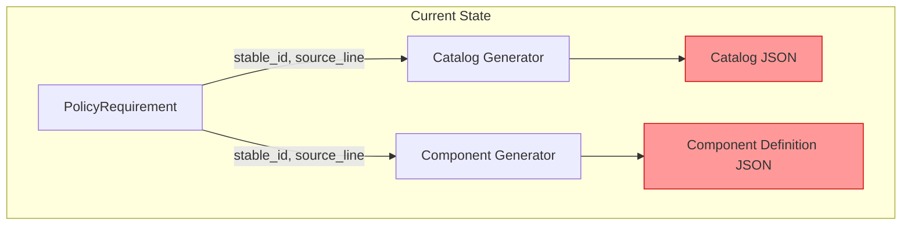
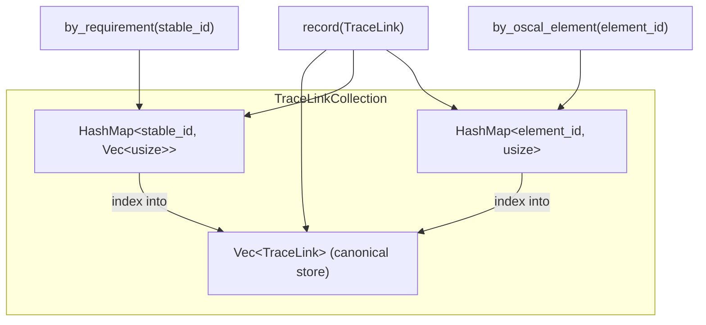
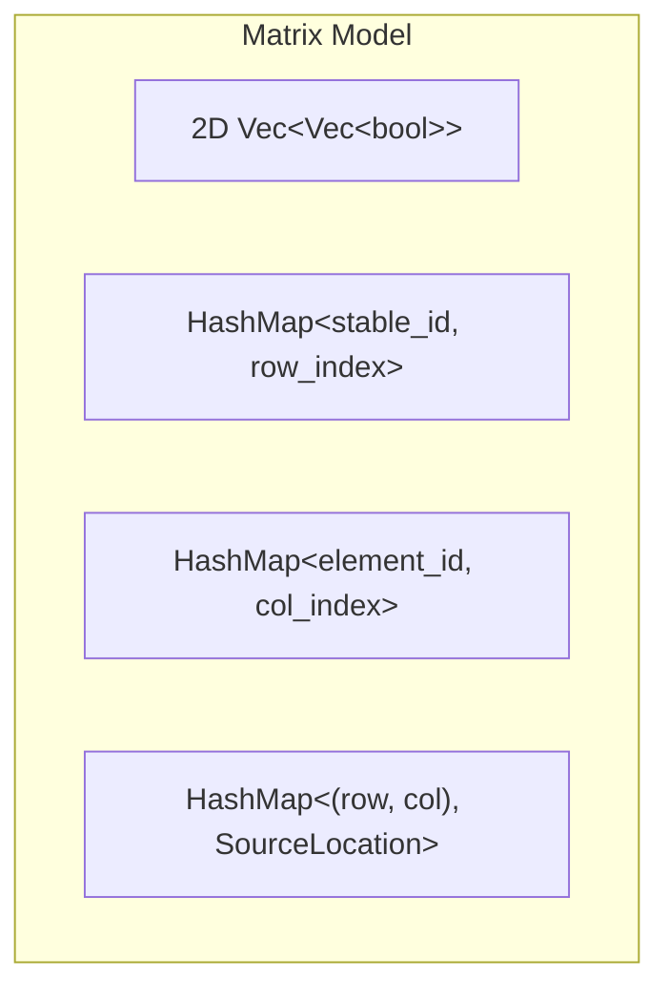
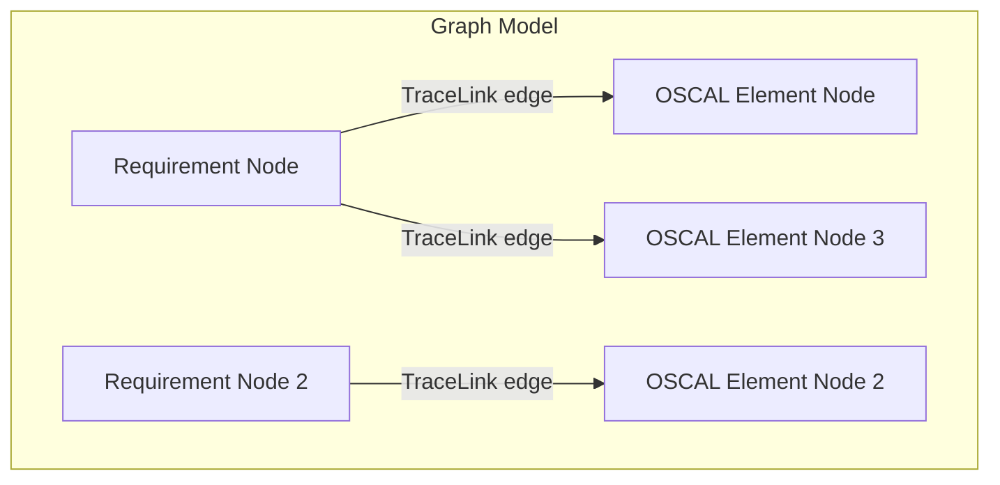
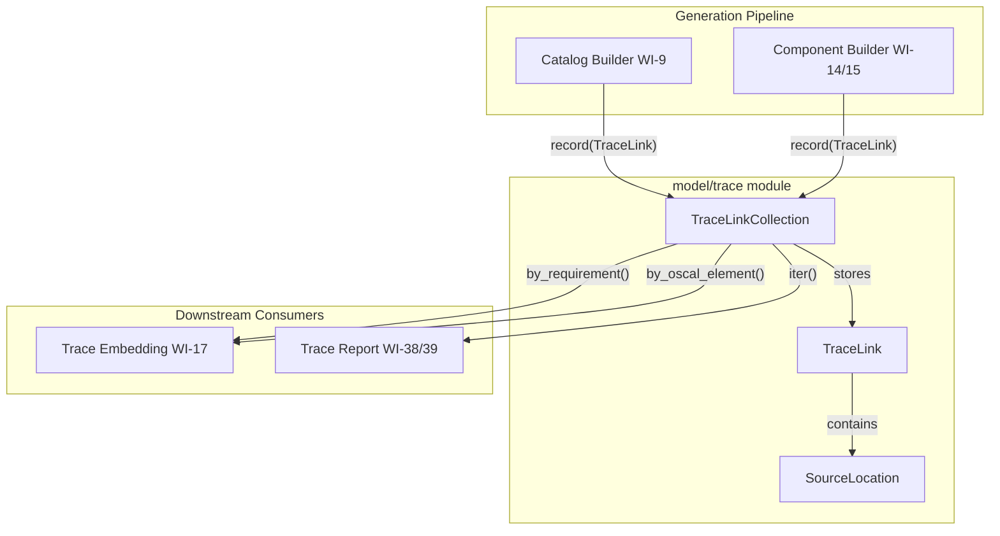
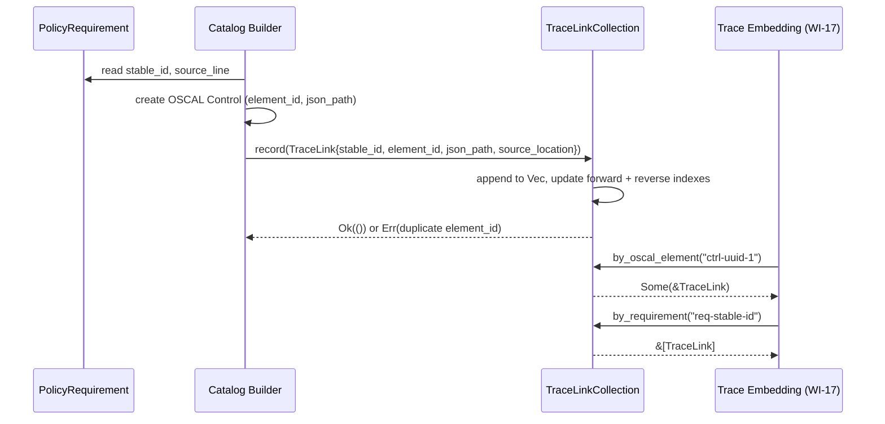
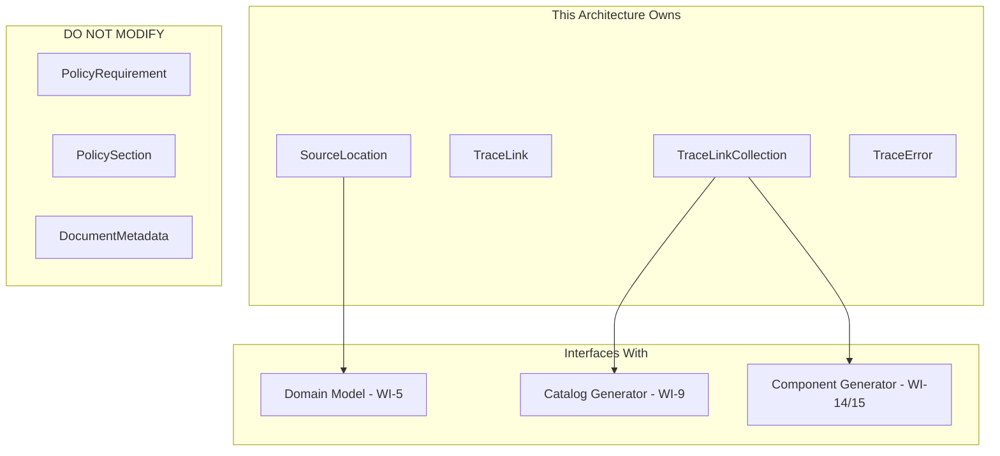

# 016-ar-traceability-model

> **Document Type:** Architecture Review
> **Audience:** LLM agents, human reviewers
> **Status:** Proposed
> **Last Updated:** 2026-02-10 <!-- @auto -->
> **Owner:** Brian Luby <!-- @human-required -->
> **Deciders:** Brian Luby <!-- @human-required -->

---

## Review Tier Legend

| Marker | Tier | Speckit Behavior |
|--------|------|------------------|
| 🔴 `@human-required` | Human Generated | Prompt human to author; blocks until complete |
| 🟡 `@human-review` | LLM + Human Review | LLM drafts → prompt human to confirm/edit; blocks until confirmed |
| 🟢 `@llm-autonomous` | LLM Autonomous | LLM completes; no prompt; logged for audit |
| ⚪ `@auto` | Auto-generated | System fills (timestamps, links); no prompt |

---

## Document Completion Order

> ⚠️ **For LLM Agents:** Complete sections in this order. Do not fill downstream sections until upstream human-required inputs exist.

1. **Summary (Decision)** → requires human input first
2. **Context (Problem Space)** → requires human input
3. **Decision Drivers** → requires human input (prioritized)
4. **Driving Requirements** → extract from PRD, human confirms
5. **Options Considered** → LLM drafts after drivers exist, human reviews
6. **Decision (Selected + Rationale)** → requires human decision
7. **Implementation Guardrails** → LLM drafts, human reviews
8. **Everything else** → can proceed after decision is made

---

## Linkage ⚪ `@auto`

| Document | ID | Relationship |
|----------|-----|--------------|
| Parent PRD | [016-prd-traceability-model](../PRD/016-prd-traceability-model.md) | Requirements this architecture satisfies |
| Security Review | N/A | Internal data model; no external attack surface |
| Supersedes | — | N/A (greenfield) |
| Superseded By | — | |

---

## Summary

### Decision 🔴 `@human-required`
> Use a `Vec<TraceLink>`-backed `TraceLinkCollection` with dual `HashMap` indexes for O(1) bidirectional lookup between source policy requirements and generated OSCAL elements, implemented as an adjacency list model in the `model` module.

### TL;DR for Agents 🟡 `@human-review`
> FORGE traces every generated OSCAL element back to its source policy location using a `TraceLink` struct that pairs a `requirement_stable_id` + `SourceLocation` with an `oscal_element_id` + `oscal_json_path`. The `TraceLinkCollection` stores links in an append-only `Vec` with two `HashMap` indexes: forward (requirement → links) and reverse (OSCAL element → link). Do NOT use a graph database or external crate. Do NOT make TraceLinks mutable after creation. The collection must be independent of OSCAL serialization format.

---

## Context

### Problem Space 🔴 `@human-required`
The Catalog generation pipeline (WI-9) and Component Definition pipeline (WI-14/WI-15) produce OSCAL JSON artifacts from parsed policy documents, but no mechanism exists to record which source policy requirement produced which OSCAL element. Without explicit trace links, it is impossible to answer "Where did this control come from?" or "What OSCAL elements were generated from this requirement?" This violates product principle P-2 (traceability is non-negotiable) and parent PRD requirement M-10. The TraceLink model must provide structured, bidirectional mapping captured at generation time.

### Decision Scope 🟡 `@human-review`

**This AR decides:**
- Data structure design for `TraceLink`, `SourceLocation`, and `TraceLinkCollection`
- Indexing strategy for bidirectional lookup (forward and reverse)
- Collection API design (record, lookup, iteration)
- Module placement within the codebase

**This AR does NOT decide:**
- How trace links are embedded in OSCAL artifacts as props/links — deferred to 017-ar-traceability-embedding
- Schema validation of artifacts with trace metadata — deferred to 019-ar-schema-validation
- Traceability report CLI output format — deferred to WI-38/WI-39
- Persistence format for TraceLinkCollection — deferred to future work

### Current State 🟢 `@llm-autonomous`
The Catalog builder (WI-9) and Component Definition builder (WI-14/WI-15) produce OSCAL elements from `PolicyRequirement` structs that carry `source_line` and `stable_id` fields. The domain model (WI-5) provides `PolicyRequirement.source_line`, parent `PolicySection.title`, and `DocumentMetadata.source_path`. No traceability infrastructure exists yet.



No trace links are captured; source provenance is lost after generation.

### Driving Requirements 🟡 `@human-review`

| PRD Req ID | Requirement Summary | Architectural Implication |
|------------|---------------------|---------------------------|
| M-1 | Define `TraceLink` struct with requirement_stable_id, oscal_json_path, oscal_element_id, source_location | Core data structure must be defined |
| M-2 | Define `SourceLocation` struct with file path, section title, line number | Nested struct for source provenance |
| M-3 | Define `TraceLinkCollection` with bidirectional lookup | Container with dual indexes |
| M-4 | Forward lookup: requirement_stable_id → TraceLinks | One-to-many forward index |
| M-5 | Reverse lookup: oscal_element_id → TraceLink | One-to-one reverse index |
| M-6 | Capture trace links during Catalog generation | Integration point with WI-9 |
| M-7 | Capture trace links during Component Definition generation | Integration point with WI-14/WI-15 |
| M-8 | SourceLocation populated from domain model fields | Data flow from PolicyRequirement |

**PRD Constraints inherited:**
- From constitution: Rust latest stable, TDD mandatory, thiserror for errors
- From constitution principle X: Simplicity & Pragmatism — YAGNI
- From PRD: No external crates needed; use std::collections, serde, std::path::PathBuf

---

## Decision Drivers 🔴 `@human-required`

1. **Lookup Performance:** Bidirectional lookups must be O(1) amortized to support large policy documents with hundreds of requirements *(traces to PRD M-4, M-5)*
2. **Simplicity:** Data model should be minimal and use standard library types; no external graph or database dependencies *(constitution principle X)*
3. **Correctness:** Every OSCAL element must have exactly one trace link; no orphans or duplicates *(traces to PRD M-3, product principle P-2)*
4. **Extensibility:** The model must support both Catalog and Component Definition generation and future OSCAL model types *(traces to PRD M-6, M-7)*

---

## Options Considered 🟡 `@human-review`

### Option 0: Status Quo / Do Nothing

**Description:** No traceability infrastructure. Generated OSCAL artifacts contain no provenance metadata. Source-to-OSCAL mapping is lost after generation.

| Driver | Rating | Notes |
|--------|--------|-------|
| Lookup Performance | N/A | No lookups possible |
| Simplicity | ✅ Good | Nothing to implement |
| Correctness | ❌ Poor | Violates P-2 and M-10 — no traceability at all |
| Extensibility | ❌ Poor | No foundation to build embedding or reporting on |

**Why not viable:** Parent PRD M-10 requires traceability from every generated OSCAL element back to its source. Product principle P-2 makes this non-negotiable. WI-17 (embedding) and WI-38/39 (trace reports) are blocked without this model.

---

### Option 1: Adjacency List with Dual HashMap Indexes (Recommended)

**Description:** Store `TraceLink` instances in an append-only `Vec<TraceLink>`. Maintain two `HashMap` indexes: a forward index mapping `requirement_stable_id → Vec<usize>` (one-to-many) and a reverse index mapping `oscal_element_id → usize` (one-to-one). Lookups use index values into the canonical Vec.



| Driver | Rating | Notes |
|--------|--------|-------|
| Lookup Performance | ✅ Good | O(1) amortized for both forward and reverse lookups via HashMap |
| Simplicity | ✅ Good | Standard library only (Vec + HashMap); no external crates |
| Correctness | ✅ Good | Reverse index enforces one-to-one constraint; record() returns error on duplicate element_id |
| Extensibility | ✅ Good | Vec stores all links uniformly regardless of OSCAL model type |

**Pros:**
- O(1) amortized bidirectional lookup
- Standard library only — zero new dependencies
- Append-only Vec provides insertion-order iteration for reporting
- Reverse index uniqueness constraint catches generation bugs early
- Simple API: `record()`, `by_requirement()`, `by_oscal_element()`, `iter()`, `len()`

**Cons:**
- Memory overhead from two indexes (acceptable for expected scale of hundreds to low thousands of trace links)
- Index-based indirection requires careful implementation to avoid stale indices (mitigated by append-only Vec)

---

### Option 2: Matrix Model (Dense Adjacency Matrix)

**Description:** Store a 2D matrix where rows are requirement stable IDs and columns are OSCAL element IDs. A cell value of `true` indicates a trace link exists. SourceLocation data stored in a separate lookup table.



| Driver | Rating | Notes |
|--------|--------|-------|
| Lookup Performance | ✅ Good | O(1) cell lookup after index resolution |
| Simplicity | ❌ Poor | Complex implementation with three data structures plus a separate SourceLocation map |
| Correctness | ⚠️ Medium | Does not naturally enforce one-to-one reverse constraint without additional logic |
| Extensibility | ⚠️ Medium | Matrix grows quadratically in worst case; sparse in practice |

**Pros:**
- Fast cell-level lookup for "does this requirement map to this element?"
- Could support many-to-many if future needs arise

**Cons:**
- Quadratic memory growth in worst case (N requirements x M elements)
- Most cells empty — sparse matrix is wasteful
- SourceLocation stored separately from the relationship — data model fragmentation
- Over-engineered for a fundamentally one-to-many (forward) / one-to-one (reverse) relationship

---

### Option 3: Graph Database (petgraph)

**Description:** Use the `petgraph` crate to model requirements and OSCAL elements as nodes with trace links as edges. SourceLocation attached as edge weight.



| Driver | Rating | Notes |
|--------|--------|-------|
| Lookup Performance | ⚠️ Medium | Graph traversal is O(degree) for neighbor lookup; less efficient than HashMap for simple bidirectional queries |
| Simplicity | ❌ Poor | External dependency (petgraph); graph semantics are overkill for simple mapping |
| Correctness | ✅ Good | Rich graph API can enforce constraints via custom validation |
| Extensibility | ✅ Good | Supports complex relationships if future traceability needs expand |

**Pros:**
- Rich graph operations (transitive closure, path finding) for future traceability features
- Well-maintained crate with MIT/Apache-2.0 license

**Cons:**
- External dependency for a simple bidirectional mapping — violates YAGNI (constitution principle X)
- Graph traversal overhead for basic lookups that HashMap handles in O(1)
- API complexity far exceeds the requirements
- Adds ~50KB to dependency tree for functionality that isn't needed

---

## Decision

### Selected Option 🔴 `@human-required`
> **Option 1: Adjacency List with Dual HashMap Indexes**

### Rationale 🔴 `@human-required`
Option 1 is the simplest approach that meets all requirements. The relationship being modeled is straightforward: one-to-many from requirements to OSCAL elements (forward) and one-to-one from OSCAL elements to requirements (reverse). A `Vec` + dual `HashMap` handles both directions in O(1) amortized time with zero external dependencies. The matrix model (Option 2) adds unnecessary complexity for a sparse relationship, and the graph model (Option 3) adds an external dependency for functionality that is not needed. Constitution principle X (YAGNI) and the PRD's technical constraint of "no new external crates required" both favor Option 1.

#### Simplest Implementation Comparison 🟡 `@human-review`

| Aspect | Simplest Possible | Selected Option | Justification for Complexity |
|--------|-------------------|-----------------|------------------------------|
| Components | Single Vec of TraceLinks with linear scan | Vec + 2 HashMaps | PRD M-4, M-5 require O(1) bidirectional lookup; linear scan is O(n) |
| Dependencies | std only | std only (HashMap, Vec) | No additional complexity — all std types |
| Patterns | Flat list | Indexed collection with record API | PRD M-3 requires a structured container; M-6/M-7 require integration hooks |

**Complexity justified by:** The dual-index pattern is the minimal structure needed to satisfy both O(1) forward lookup (PRD M-4) and O(1) reverse lookup (PRD M-5) while enforcing the one-to-one reverse constraint that catches generation bugs.

### Architecture Diagram 🟡 `@human-review`



---

## Technical Specification

### Component Overview 🟡 `@human-review`

| Component | Responsibility | Interface | Dependencies |
|-----------|---------------|-----------|--------------|
| SourceLocation | Captures file path, section title, and line number of a policy requirement | Struct with Debug, Clone, Serialize, Deserialize | std::path::PathBuf |
| TraceLink | Maps a requirement stable_id to an OSCAL element with source location | Struct with Debug, Clone, Serialize, Deserialize | SourceLocation |
| TraceLinkCollection | Aggregates TraceLinks with dual-index bidirectional lookup | record(), by_requirement(), by_oscal_element(), iter(), len(), is_empty() | HashMap, Vec, TraceLink |
| TraceError | Error types for traceability operations | thiserror enum | thiserror |

### Data Flow 🟢 `@llm-autonomous`



### Interface Definitions 🟡 `@human-review`

```rust
use std::collections::HashMap;
use std::path::PathBuf;
use serde::{Serialize, Deserialize};

/// Source location in the original policy document.
#[derive(Debug, Clone, Serialize, Deserialize, PartialEq, Eq)]
pub struct SourceLocation {
    /// Path to the source policy file.
    pub file_path: PathBuf,
    /// Title of the section containing this requirement.
    pub section_title: String,
    /// 1-based line number in the source file.
    pub line_number: usize,
}

/// A single trace link mapping a policy requirement to an OSCAL element.
#[derive(Debug, Clone, Serialize, Deserialize)]
pub struct TraceLink {
    /// Deterministic stable ID of the source PolicyRequirement (from WI-7).
    pub requirement_stable_id: String,
    /// Logical path to the OSCAL element in the generated artifact.
    pub oscal_json_path: String,
    /// UUID or identifier of the target OSCAL element.
    pub oscal_element_id: String,
    /// Source location in the original policy document.
    pub source_location: SourceLocation,
}

/// Errors from traceability operations.
#[derive(Debug, thiserror::Error)]
pub enum TraceError {
    #[error("Duplicate OSCAL element ID: {element_id} already recorded")]
    DuplicateElement { element_id: String },
}

/// Collection of trace links with bidirectional lookup indexes.
#[derive(Debug, Default)]
pub struct TraceLinkCollection {
    links: Vec<TraceLink>,
    by_requirement: HashMap<String, Vec<usize>>,
    by_oscal_element: HashMap<String, usize>,
}

impl TraceLinkCollection {
    pub fn new() -> Self { Self::default() }

    /// Record a new trace link. Returns error if oscal_element_id is duplicate.
    pub fn record(&mut self, link: TraceLink) -> Result<(), TraceError>;

    /// Forward lookup: requirement_stable_id -> all TraceLinks.
    pub fn by_requirement(&self, stable_id: &str) -> &[TraceLink];

    /// Reverse lookup: oscal_element_id -> TraceLink.
    pub fn by_oscal_element(&self, element_id: &str) -> Option<&TraceLink>;

    /// Iterate over all trace links in insertion order.
    pub fn iter(&self) -> impl Iterator<Item = &TraceLink>;

    /// Return the number of trace links.
    pub fn len(&self) -> usize;

    /// Return true if no trace links have been recorded.
    pub fn is_empty(&self) -> bool;
}
```

### Key Algorithms/Patterns 🟡 `@human-review`

**Pattern:** Append-only indexed collection with dual HashMap indexes

```
record(link):
1. Check by_oscal_element for duplicate element_id → Err if exists
2. Append link to Vec, get index
3. Insert into by_requirement: stable_id → push index to Vec<usize>
4. Insert into by_oscal_element: element_id → index
5. Return Ok(())

by_requirement(stable_id):
1. Look up Vec<usize> in forward index
2. Map indices to &TraceLink references in Vec
3. Return slice (empty if not found)

by_oscal_element(element_id):
1. Look up usize in reverse index
2. Return Some(&links[index]) or None
```

---

## Constraints & Boundaries

### Technical Constraints 🟡 `@human-review`

**Inherited from PRD:**
- Rust latest stable toolchain
- serde derives for Serialize, Deserialize, Debug, Clone
- thiserror for error types
- TDD mandatory (constitution principle IV)
- No new external crates beyond serde and thiserror (already in project)

**Added by this Architecture:**
- TraceLinkCollection is append-only during generation, read-only afterward
- TraceLink instances are immutable after creation
- oscal_element_id must be unique across the entire collection (one-to-one reverse mapping)
- oscal_json_path is a logical path format, not tied to JSON/XML/YAML serialization
- Module placement: `src/model/trace.rs` (or `src/model/trace/mod.rs` if module grows)

### Architectural Boundaries 🟡 `@human-review`



- **Owns:** SourceLocation, TraceLink, TraceLinkCollection, TraceError
- **Interfaces With:** Domain model (reads PolicyRequirement fields), Catalog builder (accepts &mut TraceLinkCollection), Component builder (accepts &mut TraceLinkCollection)
- **Must Not Touch:** PolicyRequirement struct definition, OSCAL serialization types, CLI argument parsing

### Implementation Guardrails 🟡 `@human-review`

> ⚠️ **Critical for LLM Agents:**

- [x] **DO NOT** use an external graph library (petgraph or similar) — standard library HashMap/Vec only *(YAGNI, PRD technical constraint)*
- [x] **DO NOT** make TraceLink instances mutable after creation — append-only semantics *(PRD immutability constraint)*
- [x] **DO NOT** couple TraceLinkCollection to a specific OSCAL output format — keep oscal_json_path as a logical path *(PRD compatibility constraint)*
- [x] **DO NOT** use linear scans for lookups — use HashMap indexes *(PRD M-4, M-5 require O(1) lookup)*
- [x] **MUST** return an error from `record()` if oscal_element_id is already present *(one-to-one reverse constraint, PRD M-5)*
- [x] **MUST** implement Debug, Clone, Serialize, Deserialize on TraceLink and SourceLocation *(PRD S-1)*
- [x] **MUST** populate SourceLocation from PolicyRequirement.source_line, PolicySection.title, and DocumentMetadata.source_path *(PRD M-8)*

---

## Consequences 🟡 `@human-review`

### Positive
- Complete bidirectional traceability from every OSCAL element to its source policy location
- O(1) lookup performance enables use in large-document scenarios
- Independent data model allows WI-17 to embed and WI-38/39 to report without tight coupling
- Zero new dependencies — standard library only

### Negative
- Memory overhead from two HashMap indexes (negligible for expected scale)
- Index-based indirection adds implementation complexity vs. a flat Vec (minimal)

### Risks & Mitigations

| Risk | Likelihood | Impact | Mitigation |
|------|------------|--------|------------|
| Stale indexes if Vec is mutated | N/A | N/A | Vec is append-only; indexes are only added, never removed |
| Large policy documents exceed HashMap capacity | Very Low | Low | HashMap auto-resizes; 10,000+ trace links are still trivial for HashMap |
| oscal_json_path format ambiguity | Low | Low | Document the path format convention; WI-17 validates paths before embedding |

---

## Implementation Guidance

### Suggested Implementation Order 🟢 `@llm-autonomous`
1. Define `SourceLocation` struct with derives and field documentation
2. Define `TraceLink` struct with derives and field documentation
3. Define `TraceError` enum with thiserror
4. Implement `TraceLinkCollection` with `new()`, `record()`, `by_requirement()`, `by_oscal_element()`
5. Add `iter()`, `len()`, `is_empty()` convenience methods
6. Write unit tests for all operations including edge cases (duplicate element_id, missing lookups)
7. Integrate with Catalog builder (WI-9) to emit TraceLinks during control creation
8. Integrate with Component builder (WI-14/WI-15) to emit TraceLinks during implemented-requirement creation

### Testing Strategy 🟢 `@llm-autonomous`

| Layer | Test Type | Coverage Target | Notes |
|-------|-----------|-----------------|-------|
| Unit | SourceLocation construction | 100% | All fields stored correctly |
| Unit | TraceLink construction | 100% | All fields stored correctly |
| Unit | TraceLinkCollection.record() | 90% | Happy path + duplicate element_id error |
| Unit | by_requirement() forward lookup | 90% | Found, not found, multiple results |
| Unit | by_oscal_element() reverse lookup | 90% | Found, not found |
| Unit | iter(), len(), is_empty() | 100% | Empty and populated collections |
| Integration | Catalog generation trace capture | Key paths | Verify TraceLinks match generated controls |
| Integration | Component generation trace capture | Key paths | Verify TraceLinks match implemented-requirements |

### Anti-patterns to Avoid 🟡 `@human-review`
- **Don't:** Store trace links only in the OSCAL output structure
  - **Why:** TraceLinkCollection must exist independently for WI-17 to query during embedding
  - **Instead:** Keep TraceLinkCollection as a separate data structure passed alongside the OSCAL artifact
- **Don't:** Defer source location capture to a post-processing step
  - **Why:** Source location context (section title, line number) is only available at generation time
  - **Instead:** Record TraceLinks during element creation in the Catalog/Component builders
- **Don't:** Use String for SourceLocation.line_number
  - **Why:** Line numbers are numeric; using strings invites parsing bugs
  - **Instead:** Use `usize` for the 1-based line number

---

## Compliance & Cross-cutting Concerns

### Security Considerations 🟡 `@human-review`
- Authentication: N/A — local CLI tool
- Authorization: N/A
- Data handling: TraceLinks contain file paths and section titles which may reveal organizational structure. No additional exposure beyond what users provide on the command line.

### Observability 🟢 `@llm-autonomous`
- **Logging:** Log trace link count at INFO level after generation completes
- **Metrics:** TraceLinkCollection.len() provides generation coverage metric
- **Tracing:** Not yet needed for data model; add tracing spans when integrating with pipeline

### Error Handling Strategy 🟢 `@llm-autonomous`
```
Error Category → Handling Approach
├── Duplicate element_id → Return TraceError::DuplicateElement (generation bug indicator)
├── Missing forward lookup → Return empty slice (normal — not all requirements may generate OSCAL)
├── Missing reverse lookup → Return None (normal — not all elements may be queried)
└── SourceLocation with missing data → Use empty string for section_title (edge case EC-4)
```

---

## Migration Plan (if applicable) 🟡 `@human-review`

N/A — greenfield implementation. No existing traceability infrastructure to migrate from.

### Rollback Plan 🔴 `@human-required`

N/A — greenfield data model. If the structure proves inadequate, it is refactored in a subsequent sprint. The TraceLinkCollection is an internal data structure with no persistence or external API, so changes are low-cost.

---

## Open Questions 🟡 `@human-review`

No open questions blocking implementation. PRD open questions OQ-1 (JSON Pointer vs dot-notation) and OQ-2 (sidecar persistence) are non-blocking design preferences that can be resolved during implementation.

---

## Changelog ⚪ `@auto`

| Version | Date | Author | Changes |
|---------|------|--------|---------|
| 0.1 | 2026-02-10 | LLM (Claude) | Initial proposal |

---

## Decision Record ⚪ `@auto`

| Date | Event | Details |
|------|-------|---------|
| 2026-02-10 | Proposed | Initial draft created from PRD 016 |

---

## Traceability Matrix 🟢 `@llm-autonomous`

| PRD Req ID | Decision Driver | Option Rating | Component | Notes |
|------------|-----------------|---------------|-----------|-------|
| M-1 | Simplicity | Option 1: ✅ | TraceLink struct | All four fields defined |
| M-2 | Simplicity | Option 1: ✅ | SourceLocation struct | file_path, section_title, line_number |
| M-3 | Correctness | Option 1: ✅ | TraceLinkCollection | Dual-index container with bidirectional lookup |
| M-4 | Lookup Performance | Option 1: ✅ | TraceLinkCollection.by_requirement() | O(1) forward lookup via HashMap |
| M-5 | Lookup Performance | Option 1: ✅ | TraceLinkCollection.by_oscal_element() | O(1) reverse lookup via HashMap |
| M-6 | Extensibility | Option 1: ✅ | TraceLinkCollection.record() | Catalog builder calls record() per control |
| M-7 | Extensibility | Option 1: ✅ | TraceLinkCollection.record() | Component builder calls record() per impl-req |
| M-8 | Correctness | Option 1: ✅ | SourceLocation | Populated from domain model fields |
| S-1 | Simplicity | Option 1: ✅ | TraceLink, SourceLocation | Debug, Clone, Serialize, Deserialize derives |
| S-2 | Extensibility | Option 1: ✅ | TraceLinkCollection.iter() | Insertion-order iteration |
| S-3 | Simplicity | Option 1: ✅ | TraceLinkCollection | len() and is_empty() methods |

---

## Review Checklist 🟢 `@llm-autonomous`

Before marking as Accepted:
- [x] All PRD Must Have requirements appear in Driving Requirements
- [x] Option 0 (Status Quo) is documented
- [x] Simplest Implementation comparison is completed
- [x] Decision drivers are prioritized and addressed
- [x] At least 2 options were seriously considered
- [x] Constraints distinguish inherited vs. new
- [x] Component names are consistent across all diagrams and tables
- [x] Implementation guardrails reference specific PRD constraints
- [x] Rollback triggers and authority are defined (N/A — greenfield)
- [x] Security review is linked or N/A documented
- [x] No open questions blocking implementation
