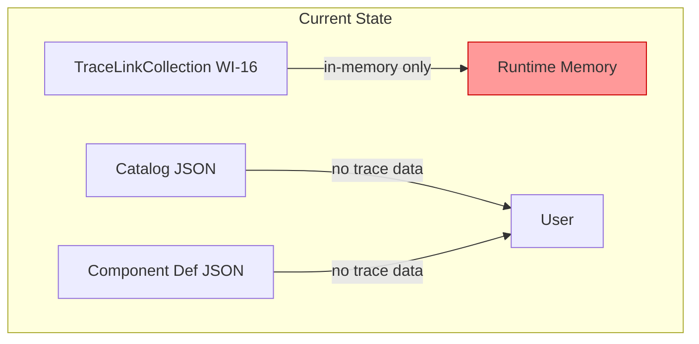
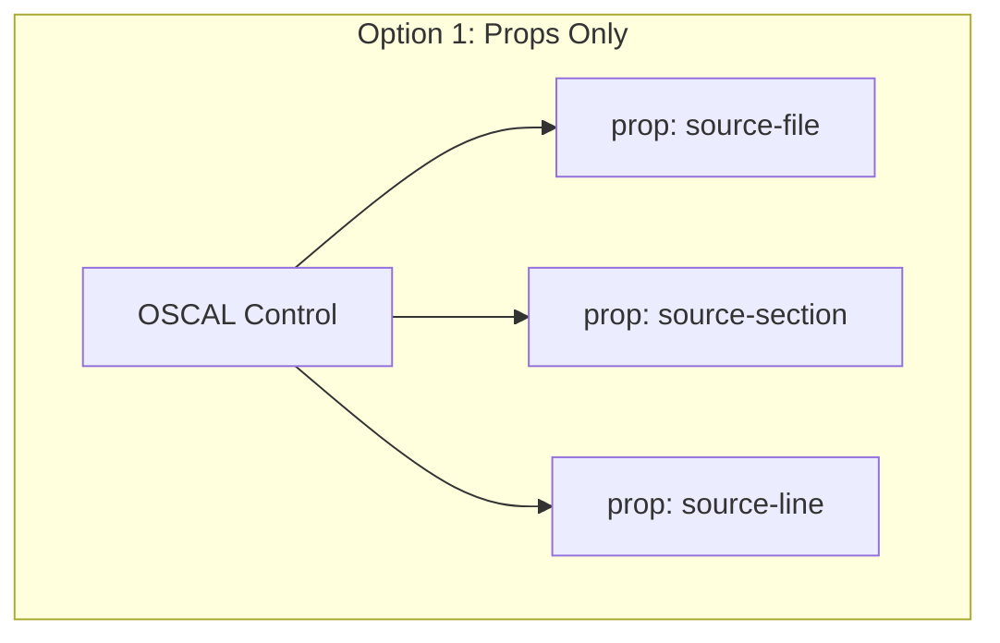
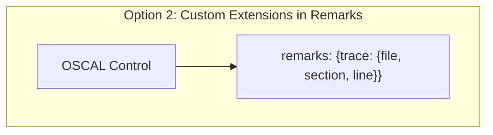
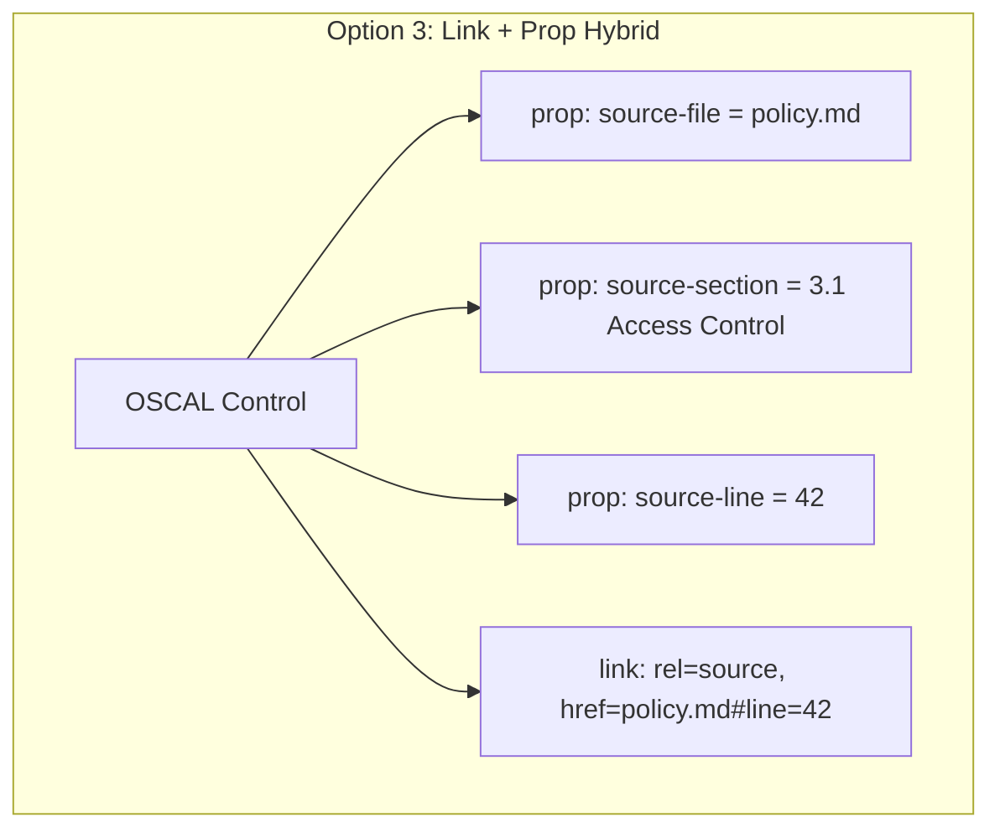
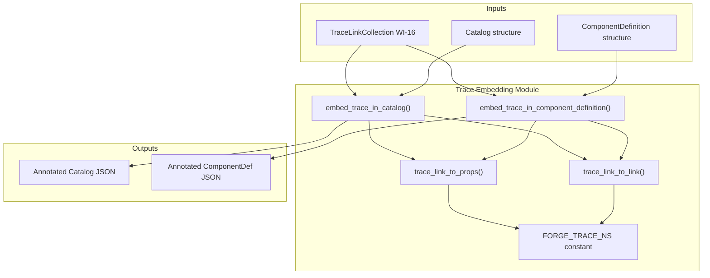
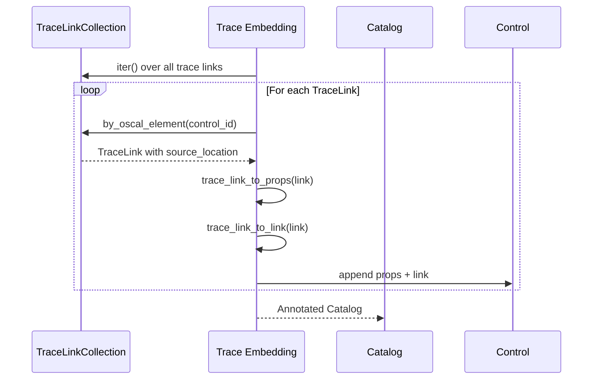
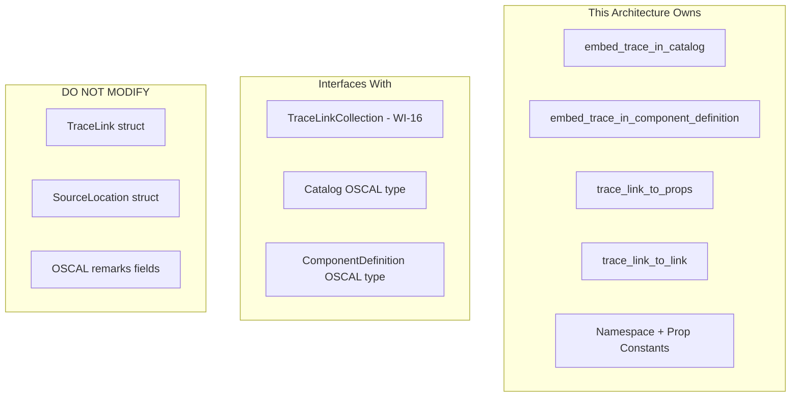

# 017-ar-traceability-embedding

> **Document Type:** Architecture Review
> **Audience:** LLM agents, human reviewers
> **Status:** Proposed
> **Last Updated:** 2026-02-10 <!-- @auto -->
> **Owner:** Brian Luby <!-- @human-required -->
> **Deciders:** Brian Luby <!-- @human-required -->

---

## Review Tier Legend

| Marker | Tier | Speckit Behavior |
|--------|------|------------------|
| 🔴 `@human-required` | Human Generated | Prompt human to author; blocks until complete |
| 🟡 `@human-review` | LLM + Human Review | LLM drafts → prompt human to confirm/edit; blocks until confirmed |
| 🟢 `@llm-autonomous` | LLM Autonomous | LLM completes; no prompt; logged for audit |
| ⚪ `@auto` | Auto-generated | System fills (timestamps, links); no prompt |

---

## Document Completion Order

> ⚠️ **For LLM Agents:** Complete sections in this order. Do not fill downstream sections until upstream human-required inputs exist.

1. **Summary (Decision)** → requires human input first
2. **Context (Problem Space)** → requires human input
3. **Decision Drivers** → requires human input (prioritized)
4. **Driving Requirements** → extract from PRD, human confirms
5. **Options Considered** → LLM drafts after drivers exist, human reviews
6. **Decision (Selected + Rationale)** → requires human decision
7. **Implementation Guardrails** → LLM drafts, human reviews
8. **Everything else** → can proceed after decision is made

---

## Linkage ⚪ `@auto`

| Document | ID | Relationship |
|----------|-----|--------------|
| Parent PRD | [017-prd-traceability-embedding](../PRD/017-prd-traceability-embedding.md) | Requirements this architecture satisfies |
| Security Review | N/A | Low-risk data annotation; no external attack surface |
| Supersedes | — | N/A (greenfield) |
| Superseded By | — | |

---

## Summary

### Decision 🔴 `@human-required`
> Use a hybrid approach combining `prop` elements and `link` elements to embed trace metadata directly into generated OSCAL artifacts. Three namespaced props (`source-file`, `source-section`, `source-line`) plus one link (`rel: "source"`) are added to each control and implemented-requirement at generation time.

### TL;DR for Agents 🟡 `@human-review`
> FORGE embeds traceability metadata into OSCAL artifacts using three `prop` elements (source-file, source-section, source-line) with a FORGE-specific namespace (`https://forge.policy-forge.github.io/ns/trace`) and one `link` element with `rel: "source"` and `href: "<file>#line=<n>"`. Props go on controls, groups, implemented-requirements, and the documentary component. Do NOT put trace data in `remarks` fields. Do NOT use unnamespaced prop names. All prop name strings MUST use shared constants, not raw string literals.

---

## Context

### Problem Space 🔴 `@human-required`
After WI-16 builds the internal TraceLinkCollection, the generated OSCAL JSON artifacts still contain no indication of where each element originated. Trace data exists only in memory. A downstream consumer (auditor, GRC tool, `forge trace` command) cannot determine provenance without access to FORGE's internal state. Parent PRD M-10 requires every OSCAL element to trace back to its source, and M-11 requires trace metadata to use `prop` or `link` patterns — never `remarks`. WI-17 bridges this gap by writing TraceLinkCollection data into the OSCAL artifacts themselves.

### Decision Scope 🟡 `@human-review`

**This AR decides:**
- Which OSCAL annotation mechanism to use for trace metadata (props, links, or custom extensions)
- Prop naming convention and namespace strategy
- Link href format for source references
- Which OSCAL elements receive trace annotations
- When in the pipeline trace annotations are added (inline during generation vs. post-processing)

**This AR does NOT decide:**
- The internal TraceLink data model — decided in 016-ar-traceability-model
- Schema validation of artifacts with trace props — deferred to 019-ar-schema-validation
- Trace report CLI output — deferred to WI-38/WI-39
- XML/YAML trace embedding — deferred to WI-26/WI-27

### Current State 🟢 `@llm-autonomous`
WI-16 provides a `TraceLinkCollection` with bidirectional lookup between source policy locations and OSCAL elements. The Catalog builder (WI-9) and Component builder (WI-14/15) produce OSCAL structures without any trace metadata. Generated artifacts are opaque — no provenance information.



### Driving Requirements 🟡 `@human-review`

| PRD Req ID | Requirement Summary | Architectural Implication |
|------------|---------------------|---------------------------|
| M-1 | Controls shall have source-file, source-section, source-line props | Props must be added to Catalog controls |
| M-2 | Controls shall have a link with rel:"source" | Links must be added to Catalog controls |
| M-3 | Implemented-requirements shall have source props | Props must be added to Component Definition elements |
| M-4 | Implemented-requirements shall have source links | Links must be added to Component Definition elements |
| M-5 | Documentary component shall have source-file prop | Component-level annotation |
| M-6 | All trace props shall use FORGE namespace | Namespace constant required |
| M-7 | No trace data in remarks fields | Hard constraint on annotation mechanism |
| M-8 | Bidirectional traceability verifiable from artifacts | Props must contain sufficient data for reverse lookup |

**PRD Constraints inherited:**
- From parent PRD M-11: No arbitrary data in remarks; use prop or link per NIST guidance
- From constitution: Rust latest stable, TDD mandatory, thiserror for errors
- From PRD: JSON output only for Phase 1; XML/YAML deferred

---

## Decision Drivers 🔴 `@human-required`

1. **NIST Compliance:** Trace metadata must use OSCAL-sanctioned annotation mechanisms (props and links) — never remarks *(traces to PRD M-7, parent M-11)*
2. **Namespace Safety:** Custom prop names must not collide with current or future NIST-defined props *(traces to PRD M-6)*
3. **Completeness:** Every traced OSCAL element must receive all three props and one link *(traces to PRD M-1 through M-5)*
4. **Simplicity:** Annotation mechanism should be straightforward to implement and consume *(constitution principle X)*

---

## Options Considered 🟡 `@human-review`

### Option 0: Status Quo / Do Nothing

**Description:** TraceLinkCollection exists in memory (from WI-16) but no trace metadata is written into OSCAL artifacts. Users must rely on FORGE's internal state or a separate sidecar file.

| Driver | Rating | Notes |
|--------|--------|-------|
| NIST Compliance | ❌ Poor | Artifacts contain no provenance; violates M-10 |
| Namespace Safety | N/A | No props to namespace |
| Completeness | ❌ Poor | Zero trace metadata in artifacts |
| Simplicity | ✅ Good | Nothing to implement |

**Why not viable:** Parent PRD M-10 requires traceability embedded in every generated OSCAL element. Product principle P-2 makes this non-negotiable. WI-18 (end-to-end component pipeline) requires trace embedding for MS-3 exit criteria.

---

### Option 1: OSCAL Props Only

**Description:** Embed trace metadata exclusively as `prop` elements on OSCAL elements. Three props per element: `source-file`, `source-section`, `source-line`. All namespaced with the FORGE trace URI.



| Driver | Rating | Notes |
|--------|--------|-------|
| NIST Compliance | ✅ Good | Props are the standard OSCAL annotation mechanism |
| Namespace Safety | ✅ Good | FORGE namespace prevents collisions |
| Completeness | ⚠️ Medium | Props provide data but lack navigable references |
| Simplicity | ✅ Good | Single mechanism, uniform implementation |

**Pros:**
- Simple, uniform — only one OSCAL mechanism to implement
- Props are queryable by name across OSCAL tools
- Namespaced props are explicitly supported by OSCAL

**Cons:**
- No navigable link back to source — props are data, not references
- Missing the `link` element pattern that OSCAL uses for resource references
- Consumers must construct source references from prop values rather than following a link

---

### Option 2: Custom Extensions (remarks-based structured data)

**Description:** Embed trace metadata as a JSON object within the `remarks` field of each OSCAL element. Structure: `{"trace": {"file": "...", "section": "...", "line": 42}}`.



| Driver | Rating | Notes |
|--------|--------|-------|
| NIST Compliance | ❌ Poor | Directly violates M-11 and NIST guidance on remarks usage |
| Namespace Safety | N/A | Remarks have no namespace mechanism |
| Completeness | ✅ Good | All data present in structured format |
| Simplicity | ⚠️ Medium | Requires custom parsing by consumers |

**Pros:**
- All trace data in a single field
- No namespace collision concerns (remarks is freeform)

**Cons:**
- Explicitly prohibited by parent PRD M-11 and NIST OSCAL guidance
- Other OSCAL tools will not parse custom remarks JSON
- Not queryable through standard OSCAL prop mechanisms

**Why not viable:** Parent PRD M-11 explicitly prohibits storing arbitrary data in remarks. NIST guidance states remarks are for human-readable explanatory text only.

---

### Option 3: Link + Prop Hybrid (Recommended)

**Description:** Combine props for structured data and links for navigable references. Three namespaced props (`source-file`, `source-section`, `source-line`) provide queryable trace data, plus one `link` element with `rel: "source"` and `href: "<file>#line=<n>"` provides a navigable reference to the source location.



| Driver | Rating | Notes |
|--------|--------|-------|
| NIST Compliance | ✅ Good | Uses both OSCAL annotation mechanisms idiomatically |
| Namespace Safety | ✅ Good | Props namespaced; link rel is standard pattern |
| Completeness | ✅ Good | Props for data, links for navigation — both directions covered |
| Simplicity | ✅ Good | Four annotations per element; straightforward helper functions |

**Pros:**
- Props provide queryable structured data for programmatic access
- Link provides navigable reference pattern familiar to OSCAL consumers
- Separation of data (props) from navigation (links) follows OSCAL idioms
- Link `href` with fragment identifier enables future tooling to auto-navigate to source
- All trace metadata is self-contained in the artifact

**Cons:**
- Slightly more annotations per element than props-only (4 vs 3)
- Link href fragment format (`#line=42`) is not a formal standard (but is widely understood)

---

## Decision

### Selected Option 🔴 `@human-required`
> **Option 3: Link + Prop Hybrid**

### Rationale 🔴 `@human-required`
Option 3 provides the most complete traceability by combining structured data (props) with navigable references (links). Props enable programmatic querying by OSCAL tools, while links enable navigation back to source locations. This follows OSCAL idioms where props carry structured annotations and links carry resource references. Option 1 (props only) is viable but loses the navigation pattern. Option 2 (remarks) is explicitly prohibited by M-11 and NIST guidance. The marginal cost of one additional link per element is trivial compared to the value of a navigable source reference.

#### Simplest Implementation Comparison 🟡 `@human-review`

| Aspect | Simplest Possible | Selected Option | Justification for Complexity |
|--------|-------------------|-----------------|------------------------------|
| Components | No annotations | 3 props + 1 link per element | PRD M-1 through M-5 require trace annotations |
| Dependencies | None | Shared constants + helper functions | PRD M-6 requires namespace; constants prevent typos |
| Patterns | Inline string literals | Constants + `trace_link_to_props()` helper | Multiple call sites (Catalog, Component) must use identical values |

**Complexity justified by:** The selected option is the minimal compliant approach that satisfies both PRD M-1-M-5 (props) and M-2/M-4 (links) while respecting M-7/M-11 (no remarks). The helper functions are reused across Catalog and Component embedding, reducing duplication.

### Architecture Diagram 🟡 `@human-review`



---

## Technical Specification

### Component Overview 🟡 `@human-review`

| Component | Responsibility | Interface | Dependencies |
|-----------|---------------|-----------|--------------|
| FORGE_TRACE_NS | Namespace constant for all trace props | `const &str` | None |
| PROP_SOURCE_FILE | Prop name constant | `const &str` | None |
| PROP_SOURCE_SECTION | Prop name constant | `const &str` | None |
| PROP_SOURCE_LINE | Prop name constant | `const &str` | None |
| LINK_REL_SOURCE | Link rel constant | `const &str` | None |
| trace_link_to_props() | Convert TraceLink to Vec of OSCAL props | Function | TraceLink, Prop type |
| trace_link_to_link() | Convert TraceLink to OSCAL link | Function | TraceLink, Link type |
| embed_trace_in_catalog() | Add trace annotations to Catalog controls/groups | Function | Catalog, TraceLinkCollection |
| embed_trace_in_component_definition() | Add trace annotations to Component elements | Function | ComponentDefinition, TraceLinkCollection |

### Data Flow 🟢 `@llm-autonomous`



### Interface Definitions 🟡 `@human-review`

```rust
use crate::model::trace::TraceLink;

// Namespace and prop name constants
pub const FORGE_TRACE_NS: &str = "https://forge.policy-forge.github.io/ns/trace";
pub const PROP_SOURCE_FILE: &str = "source-file";
pub const PROP_SOURCE_SECTION: &str = "source-section";
pub const PROP_SOURCE_LINE: &str = "source-line";
pub const LINK_REL_SOURCE: &str = "source";

/// Construct OSCAL prop elements for a TraceLink.
/// Returns three props: source-file, source-section, source-line.
pub fn trace_link_to_props(trace_link: &TraceLink) -> Vec<Prop> {
    vec![
        Prop {
            name: PROP_SOURCE_FILE.to_string(),
            value: trace_link.source_location.file_path.display().to_string(),
            ns: Some(FORGE_TRACE_NS.to_string()),
            ..Default::default()
        },
        Prop {
            name: PROP_SOURCE_SECTION.to_string(),
            value: trace_link.source_location.section_title.clone(),
            ns: Some(FORGE_TRACE_NS.to_string()),
            ..Default::default()
        },
        Prop {
            name: PROP_SOURCE_LINE.to_string(),
            value: trace_link.source_location.line_number.to_string(),
            ns: Some(FORGE_TRACE_NS.to_string()),
            ..Default::default()
        },
    ]
}

/// Construct an OSCAL link element for a TraceLink.
/// Returns a link with rel="source" and href="<file>#line=<n>".
pub fn trace_link_to_link(trace_link: &TraceLink) -> Link {
    Link {
        href: format!(
            "{}#line={}",
            trace_link.source_location.file_path.display(),
            trace_link.source_location.line_number
        ),
        rel: Some(LINK_REL_SOURCE.to_string()),
        ..Default::default()
    }
}

/// Embed trace metadata into Catalog controls and groups.
pub fn embed_trace_in_catalog(
    catalog: &mut Catalog,
    trace_links: &[TraceLink],
);

/// Embed trace metadata into Component Definition elements.
pub fn embed_trace_in_component_definition(
    component_def: &mut ComponentDefinition,
    trace_links: &[TraceLink],
);
```

### Key Algorithms/Patterns 🟡 `@human-review`

**Pattern:** Annotation injection during or after OSCAL assembly

```
embed_trace_in_catalog(catalog, trace_links):
1. Build HashMap<oscal_element_id, &TraceLink> from trace_links
2. Walk catalog.groups[]:
   a. If group has matching TraceLink → add source-section prop
   b. Walk group.controls[]:
      - Look up control.uuid in HashMap
      - If found → add 3 props + 1 link via trace_link_to_props/link
3. Return annotated catalog

embed_trace_in_component_definition(comp_def, trace_links):
1. Build HashMap<oscal_element_id, &TraceLink> from trace_links
2. Add source-file prop to documentary component
3. Walk components[].control_implementations[].implemented_requirements[]:
   - Look up impl_req.uuid in HashMap
   - If found → add 3 props + 1 link
4. Return annotated component definition
```

---

## Constraints & Boundaries

### Technical Constraints 🟡 `@human-review`

**Inherited from PRD:**
- OSCAL v1.2.0 prop and link model definitions
- No trace data in remarks fields (parent PRD M-11)
- JSON output only for Phase 1
- TDD mandatory (constitution principle IV)

**Added by this Architecture:**
- All trace props use FORGE_TRACE_NS namespace constant
- All prop/link name strings use shared constants (no raw string literals in embedding code)
- Prop values are atomic — one datum per prop, no comma-separated or structured text
- Link href uses `<file>#line=<n>` fragment format
- Embedding functions accept mutable references to OSCAL structures

### Architectural Boundaries 🟡 `@human-review`



- **Owns:** Embedding functions, helper functions, namespace/prop constants
- **Interfaces With:** TraceLinkCollection (reads TraceLinks), Catalog/ComponentDefinition types (mutates to add props/links)
- **Must Not Touch:** TraceLink struct definition (owned by WI-16), OSCAL remarks fields (prohibited by M-11)

### Implementation Guardrails 🟡 `@human-review`

> ⚠️ **Critical for LLM Agents:**

- [x] **DO NOT** place any trace metadata in `remarks` fields *(PRD M-7, parent M-11 — NIST prohibition)*
- [x] **DO NOT** use unnamespaced prop names — all FORGE props must include `ns: FORGE_TRACE_NS` *(PRD M-6)*
- [x] **DO NOT** use raw string literals for prop names or link rel — use the defined constants *(prevents typos across Catalog/Component embedding)*
- [x] **DO NOT** combine multiple data points in a single prop value — one prop per datum *(OSCAL prop model idiom)*
- [x] **MUST** annotate every control in Catalog output with 3 props + 1 link *(PRD M-1, M-2)*
- [x] **MUST** annotate every implemented-requirement in Component Definition output with 3 props + 1 link *(PRD M-3, M-4)*
- [x] **MUST** annotate the documentary component itself with source-file prop *(PRD M-5)*

---

## Consequences 🟡 `@human-review`

### Positive
- Self-contained provenance — every OSCAL artifact carries its own traceability metadata
- NIST-compliant — uses standard prop and link mechanisms with explicit namespace
- Queryable — OSCAL-aware tools can filter/search by prop name and namespace
- Navigable — link elements provide a machine-followable reference to source

### Negative
- Slight increase in artifact file size (3 props + 1 link per element, ~200 bytes each)
- FORGE-specific namespace means non-FORGE tools need to understand the namespace to interpret trace data

### Risks & Mitigations

| Risk | Likelihood | Impact | Mitigation |
|------|------------|--------|------------|
| Custom prop names collide with future NIST props | Very Low | Medium | FORGE namespace URI disambiguates; OSCAL prop model explicitly supports namespaced extensions |
| Embedded props increase file size for large policies | Low | Low | Even 500 controls x 4 annotations = ~100KB overhead; negligible vs artifact size |
| Link href fragment format not recognized by all tools | Low | Low | Props carry the same data as the link; link is supplementary navigation |

---

## Implementation Guidance

### Suggested Implementation Order 🟢 `@llm-autonomous`
1. Define constants: FORGE_TRACE_NS, PROP_SOURCE_FILE, PROP_SOURCE_SECTION, PROP_SOURCE_LINE, LINK_REL_SOURCE
2. Implement `trace_link_to_props()` helper — returns Vec of 3 Prop elements
3. Implement `trace_link_to_link()` helper — returns Link element
4. Implement `embed_trace_in_catalog()` — walk groups and controls, inject annotations
5. Implement `embed_trace_in_component_definition()` — walk components and implemented-requirements
6. Write unit tests for helpers (correct prop names, values, namespace)
7. Write integration tests verifying annotations appear in generated Catalog JSON
8. Write integration tests verifying annotations appear in generated Component Definition JSON
9. Write negative test verifying no trace data in remarks fields

### Testing Strategy 🟢 `@llm-autonomous`

| Layer | Test Type | Coverage Target | Notes |
|-------|-----------|-----------------|-------|
| Unit | trace_link_to_props() | 100% | Verify 3 props with correct names, values, namespace |
| Unit | trace_link_to_link() | 100% | Verify link href format and rel value |
| Unit | embed_trace_in_catalog() | 90% | Verify props/links on every control |
| Unit | embed_trace_in_component_definition() | 90% | Verify props/links on every implemented-requirement |
| Unit | No-remarks verification | 100% | Assert no trace data in any remarks field |
| Integration | Full Catalog generation | Key paths | End-to-end with trace embedding |
| Integration | Full Component generation | Key paths | End-to-end with trace embedding |

### Anti-patterns to Avoid 🟡 `@human-review`
- **Don't:** Store trace data in `remarks` fields
  - **Why:** Directly violates M-11 and NIST guidance; makes artifacts non-compliant
  - **Instead:** Use `prop` and `link` elements exclusively
- **Don't:** Use raw string literals like `"source-file"` in embedding code
  - **Why:** Typos across Catalog and Component embedding will produce inconsistent props
  - **Instead:** Use the defined constants (PROP_SOURCE_FILE, etc.)
- **Don't:** Combine source-file and source-line into a single prop value
  - **Why:** Violates OSCAL prop model (one datum per prop); breaks tool querying
  - **Instead:** Use separate props for each datum

---

## Compliance & Cross-cutting Concerns

### Security Considerations 🟡 `@human-review`
- Authentication: N/A — local CLI tool
- Authorization: N/A
- Data handling: Source file paths embedded in props reflect paths provided by the user. No additional filesystem exposure. Generated artifacts should be treated with the same sensitivity as the source policy documents.

### Observability 🟢 `@llm-autonomous`
- **Logging:** Log count of annotated elements at DEBUG level
- **Metrics:** Track prop count vs element count to verify completeness
- **Tracing:** Not yet needed; add when integrating with pipeline observability

### Error Handling Strategy 🟢 `@llm-autonomous`
```
Error Category → Handling Approach
├── TraceLink not found for element → Log warning; element may be synthetic (no source)
├── Special characters in file path → Preserve exact path in prop; URL-encode in link href
├── Empty section title → Use empty string (edge case from WI-16 EC-4)
└── Atomized requirement (same source line) → Both controls get same source-line prop value
```

---

## Migration Plan (if applicable) 🟡 `@human-review`

N/A — greenfield implementation. No existing trace embedding to migrate from.

### Rollback Plan 🔴 `@human-required`

N/A — greenfield. If the prop/link approach proves problematic, the embedding module can be modified without affecting the TraceLinkCollection (WI-16) or the OSCAL generation pipeline.

---

## Open Questions 🟡 `@human-review`

No open questions for this work item.

---

## Changelog ⚪ `@auto`

| Version | Date | Author | Changes |
|---------|------|--------|---------|
| 0.1 | 2026-02-10 | LLM (Claude) | Initial proposal |

---

## Decision Record ⚪ `@auto`

| Date | Event | Details |
|------|-------|---------|
| 2026-02-10 | Proposed | Initial draft created from PRD 017 |

---

## Traceability Matrix 🟢 `@llm-autonomous`

| PRD Req ID | Decision Driver | Option Rating | Component | Notes |
|------------|-----------------|---------------|-----------|-------|
| M-1 | Completeness | Option 3: ✅ | embed_trace_in_catalog() | 3 props on every control |
| M-2 | Completeness | Option 3: ✅ | embed_trace_in_catalog() | link with rel=source on every control |
| M-3 | Completeness | Option 3: ✅ | embed_trace_in_component_definition() | 3 props on every implemented-requirement |
| M-4 | Completeness | Option 3: ✅ | embed_trace_in_component_definition() | link with rel=source on every impl-req |
| M-5 | Completeness | Option 3: ✅ | embed_trace_in_component_definition() | source-file prop on documentary component |
| M-6 | Namespace Safety | Option 3: ✅ | FORGE_TRACE_NS constant | All props use FORGE namespace |
| M-7 | NIST Compliance | Option 3: ✅ | All embedding functions | No trace data in remarks — verified by tests |
| M-8 | Completeness | Option 3: ✅ | trace_link_to_props() | Props carry file, section, line — sufficient for reverse lookup |
| S-1 | Completeness | Option 3: ✅ | embed_trace_in_catalog() | Groups receive source-section prop |
| S-2 | Completeness | Option 3: ✅ | trace_link_to_props() | section_title uses hierarchical path |

---

## Review Checklist 🟢 `@llm-autonomous`

Before marking as Accepted:
- [x] All PRD Must Have requirements appear in Driving Requirements
- [x] Option 0 (Status Quo) is documented
- [x] Simplest Implementation comparison is completed
- [x] Decision drivers are prioritized and addressed
- [x] At least 2 options were seriously considered
- [x] Constraints distinguish inherited vs. new
- [x] Component names are consistent across all diagrams and tables
- [x] Implementation guardrails reference specific PRD constraints
- [x] Rollback triggers and authority are defined (N/A — greenfield)
- [x] Security review is linked or N/A documented
- [x] No open questions blocking implementation
