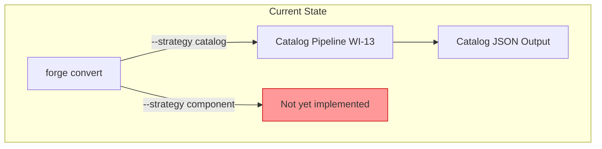
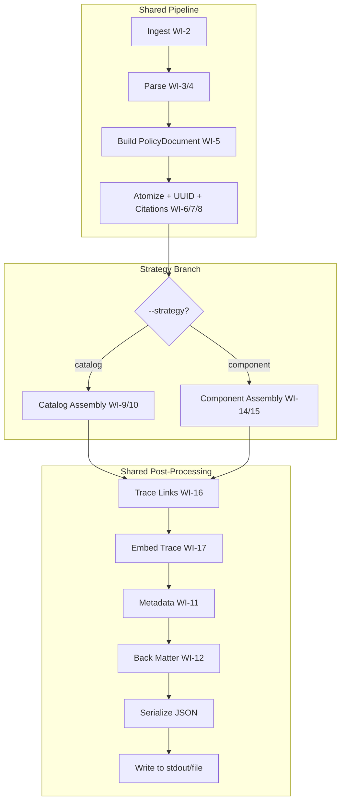
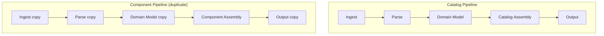
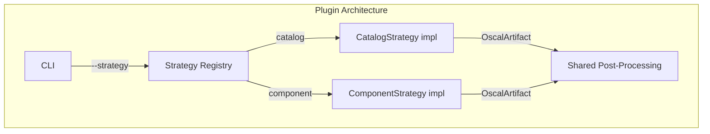
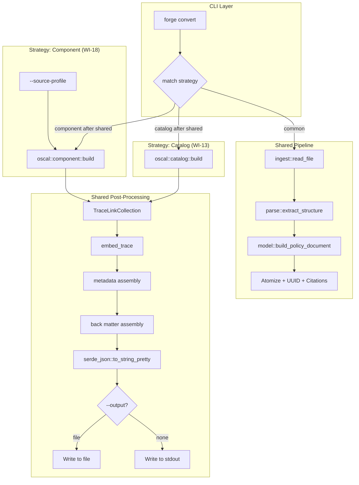
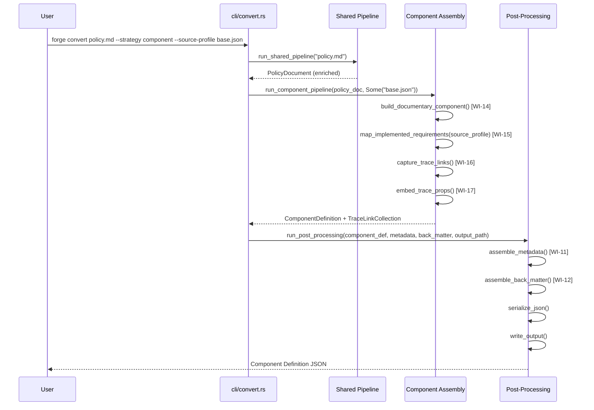
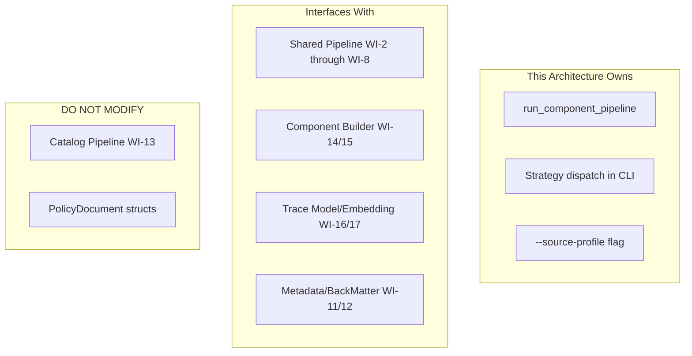

# 018-ar-component-pipeline

> **Document Type:** Architecture Review
> **Audience:** LLM agents, human reviewers
> **Status:** Proposed
> **Last Updated:** 2026-02-10 <!-- @auto -->
> **Owner:** Brian Luby <!-- @human-required -->
> **Deciders:** Brian Luby <!-- @human-required -->

---

## Review Tier Legend

| Marker | Tier | Speckit Behavior |
|--------|------|------------------|
| 🔴 `@human-required` | Human Generated | Prompt human to author; blocks until complete |
| 🟡 `@human-review` | LLM + Human Review | LLM drafts → prompt human to confirm/edit; blocks until confirmed |
| 🟢 `@llm-autonomous` | LLM Autonomous | LLM completes; no prompt; logged for audit |
| ⚪ `@auto` | Auto-generated | System fills (timestamps, links); no prompt |

---

## Document Completion Order

> ⚠️ **For LLM Agents:** Complete sections in this order. Do not fill downstream sections until upstream human-required inputs exist.

1. **Summary (Decision)** → requires human input first
2. **Context (Problem Space)** → requires human input
3. **Decision Drivers** → requires human input (prioritized)
4. **Driving Requirements** → extract from PRD, human confirms
5. **Options Considered** → LLM drafts after drivers exist, human reviews
6. **Decision (Selected + Rationale)** → requires human decision
7. **Implementation Guardrails** → LLM drafts, human reviews
8. **Everything else** → can proceed after decision is made

---

## Linkage ⚪ `@auto`

| Document | ID | Relationship |
|----------|-----|--------------|
| Parent PRD | [018-prd-component-pipeline](../PRD/018-prd-component-pipeline.md) | Requirements this architecture satisfies |
| Security Review | N/A | Pipeline wiring; no new attack surface |
| Supersedes | — | N/A |
| Superseded By | — | |

---

## Summary

### Decision 🔴 `@human-required`
> Use a shared pipeline architecture where the ingest-parse-normalize stages are reused from the Catalog pipeline (WI-13), with a strategy branch point after domain model construction that routes to the Component Definition assembly path (WI-14 through WI-17).

### TL;DR for Agents 🟡 `@human-review`
> The Component pipeline reuses the shared ingest-parse-normalize stages from WI-13 (Catalog pipeline). After `PolicyDocument` construction, `--strategy component` branches to: build documentary component (WI-14) → map implemented-requirements (WI-15) → attach trace links (WI-16) → embed trace props (WI-17) → assemble metadata (WI-11) → assemble back matter (WI-12) → serialize JSON → write output. Do NOT duplicate the shared pipeline stages. `--source-profile` is optional — if omitted, emit a warning and produce unmapped requirements. Strategy dispatch happens in the CLI handler, not in pipeline internals.

---

## Context

### Problem Space 🔴 `@human-required`
WI-14 through WI-17 built the individual pieces of Component Definition generation, but these are not yet wired into an end-to-end pipeline accessible from the CLI. Users cannot run `forge convert policy.md --strategy component` to produce Component Definition output. The component-first conversion strategy is equally critical as catalog-first for organizations mapping policies to external control frameworks. WI-18 completes MS-3 by connecting all component-related pieces through the full pipeline.

### Decision Scope 🟡 `@human-review`

**This AR decides:**
- How the Component pipeline shares infrastructure with the Catalog pipeline
- Where the strategy branch point occurs in the pipeline
- How `--strategy component` and `--source-profile` CLI flags integrate with the existing CLI
- Pipeline error handling and output routing

**This AR does NOT decide:**
- Component Definition OSCAL structure — decided in WI-14/WI-15 PRDs
- Traceability model or embedding — decided in 016-ar and 017-ar
- Schema validation of output — deferred to 019-ar-schema-validation
- XML/YAML output — deferred to Phase 2

### Current State 🟢 `@llm-autonomous`
The Catalog pipeline (WI-13) implements the full chain: ingest → parse → normalize → map → assemble → serialize for `--strategy catalog`. The Component Definition pieces (WI-14, WI-15, WI-16, WI-17) are built but not wired into the pipeline. The CLI has `convert` and `validate` subcommands with `--strategy`, `--format`, and `--output` flags.



### Driving Requirements 🟡 `@human-review`

| PRD Req ID | Requirement Summary | Architectural Implication |
|------------|---------------------|---------------------------|
| M-1 | Accept `--strategy component` | CLI routing to component pipeline |
| M-2 | Accept `--source-profile <path>` | Optional flag for baseline reference |
| M-3 | Wire full pipeline: ingest → serialize | End-to-end integration |
| M-4 | Generated Component Definition with documentary component and implemented-requirements | Calls WI-14, WI-15 |
| M-5 | Include all required OSCAL metadata | Calls WI-11 |
| M-6 | Include traceability props/links | Calls WI-16, WI-17 |
| M-7 | Include back matter resources | Calls WI-12 |
| M-8 | JSON output to stdout or file | Output routing |

**PRD Constraints inherited:**
- From constitution: Rust latest stable, clap 4.x, thiserror, TDD mandatory
- From PRD: JSON only; no network dependency; reuse shared infrastructure from WI-13

---

## Decision Drivers 🔴 `@human-required`

1. **Code Reuse:** Shared pipeline stages (ingest, parse, normalize) must not be duplicated *(constitution principle X, PRD constraint)*
2. **Consistency:** Component pipeline must produce artifacts with the same metadata, back matter, and traceability patterns as Catalog pipeline *(traces to PRD M-5, M-6, M-7)*
3. **Extensibility:** Strategy dispatch must accommodate future strategies (profile generation, etc.) without pipeline refactoring *(forward-looking)*
4. **Developer Velocity:** Solo developer must wire existing components quickly; no new frameworks or abstractions *(constitution capacity: 1 engineer)*

---

## Options Considered 🟡 `@human-review`

### Option 0: Status Quo / Do Nothing

**Description:** `--strategy component` remains unimplemented. WI-14 through WI-17 components exist but are not accessible from the CLI.

| Driver | Rating | Notes |
|--------|--------|-------|
| Code Reuse | N/A | Nothing to reuse or duplicate |
| Consistency | ❌ Poor | Component strategy is inaccessible |
| Extensibility | ❌ Poor | No strategy dispatch pattern established |
| Developer Velocity | ❌ Poor | MS-3 blocked |

**Why not viable:** MS-3 exit criteria require `forge convert policy.md --strategy component` to produce valid output. Parent PRD M-4 requires Component Definition generation.

---

### Option 1: Shared Pipeline with Strategy Branch (Recommended)

**Description:** The ingest → parse → normalize stages are shared between Catalog and Component strategies. After `PolicyDocument` construction, the CLI handler dispatches to the appropriate strategy function. Each strategy function calls its specific assembly logic (Catalog builder for catalog, Component builder for component) then converges on shared metadata assembly, back matter assembly, serialization, and output.



| Driver | Rating | Notes |
|--------|--------|-------|
| Code Reuse | ✅ Good | Shared stages used by both strategies; zero duplication |
| Consistency | ✅ Good | Metadata, back matter, trace embedding shared across strategies |
| Extensibility | ✅ Good | New strategies add a branch + assembly function; shared stages untouched |
| Developer Velocity | ✅ Good | WI-13 pattern proven; component pipeline follows the same wiring |

**Pros:**
- Zero code duplication between strategies
- Consistent metadata, back matter, and traceability across all output types
- WI-13 (Catalog pipeline) serves as a working template
- New strategies (profile, SSP) follow the same branch pattern
- Single `--output` and `--format` handling for all strategies

**Cons:**
- Strategy functions must return a common intermediate type for shared post-processing
- Adding strategy-specific post-processing may require interface evolution

---

### Option 2: Separate Pipeline Per Strategy

**Description:** Build a completely independent `run_component_pipeline()` function that reimplements ingestion, parsing, normalization, and output — duplicating the shared stages from WI-13.



| Driver | Rating | Notes |
|--------|--------|-------|
| Code Reuse | ❌ Poor | Ingestion, parsing, normalization duplicated entirely |
| Consistency | ⚠️ Medium | Must manually keep shared logic in sync across two pipelines |
| Extensibility | ❌ Poor | Each new strategy requires duplicating all shared stages again |
| Developer Velocity | ❌ Poor | Double the code to write and maintain |

**Pros:**
- Complete independence between strategies — no shared interface constraints
- Changes to one pipeline cannot accidentally break the other

**Cons:**
- Massive code duplication (ingest, parse, normalize, metadata, back matter, output)
- Bugs fixed in one pipeline must be manually propagated to the other
- Violates DRY; untenable as strategies multiply (profile, SSP in future phases)
- More code to write for a solo developer

---

### Option 3: Plugin Architecture

**Description:** Define a `Strategy` trait with a method that takes a `PolicyDocument` and returns an `OscalArtifact`. Each strategy implements the trait. A plugin registry dispatches based on `--strategy` value.



| Driver | Rating | Notes |
|--------|--------|-------|
| Code Reuse | ✅ Good | Shared post-processing; strategy-specific logic isolated |
| Consistency | ✅ Good | Common return type ensures consistent metadata/trace handling |
| Extensibility | ✅ Good | New strategies implement the trait — pluggable |
| Developer Velocity | ⚠️ Medium | Requires designing a trait, common return type, and registry upfront |

**Pros:**
- Clean separation of concerns via trait boundary
- Pluggable — new strategies are easy to add
- Forces common interface

**Cons:**
- Over-engineered for 2 strategies (catalog, component) — violates YAGNI (constitution principle X)
- Requires designing a stable `OscalArtifact` trait/type before strategy-specific needs are fully understood
- Trait objects or generics add indirection for no concrete benefit at this stage
- Constitution says "Don't create traits with a single implementation unless testing requires it or future extensibility is documented in a PRD" — only 2 strategies exist and the PRD does not mandate a plugin model

---

## Decision

### Selected Option 🔴 `@human-required`
> **Option 1: Shared Pipeline with Strategy Branch**

### Rationale 🔴 `@human-required`
Option 1 maximizes code reuse while keeping the architecture simple. The ingest-parse-normalize stages are identical for both strategies, and sharing them eliminates duplication. The branch point after domain model construction is a natural seam — the `PolicyDocument` is complete and the strategy-specific assembly begins. WI-13 (Catalog pipeline) already implements this pattern, making the Component pipeline a straightforward extension. Option 2 (separate pipelines) duplicates too much code for a solo developer. Option 3 (plugin architecture) is over-engineered for 2 strategies and violates YAGNI — a trait can be extracted later if a third strategy materializes.

#### Simplest Implementation Comparison 🟡 `@human-review`

| Aspect | Simplest Possible | Selected Option | Justification for Complexity |
|--------|-------------------|-----------------|------------------------------|
| Components | Single function with all stages inline | Shared stages + strategy branch + strategy functions | PRD M-3 requires full pipeline; sharing prevents duplication per constitution principle X |
| Dependencies | Direct function calls | Strategy match in CLI handler | PRD M-1 requires `--strategy component` flag; match dispatch is the simplest routing |
| Patterns | Linear pipeline | Branch-and-converge | Two strategies (catalog, component) require a branch; shared post-processing requires convergence |

**Complexity justified by:** The branch-and-converge pattern is the minimal structure needed to support two strategies (PRD M-1) while sharing pipeline stages (constitution principle X). No traits, registries, or plugin mechanisms are added.

### Architecture Diagram 🟡 `@human-review`



---

## Technical Specification

### Component Overview 🟡 `@human-review`

| Component | Responsibility | Interface | Dependencies |
|-----------|---------------|-----------|--------------|
| cli/convert.rs | Parse CLI args, dispatch strategy | CLI handler | clap 4.x, strategy functions |
| run_component_pipeline() | Orchestrate component-specific assembly | Function | WI-14, WI-15, WI-16, WI-17 |
| run_shared_pipeline() | Execute ingest → parse → normalize | Function | WI-2, WI-3/4, WI-5, WI-6, WI-7, WI-8 |
| run_post_processing() | Metadata, back matter, serialize, output | Function | WI-11, WI-12, serde_json |
| --source-profile flag | Optional baseline reference for control-id mapping | clap arg | std::path::Path |

### Data Flow 🟢 `@llm-autonomous`



### Interface Definitions 🟡 `@human-review`

```rust
use std::path::Path;
use crate::error::ForgeError;
use crate::model::PolicyDocument;

/// Run the shared pipeline stages: ingest → parse → normalize → enrich.
/// Returns an enriched PolicyDocument ready for strategy-specific assembly.
pub fn run_shared_pipeline(input_path: &Path) -> Result<PolicyDocument, ForgeError>;

/// Run the Component Definition assembly pipeline.
/// Takes an enriched PolicyDocument and optional source profile path.
/// Returns the assembled ComponentDefinition and TraceLinkCollection.
pub fn run_component_pipeline(
    policy_doc: &PolicyDocument,
    source_profile: Option<&Path>,
) -> Result<(ComponentDefinition, TraceLinkCollection), ForgeError>;

/// Run shared post-processing: metadata, back matter, serialization, output.
pub fn run_post_processing(
    artifact: impl Serialize,
    metadata: &Metadata,
    back_matter: &BackMatter,
    output: Option<&Path>,
) -> Result<(), ForgeError>;

// CLI argument additions (clap derive)
#[derive(Subcommand)]
enum Commands {
    Convert {
        input: PathBuf,
        #[arg(long, value_enum)]
        strategy: Strategy,
        #[arg(long, value_enum, default_value = "json")]
        format: OutputFormat,
        #[arg(long)]
        output: Option<PathBuf>,
        /// Source profile or catalog for control-id mapping (component strategy only)
        #[arg(long)]
        source_profile: Option<PathBuf>,
    },
}

#[derive(ValueEnum, Clone)]
enum Strategy {
    Catalog,
    Component,
}
```

### Key Algorithms/Patterns 🟡 `@human-review`

**Pattern:** Strategy dispatch via match in CLI handler

```
main() → Cli::parse() → match command:
  Convert { strategy: Catalog, .. } →
    1. run_shared_pipeline(input)
    2. run_catalog_pipeline(policy_doc) [WI-13]
    3. run_post_processing(catalog, metadata, back_matter, output)

  Convert { strategy: Component, source_profile, .. } →
    1. run_shared_pipeline(input)
    2. if source_profile.is_some() → validate file exists
    3. run_component_pipeline(policy_doc, source_profile) [WI-18]
    4. run_post_processing(component_def, metadata, back_matter, output)
```

---

## Constraints & Boundaries

### Technical Constraints 🟡 `@human-review`

**Inherited from PRD:**
- Rust latest stable toolchain
- clap 4.x derive macros for CLI
- JSON output only (serde_json)
- TDD mandatory (constitution principle IV)
- Fully offline operation

**Added by this Architecture:**
- Shared pipeline stages extracted to reusable functions (not duplicated per strategy)
- Strategy dispatch via match expression in CLI handler (no trait objects)
- `--source-profile` validated for file existence before pipeline execution
- Warning emitted to stderr if `--source-profile` omitted with component strategy

### Architectural Boundaries 🟡 `@human-review`



- **Owns:** Component pipeline orchestration, strategy dispatch, `--source-profile` flag
- **Interfaces With:** Shared pipeline (calls), Component builders (calls), Trace modules (calls), Metadata/BackMatter assembly (calls)
- **Must Not Touch:** Catalog pipeline internals, PolicyDocument struct definitions, OSCAL type definitions

### Implementation Guardrails 🟡 `@human-review`

> ⚠️ **Critical for LLM Agents:**

- [x] **DO NOT** duplicate the ingest → parse → normalize stages — reuse shared pipeline from WI-13 *(constitution principle X, PRD constraint)*
- [x] **DO NOT** create a Strategy trait or plugin registry — use a match expression *(YAGNI — only 2 strategies)*
- [x] **DO NOT** ignore the missing `--source-profile` case — emit a warning to stderr *(PRD S-1)*
- [x] **DO NOT** embed absolute file paths in OSCAL output — use relative paths or filenames *(PRD security constraint)*
- [x] **MUST** validate `--source-profile` path exists and is readable before processing *(PRD S-2)*
- [x] **MUST** produce a complete Component Definition with metadata, back matter, and trace props *(PRD M-3 through M-7)*
- [x] **MUST** support `--output <path>` for file output and default to stdout *(PRD M-8)*

---

## Consequences 🟡 `@human-review`

### Positive
- Zero code duplication between Catalog and Component pipelines
- Consistent artifact quality — shared metadata, back matter, and traceability
- MS-3 milestone unblocked — `forge convert --strategy component` works end-to-end
- Extensible — future strategies follow the same branch pattern

### Negative
- Strategy functions must agree on a common interface with shared post-processing
- Shared pipeline changes affect both strategies (tested by existing Catalog tests)

### Risks & Mitigations

| Risk | Likelihood | Impact | Mitigation |
|------|------------|--------|------------|
| Integration issues between WI-14/15 and main pipeline | Medium | Medium | Follow WI-13 wiring pattern; end-to-end smoke test |
| Source profile parsing fails on certain formats | Low | Medium | Validate input file before processing; report descriptive errors |
| Trace embedding not properly threaded | Low | High | End-to-end test verifying trace props in Component Definition output |

---

## Implementation Guidance

### Suggested Implementation Order 🟢 `@llm-autonomous`
1. Extract shared pipeline stages from WI-13 into `run_shared_pipeline()` if not already factored
2. Add `--source-profile` optional argument to convert subcommand via clap derive
3. Add `Strategy::Component` to the strategy enum
4. Implement `run_component_pipeline()` orchestrating WI-14 → WI-15 → WI-16 → WI-17
5. Wire strategy dispatch in CLI handler: `Strategy::Component => run_component_pipeline()`
6. Handle missing `--source-profile`: emit warning, proceed with unmapped requirements
7. Handle invalid `--source-profile`: validate path exists, report error, exit non-zero
8. Write smoke test: sample policy → Component Definition JSON via CLI
9. Write integration test: verify trace props present in output
10. Write edge case tests: missing source-profile, empty policy, non-existent output dir

### Testing Strategy 🟢 `@llm-autonomous`

| Layer | Test Type | Coverage Target | Notes |
|-------|-----------|-----------------|-------|
| Unit | Strategy dispatch routing | 100% | Both strategies route correctly |
| Unit | --source-profile validation | 90% | Exists, not exists, not JSON |
| Integration | End-to-end component pipeline | Key paths | policy.md → Component Definition JSON |
| Integration | Trace props in output | Key paths | Verify source-file, source-section, source-line on impl-reqs |
| Integration | --output file write | Happy path | Verify file is written |
| E2E | forge convert --strategy component | Happy path + errors | Full CLI invocation |

### Anti-patterns to Avoid 🟡 `@human-review`
- **Don't:** Copy-paste the ingestion code from the Catalog pipeline
  - **Why:** Duplication leads to divergent bug fixes
  - **Instead:** Extract shared stages into reusable functions
- **Don't:** Silently ignore `--source-profile` omission
  - **Why:** Users may not realize control-id mapping was skipped
  - **Instead:** Emit a warning to stderr explaining the consequence
- **Don't:** Parse the source profile eagerly at CLI argument parsing time
  - **Why:** Profile parsing belongs in the pipeline, not in CLI validation
  - **Instead:** Validate file existence in CLI; parse content in the pipeline

---

## Compliance & Cross-cutting Concerns

### Security Considerations 🟡 `@human-review`
- Authentication: N/A — local CLI tool
- Authorization: N/A
- Data handling: Source profile path validated for existence. Policy documents and generated artifacts should be treated as sensitive. Output paths should not create files outside the user's intended directory.

### Observability 🟢 `@llm-autonomous`
- **Logging:** Log pipeline stage transitions at INFO level ("Ingesting...", "Building component...", "Serializing...")
- **Metrics:** Log requirement count, implemented-requirement count, trace link count after generation
- **Tracing:** `--verbose` flag maps to DEBUG-level stage progress output to stderr

### Error Handling Strategy 🟢 `@llm-autonomous`
```
Error Category → Handling Approach
├── Input file not found → ForgeError::Io with file path context; exit 1
├── Source profile not found → ForgeError::Config with path; exit 1
├── Source profile invalid JSON → ForgeError::Parse with file context; exit 1
├── No requirements extracted → Warning to stderr; produce empty Component Definition
├── Output directory not found → ForgeError::Io with directory path; exit 1
└── Pipeline stage failure → ForgeError with stage name context; exit 1
```

---

## Migration Plan (if applicable) 🟡 `@human-review`

N/A — greenfield pipeline wiring. The Catalog pipeline (WI-13) continues to work unchanged; this AR adds the Component pipeline alongside it.

### Rollback Plan 🔴 `@human-required`

N/A — `--strategy component` is an additive feature. If the Component pipeline has issues, the Catalog pipeline remains unaffected. The Component pipeline can be iterated on without risk to existing functionality.

---

## Open Questions 🟡 `@human-review`

No open questions for this work item.

---

## Changelog ⚪ `@auto`

| Version | Date | Author | Changes |
|---------|------|--------|---------|
| 0.1 | 2026-02-10 | LLM (Claude) | Initial proposal |

---

## Decision Record ⚪ `@auto`

| Date | Event | Details |
|------|-------|---------|
| 2026-02-10 | Proposed | Initial draft created from PRD 018 |

---

## Traceability Matrix 🟢 `@llm-autonomous`

| PRD Req ID | Decision Driver | Option Rating | Component | Notes |
|------------|-----------------|---------------|-----------|-------|
| M-1 | Extensibility | Option 1: ✅ | Strategy dispatch in CLI | `--strategy component` routes to component pipeline |
| M-2 | Developer Velocity | Option 1: ✅ | --source-profile flag | Optional clap argument validated before pipeline |
| M-3 | Code Reuse | Option 1: ✅ | run_shared_pipeline + run_component_pipeline | Full chain wired with shared stages |
| M-4 | Consistency | Option 1: ✅ | run_component_pipeline | Calls WI-14, WI-15 for documentary component + impl-reqs |
| M-5 | Consistency | Option 1: ✅ | run_post_processing | Shared metadata assembly from WI-11 |
| M-6 | Consistency | Option 1: ✅ | run_component_pipeline | Calls WI-16, WI-17 for trace links and embedding |
| M-7 | Consistency | Option 1: ✅ | run_post_processing | Shared back matter assembly from WI-12 |
| M-8 | Developer Velocity | Option 1: ✅ | run_post_processing | Shared output routing (stdout/file) |
| S-1 | Consistency | Option 1: ✅ | Strategy dispatch | Warning emitted when --source-profile omitted |
| S-2 | Consistency | Option 1: ✅ | CLI handler | File existence validated before pipeline |

---

## Review Checklist 🟢 `@llm-autonomous`

Before marking as Accepted:
- [x] All PRD Must Have requirements appear in Driving Requirements
- [x] Option 0 (Status Quo) is documented
- [x] Simplest Implementation comparison is completed
- [x] Decision drivers are prioritized and addressed
- [x] At least 2 options were seriously considered
- [x] Constraints distinguish inherited vs. new
- [x] Component names are consistent across all diagrams and tables
- [x] Implementation guardrails reference specific PRD constraints
- [x] Rollback triggers and authority are defined (N/A — additive feature)
- [x] Security review is linked or N/A documented
- [x] No open questions blocking implementation
