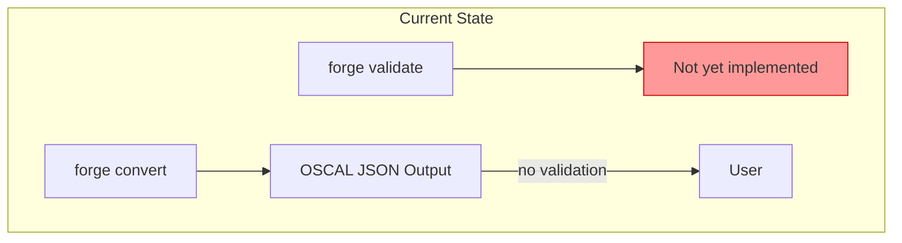
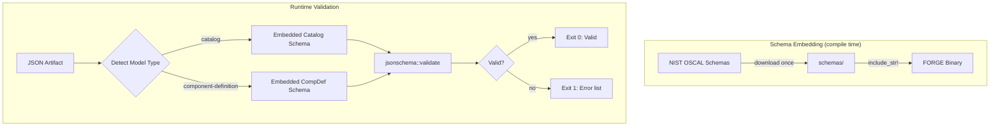
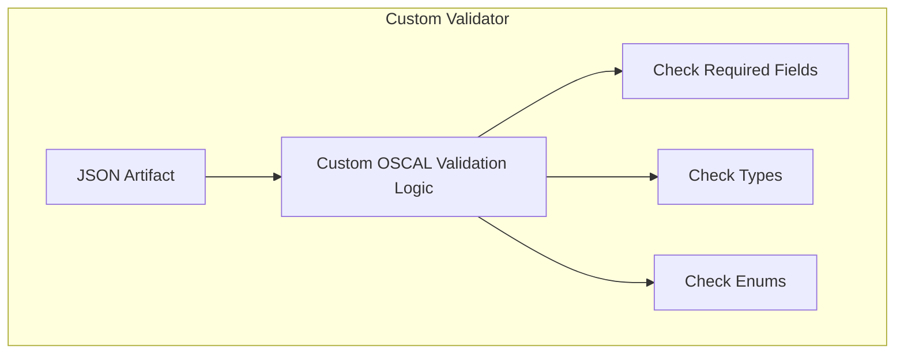
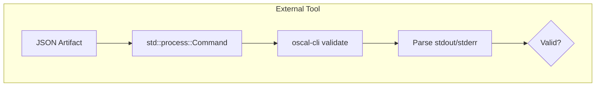
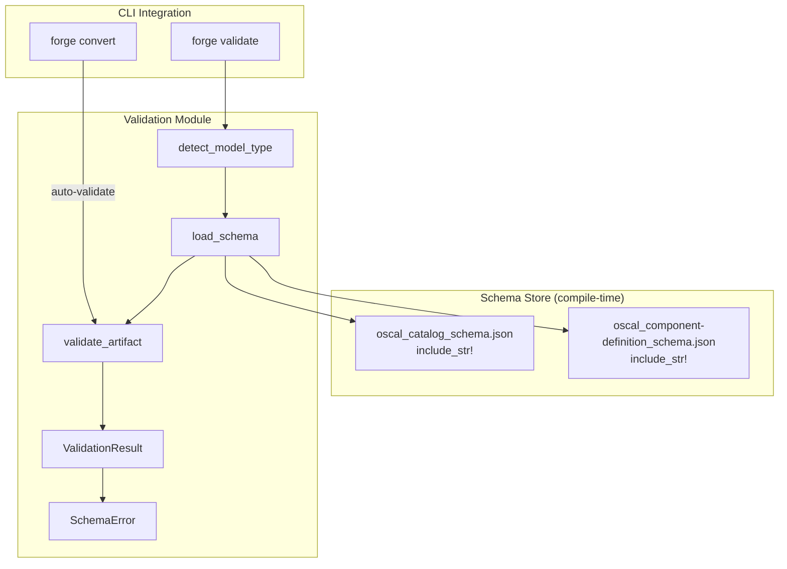
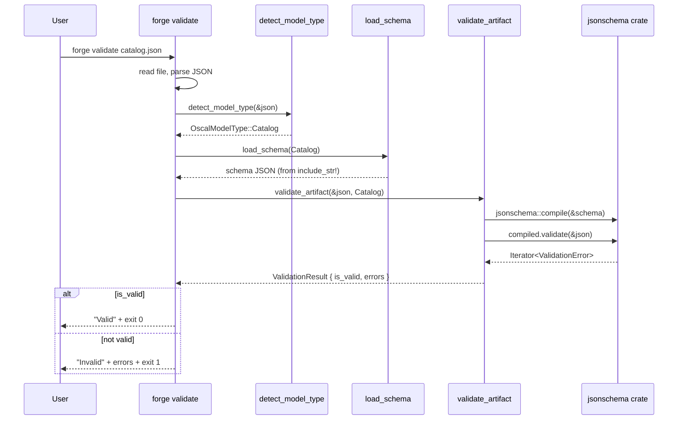
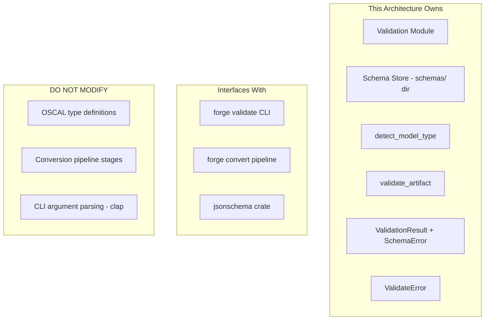

# 019-ar-schema-validation

> **Document Type:** Architecture Review
> **Audience:** LLM agents, human reviewers
> **Status:** Proposed
> **Last Updated:** 2026-02-10 <!-- @auto -->
> **Owner:** Brian Luby <!-- @human-required -->
> **Deciders:** Brian Luby <!-- @human-required -->

---

## Review Tier Legend

| Marker | Tier | Speckit Behavior |
|--------|------|------------------|
| 🔴 `@human-required` | Human Generated | Prompt human to author; blocks until complete |
| 🟡 `@human-review` | LLM + Human Review | LLM drafts → prompt human to confirm/edit; blocks until confirmed |
| 🟢 `@llm-autonomous` | LLM Autonomous | LLM completes; no prompt; logged for audit |
| ⚪ `@auto` | Auto-generated | System fills (timestamps, links); no prompt |

---

## Document Completion Order

> ⚠️ **For LLM Agents:** Complete sections in this order. Do not fill downstream sections until upstream human-required inputs exist.

1. **Summary (Decision)** → requires human input first
2. **Context (Problem Space)** → requires human input
3. **Decision Drivers** → requires human input (prioritized)
4. **Driving Requirements** → extract from PRD, human confirms
5. **Options Considered** → LLM drafts after drivers exist, human reviews
6. **Decision (Selected + Rationale)** → requires human decision
7. **Implementation Guardrails** → LLM drafts, human reviews
8. **Everything else** → can proceed after decision is made

---

## Linkage ⚪ `@auto`

| Document | ID | Relationship |
|----------|-----|--------------|
| Parent PRD | [019-prd-schema-validation](../PRD/019-prd-schema-validation.md) | Requirements this architecture satisfies |
| Security Review | Documented inline | JSON parsing attack surface noted |
| Supersedes | — | N/A (greenfield) |
| Superseded By | — | |

---

## Summary

### Decision 🔴 `@human-required`
> Use the `jsonschema` Rust crate for JSON Schema validation with OSCAL v1.2.0 JSON schemas embedded at compile time via `include_str!`. Implement `forge validate` as a standalone subcommand and add auto-validation as a pipeline gate in `forge convert`.

### TL;DR for Agents 🟡 `@human-review`
> Embed OSCAL v1.2.0 JSON schemas (`oscal_catalog_schema.json`, `oscal_component-definition_schema.json`) in the binary using `include_str!`. Use the `jsonschema` crate to validate artifacts. `forge validate <file>` auto-detects model type from the top-level JSON key and validates against the appropriate schema. `forge convert` auto-validates output before writing. Do NOT download schemas at runtime. Do NOT skip validation in `forge convert`. Do NOT stop at the first error — collect all errors via the iterator API.

---

## Context

### Problem Space 🔴 `@human-required`
FORGE generates OSCAL JSON artifacts but has no way to verify they conform to the official OSCAL v1.2.0 JSON schemas. Without validation, users cannot trust that FORGE's output will be accepted by other OSCAL-compliant tools. A structurally invalid artifact that silently passes through the pipeline undermines FORGE's core value proposition. Schema validation must be both a standalone command (`forge validate`) and an automatic quality gate in the conversion pipeline.

### Decision Scope 🟡 `@human-review`

**This AR decides:**
- Which JSON Schema validation library to integrate
- How OSCAL schemas are bundled with the binary
- How model type auto-detection works
- How validation integrates with `forge validate` and `forge convert`
- Validation result data model

**This AR does NOT decide:**
- Actionable error reporting with JSON paths and suggestions — deferred to 020-ar-validation-error-reporting
- Semantic validation (orphaned links, missing references) — deferred to 020-ar
- XML/YAML schema validation — deferred to Phase 2
- Profile or SSP schema validation — deferred to future phases

### Current State 🟢 `@llm-autonomous`
The Catalog pipeline (WI-13) and Component pipeline (WI-18) generate OSCAL JSON artifacts. The `forge validate` subcommand exists as a CLI stub from WI-1 but has no implementation. No schemas are bundled. No validation occurs during `forge convert`.



### Driving Requirements 🟡 `@human-review`

| PRD Req ID | Requirement Summary | Architectural Implication |
|------------|---------------------|---------------------------|
| M-1 | `forge validate` reads JSON and validates against OSCAL schema | Standalone validation command |
| M-2 | Schemas embedded in binary (no network dependency) | Compile-time embedding via include_str! |
| M-3 | Auto-detect OSCAL model type from top-level JSON key | Detection function inspecting JSON structure |
| M-4 | Report "Valid" with exit 0 on success | Validation result type with boolean + exit code |
| M-5 | Report "Invalid" with error list and non-zero exit on failure | Validation result type with error collection |
| M-6 | Auto-validate in `forge convert` before writing output | Pipeline integration point |
| M-7 | Integrate `jsonschema` crate | New dependency (MIT license) |

**PRD Constraints inherited:**
- From constitution: Rust latest stable, thiserror for errors, TDD mandatory
- From constitution principle XI: Dependencies must be at latest stable version, MIT/Apache-2.0 license
- From PRD: Fully offline; schemas compiled in; performance < 2 seconds for 100-control Catalog

---

## Decision Drivers 🔴 `@human-required`

1. **Offline Operation:** Validation must work without network access — schemas must be compile-time embedded *(traces to PRD M-2, product constraint)*
2. **Correctness:** Schema validation must detect all structural violations in OSCAL artifacts *(traces to PRD M-1, product principle P-1)*
3. **Pipeline Safety:** `forge convert` must never silently emit invalid artifacts *(traces to PRD M-6)*
4. **Maintainability:** Schema updates (OSCAL version changes) must be easy to apply *(forward-looking)*

---

## Options Considered 🟡 `@human-review`

### Option 0: Status Quo / Do Nothing

**Description:** No schema validation. Generated artifacts are emitted without any conformance check. `forge validate` remains an unimplemented stub.

| Driver | Rating | Notes |
|--------|--------|-------|
| Offline Operation | N/A | No validation to run |
| Correctness | ❌ Poor | Invalid artifacts silently emitted; violates P-1 and M-6 |
| Pipeline Safety | ❌ Poor | No quality gate in conversion pipeline |
| Maintainability | N/A | Nothing to maintain |

**Why not viable:** Parent PRD M-6 requires schema validation. Product principle P-1 (Correctness over convenience) demands that invalid output never reach users.

---

### Option 1: `jsonschema` Crate with Embedded Schemas (Recommended)

**Description:** Integrate the `jsonschema` Rust crate for JSON Schema validation. Download OSCAL v1.2.0 JSON schemas from the NIST OSCAL GitHub releases and embed them in the binary at compile time using `include_str!`. Implement model type detection by inspecting the top-level JSON key. Provide `forge validate` as a standalone command and add auto-validation as a pipeline step in `forge convert`.



| Driver | Rating | Notes |
|--------|--------|-------|
| Offline Operation | ✅ Good | Schemas compiled into binary; zero network calls at runtime |
| Correctness | ✅ Good | jsonschema crate supports Draft 2020-12 and Draft-07; covers OSCAL schema features |
| Pipeline Safety | ✅ Good | Auto-validation gate in forge convert prevents invalid output |
| Maintainability | ✅ Good | Schema update = replace files in schemas/ dir + rebuild |

**Pros:**
- Rust-native validation — no external runtime dependencies (no Java, no subprocess)
- Fully offline — schemas embedded at compile time
- Active maintenance — `jsonschema` is the most popular Rust JSON Schema crate
- MIT licensed — compatible with FORGE's MIT license
- Supports collecting all errors via iterator API (needed for WI-20)
- Provides instance_path in errors (needed for WI-20)
- Binary size impact minimal (OSCAL schemas < 500KB total)

**Cons:**
- New dependency added to Cargo.toml (~50KB compiled)
- Complex `$ref` resolution in OSCAL schemas may have edge cases (mitigated by testing against NIST examples)
- Schema files must be manually updated when OSCAL version changes

---

### Option 2: Custom Validator (Hand-written Rust)

**Description:** Write a custom OSCAL-specific validator in Rust that checks structural constraints without using a generic JSON Schema library. Validate required fields, types, and enums through hand-coded checks.



| Driver | Rating | Notes |
|--------|--------|-------|
| Offline Operation | ✅ Good | No schemas needed; logic is code |
| Correctness | ❌ Poor | Must re-implement every schema constraint; will miss edge cases |
| Pipeline Safety | ⚠️ Medium | Only validates what was manually coded |
| Maintainability | ❌ Poor | Every OSCAL schema change requires manual code updates |

**Pros:**
- No external dependency
- Full control over error messages from day one

**Cons:**
- Must manually encode all OSCAL schema constraints (hundreds of rules)
- Guaranteed to lag behind official OSCAL schema changes
- Enormous implementation effort for a solo developer
- Cannot validate against the authoritative NIST schema — only an approximation
- Not credible for OSCAL compliance claims

---

### Option 3: External Tool Invocation (oscal-cli)

**Description:** Shell out to NIST's `oscal-cli` Java tool for validation. The FORGE `validate` command would invoke `oscal-cli validate <file>` and parse its output.



| Driver | Rating | Notes |
|--------|--------|-------|
| Offline Operation | ⚠️ Medium | Requires oscal-cli + Java runtime installed; oscal-cli itself is offline-capable |
| Correctness | ✅ Good | Authoritative NIST validation; gold standard |
| Pipeline Safety | ✅ Good | Can gate forge convert on oscal-cli result |
| Maintainability | ⚠️ Medium | Depends on external tool versioning and availability |

**Pros:**
- Authoritative — NIST's own validation implementation
- Comprehensive — validates all OSCAL model types including Profile, SSP, etc.

**Cons:**
- Requires Java runtime — violates "no external runtime dependency" goal
- Requires oscal-cli to be installed and on PATH
- Subprocess overhead per validation (~2-5 seconds startup)
- Parsing oscal-cli output is fragile (output format may change between versions)
- Breaks FORGE's "single binary, fully offline" distribution model
- Cannot embed in CI without Java setup

---

## Decision

### Selected Option 🔴 `@human-required`
> **Option 1: `jsonschema` Crate with Embedded Schemas**

### Rationale 🔴 `@human-required`
Option 1 provides Rust-native, fully-offline validation with no external runtime dependencies. The `jsonschema` crate is the most mature Rust JSON Schema library, supports the draft versions used by OSCAL, and provides an iterator-based error API that WI-20 will build on. Embedding schemas at compile time keeps FORGE as a single-binary tool with no installation prerequisites. Option 2 (custom validator) would require implementing hundreds of schema constraints manually — an unreasonable effort for a solo developer that would never match the authoritative NIST schemas. Option 3 (oscal-cli) introduces a Java dependency that breaks FORGE's distribution model and adds multi-second startup overhead. The `jsonschema` crate is reserved as the primary approach, with oscal-cli available as a Phase 3 fallback (WI-36) if complex schema features are unsupported.

#### Simplest Implementation Comparison 🟡 `@human-review`

| Aspect | Simplest Possible | Selected Option | Justification for Complexity |
|--------|-------------------|-----------------|------------------------------|
| Components | No validation | 4 components (schema store, detector, validator, pipeline gate) | PRD M-1 through M-6 require full validation capability |
| Dependencies | Zero | +1 (jsonschema crate) | Constitution allows dependencies for demonstrated need (principle XI); JSON Schema validation is not feasible without a library |
| Patterns | Direct function | Module with types and enum | Multiple call sites (validate cmd, convert pipeline) require shared types; model type detection requires enum |

**Complexity justified by:** The four components represent the minimal architecture to satisfy standalone validation (PRD M-1), embedded schemas (PRD M-2), model type detection (PRD M-3), and pipeline integration (PRD M-6). The `jsonschema` dependency is justified because hand-implementing JSON Schema validation is infeasible.

### Architecture Diagram 🟡 `@human-review`



---

## Technical Specification

### Component Overview 🟡 `@human-review`

| Component | Responsibility | Interface | Dependencies |
|-----------|---------------|-----------|--------------|
| schemas/ directory | Store OSCAL v1.2.0 JSON schema files | File system (compile time) | NIST OSCAL releases |
| OscalModelType enum | Identify which OSCAL model an artifact represents | `Catalog \| ComponentDefinition` | None |
| detect_model_type() | Inspect top-level JSON key to determine model type | Function | serde_json |
| load_schema() | Return embedded schema for a given model type | Function | include_str!, serde_json |
| validate_artifact() | Compile schema and validate JSON artifact | Function | jsonschema crate |
| ValidationResult | Validation outcome with boolean + error list | Struct | SchemaError |
| SchemaError | Single validation error with message and paths | Struct | None |
| ValidateError | Error enum for validation operations | thiserror enum | thiserror |

### Data Flow 🟢 `@llm-autonomous`



### Interface Definitions 🟡 `@human-review`

```rust
use std::path::{Path, PathBuf};
use serde_json::Value;

/// Supported OSCAL model types for schema validation.
#[derive(Debug, Clone, Copy, PartialEq, Eq)]
pub enum OscalModelType {
    Catalog,
    ComponentDefinition,
}

/// Result of schema validation.
#[derive(Debug)]
pub struct ValidationResult {
    /// Whether the artifact is valid.
    pub is_valid: bool,
    /// Detected or specified model type.
    pub model_type: OscalModelType,
    /// All schema validation errors (empty if valid).
    pub errors: Vec<SchemaError>,
}

/// A single schema validation error.
#[derive(Debug)]
pub struct SchemaError {
    /// Human-readable error message.
    pub message: String,
    /// JSON pointer path to the failing element (e.g., "/catalog/metadata/title").
    pub instance_path: Option<String>,
    /// JSON pointer path within the schema that was violated.
    pub schema_path: Option<String>,
}

/// Errors from validation operations.
#[derive(Debug, thiserror::Error)]
pub enum ValidateError {
    #[error("Failed to read artifact file: {path}")]
    FileRead {
        path: PathBuf,
        #[source]
        source: std::io::Error,
    },

    #[error("Failed to parse JSON: {0}")]
    JsonParse(#[from] serde_json::Error),

    #[error("Unable to detect OSCAL model type from JSON structure")]
    UnknownModelType,

    #[error("Schema compilation failed for {model_type}: {message}")]
    SchemaCompilation {
        model_type: String,
        message: String,
    },
}

/// Detect the OSCAL model type from a parsed JSON value.
/// Inspects top-level keys: "catalog" → Catalog, "component-definition" → ComponentDefinition.
pub fn detect_model_type(json: &Value) -> Result<OscalModelType, ValidateError>;

/// Load the embedded OSCAL JSON schema for a given model type.
pub fn load_schema(model_type: OscalModelType) -> Result<Value, ValidateError>;

/// Validate a JSON value against the OSCAL schema for the given model type.
/// Collects all errors (does not stop at the first).
pub fn validate_artifact(
    json: &Value,
    model_type: OscalModelType,
) -> Result<ValidationResult, ValidateError>;

// Embedded schemas (compile-time)
const CATALOG_SCHEMA: &str = include_str!("../../schemas/oscal_catalog_schema.json");
const COMPONENT_DEF_SCHEMA: &str =
    include_str!("../../schemas/oscal_component-definition_schema.json");
```

### Key Algorithms/Patterns 🟡 `@human-review`

**Pattern:** Compile-time schema embedding with runtime validation

```
detect_model_type(json):
1. If json.get("catalog").is_some() → return Catalog
2. If json.get("component-definition").is_some() → return ComponentDefinition
3. Return Err(UnknownModelType)

validate_artifact(json, model_type):
1. Load schema via load_schema(model_type)
2. Compile schema: jsonschema::compile(&schema)
3. Validate: compiled.validate(&json) → iterator of errors
4. Collect all errors into Vec<SchemaError>
5. Return ValidationResult { is_valid: errors.is_empty(), errors }

forge validate <file>:
1. Read file to string → parse JSON
2. detect_model_type (or use --schema-type override)
3. validate_artifact
4. Print result, exit 0 or 1

forge convert (auto-validation):
1. ... pipeline stages ...
2. Serialize to JSON string → parse back to Value
3. validate_artifact(generated_json, model_type)
4. If invalid → print errors to stderr, exit 1, do NOT write output
5. If valid → write output normally
```

---

## Constraints & Boundaries

### Technical Constraints 🟡 `@human-review`

**Inherited from PRD:**
- Rust latest stable toolchain
- `jsonschema` crate at latest stable version (per constitution principle XI)
- `serde_json` for JSON parsing
- `thiserror` for error types
- TDD mandatory (constitution principle IV)
- No network dependency at runtime
- Performance: < 2 seconds for 100-control Catalog validation

**Added by this Architecture:**
- Schemas stored in `schemas/` directory at project root, embedded via `include_str!`
- Schema files pinned to specific NIST OSCAL release commit hash
- Model type detection based on top-level JSON key (simple, deterministic)
- `validate_artifact` always collects ALL errors (iterator exhausted), not just the first
- Auto-validation in `forge convert` operates on the serialized JSON, not the in-memory model

### Architectural Boundaries 🟡 `@human-review`



- **Owns:** Validation module, schema store, result types, error types
- **Interfaces With:** CLI commands (called by validate and convert handlers), jsonschema crate (dependency)
- **Must Not Touch:** OSCAL type definitions, conversion pipeline stages (only add a validation gate at the end), CLI argument parsing (only add --schema-type to validate subcommand)

### Implementation Guardrails 🟡 `@human-review`

> ⚠️ **Critical for LLM Agents:**

- [x] **DO NOT** download schemas at runtime — use `include_str!` at compile time *(PRD M-2, offline requirement)*
- [x] **DO NOT** stop at the first validation error — exhaust the iterator to collect all errors *(PRD M-5, WI-20 prerequisite)*
- [x] **DO NOT** skip auto-validation in `forge convert` — invalid artifacts must never be emitted *(PRD M-6, product principle P-1)*
- [x] **DO NOT** validate the in-memory model — validate the serialized JSON to catch serialization bugs *(architectural decision)*
- [x] **MUST** support both Catalog and Component Definition model types *(PRD M-3)*
- [x] **MUST** exit with code 0 on valid and non-zero on invalid *(PRD M-4, M-5)*
- [x] **MUST** pin schemas to a specific NIST OSCAL release *(PRD risk R-3 mitigation)*
- [x] **MUST** use `.unwrap()`-free error handling for schema compilation and validation *(constitution principle VIII)*

---

## Consequences 🟡 `@human-review`

### Positive
- Every FORGE-generated artifact is guaranteed to be schema-valid before reaching users
- `forge validate` provides a standalone OSCAL validation tool, increasing FORGE's utility
- Fully offline operation — no Java, no network, single binary
- WI-20 can build rich error reporting on top of this foundation
- Schemas are easily updated by replacing files in schemas/ directory

### Negative
- New dependency (`jsonschema` crate) added to Cargo.toml
- Binary size increases by ~500KB (embedded schemas)
- Complex `$ref` resolution in OSCAL schemas may have edge cases (tested against NIST examples)

### Risks & Mitigations

| Risk | Likelihood | Impact | Mitigation |
|------|------------|--------|------------|
| jsonschema crate does not support all OSCAL schema features | Medium | Medium | Test against NIST published example files; fall back to oscal-cli in WI-36 if critical gaps found |
| Embedded schemas increase binary size | Low | Low | < 500KB total; acceptable for a CLI tool |
| OSCAL schema errata or undocumented constraints | Low | Medium | Pin to specific release commit; report discrepancies upstream |
| Model type detection fails on malformed JSON | Low | Low | Provide --schema-type override flag (PRD S-1) |

---

## Implementation Guidance

### Suggested Implementation Order 🟢 `@llm-autonomous`
1. Download OSCAL v1.2.0 JSON schemas from NIST GitHub releases
2. Create `schemas/` directory; place `oscal_catalog_schema.json` and `oscal_component-definition_schema.json`
3. Add `jsonschema` crate to Cargo.toml
4. Create `src/validate/mod.rs` with types: `OscalModelType`, `ValidationResult`, `SchemaError`, `ValidateError`
5. Implement `detect_model_type()` — inspect top-level JSON keys
6. Implement `load_schema()` — return embedded schema via `include_str!`
7. Implement `validate_artifact()` — compile schema, validate, collect all errors
8. Wire `forge validate` subcommand to call validation functions
9. Add auto-validation gate to `forge convert` — validate before writing output
10. Add `--schema-type` override flag to `forge validate`
11. Write unit tests: valid artifact, invalid artifact, model detection, unknown model
12. Write integration tests: `forge validate` on NIST example files
13. Write integration test: `forge convert` fails on invalid output (introduce deliberate bug)

### Testing Strategy 🟢 `@llm-autonomous`

| Layer | Test Type | Coverage Target | Notes |
|-------|-----------|-----------------|-------|
| Unit | detect_model_type() | 100% | catalog, component-definition, unknown |
| Unit | load_schema() | 100% | Both model types |
| Unit | validate_artifact() valid | 90% | Valid Catalog and Component Definition |
| Unit | validate_artifact() invalid | 90% | Missing required fields, wrong types |
| Unit | All errors collected | 100% | Multi-error artifact returns all errors |
| Integration | forge validate on NIST examples | Key paths | Published NIST Catalog and ComponentDef examples |
| Integration | forge convert auto-validation | Key paths | Valid output passes; invalid output fails |
| Edge | Empty file | 100% | Descriptive error |
| Edge | Non-JSON file | 100% | JSON parse error |
| Edge | Unknown model type | 100% | UnknownModelType error |

### Anti-patterns to Avoid 🟡 `@human-review`
- **Don't:** Fetch schemas at runtime from a URL
  - **Why:** Breaks offline operation; creates network dependency
  - **Instead:** Embed schemas via include_str! at compile time
- **Don't:** Validate only in `forge validate` but skip in `forge convert`
  - **Why:** Silent emission of invalid artifacts is the worst failure mode
  - **Instead:** Auto-validate in forge convert before writing output
- **Don't:** Stop at the first validation error
  - **Why:** Users need all errors at once to fix efficiently; WI-20 depends on full error collection
  - **Instead:** Exhaust the error iterator and collect all errors
- **Don't:** Use `.unwrap()` on schema compilation or JSON parsing
  - **Why:** Panics in production are unacceptable (constitution principle VIII)
  - **Instead:** Return proper errors via Result types

---

## Compliance & Cross-cutting Concerns

### Security Considerations 🟡 `@human-review`
- Authentication: N/A — local CLI tool
- Authorization: N/A
- Data handling: User-provided JSON files are parsed by serde_json (memory-safe). Malformed JSON must not cause panics. Consider enforcing a reasonable file size limit to prevent OOM on extremely large inputs.
- Embedded schemas: Compiled from known NIST source; trusted at build time.

### Observability 🟢 `@llm-autonomous`
- **Logging:** Log schema compilation time at DEBUG level
- **Metrics:** Log validation time and error count at INFO level
- **Tracing:** Not needed for validation — single-pass operation

### Error Handling Strategy 🟢 `@llm-autonomous`
```
Error Category → Handling Approach
├── File not found → ValidateError::FileRead with path context; exit 1
├── Invalid JSON → ValidateError::JsonParse with serde error; exit 1
├── Unknown model type → ValidateError::UnknownModelType; suggest --schema-type; exit 1
├── Schema compilation fail → ValidateError::SchemaCompilation with details; exit 1
├── Validation errors → ValidationResult with SchemaError list; exit 1
├── Empty file → ValidateError::JsonParse; exit 1
└── Valid artifact → ValidationResult { is_valid: true }; exit 0
```

---

## Migration Plan (if applicable) 🟡 `@human-review`

N/A — greenfield implementation. The `forge validate` subcommand stub from WI-1 will be replaced with a full implementation.

### Rollback Plan 🔴 `@human-required`

If the `jsonschema` crate proves incompatible with OSCAL schemas (risk R-1), the fallback path is:
1. Remove `jsonschema` from dependencies
2. Implement validation by shelling out to `oscal-cli` (Option 3), accepting the Java runtime dependency
3. This fallback is documented in the roadmap as RR-5 mitigation

---

## Open Questions 🟡 `@human-review`

No open questions for this work item. The Spike-2 result (jsonschema crate suitability) is a prerequisite tracked in the PRD Definition of Ready.

---

## Changelog ⚪ `@auto`

| Version | Date | Author | Changes |
|---------|------|--------|---------|
| 0.1 | 2026-02-10 | LLM (Claude) | Initial proposal |

---

## Decision Record ⚪ `@auto`

| Date | Event | Details |
|------|-------|---------|
| 2026-02-10 | Proposed | Initial draft created from PRD 019 |

---

## Traceability Matrix 🟢 `@llm-autonomous`

| PRD Req ID | Decision Driver | Option Rating | Component | Notes |
|------------|-----------------|---------------|-----------|-------|
| M-1 | Correctness | Option 1: ✅ | validate_artifact(), forge validate CLI | Reads JSON and validates against schema |
| M-2 | Offline Operation | Option 1: ✅ | include_str! schema embedding | Schemas compiled into binary |
| M-3 | Correctness | Option 1: ✅ | detect_model_type() | Inspects top-level JSON key |
| M-4 | Correctness | Option 1: ✅ | ValidationResult.is_valid | Exit 0 when valid |
| M-5 | Correctness | Option 1: ✅ | ValidationResult.errors | All errors collected and reported |
| M-6 | Pipeline Safety | Option 1: ✅ | Auto-validation gate in forge convert | Invalid output blocked before writing |
| M-7 | Maintainability | Option 1: ✅ | jsonschema crate in Cargo.toml | MIT license, latest stable |
| S-1 | Correctness | Option 1: ✅ | --schema-type flag | Override for ambiguous model types |
| S-2 | Correctness | Option 1: ✅ | SchemaError.instance_path | JSON path from jsonschema error iterator |

---

## Review Checklist 🟢 `@llm-autonomous`

Before marking as Accepted:
- [x] All PRD Must Have requirements appear in Driving Requirements
- [x] Option 0 (Status Quo) is documented
- [x] Simplest Implementation comparison is completed
- [x] Decision drivers are prioritized and addressed
- [x] At least 2 options were seriously considered
- [x] Constraints distinguish inherited vs. new
- [x] Component names are consistent across all diagrams and tables
- [x] Implementation guardrails reference specific PRD constraints
- [x] Rollback triggers and authority are defined (fallback to oscal-cli)
- [x] Security review is linked or N/A documented
- [x] No open questions blocking implementation
