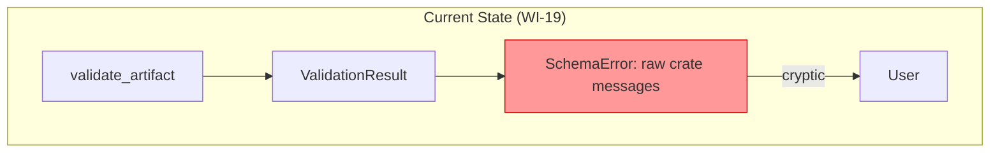
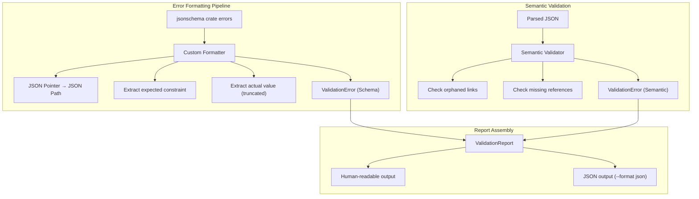
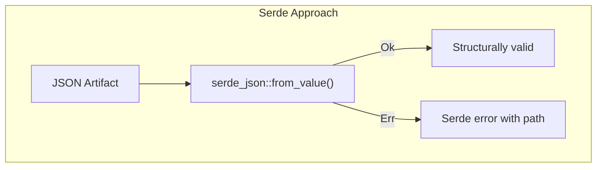
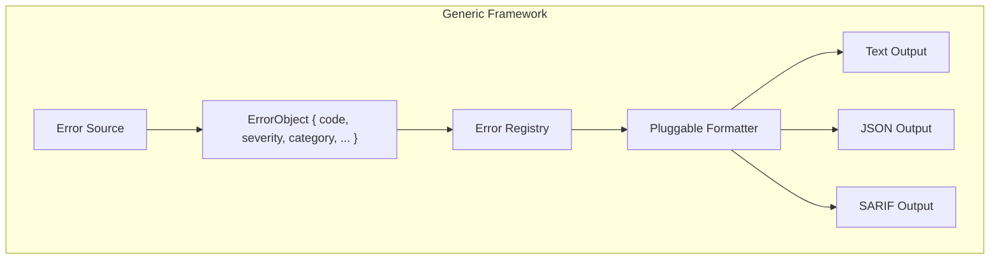
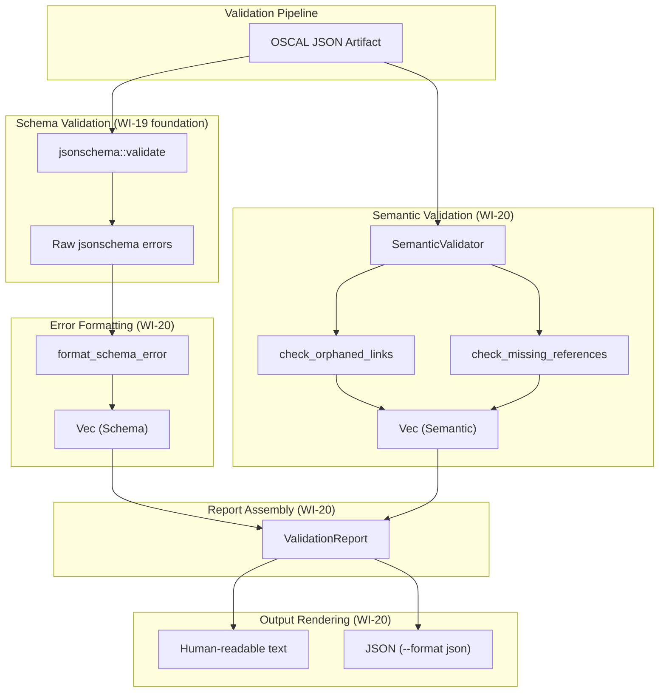
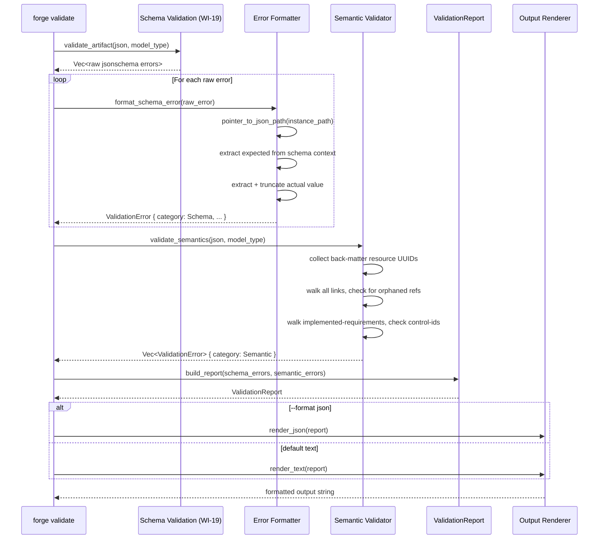
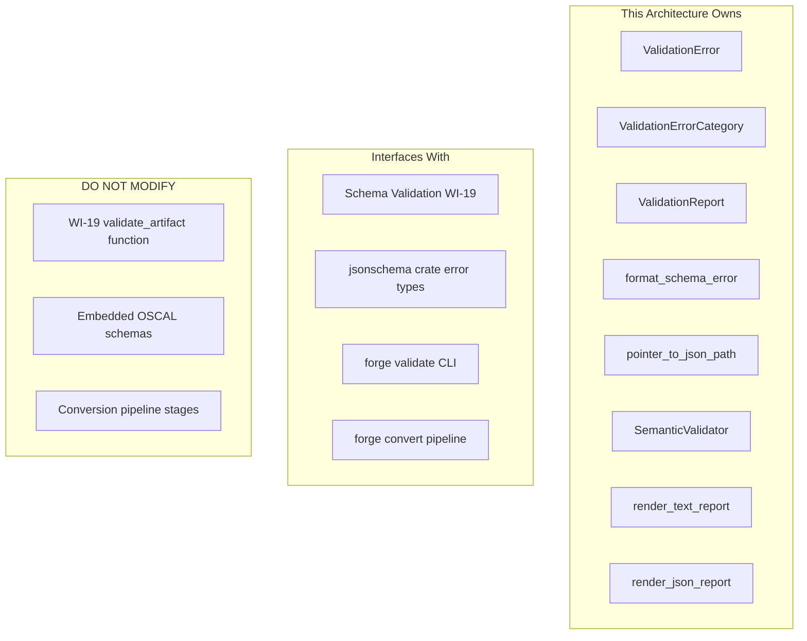

# 020-ar-validation-error-reporting

> **Document Type:** Architecture Review
> **Audience:** LLM agents, human reviewers
> **Status:** Proposed
> **Last Updated:** 2026-02-10 <!-- @auto -->
> **Owner:** Brian Luby <!-- @human-required -->
> **Deciders:** Brian Luby <!-- @human-required -->

---

## Review Tier Legend

| Marker | Tier | Speckit Behavior |
|--------|------|------------------|
| 🔴 `@human-required` | Human Generated | Prompt human to author; blocks until complete |
| 🟡 `@human-review` | LLM + Human Review | LLM drafts → prompt human to confirm/edit; blocks until confirmed |
| 🟢 `@llm-autonomous` | LLM Autonomous | LLM completes; no prompt; logged for audit |
| ⚪ `@auto` | Auto-generated | System fills (timestamps, links); no prompt |

---

## Document Completion Order

> ⚠️ **For LLM Agents:** Complete sections in this order. Do not fill downstream sections until upstream human-required inputs exist.

1. **Summary (Decision)** → requires human input first
2. **Context (Problem Space)** → requires human input
3. **Decision Drivers** → requires human input (prioritized)
4. **Driving Requirements** → extract from PRD, human confirms
5. **Options Considered** → LLM drafts after drivers exist, human reviews
6. **Decision (Selected + Rationale)** → requires human decision
7. **Implementation Guardrails** → LLM drafts, human reviews
8. **Everything else** → can proceed after decision is made

---

## Linkage ⚪ `@auto`

| Document | ID | Relationship |
|----------|-----|--------------|
| Parent PRD | [020-prd-validation-error-reporting](../PRD/020-prd-validation-error-reporting.md) | Requirements this architecture satisfies |
| Upstream AR | [019-ar-schema-validation](019-ar-schema-validation.md) | Foundation: provides base validation infrastructure |
| Security Review | N/A | Error formatting; no new attack surface |
| Supersedes | — | N/A |
| Superseded By | — | |

---

## Summary

### Decision 🔴 `@human-required`
> Use a custom error formatter that transforms `jsonschema` crate errors into actionable messages with JSON Path notation, expected/actual values, and error categorization (schema vs. semantic). Implement semantic validation as a separate pass that detects orphaned links and missing references. All errors collected in a single `ValidationReport` struct with human-readable text output by default and JSON output via `--format json`.

### TL;DR for Agents 🟡 `@human-review`
> Build a `ValidationReport` containing `Vec<ValidationError>` where each error has `category` (Schema|Semantic), `path` (JSON Path), `message`, `expected`, and `actual` fields. Convert `jsonschema` crate errors by mapping `instance_path` (JSON Pointer) to JSON Path notation (`$.field.name`). Implement semantic validation as a second pass: walk the JSON tree to detect orphaned back-matter links and missing control-id references. Do NOT stop at the first error. Do NOT show raw `jsonschema` crate messages to users. Do NOT truncate the error list. Auto-validation in `forge convert` MUST fail with all errors before writing any output.

---

## Context

### Problem Space 🔴 `@human-required`
WI-19 provides basic schema validation that reports valid/invalid with raw library error messages. These messages are cryptic (e.g., "instance failed to match all required schemas"), lack JSON path context, and the library may stop at the first error. Users cannot locate or fix problems from these messages. Additionally, schema validation alone misses semantic issues — an artifact can be schema-valid but contain orphaned back-matter links or dangling control-id references. WI-20 makes validation errors actionable by adding path information, expected/actual context, error categorization, and semantic validation.

### Decision Scope 🟡 `@human-review`

**This AR decides:**
- Error data model (ValidationError, ValidationReport)
- Error formatting strategy (JSON Pointer to JSON Path conversion, expected/actual extraction)
- Semantic validation architecture (orphaned links, missing references)
- Error output format (human-readable text and JSON)
- How auto-validation in `forge convert` uses enhanced error reporting

**This AR does NOT decide:**
- Base schema validation infrastructure — decided in 019-ar-schema-validation
- Auto-fix or auto-correction — deferred per PRD W-1
- XML/YAML validation — deferred to Phase 2
- Custom or organization-specific rules — deferred per PRD W-3

### Current State 🟢 `@llm-autonomous`
WI-19 provides `validate_artifact()` returning a `ValidationResult` with `is_valid: bool` and `errors: Vec<SchemaError>`. The `SchemaError` contains `message`, `instance_path`, and `schema_path` as raw strings from the `jsonschema` crate. No error formatting, no semantic validation, no JSON output mode.



### Driving Requirements 🟡 `@human-review`

| PRD Req ID | Requirement Summary | Architectural Implication |
|------------|---------------------|---------------------------|
| M-1 | Errors include JSON path, expected constraint, actual value | Error data model with structured fields |
| M-2 | All errors reported in single pass | Error collection architecture |
| M-3 | Semantic validation: orphaned back-matter links | Semantic validator component |
| M-4 | Semantic validation: missing required references | Semantic validator component |
| M-5 | Auto-validate in `forge convert`; fail on invalid | Pipeline integration with enhanced errors |
| M-6 | Errors categorized as "schema" or "semantic" | Error category enum |
| S-1 | `--format json` for machine-parseable error output | JSON serialization of errors |
| S-2 | Summary line with error counts | Report formatting |

**PRD Constraints inherited:**
- From constitution: Rust latest stable, thiserror for errors, TDD mandatory
- From PRD: Performance < 1 second for 100-control artifact; fully offline
- From PRD security: Truncate long actual values (max 100 chars) to avoid exposing sensitive content

---

## Decision Drivers 🔴 `@human-required`

1. **Actionability:** Every error must include sufficient context (path, expected, actual) for the user to locate and fix the problem *(traces to PRD M-1)*
2. **Completeness:** All errors must be reported in a single pass — no fix-one-revalidate loops *(traces to PRD M-2, parent PRD EC-10)*
3. **Breadth:** Validation must go beyond schema compliance to catch semantic issues *(traces to PRD M-3, M-4)*
4. **Ergonomics:** Error output must be clear and well-organized for both humans and machines *(traces to PRD M-6, S-1)*

---

## Options Considered 🟡 `@human-review`

### Option 0: Status Quo / Do Nothing

**Description:** Keep WI-19's raw `jsonschema` crate error messages. No JSON Path formatting, no expected/actual extraction, no semantic validation, no categorization.

| Driver | Rating | Notes |
|--------|--------|-------|
| Actionability | ❌ Poor | Raw crate messages reference schema internals; no JSON path |
| Completeness | ⚠️ Medium | WI-19 collects all schema errors but no semantic errors |
| Breadth | ❌ Poor | No semantic validation at all |
| Ergonomics | ❌ Poor | Technical, developer-facing error messages |

**Why not viable:** Parent PRD M-6 requires "actionable errors." EC-10 requires "reporting all errors, not just the first one." Raw crate messages do not meet either requirement. Semantic issues (orphaned links) would go undetected.

---

### Option 1: Custom Error Formatter with Semantic Validation (Recommended)

**Description:** Build a custom formatting layer that transforms `jsonschema` crate errors into actionable `ValidationError` structs with JSON Path, expected, and actual fields. Implement semantic validation as a separate validator that walks the JSON tree to detect orphaned links and missing references. Combine both error sources in a `ValidationReport`.



| Driver | Rating | Notes |
|--------|--------|-------|
| Actionability | ✅ Good | Every error has path + expected + actual |
| Completeness | ✅ Good | All schema + semantic errors in one report |
| Breadth | ✅ Good | Orphaned links and missing references detected |
| Ergonomics | ✅ Good | Human-readable default + JSON machine-parseable |

**Pros:**
- Full control over error message formatting and content
- JSON Path notation ($.field) is more user-friendly than JSON Pointer (/field)
- Semantic validation catches issues beyond schema compliance
- Single unified report with categorized errors
- JSON output mode enables CI/CD integration
- Actual values truncated to prevent sensitive data leakage

**Cons:**
- Custom formatting logic must be maintained alongside jsonschema crate updates
- Semantic validation rules must be manually implemented per OSCAL model type

---

### Option 2: Serde Error Chain (Deserialization-based Validation)

**Description:** Instead of JSON Schema validation, use Rust's serde deserialization with strict type definitions. Validation errors come from serde deserialization failures, which naturally include field paths and expected types.



| Driver | Rating | Notes |
|--------|--------|-------|
| Actionability | ⚠️ Medium | Serde errors include field paths but messages are Rust-centric |
| Completeness | ❌ Poor | Serde stops at the first deserialization error |
| Breadth | ❌ Poor | Serde only checks types — no enum validation, no pattern matching, no semantic checks |
| Ergonomics | ⚠️ Medium | Serde error messages are Rust-developer-facing, not end-user-facing |

**Pros:**
- No additional dependency (serde already in project)
- Type-safe validation via Rust type system

**Cons:**
- Stops at the first error — cannot report all errors in one pass
- Does not validate enum values, patterns, or conditional constraints
- Does not catch semantic issues (orphaned links, missing references)
- Serde error messages are implementation-specific, not user-friendly
- Requires complete Rust type definitions for all OSCAL models (enormous effort)

---

### Option 3: Structured Error Objects (Generic Error Framework)

**Description:** Build a generic error reporting framework with structured error objects, error codes, severity levels, and a pluggable formatter architecture. Errors are objects with schema: `{ code: "E001", severity: "error", category: "schema", path: "...", message: "...", expected: "...", actual: "...", suggestion: "..." }`.



| Driver | Rating | Notes |
|--------|--------|-------|
| Actionability | ✅ Good | Rich error objects with all context fields |
| Completeness | ✅ Good | Collects all errors from all sources |
| Breadth | ✅ Good | Pluggable — can add any validation source |
| Ergonomics | ✅ Good | Multiple output formats; error codes for documentation |

**Pros:**
- Extensible framework for future validation sources
- Error codes enable documentation and lookup
- SARIF output for code analysis tool integration
- Severity levels allow warnings vs errors distinction

**Cons:**
- Over-engineered for current needs (2 error sources: schema + semantic)
- Error codes, severity levels, and pluggable formatters are YAGNI — PRD only requires schema/semantic categorization
- Framework overhead delays delivery of the core feature
- Constitution principle X: "Don't create abstractions until there are at least 3 concrete implementations" — only 2 exist

---

## Decision

### Selected Option 🔴 `@human-required`
> **Option 1: Custom Error Formatter with Semantic Validation**

### Rationale 🔴 `@human-required`
Option 1 delivers actionable error reporting with the minimum necessary architecture. The custom formatter transforms raw `jsonschema` crate errors into user-friendly messages with JSON Path, expected, and actual fields. Semantic validation adds orphaned link and missing reference detection as a second pass. The `ValidationReport` struct unifies both error sources with clear categorization. Option 2 (serde) fails the completeness driver because serde stops at the first error and cannot report all errors. Option 3 (generic framework) violates YAGNI — error codes, severity levels, and pluggable formatters add complexity without PRD justification. When a third validation source materializes, the framework can be extracted from Option 1's implementation.

#### Simplest Implementation Comparison 🟡 `@human-review`

| Aspect | Simplest Possible | Selected Option | Justification for Complexity |
|--------|-------------------|-----------------|------------------------------|
| Components | Pass through raw crate errors | 5 components (formatter, semantic validator, report, text renderer, JSON renderer) | PRD M-1 requires JSON Path + expected/actual; PRD M-3/M-4 require semantic validation; PRD S-1 requires JSON output |
| Dependencies | jsonschema only | jsonschema + custom modules | Semantic validation cannot come from jsonschema crate; requires custom code |
| Patterns | Direct error passthrough | Format pipeline + semantic walk | Raw crate messages are unusable (PRD M-1); semantic walk is the only way to detect orphaned links (PRD M-3) |

**Complexity justified by:** The five components are the minimum needed to transform raw errors (PRD M-1), detect semantic issues (PRD M-3, M-4), categorize errors (PRD M-6), and support JSON output (PRD S-1). No extra abstractions, error codes, or severity levels are added.

### Architecture Diagram 🟡 `@human-review`



---

## Technical Specification

### Component Overview 🟡 `@human-review`

| Component | Responsibility | Interface | Dependencies |
|-----------|---------------|-----------|--------------|
| ValidationError | Single error with category, path, message, expected, actual | Struct (Debug, Serialize) | None |
| ValidationErrorCategory | Schema or Semantic classification | Enum (Debug, Serialize) | None |
| ValidationReport | Aggregated errors with summary | Struct (Debug, Serialize) | ValidationError |
| format_schema_error() | Transform jsonschema crate error into ValidationError | Function | jsonschema crate types |
| pointer_to_json_path() | Convert JSON Pointer to JSON Path notation | Function | None |
| SemanticValidator | Detect orphaned links and missing references | Struct with methods | serde_json |
| TextReportRenderer | Format ValidationReport as human-readable text | Function | ValidationReport |
| JsonReportRenderer | Serialize ValidationReport as JSON | Function | ValidationReport, serde_json |

### Data Flow 🟢 `@llm-autonomous`



### Interface Definitions 🟡 `@human-review`

```rust
use serde::{Serialize, Deserialize};

/// Category of validation error.
#[derive(Debug, Clone, Copy, PartialEq, Eq, Hash, Serialize, Deserialize)]
pub enum ValidationErrorCategory {
    /// Error from JSON Schema validation.
    Schema,
    /// Error from semantic validation (orphaned links, missing references).
    Semantic,
}

/// A single validation error with full context for actionable reporting.
#[derive(Debug, Clone, Serialize, Deserialize)]
pub struct ValidationError {
    /// Category of error: Schema or Semantic.
    pub category: ValidationErrorCategory,
    /// JSON Path to the offending field (e.g., "$.catalog.metadata.uuid").
    pub path: String,
    /// Human-readable description of the error.
    pub message: String,
    /// What the schema or rule expected (e.g., "required string field").
    pub expected: String,
    /// What was actually found (e.g., "field not present"). Truncated to 100 chars.
    pub actual: String,
}

/// Aggregated validation report.
#[derive(Debug, Clone, Serialize, Deserialize)]
pub struct ValidationReport {
    /// Path to the validated artifact.
    pub artifact_path: String,
    /// Whether the artifact passed all validation.
    pub is_valid: bool,
    /// All collected errors (empty if valid).
    pub errors: Vec<ValidationError>,
    /// Count of schema errors.
    pub schema_error_count: usize,
    /// Count of semantic errors.
    pub semantic_error_count: usize,
}

/// Convert a JSON Pointer (e.g., "/catalog/metadata/uuid") to
/// JSON Path notation (e.g., "$.catalog.metadata.uuid").
pub fn pointer_to_json_path(pointer: &str) -> String;

/// Format a raw jsonschema crate error into an actionable ValidationError.
pub fn format_schema_error(
    raw_error: &jsonschema::ValidationError,
    json: &serde_json::Value,
) -> ValidationError;

/// Semantic validator for OSCAL artifacts.
pub struct SemanticValidator;

impl SemanticValidator {
    /// Run all semantic validation checks on an OSCAL artifact.
    /// Returns a list of semantic validation errors.
    pub fn validate(
        &self,
        json: &serde_json::Value,
        model_type: OscalModelType,
    ) -> Vec<ValidationError>;

    /// Check for orphaned back-matter links.
    /// Finds link/href elements referencing back-matter resource UUIDs
    /// that do not exist in back-matter.resources[].
    fn check_orphaned_links(
        &self,
        json: &serde_json::Value,
    ) -> Vec<ValidationError>;

    /// Check for missing required references.
    /// For Component Definitions: verify control-id references.
    fn check_missing_references(
        &self,
        json: &serde_json::Value,
        model_type: OscalModelType,
    ) -> Vec<ValidationError>;
}

/// Render a ValidationReport as human-readable text.
pub fn render_text_report(report: &ValidationReport) -> String;

/// Render a ValidationReport as JSON.
pub fn render_json_report(report: &ValidationReport) -> String;
```

### Key Algorithms/Patterns 🟡 `@human-review`

**Pattern 1:** JSON Pointer to JSON Path conversion

```
pointer_to_json_path("/catalog/metadata/uuid"):
1. Split by "/"
2. Filter empty segments
3. For segments that are numeric → convert to array index notation [n]
4. Join with "." prefix with "$"
5. Result: "$.catalog.metadata.uuid"

pointer_to_json_path("/catalog/groups/0/controls/2/id"):
→ "$.catalog.groups[0].controls[2].id"
```

**Pattern 2:** Semantic validation — orphaned link detection

```
check_orphaned_links(json):
1. Collect resource_uuids: Set = json["back-matter"]["resources"][*]["uuid"]
   (empty set if no back-matter)
2. Walk entire JSON tree recursively
3. For each object with "href" key where value starts with "#":
   a. Extract UUID from href (strip leading "#")
   b. If UUID not in resource_uuids → emit ValidationError
      - path: JSON Path to the link element
      - expected: "resource with UUID '<uuid>' in back-matter.resources[]"
      - actual: "no matching resource found"
4. Return collected errors
```

**Pattern 3:** Full validation pipeline

```
run_full_validation(artifact_path, json, model_type, format):
1. Schema validation: validate_artifact(json, model_type) → raw errors
2. Format schema errors: raw_errors.map(format_schema_error) → schema_ves
3. Semantic validation: SemanticValidator.validate(json, model_type) → semantic_ves
4. Build report: ValidationReport { errors: schema_ves + semantic_ves, ... }
5. Render: match format { Text → render_text, Json → render_json }
6. Return (report, rendered_output)
```

---

## Constraints & Boundaries

### Technical Constraints 🟡 `@human-review`

**Inherited from PRD:**
- Rust latest stable toolchain
- `jsonschema` crate (from WI-19)
- `thiserror` for error types
- `serde` + `serde_json` for JSON output mode
- TDD mandatory (constitution principle IV)
- Performance: < 1 second for 100-control artifact validation
- Fully offline operation

**Added by this Architecture:**
- Actual values in errors truncated to 100 characters with "..." suffix (security: prevents sensitive data leakage)
- JSON Path notation uses `$` as root and `.` as separator (more user-friendly than JSON Pointer)
- Semantic validation runs after schema validation (both passes always execute; errors from both are reported)
- Auto-validation in `forge convert` must NOT write any output if validation fails (atomic behavior)
- `ValidationError` and `ValidationReport` derive Serialize for JSON output mode

### Architectural Boundaries 🟡 `@human-review`



- **Owns:** Error data model, error formatter, semantic validator, report renderers
- **Interfaces With:** WI-19 validation (calls validate_artifact, processes raw errors), CLI commands (called by validate and convert handlers)
- **Must Not Touch:** WI-19 core validation logic, embedded schema files, conversion pipeline stages (only add validation gate at output)

### Implementation Guardrails 🟡 `@human-review`

> ⚠️ **Critical for LLM Agents:**

- [x] **DO NOT** stop at the first error — collect ALL errors from both schema and semantic validation *(PRD M-2, parent PRD EC-10)*
- [x] **DO NOT** show raw `jsonschema` crate error messages to users — always format through `format_schema_error()` *(PRD M-1)*
- [x] **DO NOT** include actual values longer than 100 characters without truncation *(PRD security constraint)*
- [x] **DO NOT** write output from `forge convert` if validation fails — atomic output behavior *(PRD M-5, EC-7)*
- [x] **DO NOT** skip semantic validation even if schema validation finds errors — run both passes always *(PRD M-2, M-3)*
- [x] **MUST** categorize every error as "Schema" or "Semantic" *(PRD M-6)*
- [x] **MUST** include JSON Path notation ($.field) not JSON Pointer (/field) in error output *(PRD M-1, decision log)*
- [x] **MUST** support `--format json` for machine-parseable output *(PRD S-1)*

---

## Consequences 🟡 `@human-review`

### Positive
- Users can locate and fix all validation problems in a single pass
- Semantic errors (orphaned links, missing references) caught before they cause downstream failures
- JSON output mode enables CI/CD integration and automated error processing
- Clear categorization helps users prioritize schema fixes over semantic issues
- Auto-validation in `forge convert` guarantees no invalid output reaches users

### Negative
- Custom error formatting must be maintained alongside `jsonschema` crate updates
- Semantic validation rules are manually coded per OSCAL model type — may lag schema changes
- Two-pass validation (schema + semantic) adds minor performance overhead

### Risks & Mitigations

| Risk | Likelihood | Impact | Mitigation |
|------|------------|--------|------------|
| jsonschema crate error format changes between versions | Low | Medium | Pin to specific crate version; update formatting when upgrading |
| Semantic validation misses edge cases | Medium | Low | Start with direct UUID matching; expand rules incrementally |
| Error count overwhelms users on very invalid artifacts | Low | Low | Summary line provides count; users can pipe to pager |
| Actual value truncation removes useful context | Low | Low | 100 chars provides sufficient context for most fields; users can inspect the artifact directly |

---

## Implementation Guidance

### Suggested Implementation Order 🟢 `@llm-autonomous`
1. Define `ValidationErrorCategory` enum (Schema, Semantic)
2. Define `ValidationError` struct with Serialize derive
3. Define `ValidationReport` struct with Serialize derive and summary counts
4. Implement `pointer_to_json_path()` — convert JSON Pointer to JSON Path notation
5. Implement `format_schema_error()` — transform raw jsonschema error into ValidationError
6. Implement `SemanticValidator.check_orphaned_links()` — walk JSON, check back-matter references
7. Implement `SemanticValidator.check_missing_references()` — check control-id references
8. Implement `SemanticValidator.validate()` — orchestrate semantic checks
9. Implement `render_text_report()` — human-readable error output format
10. Implement `render_json_report()` — JSON serialization of ValidationReport
11. Wire enhanced validation into `forge validate` CLI handler
12. Wire auto-validation into `forge convert` pipeline — fail before writing output
13. Add `--format json` flag to `forge validate`
14. Write unit tests for pointer_to_json_path (various path formats)
15. Write unit tests for format_schema_error (missing field, wrong type, invalid enum)
16. Write unit tests for orphaned link detection
17. Write unit tests for missing reference detection
18. Write integration test: multi-error artifact reports all errors
19. Write integration test: forge convert fails on invalid output with actionable errors

### Testing Strategy 🟢 `@llm-autonomous`

| Layer | Test Type | Coverage Target | Notes |
|-------|-----------|-----------------|-------|
| Unit | pointer_to_json_path() | 100% | Simple paths, array indices, deeply nested, empty |
| Unit | format_schema_error() | 90% | Missing required, wrong type, invalid enum, invalid format |
| Unit | check_orphaned_links() | 90% | Orphan found, no orphans, no back-matter, multiple orphans |
| Unit | check_missing_references() | 90% | Missing control-id, all valid, empty implemented-requirements |
| Unit | render_text_report() | 90% | Valid, single error, multiple errors, mixed categories |
| Unit | render_json_report() | 90% | Valid, errors present, proper JSON structure |
| Unit | Actual value truncation | 100% | Short value (no truncation), 100+ char value (truncated) |
| Integration | Multi-error artifact | Key paths | 3+ errors all reported |
| Integration | Schema + semantic combined | Key paths | Both error categories in one report |
| Integration | forge convert auto-validation | Key paths | Valid passes; invalid fails with errors |
| Edge | 50+ errors | 100% | All reported, summary correct |
| Edge | Deeply nested path | 100% | Full path displayed without truncation |
| Edge | No back-matter section | 100% | Orphaned link check handles gracefully |

### Anti-patterns to Avoid 🟡 `@human-review`
- **Don't:** Pass raw jsonschema crate messages through to users
  - **Why:** Crate messages reference schema internals; unusable for end users
  - **Instead:** Transform every error through format_schema_error()
- **Don't:** Validate the in-memory model instead of serialized JSON in forge convert
  - **Why:** Misses serialization bugs — the output JSON is what users receive
  - **Instead:** Validate the serialized JSON before writing to output
- **Don't:** Stop schema validation when semantic issues are found (or vice versa)
  - **Why:** Users need the complete picture to fix all issues at once
  - **Instead:** Always run both passes and merge results
- **Don't:** Include full artifact content in error actual values
  - **Why:** Policy content may be sensitive; terminal output should be bounded
  - **Instead:** Truncate actual values to 100 characters with "..." suffix

---

## Compliance & Cross-cutting Concerns

### Security Considerations 🟡 `@human-review`
- Authentication: N/A — local CLI tool
- Authorization: N/A
- Data handling: Error messages echo field values from potentially sensitive policy artifacts. The 100-character truncation limit prevents dumping large blocks of sensitive text into terminal output or log files. Semantic validation does not follow external URLs — all checks are performed against the artifact's internal structure.

### Observability 🟢 `@llm-autonomous`
- **Logging:** Log error count by category at INFO level
- **Metrics:** Track schema error count, semantic error count, total validation time
- **Tracing:** Not needed for error formatting — single-pass operations

### Error Handling Strategy 🟢 `@llm-autonomous`
```
Error Category → Handling Approach
├── jsonschema crate error → format_schema_error() → ValidationError (Schema)
├── Orphaned link detected → ValidationError (Semantic) with path and UUID
├── Missing reference detected → ValidationError (Semantic) with path and control-id
├── All errors collected → ValidationReport → render based on --format flag
├── Zero errors → ValidationReport { is_valid: true } → "Valid" + exit 0
├── Any errors → ValidationReport { is_valid: false } → error output + exit 1
└── forge convert invalid → print errors to stderr, do NOT write output, exit 1
```

---

## Migration Plan (if applicable) 🟡 `@human-review`

WI-20 enhances the validation infrastructure from WI-19. The migration path:
1. WI-19's `SchemaError` type is replaced by the richer `ValidationError` type
2. WI-19's `ValidationResult` is replaced by `ValidationReport`
3. The `validate_artifact()` function from WI-19 continues to be called internally, but its raw errors are transformed through `format_schema_error()`
4. CLI handlers for `forge validate` and `forge convert` are updated to use the new report types

This is a backward-compatible enhancement — no external interfaces change (CLI usage remains the same, just with better error messages).

### Rollback Plan 🔴 `@human-required`

N/A — enhancement to WI-19 foundation. If the enhanced error formatting has issues, the system falls back to WI-19's raw error reporting. Semantic validation can be disabled independently without affecting schema validation.

---

## Open Questions 🟡 `@human-review`

No open questions for this work item.

---

## Changelog ⚪ `@auto`

| Version | Date | Author | Changes |
|---------|------|--------|---------|
| 0.1 | 2026-02-10 | LLM (Claude) | Initial proposal |

---

## Decision Record ⚪ `@auto`

| Date | Event | Details |
|------|-------|---------|
| 2026-02-10 | Proposed | Initial draft created from PRD 020 |

---

## Traceability Matrix 🟢 `@llm-autonomous`

| PRD Req ID | Decision Driver | Option Rating | Component | Notes |
|------------|-----------------|---------------|-----------|-------|
| M-1 | Actionability | Option 1: ✅ | format_schema_error(), ValidationError | JSON Path + expected + actual in every error |
| M-2 | Completeness | Option 1: ✅ | ValidationReport | All errors from both passes collected |
| M-3 | Breadth | Option 1: ✅ | SemanticValidator.check_orphaned_links() | Orphaned back-matter links detected |
| M-4 | Breadth | Option 1: ✅ | SemanticValidator.check_missing_references() | Missing control-id references detected |
| M-5 | Completeness | Option 1: ✅ | Auto-validation in forge convert | Fails with all errors before writing output |
| M-6 | Ergonomics | Option 1: ✅ | ValidationErrorCategory enum | Every error labeled Schema or Semantic |
| S-1 | Ergonomics | Option 1: ✅ | render_json_report() | --format json for machine-parseable output |
| S-2 | Ergonomics | Option 1: ✅ | render_text_report() | Summary line with error counts |

---

## Review Checklist 🟢 `@llm-autonomous`

Before marking as Accepted:
- [x] All PRD Must Have requirements appear in Driving Requirements
- [x] Option 0 (Status Quo) is documented
- [x] Simplest Implementation comparison is completed
- [x] Decision drivers are prioritized and addressed
- [x] At least 2 options were seriously considered
- [x] Constraints distinguish inherited vs. new
- [x] Component names are consistent across all diagrams and tables
- [x] Implementation guardrails reference specific PRD constraints
- [x] Rollback triggers and authority are defined (fallback to WI-19 raw errors)
- [x] Security review is linked or N/A documented
- [x] No open questions blocking implementation
