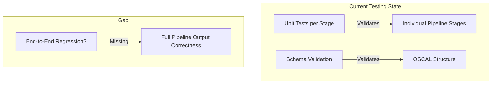
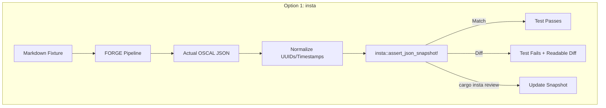
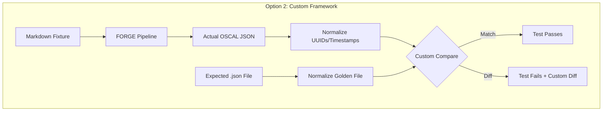
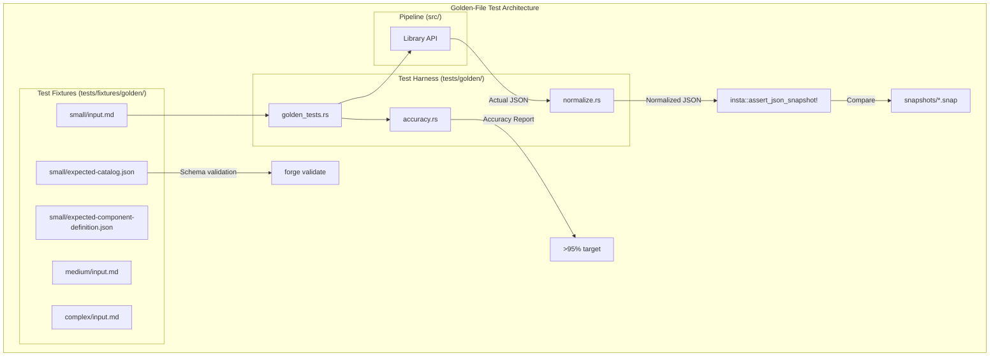
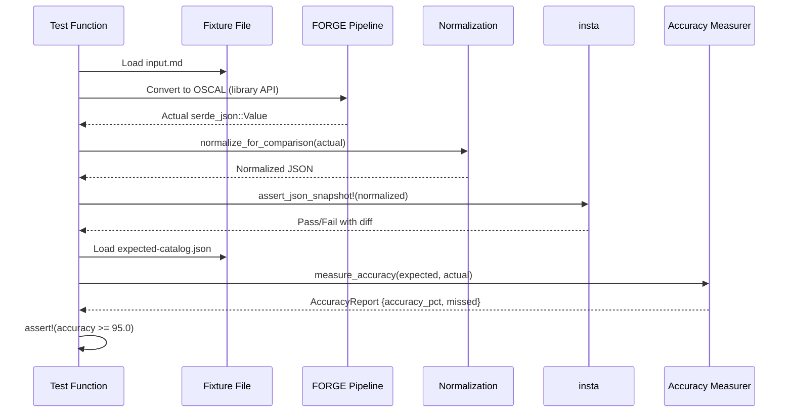

# 021-ar-golden-file-tests

> **Document Type:** Architecture Review
> **Audience:** LLM agents, human reviewers
> **Status:** Proposed
> **Last Updated:** 2026-02-10 <!-- @auto -->
> **Owner:** Brian Luby <!-- @human-required -->
> **Deciders:** Brian Luby <!-- @human-required -->

---

## Review Tier Legend

| Marker | Tier | Speckit Behavior |
|--------|------|------------------|
| 🔴 `@human-required` | Human Generated | Prompt human to author; blocks until complete |
| 🟡 `@human-review` | LLM + Human Review | LLM drafts → prompt human to confirm/edit; blocks until confirmed |
| 🟢 `@llm-autonomous` | LLM Autonomous | LLM completes; no prompt; logged for audit |
| ⚪ `@auto` | Auto-generated | System fills (timestamps, links); no prompt |

---

## Document Completion Order

> ⚠️ **For LLM Agents:** Complete sections in this order. Do not fill downstream sections until upstream human-required inputs exist.

1. **Summary (Decision)** → requires human input first
2. **Context (Problem Space)** → requires human input
3. **Decision Drivers** → requires human input (prioritized)
4. **Driving Requirements** → extract from PRD, human confirms
5. **Options Considered** → LLM drafts after drivers exist, human reviews
6. **Decision (Selected + Rationale)** → requires human decision
7. **Implementation Guardrails** → LLM drafts, human reviews
8. **Everything else** → can proceed after decision is made

---

## Linkage ⚪ `@auto`

| Document | ID | Relationship |
|----------|-----|--------------|
| Parent PRD | [021-prd-golden-file-tests](../PRD/021-prd-golden-file-tests.md) | Requirements this architecture satisfies |
| Security Review | N/A | No security implications — test infrastructure only |
| Supersedes | — | N/A (new capability) |
| Superseded By | — | |

---

## Summary

### Decision 🔴 `@human-required`
> Use the `insta` crate for snapshot/golden-file testing of OSCAL output, with a custom normalization layer to replace non-deterministic fields (UUIDs, timestamps) before snapshot comparison, organized as integration tests in `tests/golden/`.

### TL;DR for Agents 🟡 `@human-review`
> FORGE golden-file tests use `insta` for snapshot testing with a custom JSON normalization function that replaces UUIDs and `last-modified` timestamps with fixed placeholders before comparison. Tests are integration tests in `tests/golden/` that call the library API directly (not CLI binary). Fixtures live in `tests/fixtures/golden/{small,medium,complex}/`. Do NOT shell out to the `forge` binary in tests. Do NOT commit golden files without hand-verification and schema validation. Do NOT skip normalization of non-deterministic fields.

---

## Context

### Problem Space 🔴 `@human-required`
After 20 sprints of development, the FORGE pipeline can convert Markdown policies to OSCAL Catalog and Component Definition artifacts. Individual pipeline stages have unit tests, but no integration-level regression testing exists to verify that the end-to-end pipeline produces correct, complete, and stable output. The >95% extraction accuracy target (MS-4 exit criterion) cannot be measured without a golden-file comparison framework. The architecture must decide how to implement the comparison harness: which crate to use for snapshot management, how to handle non-deterministic fields, where to store fixtures, and how to measure extraction accuracy.

### Decision Scope 🟡 `@human-review`

**This AR decides:**
- Which snapshot/golden-file testing framework to use (insta, custom, or expect-test)
- How to normalize non-deterministic fields (UUIDs, timestamps) for stable comparison
- Directory structure for test fixtures and expected outputs
- How to measure and report extraction accuracy
- How golden-file tests integrate with `cargo test` and CI

**This AR does NOT decide:**
- Edge case fixture design — deferred to 022-ar-golden-file-edge-cases
- Error handling for malformed input — deferred to 023-ar-error-handling
- Performance benchmarking approach — deferred to 024-ar-performance-benchmark
- XML/YAML output testing — deferred to Phase 2

### Current State 🟢 `@llm-autonomous`
The FORGE pipeline is functionally complete through WI-20. Unit tests exist for individual stages (parsing, atomization, UUID generation, OSCAL assembly, schema validation). However, no end-to-end regression tests compare full pipeline output against known-good expected results. The only validation is schema validation (WI-19/WI-20), which confirms structural validity but not content correctness.



### Driving Requirements 🟡 `@human-review`

| PRD Req ID | Requirement Summary | Architectural Implication |
|------------|---------------------|---------------------------|
| M-1 | 3+ Markdown fixtures of varying complexity (small, medium, complex) | Fixture directory structure and organization strategy needed |
| M-2 | Hand-verified expected OSCAL Catalog JSON golden files | Golden files must be stored in version control and validated against OSCAL schema |
| M-3 | Hand-verified expected OSCAL Component Definition JSON golden files | Same storage and validation requirements as M-2 |
| M-4 | Normalize non-deterministic fields (UUIDs, timestamps) before comparison | Comparison harness must walk JSON tree and replace non-deterministic values |
| M-5 | Clear diff output showing JSON path and divergent values | Framework must produce structural diff, not raw text diff |
| M-6 | Tests runnable via `cargo test` in CI | Must integrate with standard Rust test infrastructure |
| M-7 | Test both `--strategy catalog` and `--strategy component` | Each fixture needs two expected outputs and two test functions |
| M-8 | Measure and report extraction accuracy >95% | Accuracy measurement logic needed alongside comparison |
| M-9 | Golden files validate all M-1 through M-11 from parent PRD | Complex fixture must exercise every Must Have requirement |

**PRD Constraints inherited:**
- From constitution: TDD mandatory (principle IV), `insta` listed in testing stack
- From PRD: JSON output format; OSCAL v1.2.0 schemas; deterministic UUID generation

---

## Decision Drivers 🔴 `@human-required`

1. **Diff quality:** Test failures must produce clear, structural JSON diffs with JSON paths — not opaque "values differ" messages *(traces to PRD M-5)*
2. **Normalization flexibility:** Must support custom normalization of UUIDs and timestamps before comparison *(traces to PRD M-4)*
3. **Update workflow:** Must support regenerating golden files after intentional changes without manual file editing *(traces to PRD S-1)*
4. **Simplicity:** Minimize boilerplate per test case; adding a new fixture should require minimal code *(constitution principle X)*
5. **CI compatibility:** Tests must run in CI without external tools or network access *(traces to PRD M-6)*

---

## Options Considered 🟡 `@human-review`

### Option 0: Status Quo / Do Nothing

**Description:** Continue with only unit tests and schema validation. No golden-file testing.

| Driver | Rating | Notes |
|--------|--------|-------|
| Diff quality | ❌ Poor | No end-to-end comparison exists |
| Normalization flexibility | N/A | No comparison to normalize |
| Update workflow | N/A | No golden files to update |
| Simplicity | ✅ Good | No additional test infrastructure |
| CI compatibility | ✅ Good | Existing tests already run in CI |

**Why not viable:** The >95% extraction accuracy target (MS-4 exit criterion) cannot be measured. Regressions in end-to-end output will go undetected. PRD M-1 through M-9 are unmet.

---

### Option 1: `insta` Snapshot Testing Crate

**Description:** Use the `insta` crate for snapshot management. Pre-process OSCAL JSON through a normalization function before passing to `insta::assert_json_snapshot!`. `insta` stores snapshots as `.snap` files, provides `cargo insta review` for interactive update, and produces readable diffs on failure.



| Driver | Rating | Notes |
|--------|--------|-------|
| Diff quality | ✅ Good | `insta` produces colored, structural diffs for JSON; shows exact paths that differ |
| Normalization flexibility | ✅ Good | Custom normalization function runs before `assert_json_snapshot!`; full control |
| Update workflow | ✅ Good | `cargo insta review` provides interactive review and accept/reject workflow |
| Simplicity | ✅ Good | Single macro call per test; `insta` manages snapshot storage automatically |
| CI compatibility | ✅ Good | Works in CI; `cargo insta test` fails on pending snapshots |

**Pros:**
- Industry-standard Rust snapshot testing; listed in constitution technology stack
- `cargo insta review` provides ergonomic workflow for updating golden files after intentional changes
- JSON-aware diffing with `assert_json_snapshot!` produces structural, not textual, diffs
- Snapshot files are stored in `snapshots/` directories alongside tests, tracked in version control
- Supports `redactions` feature for inline field normalization (alternative to custom function)

**Cons:**
- Adds `insta` as a dev dependency (well-maintained, Apache-2.0 license)
- Snapshot files use `.snap` format, not raw `.json` — expected outputs are not directly usable as standalone OSCAL files for schema validation without extraction
- Separate hand-verified `.json` golden files still needed for schema validation; `insta` snapshots are the normalized comparison copies

---

### Option 2: Custom Golden-File Framework with `serde_json`

**Description:** Build a custom comparison harness using `serde_json::Value` comparison. Normalize JSON by walking the tree and replacing UUIDs/timestamps. Store expected outputs as raw `.json` files. Implement custom diff reporting using `assert_json_diff` or manual tree-walking.



| Driver | Rating | Notes |
|--------|--------|-------|
| Diff quality | ⚠️ Medium | Must build custom diff reporting; `assert_json_diff` helps but is another dependency |
| Normalization flexibility | ✅ Good | Full control over normalization — same approach as Option 1 |
| Update workflow | ⚠️ Medium | Must build custom `UPDATE_GOLDEN_FILES=1` environment variable mechanism |
| Simplicity | ⚠️ Medium | More boilerplate per test; must implement comparison, diff reporting, and update logic |
| CI compatibility | ✅ Good | Pure Rust; no external dependencies beyond serde_json |

**Pros:**
- Expected outputs are raw `.json` files — directly usable for schema validation
- No new dependency beyond `serde_json` (already in use) and optionally `assert_json_diff`
- Full control over comparison and reporting logic

**Cons:**
- Significant custom code to build: normalization, comparison, diff reporting, golden-file update mechanism
- Diff output quality depends on implementation effort — likely inferior to `insta`'s polished output
- Every project reinvents this wheel; `insta` solves it generically

---

### Option 3: `expect-test` Inline Snapshot Crate

**Description:** Use the `expect-test` crate (from rust-analyzer), which stores expected output inline in the test source code. The `expect!` macro captures expected text directly in the test function body.

```mermaid
graph TD
    subgraph "Option 3: expect-test"
        Fix3[Markdown Fixture] --> Pipeline3[FORGE Pipeline]
        Pipeline3 --> Actual3[Actual OSCAL JSON String]
        Actual3 --> Expect["expect![[r#\"...\"#]]"]
        Expect --> |"Match"| Pass3[Test Passes]
        Expect --> |"Diff"| Fail3["Test Fails + Inline Update"]
    end
```

| Driver | Rating | Notes |
|--------|--------|-------|
| Diff quality | ⚠️ Medium | Text-based diff, not JSON-structural; less readable for large JSON documents |
| Normalization flexibility | ⚠️ Medium | Must normalize to string before comparison; no JSON-aware diffing |
| Update workflow | ✅ Good | `UPDATE_EXPECT=1` regenerates inline; ergonomic for small outputs |
| Simplicity | ❌ Poor | Inline expected output is impractical for multi-KB OSCAL JSON documents |
| CI compatibility | ✅ Good | Pure Rust, works in CI |

**Pros:**
- No external files — expected output lives in the test code
- Auto-update with `UPDATE_EXPECT=1` environment variable

**Cons:**
- OSCAL JSON outputs are 10-100KB — embedding them inline in test source is impractical and unreadable
- Text-based comparison, not JSON-structural — sensitive to formatting
- Not suitable for large structured outputs

---

## Decision

### Selected Option 🔴 `@human-required`
> **Option 1: `insta` Snapshot Testing Crate**

### Rationale 🔴 `@human-required`
`insta` is the best fit because it provides JSON-structural diffs (the primary driver), supports custom normalization via a pre-processing function, and offers `cargo insta review` for ergonomic golden-file updates. It is listed in the constitution technology stack (principle IV testing stack) and is the industry standard for Rust snapshot testing. The main trade-off — snapshots stored as `.snap` files rather than raw `.json` — is mitigated by maintaining separate hand-verified `.json` files in the fixture directories for schema validation purposes. The normalized `.snap` files are the comparison artifacts; the raw `.json` files are the schema-validation artifacts. Option 2 (custom framework) requires building what `insta` already provides. Option 3 (expect-test) is impractical for large JSON outputs.

#### Simplest Implementation Comparison 🟡 `@human-review`

| Aspect | Simplest Possible | Selected Option | Justification for Complexity |
|--------|-------------------|-----------------|------------------------------|
| Components | `assert_eq!` on JSON strings | `insta` + normalization function + fixture directory structure | PRD M-4 requires normalization; PRD M-5 requires structural diff; raw `assert_eq!` produces unreadable diffs for JSON |
| Dependencies | `serde_json` only | `serde_json` + `insta` | `insta` provides diff quality and update workflow that would require significant custom code otherwise |
| Patterns | Single comparison function | Normalization → snapshot assertion + accuracy measurement | PRD M-8 requires accuracy measurement alongside comparison |

**Complexity justified by:** PRD M-4 (normalization) and M-5 (structural diff) cannot be met with simple `assert_eq!`. `insta` provides these capabilities out of the box, eliminating custom code. Accuracy measurement (PRD M-8) adds a small additional component.

### Architecture Diagram 🟡 `@human-review`



---

## Technical Specification

### Component Overview 🟡 `@human-review`

| Component | Responsibility | Interface | Dependencies |
|-----------|---------------|-----------|--------------|
| Normalization Function | Replace UUIDs and timestamps with fixed placeholders in JSON | `fn normalize_for_comparison(json: &serde_json::Value) -> serde_json::Value` | serde_json |
| Golden Test Runner | Load fixture, run pipeline, normalize, compare via insta | Integration test functions in `tests/golden/` | insta, serde_json, FORGE library API |
| Accuracy Measurer | Count expected vs actual requirements, report percentage | `fn measure_accuracy(expected: &Value, actual: &Value) -> AccuracyReport` | serde_json |
| Fixture Files | Markdown inputs + expected JSON outputs + insta snapshots | File system layout in `tests/fixtures/golden/` | None |

### Data Flow 🟢 `@llm-autonomous`



### Interface Definitions 🟡 `@human-review`

```rust
use serde_json::Value;

/// Normalize non-deterministic fields for stable comparison.
/// Replaces all UUID-format strings with a fixed placeholder.
/// Replaces all `last-modified` field values with a fixed timestamp.
/// Sorts all map keys for deterministic ordering.
pub fn normalize_for_comparison(json: &Value) -> Value {
    // Walk JSON tree recursively
    // Replace UUID pattern matches with "00000000-0000-0000-0000-000000000000"
    // Replace "last-modified" values with "2026-01-01T00:00:00Z"
    // Return normalized copy
    todo!()
}

/// Result of golden-file accuracy measurement.
pub struct AccuracyReport {
    pub fixture_name: String,
    pub expected_count: usize,
    pub correct_count: usize,
    pub accuracy_pct: f64,
    pub missed_requirements: Vec<String>,
}

/// Measure extraction accuracy by comparing expected and actual requirement counts.
pub fn measure_accuracy(
    fixture_name: &str,
    expected: &Value,
    actual: &Value,
) -> AccuracyReport {
    // Count controls in expected Catalog (or implemented-requirements in Component Def)
    // Count matching controls in actual output
    // Identify missed requirements by stable ID or control ID
    todo!()
}

// Example test function pattern:
// #[test]
// fn golden_small_catalog() {
//     let input = std::fs::read_to_string("tests/fixtures/golden/small/input.md").unwrap();
//     let actual = forge::convert(&input, Strategy::Catalog, Format::Json).unwrap();
//     let normalized = normalize_for_comparison(&actual);
//     insta::assert_json_snapshot!("small_catalog", normalized);
//
//     let expected = load_json("tests/fixtures/golden/small/expected-catalog.json");
//     let report = measure_accuracy("small", &expected, &actual);
//     assert!(report.accuracy_pct >= 95.0, "Accuracy {:.1}% below 95% target", report.accuracy_pct);
// }
```

### Key Algorithms/Patterns 🟡 `@human-review`

**Pattern:** UUID Normalization via Regex Walk
```
1. Recursively walk serde_json::Value tree
2. For each string value, test against UUID v4/v5 regex pattern
3. If match, replace with fixed placeholder UUID
4. For "last-modified" keys, replace value with fixed timestamp
5. For Object nodes, sort keys alphabetically
6. Return new normalized Value tree
```

**Pattern:** Accuracy Measurement
```
1. Extract all control IDs from expected Catalog JSON ($.catalog.groups[*].controls[*].id)
2. Extract all control IDs from actual output
3. Compute intersection (correctly extracted)
4. Compute difference (missed requirements)
5. accuracy_pct = intersection.len() / expected.len() * 100
6. Report per-fixture and aggregate
```

---

## Constraints & Boundaries

### Technical Constraints 🟡 `@human-review`

**Inherited from PRD:**
- Tests must run via `cargo test` without external tools or network access
- Fixtures stored in version control
- Expected outputs must pass OSCAL v1.2.0 schema validation
- JSON output must use ordered/sorted keys for deterministic serialization

**Added by this Architecture:**
- `insta` added as dev dependency (Apache-2.0 license, well-maintained)
- Normalization function must be idempotent (normalizing twice produces same result)
- Raw `.json` expected output files maintained separately from `.snap` files for schema validation
- Test functions call library API directly — no process spawning

### Architectural Boundaries 🟡 `@human-review`

- **Owns:** `tests/golden/`, `tests/fixtures/golden/`, normalization and accuracy code
- **Interfaces With:** FORGE library API (convert function), `insta` crate, `serde_json`
- **Must Not Touch:** Pipeline implementation code in `src/`; schema validation logic

### Implementation Guardrails 🟡 `@human-review`

> ⚠️ **Critical for LLM Agents:**

- [x] **DO NOT** shell out to the `forge` binary in golden-file tests — use the library API directly *(decision: faster, better diagnostics)*
- [x] **DO NOT** commit golden files or snapshots without hand-verification and schema validation *(PRD R-1 mitigation)*
- [x] **DO NOT** skip UUID/timestamp normalization — raw comparison will produce non-deterministic failures *(PRD M-4)*
- [x] **DO NOT** use `expect-test` for large OSCAL JSON — inline snapshots are impractical for multi-KB output
- [x] **MUST** validate all expected `.json` golden files against OSCAL v1.2.0 schema before committing *(PRD M-2, M-3)*
- [x] **MUST** test both `--strategy catalog` and `--strategy component` for every fixture *(PRD M-7)*
- [x] **MUST** report extraction accuracy per fixture and overall *(PRD M-8)*

---

## Consequences 🟡 `@human-review`

### Positive
- End-to-end regression testing catches cross-component bugs that unit tests miss
- `insta` provides high-quality JSON diffs that speed up debugging
- Accuracy measurement enables tracking the >95% target over time
- `cargo insta review` provides ergonomic workflow for intentional output changes

### Negative
- Dual file maintenance: `.snap` files for `insta` comparison + raw `.json` files for schema validation
- `insta` is a dev dependency — adds to dependency tree (but only for testing)

### Risks & Mitigations

| Risk | Likelihood | Impact | Mitigation |
|------|------------|--------|------------|
| Golden files contain errors committed as truth | Med | High | Hand-verify + schema-validate before commit; review in PRs |
| `insta` snapshot format changes between versions | Low | Low | Pin `insta` version in Cargo.toml; snapshots are re-generable |
| Normalization misses a non-deterministic field | Med | Med | Test normalization idempotency; add new fields to normalizer as discovered |

---

## Implementation Guidance

### Suggested Implementation Order 🟢 `@llm-autonomous`
1. Add `insta` (with `json` feature) as a dev dependency in `Cargo.toml`
2. Create `tests/fixtures/golden/{small,medium,complex}/` directory structure with `input.md` fixtures
3. Implement `normalize_for_comparison()` function in a test utility module
4. Write the first golden test for `small/catalog` — TDD: write test, run to fail, verify output, accept snapshot
5. Hand-verify and schema-validate expected outputs; commit as `.json` files alongside fixtures
6. Add remaining tests for medium, complex, and component strategy
7. Implement `measure_accuracy()` and add accuracy assertions
8. Verify all tests pass in CI

### Testing Strategy 🟢 `@llm-autonomous`

| Layer | Test Type | Coverage Target | Notes |
|-------|-----------|-----------------|-------|
| Integration | Golden-file comparison | 3+ fixtures x 2 strategies = 6+ tests | Core regression suite |
| Unit | Normalization function | 100% branch coverage | Test UUID replacement, timestamp replacement, key sorting |
| Unit | Accuracy measurement | Edge cases (0%, 50%, 95%, 100%) | Boundary conditions for accuracy threshold |

### Anti-patterns to Avoid 🟡 `@human-review`
- **Don't:** Auto-generate golden files and commit without hand-verification
  - **Why:** Defeats the purpose — golden files must represent known-correct output
  - **Instead:** Generate, hand-verify section by section, schema-validate, then commit
- **Don't:** Compare raw JSON strings with `assert_eq!`
  - **Why:** Brittle to formatting; produces unreadable diffs for large JSON
  - **Instead:** Use `insta::assert_json_snapshot!` with normalized values
- **Don't:** Over-normalize by stripping all string content
  - **Why:** Makes tests meaningless — they would pass even if prose is wrong
  - **Instead:** Only normalize truly non-deterministic fields (UUIDs, timestamps)

---

## Compliance & Cross-cutting Concerns

### Security Considerations 🟡 `@human-review`
- Authentication: N/A — test infrastructure only
- Authorization: N/A
- Data handling: Fixtures are synthetic test data, not real organizational policies

### Observability 🟢 `@llm-autonomous`
- **Logging:** Not applicable — test infrastructure
- **Metrics:** Accuracy percentage reported in test output
- **Tracing:** Not applicable

### Error Handling Strategy 🟢 `@llm-autonomous`
```
Error Category → Handling Approach
├── Missing fixture file → Test panics with descriptive message (test setup error)
├── Pipeline conversion failure → Test fails with pipeline error (regression detected)
├── Normalization error → Test fails with normalization error (code bug)
└── Accuracy below threshold → Test fails with accuracy report (regression detected)
```

---

## Migration Plan (if applicable) 🟡 `@human-review`

N/A — greenfield test infrastructure. No existing golden-file tests to migrate from.

### Rollback Plan 🔴 `@human-required`

N/A — test infrastructure only. If `insta` proves problematic, switch to Option 2 (custom framework) by replacing `assert_json_snapshot!` calls with custom comparison functions. Fixtures and normalization logic are reusable across approaches.

---

## Open Questions 🟡 `@human-review`

No open questions for this work item.

---

## Changelog ⚪ `@auto`

| Version | Date | Author | Changes |
|---------|------|--------|---------|
| 0.1 | 2026-02-10 | LLM (Claude) | Initial proposal |

---

## Decision Record ⚪ `@auto`

| Date | Event | Details |
|------|-------|---------|
| 2026-02-10 | Proposed | Initial draft created from PRD 021 |

---

## Traceability Matrix 🟢 `@llm-autonomous`

| PRD Req ID | Decision Driver | Option Rating | Component | Notes |
|------------|-----------------|---------------|-----------|-------|
| M-1 | Simplicity | Option 1: ✅ | Fixture Files | 3+ fixtures in `tests/fixtures/golden/` |
| M-2 | Diff quality | Option 1: ✅ | Fixture Files | Hand-verified `.json` files validated against schema |
| M-3 | Diff quality | Option 1: ✅ | Fixture Files | Same as M-2 for Component Definition |
| M-4 | Normalization flexibility | Option 1: ✅ | Normalization Function | Custom function replaces UUIDs/timestamps |
| M-5 | Diff quality | Option 1: ✅ | insta | `assert_json_snapshot!` produces structural JSON diffs |
| M-6 | CI compatibility | Option 1: ✅ | Golden Test Runner | Integration tests run via `cargo test` |
| M-7 | Simplicity | Option 1: ✅ | Golden Test Runner | Both strategies tested per fixture |
| M-8 | Simplicity | Option 1: ✅ | Accuracy Measurer | Accuracy report with per-fixture and overall metrics |
| M-9 | Diff quality | Option 1: ✅ | Fixture Files | Complex fixture exercises all M-1 through M-11 |

---

## Review Checklist 🟢 `@llm-autonomous`

Before marking as Accepted:
- [x] All PRD Must Have requirements appear in Driving Requirements
- [x] Option 0 (Status Quo) is documented
- [x] Simplest Implementation comparison is completed
- [x] Decision drivers are prioritized and addressed
- [x] At least 2 options were seriously considered
- [x] Constraints distinguish inherited vs. new
- [x] Component names are consistent across all diagrams and tables
- [x] Implementation guardrails reference specific PRD constraints
- [x] Rollback triggers and authority are defined (N/A — test infrastructure)
- [x] Security review is linked or N/A documented
- [x] No open questions blocking implementation
