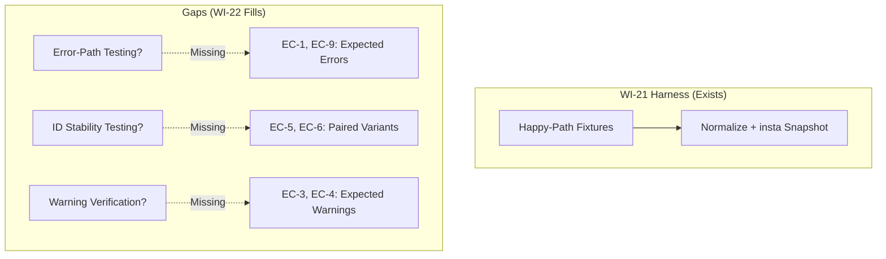
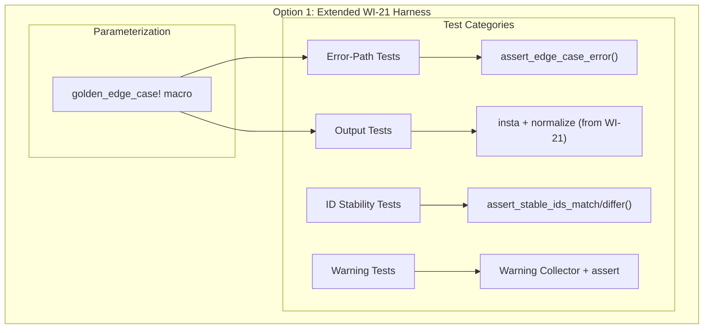
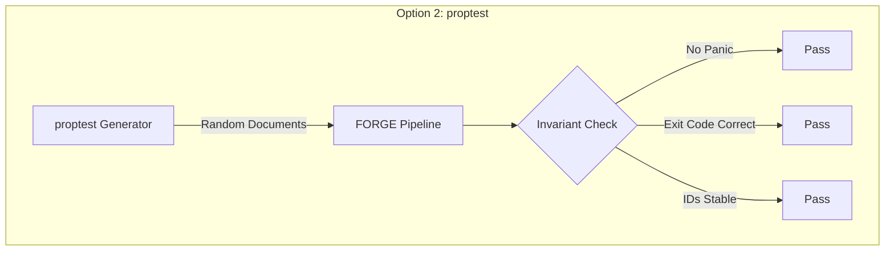
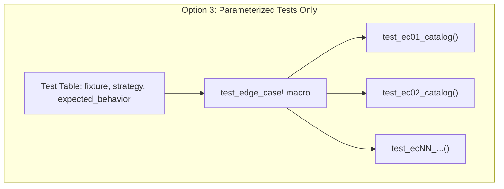
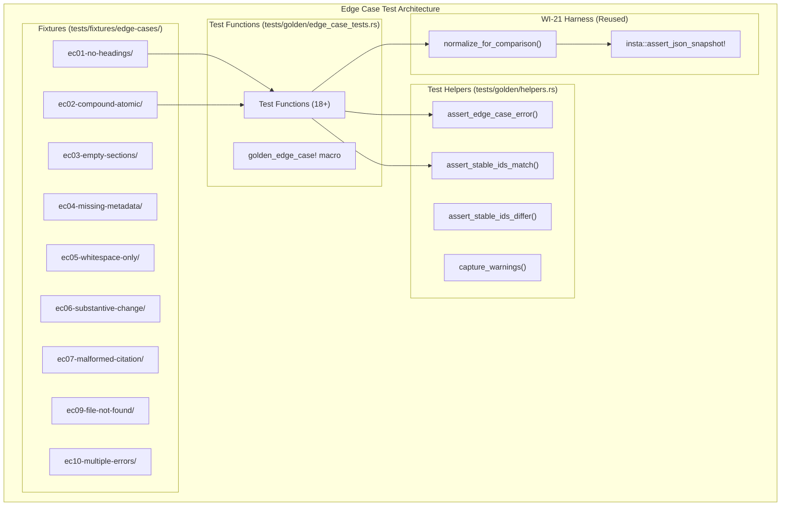
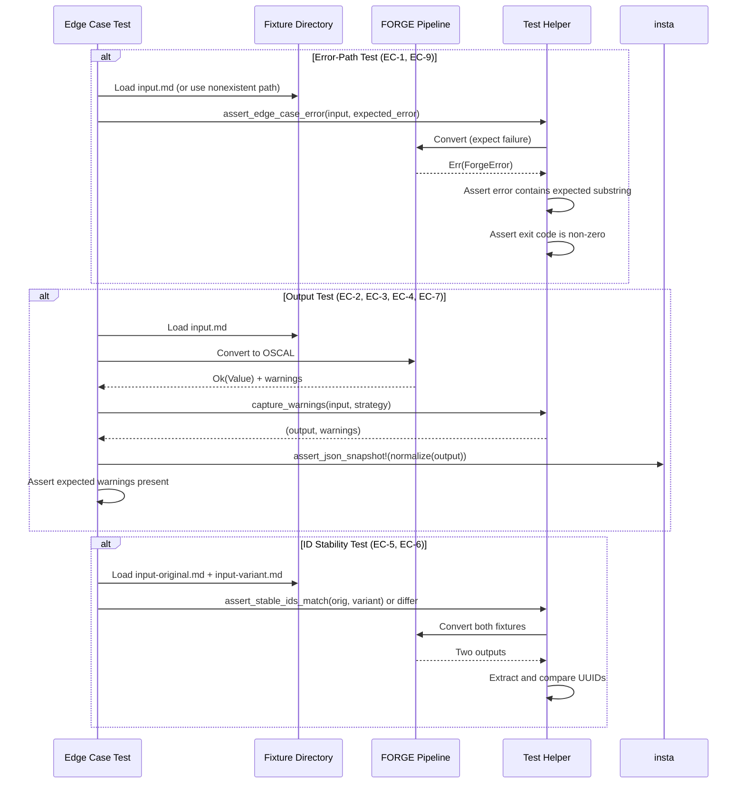

# 022-ar-golden-file-edge-cases

> **Document Type:** Architecture Review
> **Audience:** LLM agents, human reviewers
> **Status:** Proposed
> **Last Updated:** 2026-02-10 <!-- @auto -->
> **Owner:** Brian Luby <!-- @human-required -->
> **Deciders:** Brian Luby <!-- @human-required -->

---

## Review Tier Legend

| Marker | Tier | Speckit Behavior |
|--------|------|------------------|
| 🔴 `@human-required` | Human Generated | Prompt human to author; blocks until complete |
| 🟡 `@human-review` | LLM + Human Review | LLM drafts → prompt human to confirm/edit; blocks until confirmed |
| 🟢 `@llm-autonomous` | LLM Autonomous | LLM completes; no prompt; logged for audit |
| ⚪ `@auto` | Auto-generated | System fills (timestamps, links); no prompt |

---

## Document Completion Order

> ⚠️ **For LLM Agents:** Complete sections in this order. Do not fill downstream sections until upstream human-required inputs exist.

1. **Summary (Decision)** → requires human input first
2. **Context (Problem Space)** → requires human input
3. **Decision Drivers** → requires human input (prioritized)
4. **Driving Requirements** → extract from PRD, human confirms
5. **Options Considered** → LLM drafts after drivers exist, human reviews
6. **Decision (Selected + Rationale)** → requires human decision
7. **Implementation Guardrails** → LLM drafts, human reviews
8. **Everything else** → can proceed after decision is made

---

## Linkage ⚪ `@auto`

| Document | ID | Relationship |
|----------|-----|--------------|
| Parent PRD | [022-prd-golden-file-edge-cases](../PRD/022-prd-golden-file-edge-cases.md) | Requirements this architecture satisfies |
| Prerequisite AR | [021-ar-golden-file-tests](021-ar-golden-file-tests.md) | Core golden-file harness this extends |
| Security Review | N/A | Test infrastructure only |
| Supersedes | — | N/A (new capability) |
| Superseded By | — | |

---

## Summary

### Decision 🔴 `@human-required`
> Extend the WI-21 `insta`-based golden-file harness with edge case-specific test helpers for error output matching, ID stability comparison, and warning verification. Use parameterized test macros to reduce boilerplate across the 9 edge case fixtures (EC-1 through EC-10, excluding EC-8).

### TL;DR for Agents 🟡 `@human-review`
> Edge case golden-file tests extend the WI-21 `insta` harness. Fixtures live in `tests/fixtures/edge-cases/ec{NN}-{slug}/`. Each EC has a dedicated test function. Error-path tests assert on error message substrings (not exact strings) and exit codes. ID stability tests compare outputs from paired fixture variants. Use the `golden_edge_case!` parameterized macro to reduce per-test boilerplate. Do NOT create PDF/DOCX edge cases (ADR-001). Do NOT hardcode exact error messages — match on substrings to allow wording refinement. Do NOT skip testing both strategies for applicable edge cases.

---

## Context

### Problem Space 🔴 `@human-required`
WI-21 establishes the core golden-file test suite for happy-path scenarios. However, real-world policy documents frequently exhibit edge conditions: missing metadata, empty sections, compound statements, malformed citation URLs, and documents with no structural headings. The parent PRD (FORGE_PRD.md) defines ten edge cases (EC-1 through EC-10) that the pipeline must handle correctly. Without dedicated test fixtures for each, regressions in boundary behavior will go undetected. The architectural question is how to extend the WI-21 harness to handle three new test categories: (1) expected-error tests (pipeline should fail with a descriptive message), (2) expected-output-with-warnings tests (pipeline succeeds but emits warnings), and (3) paired-fixture ID stability tests (compare outputs from two document variants).

### Decision Scope 🟡 `@human-review`

**This AR decides:**
- How to extend the WI-21 golden-file harness for error output matching
- How to test ID stability across fixture variants
- How to verify warning messages for degenerate inputs
- Directory structure for edge case fixtures
- Parameterized test macro design for reducing boilerplate

**This AR does NOT decide:**
- Core golden-file harness design — decided in 021-ar-golden-file-tests
- Error handling implementation — decided in 023-ar-error-handling
- Performance testing — deferred to 024-ar-performance-benchmark

### Current State 🟢 `@llm-autonomous`
The WI-21 golden-file harness (021-ar-golden-file-tests) provides `insta`-based snapshot testing with normalization for happy-path fixtures. It supports comparing actual OSCAL JSON output against expected snapshots. However, it lacks support for: (a) asserting on error messages when the pipeline is expected to fail, (b) comparing stable IDs across paired fixture variants, and (c) verifying warning messages emitted during conversion.



### Driving Requirements 🟡 `@human-review`

| PRD Req ID | Requirement Summary | Architectural Implication |
|------------|---------------------|---------------------------|
| M-1 | EC-1 fixture: no headings → descriptive error | Error-path test helper needed |
| M-2 | EC-2 fixture: compound/atomic atomization | Standard golden-file comparison (extends WI-21) |
| M-3 | EC-3 fixture: empty sections → empty groups + warning | Warning capture and assertion needed |
| M-4 | EC-4 fixture: missing metadata → defaults + warning | Warning capture and assertion needed |
| M-5 | EC-5 fixture pair: whitespace-only → same IDs | ID comparison across paired outputs |
| M-6 | EC-6 fixture pair: substantive change → new ID + warning | ID comparison + warning assertion |
| M-7 | EC-7 fixture: malformed URL → preserved with prop | Standard golden-file comparison |
| M-8 | EC-9 fixture: file not found → filesystem error | Error-path test (no input fixture needed) |
| M-9 | EC-10 fixture: multiple validation errors → all reported | Error output golden-file comparison |
| M-10 | Both strategies tested for applicable edge cases | Parameterized tests across strategies |
| M-11 | All edge case tests pass in `cargo test` | CI integration |

**PRD Constraints inherited:**
- From constitution: TDD mandatory; `cargo test` integration; `cargo clippy -- -D warnings`
- From ADR-001: No PDF/DOCX edge cases (Markdown-only input; EC-8 skipped)

---

## Decision Drivers 🔴 `@human-required`

1. **Harness consistency:** Edge case tests must use the same framework (insta + normalization) as WI-21 core tests *(traces to PRD consistency requirement)*
2. **Error-path testability:** Must be able to assert on expected error messages and exit codes when the pipeline fails *(traces to PRD M-1, M-8)*
3. **ID stability testability:** Must be able to compare stable IDs across paired fixture variants *(traces to PRD M-5, M-6)*
4. **Boilerplate reduction:** Adding 9+ edge case tests should not require excessive per-test code *(constitution principle X)*
5. **Warning verification:** Must capture and assert on warning messages emitted during conversion *(traces to PRD M-3, M-4, M-6)*

---

## Options Considered 🟡 `@human-review`

### Option 0: Status Quo / Do Nothing

**Description:** Keep only WI-21 happy-path golden-file tests. Do not add edge case fixtures.

| Driver | Rating | Notes |
|--------|--------|-------|
| Harness consistency | N/A | No edge case harness |
| Error-path testability | ❌ Poor | Error paths untested |
| ID stability testability | ❌ Poor | ID stability untested |
| Boilerplate reduction | N/A | No tests to write |
| Warning verification | ❌ Poor | Warnings unverified |

**Why not viable:** PRD M-1 through M-11 require edge case coverage for all 9 applicable ECs. MS-4 exit criteria cannot be met without this testing.

---

### Option 1: Extend WI-21 Harness with Edge Case Helpers

**Description:** Add three new test helper categories to the existing WI-21 `insta`-based harness: (a) `assert_edge_case_error()` for expected-error tests, (b) `assert_stable_ids_match()` / `assert_stable_ids_differ()` for ID stability, and (c) warning capture via a custom warning collector. Use a `golden_edge_case!` macro for parameterized tests.



| Driver | Rating | Notes |
|--------|--------|-------|
| Harness consistency | ✅ Good | Same framework, extended with helpers |
| Error-path testability | ✅ Good | Dedicated helper captures error and asserts on message + exit code |
| ID stability testability | ✅ Good | Paired-variant helpers compare UUID sets |
| Boilerplate reduction | ✅ Good | Macro generates test boilerplate from fixture path + strategy |
| Warning verification | ✅ Good | Warning collector captures stderr or tracing output |

**Pros:**
- Consistent with WI-21 approach — no new testing framework
- Parameterized macro reduces per-test code to ~5 lines
- Error and warning helpers are reusable for future edge cases (WI-32, Phase 2)
- ID stability helpers can be used for regression testing UUID generation changes

**Cons:**
- Macro adds some complexity to the test infrastructure
- Warning capture may require hooking into the pipeline's logging/output mechanism

---

### Option 2: Property-Based Testing with `proptest`

**Description:** Use `proptest` to generate randomized edge case inputs (e.g., random documents with missing headings, empty sections, extreme whitespace). Assert on invariants (no panics, non-zero exit on error, stable IDs for identical content).



| Driver | Rating | Notes |
|--------|--------|-------|
| Harness consistency | ❌ Poor | Different framework from WI-21; not snapshot-based |
| Error-path testability | ⚠️ Medium | Can assert "no panic" but not specific error messages |
| ID stability testability | ✅ Good | Can generate paired variants and compare IDs |
| Boilerplate reduction | ⚠️ Medium | Generators require setup; each invariant needs a strategy |
| Warning verification | ❌ Poor | Random inputs make specific warning assertions impossible |

**Pros:**
- Discovers unexpected edge cases through randomized generation
- Good for invariant testing (no panics, exit codes)

**Cons:**
- Cannot verify specific expected outputs — only invariants
- Does not replace golden-file comparison for known edge cases
- Random generation may not produce the specific EC-1 through EC-10 scenarios
- Different framework from WI-21, reducing consistency

---

### Option 3: Parameterized Test Macros Only (No New Helpers)

**Description:** Use Rust's `#[test]` with parameterized macros to generate test functions from a table of fixture paths and expected behaviors. No dedicated error-path or ID stability helpers — each test writes its own assertions inline.



| Driver | Rating | Notes |
|--------|--------|-------|
| Harness consistency | ✅ Good | Uses same insta framework for output comparison |
| Error-path testability | ⚠️ Medium | Each error test has custom inline assertions — no reusable helper |
| ID stability testability | ⚠️ Medium | Each ID test has custom inline comparison — no reusable helper |
| Boilerplate reduction | ⚠️ Medium | Macro generates function shell, but assertion logic still varies per category |
| Warning verification | ⚠️ Medium | Each warning test has custom capture logic — duplicated |

**Pros:**
- Simple macro, no new helper functions
- Each test is self-contained and readable

**Cons:**
- Duplicated assertion logic across tests of the same category
- No reusable helpers for error-path, ID stability, or warning verification
- More code than Option 1 for the same coverage

---

## Decision

### Selected Option 🔴 `@human-required`
> **Option 1: Extend WI-21 Harness with Edge Case Helpers**

### Rationale 🔴 `@human-required`
Option 1 provides the best balance of consistency, testability, and boilerplate reduction. By extending the existing WI-21 `insta` harness with dedicated helpers for the three new test categories (error-path, ID stability, warning verification), each edge case test becomes a concise function that delegates to well-tested infrastructure. The parameterized macro further reduces boilerplate. Option 2 (proptest) tests different invariants than what the PRD requires — it finds unknown edge cases but cannot verify specific EC-1 through EC-10 scenarios. Option 3 duplicates assertion logic. Option 1's helpers are reusable for WI-32 (Profile golden-file tests) in Phase 2.

#### Simplest Implementation Comparison 🟡 `@human-review`

| Aspect | Simplest Possible | Selected Option | Justification for Complexity |
|--------|-------------------|-----------------|------------------------------|
| Components | Individual test functions with inline assertions | Helpers + macro + fixture directory structure | PRD M-10 requires testing both strategies for each EC; parameterization avoids 18+ nearly-identical functions |
| Dependencies | `insta` only (from WI-21) | `insta` + custom helpers | Error-path and ID stability assertions cannot be handled by `insta` alone |
| Patterns | Direct function calls | Macro-generated test functions | 9 ECs x 2 strategies = 18 tests; macro prevents copy-paste |

**Complexity justified by:** The 9 edge cases with dual-strategy testing produce 18+ test functions. Without helpers and macros, each function would repeat error matching, ID comparison, or warning capture logic. The helpers add ~100 lines of shared code but eliminate ~300 lines of duplicated assertion logic.

### Architecture Diagram 🟡 `@human-review`



---

## Technical Specification

### Component Overview 🟡 `@human-review`

| Component | Responsibility | Interface | Dependencies |
|-----------|---------------|-----------|--------------|
| assert_edge_case_error | Run pipeline on fixture, assert it fails with expected error substring and non-zero exit | `fn assert_edge_case_error(input: &str, expected_error: &str)` | FORGE library API |
| assert_stable_ids_match | Convert two fixture variants, extract IDs, assert all match | `fn assert_stable_ids_match(fixture_a: &str, fixture_b: &str)` | FORGE library API, serde_json |
| assert_stable_ids_differ | Convert two fixture variants, assert specified requirement has different ID | `fn assert_stable_ids_differ(fixture_a: &str, fixture_b: &str, changed_req: &str)` | FORGE library API, serde_json |
| capture_warnings | Run pipeline with warning capture, return warnings as Vec<String> | `fn capture_warnings(input: &str, strategy: Strategy) -> (Value, Vec<String>)` | FORGE library API |
| golden_edge_case! macro | Generate test function from fixture path, strategy, and expected behavior | `golden_edge_case!(name, fixture_dir, strategy, behavior)` | All helpers above |
| Edge Case Fixtures | Markdown inputs + expected outputs/errors per EC | File system in `tests/fixtures/edge-cases/` | None |

### Data Flow 🟢 `@llm-autonomous`



### Interface Definitions 🟡 `@human-review`

```rust
use serde_json::Value;

/// Assert that the pipeline fails with an error containing the expected substring.
/// Verifies non-zero exit behavior.
pub fn assert_edge_case_error(input_path: &str, expected_error_substring: &str) {
    // Load input (or pass nonexistent path for EC-9)
    // Run pipeline
    // Assert Err result
    // Assert error Display contains expected_error_substring
    todo!()
}

/// Assert that two fixture variants produce identical stable IDs.
/// Used for EC-5 (whitespace-only changes).
pub fn assert_stable_ids_match(fixture_a_path: &str, fixture_b_path: &str) {
    // Convert both fixtures
    // Extract all stable IDs from both outputs
    // Assert ID sets are identical
    todo!()
}

/// Assert that a specific requirement has a different stable ID between variants.
/// Used for EC-6 (substantive change).
pub fn assert_stable_ids_differ(
    fixture_a_path: &str,
    fixture_b_path: &str,
    changed_requirement_id: &str,
) {
    // Convert both fixtures
    // Extract stable IDs for the specified requirement
    // Assert the IDs differ
    // Assert all other IDs remain the same
    todo!()
}

/// Run the pipeline and capture warnings alongside the output.
pub fn convert_with_warnings(
    input: &str,
    strategy: Strategy,
) -> Result<(Value, Vec<String>), ForgeError> {
    // Run pipeline with warning capture mechanism
    // Return (output, warnings) on success
    // Return error on failure
    todo!()
}

// Parameterized macro for generating edge case test functions
// golden_edge_case!(test_ec02_catalog, "ec02-compound-atomic", Catalog, OutputMatch);
// golden_edge_case!(test_ec01_catalog, "ec01-no-headings", Catalog, ExpectError("no headings"));
```

### Key Algorithms/Patterns 🟡 `@human-review`

**Pattern:** ID Extraction for Stability Comparison
```
1. Parse OSCAL JSON output as serde_json::Value
2. Walk $.catalog.groups[*].controls[*] path
3. Extract "id" field and any "props" with name "stable-id"
4. Collect into HashMap<control_id, stable_id>
5. Compare HashMaps between two conversion outputs
6. Report matches and mismatches
```

**Pattern:** Warning Capture
```
1. Before pipeline execution, install a warning collector (Vec<String>)
2. Pipeline stages emit warnings via a shared channel or callback
3. After execution, return (output, collected_warnings)
4. Test asserts specific warning substrings are present in the collection
```

---

## Constraints & Boundaries

### Technical Constraints 🟡 `@human-review`

**Inherited from PRD:**
- EC-8 (scanned PDF) explicitly excluded per ADR-001
- All tests must pass in `cargo test`
- TDD mandatory per constitution principle IV
- Must extend WI-21 harness, not replace it

**Added by this Architecture:**
- Error assertions match on substrings, not exact strings — allows WI-23 to refine wording
- Edge case fixtures stored in `tests/fixtures/edge-cases/` (separate from core golden files)
- Warning capture mechanism must not interfere with pipeline execution
- Paired fixture variants (EC-5, EC-6) stored in the same fixture directory with `input-original.md` and `input-variant.md` naming

### Architectural Boundaries 🟡 `@human-review`

- **Owns:** `tests/fixtures/edge-cases/`, edge case test helpers, edge case test functions
- **Interfaces With:** WI-21 golden-file harness (normalization, insta), FORGE library API
- **Must Not Touch:** WI-21 core fixtures, pipeline implementation in `src/`

### Implementation Guardrails 🟡 `@human-review`

> ⚠️ **Critical for LLM Agents:**

- [x] **DO NOT** create PDF or DOCX edge case fixtures — Markdown only per ADR-001 *(PRD W-1)*
- [x] **DO NOT** hardcode exact error message strings in assertions — use substring matching to allow wording refinement *(resilience to WI-23 changes)*
- [x] **DO NOT** skip testing both strategies for applicable edge cases *(PRD M-10)*
- [x] **DO NOT** create overly synthetic fixtures that do not resemble real policy text *(PRD R-3 mitigation)*
- [x] **MUST** extend the WI-21 harness, not introduce a separate test framework *(decision driver: harness consistency)*
- [x] **MUST** test all 9 applicable edge cases (EC-1 through EC-10, excluding EC-8) *(PRD M-1 through M-9)*
- [x] **MUST** use TDD — write each edge case test before verifying the fixture produces expected output *(constitution principle IV)*

---

## Consequences 🟡 `@human-review`

### Positive
- Complete edge case coverage for all 9 applicable parent PRD edge cases
- Reusable test helpers for error-path, ID stability, and warning verification
- Parameterized macro reduces boilerplate for 18+ test functions
- Consistent with WI-21 harness — single framework for all golden-file testing

### Negative
- Macro adds complexity to test infrastructure (one-time cost)
- Warning capture mechanism may couple tests to pipeline logging approach
- Paired fixtures (EC-5, EC-6) require maintaining variant documents

### Risks & Mitigations

| Risk | Likelihood | Impact | Mitigation |
|------|------------|--------|------------|
| WI-23 not ready, causing error-path tests to fail | Med | Low | Mark error-path tests as `#[ignore]` with TODO; un-ignore when WI-23 merges |
| Warning capture mechanism breaks when logging changes | Low | Med | Use a stable warning interface (callback or channel), not log scraping |
| Edge case fixtures too synthetic | Low | Med | Base on real policy document patterns observed during WI-21 |

---

## Implementation Guidance

### Suggested Implementation Order 🟢 `@llm-autonomous`
1. Create `tests/fixtures/edge-cases/` directory structure with subdirectories for each EC
2. Implement `assert_edge_case_error()` helper and write EC-1 (no headings) and EC-9 (file not found) tests
3. Implement `convert_with_warnings()` and write EC-3 (empty sections) and EC-4 (missing metadata) tests
4. Write EC-2 (compound/atomic) and EC-7 (malformed citation) as standard golden-file output tests
5. Implement `assert_stable_ids_match()` and `assert_stable_ids_differ()` for EC-5 and EC-6
6. Write EC-10 (multiple validation errors) test
7. Create `golden_edge_case!` macro and refactor existing tests to use it
8. Add both-strategy coverage for all applicable edge cases

### Testing Strategy 🟢 `@llm-autonomous`

| Layer | Test Type | Coverage Target | Notes |
|-------|-----------|-----------------|-------|
| Integration | Edge case golden-file tests | 9 ECs x 2 strategies where applicable | Core edge case coverage |
| Unit | Test helper functions | 100% branch coverage | Error assertion, ID comparison, warning capture |
| Unit | Macro-generated tests | Verify macro produces correct function signatures | Compile-time verification |

### Anti-patterns to Avoid 🟡 `@human-review`
- **Don't:** Hardcode exact error message strings in assertions
  - **Why:** WI-23 will refine error messages; exact matches will break
  - **Instead:** Use `.contains("no headings")` or similar substring matching
- **Don't:** Test only one strategy per edge case when both are applicable
  - **Why:** Bugs may manifest in one strategy but not the other
  - **Instead:** Parameterize each applicable edge case with both catalog and component strategies
- **Don't:** Skip EC-10 because it is harder to test
  - **Why:** Multiple error reporting is one of the most important edge cases for user experience
  - **Instead:** Create a deliberately invalid OSCAL artifact and assert all errors appear

---

## Compliance & Cross-cutting Concerns

### Security Considerations 🟡 `@human-review`
- Authentication: N/A — test infrastructure only
- Authorization: N/A
- Data handling: Edge case fixtures are synthetic test data, not real organizational policies

### Observability 🟢 `@llm-autonomous`
- **Logging:** Not applicable — test infrastructure
- **Metrics:** Edge case pass/fail counts in `cargo test` output
- **Tracing:** Not applicable

### Error Handling Strategy 🟢 `@llm-autonomous`
```
Error Category → Handling Approach
├── Missing fixture file → Test panics with descriptive message (test setup error)
├── Pipeline error on error-path test → Expected: assert error contains substring
├── Pipeline error on output test → Unexpected: test fails (regression detected)
├── ID mismatch on stability test → Test fails with ID diff report
└── Warning missing on warning test → Test fails listing expected vs actual warnings
```

---

## Migration Plan (if applicable) 🟡 `@human-review`

N/A — extends WI-21 infrastructure. No migration required.

### Rollback Plan 🔴 `@human-required`

N/A — test infrastructure only. If the macro approach proves overly complex, replace with explicit test functions using the helper functions directly (Option 3 fallback).

---

## Open Questions 🟡 `@human-review`

No open questions for this work item.

---

## Changelog ⚪ `@auto`

| Version | Date | Author | Changes |
|---------|------|--------|---------|
| 0.1 | 2026-02-10 | LLM (Claude) | Initial proposal |

---

## Decision Record ⚪ `@auto`

| Date | Event | Details |
|------|-------|---------|
| 2026-02-10 | Proposed | Initial draft created from PRD 022 |

---

## Traceability Matrix 🟢 `@llm-autonomous`

| PRD Req ID | Decision Driver | Option Rating | Component | Notes |
|------------|-----------------|---------------|-----------|-------|
| M-1 | Error-path testability | Option 1: ✅ | assert_edge_case_error | EC-1: no headings → descriptive error |
| M-2 | Harness consistency | Option 1: ✅ | insta + normalize (WI-21) | EC-2: compound/atomic atomization golden file |
| M-3 | Warning verification | Option 1: ✅ | capture_warnings | EC-3: empty sections → warning |
| M-4 | Warning verification | Option 1: ✅ | capture_warnings | EC-4: missing metadata → defaults + warning |
| M-5 | ID stability testability | Option 1: ✅ | assert_stable_ids_match | EC-5: whitespace-only → same IDs |
| M-6 | ID stability testability | Option 1: ✅ | assert_stable_ids_differ | EC-6: substantive change → new ID |
| M-7 | Harness consistency | Option 1: ✅ | insta + normalize (WI-21) | EC-7: malformed URL → preserved with prop |
| M-8 | Error-path testability | Option 1: ✅ | assert_edge_case_error | EC-9: file not found → filesystem error |
| M-9 | Error-path testability | Option 1: ✅ | assert_edge_case_error | EC-10: multiple errors → all reported |
| M-10 | Boilerplate reduction | Option 1: ✅ | golden_edge_case! macro | Both strategies tested per EC |
| M-11 | Harness consistency | Option 1: ✅ | cargo test integration | All tests pass in CI |

---

## Review Checklist 🟢 `@llm-autonomous`

Before marking as Accepted:
- [x] All PRD Must Have requirements appear in Driving Requirements
- [x] Option 0 (Status Quo) is documented
- [x] Simplest Implementation comparison is completed
- [x] Decision drivers are prioritized and addressed
- [x] At least 2 options were seriously considered
- [x] Constraints distinguish inherited vs. new
- [x] Component names are consistent across all diagrams and tables
- [x] Implementation guardrails reference specific PRD constraints
- [x] Rollback triggers and authority are defined (N/A — test infrastructure)
- [x] Security review is linked or N/A documented
- [x] No open questions blocking implementation
