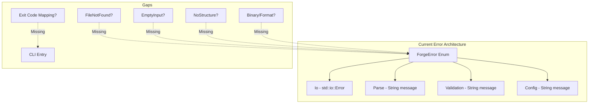
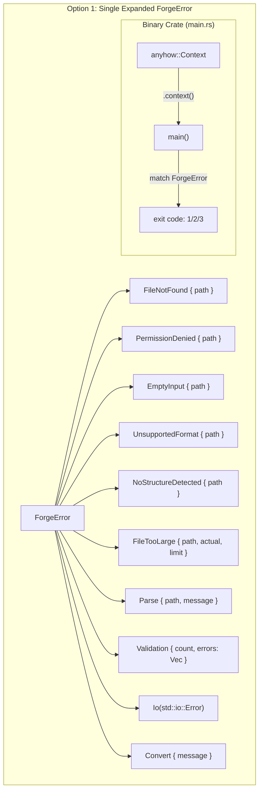
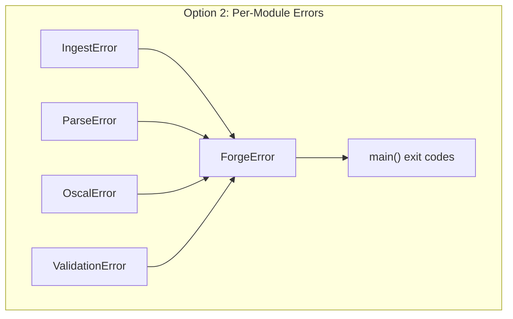
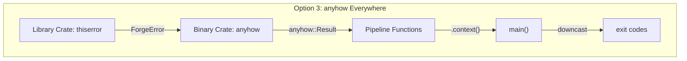
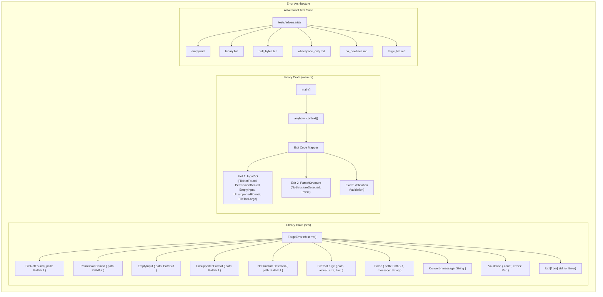
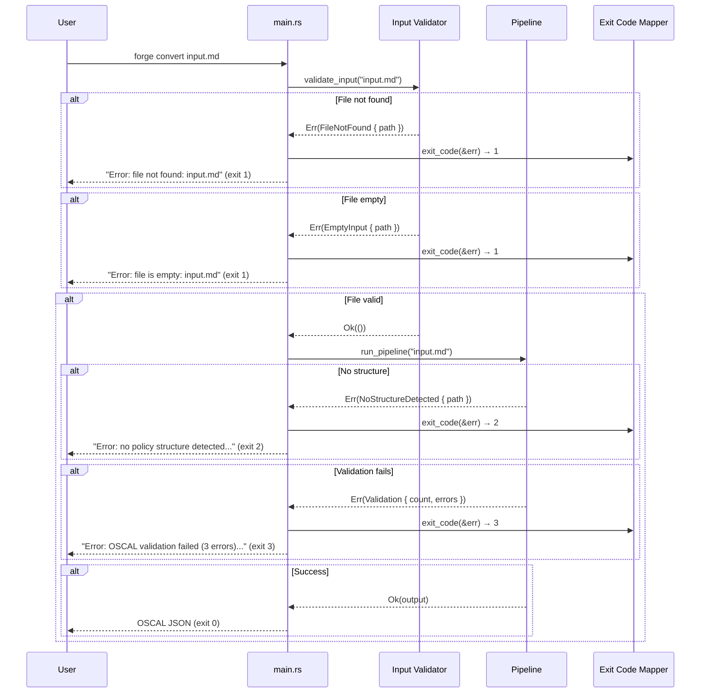
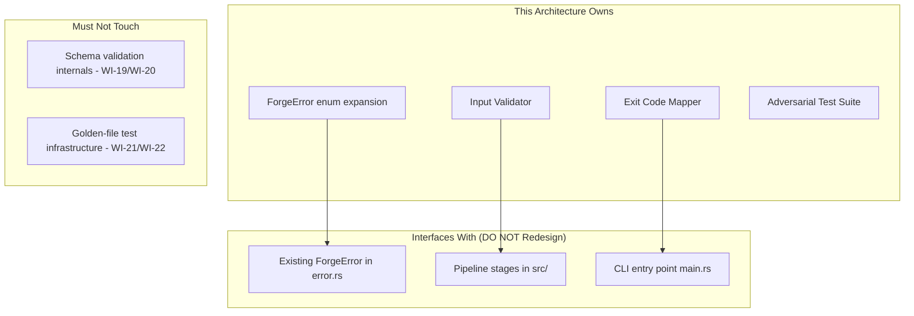

# 023-ar-error-handling

> **Document Type:** Architecture Review
> **Audience:** LLM agents, human reviewers
> **Status:** Proposed
> **Last Updated:** 2026-02-10 <!-- @auto -->
> **Owner:** Brian Luby <!-- @human-required -->
> **Deciders:** Brian Luby <!-- @human-required -->

---

## Review Tier Legend

| Marker | Tier | Speckit Behavior |
|--------|------|------------------|
| 🔴 `@human-required` | Human Generated | Prompt human to author; blocks until complete |
| 🟡 `@human-review` | LLM + Human Review | LLM drafts → prompt human to confirm/edit; blocks until confirmed |
| 🟢 `@llm-autonomous` | LLM Autonomous | LLM completes; no prompt; logged for audit |
| ⚪ `@auto` | Auto-generated | System fills (timestamps, links); no prompt |

---

## Document Completion Order

> ⚠️ **For LLM Agents:** Complete sections in this order. Do not fill downstream sections until upstream human-required inputs exist.

1. **Summary (Decision)** → requires human input first
2. **Context (Problem Space)** → requires human input
3. **Decision Drivers** → requires human input (prioritized)
4. **Driving Requirements** → extract from PRD, human confirms
5. **Options Considered** → LLM drafts after drivers exist, human reviews
6. **Decision (Selected + Rationale)** → requires human decision
7. **Implementation Guardrails** → LLM drafts, human reviews
8. **Everything else** → can proceed after decision is made

---

## Linkage ⚪ `@auto`

| Document | ID | Relationship |
|----------|-----|--------------|
| Parent PRD | [023-prd-error-handling](../PRD/023-prd-error-handling.md) | Requirements this architecture satisfies |
| Security Review | N/A | Error handling is a security boundary; security review in PRD |
| Supersedes | — | Extends error types from 001-ar-project-scaffolding |
| Superseded By | — | |

---

## Summary

### Decision 🔴 `@human-required`
> Use `anyhow` with `.context()` in the binary crate for error context propagation, with `thiserror`-based `ForgeError` enum variants in the library crate for each error category. Map error variants to distinct exit codes (1=input, 2=parse, 3=validation) in the CLI entry point. Perform a systematic `.unwrap()` audit across all production code.

### TL;DR for Agents 🟡 `@human-review`
> FORGE uses `thiserror` for structured library errors and `anyhow` with `.context()` in the binary crate. Every error path must produce a descriptive message containing what failed, which input caused it, and how to fix it. The `ForgeError` enum gets new variants: `FileNotFound`, `EmptyInput`, `UnsupportedFormat`, `NoStructureDetected`, `FileTooLarge`. Exit codes: 1=input/IO, 2=parse/structure, 3=validation. Do NOT use `.unwrap()` in production code without a documented invariant. Do NOT expose internal module names or Rust type names in user-facing messages. Do NOT use `panic!()`, `todo!()`, or `unimplemented!()` in production code paths. MUST audit all production code for unhandled error paths.

---

## Context

### Problem Space 🔴 `@human-required`
The FORGE pipeline has been built incrementally across 22 sprints. Individual stages handle their own error paths, but no systematic audit has ensured that every error path across the entire pipeline produces a descriptive, user-actionable message with a non-zero exit code. Some code paths may still use `.unwrap()` or `.expect()`, which would panic on unexpected input. Malformed, empty, or binary input files may produce cryptic errors or panics. The architecture must decide how to structure error types across modules, how to propagate context through the pipeline, and how to map errors to CLI exit codes.

### Decision Scope 🟡 `@human-review`

**This AR decides:**
- Error type structure: single enum vs per-module enums vs hybrid approach
- Context propagation strategy: how call-site information flows through the pipeline
- Exit code mapping strategy: how error types map to CLI exit codes
- Adversarial input handling: how malformed/binary/empty input is detected and reported
- `.unwrap()` audit approach and replacement strategy

**This AR does NOT decide:**
- Rich terminal diagnostics (miette integration) — deferred to WI-25 CLI polish
- Error handling for XML/YAML output — deferred to Phase 2
- Error handling for Profile generation — deferred to Phase 2
- Fuzz testing infrastructure — deferred; manual adversarial corpus is sufficient

### Current State 🟢 `@llm-autonomous`
The project scaffolding (WI-1) established a basic `ForgeError` enum with `thiserror`, containing `Io`, `Parse`, `Validation`, and `Config` variants. WI-19 and WI-20 expanded error handling for schema validation with actionable error reporting. However, the following gaps remain:

- No dedicated error variants for: file not found, empty input, binary input, no structure detected, file too large
- Context propagation (`.context()`) may be inconsistent across pipeline stages
- Exit codes may not distinguish error categories
- `.unwrap()` calls in production code have not been audited
- Adversarial inputs (binary files, null bytes, huge files) may cause panics



### Driving Requirements 🟡 `@human-review`

| PRD Req ID | Requirement Summary | Architectural Implication |
|------------|---------------------|---------------------------|
| M-1 | Non-zero exit codes for all error conditions | Exit code mapping from ForgeError to integer |
| M-2 | Descriptive, user-actionable error messages | Every variant Display must include what/where/how-to-fix |
| M-3 | No panics on any input including adversarial | `.unwrap()` audit; input validation at pipeline entry |
| M-4 | Audit and replace `.unwrap()` / `.expect()` in production code | Systematic code audit required |
| M-5 | `.context()` on all error propagation paths | anyhow context in binary crate; thiserror source chains in library |
| M-6 | File not found → message includes path | Dedicated `FileNotFound { path }` variant |
| M-7 | Empty file → descriptive message | Dedicated `EmptyInput { path }` variant |
| M-8 | No structure detected → expected format guidance | Dedicated `NoStructureDetected { path }` variant |
| M-9 | Multiple validation errors all reported | Validation variant carries `Vec<ValidationDetail>` |
| M-10 | Adversarial input test suite | Test infrastructure for edge case inputs |

**PRD Constraints inherited:**
- From constitution principle VIII: `thiserror` for library, `anyhow` only in binary; no stringly-typed errors
- From constitution principle X: Error messages should be clear, not clever
- From PRD: No exposing internal module names or Rust types in user-facing messages

---

## Decision Drivers 🔴 `@human-required`

1. **User-actionable messages:** Every error must tell the user what failed, which input caused it, and how to fix it *(traces to PRD M-2)*
2. **No panics guarantee:** Zero panics on any input, including adversarial *(traces to PRD M-3)*
3. **Structured error types:** Errors must be typed enums with meaningful variants, not stringly-typed *(constitution principle VIII)*
4. **Exit code classification:** Different error categories must produce distinct exit codes for programmatic use *(traces to PRD S-4)*
5. **Minimal refactoring:** Extend existing `ForgeError` rather than redesigning the error system *(constitution principle X, YAGNI)*

---

## Options Considered 🟡 `@human-review`

### Option 0: Status Quo / Do Nothing

**Description:** Keep the existing `ForgeError` enum with its current 4 variants. Do not audit `.unwrap()` calls or add context propagation.

| Driver | Rating | Notes |
|--------|--------|-------|
| User-actionable messages | ❌ Poor | Parse(String) and Validation(String) are stringly-typed |
| No panics guarantee | ❌ Poor | `.unwrap()` calls unaudited; adversarial input untested |
| Structured error types | ⚠️ Medium | Basic enum exists but variants are too coarse |
| Exit code classification | ❌ Poor | All errors produce the same exit code |
| Minimal refactoring | ✅ Good | No changes needed |

**Why not viable:** PRD M-1 through M-10 are unmet. MS-4 exit criteria require comprehensive error handling.

---

### Option 1: Single `ForgeError` Enum with Expanded Variants (Recommended)

**Description:** Expand the existing `ForgeError` enum with new variants for each error category. Each variant carries structured data (PathBuf, message, count). Use `thiserror` derive for `Display` and `Error`. In the binary crate, use `anyhow::Context` for `.context()` propagation. Map `ForgeError` variants to exit codes in `main()`.



| Driver | Rating | Notes |
|--------|--------|-------|
| User-actionable messages | ✅ Good | Each variant's Display includes path, description, and guidance |
| No panics guarantee | ✅ Good | `.unwrap()` audit + adversarial tests |
| Structured error types | ✅ Good | Typed variants with structured data |
| Exit code classification | ✅ Good | Match on variant → distinct exit code |
| Minimal refactoring | ✅ Good | Extends existing enum; no redesign |

**Pros:**
- Single enum keeps error handling simple and centralized
- Each variant carries enough context to produce an actionable message
- Exit code mapping is a simple `match` in `main()`
- Consistent with WI-1 scaffolding decision and constitution principle VIII
- `From<std::io::Error>` conversion can inspect `ErrorKind` to route to `FileNotFound` vs `PermissionDenied`

**Cons:**
- Enum may grow large as more features are added in Phase 2/3
- All pipeline stages share one error type — less modular than per-module errors

---

### Option 2: Error Per Module with `From` Conversions

**Description:** Define separate error enums for each pipeline module (`IngestError`, `ParseError`, `OscalError`, `ValidationError`). Each module owns its error type. A top-level `ForgeError` wraps module errors via `From` implementations.



| Driver | Rating | Notes |
|--------|--------|-------|
| User-actionable messages | ✅ Good | Each module defines its own actionable messages |
| No panics guarantee | ✅ Good | Same audit process as Option 1 |
| Structured error types | ✅ Good | Fine-grained per-module typing |
| Exit code classification | ✅ Good | Map module error type → exit code |
| Minimal refactoring | ❌ Poor | Requires splitting existing ForgeError into 4-5 separate enums + From impls |

**Pros:**
- Each module owns its error types — cleaner boundaries
- Module errors can evolve independently
- Follows the pattern from constitution principle VIII (structured errors per concern)

**Cons:**
- Significant refactoring of existing code — every `?` propagation site must update
- More boilerplate: 4-5 error enums + `From` implementations + top-level wrapper
- Over-engineering for the current codebase size — the pipeline has ~7 stages but shares a single crate
- Violates minimal refactoring driver — this is a redesign, not a hardening pass

---

### Option 3: `anyhow` for Application + `thiserror` for Library

**Description:** Use `anyhow::Error` as the universal error type throughout the binary crate, with `thiserror` only in shared library code. Pipeline functions return `anyhow::Result<T>` instead of `Result<T, ForgeError>`.



| Driver | Rating | Notes |
|--------|--------|-------|
| User-actionable messages | ⚠️ Medium | `.context()` adds messages but downcasting for specific guidance is cumbersome |
| No panics guarantee | ✅ Good | Same audit process |
| Structured error types | ⚠️ Medium | anyhow erases types — exit code classification requires downcast |
| Exit code classification | ⚠️ Medium | Must `downcast_ref::<ForgeError>()` to determine category; fragile |
| Minimal refactoring | ⚠️ Medium | Must change all function signatures in binary crate to `anyhow::Result` |

**Pros:**
- `.context()` available everywhere without wrapper boilerplate
- Simple error propagation with `?`

**Cons:**
- Type erasure makes exit code classification fragile — downcasting can miss new error types
- Constitution says `anyhow` only in binary crate, not library — this stretches that boundary
- User-facing messages depend on context chain rather than structured variant Display
- Harder to programmatically distinguish error categories

---

## Decision

### Selected Option 🔴 `@human-required`
> **Option 1: Single `ForgeError` Enum with Expanded Variants**

### Rationale 🔴 `@human-required`
Option 1 is the best fit because it extends the existing error architecture (minimal refactoring), provides structured typing for exit code classification (typed variants, not downcasting), and produces user-actionable messages through `thiserror` `Display` implementations. Option 2 (per-module errors) would require significant refactoring of every `?` site in the codebase — disproportionate effort for a hardening sprint. Option 3 (anyhow everywhere) erases type information needed for exit code mapping. Constitution principle VIII endorses `thiserror` for library types, and principle X (YAGNI) favors extending what exists over redesigning.

#### Simplest Implementation Comparison 🟡 `@human-review`

| Aspect | Simplest Possible | Selected Option | Justification for Complexity |
|--------|-------------------|-----------------|------------------------------|
| Components | Keep 4 variants, no new ones | 10+ variants with structured data | PRD M-6/M-7/M-8 require specific error variants for file-not-found, empty, no-structure |
| Dependencies | thiserror only | thiserror + anyhow (binary crate) | `.context()` required by PRD M-5 for call-site information |
| Patterns | Single exit code | Exit code mapping (1/2/3) | PRD S-4 requires distinct codes for programmatic classification |

**Complexity justified by:** PRD M-1 through M-10 require specific error handling behaviors that the current 4-variant enum cannot express. Adding variants is the minimal change to meet requirements.

### Architecture Diagram 🟡 `@human-review`



---

## Technical Specification

### Component Overview 🟡 `@human-review`

| Component | Responsibility | Interface | Dependencies |
|-----------|---------------|-----------|--------------|
| ForgeError enum | Structured error types for all pipeline stages | `#[derive(Debug, thiserror::Error)]` | thiserror |
| Input Validator | Check file existence, readability, emptiness, binary detection | `fn validate_input(path: &Path) -> Result<(), ForgeError>` | std::fs |
| Context Propagation | Add call-site information to errors in binary crate | `.context("while ingesting {path}")` | anyhow |
| Exit Code Mapper | Map ForgeError variants to distinct integer exit codes | `fn exit_code(err: &ForgeError) -> i32` | ForgeError |
| Adversarial Test Suite | Test all adversarial input scenarios for no-panic guarantee | Integration tests in `tests/adversarial/` | FORGE binary |

### Data Flow 🟢 `@llm-autonomous`



### Interface Definitions 🟡 `@human-review`

```rust
use std::path::PathBuf;
use thiserror::Error;

/// Comprehensive error type for the FORGE pipeline.
/// Each variant produces a user-actionable message via Display.
#[derive(Debug, Error)]
pub enum ForgeError {
    #[error("File not found: {path}")]
    FileNotFound { path: PathBuf },

    #[error("Permission denied: {path}")]
    PermissionDenied { path: PathBuf },

    #[error("File is empty: {path} — provide a non-empty Markdown policy document")]
    EmptyInput { path: PathBuf },

    #[error("Unsupported file format (appears to be binary): {path} — FORGE accepts Markdown (.md) files")]
    UnsupportedFormat { path: PathBuf },

    #[error("No policy structure detected in {path} — expected Markdown headings (# Section) or numbered clauses")]
    NoStructureDetected { path: PathBuf },

    #[error("File exceeds size limit ({actual_size} bytes, limit: {limit} bytes): {path}")]
    FileTooLarge {
        path: PathBuf,
        actual_size: u64,
        limit: u64,
    },

    #[error("Parse error in {path}: {message}")]
    Parse { path: PathBuf, message: String },

    #[error("Conversion failed: {message}")]
    Convert { message: String },

    #[error("OSCAL validation failed ({count} error(s))")]
    Validation {
        count: usize,
        errors: Vec<ValidationDetail>,
    },

    #[error(transparent)]
    Io(#[from] std::io::Error),
}

/// Detail of a single validation error.
#[derive(Debug)]
pub struct ValidationDetail {
    pub field_path: String,
    pub expected: String,
    pub actual: String,
    pub message: String,
}

/// Map ForgeError variants to CLI exit codes.
pub fn exit_code(err: &ForgeError) -> i32 {
    match err {
        ForgeError::FileNotFound { .. }
        | ForgeError::PermissionDenied { .. }
        | ForgeError::EmptyInput { .. }
        | ForgeError::UnsupportedFormat { .. }
        | ForgeError::FileTooLarge { .. }
        | ForgeError::Io(_) => 1, // Input/IO errors

        ForgeError::NoStructureDetected { .. }
        | ForgeError::Parse { .. }
        | ForgeError::Convert { .. } => 2, // Parse/structure errors

        ForgeError::Validation { .. } => 3, // Validation errors
    }
}

/// Validate input file before pipeline execution.
/// Returns specific ForgeError variants for each failure condition.
pub fn validate_input(path: &std::path::Path) -> Result<String, ForgeError> {
    // Check existence → FileNotFound
    // Check permissions → PermissionDenied
    // Check emptiness → EmptyInput
    // Check binary content → UnsupportedFormat
    // Check size limit → FileTooLarge
    // Read and return content
    todo!()
}
```

### Key Algorithms/Patterns 🟡 `@human-review`

**Pattern:** Binary File Detection
```
1. Read first 512 bytes of file
2. Count null bytes (0x00) in the sample
3. If null byte ratio > 10%, classify as binary
4. Also check for known binary file signatures (PNG, JPEG, PDF magic bytes)
5. Return UnsupportedFormat error if binary detected
```

**Pattern:** `.unwrap()` Audit Process
```
1. Run: grep -rn '\.unwrap()' src/ --include='*.rs' (excluding #[cfg(test)])
2. For each occurrence:
   a. If invariant is provably upheld: add // SAFETY: comment explaining why
   b. Otherwise: replace with ? and appropriate ForgeError variant
3. Run: grep -rn '\.expect(' src/ --include='*.rs' (excluding #[cfg(test)])
4. Apply same assessment
5. Run: grep -rn 'panic!\\|todo!\\|unimplemented!' src/ --include='*.rs'
6. Replace with ForgeError returns
```

---

## Constraints & Boundaries

### Technical Constraints 🟡 `@human-review`

**Inherited from PRD:**
- `thiserror` for library error types (constitution principle VIII)
- `anyhow` only in binary crate (constitution principle VIII)
- No `.unwrap()` without documented invariant
- Error messages must not expose internal module names or Rust types
- No `panic!()`, `todo!()`, or `unimplemented!()` in production code

**Added by this Architecture:**
- Exit codes: 1 = input/IO, 2 = parse/structure, 3 = validation
- Binary detection threshold: >10% null bytes in first 512 bytes
- File size warning threshold: 50MB (configurable via constant)
- Input validation runs before pipeline stages — fail fast on invalid input
- All `ForgeError` Display implementations must follow pattern: "Error: what happened: context — how to fix"

### Architectural Boundaries 🟡 `@human-review`



- **Owns:** ForgeError enum expansion, input validator, exit code mapper, adversarial tests
- **Interfaces With:** Existing error types, pipeline stages, CLI entry point
- **Must Not Touch:** Schema validation internals (WI-19/WI-20), golden-file infrastructure (WI-21/WI-22)

### Implementation Guardrails 🟡 `@human-review`

> ⚠️ **Critical for LLM Agents:**

- [x] **DO NOT** use `.unwrap()` in production code without a `// SAFETY:` comment explaining why the invariant holds *(PRD M-4)*
- [x] **DO NOT** use `panic!()`, `todo!()`, or `unimplemented!()` in production code paths *(PRD M-3)*
- [x] **DO NOT** expose internal module names, Rust type names, or stack traces in user-facing error messages *(PRD constraint)*
- [x] **DO NOT** use generic "An error occurred" messages — every message must specify what failed and why *(PRD M-2)*
- [x] **DO NOT** swallow errors with `let _ = ...` or `.ok()` unless failure is genuinely inconsequential and documented *(constitution principle VIII)*
- [x] **MUST** return non-zero exit codes for every error condition *(PRD M-1)*
- [x] **MUST** use `.context()` at pipeline stage boundaries for error chain context *(PRD M-5)*
- [x] **MUST** include an adversarial input test suite covering empty, binary, null-byte, huge, and no-newline files *(PRD M-10)*
- [x] **MUST** report all validation errors, not just the first one *(PRD M-9)*

---

## Consequences 🟡 `@human-review`

### Positive
- Every error path produces a descriptive, user-actionable message
- No panics on any input — FORGE is safe for automated pipelines and untrusted input
- Distinct exit codes enable programmatic error classification in CI/CD
- `.unwrap()` audit eliminates a class of potential runtime failures
- Context propagation provides full error chains for debugging

### Negative
- ForgeError enum grows from 4 to 10+ variants — more code to maintain
- `.context()` calls add boilerplate at pipeline stage boundaries
- Binary detection heuristic may produce false positives on unusual text encodings

### Risks & Mitigations

| Risk | Likelihood | Impact | Mitigation |
|------|------------|--------|------------|
| Hidden `.unwrap()` in dependencies cause panics | Low | Med | Audit direct dependency code paths; wrap external calls in `catch_unwind` as last resort |
| Error messages become too verbose | Med | Low | Follow "what + where + how-to-fix" pattern; review with user persona |
| Binary detection false positives | Low | Low | Check known binary signatures first; only use null-byte heuristic as fallback |

---

## Implementation Guidance

### Suggested Implementation Order 🟢 `@llm-autonomous`
1. **Audit Phase:** `grep -rn '.unwrap()' src/` and document all occurrences
2. **Expand ForgeError:** Add new variants (`FileNotFound`, `EmptyInput`, `UnsupportedFormat`, `NoStructureDetected`, `FileTooLarge`)
3. **Input Validator:** Implement `validate_input()` with early-return on first error
4. **Replace `.unwrap()`:** Systematically replace each audited `.unwrap()` with `?` and appropriate variant
5. **Context Propagation:** Add `.context()` at pipeline stage boundaries in `main.rs`
6. **Exit Code Mapper:** Implement `exit_code()` function and wire into `main()`
7. **Adversarial Test Suite:** Create test fixtures and integration tests
8. **Final Audit:** Re-run grep to confirm zero unreviewed `.unwrap()` instances

### Testing Strategy 🟢 `@llm-autonomous`

| Layer | Test Type | Coverage Target | Notes |
|-------|-----------|-----------------|-------|
| Unit | ForgeError Display output | 100% of variants | Each variant produces actionable message |
| Unit | exit_code() mapping | 100% of variants | Each variant maps to correct exit code |
| Unit | validate_input() | All conditions | FileNotFound, Empty, Binary, TooLarge |
| Integration | Adversarial inputs | 6+ input types | No panics, correct exit codes, descriptive messages |
| Integration | Pipeline error paths | All stage failures | Context chain present in error output |

### Anti-patterns to Avoid 🟡 `@human-review`
- **Don't:** Use `catch_unwind` as a primary error handling strategy
  - **Why:** It hides the root cause and catches panics that should be fixed
  - **Instead:** Fix the `.unwrap()` or `panic!()` at the source
- **Don't:** Add a catch-all `Other(String)` variant as a dumping ground
  - **Why:** Defeats the purpose of structured error types
  - **Instead:** Add specific variants for each error category
- **Don't:** Over-engineer exit codes with complex numbering schemes
  - **Why:** Users and scripts rarely need more than 3-4 categories
  - **Instead:** Use simple values: 1=input, 2=parse, 3=validation

---

## Compliance & Cross-cutting Concerns

### Security Considerations 🟡 `@human-review`
- Authentication: N/A — local CLI tool
- Authorization: N/A
- Data handling: Error messages must not leak internal filesystem paths beyond user-provided input path; no stack traces in user-facing output
- Input validation: Malformed input must not cause panics, buffer overflows, or information leakage

### Observability 🟢 `@llm-autonomous`
- **Logging:** Error context chains logged at DEBUG level when `--verbose` is active
- **Metrics:** Not applicable for CLI tool
- **Tracing:** Error propagation uses `anyhow` context chains, visible with `RUST_BACKTRACE=1` for developer debugging

### Error Handling Strategy 🟢 `@llm-autonomous`
```
Error Category → Exit Code → Handling Approach
├── Input/IO (file not found, permission, empty, binary, too large) → Exit 1
├── Parse/Structure (no structure, parse failure) → Exit 2
├── Validation (schema errors, semantic errors) → Exit 3
└── Success → Exit 0
```

---

## Migration Plan (if applicable) 🟡 `@human-review`

### From Current State to Target State

This is a hardening pass, not a migration. The existing `ForgeError` enum is extended in-place with new variants. Existing code using `ForgeError::Io` and `ForgeError::Parse` continues to work. New variants are added for previously unhandled conditions.

### Rollback Plan 🔴 `@human-required`

N/A — error handling improvements are strictly additive. Reverting would reintroduce panics and unhelpful error messages, which is not acceptable. If a specific variant's Display wording is wrong, it can be corrected without architectural rollback.

---

## Open Questions 🟡 `@human-review`

No open questions for this work item.

---

## Changelog ⚪ `@auto`

| Version | Date | Author | Changes |
|---------|------|--------|---------|
| 0.1 | 2026-02-10 | LLM (Claude) | Initial proposal |

---

## Decision Record ⚪ `@auto`

| Date | Event | Details |
|------|-------|---------|
| 2026-02-10 | Proposed | Initial draft created from PRD 023 |

---

## Traceability Matrix 🟢 `@llm-autonomous`

| PRD Req ID | Decision Driver | Option Rating | Component | Notes |
|------------|-----------------|---------------|-----------|-------|
| M-1 | Exit code classification | Option 1: ✅ | Exit Code Mapper | Non-zero exit for all errors |
| M-2 | User-actionable messages | Option 1: ✅ | ForgeError Display | What/where/how-to-fix pattern |
| M-3 | No panics guarantee | Option 1: ✅ | `.unwrap()` audit + Input Validator | Zero panics on adversarial input |
| M-4 | No panics guarantee | Option 1: ✅ | `.unwrap()` audit | All occurrences reviewed |
| M-5 | User-actionable messages | Option 1: ✅ | Context Propagation | `.context()` at stage boundaries |
| M-6 | Structured error types | Option 1: ✅ | ForgeError::FileNotFound | Path included in message |
| M-7 | Structured error types | Option 1: ✅ | ForgeError::EmptyInput | Descriptive message |
| M-8 | Structured error types | Option 1: ✅ | ForgeError::NoStructureDetected | Expected format guidance |
| M-9 | User-actionable messages | Option 1: ✅ | ForgeError::Validation | Vec<ValidationDetail> carries all errors |
| M-10 | No panics guarantee | Option 1: ✅ | Adversarial Test Suite | 6+ adversarial input types tested |

---

## Review Checklist 🟢 `@llm-autonomous`

Before marking as Accepted:
- [x] All PRD Must Have requirements appear in Driving Requirements
- [x] Option 0 (Status Quo) is documented
- [x] Simplest Implementation comparison is completed
- [x] Decision drivers are prioritized and addressed
- [x] At least 2 options were seriously considered
- [x] Constraints distinguish inherited vs. new
- [x] Component names are consistent across all diagrams and tables
- [x] Implementation guardrails reference specific PRD constraints
- [x] Rollback triggers and authority are defined (N/A — additive improvements)
- [x] Security review is linked or N/A documented
- [x] No open questions blocking implementation
