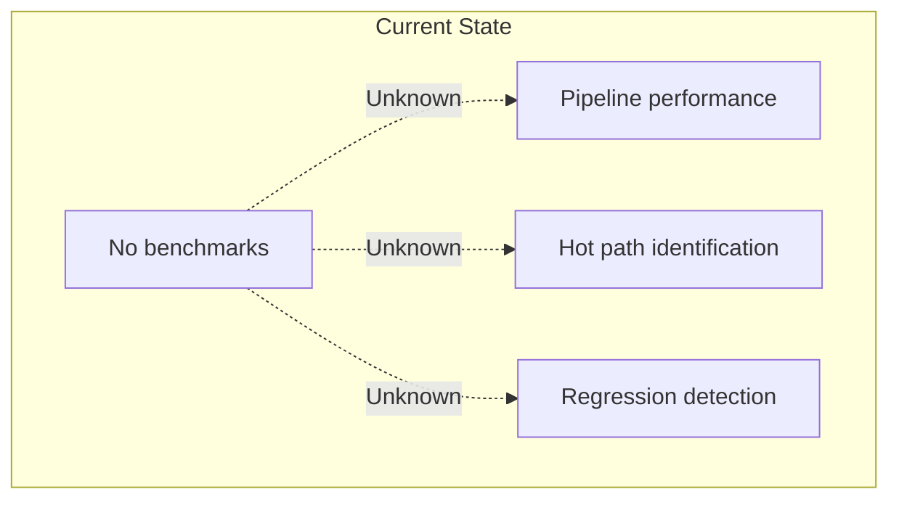
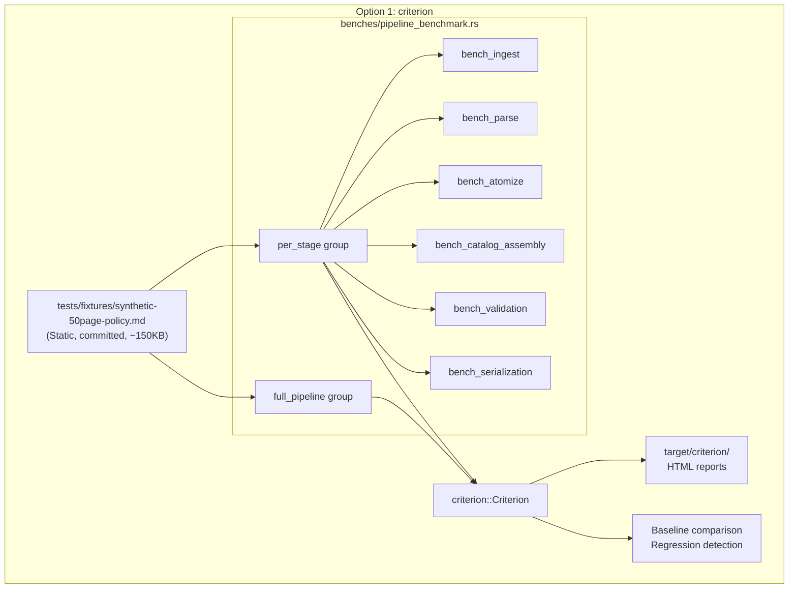
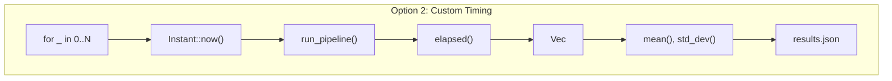
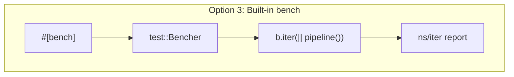
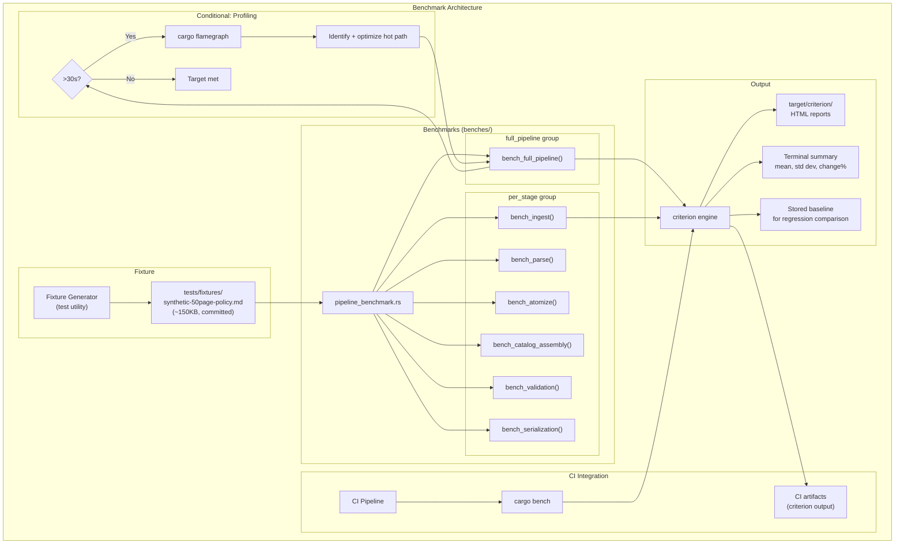
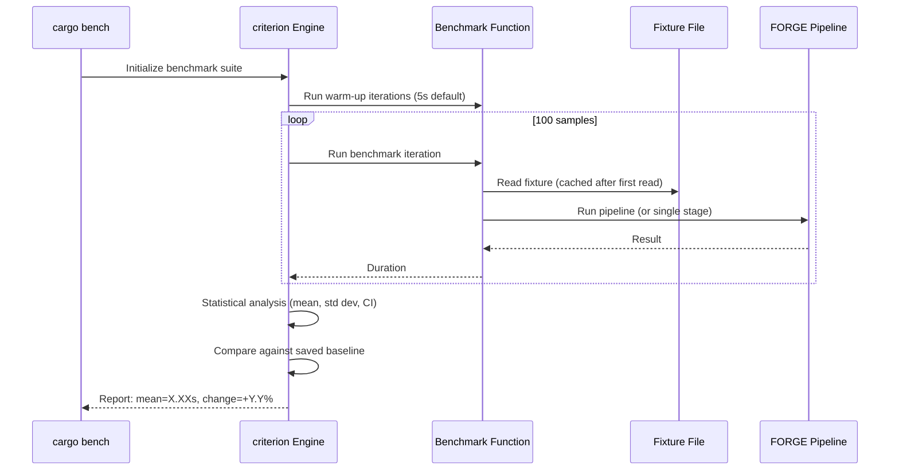

# 024-ar-performance-benchmark

> **Document Type:** Architecture Review
> **Audience:** LLM agents, human reviewers
> **Status:** Proposed
> **Last Updated:** 2026-02-10 <!-- @auto -->
> **Owner:** Brian Luby <!-- @human-required -->
> **Deciders:** Brian Luby <!-- @human-required -->

---

## Review Tier Legend

| Marker | Tier | Speckit Behavior |
|--------|------|------------------|
| 🔴 `@human-required` | Human Generated | Prompt human to author; blocks until complete |
| 🟡 `@human-review` | LLM + Human Review | LLM drafts → prompt human to confirm/edit; blocks until confirmed |
| 🟢 `@llm-autonomous` | LLM Autonomous | LLM completes; no prompt; logged for audit |
| ⚪ `@auto` | Auto-generated | System fills (timestamps, links); no prompt |

---

## Document Completion Order

> ⚠️ **For LLM Agents:** Complete sections in this order. Do not fill downstream sections until upstream human-required inputs exist.

1. **Summary (Decision)** → requires human input first
2. **Context (Problem Space)** → requires human input
3. **Decision Drivers** → requires human input (prioritized)
4. **Driving Requirements** → extract from PRD, human confirms
5. **Options Considered** → LLM drafts after drivers exist, human reviews
6. **Decision (Selected + Rationale)** → requires human decision
7. **Implementation Guardrails** → LLM drafts, human reviews
8. **Everything else** → can proceed after decision is made

---

## Linkage ⚪ `@auto`

| Document | ID | Relationship |
|----------|-----|--------------|
| Parent PRD | [024-prd-performance-benchmark](../PRD/024-prd-performance-benchmark.md) | Requirements this architecture satisfies |
| Security Review | N/A | Benchmark infrastructure only |
| Supersedes | — | N/A (new capability) |
| Superseded By | — | |

---

## Summary

### Decision 🔴 `@human-required`
> Use the `criterion` crate for all pipeline benchmarks, with a deterministic 50-page synthetic Markdown policy fixture stored as a static file in the repository. Benchmarks are organized in `benches/pipeline_benchmark.rs` with a full-pipeline benchmark group and a per-stage benchmark group. Profile with `cargo-flamegraph` only if the <30s target is not met.

### TL;DR for Agents 🟡 `@human-review`
> Benchmarks use `criterion` in `benches/pipeline_benchmark.rs`. The 50-page synthetic fixture is a static committed file at `tests/fixtures/synthetic-50page-policy.md`, generated deterministically (no randomness). Full pipeline benchmark measures ingest-through-serialize. Per-stage benchmarks isolate each stage. Target: <30 seconds on commodity hardware (single-core x86-64, 8 GB RAM). Do NOT use `#[bench]` (nightly-only). Do NOT generate the fixture at benchmark time. Do NOT benchmark with debug profile — always release mode. Do NOT optimize before profiling.

---

## Context

### Problem Space 🔴 `@human-required`
The parent PRD establishes a technical constraint that conversion of a 50-page policy document shall complete in under 30 seconds on commodity hardware. Constitution principle VI (Performance-First Design) mandates that all hot paths be benchmarked with `criterion` and that performance regression tests run in CI. After 23 sprints of development, no performance measurement infrastructure exists. The architecture must decide which benchmarking framework to use, how to create a representative test fixture, how to structure per-stage vs end-to-end benchmarks, and how to integrate with CI for regression detection.

### Decision Scope 🟡 `@human-review`

**This AR decides:**
- Benchmarking framework selection (criterion vs alternatives)
- Synthetic fixture design and generation approach
- Benchmark organization: full-pipeline vs per-stage structure
- CI integration strategy for regression detection
- Profiling approach if the target is not met

**This AR does NOT decide:**
- XML/YAML output benchmarking — deferred to Phase 2
- Profile generation benchmarking — deferred to Phase 2
- Memory profiling — only if needed to meet the <30s target
- Concurrent/batch conversion benchmarking — deferred to Phase 3

### Current State 🟢 `@llm-autonomous`
No benchmark infrastructure exists. The pipeline has been validated for correctness (unit tests, golden-file tests, schema validation) but not for performance. The `benches/` directory does not exist. No synthetic test fixture of representative size has been created. There is no data on current pipeline performance.



### Driving Requirements 🟡 `@human-review`

| PRD Req ID | Requirement Summary | Architectural Implication |
|------------|---------------------|---------------------------|
| M-1 | 50-page synthetic Markdown policy fixture | Fixture generator and committed static file needed |
| M-2 | criterion benchmark for full pipeline end-to-end | Benchmark function calling complete pipeline: ingest through serialize |
| M-3 | Mean time <30 seconds on commodity hardware | Optimization may be needed; profiling approach defined |
| M-4 | Benchmark results documented in repository | Results capture and documentation strategy |
| M-5 | Benchmarks in `benches/` directory, runnable via `cargo bench` | Standard Rust benchmark layout |
| S-1 | Per-stage benchmarks for each pipeline stage | Benchmark functions isolating individual stages |
| S-2 | Flamegraph profiling if target not met | cargo-flamegraph as conditional optimization tool |
| S-3 | CI integration for regression detection | CI step running cargo bench |

**PRD Constraints inherited:**
- From constitution principle VI: criterion mandated; benchmarks in `benches/`; profile with flamegraph
- From constitution principle IV: TDD — test fixture validity before benchmarking
- From parent PRD: <30s on commodity hardware (single-core x86-64, 8 GB RAM, SSD)

---

## Decision Drivers 🔴 `@human-required`

1. **Statistical rigor:** Benchmarks must produce statistically meaningful results with confidence intervals *(constitution principle VI)*
2. **Reproducibility:** Benchmarks must be deterministic — same fixture, same code produces comparable results *(traces to PRD M-1 fixture determinism)*
3. **Regression detection:** Must detect >10% performance degradation automatically *(traces to PRD S-3)*
4. **Per-stage visibility:** Must identify which pipeline stage is the bottleneck *(traces to PRD S-1)*
5. **Simplicity:** Use established tooling; do not build custom benchmark infrastructure *(constitution principle X)*

---

## Options Considered 🟡 `@human-review`

### Option 0: Status Quo / Do Nothing

**Description:** Do not create benchmarks. Rely on wall-clock timing of manual test runs.

| Driver | Rating | Notes |
|--------|--------|-------|
| Statistical rigor | ❌ Poor | Manual timing has no statistical analysis |
| Reproducibility | ❌ Poor | Manual runs vary with system load |
| Regression detection | ❌ Poor | No automated detection |
| Per-stage visibility | ❌ Poor | No stage isolation |
| Simplicity | ✅ Good | No infrastructure needed |

**Why not viable:** Constitution principle VI mandates criterion benchmarks. The <30s target cannot be verified without measurement. MS-4 exit criteria require benchmark evidence.

---

### Option 1: `criterion` Crate (Recommended)

**Description:** Use the `criterion` crate for all benchmarks. Create a static 50-page synthetic fixture committed to the repository. Organize benchmarks in `benches/pipeline_benchmark.rs` with two benchmark groups: `full_pipeline` (end-to-end) and `per_stage` (individual stages). Use default criterion configuration (100 samples, 5s warm-up). Generate HTML reports and store baseline for regression comparison.



| Driver | Rating | Notes |
|--------|--------|-------|
| Statistical rigor | ✅ Good | 100 samples, confidence intervals, outlier detection |
| Reproducibility | ✅ Good | Static fixture, deterministic pipeline, release mode |
| Regression detection | ✅ Good | Baseline comparison detects >2% changes by default |
| Per-stage visibility | ✅ Good | Benchmark groups isolate each stage |
| Simplicity | ✅ Good | Standard crate, well-documented, constitution-mandated |

**Pros:**
- Industry standard for Rust micro-benchmarking
- Statistical analysis with confidence intervals and outlier detection
- HTML reports with historical comparison
- Built-in regression detection comparing against saved baselines
- Constitution principle VI mandates this tool
- Supports benchmark groups for organized per-stage and full-pipeline measurement
- `criterion::black_box()` prevents compiler from optimizing away benchmark code

**Cons:**
- Adds `criterion` as a dev dependency (~30 crates in dependency tree)
- HTML reports require viewing in a browser (not inline in terminal)
- CI benchmarks on shared runners may be noisy

---

### Option 2: Custom Timing with `std::time::Instant`

**Description:** Implement a custom benchmark framework using `std::time::Instant` to measure elapsed time. Run N iterations in a loop, compute mean and standard deviation manually. Store results in a JSON file for comparison.



| Driver | Rating | Notes |
|--------|--------|-------|
| Statistical rigor | ⚠️ Medium | Must implement own statistics; no outlier detection |
| Reproducibility | ⚠️ Medium | No warm-up period handling; JIT effects uncontrolled |
| Regression detection | ❌ Poor | Must build custom comparison against stored results |
| Per-stage visibility | ✅ Good | Can time each stage independently |
| Simplicity | ❌ Poor | Must build everything: timing loop, statistics, warm-up, reporting |

**Pros:**
- No external dependency
- Full control over measurement methodology

**Cons:**
- Reinvents criterion — must implement warm-up, iteration count, statistical analysis, outlier detection
- No HTML reports
- No built-in regression detection
- Constitution explicitly mandates criterion; this option contradicts that mandate

---

### Option 3: `cargo bench` Built-in (Nightly Only)

**Description:** Use Rust's built-in `#[bench]` attribute and `test::Bencher` for benchmarks. Requires nightly toolchain.



| Driver | Rating | Notes |
|--------|--------|-------|
| Statistical rigor | ⚠️ Medium | Basic ns/iter reporting; no confidence intervals |
| Reproducibility | ⚠️ Medium | Less statistical analysis than criterion |
| Regression detection | ❌ Poor | No built-in regression comparison |
| Per-stage visibility | ✅ Good | Can create bench functions per stage |
| Simplicity | ⚠️ Medium | Requires nightly toolchain — breaks stable Rust requirement |

**Pros:**
- No external dependency
- Part of the Rust toolchain

**Cons:**
- **Requires nightly Rust** — FORGE targets stable Rust per constitution
- Less statistically rigorous than criterion (no confidence intervals, no outlier detection)
- No regression comparison
- No HTML reports
- Constitution mandates criterion over this option

---

## Decision

### Selected Option 🔴 `@human-required`
> **Option 1: `criterion` Crate**

### Rationale 🔴 `@human-required`
`criterion` is the clear choice because it provides the statistical rigor needed to verify the <30s target with confidence, supports regression detection for CI integration, and is mandated by the constitution technology stack (principle VI). Option 2 (custom timing) would require building what criterion already provides — unnecessary effort that contradicts principle X (Simplicity). Option 3 (`cargo bench`) requires nightly Rust, which violates the stable toolchain constraint. The only trade-off is the dependency tree size, which is acceptable for a dev-only dependency.

#### Simplest Implementation Comparison 🟡 `@human-review`

| Aspect | Simplest Possible | Selected Option | Justification for Complexity |
|--------|-------------------|-----------------|------------------------------|
| Components | Single `time cargo run` command | criterion + fixture + per-stage groups | PRD S-1 requires per-stage visibility; criterion provides regression detection |
| Dependencies | None | criterion (dev-dependency) | Constitution mandates criterion; statistical rigor impossible without it |
| Patterns | Wall-clock timing | Warm-up + 100 samples + statistics | PRD M-3 requires confident verification of <30s target; single measurement is insufficient |

**Complexity justified by:** A single wall-clock measurement cannot distinguish signal from noise. Criterion's 100-sample default with warm-up and outlier detection provides the confidence needed to verify the <30s target (PRD M-3) and detect regressions (PRD S-3).

### Architecture Diagram 🟡 `@human-review`



---

## Technical Specification

### Component Overview 🟡 `@human-review`

| Component | Responsibility | Interface | Dependencies |
|-----------|---------------|-----------|--------------|
| Synthetic Fixture Generator | Produce deterministic 50-page Markdown policy document | `fn generate_synthetic_policy(pages: usize) -> String` | None |
| Static Fixture File | Committed ~150KB Markdown file used by all benchmarks | `tests/fixtures/synthetic-50page-policy.md` | None |
| Full Pipeline Benchmark | Measure end-to-end conversion time | `fn bench_full_pipeline(c: &mut Criterion)` | criterion, FORGE library API |
| Per-Stage Benchmarks | Measure individual pipeline stage times | `fn bench_{stage}(c: &mut Criterion)` per stage | criterion, FORGE library API |
| Benchmark Runner | criterion main function with benchmark groups | `criterion_group!` + `criterion_main!` macros | criterion |

### Data Flow 🟢 `@llm-autonomous`



### Interface Definitions 🟡 `@human-review`

```rust
use criterion::{black_box, criterion_group, criterion_main, Criterion};

/// Full pipeline benchmark: ingest → parse → atomize → assemble → validate → serialize.
/// Uses the 50-page synthetic fixture as input.
fn bench_full_pipeline(c: &mut Criterion) {
    let input = std::fs::read_to_string(
        "tests/fixtures/synthetic-50page-policy.md"
    ).expect("Synthetic fixture must exist");

    c.bench_function("full_pipeline_50page", |b| {
        b.iter(|| {
            let result = forge::convert(
                black_box(&input),
                forge::Strategy::Catalog,
                forge::Format::Json,
            );
            black_box(result)
        });
    });
}

/// Per-stage benchmarks: each stage measured independently.
fn bench_per_stage(c: &mut Criterion) {
    let input = std::fs::read_to_string(
        "tests/fixtures/synthetic-50page-policy.md"
    ).expect("Synthetic fixture must exist");

    let mut group = c.benchmark_group("pipeline_stages");

    // Ingest stage
    group.bench_function("ingest", |b| {
        b.iter(|| forge::ingest(black_box(&input)))
    });

    // Parse stage (pre-compute ingest result)
    let ingested = forge::ingest(&input).unwrap();
    group.bench_function("parse", |b| {
        b.iter(|| forge::parse(black_box(&ingested)))
    });

    // Atomize stage (pre-compute parse result)
    let parsed = forge::parse(&ingested).unwrap();
    group.bench_function("atomize", |b| {
        b.iter(|| forge::atomize(black_box(&parsed)))
    });

    // Catalog assembly (pre-compute atomize result)
    let atomized = forge::atomize(&parsed).unwrap();
    group.bench_function("catalog_assembly", |b| {
        b.iter(|| forge::assemble_catalog(black_box(&atomized)))
    });

    // Validation (pre-compute assembly result)
    let catalog = forge::assemble_catalog(&atomized).unwrap();
    group.bench_function("validation", |b| {
        b.iter(|| forge::validate(black_box(&catalog)))
    });

    // Serialization (pre-compute validation result)
    group.bench_function("serialization", |b| {
        b.iter(|| forge::serialize_json(black_box(&catalog)))
    });

    group.finish();
}

/// Deterministic synthetic fixture generator.
/// Produces ~50 pages (~25,000 words / ~150,000 characters) of Markdown.
pub fn generate_synthetic_policy(pages: usize) -> String {
    // Deterministic: no RNG, no timestamps, no randomness
    // Structure:
    //   - YAML frontmatter (title, version, author, date)
    //   - ~10 H2 sections (Access Control, Data Protection, etc.)
    //   - 3-5 H3 subsections per H2
    //   - 3-8 numbered policy requirements per H3 (normative language)
    //   - ~20 compound statements ("must X and must Y")
    //   - ~30 citations/references ("[NIST SP 800-53 AC-2]")
    //   - ~10 tables (role-responsibility, retention schedule)
    //   - Total: ~pages * 500 words
    todo!()
}

criterion_group!(benches, bench_full_pipeline, bench_per_stage);
criterion_main!(benches);
```

### Key Algorithms/Patterns 🟡 `@human-review`

**Pattern:** Deterministic Fixture Generation
```
1. Use a fixed seed (no RNG) and hardcoded section templates
2. Generate 10 H2 sections with predefined policy domain names
3. For each H2, generate 3-5 H3 subsections with domain-specific content
4. For each H3, generate 3-8 numbered requirements using normative templates
5. Scatter ~20 compound statements across sections (fixed positions)
6. Scatter ~30 citations/references at fixed intervals
7. Insert ~10 tables at predetermined locations
8. Verify: calling generator twice produces byte-identical output
```

**Pattern:** Per-Stage Isolation
```
1. Pre-compute the input for each stage outside the benchmark loop
2. Only the stage under measurement runs inside b.iter(|| ...)
3. Use black_box() to prevent compiler optimization of unused results
4. Each stage benchmark is independent — not cumulative
```

---

## Constraints & Boundaries

### Technical Constraints 🟡 `@human-review`

**Inherited from PRD:**
- criterion mandated by constitution principle VI
- Benchmarks in `benches/` directory
- Benchmarks must run via `cargo bench`
- <30s target on commodity hardware (single-core x86-64, 8 GB RAM, SSD)
- Fixture must be deterministic (no randomness)
- Benchmarks must use release-mode optimizations

**Added by this Architecture:**
- criterion added as a dev-dependency with `html_reports` feature
- Static fixture committed to repository (not generated at benchmark time)
- Fixture size: ~150KB (~25,000 words / ~150,000 characters)
- criterion default configuration: 100 samples, 5s warm-up
- Baseline stored in `target/criterion/` (gitignored; regenerated per machine)
- Profiling with cargo-flamegraph is conditional — only if <30s target is not met

### Architectural Boundaries 🟡 `@human-review`

- **Owns:** `benches/pipeline_benchmark.rs`, synthetic fixture generator, fixture file
- **Interfaces With:** FORGE library API (individual pipeline stage functions), criterion crate
- **Must Not Touch:** Pipeline implementation in `src/` (unless optimization is required to meet target)

### Implementation Guardrails 🟡 `@human-review`

> ⚠️ **Critical for LLM Agents:**

- [x] **DO NOT** use `#[bench]` (nightly-only built-in bench harness) — use criterion *(constitution principle VI)*
- [x] **DO NOT** generate the synthetic fixture at benchmark time — use the committed static file *(PRD determinism requirement)*
- [x] **DO NOT** benchmark with debug profile — always use `--release` (cargo bench does this by default) *(real-world performance)*
- [x] **DO NOT** optimize before profiling — measure first, then optimize only if <30s target is missed *(constitution principle X)*
- [x] **DO NOT** use random or non-deterministic content in the synthetic fixture *(PRD fixture stability)*
- [x] **DO NOT** hardcode absolute file paths in benchmark code — use relative paths from workspace root *(portability)*
- [x] **MUST** use `criterion::black_box()` to prevent compiler optimization of benchmark results *(measurement accuracy)*
- [x] **MUST** verify the synthetic fixture converts to valid OSCAL output before using it for benchmarks *(PRD EC-5)*
- [x] **MUST** document benchmark results (hardware, mean time, std dev) in the repository *(PRD M-4)*

---

## Consequences 🟡 `@human-review`

### Positive
- Quantitative evidence that the <30s target is met — required for MS-4 exit
- Regression detection prevents silent performance degradation in Phase 2/3
- Per-stage benchmarks identify hot paths without guesswork
- Synthetic fixture is reusable for WI-21/WI-22 golden-file testing
- criterion HTML reports provide visual performance trends over time

### Negative
- criterion adds ~30 crates to the dev-dependency tree
- Benchmark runs add ~60s to CI pipeline execution time
- CI benchmarks on shared runners may be noisy (mitigated by criterion's statistical analysis)
- 150KB synthetic fixture adds to repository size (negligible)

### Risks & Mitigations

| Risk | Likelihood | Impact | Mitigation |
|------|------------|--------|------------|
| Pipeline exceeds 30s target | Low | High | Profile with flamegraph; optimize hot path (likely validation or serialization) |
| Schema validation dominates time in third-party crate | Low | Med | Measure validation separately; consider lazy validation or schema caching |
| CI benchmarks noisy on shared runners | Med | Low | Use criterion statistical analysis; document CI benchmarks as directional, not absolute |
| Synthetic fixture unrepresentative of real documents | Low | Med | Design with realistic structure: H1-H4 depth, numbered clauses, compound statements, citations, tables |

---

## Implementation Guidance

### Suggested Implementation Order 🟢 `@llm-autonomous`
1. Add `criterion` (with `html_reports` feature) as a dev-dependency in `Cargo.toml`
2. Implement the synthetic fixture generator and generate the static file
3. Add a unit test verifying fixture determinism (generate twice, compare bytes)
4. Add a unit test verifying fixture converts to valid OSCAL output
5. Create `benches/pipeline_benchmark.rs` with `bench_full_pipeline()`
6. Run `cargo bench` and record initial results
7. If <30s target met: document results and add per-stage benchmarks
8. If >30s target missed: generate flamegraph, identify hot path, optimize, re-measure
9. Add CI step for `cargo bench` and configure artifact storage

### Testing Strategy 🟢 `@llm-autonomous`

| Layer | Test Type | Coverage Target | Notes |
|-------|-----------|-----------------|-------|
| Unit | Fixture determinism | Byte-identical output from two generations | Ensures reproducibility |
| Unit | Fixture validity | Converts to valid OSCAL Catalog | Ensures fixture exercises full pipeline |
| Benchmark | Full pipeline | <30s mean on commodity hardware | MS-4 exit criterion |
| Benchmark | Per-stage | All 6 stages measured | Hot path identification |
| CI | Regression detection | Benchmarks run in CI pipeline | Detects >10% degradation |

### Anti-patterns to Avoid 🟡 `@human-review`
- **Don't:** Benchmark with a trivially small document and extrapolate to 50 pages
  - **Why:** Non-linear costs (e.g., schema validation) will not scale linearly
  - **Instead:** Use the actual 50-page fixture for the primary benchmark
- **Don't:** Optimize before measuring
  - **Why:** Premature optimization wastes effort on non-bottleneck code
  - **Instead:** Run benchmark, profile with flamegraph, then target the hot path
- **Don't:** Run benchmarks with debug profile
  - **Why:** Debug builds are 10-100x slower; results are meaningless for the <30s target
  - **Instead:** `cargo bench` uses release mode by default; verify this is active

---

## Compliance & Cross-cutting Concerns

### Security Considerations 🟡 `@human-review`
- Authentication: N/A — benchmark infrastructure
- Authorization: N/A
- Data handling: Synthetic fixture contains fabricated policy content, not real policies

### Observability 🟢 `@llm-autonomous`
- **Logging:** Not applicable for benchmark infrastructure
- **Metrics:** criterion reports mean time, std dev, throughput, change percentage
- **Tracing:** Flamegraph provides function-level CPU time breakdown (conditional)

### Error Handling Strategy 🟢 `@llm-autonomous`
```
Error Category → Handling Approach
├── Missing fixture file → Benchmark panics with descriptive message (setup error)
├── Pipeline failure during benchmark → Benchmark panics (regression detected)
├── criterion configuration error → Benchmark fails to compile (caught at build time)
└── Performance regression detected → criterion reports change% (informational, not blocking)
```

---

## Migration Plan (if applicable) 🟡 `@human-review`

N/A — greenfield benchmark infrastructure. No existing benchmarks to migrate from.

### Rollback Plan 🔴 `@human-required`

N/A — benchmark infrastructure is test-only code. If criterion is problematic, remove the `benches/` directory and dev-dependency. Performance verification would revert to manual timing.

---

## Open Questions 🟡 `@human-review`

No open questions for this work item.

---

## Changelog ⚪ `@auto`

| Version | Date | Author | Changes |
|---------|------|--------|---------|
| 0.1 | 2026-02-10 | LLM (Claude) | Initial proposal |

---

## Decision Record ⚪ `@auto`

| Date | Event | Details |
|------|-------|---------|
| 2026-02-10 | Proposed | Initial draft created from PRD 024 |

---

## Traceability Matrix 🟢 `@llm-autonomous`

| PRD Req ID | Decision Driver | Option Rating | Component | Notes |
|------------|-----------------|---------------|-----------|-------|
| M-1 | Reproducibility | Option 1: ✅ | Synthetic Fixture Generator + Static File | Deterministic 50-page Markdown document |
| M-2 | Statistical rigor | Option 1: ✅ | Full Pipeline Benchmark | criterion measures ingest through serialize |
| M-3 | Statistical rigor | Option 1: ✅ | criterion engine | 100 samples, confidence intervals verify <30s |
| M-4 | Reproducibility | Option 1: ✅ | Documentation | Hardware + timing + memory documented |
| M-5 | Simplicity | Option 1: ✅ | benches/pipeline_benchmark.rs | Standard `cargo bench` execution |
| S-1 | Per-stage visibility | Option 1: ✅ | Per-Stage Benchmarks | Each of 6 stages measured independently |
| S-2 | Per-stage visibility | Option 1: ✅ | cargo-flamegraph (conditional) | Profile only if target not met |
| S-3 | Regression detection | Option 1: ✅ | CI Integration | cargo bench in CI with criterion output |

---

## Review Checklist 🟢 `@llm-autonomous`

Before marking as Accepted:
- [x] All PRD Must Have requirements appear in Driving Requirements
- [x] Option 0 (Status Quo) is documented
- [x] Simplest Implementation comparison is completed
- [x] Decision drivers are prioritized and addressed
- [x] At least 2 options were seriously considered
- [x] Constraints distinguish inherited vs. new
- [x] Component names are consistent across all diagrams and tables
- [x] Implementation guardrails reference specific PRD constraints
- [x] Rollback triggers and authority are defined (N/A — test infrastructure)
- [x] Security review is linked or N/A documented
- [x] No open questions blocking implementation
