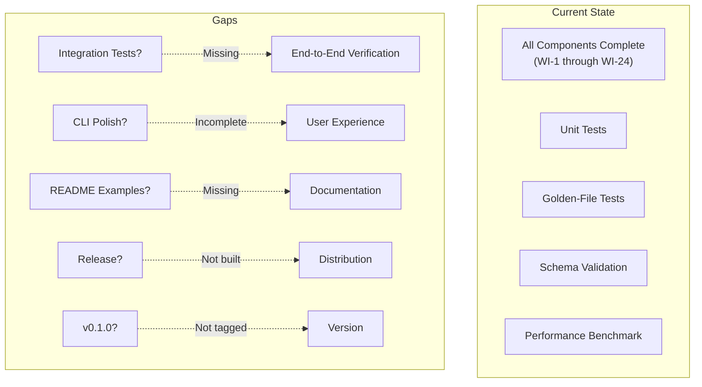
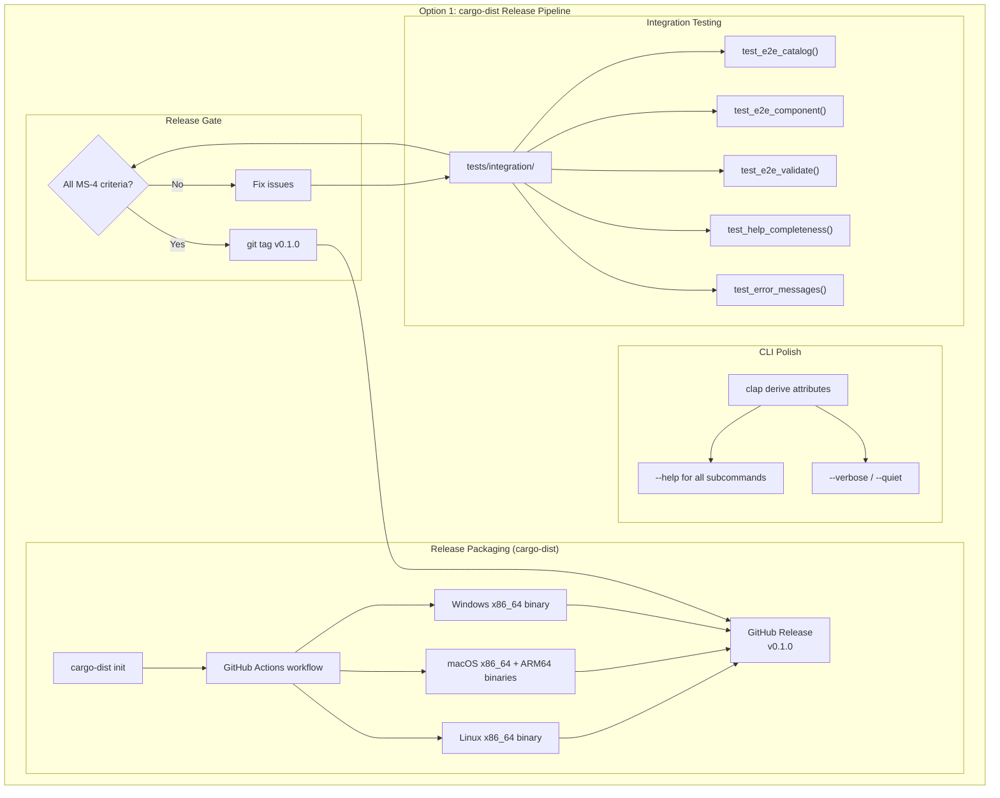
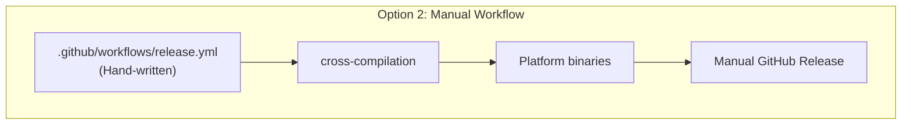
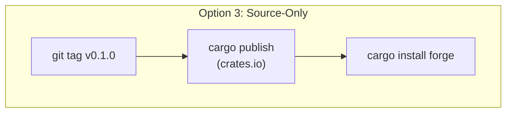
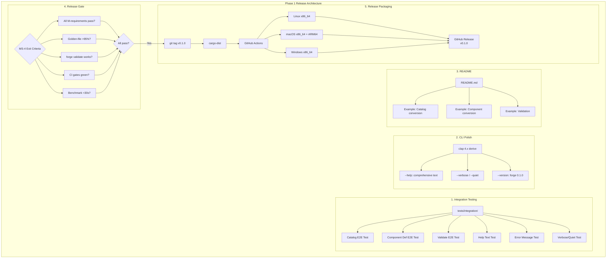
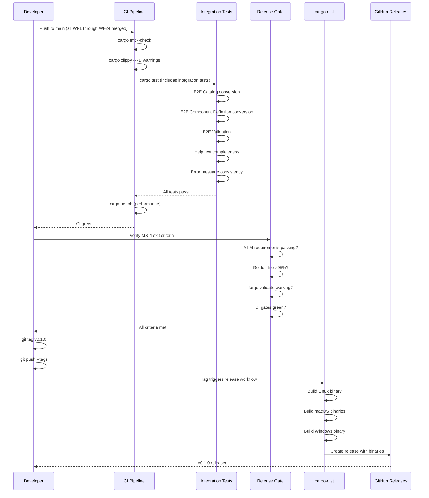

# 025-ar-phase1-release

> **Document Type:** Architecture Review
> **Audience:** LLM agents, human reviewers
> **Status:** Proposed
> **Last Updated:** 2026-02-10 <!-- @auto -->
> **Owner:** Brian Luby <!-- @human-required -->
> **Deciders:** Brian Luby <!-- @human-required -->

---

## Review Tier Legend

| Marker | Tier | Speckit Behavior |
|--------|------|------------------|
| 🔴 `@human-required` | Human Generated | Prompt human to author; blocks until complete |
| 🟡 `@human-review` | LLM + Human Review | LLM drafts → prompt human to confirm/edit; blocks until confirmed |
| 🟢 `@llm-autonomous` | LLM Autonomous | LLM completes; no prompt; logged for audit |
| ⚪ `@auto` | Auto-generated | System fills (timestamps, links); no prompt |

---

## Document Completion Order

> ⚠️ **For LLM Agents:** Complete sections in this order. Do not fill downstream sections until upstream human-required inputs exist.

1. **Summary (Decision)** → requires human input first
2. **Context (Problem Space)** → requires human input
3. **Decision Drivers** → requires human input (prioritized)
4. **Driving Requirements** → extract from PRD, human confirms
5. **Options Considered** → LLM drafts after drivers exist, human reviews
6. **Decision (Selected + Rationale)** → requires human decision
7. **Implementation Guardrails** → LLM drafts, human reviews
8. **Everything else** → can proceed after decision is made

---

## Linkage ⚪ `@auto`

| Document | ID | Relationship |
|----------|-----|--------------|
| Parent PRD | [025-prd-phase1-release](../PRD/025-prd-phase1-release.md) | Requirements this architecture satisfies |
| Security Review | N/A | Release packaging; no new security surface |
| Supersedes | — | N/A (first release) |
| Superseded By | — | |

---

## Summary

### Decision 🔴 `@human-required`
> Use `cargo-dist` for automated release packaging and binary distribution, with GitHub Actions workflows for building release binaries on Linux (x86_64), macOS (x86_64 + ARM64), and Windows (x86_64). Integration tests are extended `cargo test` tests exercising the full pipeline end-to-end. CLI polish uses `clap` 4.x derive API features for help text and verbosity flags. v0.1.0 is tagged only after all MS-4 exit criteria pass.

### TL;DR for Agents 🟡 `@human-review`
> WI-25 is the Phase 1 release gate. Integration tests go in `tests/integration/`. CLI polish uses `clap` derive attributes for `--help`, `--verbose`, and `--quiet`. Release uses `cargo-dist` to produce binaries for 3 platforms via GitHub Actions. README gets a Usage section with tested examples. Tag v0.1.0 only after: all M-requirements pass, golden-file accuracy >95%, `forge validate` works, all CI gates green. Do NOT tag the release before all MS-4 criteria are verified. Do NOT add new features — this is integration, polish, and release only. Do NOT push the tag without running the full test suite locally first.

---

## Context

### Problem Space 🔴 `@human-required`
After 24 sprints of incremental development, all Phase 1 pipeline components exist but have not been verified end-to-end as an integrated whole. The CLI user experience needs polish (comprehensive help text, verbosity flags, consistent error messages). The README needs usage examples. The v0.1.0 release must be packaged and published. The architecture must decide how to structure integration tests, how to distribute the release binary, how to polish the CLI, and how to gate the release on MS-4 exit criteria.

### Decision Scope 🟡 `@human-review`

**This AR decides:**
- Integration test architecture: how to verify all M-requirements and AC criteria end-to-end
- CLI polish approach: help text, verbosity flags, error message consistency
- Release packaging and distribution strategy
- Release gating process: how MS-4 exit criteria are verified before tagging
- README structure for usage examples

**This AR does NOT decide:**
- XML/YAML output — deferred to Phase 2
- Profile generation — deferred to Phase 2
- Cross-platform binary releases beyond 3 primary targets — deferred to Phase 3
- Community documentation (CONTRIBUTING.md) — deferred to Phase 3

### Current State 🟢 `@llm-autonomous`
All Phase 1 pipeline components are implemented (WI-1 through WI-24). Unit tests and golden-file tests exist for individual components. Schema validation and error handling are in place. Performance benchmarks verify the <30s target. However:

- No integration tests verify the full pipeline end-to-end with all components working together
- CLI help text may be incomplete or inconsistent
- `--verbose` and `--quiet` flags may not be fully wired through all pipeline stages
- README contains no usage examples
- No release packaging or distribution infrastructure exists
- v0.1.0 has not been tagged



### Driving Requirements 🟡 `@human-review`

| PRD Req ID | Requirement Summary | Architectural Implication |
|------------|---------------------|---------------------------|
| M-1 | All parent PRD M-1 through M-11 pass end-to-end | Integration test suite exercising full pipeline |
| M-2 | All parent PRD AC-1 through AC-10 verified | Integration tests map to acceptance criteria |
| M-3 | Golden-file accuracy >95% | Accuracy measurement from WI-21/WI-22 harness |
| M-4 | `forge validate` works correctly | Integration tests for validation command |
| M-5 | Comprehensive `--help` text for all subcommands | clap derive attributes for help text |
| M-6 | v0.1.0 tagged after MS-4 exit criteria met | Release gating process |
| M-7 | All CI quality gates pass | cargo fmt, clippy, test must pass |
| S-1 | `--verbose` and `--quiet` global flags | clap global args + pipeline verbosity control |
| S-2 | README usage examples | Tested examples in README |
| S-3 | Consistent, descriptive error messages | Error message audit from WI-23 |

**PRD Constraints inherited:**
- From constitution: No new features in release sprint; TDD mandatory; all quality gates
- From roadmap: MS-4 exit criteria: "All M-requirements passing; golden-file suite >95% accuracy; forge validate working; v0.1.0 tagged"

---

## Decision Drivers 🔴 `@human-required`

1. **Release confidence:** Every MS-4 exit criterion must be verified with documented evidence before tagging *(traces to PRD M-6)*
2. **Regression prevention:** Integration tests must become permanent regression guards for Phase 2/3 *(traces to PRD M-1)*
3. **User experience:** First-time users must be able to learn FORGE from `--help` and README alone *(traces to PRD M-5, S-2)*
4. **Distribution simplicity:** Release binaries must be buildable and distributable without manual steps *(traces to PRD C-2)*
5. **No new features:** This sprint is strictly integration, polish, and release — zero new capabilities *(PRD constraint)*

---

## Options Considered 🟡 `@human-review`

### Option 0: Status Quo / Do Nothing

**Description:** Tag v0.1.0 based on existing unit tests and golden-file tests without additional integration testing, CLI polish, or release packaging.

| Driver | Rating | Notes |
|--------|--------|-------|
| Release confidence | ❌ Poor | No end-to-end verification; MS-4 criteria unverified |
| Regression prevention | ⚠️ Medium | Unit tests exist but no integration tests |
| User experience | ❌ Poor | Help text may be incomplete; no README examples |
| Distribution simplicity | ❌ Poor | No binary builds; source-only install |
| No new features | ✅ Good | Nothing changes |

**Why not viable:** Tagging a release without verifying MS-4 exit criteria violates the roadmap and principle P-1 (Correctness over convenience). Users encountering incomplete help text or missing README examples would have a poor first experience.

---

### Option 1: `cargo-dist` for Automated Release (Recommended)

**Description:** Use `cargo-dist` to generate GitHub Actions release workflows that build platform-specific binaries (Linux x86_64, macOS x86_64 + ARM64, Windows x86_64) and create GitHub releases with attached artifacts. Integration tests are `cargo test` integration tests in `tests/integration/`. CLI polish uses `clap` 4.x derive attributes. README gets a Usage section with verified examples.



| Driver | Rating | Notes |
|--------|--------|-------|
| Release confidence | ✅ Good | Integration tests verify all MS-4 criteria before tagging |
| Regression prevention | ✅ Good | Integration tests in `cargo test` become permanent guards |
| User experience | ✅ Good | clap derive provides consistent, complete help text |
| Distribution simplicity | ✅ Good | cargo-dist automates binary builds and GitHub release |
| No new features | ✅ Good | Only testing, polish, and release infrastructure |

**Pros:**
- `cargo-dist` generates GitHub Actions workflows — no manual release scripting
- Produces platform-specific binaries (Linux, macOS, Windows) automatically
- Integration tests in `cargo test` are reusable regression guards
- `clap` derive attributes provide consistent, auto-generated help text
- Release gating is explicit: all tests pass before tag

**Cons:**
- `cargo-dist` adds a build-time dependency and generated GitHub Actions files
- Initial setup of `cargo-dist` requires running `cargo dist init` and committing workflow files
- macOS and Windows CI runners are more expensive than Linux

---

### Option 2: Manual GitHub Release Workflow

**Description:** Manually write GitHub Actions workflows for cross-compilation. Build release binaries using `cross` or platform-specific runners. Create the GitHub release manually or with a simple script.



| Driver | Rating | Notes |
|--------|--------|-------|
| Release confidence | ✅ Good | Same integration tests |
| Regression prevention | ✅ Good | Same integration tests |
| User experience | ✅ Good | Same clap polish |
| Distribution simplicity | ⚠️ Medium | Manual workflow maintenance; cross-compilation is complex |
| No new features | ✅ Good | Only infrastructure |

**Pros:**
- Full control over the release workflow
- No dependency on `cargo-dist`

**Cons:**
- Must write and maintain complex cross-compilation workflows
- Cross-compilation with `cross` can be fragile (Docker-based)
- More manual steps in the release process — risk of human error
- No auto-generated installer scripts

---

### Option 3: Source-Only Release (No Pre-built Binaries)

**Description:** Tag v0.1.0 as a source-only release. Users install with `cargo install forge` from crates.io or by cloning and building. No pre-built binaries.



| Driver | Rating | Notes |
|--------|--------|-------|
| Release confidence | ✅ Good | Same integration tests |
| Regression prevention | ✅ Good | Same integration tests |
| User experience | ⚠️ Medium | Requires Rust toolchain installed; higher barrier to entry |
| Distribution simplicity | ✅ Good | Very simple: just tag + publish |
| No new features | ✅ Good | Minimal infrastructure |

**Pros:**
- Simplest release process — just `cargo publish`
- No CI binary build infrastructure needed
- Crates.io distribution is standard for Rust tools

**Cons:**
- Requires users to have Rust toolchain installed — high barrier for non-Rust users
- Compilation from source takes several minutes
- Vision goal G-3 (community adoption) is harder without pre-built binaries

---

## Decision

### Selected Option 🔴 `@human-required`
> **Option 1: `cargo-dist` for Automated Release**

### Rationale 🔴 `@human-required`
Option 1 provides the best balance of distribution simplicity and user experience. `cargo-dist` generates the complex cross-platform CI workflows that would be error-prone to write manually (Option 2). Pre-built binaries lower the barrier to entry compared to source-only (Option 3), supporting the vision goal G-3 (community adoption). The integration test architecture (tests in `cargo test`) and CLI polish approach (clap derive) are the same across all options; the release packaging strategy is the differentiator. `cargo-dist` is a well-maintained tool from the Rust ecosystem and aligns with the project's principle of using established tooling.

#### Simplest Implementation Comparison 🟡 `@human-review`

| Aspect | Simplest Possible | Selected Option | Justification for Complexity |
|--------|-------------------|-----------------|------------------------------|
| Components | `git tag v0.1.0` + source release | Integration tests + CLI polish + cargo-dist + README examples | PRD M-1 through M-7 require integration testing and verified help text before release |
| Dependencies | None | cargo-dist (build tool, not runtime dep) | Automates cross-platform binary builds; eliminates manual release error |
| Patterns | Manual verification | Automated MS-4 gate (all tests pass → tag) | PRD M-6 requires all exit criteria verified; automation prevents premature tagging |

**Complexity justified by:** The v0.1.0 release is the first public impression of FORGE. Releasing without integration testing, CLI polish, or pre-built binaries would undermine user trust (principle P-1) and community adoption (goal G-3). The one-time setup cost of cargo-dist pays for itself by automating every subsequent release.

### Architecture Diagram 🟡 `@human-review`



---

## Technical Specification

### Component Overview 🟡 `@human-review`

| Component | Responsibility | Interface | Dependencies |
|-----------|---------------|-----------|--------------|
| Integration Test Suite | Verify all M-requirements and AC criteria end-to-end | `tests/integration/*.rs` | FORGE binary (assert_cmd) or library API |
| CLI Help Polish | Comprehensive help text for all subcommands and options | clap derive `#[arg(help = "...")]` attributes | clap 4.x |
| Verbosity Control | `--verbose` / `--quiet` global flags wired through pipeline | Global `Verbosity` enum passed to pipeline stages | clap, log/tracing |
| README Usage Section | Tested examples for convert and validate workflows | `README.md` Usage section | None |
| Release Gate Script | Verify all MS-4 exit criteria before tagging | Shell script or Makefile target | cargo test, cargo clippy, cargo fmt |
| cargo-dist Configuration | Cross-platform binary build and GitHub release | `dist-workspace.toml` + generated GitHub Actions | cargo-dist |

### Data Flow 🟢 `@llm-autonomous`



### Interface Definitions 🟡 `@human-review`

```rust
// === CLI Polish: Global Verbosity ===

use clap::{Parser, Subcommand, Args};

#[derive(Parser)]
#[command(name = "forge", version, about = "Convert security policies to OSCAL")]
struct Cli {
    #[command(subcommand)]
    command: Commands,

    /// Enable verbose output (show pipeline stage information)
    #[arg(long, global = true, conflicts_with = "quiet")]
    verbose: bool,

    /// Suppress all non-essential output
    #[arg(long, global = true, conflicts_with = "verbose")]
    quiet: bool,
}

#[derive(Subcommand)]
enum Commands {
    /// Convert a policy document to OSCAL format
    Convert(ConvertArgs),
    /// Validate an OSCAL artifact against the schema
    Validate(ValidateArgs),
}

#[derive(Args)]
struct ConvertArgs {
    /// Path to the input policy document (Markdown)
    input: std::path::PathBuf,

    /// Conversion strategy: catalog or component
    #[arg(long, value_enum, default_value = "catalog")]
    strategy: Strategy,

    /// Output format (currently only json is supported)
    #[arg(long, value_enum, default_value = "json")]
    format: Format,

    /// Output file path (defaults to stdout)
    #[arg(long, short)]
    output: Option<std::path::PathBuf>,

    /// Source OSCAL profile to link component implementations to
    #[arg(long)]
    source_profile: Option<std::path::PathBuf>,
}

#[derive(Args)]
struct ValidateArgs {
    /// Path to the OSCAL artifact to validate
    artifact: std::path::PathBuf,
}

// === Integration Test Pattern ===
// Uses assert_cmd to test the actual binary behavior

// #[test]
// fn test_e2e_catalog_conversion() {
//     let mut cmd = Command::cargo_bin("forge").unwrap();
//     cmd.arg("convert")
//        .arg("tests/fixtures/golden/medium/input.md")
//        .arg("--strategy").arg("catalog")
//        .arg("--format").arg("json");
//     cmd.assert()
//        .success()
//        .stdout(predicate::str::contains("\"catalog\""));
// }

// #[test]
// fn test_e2e_validate_valid_artifact() {
//     // First generate an artifact
//     // Then validate it
//     let mut gen = Command::cargo_bin("forge").unwrap();
//     gen.arg("convert")
//        .arg("tests/fixtures/golden/small/input.md")
//        .arg("--strategy").arg("catalog")
//        .arg("--format").arg("json")
//        .arg("--output").arg("/tmp/test-catalog.json");
//     gen.assert().success();
//
//     let mut val = Command::cargo_bin("forge").unwrap();
//     val.arg("validate").arg("/tmp/test-catalog.json");
//     val.assert().success();
// }

// #[test]
// fn test_help_text_completeness() {
//     let mut cmd = Command::cargo_bin("forge").unwrap();
//     cmd.arg("--help");
//     cmd.assert()
//        .success()
//        .stdout(predicate::str::contains("convert"))
//        .stdout(predicate::str::contains("validate"))
//        .stdout(predicate::str::contains("--verbose"))
//        .stdout(predicate::str::contains("--quiet"));
// }
```

### Key Algorithms/Patterns 🟡 `@human-review`

**Pattern:** MS-4 Release Gate Checklist
```
1. Run: cargo fmt --check          → 0 violations
2. Run: cargo clippy -- -D warnings → 0 warnings
3. Run: cargo test                  → All tests pass (includes integration + golden-file)
4. Run: cargo bench                 → <30s mean for 50-page fixture
5. Verify: Golden-file accuracy     → >95% (from test output)
6. Verify: forge validate works     → Integration test passes
7. All pass? → git tag v0.1.0
8. Push tag → cargo-dist builds and releases
```

**Pattern:** Integration Test with assert_cmd
```
1. Use Command::cargo_bin("forge") to get the compiled binary
2. Set arguments matching real user commands
3. Assert exit code (success or specific non-zero)
4. Assert stdout contains expected content
5. Assert stderr contains expected warnings/errors where applicable
6. For multi-step workflows: generate artifact, then validate it
```

---

## Constraints & Boundaries

### Technical Constraints 🟡 `@human-review`

**Inherited from PRD:**
- No new features — integration, polish, and release only
- clap 4.x for CLI (established in WI-1)
- OSCAL v1.2.0 JSON schemas
- JSON output only for v0.1.0
- All CI quality gates must pass
- Performance <30s for 50-page document
- No new crate dependencies unless required for bug fixes

**Added by this Architecture:**
- `assert_cmd` and `predicates` as dev dependencies for integration testing
- `cargo-dist` as a build/release tool (not a runtime dependency)
- Integration tests exercise the compiled binary via process execution (not library API)
- README examples must be verified by running them before release
- v0.1.0 tag is only applied to a commit where all CI gates are green

### Architectural Boundaries 🟡 `@human-review`

- **Owns:** Integration test suite, CLI help text polish, verbosity flags, README usage section, release configuration
- **Interfaces With:** All Phase 1 components (indirectly via integration tests), GitHub Actions, cargo-dist
- **Must Not Touch:** Pipeline internals (no feature changes), golden-file harness (WI-21/WI-22 owns), error types (WI-23 owns)

### Implementation Guardrails 🟡 `@human-review`

> ⚠️ **Critical for LLM Agents:**

- [x] **DO NOT** tag v0.1.0 before all MS-4 exit criteria are verified *(PRD M-6 — the tag is the final step)*
- [x] **DO NOT** add new features or refactor during this sprint *(PRD scope constraint — integration, polish, release only)*
- [x] **DO NOT** write README examples that have not been manually verified against the actual binary *(PRD R-4 mitigation)*
- [x] **DO NOT** skip integration testing because unit tests pass — cross-component issues are only caught end-to-end *(PRD M-1)*
- [x] **DO NOT** make CLI polish changes without re-running the full test suite afterward *(PRD R-3 mitigation)*
- [x] **MUST** verify all parent PRD M-1 through M-11 with documented test evidence *(PRD M-1)*
- [x] **MUST** verify all parent PRD AC-1 through AC-10 are satisfied *(PRD M-2)*
- [x] **MUST** include `--verbose`, `--quiet`, `--version` flags in the CLI *(PRD S-1, M-5)*
- [x] **MUST** run README examples against the built binary to verify accuracy before committing *(PRD S-2)*

---

## Consequences 🟡 `@human-review`

### Positive
- Comprehensive end-to-end verification ensures release quality
- Integration tests become permanent regression suite for Phase 2/3 development
- Pre-built binaries lower barrier to entry for non-Rust users
- Automated release pipeline eliminates manual release errors
- CLI polish and README provide a professional first-time user experience

### Negative
- cargo-dist generates complex GitHub Actions workflows that must be maintained
- macOS and Windows CI runners increase CI cost
- Integration tests add ~30s to CI pipeline execution time
- README maintenance required as CLI evolves in Phase 2/3

### Risks & Mitigations

| Risk | Likelihood | Impact | Mitigation |
|------|------------|--------|------------|
| Integration testing reveals cross-component bugs | Med | Med | Budget time for bug fixes within the sprint — this is the purpose |
| CLI polish changes break existing tests | Low | Low | Run full test suite after each change |
| README examples become stale after CLI changes | Low | Low | Write examples last, after all polish; verify before tagging |
| cargo-dist configuration issues for cross-platform builds | Low | Med | Fall back to Option 3 (source-only) if binary builds fail; fix in a follow-up |

---

## Implementation Guidance

### Suggested Implementation Order 🟢 `@llm-autonomous`
1. **Integration Tests (Days 1-2):**
   - Add `assert_cmd` and `predicates` as dev dependencies
   - Write E2E test for catalog conversion (M-1 verification)
   - Write E2E test for component definition conversion
   - Write E2E test for `forge validate`
   - Write test verifying help text completeness
   - Write test verifying error message consistency
   - Map each test to parent PRD requirements (traceability comments)
2. **CLI Polish (Day 2-3):**
   - Review and enhance all `--help` text using clap derive attributes
   - Wire `--verbose` and `--quiet` flags through pipeline
   - Add `--version` flag displaying `forge 0.1.0`
   - Verify conflicting `--verbose --quiet` produces clear error
3. **README Update (Day 3):**
   - Add Usage section with catalog conversion example
   - Add component conversion example
   - Add validation example
   - Run each example against built binary to verify accuracy
4. **Release Setup (Day 4):**
   - Run `cargo dist init` to generate release configuration
   - Configure target platforms (Linux x86_64, macOS x86_64/ARM64, Windows x86_64)
   - Commit generated workflow files
5. **Release Gate (Day 5):**
   - Run MS-4 checklist: fmt, clippy, test, bench, golden-file accuracy, validate
   - Document results
   - Tag v0.1.0
   - Push tag to trigger release workflow

### Testing Strategy 🟢 `@llm-autonomous`

| Layer | Test Type | Coverage Target | Notes |
|-------|-----------|-----------------|-------|
| Integration | E2E pipeline tests | All 11 M-requirements | Full pipeline via binary execution |
| Integration | CLI behavior tests | Help text, version, flags | All subcommands and global flags |
| Integration | Error path tests | File not found, invalid input | Non-zero exit codes verified |
| Existing | Unit tests | Maintained (no regressions) | Must all continue passing |
| Existing | Golden-file tests | >95% accuracy | WI-21/WI-22 suite |
| Existing | Benchmarks | <30s on 50-page | WI-24 benchmark |

### Anti-patterns to Avoid 🟡 `@human-review`
- **Don't:** Tag the release before all MS-4 criteria are verified
  - **Why:** Releasing with known failures undermines user trust (principle P-1)
  - **Instead:** Verify every criterion, document evidence, then tag
- **Don't:** Add new features during this sprint
  - **Why:** Features introduce risk; this sprint is for verification and polish
  - **Instead:** Log feature ideas for Phase 2; maintain strict scope
- **Don't:** Write README examples without running them
  - **Why:** Non-functional examples erode trust
  - **Instead:** Run every example against the actual binary before committing

---

## Compliance & Cross-cutting Concerns

### Security Considerations 🟡 `@human-review`
- Authentication: N/A — local CLI tool
- Authorization: N/A
- Data handling: Integration test fixtures must not contain real organizational policies; use synthetic data
- Release: Binaries are unsigned — signing deferred to Phase 3 if needed
- Supply chain: cargo-dist-generated workflows use pinned GitHub Actions versions

### Observability 🟢 `@llm-autonomous`
- **Logging:** `--verbose` flag enables INFO-level pipeline stage logging
- **Metrics:** Integration test pass/fail counts in CI output
- **Tracing:** Not applicable for release packaging

### Error Handling Strategy 🟢 `@llm-autonomous`
```
Error Category → Handling Approach
├── Integration test failure → Fix before release; do not tag
├── CI gate failure → Fix before release; do not tag
├── cargo-dist build failure → Fall back to source-only release; fix cross-platform in follow-up
├── README example does not work → Fix example; verify again
└── MS-4 criterion not met → Fix; re-verify; do not tag until all pass
```

---

## Migration Plan (if applicable) 🟡 `@human-review`

N/A — first release. No migration from a previous version.

### Rollback Plan 🔴 `@human-required`

If a critical issue is discovered after tagging v0.1.0:
1. Do NOT delete the tag
2. Fix the issue on main
3. Tag v0.1.1 as a patch release
4. Update the GitHub release notes to note the fix

If cargo-dist fails to build binaries for a platform:
1. Release source-only for that platform
2. Add a note in the release description
3. Fix cross-platform builds in a follow-up commit

---

## Open Questions 🟡 `@human-review`

No open questions for this work item.

---

## Changelog ⚪ `@auto`

| Version | Date | Author | Changes |
|---------|------|--------|---------|
| 0.1 | 2026-02-10 | LLM (Claude) | Initial proposal |

---

## Decision Record ⚪ `@auto`

| Date | Event | Details |
|------|-------|---------|
| 2026-02-10 | Proposed | Initial draft created from PRD 025 |

---

## Traceability Matrix 🟢 `@llm-autonomous`

| PRD Req ID | Decision Driver | Option Rating | Component | Notes |
|------------|-----------------|---------------|-----------|-------|
| M-1 | Release confidence | Option 1: ✅ | Integration Test Suite | E2E tests verify M-1 through M-11 |
| M-2 | Release confidence | Option 1: ✅ | Integration Test Suite | Tests mapped to AC-1 through AC-10 |
| M-3 | Release confidence | Option 1: ✅ | Golden-file accuracy (WI-21/22) | >95% verified by existing harness |
| M-4 | Release confidence | Option 1: ✅ | Integration Test Suite | E2E validate test |
| M-5 | User experience | Option 1: ✅ | CLI Help Polish | clap derive attributes for all subcommands |
| M-6 | Release confidence | Option 1: ✅ | Release Gate + cargo-dist | Tag only after all MS-4 criteria pass |
| M-7 | Regression prevention | Option 1: ✅ | CI Pipeline | fmt + clippy + test gates |
| S-1 | User experience | Option 1: ✅ | Verbosity Control | --verbose / --quiet global flags |
| S-2 | User experience | Option 1: ✅ | README Usage Section | Verified examples |
| S-3 | User experience | Option 1: ✅ | Error Handling (WI-23) | Consistent format verified by integration tests |

---

## Review Checklist 🟢 `@llm-autonomous`

Before marking as Accepted:
- [x] All PRD Must Have requirements appear in Driving Requirements
- [x] Option 0 (Status Quo) is documented
- [x] Simplest Implementation comparison is completed
- [x] Decision drivers are prioritized and addressed
- [x] At least 2 options were seriously considered
- [x] Constraints distinguish inherited vs. new
- [x] Component names are consistent across all diagrams and tables
- [x] Implementation guardrails reference specific PRD constraints
- [x] Rollback triggers and authority are defined
- [x] Security review is linked or N/A documented
- [x] No open questions blocking implementation
