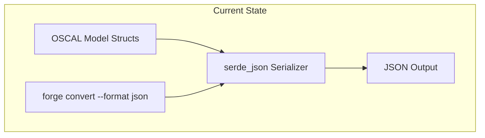
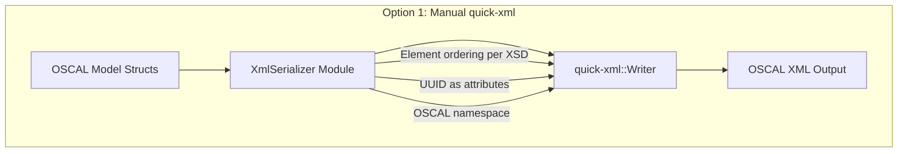
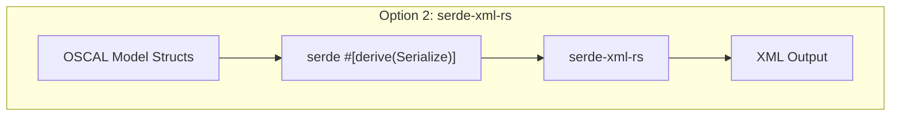
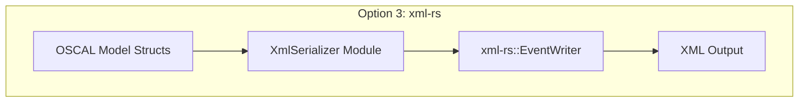
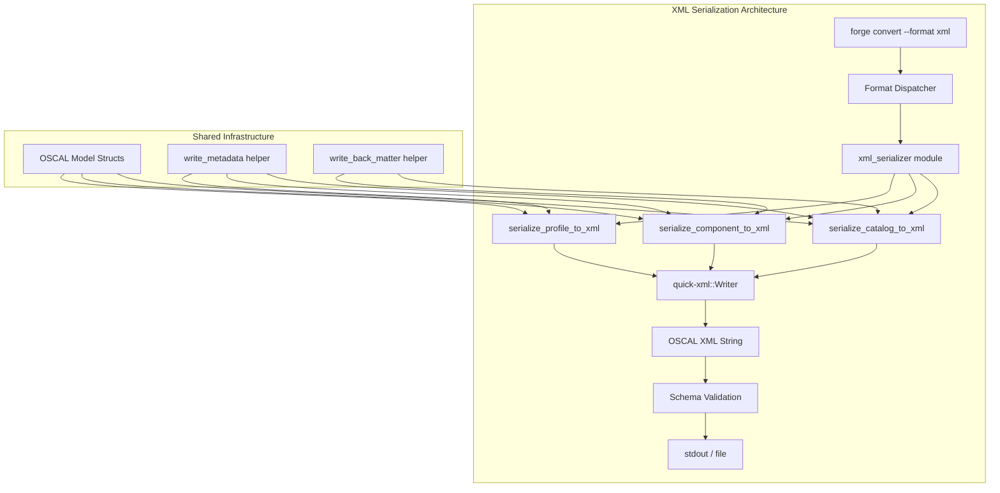
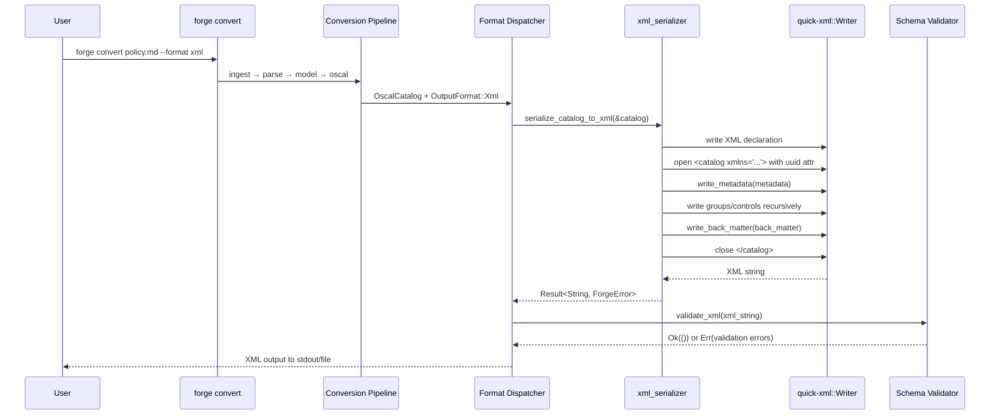

# 026-ar-xml-output

> **Document Type:** Architecture Review
> **Audience:** LLM agents, human reviewers
> **Status:** Proposed
> **Last Updated:** 2026-02-10 <!-- @auto -->
> **Owner:** Brian Luby <!-- @human-required -->
> **Deciders:** Brian Luby <!-- @human-required -->

---

## Review Tier Legend

| Marker | Tier | Speckit Behavior |
|--------|------|------------------|
| 🔴 `@human-required` | Human Generated | Prompt human to author; blocks until complete |
| 🟡 `@human-review` | LLM + Human Review | LLM drafts → prompt human to confirm/edit; blocks until confirmed |
| 🟢 `@llm-autonomous` | LLM Autonomous | LLM completes; no prompt; logged for audit |
| ⚪ `@auto` | Auto-generated | System fills (timestamps, links); no prompt |

---

## Document Completion Order

> ⚠️ **For LLM Agents:** Complete sections in this order. Do not fill downstream sections until upstream human-required inputs exist.

1. **Summary (Decision)** → requires human input first
2. **Context (Problem Space)** → requires human input
3. **Decision Drivers** → requires human input (prioritized)
4. **Driving Requirements** → extract from PRD, human confirms
5. **Options Considered** → LLM drafts after drivers exist, human reviews
6. **Decision (Selected + Rationale)** → requires human decision
7. **Implementation Guardrails** → LLM drafts, human reviews
8. **Everything else** → can proceed after decision is made

---

## Linkage ⚪ `@auto`

| Document | ID | Relationship |
|----------|-----|--------------|
| Parent PRD | [026-prd-xml-output](../PRD/026-prd-xml-output.md) | Requirements this architecture satisfies |
| Security Review | N/A | No security concerns beyond standard XML generation |
| Supersedes | — | N/A |
| Superseded By | — | |

---

## Summary

### Decision 🔴 `@human-required`
> Use `quick-xml::Writer` with manual element construction for OSCAL XML serialization, implementing a dedicated `XmlSerializer` trait that maps OSCAL model structs to XML elements with correct namespace handling, attribute placement, and element ordering per the OSCAL Metaschema.

### TL;DR for Agents 🟡 `@human-review`
> FORGE serializes OSCAL models to XML using `quick-xml::Writer` with manual element construction -- NOT serde derive. Each OSCAL model type (Catalog, Component Definition, Profile) gets a `serialize_to_xml` function that writes elements in XSD-defined order with the OSCAL namespace `http://csrc.nist.gov/ns/oscal/1.0`. UUIDs and similar identifiers are XML attributes, not child elements. Do NOT use `serde-xml-rs` or string concatenation. Do NOT skip the XML declaration or namespace.

---

## Context

### Problem Space 🔴 `@human-required`
FORGE produces OSCAL artifacts in JSON format (Phase 1). Extending output to XML requires a serialization layer that translates the internal OSCAL model structs into well-formed, schema-valid OSCAL XML. The challenge is that OSCAL XML has specific conventions that differ from JSON: UUIDs are attributes rather than child elements, element ordering is prescribed by the XSD, namespace declarations are required, and JSON array patterns map to repeated XML elements. A generic serde-to-XML bridge cannot handle these conventions reliably, so the architecture must address how to produce correct OSCAL XML from the same model structs that produce JSON.

### Decision Scope 🟡 `@human-review`

**This AR decides:**
- How OSCAL model structs are serialized to XML (manual vs derive vs hybrid)
- Which Rust crate performs XML writing
- How XML namespaces, attributes, and element ordering are managed
- How the XML serializer integrates with the existing output format dispatch

**This AR does NOT decide:**
- YAML serialization approach -- deferred to 027-ar-yaml-output
- Round-trip testing strategy -- deferred to 028-ar-round-trip-testing
- XML schema validation tooling -- reuses WI-19/WI-20 validation infrastructure
- `forge export` subcommand design -- deferred to 029-ar-export-subcommand

### Current State 🟢 `@llm-autonomous`
FORGE has a working JSON serialization pipeline using `serde_json` with `#[derive(Serialize)]` on OSCAL model structs. The `OutputFormat` enum currently supports `Json` only. The `forge convert` command accepts `--format json` and writes JSON to stdout or a file. The internal OSCAL model structs (Catalog, ComponentDefinition, Metadata, Control, Group, etc.) are the canonical representation.



### Driving Requirements 🟡 `@human-review`

| PRD Req ID | Requirement Summary | Architectural Implication |
|------------|---------------------|---------------------------|
| M-1 | Serialize Catalog to valid OSCAL v1.2.0 XML via quick-xml | Serialization layer must handle Catalog's group/control hierarchy |
| M-2 | Serialize Component Definition to valid XML | Same serializer pattern must extend to Component Definition model |
| M-3 | Proper XML declaration and OSCAL namespace | Serializer must emit `<?xml?>` declaration and `xmlns` attribute |
| M-4 | `forge convert --format xml` produces XML output | OutputFormat enum and CLI dispatch must support XML variant |
| M-5 | Generated XML validates against OSCAL v1.2.0 XSD | Element ordering, attribute placement must match XSD |
| M-6 | Semantic equivalence between JSON and XML | Same data model serialized differently; no data loss |
| M-7 | Correct JSON-to-XML property name mapping | Mapping layer required for OSCAL Metaschema conventions |

**PRD Constraints inherited:**
- From constitution: Rust latest stable, `quick-xml` crate, thiserror for errors, TDD mandatory
- From parent PRD: OSCAL v1.2.0, UTF-8 encoding, MIT/Apache-2.0 dependencies only

---

## Decision Drivers 🔴 `@human-required`

1. **OSCAL conformance:** Generated XML must pass OSCAL v1.2.0 XSD schema validation -- element ordering, attribute placement, and namespace handling must be exact *(traces to PRD M-5)*
2. **Semantic fidelity:** XML output must carry identical data to JSON output with zero data loss *(traces to PRD M-6)*
3. **Extensibility:** The XML serialization pattern must extend cleanly to new OSCAL model types (Profile, Assessment Plan) without rewriting *(traces to roadmap T-5, T-6)*
4. **Simplicity:** Minimize custom code; leverage the crate ecosystem where reliable *(constitution principle X)*

---

## Options Considered 🟡 `@human-review`

### Option 0: Status Quo / Do Nothing

**Description:** Continue producing only JSON output. Users who need XML use external tools (e.g., oscal-cli, jq+xsltproc) to convert.

| Driver | Rating | Notes |
|--------|--------|-------|
| OSCAL conformance | ❌ Poor | No XML output at all |
| Semantic fidelity | N/A | No conversion to verify |
| Extensibility | ❌ Poor | Blocks WI-28, WI-29, and downstream Phase 2 work |
| Simplicity | ✅ Good | No new code |

**Why not viable:** Parent PRD S-3 mandates XML output. WI-28 (round-trip testing) and WI-29 (export subcommand) are blocked. MS-5 cannot be reached.

---

### Option 1: quick-xml with Manual Element Construction (Recommended)

**Description:** Use `quick-xml::Writer` to construct XML output programmatically. Each OSCAL model type has a dedicated serialization function that writes elements in XSD-defined order, places UUIDs as attributes, and manages the OSCAL namespace.



| Driver | Rating | Notes |
|--------|--------|-------|
| OSCAL conformance | ✅ Good | Full control over element ordering, attributes, and namespaces |
| Semantic fidelity | ✅ Good | Maps each model field explicitly; no hidden transformations |
| Extensibility | ✅ Good | New model types add new serialization functions following the same pattern |
| Simplicity | ⚠️ Medium | More code than derive-based; but code is straightforward and testable |

**Pros:**
- Full control over XML output structure -- essential for OSCAL XSD compliance
- `quick-xml` is fast (zero-copy where possible), well-maintained (MIT license), and supports namespaces natively
- Each model type's serializer is independently testable
- No hidden magic -- explicit mapping from struct fields to XML elements

**Cons:**
- More boilerplate than derive-based serialization
- Serialization functions must be maintained in sync with model struct changes
- Element ordering must be manually verified against the XSD

---

### Option 2: serde-xml-rs (Derive-Based Serialization)

**Description:** Use `serde-xml-rs` (or `quick-xml` serde feature) to serialize OSCAL model structs to XML via `#[derive(Serialize)]` with XML-specific serde attributes.



| Driver | Rating | Notes |
|--------|--------|-------|
| OSCAL conformance | ❌ Poor | Cannot control element ordering; limited namespace support; abandoned crate |
| Semantic fidelity | ⚠️ Medium | Derive-based may handle simple cases but fails on OSCAL-specific conventions |
| Extensibility | ⚠️ Medium | New types get serialization for free via derive, but OSCAL quirks require overrides |
| Simplicity | ✅ Good | Minimal code; same derive macros as JSON |

**Pros:**
- Minimal boilerplate -- same `#[derive(Serialize)]` already on structs
- Familiar serde pattern

**Cons:**
- `serde-xml-rs` is abandoned (no updates since 2022)
- Cannot control element ordering (OSCAL XSD requires specific order)
- Namespace handling is limited and fragile
- UUID-as-attribute vs UUID-as-element cannot be controlled per-field without extensive `#[serde]` attribute gymnastics
- JSON serde attributes conflict with XML serde attributes on the same structs

---

### Option 3: xml-rs Streaming Writer

**Description:** Use `xml-rs::EventWriter` for low-level XML event writing. Similar to Option 1 but with a different underlying crate.



| Driver | Rating | Notes |
|--------|--------|-------|
| OSCAL conformance | ✅ Good | Same level of control as quick-xml |
| Semantic fidelity | ✅ Good | Explicit field mapping |
| Extensibility | ✅ Good | Same pattern as Option 1 |
| Simplicity | ⚠️ Medium | More verbose API than quick-xml; slower performance |

**Pros:**
- Pure Rust, streaming XML writer
- Full control over output structure

**Cons:**
- Slower than `quick-xml` (benchmarked 2-5x slower)
- Less actively maintained than `quick-xml`
- More verbose API for common operations
- No advantage over `quick-xml` for FORGE's use case

---

## Decision

### Selected Option 🔴 `@human-required`
> **Option 1: quick-xml with Manual Element Construction**

### Rationale 🔴 `@human-required`
Option 1 provides the precise control over XML output structure that OSCAL XSD compliance demands. OSCAL XML has specific conventions (UUIDs as attributes, mandatory element ordering, namespace declarations) that derive-based serializers cannot handle reliably. `quick-xml` is the fastest Rust XML crate, is well-maintained under MIT license, and is already identified in the parent PRD tool candidates. The additional boilerplate compared to derive-based serialization is justified by the requirement for 100% XSD schema validation (PRD M-5). Option 2 is rejected because the serde-xml-rs crate is abandoned and cannot handle OSCAL-specific conventions. Option 3 offers no advantage over quick-xml and is slower.

#### Simplest Implementation Comparison 🟡 `@human-review`

| Aspect | Simplest Possible | Selected Option | Justification for Complexity |
|--------|-------------------|-----------------|------------------------------|
| Components | Single `to_xml_string()` function | XmlSerializer module with per-model-type functions | PRD M-1, M-2 require Catalog and Component Definition support |
| Dependencies | serde-xml-rs derive | quick-xml manual writer | PRD M-5 requires XSD-valid output; derive cannot guarantee element ordering |
| Patterns | Generic serde serialization | Manual field-to-element mapping | PRD M-7 requires correct OSCAL Metaschema property name mapping |

**Complexity justified by:** OSCAL XML's strict element ordering and attribute placement requirements (PRD M-5, M-7) cannot be met by generic serde-XML bridges. Manual construction is the minimum approach that guarantees XSD compliance.

### Architecture Diagram 🟡 `@human-review`



---

## Technical Specification

### Component Overview 🟡 `@human-review`

| Component | Responsibility | Interface | Dependencies |
|-----------|---------------|-----------|--------------|
| xml_serializer module | Houses all XML serialization functions | Library API | quick-xml, OSCAL model structs |
| serialize_catalog_to_xml | Serializes Catalog model to XML string | `fn(&OscalCatalog) -> Result<String, ForgeError>` | quick-xml::Writer, write_metadata, write_back_matter |
| serialize_component_to_xml | Serializes Component Definition to XML string | `fn(&OscalComponentDefinition) -> Result<String, ForgeError>` | quick-xml::Writer, write_metadata, write_back_matter |
| serialize_profile_to_xml | Serializes Profile to XML string | `fn(&OscalProfile) -> Result<String, ForgeError>` | quick-xml::Writer, write_metadata |
| write_metadata | Shared helper for OSCAL metadata XML block | Internal helper | quick-xml::Writer |
| write_back_matter | Shared helper for OSCAL back-matter XML block | Internal helper | quick-xml::Writer |
| Format Dispatcher | Routes `--format xml` to XML serializer | CLI dispatch | xml_serializer module |

### Data Flow 🟢 `@llm-autonomous`



### Interface Definitions 🟡 `@human-review`

```rust
use quick_xml::events::{BytesDecl, BytesEnd, BytesStart, BytesText, Event};
use quick_xml::Writer;
use std::io::Cursor;

/// OSCAL XML namespace
const OSCAL_NS: &str = "http://csrc.nist.gov/ns/oscal/1.0";

/// Serialize an OSCAL Catalog to a valid XML string
pub fn serialize_catalog_to_xml(
    catalog: &OscalCatalog,
) -> Result<String, ForgeError> {
    let mut writer = Writer::new_with_indent(Cursor::new(Vec::new()), b' ', 2);

    // XML declaration
    writer.write_event(Event::Decl(BytesDecl::new("1.0", Some("UTF-8"), None)))?;

    // Root element with namespace and uuid attribute
    let mut root = BytesStart::new("catalog");
    root.push_attribute(("xmlns", OSCAL_NS));
    root.push_attribute(("uuid", catalog.uuid.as_str()));
    writer.write_event(Event::Start(root))?;

    // Metadata, groups, controls, back-matter in XSD order
    write_metadata(&mut writer, &catalog.metadata)?;
    for group in &catalog.groups {
        write_group(&mut writer, group)?;
    }
    if let Some(ref bm) = catalog.back_matter {
        write_back_matter(&mut writer, bm)?;
    }

    writer.write_event(Event::End(BytesEnd::new("catalog")))?;

    let xml_bytes = writer.into_inner().into_inner();
    String::from_utf8(xml_bytes).map_err(|e| ForgeError::Serialization(e.to_string()))
}

/// Generic dispatch for any OSCAL artifact to XML
pub fn serialize_to_xml(
    artifact: &OscalArtifact,
    format: OutputFormat,
) -> Result<String, ForgeError> {
    match artifact {
        OscalArtifact::Catalog(c) => serialize_catalog_to_xml(c),
        OscalArtifact::ComponentDefinition(cd) => serialize_component_to_xml(cd),
        OscalArtifact::Profile(p) => serialize_profile_to_xml(p),
    }
}
```

### Key Algorithms/Patterns 🟡 `@human-review`

**Pattern:** Recursive element writer with shared helpers
```
1. Write XML declaration (<?xml version="1.0" encoding="UTF-8"?>)
2. Open root element with xmlns and uuid attribute
3. Write child elements in XSD-prescribed order:
   a. metadata (shared helper)
   b. model-specific content (groups/controls for Catalog, components for CompDef)
   c. back-matter (shared helper)
4. Close root element
5. Convert byte buffer to UTF-8 string
```

**Pattern:** Attribute vs Element decision rule
```
OSCAL convention:
- uuid → always an XML attribute
- All other fields → child elements
- JSON arrays → repeated XML elements (no wrapper element)
- JSON property names with hyphens → XML element names with hyphens
```

---

## Constraints & Boundaries

### Technical Constraints 🟡 `@human-review`

**Inherited from PRD:**
- Rust latest stable toolchain
- `quick-xml` crate for XML writing (parent PRD tool candidates)
- OSCAL v1.2.0 XML schemas (XSD) define the valid structure
- TDD mandatory (constitution principle IV)
- UTF-8 encoding

**Added by this Architecture:**
- XML element ordering must match the OSCAL v1.2.0 XSD sequence definitions
- `uuid` fields are serialized as XML attributes on their parent element
- The OSCAL namespace `http://csrc.nist.gov/ns/oscal/1.0` must appear on the root element only
- Shared helper functions (`write_metadata`, `write_back_matter`) are used by all model serializers
- Pretty-printing uses 2-space indentation via `Writer::new_with_indent`

### Architectural Boundaries 🟡 `@human-review`

- **Owns:** `xml_serializer` module, XML-specific helper functions
- **Interfaces With:** OSCAL model structs (reads), Format Dispatcher (called by), Schema Validator (output validated by)
- **Must Not Touch:** OSCAL model struct definitions (no XML-specific serde attributes), JSON serialization code, the conversion pipeline

### Implementation Guardrails 🟡 `@human-review`

> ⚠️ **Critical for LLM Agents:**

- [x] **DO NOT** add XML-specific `#[serde]` attributes to OSCAL model structs -- the model is format-agnostic *(PRD M-6 semantic equivalence)*
- [x] **DO NOT** use `serde-xml-rs` or any serde-XML derive bridge -- it cannot handle OSCAL element ordering *(PRD M-5 XSD validation)*
- [x] **DO NOT** construct XML via string concatenation -- use `quick-xml::Writer` for proper escaping *(PRD M-3 well-formedness)*
- [x] **DO NOT** skip the XML declaration or OSCAL namespace -- both are required *(PRD M-3)*
- [x] **MUST** write XML elements in the order prescribed by the OSCAL v1.2.0 XSD *(PRD M-5)*
- [x] **MUST** serialize `uuid` fields as XML attributes, not child elements *(PRD M-7 Metaschema mapping)*
- [x] **MUST** validate generated XML against OSCAL XSD in tests *(PRD M-5)*

---

## Consequences 🟡 `@human-review`

### Positive
- Full control over XML output ensures 100% XSD schema validation compliance
- `quick-xml` is the fastest Rust XML writer, keeping serialization well under performance targets
- Shared helper pattern reduces duplication across model serializers
- Explicit mapping serves as documentation of OSCAL JSON-to-XML conventions

### Negative
- More boilerplate than derive-based serialization (estimated 200-400 LOC per model type)
- Serialization functions must be updated when OSCAL model structs change

### Risks & Mitigations

| Risk | Likelihood | Impact | Mitigation |
|------|------------|--------|------------|
| Element ordering errors cause XSD validation failures | Med | Med | XSD validation in unit tests catches ordering errors immediately |
| Model struct changes break XML serialization silently | Low | Med | Integration tests with golden-file XML outputs catch drift |

---

## Implementation Guidance

### Suggested Implementation Order 🟢 `@llm-autonomous`
1. Add `quick-xml` dependency to `Cargo.toml`
2. Create `src/export/xml_serializer.rs` module (or `src/oscal/xml.rs`)
3. Implement `write_metadata` shared helper with unit tests
4. Implement `serialize_catalog_to_xml` with unit tests
5. Implement `serialize_component_to_xml` with unit tests
6. Implement `serialize_profile_to_xml` (S-3) with unit tests
7. Add `Xml` variant to `OutputFormat` enum
8. Wire CLI dispatch for `--format xml`
9. Add integration tests validating XML against OSCAL XSD

### Testing Strategy 🟢 `@llm-autonomous`

| Layer | Test Type | Coverage Target | Notes |
|-------|-----------|-----------------|-------|
| Unit | write_metadata helper | 100% | All metadata fields present |
| Unit | serialize_catalog_to_xml | 90% | Groups, controls, props, links, parts |
| Unit | serialize_component_to_xml | 90% | Components, implemented-requirements |
| Integration | XML against XSD | 100% of M-reqs | Use xmllint or oscal-cli in CI |
| Integration | JSON-XML semantic equivalence | 100% | Compare deserialized models |

### Anti-patterns to Avoid 🟡 `@human-review`
- **Don't:** Use serde derive with a generic XML serializer
  - **Why:** OSCAL XML has specific element ordering and attribute conventions that generic bridges cannot handle
  - **Instead:** Use `quick-xml::Writer` with manual element construction
- **Don't:** Skip element ordering verification in tests
  - **Why:** Out-of-order elements will pass well-formedness checks but fail XSD validation
  - **Instead:** Validate against OSCAL XSD in every test that produces XML

---

## Compliance & Cross-cutting Concerns

### Security Considerations 🟡 `@human-review`
- Authentication: N/A -- local CLI tool
- Authorization: N/A
- Data handling: XML output may contain sensitive policy content; same risk profile as JSON output

### Observability 🟢 `@llm-autonomous`
- **Logging:** Log XML serialization start/end at DEBUG level with artifact type and size
- **Metrics:** N/A for serialization
- **Tracing:** N/A for serialization

### Error Handling Strategy 🟢 `@llm-autonomous`
```
Error Category → Handling Approach
├── quick-xml write errors → Wrap in ForgeError::Serialization
├── UTF-8 conversion errors → Wrap in ForgeError::Serialization
├── Missing required fields → ForgeError::Validation (should not happen if model is valid)
└── XSD validation failures → ForgeError::Validation with field path details
```

---

## Migration Plan (if applicable) 🟡 `@human-review`

N/A -- greenfield addition of XML serialization capability. No existing XML code to migrate.

### Rollback Plan 🔴 `@human-required`

N/A -- additive feature. If XML serialization proves incorrect, the `Xml` variant can be removed from `OutputFormat` and the `xml_serializer` module can be deleted. JSON output is unaffected.

---

## Open Questions 🟡 `@human-review`

No open questions for this work item.

---

## Changelog ⚪ `@auto`

| Version | Date | Author | Changes |
|---------|------|--------|---------|
| 0.1 | 2026-02-10 | LLM (Claude) | Initial proposal |

---

## Decision Record ⚪ `@auto`

| Date | Event | Details |
|------|-------|---------|
| 2026-02-10 | Proposed | Initial draft created from PRD 026 |

---

## Traceability Matrix 🟢 `@llm-autonomous`

| PRD Req ID | Decision Driver | Option Rating | Component | Notes |
|------------|-----------------|---------------|-----------|-------|
| M-1 | OSCAL conformance | Option 1: ✅ | serialize_catalog_to_xml | Catalog XML via quick-xml Writer |
| M-2 | OSCAL conformance | Option 1: ✅ | serialize_component_to_xml | Component Definition XML |
| M-3 | OSCAL conformance | Option 1: ✅ | xml_serializer module | XML declaration + namespace on root |
| M-4 | Extensibility | Option 1: ✅ | Format Dispatcher | OutputFormat::Xml variant + CLI dispatch |
| M-5 | OSCAL conformance | Option 1: ✅ | xml_serializer module | Element ordering per XSD |
| M-6 | Semantic fidelity | Option 1: ✅ | xml_serializer module | Explicit field mapping, no data loss |
| M-7 | OSCAL conformance | Option 1: ✅ | xml_serializer module | UUID as attributes, correct element names |

---

## Review Checklist 🟢 `@llm-autonomous`

Before marking as Accepted:
- [x] All PRD Must Have requirements appear in Driving Requirements
- [x] Option 0 (Status Quo) is documented
- [x] Simplest Implementation comparison is completed
- [x] Decision drivers are prioritized and addressed
- [x] At least 2 options were seriously considered
- [x] Constraints distinguish inherited vs. new
- [x] Component names are consistent across all diagrams and tables
- [x] Implementation guardrails reference specific PRD constraints
- [x] Rollback triggers and authority are defined (N/A -- additive feature)
- [x] Security review is linked or N/A documented
- [x] No open questions blocking implementation
