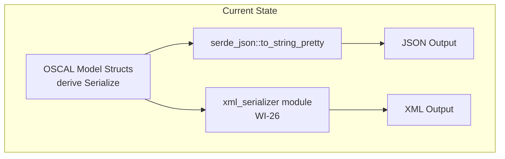
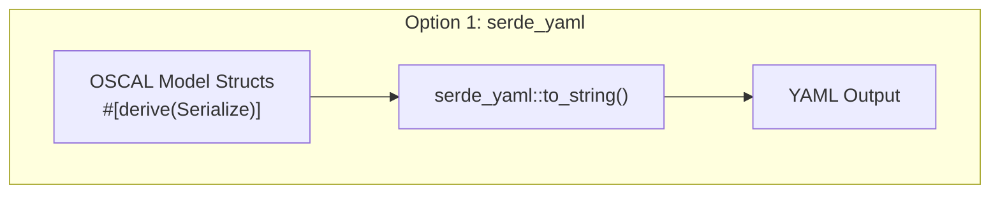
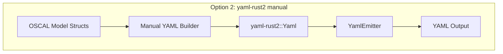
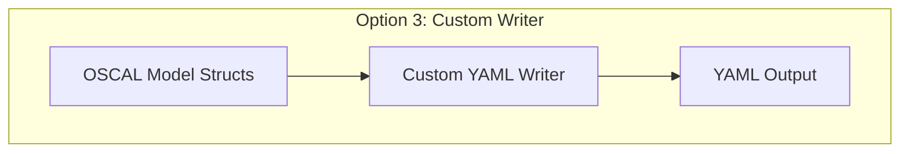
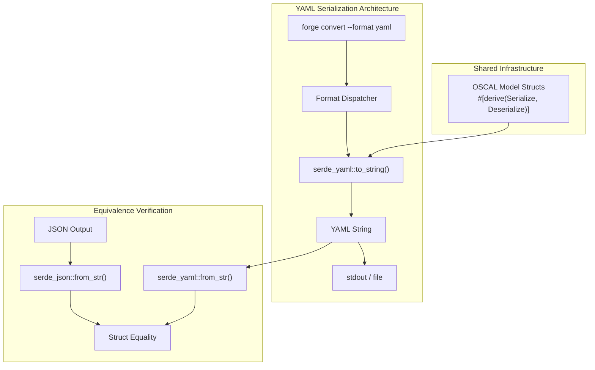
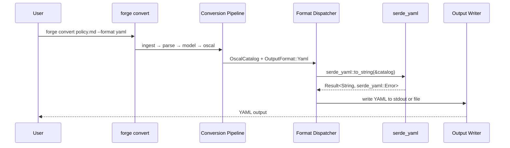

# 027-ar-yaml-output

> **Document Type:** Architecture Review
> **Audience:** LLM agents, human reviewers
> **Status:** Proposed
> **Last Updated:** 2026-02-10 <!-- @auto -->
> **Owner:** Brian Luby <!-- @human-required -->
> **Deciders:** Brian Luby <!-- @human-required -->

---

## Review Tier Legend

| Marker | Tier | Speckit Behavior |
|--------|------|------------------|
| 🔴 `@human-required` | Human Generated | Prompt human to author; blocks until complete |
| 🟡 `@human-review` | LLM + Human Review | LLM drafts → prompt human to confirm/edit; blocks until confirmed |
| 🟢 `@llm-autonomous` | LLM Autonomous | LLM completes; no prompt; logged for audit |
| ⚪ `@auto` | Auto-generated | System fills (timestamps, links); no prompt |

---

## Document Completion Order

> ⚠️ **For LLM Agents:** Complete sections in this order. Do not fill downstream sections until upstream human-required inputs exist.

1. **Summary (Decision)** → requires human input first
2. **Context (Problem Space)** → requires human input
3. **Decision Drivers** → requires human input (prioritized)
4. **Driving Requirements** → extract from PRD, human confirms
5. **Options Considered** → LLM drafts after drivers exist, human reviews
6. **Decision (Selected + Rationale)** → requires human decision
7. **Implementation Guardrails** → LLM drafts, human reviews
8. **Everything else** → can proceed after decision is made

---

## Linkage ⚪ `@auto`

| Document | ID | Relationship |
|----------|-----|--------------|
| Parent PRD | [027-prd-yaml-output](../PRD/027-prd-yaml-output.md) | Requirements this architecture satisfies |
| Security Review | N/A | No security concerns beyond standard YAML generation |
| Supersedes | — | N/A |
| Superseded By | — | |

---

## Summary

### Decision 🔴 `@human-required`
> Use `serde_yaml` for OSCAL YAML serialization, leveraging the existing `#[derive(Serialize, Deserialize)]` macros on OSCAL model structs for zero-additional-code serialization to YAML format.

### TL;DR for Agents 🟡 `@human-review`
> FORGE serializes OSCAL models to YAML using `serde_yaml::to_string()` on the same model structs that already serialize to JSON via `serde_json`. No model changes are needed -- `serde_yaml` is a drop-in serde backend. The `OutputFormat` enum gains a `Yaml` variant, and the format dispatcher routes to `serde_yaml`. Semantic equivalence is verified by deserializing both JSON and YAML back to Rust structs and comparing. Do NOT write custom YAML formatting logic. Do NOT add YAML-specific serde attributes to model structs.

---

## Context

### Problem Space 🔴 `@human-required`
FORGE needs YAML output to serve compliance engineers working in DevOps and infrastructure-as-code ecosystems (Ansible, Kubernetes, GitHub Actions) where YAML is the native format. Unlike XML serialization (026-ar-xml-output), which requires manual element construction due to OSCAL XML conventions, YAML serialization maps naturally through serde because YAML and JSON share the same data model (objects, arrays, strings, numbers, booleans, nulls). The architectural question is whether to use serde-based serialization (simple, leverages existing derives) or invest in custom YAML formatting (more control over output style).

### Decision Scope 🟡 `@human-review`

**This AR decides:**
- Which Rust crate performs YAML serialization
- Whether serde derive or manual serialization is used
- How YAML serialization integrates with the existing output format dispatch
- How semantic equivalence between JSON and YAML is verified

**This AR does NOT decide:**
- XML serialization approach -- decided in 026-ar-xml-output
- Round-trip testing strategy -- deferred to 028-ar-round-trip-testing
- `forge export` subcommand design -- deferred to 029-ar-export-subcommand
- Custom YAML style options (quoting, flow vs block) -- deferred per PRD W-3

### Current State 🟢 `@llm-autonomous`
FORGE has a working JSON serialization pipeline. OSCAL model structs already derive `serde::Serialize` and `serde::Deserialize`. The `OutputFormat` enum supports `Json` and (after WI-26) `Xml`. The `forge convert` command routes output through a format dispatcher.



### Driving Requirements 🟡 `@human-review`

| PRD Req ID | Requirement Summary | Architectural Implication |
|------------|---------------------|---------------------------|
| M-1 | Serialize Catalog to valid YAML via serde_yaml | serde_yaml must handle Catalog struct serialization |
| M-2 | Serialize Component Definition to valid YAML | Same serde_yaml serialization must work for all model types |
| M-3 | YAML semantically equivalent to JSON | Deserialized models must be identical; serde ensures this |
| M-4 | `--format yaml` on forge export | OutputFormat::Yaml variant and CLI dispatch |
| M-5 | YAML to stdout or file via --output | Reuse existing output writing patterns |
| M-6 | All OSCAL required metadata fields present | Metadata struct serialization must be complete |

**PRD Constraints inherited:**
- From constitution: Rust latest stable, serde ecosystem, thiserror, TDD mandatory
- From parent PRD: OSCAL v1.2.0, semantic equivalence with JSON, `serde_yaml` at latest stable version

---

## Decision Drivers 🔴 `@human-required`

1. **Semantic equivalence:** YAML and JSON must deserialize to identical Rust model structs *(traces to PRD M-3)*
2. **Simplicity:** Leverage existing serde derives; minimize new code *(constitution principle X)*
3. **Correctness:** YAML output must be parseable by any YAML 1.2 parser and contain all OSCAL data *(traces to PRD M-1)*
4. **Maintainability:** Adding new OSCAL model types should require zero YAML-specific code *(extensibility)*

---

## Options Considered 🟡 `@human-review`

### Option 0: Status Quo / Do Nothing

**Description:** Continue producing only JSON (and XML after WI-26) output. Users who need YAML use external tools.

| Driver | Rating | Notes |
|--------|--------|-------|
| Semantic equivalence | N/A | No YAML to compare |
| Simplicity | ✅ Good | No new code |
| Correctness | ❌ Poor | No YAML output at all |
| Maintainability | ❌ Poor | Blocks WI-28, WI-29, MS-5 |

**Why not viable:** Parent PRD S-4 mandates YAML output. WI-28 (round-trip testing) and MS-5 are blocked.

---

### Option 1: serde_yaml with Existing Derive Macros (Recommended)

**Description:** Add `serde_yaml` as a dependency. Serialize OSCAL model structs to YAML by calling `serde_yaml::to_string(&model)`. No model changes needed since structs already derive `Serialize`.



| Driver | Rating | Notes |
|--------|--------|-------|
| Semantic equivalence | ✅ Good | Same serde Serialize impl produces both JSON and YAML; structural identity guaranteed |
| Simplicity | ✅ Good | Single function call; zero model changes; ~10 lines of new code |
| Correctness | ✅ Good | serde_yaml produces YAML 1.2 compliant output |
| Maintainability | ✅ Good | New model types automatically serialize to YAML via derive |

**Pros:**
- Minimal implementation effort -- one new dependency, one function call per model type
- Structural consistency with JSON guaranteed by serde's Serialize trait
- Well-maintained crate (MIT/Apache-2.0), standard in the Rust ecosystem
- New OSCAL model types get YAML serialization for free via `#[derive(Serialize)]`

**Cons:**
- Limited control over YAML output style (indentation, quoting, multiline strings)
- serde_yaml uses YAML 1.2 by default, which may differ from OSCAL community YAML examples in style (not content)
- If serde_yaml becomes unmaintained, must switch to serde_yml fork

---

### Option 2: yaml-rust2 with Manual Serialization

**Description:** Use `yaml-rust2` for low-level YAML construction. Manually map each struct field to a YAML node, similar to the quick-xml manual approach used for XML.



| Driver | Rating | Notes |
|--------|--------|-------|
| Semantic equivalence | ✅ Good | Manual mapping can ensure equivalence, but requires explicit verification |
| Simplicity | ❌ Poor | Hundreds of lines of manual mapping code; duplicates serde's work |
| Correctness | ✅ Good | Full control over output |
| Maintainability | ❌ Poor | Every model change requires updating YAML serialization code |

**Pros:**
- Full control over YAML output formatting (indentation, quoting, multiline style)
- No dependency on serde_yaml crate maintenance

**Cons:**
- Massive code duplication -- manually reimplements what serde already does
- High maintenance burden -- every struct field change must be reflected in YAML serialization
- No advantage for OSCAL YAML because (unlike XML) YAML has no ordering or attribute conventions
- Violates constitution principle X (YAGNI)

---

### Option 3: Custom YAML Writer

**Description:** Write a custom YAML emitter that produces OSCAL-specific YAML with controlled formatting (block scalars for prose, specific key ordering).



| Driver | Rating | Notes |
|--------|--------|-------|
| Semantic equivalence | ⚠️ Medium | Custom serialization risks introducing divergence from JSON |
| Simplicity | ❌ Poor | Significant custom code; reinvents the wheel |
| Correctness | ⚠️ Medium | Custom emitter must be validated against YAML spec |
| Maintainability | ❌ Poor | Full custom serialization layer to maintain |

**Pros:**
- Maximum control over output formatting

**Cons:**
- Reinvents YAML serialization from scratch
- High risk of subtle YAML spec violations
- Unjustified complexity for FORGE's needs

---

## Decision

### Selected Option 🔴 `@human-required`
> **Option 1: serde_yaml with Existing Derive Macros**

### Rationale 🔴 `@human-required`
Option 1 is the clear winner because YAML and JSON share the same data model. Unlike XML (which has element ordering, attributes, and namespaces), YAML serialization maps trivially through serde. The OSCAL model structs already derive `Serialize`, so `serde_yaml::to_string()` produces correct YAML output with zero additional model code. Options 2 and 3 are rejected because they add hundreds of lines of manual code that duplicates what serde already provides, violating YAGNI (constitution principle X). The only scenario where manual YAML construction would be justified is if OSCAL YAML had formatting conventions that serde_yaml cannot satisfy -- but OSCAL YAML has no such conventions.

#### Simplest Implementation Comparison 🟡 `@human-review`

| Aspect | Simplest Possible | Selected Option | Justification for Complexity |
|--------|-------------------|-----------------|------------------------------|
| Components | `serde_yaml::to_string()` call | serde_yaml + format dispatch + equivalence tests | PRD M-3 requires verified equivalence |
| Dependencies | serde_yaml only | serde_yaml only | No additional dependencies needed |
| Patterns | Direct serialization | Dispatch through OutputFormat enum | PRD M-4 requires CLI integration |

**Complexity justified by:** The selected option IS the simplest approach. serde_yaml with existing derives is the minimum viable implementation.

### Architecture Diagram 🟡 `@human-review`



---

## Technical Specification

### Component Overview 🟡 `@human-review`

| Component | Responsibility | Interface | Dependencies |
|-----------|---------------|-----------|--------------|
| yaml_serializer module | YAML serialization functions | Library API | serde_yaml, OSCAL model structs |
| serialize_to_yaml | Generic YAML serialization for any serde-serializable model | `fn<T: Serialize>(model: &T) -> Result<String, ForgeError>` | serde_yaml |
| serialize_catalog_to_yaml | Catalog-specific entry point | `fn(&OscalCatalog) -> Result<String, ForgeError>` | serialize_to_yaml |
| serialize_component_to_yaml | Component Definition-specific entry point | `fn(&OscalComponentDefinition) -> Result<String, ForgeError>` | serialize_to_yaml |
| deserialize_from_yaml | YAML deserialization for equivalence testing | `fn<T: DeserializeOwned>(yaml: &str) -> Result<T, ForgeError>` | serde_yaml |
| Format Dispatcher | Routes `--format yaml` to YAML serializer | CLI dispatch | yaml_serializer module |

### Data Flow 🟢 `@llm-autonomous`



### Interface Definitions 🟡 `@human-review`

```rust
use serde::Serialize;
use serde::de::DeserializeOwned;

/// Serialize any serde-serializable OSCAL model to YAML
pub fn serialize_to_yaml<T: Serialize>(model: &T) -> Result<String, ForgeError> {
    serde_yaml::to_string(model)
        .map_err(|e| ForgeError::Serialization(format!("YAML serialization failed: {e}")))
}

/// Deserialize a YAML string back to an OSCAL model (for equivalence testing)
pub fn deserialize_from_yaml<T: DeserializeOwned>(yaml: &str) -> Result<T, ForgeError> {
    serde_yaml::from_str(yaml)
        .map_err(|e| ForgeError::Serialization(format!("YAML deserialization failed: {e}")))
}

/// Serialize an OSCAL Catalog to YAML
pub fn serialize_catalog_to_yaml(catalog: &OscalCatalog) -> Result<String, ForgeError> {
    serialize_to_yaml(catalog)
}

/// Serialize an OSCAL Component Definition to YAML
pub fn serialize_component_definition_to_yaml(
    component_def: &OscalComponentDefinition,
) -> Result<String, ForgeError> {
    serialize_to_yaml(component_def)
}

/// Extended output format enumeration
#[derive(Debug, Clone, Copy, clap::ValueEnum)]
pub enum OutputFormat {
    Json,
    Xml,
    Yaml,
}
```

### Key Algorithms/Patterns 🟡 `@human-review`

**Pattern:** Serde-delegated serialization
```
1. Accept reference to OSCAL model struct
2. Call serde_yaml::to_string(&model)
3. Map serde_yaml::Error to ForgeError::Serialization
4. Return YAML string
```

**Pattern:** Semantic equivalence verification
```
1. Serialize model to JSON via serde_json
2. Serialize same model to YAML via serde_yaml
3. Deserialize JSON string back to model struct
4. Deserialize YAML string back to model struct
5. Assert deserialized structs are equal (PartialEq)
```

---

## Constraints & Boundaries

### Technical Constraints 🟡 `@human-review`

**Inherited from PRD:**
- Rust latest stable toolchain
- `serde_yaml` at latest stable version (constitution principle XI)
- TDD mandatory (constitution principle IV)
- Semantic equivalence with JSON output (PRD M-3)

**Added by this Architecture:**
- YAML serialization uses `serde_yaml::to_string()` exclusively -- no custom YAML formatting
- Model structs must not have YAML-specific serde attributes (format-agnostic)
- Semantic equivalence is verified by deserialization comparison, not string comparison
- YAML output defaults to serde_yaml's formatting (block style, 2-space indent)

### Architectural Boundaries 🟡 `@human-review`

- **Owns:** `yaml_serializer` module, YAML-specific error wrapping
- **Interfaces With:** OSCAL model structs (reads via serde), Format Dispatcher (called by), Output Writer (writes to)
- **Must Not Touch:** OSCAL model struct definitions, JSON serialization code, XML serialization code

### Implementation Guardrails 🟡 `@human-review`

> ⚠️ **Critical for LLM Agents:**

- [x] **DO NOT** write custom YAML formatting logic -- use `serde_yaml::to_string()` *(constitution principle X, YAGNI)*
- [x] **DO NOT** add YAML-specific `#[serde]` attributes to OSCAL model structs -- the model must remain format-agnostic *(PRD M-3)*
- [x] **DO NOT** verify semantic equivalence via string comparison -- YAML formatting may differ from JSON *(PRD M-3)*
- [x] **DO NOT** implement round-trip testing -- that belongs to WI-28 *(PRD W-1)*
- [x] **MUST** verify YAML output by deserializing back and comparing with original model *(PRD M-3)*
- [x] **MUST** handle serde_yaml errors with descriptive ForgeError variants *(constitution principle VIII)*

---

## Consequences 🟡 `@human-review`

### Positive
- Minimal implementation effort -- approximately 20-30 lines of new code
- Guaranteed structural consistency with JSON via shared serde Serialize implementation
- Zero maintenance burden for new model types -- derive macros handle serialization automatically
- serde_yaml is widely used and well-tested in the Rust ecosystem

### Negative
- Limited control over YAML output style (cannot easily force block scalars for multiline prose)
- Dependency on serde_yaml crate maintenance (mitigated by serde_yml fork availability)

### Risks & Mitigations

| Risk | Likelihood | Impact | Mitigation |
|------|------------|--------|------------|
| serde_yaml produces YAML that looks different from NIST OSCAL YAML examples | Med | Low | Style differences do not affect semantic equivalence; compare against NIST examples for documentation |
| serde_yaml is deprecated or unmaintained | Low | Med | serde_yml fork is available as drop-in replacement; monitor crate health |
| YAML type coercion issues (e.g., "true" as boolean) | Low | Med | serde_yaml uses Rust types from serde, which preserves String vs bool distinction |

---

## Implementation Guidance

### Suggested Implementation Order 🟢 `@llm-autonomous`
1. Add `serde_yaml` dependency to `Cargo.toml`
2. Create `src/export/yaml_serializer.rs` module (or `src/oscal/yaml.rs`)
3. Implement `serialize_to_yaml<T: Serialize>` generic function
4. Implement `deserialize_from_yaml<T: DeserializeOwned>` for testing
5. Add `Yaml` variant to `OutputFormat` enum
6. Wire CLI dispatch for `--format yaml` in `forge convert` and `forge export`
7. Write semantic equivalence tests (JSON vs YAML deserialization comparison)
8. Test with golden-file fixtures from WI-21/WI-22

### Testing Strategy 🟢 `@llm-autonomous`

| Layer | Test Type | Coverage Target | Notes |
|-------|-----------|-----------------|-------|
| Unit | serialize_to_yaml produces valid YAML | 100% | Deserialize output to verify well-formedness |
| Unit | Catalog YAML output | 90% | All fields present |
| Unit | Component Definition YAML output | 90% | All fields present |
| Unit | Semantic equivalence JSON ↔ YAML | 100% of M-reqs | Deserialize both and compare structs |
| Integration | CLI --format yaml | Happy path | Verify stdout and file output |

### Anti-patterns to Avoid 🟡 `@human-review`
- **Don't:** Write custom YAML node construction logic
  - **Why:** Duplicates serde's work; violates YAGNI; introduces divergence risk
  - **Instead:** Use `serde_yaml::to_string()` directly
- **Don't:** Compare YAML and JSON output as strings
  - **Why:** YAML and JSON have different formatting; string comparison produces false negatives
  - **Instead:** Deserialize both to Rust structs and compare with `assert_eq!`

---

## Compliance & Cross-cutting Concerns

### Security Considerations 🟡 `@human-review`
- Authentication: N/A -- local CLI tool
- Authorization: N/A
- Data handling: YAML output contains same data as JSON; no additional risk

### Observability 🟢 `@llm-autonomous`
- **Logging:** Log YAML serialization at DEBUG level with artifact type
- **Metrics:** N/A for serialization
- **Tracing:** N/A for serialization

### Error Handling Strategy 🟢 `@llm-autonomous`
```
Error Category → Handling Approach
├── serde_yaml serialization errors → Wrap in ForgeError::Serialization with descriptive message
├── serde_yaml deserialization errors → Wrap in ForgeError::Serialization (for testing/export)
├── File I/O errors (--output) → ForgeError::Io (existing pattern)
└── Invalid model state → Should not occur if upstream pipeline is correct
```

---

## Migration Plan (if applicable) 🟡 `@human-review`

N/A -- greenfield addition of YAML serialization capability.

### Rollback Plan 🔴 `@human-required`

N/A -- additive feature. Remove `Yaml` variant from `OutputFormat` and `serde_yaml` dependency to revert. JSON and XML output unaffected.

---

## Open Questions 🟡 `@human-review`

No open questions for this work item.

---

## Changelog ⚪ `@auto`

| Version | Date | Author | Changes |
|---------|------|--------|---------|
| 0.1 | 2026-02-10 | LLM (Claude) | Initial proposal |

---

## Decision Record ⚪ `@auto`

| Date | Event | Details |
|------|-------|---------|
| 2026-02-10 | Proposed | Initial draft created from PRD 027 |

---

## Traceability Matrix 🟢 `@llm-autonomous`

| PRD Req ID | Decision Driver | Option Rating | Component | Notes |
|------------|-----------------|---------------|-----------|-------|
| M-1 | Correctness | Option 1: ✅ | serialize_catalog_to_yaml | serde_yaml serializes Catalog via derive |
| M-2 | Correctness | Option 1: ✅ | serialize_component_to_yaml | Same pattern for Component Definition |
| M-3 | Semantic equivalence | Option 1: ✅ | serialize_to_yaml | Same serde Serialize impl guarantees equivalence |
| M-4 | Simplicity | Option 1: ✅ | Format Dispatcher | OutputFormat::Yaml variant + CLI dispatch |
| M-5 | Simplicity | Option 1: ✅ | Output Writer | Reuse existing stdout/file pattern |
| M-6 | Correctness | Option 1: ✅ | serialize_to_yaml | Metadata struct serialized via derive |

---

## Review Checklist 🟢 `@llm-autonomous`

Before marking as Accepted:
- [x] All PRD Must Have requirements appear in Driving Requirements
- [x] Option 0 (Status Quo) is documented
- [x] Simplest Implementation comparison is completed
- [x] Decision drivers are prioritized and addressed
- [x] At least 2 options were seriously considered
- [x] Constraints distinguish inherited vs. new
- [x] Component names are consistent across all diagrams and tables
- [x] Implementation guardrails reference specific PRD constraints
- [x] Rollback triggers and authority are defined (N/A -- additive feature)
- [x] Security review is linked or N/A documented
- [x] No open questions blocking implementation
