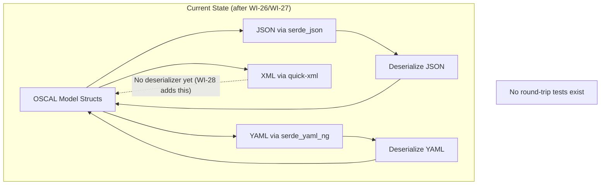
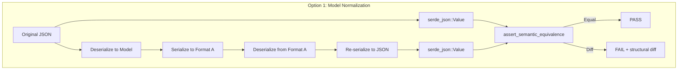
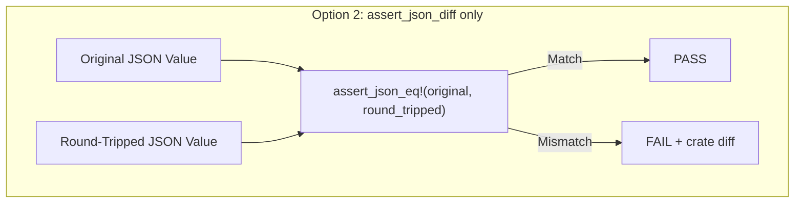
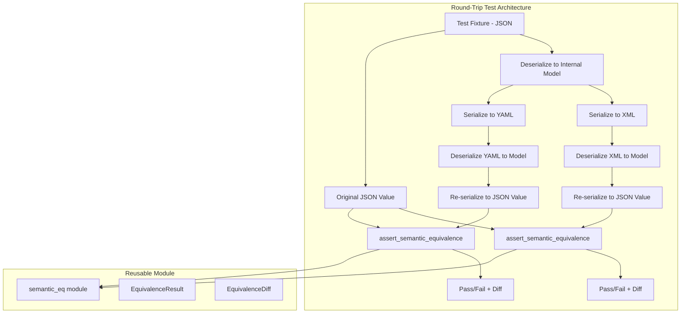
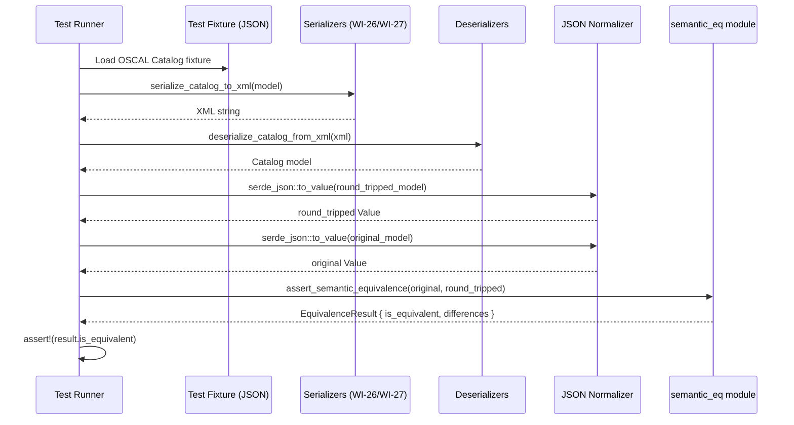

# 028-ar-round-trip-testing

> **Document Type:** Architecture Review
> **Audience:** LLM agents, human reviewers
> **Status:** Proposed
> **Last Updated:** 2026-02-10 <!-- @auto -->
> **Owner:** Brian Luby <!-- @human-required -->
> **Deciders:** Brian Luby <!-- @human-required -->

---

## Review Tier Legend

| Marker | Tier | Speckit Behavior |
|--------|------|------------------|
| 🔴 `@human-required` | Human Generated | Prompt human to author; blocks until complete |
| 🟡 `@human-review` | LLM + Human Review | LLM drafts → prompt human to confirm/edit; blocks until confirmed |
| 🟢 `@llm-autonomous` | LLM Autonomous | LLM completes; no prompt; logged for audit |
| ⚪ `@auto` | Auto-generated | System fills (timestamps, links); no prompt |

---

## Document Completion Order

> ⚠️ **For LLM Agents:** Complete sections in this order. Do not fill downstream sections until upstream human-required inputs exist.

1. **Summary (Decision)** → requires human input first
2. **Context (Problem Space)** → requires human input
3. **Decision Drivers** → requires human input (prioritized)
4. **Driving Requirements** → extract from PRD, human confirms
5. **Options Considered** → LLM drafts after drivers exist, human reviews
6. **Decision (Selected + Rationale)** → requires human decision
7. **Implementation Guardrails** → LLM drafts, human reviews
8. **Everything else** → can proceed after decision is made

---

## Linkage ⚪ `@auto`

| Document | ID | Relationship |
|----------|-----|--------------|
| Parent PRD | [028-prd-round-trip-testing](../PRD/028-prd-round-trip-testing.md) | Requirements this architecture satisfies |
| Security Review | N/A | Test-only code; no attack surface |
| Supersedes | — | N/A |
| Superseded By | — | |

---

## Summary

### Decision 🔴 `@human-required`
> Implement round-trip fidelity testing by normalizing all formats through the internal OSCAL model (deserialize to Rust structs, re-serialize to JSON) and comparing `serde_json::Value` trees using a custom recursive semantic equivalence function that ignores JSON key ordering but preserves array order.

### TL;DR for Agents 🟡 `@human-review`
> Round-trip testing normalizes all formats through the internal Rust model: Format A -> Internal Model -> Format B -> Internal Model -> JSON Value, then compares JSON Value trees. The `assert_semantic_equivalence` function recursively compares `serde_json::Value` nodes, treating object keys as unordered sets and array elements as ordered sequences. Custom `EquivalenceResult` with JSON Pointer paths provides structured diff output on failure. Do NOT compare serialized strings. Do NOT write format-specific comparison logic for each pair. Do NOT skip YAML type coercion edge cases.

---

## Context

### Problem Space 🔴 `@human-required`
After WI-26 (XML serialization) and WI-27 (YAML serialization) deliver format-specific output, FORGE must verify that converting between any two formats introduces zero data loss. Each format uses a different serialization crate with different parsing semantics: `serde_json` (JSON), `quick-xml` (XML), and `serde_yaml_ng` (YAML). Subtle issues like XML element ordering, YAML type coercion, or floating-point representation differences could silently corrupt data during format conversion. The architecture must define a canonical comparison approach that works across all format pairs without requiring format-specific comparison logic.

### Decision Scope 🟡 `@human-review`

**This AR decides:**
- How round-trip equivalence is verified (comparison strategy)
- The canonical intermediate representation for comparison
- How format-specific artifacts (XML namespaces, YAML anchors) are handled during comparison
- The structure of the semantic equivalence utility (reusable module)

**This AR does NOT decide:**
- XML or YAML serialization implementation -- decided in 026-ar and 027-ar
- `forge export` subcommand design -- deferred to 029-ar-export-subcommand
- oscal-cli-based authoritative round-trip validation -- deferred to WI-37 (Phase 3)
- Performance benchmarking of serialization -- separate work item

### Current State 🟢 `@llm-autonomous`
After WI-26 and WI-27, FORGE can serialize OSCAL models to JSON, XML, and YAML. Deserialization exists for JSON (via `serde_json`) and YAML (via `serde_yaml_ng`), but **XML deserialization does not yet exist** — WI-26 delivered serialization only using a custom `quick_xml::Writer`-based approach. This WI adds XML deserialization as a prerequisite for XML round-trip testing (see Phase 2B). No automated round-trip testing exists yet. Semantic equivalence between formats is assumed but unverified.



### Driving Requirements 🟡 `@human-review`

| PRD Req ID | Requirement Summary | Architectural Implication |
|------------|---------------------|---------------------------|
| M-1 | JSON -> XML -> JSON fidelity for Catalog | Need comparison strategy for JSON ↔ XML path |
| M-2 | JSON -> YAML -> JSON fidelity for Catalog | Need comparison strategy for JSON ↔ YAML path |
| M-3 | JSON -> XML -> JSON fidelity for Component Definition | Same comparison must work for all model types |
| M-4 | JSON -> YAML -> JSON fidelity for Component Definition | Same comparison must work for all model types |
| M-5 | Ignore JSON key ordering in equivalence | Comparison must be key-order-independent for objects |
| M-6 | Preserve array element ordering | Comparison must verify array element order |
| M-7 | Clear pass/fail with structural diff on failure | Diff utility must report path and nature of discrepancy |
| M-8 | Preserve data types through round-trips | Strings must stay strings (no YAML type coercion) |

**PRD Constraints inherited:**
- From constitution: Rust latest stable, TDD mandatory, cargo test integration
- From parent PRD: 100% round-trip fidelity target

---

## Decision Drivers 🔴 `@human-required`

1. **Correctness:** Comparison must detect all semantic differences and produce zero false positives/negatives *(traces to PRD M-5, M-6, M-8)*
2. **Actionability:** Failure output must identify the exact path and nature of discrepancies so developers can locate and fix issues *(traces to PRD M-7)*
3. **Reusability:** The equivalence utility must be reusable by WI-29 export tests, WI-37 oscal-cli integration tests, and future format work *(traces to PRD S-3)*
4. **Simplicity:** Minimize format-specific comparison logic; use a single comparison path for all format pairs *(constitution principle X)*

---

## Options Considered 🟡 `@human-review`

### Option 0: Status Quo / Do Nothing

**Description:** Ship XML and YAML output without verifying round-trip fidelity. Trust that serialization is correct based on unit tests alone.

| Driver | Rating | Notes |
|--------|--------|-------|
| Correctness | ❌ Poor | Subtle data loss goes undetected |
| Actionability | N/A | No comparison, no diffs |
| Reusability | ❌ Poor | No utility for downstream work items |
| Simplicity | ✅ Good | No new code |

**Why not viable:** Parent PRD mandates "Round-Trip Fidelity 100%" as an evaluation criterion. WI-29 (export subcommand) cannot ship without verified format fidelity.

---

### Option 1: Model Normalization + serde_json::Value Tree Comparison (Recommended)

**Description:** Normalize all formats through the internal Rust model (deserialize from format A -> internal model -> serialize to JSON), then compare `serde_json::Value` trees using a custom recursive `assert_semantic_equivalence` function. Custom `EquivalenceResult` with JSON Pointer paths provides structured diff output on failure.



| Driver | Rating | Notes |
|--------|--------|-------|
| Correctness | ✅ Good | Normalizing through the model resolves format-specific artifacts; Value tree comparison is key-order-independent |
| Actionability | ✅ Good | Custom `EquivalenceResult` produces path-level discrepancy details via JSON Pointer paths |
| Reusability | ✅ Good | assert_semantic_equivalence is a standalone function usable by any test |
| Simplicity | ✅ Good | Single comparison path for all format pairs; no format-specific comparison logic |

**Pros:**
- Single comparison approach works for all 6 format pair combinations
- `serde_json::Value::Object` uses `Map` where equality is key-order-independent
- Normalizing through the internal model strips format-specific artifacts (XML namespaces, YAML anchors)
- Custom `EquivalenceResult` with JSON Pointer paths provides OSCAL-specific, developer-friendly diff output on failure
- No additional dependencies needed — custom implementation is < 100 LOC

**Cons:**
- Normalization through the model may mask serialization-specific issues (mitigated by format-specific unit tests in WI-26/WI-27)

---

### Option 2: assert_json_diff Crate Only (No Custom Wrapper)

**Description:** Use `assert_json_diff` crate's `assert_json_eq!` macro directly for all comparisons without a custom equivalence function.



| Driver | Rating | Notes |
|--------|--------|-------|
| Correctness | ✅ Good | assert_json_diff handles key ordering correctly |
| Actionability | ⚠️ Medium | Crate diff output is good but not customizable for OSCAL-specific context |
| Reusability | ⚠️ Medium | Tied to assert_json_diff API; less flexible for future needs |
| Simplicity | ✅ Good | No custom code; just macro calls |

**Pros:**
- Minimal code -- just call `assert_json_eq!`
- Well-tested crate for JSON comparison

**Cons:**
- Cannot add OSCAL-specific comparison logic (e.g., type preservation verification)
- Diff output is generic (no OSCAL context in error messages)
- Cannot produce structured `EquivalenceResult` for programmatic consumption by WI-29/WI-37

---

### Option 3: Manual String Comparison

**Description:** Serialize both the original and round-tripped artifacts to JSON strings and compare as strings.

| Driver | Rating | Notes |
|--------|--------|-------|
| Correctness | ❌ Poor | Fails on JSON key reordering; produces false negatives |
| Actionability | ❌ Poor | String diff shows character-level changes, not semantic differences |
| Reusability | ❌ Poor | Fragile; breaks on any formatting change |
| Simplicity | ✅ Good | Just `assert_eq!(str1, str2)` |

**Why not viable:** JSON object key ordering is not guaranteed. String comparison would produce false negatives whenever key order differs, which is expected behavior for JSON.

---

## Decision

### Selected Option 🔴 `@human-required`
> **Option 1: Model Normalization + serde_json::Value Tree Comparison**

### Rationale 🔴 `@human-required`
Option 1 provides the right balance of correctness, actionability, and reusability. Normalizing through the internal model means format-specific artifacts are stripped before comparison, allowing a single comparison path for all format pairs. The custom `assert_semantic_equivalence` function gives FORGE control over comparison semantics (array ordering, type preservation) with structured `EquivalenceResult` output providing JSON Pointer paths on failure. `assert_json_diff` (Option 2) was evaluated but not needed — the custom implementation provides richer, OSCAL-specific diffs with no additional dependencies. Option 3 is fundamentally broken for JSON comparison.

#### Simplest Implementation Comparison 🟡 `@human-review`

| Aspect | Simplest Possible | Selected Option | Justification for Complexity |
|--------|-------------------|-----------------|------------------------------|
| Components | assert_json_eq! macro only | Custom equivalence function with `EquivalenceResult` | PRD M-7 requires structured diff; PRD S-3 requires reusable module |
| Dependencies | No new deps | No new deps (custom implementation) | Custom `EquivalenceResult` provides richer OSCAL-specific diffs than `assert_json_diff` |
| Patterns | Direct string comparison | Model normalization + Value tree traversal | PRD M-5 requires key-order-independent comparison |

**Complexity justified by:** PRD M-7 requires structured diffs and PRD S-3 requires a reusable module. A custom equivalence function with structured `EquivalenceResult` satisfies both while remaining simple (< 100 LOC) and adding no new dependencies.

### Architecture Diagram 🟡 `@human-review`



---

## Technical Specification

### Component Overview 🟡 `@human-review`

| Component | Responsibility | Interface | Dependencies |
|-----------|---------------|-----------|--------------|
| semantic_eq module | Reusable semantic equivalence comparison | Library API | serde_json |
| assert_semantic_equivalence | Compare two JSON Value trees | `fn(&Value, &Value) -> EquivalenceResult` | recursive Value traversal |
| EquivalenceResult | Structured comparison result | Data struct | EquivalenceDiff |
| EquivalenceDiff | Single difference found | Data struct | — |
| round_trip_catalog_json_xml_json | Helper: JSON -> XML -> JSON for Catalog | `fn(&str) -> (Value, Value)` | WI-26 serializer, WI-28 deserializer |
| round_trip_component_json_xml_json | Helper: JSON -> XML -> JSON for Component Def | `fn(&str) -> (Value, Value)` | WI-26 serializer, WI-28 deserializer |
| round_trip_catalog_json_yaml_json | Helper: JSON -> YAML -> JSON for Catalog | `fn(&str) -> (Value, Value)` | WI-27 serializer, WI-27 deserializer |
| round_trip_component_json_yaml_json | Helper: JSON -> YAML -> JSON for Component Def | `fn(&str) -> (Value, Value)` | WI-27 serializer, WI-27 deserializer |
| round_trip_catalog_xml_yaml_xml | Helper: XML -> YAML -> XML for Catalog | `fn(&str) -> (Value, Value)` | Both serializers |
| tests/round_trip_test.rs | Integration test file | cargo test | All helpers, semantic_eq module |

### Data Flow 🟢 `@llm-autonomous`



### Interface Definitions 🟡 `@human-review`

```rust
use serde_json::Value;

/// Result of a semantic equivalence comparison between two OSCAL documents.
#[derive(Debug)]
pub struct EquivalenceResult {
    /// Whether the two documents are semantically equivalent
    pub is_equivalent: bool,
    /// Human-readable diff details if not equivalent; empty if equivalent
    pub differences: Vec<EquivalenceDiff>,
}

/// A single difference found during semantic comparison.
#[derive(Debug)]
pub struct EquivalenceDiff {
    /// JSON Pointer-style path to the differing element
    pub path: String,
    /// Description of the difference
    pub description: String,
    /// The expected value (from the original document)
    pub expected: Option<String>,
    /// The actual value (from the round-tripped document)
    pub actual: Option<String>,
}

/// Compare two OSCAL documents for semantic equivalence.
/// Objects: keys compared as unordered sets; values compared recursively.
/// Arrays: elements compared in order (OSCAL array order is significant).
/// Primitives: compared by value and type.
pub fn assert_semantic_equivalence(
    original: &Value,
    round_tripped: &Value,
) -> EquivalenceResult {
    let mut differences = Vec::new();
    compare_values(original, round_tripped, "", &mut differences);
    EquivalenceResult {
        is_equivalent: differences.is_empty(),
        differences,
    }
}

/// Recursive comparison of JSON Value nodes.
fn compare_values(
    expected: &Value,
    actual: &Value,
    path: &str,
    diffs: &mut Vec<EquivalenceDiff>,
) {
    match (expected, actual) {
        (Value::Object(exp_map), Value::Object(act_map)) => {
            // Compare keys as unordered sets
            for key in exp_map.keys() {
                let child_path = format!("{path}/{key}");
                match act_map.get(key) {
                    Some(act_val) => compare_values(&exp_map[key], act_val, &child_path, diffs),
                    None => diffs.push(EquivalenceDiff {
                        path: child_path,
                        description: "Key missing in round-tripped document".to_string(),
                        expected: Some(format!("{}", exp_map[key])),
                        actual: None,
                    }),
                }
            }
            for key in act_map.keys() {
                if !exp_map.contains_key(key) {
                    diffs.push(EquivalenceDiff {
                        path: format!("{path}/{key}"),
                        description: "Extra key in round-tripped document".to_string(),
                        expected: None,
                        actual: Some(format!("{}", act_map[key])),
                    });
                }
            }
        }
        (Value::Array(exp_arr), Value::Array(act_arr)) => {
            // Compare arrays element-by-element (order matters)
            // ...
        }
        _ => {
            if expected != actual {
                diffs.push(EquivalenceDiff {
                    path: path.to_string(),
                    description: format!("Value mismatch: expected {expected}, got {actual}"),
                    expected: Some(format!("{expected}")),
                    actual: Some(format!("{actual}")),
                });
            }
        }
    }
}

/// Round-trip helper: JSON -> XML -> JSON for Catalog (test-local function)
fn round_trip_catalog_json_xml_json(json_str: &str) -> (Value, Value) {
    let envelope: CatalogEnvelope = serde_json::from_str(json_str).unwrap();
    let original = serde_json::to_value(&envelope).unwrap();
    let xml = serialize_catalog_to_xml(&envelope).unwrap();
    let round_tripped: CatalogEnvelope = deserialize_catalog_from_xml(&xml).unwrap();
    let round_tripped_value = serde_json::to_value(round_tripped).unwrap();
    (original, round_tripped_value)
}

/// Round-trip helper: JSON -> YAML -> JSON for Catalog (test-local function)
fn round_trip_catalog_json_yaml_json(json_str: &str) -> (Value, Value) {
    let envelope: CatalogEnvelope = serde_json::from_str(json_str).unwrap();
    let original = serde_json::to_value(&envelope).unwrap();
    let yaml = serialize_to_yaml(&envelope).unwrap();
    let round_tripped: CatalogEnvelope = deserialize_from_yaml(&yaml).unwrap();
    let round_tripped_value = serde_json::to_value(round_tripped).unwrap();
    (original, round_tripped_value)
}
```

### Key Algorithms/Patterns 🟡 `@human-review`

**Pattern:** Model-normalized comparison
```
1. Load test fixture (OSCAL JSON)
2. Deserialize to internal Rust model
3. Serialize to target format (XML or YAML)
4. Deserialize back from target format to internal model
5. Serialize both original and round-tripped models to serde_json::Value
6. Compare Value trees with assert_semantic_equivalence
7. If not equivalent, print structured diff with paths
```

**Pattern:** Type preservation verification
```
For each YAML-ambiguous value in test fixtures:
1. Create OSCAL model with string values: "true", "false", "1.0", "null", "yes", "no"
2. Round-trip through YAML
3. Verify all values remain Value::String (not Value::Bool, Value::Number, Value::Null)
```

---

## Constraints & Boundaries

### Technical Constraints 🟡 `@human-review`

**Inherited from PRD:**
- Rust latest stable toolchain
- Tests run via `cargo test`
- TDD mandatory (constitution principle IV)
- 100% round-trip fidelity target

**Added by this Architecture:**
- All comparisons normalize through `serde_json::Value` -- no direct format-to-format comparison
- Custom `EquivalenceResult` provides structured diffs with no additional dependencies
- YAML type coercion edge cases must be explicitly tested with dedicated fixtures
- Test fixtures include both small (3-5 controls) and large (50+ controls) OSCAL artifacts

### Architectural Boundaries 🟡 `@human-review`

- **Owns:** `semantic_eq` module, round-trip test helpers, test fixtures
- **Interfaces With:** WI-26 XML serializer/deserializer, WI-27 YAML serializer/deserializer, serde_json
- **Must Not Touch:** Serialization implementations (those belong to WI-26/WI-27)

### Implementation Guardrails 🟡 `@human-review`

> ⚠️ **Critical for LLM Agents:**

- [x] **DO NOT** compare serialized output as raw strings -- this fails on key ordering *(PRD M-5)*
- [x] **DO NOT** skip YAML type coercion edge cases -- strings like "true" and "1.0" must remain strings *(PRD M-8)*
- [x] **DO NOT** write format-specific comparison logic for each pair -- normalize through the model *(simplicity)*
- [x] **DO NOT** modify serialization code in this WI -- round-trip testing is read-only *(scope boundary)*
- [x] **MUST** verify array element ordering is preserved *(PRD M-6)*
- [x] **MUST** produce structured diffs on failure with JSON Pointer paths *(PRD M-7)*
- [x] **MUST** test both Catalog and Component Definition model types *(PRD M-1 through M-4)*

---

## Consequences 🟡 `@human-review`

### Positive
- Single comparison approach works for all format pairs -- no combinatorial explosion
- Reusable `semantic_eq` module benefits WI-29 (export tests) and WI-37 (oscal-cli integration)
- Structured `EquivalenceResult` enables programmatic consumption of comparison results
- YAML type coercion edge cases caught before they reach production

### Negative
- Model normalization may mask some serialization-specific formatting issues (mitigated by format-specific unit tests in WI-26/WI-27)

### Risks & Mitigations

| Risk | Likelihood | Impact | Mitigation |
|------|------------|--------|------------|
| Model normalization hides serialization bugs | Low | Med | Format-specific unit tests in WI-26/WI-27 catch serialization issues; round-trip tests catch data loss |
| YAML type coercion edge cases not covered | Low | High | Dedicated test fixtures with all YAML-ambiguous values |
| Large fixture tests are slow | Low | Low | Run large fixtures in a separate test module with `#[ignore]` for fast CI, full run in nightly |

---

## Implementation Guidance

### Suggested Implementation Order 🟢 `@llm-autonomous`
1. Create `src/testing/semantic_eq.rs` module with `EquivalenceResult`, `EquivalenceDiff`, and `assert_semantic_equivalence`
2. Write unit tests for `assert_semantic_equivalence` itself (equal objects, different keys, different values, array ordering)
3. Create `tests/round_trip_test.rs` integration test file
4. Implement XML deserialization (`deserialize_catalog_from_xml`, `deserialize_component_from_xml`) — prerequisite for XML round-trip
5. Implement `round_trip_catalog_json_xml_json` helper
6. Write JSON -> XML -> JSON round-trip tests for Catalog
7. Implement `round_trip_catalog_json_yaml_json` helper
8. Write JSON -> YAML -> JSON round-trip tests for Catalog
9. Add Component Definition round-trip tests (`round_trip_component_json_xml_json`, `round_trip_component_json_yaml_json`)
10. Add YAML type coercion edge-case fixtures and tests
11. Add XML -> YAML -> XML round-trip tests (`round_trip_catalog_xml_yaml_xml`, `round_trip_component_xml_yaml_xml`) (S-1)

### Testing Strategy 🟢 `@llm-autonomous`

| Layer | Test Type | Coverage Target | Notes |
|-------|-----------|-----------------|-------|
| Unit | assert_semantic_equivalence | 100% | Equal, missing key, extra key, value mismatch, array order |
| Integration | JSON -> XML -> JSON Catalog | 100% | Small + large fixtures |
| Integration | JSON -> YAML -> JSON Catalog | 100% | Small + large fixtures |
| Integration | JSON -> XML -> JSON Component Def | 100% | At least one fixture |
| Integration | JSON -> YAML -> JSON Component Def | 100% | At least one fixture |
| Edge Case | YAML type coercion | 100% | "true", "false", "1.0", "null", "yes", "no", "on", "off" |

### Anti-patterns to Avoid 🟡 `@human-review`
- **Don't:** Compare JSON/XML/YAML output as raw strings
  - **Why:** Key ordering differences produce false negatives
  - **Instead:** Deserialize to `serde_json::Value` and compare structurally
- **Don't:** Test with only trivial fixtures
  - **Why:** Misses edge cases in nested structures, large arrays, and metadata
  - **Instead:** Include realistic OSCAL fixtures with nested groups, props, links, and back matter
- **Don't:** Ignore YAML type coercion risks
  - **Why:** YAML 1.1 interprets bare "true", "yes", "on" as booleans, silently corrupting data
  - **Instead:** Include explicit edge-case tests for all YAML-ambiguous values

---

## Compliance & Cross-cutting Concerns

### Security Considerations 🟡 `@human-review`
- Authentication: N/A -- test code only
- Authorization: N/A
- Data handling: Tests use synthetic fixtures; no real policy data

### Observability 🟢 `@llm-autonomous`
- **Logging:** Test output shows pass/fail per round-trip path
- **Metrics:** N/A for test code
- **Tracing:** N/A for test code

### Error Handling Strategy 🟢 `@llm-autonomous`
```
Error Category → Handling Approach
├── Serialization failure during round-trip → Test failure with serialization error details
├── Deserialization failure during round-trip → Test failure with deserialization error details
├── Semantic equivalence failure → Test failure with structured diff from EquivalenceResult
└── Test fixture loading failure → Test failure with file path error
```

---

## Migration Plan (if applicable) 🟡 `@human-review`

N/A -- greenfield test infrastructure.

### Rollback Plan 🔴 `@human-required`

N/A -- test-only code. Removing round-trip tests does not affect production code or users. Tests can be skipped with `#[ignore]` if blocking CI.

---

## Open Questions 🟡 `@human-review`

No open questions for this work item.

---

## Changelog ⚪ `@auto`

| Version | Date | Author | Changes |
|---------|------|--------|---------|
| 0.1 | 2026-02-10 | LLM (Claude) | Initial proposal |

---

## Decision Record ⚪ `@auto`

| Date | Event | Details |
|------|-------|---------|
| 2026-02-10 | Proposed | Initial draft created from PRD 028 |

---

## Traceability Matrix 🟢 `@llm-autonomous`

| PRD Req ID | Decision Driver | Option Rating | Component | Notes |
|------------|-----------------|---------------|-----------|-------|
| M-1 | Correctness | Option 1: ✅ | round_trip_catalog_json_xml_json | Catalog JSON-XML-JSON path |
| M-2 | Correctness | Option 1: ✅ | round_trip_catalog_json_yaml_json | Catalog JSON-YAML-JSON path |
| M-3 | Correctness | Option 1: ✅ | round_trip_component_json_xml_json | Component Def JSON-XML-JSON path |
| M-4 | Correctness | Option 1: ✅ | round_trip_component_json_yaml_json | Component Def JSON-YAML-JSON path |
| M-5 | Correctness | Option 1: ✅ | assert_semantic_equivalence | Object keys compared as unordered sets |
| M-6 | Correctness | Option 1: ✅ | assert_semantic_equivalence | Array elements compared in order |
| M-7 | Actionability | Option 1: ✅ | EquivalenceResult / EquivalenceDiff | Structured diff with JSON Pointer paths |
| M-8 | Correctness | Option 1: ✅ | YAML coercion edge-case tests | Explicit test fixtures for type preservation |

---

## Review Checklist 🟢 `@llm-autonomous`

Before marking as Accepted:
- [x] All PRD Must Have requirements appear in Driving Requirements
- [x] Option 0 (Status Quo) is documented
- [x] Simplest Implementation comparison is completed
- [x] Decision drivers are prioritized and addressed
- [x] At least 2 options were seriously considered
- [x] Constraints distinguish inherited vs. new
- [x] Component names are consistent across all diagrams and tables
- [x] Implementation guardrails reference specific PRD constraints
- [x] Rollback triggers and authority are defined (N/A -- test code)
- [x] Security review is linked or N/A documented
- [x] No open questions blocking implementation
