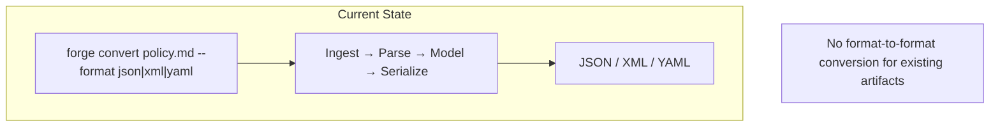
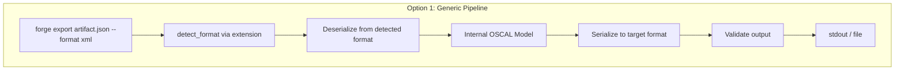
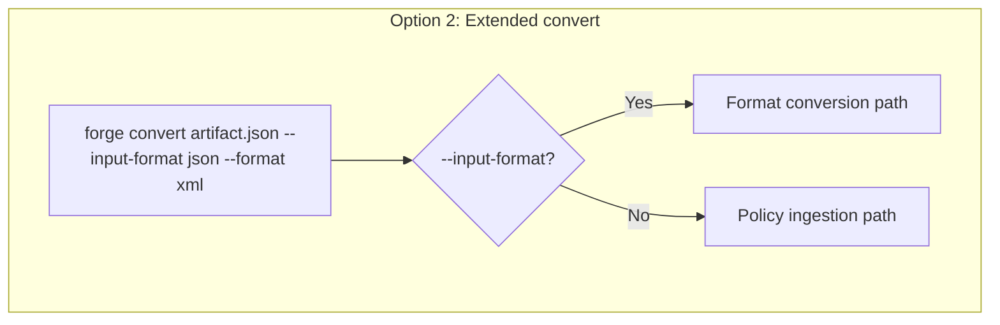
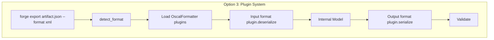
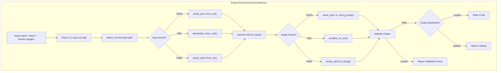
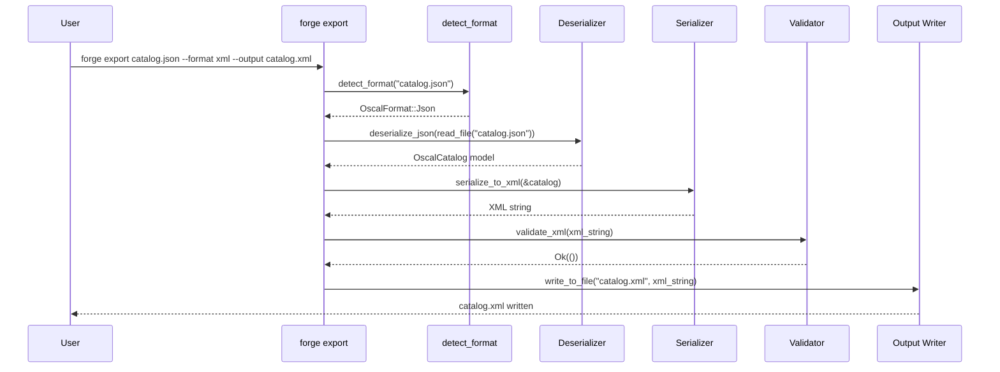

# 029-ar-export-subcommand

> **Document Type:** Architecture Review
> **Audience:** LLM agents, human reviewers
> **Status:** Superseded by implementation
> **Last Updated:** 2026-02-10 <!-- @auto -->
> **Owner:** Brian Luby <!-- @human-required -->
> **Deciders:** Brian Luby <!-- @human-required -->

---

## Review Tier Legend

| Marker | Tier | Speckit Behavior |
|--------|------|------------------|
| 🔴 `@human-required` | Human Generated | Prompt human to author; blocks until complete |
| 🟡 `@human-review` | LLM + Human Review | LLM drafts → prompt human to confirm/edit; blocks until confirmed |
| 🟢 `@llm-autonomous` | LLM Autonomous | LLM completes; no prompt; logged for audit |
| ⚪ `@auto` | Auto-generated | System fills (timestamps, links); no prompt |

---

## Document Completion Order

> ⚠️ **For LLM Agents:** Complete sections in this order. Do not fill downstream sections until upstream human-required inputs exist.

1. **Summary (Decision)** → requires human input first
2. **Context (Problem Space)** → requires human input
3. **Decision Drivers** → requires human input (prioritized)
4. **Driving Requirements** → extract from PRD, human confirms
5. **Options Considered** → LLM drafts after drivers exist, human reviews
6. **Decision (Selected + Rationale)** → requires human decision
7. **Implementation Guardrails** → LLM drafts, human reviews
8. **Everything else** → can proceed after decision is made

---

## Linkage ⚪ `@auto`

| Document | ID | Relationship |
|----------|-----|--------------|
| Parent PRD | [029-prd-export-subcommand](../PRD/029-prd-export-subcommand.md) | Requirements this architecture satisfies |
| Security Review | N/A | No new attack surface; reads local files only |
| Supersedes | — | N/A |
| Superseded By | — | |

---

## Summary

### Decision 🔴 `@human-required`
> Implement `forge export` as a new clap subcommand that orchestrates a generic deserialize-reserialize pipeline through the internal OSCAL model. Format detection is strictly file-extension-based. Output validation reuses the existing WI-19/WI-20 schema validation infrastructure.

### TL;DR for Agents 🟡 `@human-review`
> `forge export <input> --format <json|xml|yaml> [--output <path>]` is a thin CLI layer that: (1) detects input format from file extension, (2) deserializes via the appropriate backend (serde_json, quick-xml, serde_yaml), (3) re-serializes to the target format via the appropriate backend, (4) validates the output, (5) writes to stdout or file. Use a single `export_artifact()` function with a generic deserialize-then-reserialize pattern through the shared internal model -- do NOT write 9 separate format-pair conversion functions. The export subcommand is separate from `forge convert` (which operates on source policy documents, not OSCAL artifacts).

---

## Context

### Problem Space 🔴 `@human-required`
Users who already have OSCAL artifacts (generated by FORGE or other tools) need to convert between JSON, XML, and YAML formats without re-running the full policy conversion pipeline. `forge convert` ingests policy documents (Markdown, PDF, Word) and produces OSCAL output -- it is the wrong tool for format-to-format conversion of existing artifacts. A dedicated `forge export` subcommand provides a clean, efficient format conversion path with output validation. The architectural question is how to structure this subcommand: extend the existing `convert` command, create a new subcommand, or implement a plugin-based formatter system.

### Decision Scope 🟡 `@human-review`

**This AR decides:**
- Whether export is a new subcommand or an extension of `convert`
- How input format detection works
- The internal pipeline for format conversion (generic vs format-pair-specific)
- How output validation integrates

**This AR does NOT decide:**
- XML serialization implementation -- decided in 026-ar-xml-output
- YAML serialization implementation -- decided in 027-ar-yaml-output
- Round-trip testing strategy -- decided in 028-ar-round-trip-testing
- Profile generation -- deferred to 030-ar-profile-generation

### Current State 🟢 `@llm-autonomous`
FORGE has `forge convert` for policy-to-OSCAL conversion. WI-26/WI-27 provide XML and YAML serialization. WI-28 confirms round-trip fidelity. No format-to-format conversion capability exists yet for existing OSCAL artifacts.



### Driving Requirements 🟡 `@human-review`

| PRD Req ID | Requirement Summary | Architectural Implication |
|------------|---------------------|---------------------------|
| M-1 | `forge export <input> --format <json|xml|yaml>` subcommand | New clap subcommand alongside `convert` |
| M-2 | Auto-detect input format from file extension | Format detection function needed |
| M-3 | Deserialize and re-serialize preserving semantic equivalence | Generic pipeline through internal model |
| M-4 | Validate converted output against OSCAL schemas | Integrate with WI-19/WI-20 validation |
| M-5 | `--output <path>` or stdout default | Reuse existing output writing pattern |
| M-6 | Descriptive error on invalid input | Error handling for non-OSCAL files |

**PRD Constraints inherited:**
- From constitution: Rust latest stable, clap 4.x, thiserror, TDD mandatory
- From parent PRD: OSCAL v1.2.0, all three formats supported

---

## Decision Drivers 🔴 `@human-required`

1. **User mental model:** `convert` ingests source docs; `export` converts between OSCAL formats -- these must be clearly separate commands *(traces to PRD M-1)*
2. **Simplicity:** A single deserialize-reserialize path avoids 9 separate format-pair implementations *(constitution principle X)*
3. **Correctness:** Output must be validated after conversion to guarantee OSCAL compliance *(traces to PRD M-4)*
4. **Extensibility:** Adding new formats (e.g., CBOR, Protobuf in future) should require only adding a serializer/deserializer, not modifying the export pipeline *(traces to roadmap)*

---

## Options Considered 🟡 `@human-review`

### Option 0: Status Quo / Do Nothing

**Description:** Users convert between formats using external tools (jq, xmllint, yq) or re-run `forge convert` from source documents.

| Driver | Rating | Notes |
|--------|--------|-------|
| User mental model | ❌ Poor | Users must leave FORGE workflow for format conversion |
| Simplicity | ✅ Good | No new code |
| Correctness | ❌ Poor | External tools don't validate OSCAL compliance |
| Extensibility | ❌ Poor | Blocks WI-30 and Phase 2 |

**Why not viable:** Parent PRD US-5 AC-2 explicitly requires `forge export`. WI-30 depends on multi-format export being operational.

---

### Option 1: New Export Subcommand with Generic Pipeline (Recommended)

**Description:** Add `forge export` as a new clap subcommand alongside `forge convert`. The export pipeline: detect input format -> deserialize to internal model -> serialize to target format -> validate output -> write. A single `export_artifact()` function handles all format pairs through the shared internal OSCAL representation.



| Driver | Rating | Notes |
|--------|--------|-------|
| User mental model | ✅ Good | Clear separation: convert = source-to-OSCAL, export = format-to-format |
| Simplicity | ✅ Good | Single pipeline handles all 9 format combinations |
| Correctness | ✅ Good | Output validation guarantees OSCAL compliance |
| Extensibility | ✅ Good | New format = new serializer + deserializer; pipeline unchanged |

**Pros:**
- Clean separation between `convert` and `export` commands
- Generic pipeline avoids combinatorial explosion (1 path vs 9 paths)
- Output validation catches conversion errors
- New formats plug in without pipeline changes
- Reuses all serialization infrastructure from WI-26/WI-27

**Cons:**
- New subcommand adds to CLI surface area (justified by distinct use case)
- Same-format pass-through (e.g., JSON to JSON) does a full round-trip (acceptable; provides normalization)

---

### Option 2: Extend `forge convert` with `--input-format` Flag

**Description:** Add an `--input-format <json|xml|yaml>` flag to the existing `forge convert` command. When `--input-format` is provided, skip the policy ingestion pipeline and treat the input as an existing OSCAL artifact.



| Driver | Rating | Notes |
|--------|--------|-------|
| User mental model | ❌ Poor | Overloads `convert` with two different operations; confusing |
| Simplicity | ⚠️ Medium | Avoids new subcommand but complicates convert's argument parsing |
| Correctness | ✅ Good | Same validation possible |
| Extensibility | ⚠️ Medium | Format conversion logic mixed with policy conversion logic |

**Pros:**
- No new subcommand; fewer top-level commands

**Cons:**
- Confuses the user mental model: `convert` would mean both "policy to OSCAL" and "OSCAL to OSCAL"
- Argument parsing becomes complex (some flags apply only to one mode)
- Violates Single Responsibility Principle
- PRD explicitly calls for a separate `forge export` subcommand

---

### Option 3: Plugin-Based Formatter System

**Description:** Implement a trait-based plugin system where each format (JSON, XML, YAML) is a plugin that implements `OscalFormatter` trait with `serialize()` and `deserialize()` methods. The export command loads the appropriate plugins dynamically.



| Driver | Rating | Notes |
|--------|--------|-------|
| User mental model | ✅ Good | Clean separation |
| Simplicity | ❌ Poor | Over-engineered for 3 formats; unnecessary abstraction |
| Correctness | ✅ Good | Same validation possible |
| Extensibility | ✅ Good | New format = new plugin (but FORGE will have at most 3-5 formats) |

**Pros:**
- Maximum extensibility for many format plugins
- Clean abstraction boundaries

**Cons:**
- Over-engineered for 3 formats (YAGNI)
- Dynamic dispatch adds complexity for no practical benefit
- Trait overhead is unjustified when a simple match statement suffices
- Constitution principle X (YAGNI) explicitly discourages this

---

## Decision

### Selected Option 🔴 `@human-required`
> **Option 1: New Export Subcommand with Generic Pipeline**

### Rationale 🔴 `@human-required`
Option 1 provides a clean user mental model (convert = source-to-OSCAL, export = format-to-format) with a simple implementation (single deserialize-reserialize pipeline). The generic pipeline through the internal model avoids writing 9 separate format-pair functions and naturally extends to new formats. Option 2 is rejected because it conflates two distinct operations in one command. Option 3 is rejected as over-engineered per YAGNI (constitution principle X) -- a simple `match` on `OscalFormat` variants is sufficient for 3 formats.

#### Simplest Implementation Comparison 🟡 `@human-review`

| Aspect | Simplest Possible | Selected Option | Justification for Complexity |
|--------|-------------------|-----------------|------------------------------|
| Components | Single function with match statements | export_artifact + detect_format + CLI subcommand | PRD M-2 requires format detection; PRD M-4 requires validation |
| Dependencies | Reuse WI-26/WI-27 serializers | Same | No new dependencies |
| Patterns | Inline deserialize/reserialize | Pipeline function with clear stages | Testability and error reporting at each stage |

**Complexity justified by:** The selected option is already simple. The export pipeline is a thin orchestration layer over existing serialization/deserialization infrastructure. The `detect_format` function and output validation are required by PRD M-2 and M-4.

### Architecture Diagram 🟡 `@human-review`



---

## Technical Specification

### Component Overview 🟡 `@human-review`

| Component | Responsibility | Interface | Dependencies |
|-----------|---------------|-----------|--------------|
| ExportArgs (clap struct) | CLI argument parsing for export subcommand | Clap derive struct | clap 4.x |
| detect_format | Determine input file format from extension | `fn(&Path) -> Result<OscalFormat, ForgeError>` | std::path |
| export_artifact | Orchestrate deserialize-reserialize-validate pipeline | `fn(&Path, OscalFormat, Option<&Path>) -> Result<(), ForgeError>` | All serializers, validator |
| OscalFormat enum | Represents JSON, XML, YAML formats | Enum + clap::ValueEnum | — |
| Format Dispatcher (existing) | Routes to appropriate serializer/deserializer | Match statement | WI-26/WI-27 modules |

### Data Flow 🟢 `@llm-autonomous`



### Interface Definitions 🟡 `@human-review`

```rust
use clap::{Args, Subcommand, ValueEnum};
use std::path::{Path, PathBuf};

/// Supported OSCAL serialization formats
#[derive(Debug, Clone, Copy, ValueEnum)]
pub enum OscalFormat {
    Json,
    Xml,
    Yaml,
}

/// CLI arguments for the export subcommand
#[derive(Debug, Args)]
pub struct ExportArgs {
    /// Path to the input OSCAL artifact
    pub input: PathBuf,

    /// Target output format
    #[arg(long, value_enum)]
    pub format: OscalFormat,

    /// Output file path (default: stdout)
    #[arg(long)]
    pub output: Option<PathBuf>,

    /// Enable verbose output
    #[arg(long, default_value_t = false)]
    pub verbose: bool,
}

/// Detect the format of an OSCAL artifact from its file extension.
///
/// Detection is strictly extension-based. If the extension is missing or
/// unrecognized, an error is returned with the list of supported extensions.
pub fn detect_format(path: &Path) -> Result<OscalFormat, ForgeError> {
    match path.extension().and_then(|e| e.to_str()) {
        Some("json") => Ok(OscalFormat::Json),
        Some("xml") => Ok(OscalFormat::Xml),
        Some("yaml" | "yml") => Ok(OscalFormat::Yaml),
        Some(ext) => Err(ForgeError::UnsupportedFormat(
            format!("Unrecognized file extension '.{ext}'. Expected .json, .xml, .yaml, or .yml")
        )),
        None => Err(ForgeError::UnsupportedFormat(
            "No file extension found. Cannot determine input format.".to_string()
        )),
    }
}

/// Export an OSCAL artifact from one format to another
pub fn export_artifact(
    input_path: &Path,
    target_format: OscalFormat,
    output: Option<&Path>,
) -> Result<(), ForgeError> {
    // 1. Read input file
    let content = std::fs::read_to_string(input_path)?;

    // 2. Detect input format
    let input_format = detect_format(input_path)?;

    // 3. Deserialize to internal model
    let model = deserialize_oscal(&content, input_format)?;

    // 4. Serialize to target format
    let output_content = serialize_oscal(&model, target_format)?;

    // 5. Validate output
    validate_oscal(&output_content, target_format)?;

    // 6. Write output
    match output {
        Some(path) => std::fs::write(path, &output_content)?,
        None => print!("{output_content}"),
    }
    Ok(())
}
```

### Design Deviations (Implementation Updates)

> **Note:** This AR captures the original architectural intent (Option 1: Generic Pipeline), which remains the selected approach. The interface details below were refined during research and implementation. For the authoritative implementation interface, see `specs/029-export-subcommand/contracts/export.rs` and `tasks.md`. The Interface Definitions and Implementation Guidance sections above reflect the original design; refer to this table for what changed:

| AR Decision | Implementation Decision | Rationale |
|-------------|------------------------|-----------|
| `OscalFormat` enum | Reuse existing `OutputFormat` enum from `src/cli/mod.rs` | Identical variants (`Json`, `Xml`, `Yaml`); creating a duplicate enum violates YAGNI (see `research.md` RQ-5) |
| `ExportArgs.verbose: bool` field | No verbose field; use global `-v` flag via tracing | Codebase convention: verbosity is a global CLI concern, not per-subcommand |
| Validate AFTER serialization (`validate_oscal(&output_string, format)`) | Validate BEFORE serialization (`validate_oscal_model(&model)` via JSON intermediate) | OSCAL schemas are JSON-only; validating the serialized output would require re-parsing XML/YAML to JSON first — validating the model directly avoids a redundant round-trip (see `research.md` RQ-2) |

**Authority**: For implementation details, follow `contracts/export.rs` and `tasks.md`. This AR captures the original architectural intent and selected approach (Option 1), which remains correct.

### Key Algorithms/Patterns 🟡 `@human-review`

**Pattern:** Generic deserialize-reserialize pipeline
```
1. Read input file to string
2. Detect input format from file extension
3. Deserialize string to internal OSCAL model (match on input format)
4. Serialize internal model to target format (match on target format)
5. Validate serialized output
6. Write to stdout or file
```

**Pattern:** OSCAL model type detection during deserialization
```
When deserializing, try each OSCAL model type:
1. Try deserialize as Catalog
2. Try deserialize as Component Definition
3. Try deserialize as Profile
4. If none match, return ForgeError::InvalidOscal
```

---

## Constraints & Boundaries

### Technical Constraints 🟡 `@human-review`

**Inherited from PRD:**
- Rust latest stable, clap 4.x derive macros
- All three formats (JSON, XML, YAML) supported
- Conversion under 1 second for typical artifacts (100KB-1MB)
- TDD mandatory (constitution principle IV)

**Added by this Architecture:**
- `forge export` is a separate subcommand from `forge convert` -- they must not share argument parsing
- Format detection is strictly extension-based; content sniffing is out of scope for MVP
- Same-format conversion (e.g., JSON to JSON) performs a full round-trip for normalization (PRD S-3)
- Output validation is mandatory -- skip validation only with an explicit flag (not implemented in MVP)

### Architectural Boundaries 🟡 `@human-review`

- **Owns:** `ExportArgs` clap struct, `detect_format`, `export_artifact` orchestration
- **Interfaces With:** WI-26 XML serializer/deserializer, WI-27 YAML serializer/deserializer, WI-19/WI-20 validator, existing output writer
- **Must Not Touch:** `forge convert` implementation, serialization implementations, OSCAL model structs

### Implementation Guardrails 🟡 `@human-review`

> ⚠️ **Critical for LLM Agents:**

- [x] **DO NOT** merge export functionality into `forge convert` -- they are distinct subcommands *(PRD M-1, user mental model)*
- [x] **DO NOT** write 9 separate format-pair conversion functions -- use a single generic pipeline *(simplicity)*
- [x] **DO NOT** skip output validation -- validated export is the differentiator over generic tools *(PRD M-4)*
- [x] **DO NOT** re-implement serialization logic -- reuse WI-26/WI-27 functions *(DRY)*
- [x] **MUST** report descriptive errors for invalid/non-OSCAL input files *(PRD M-6)*
- [x] **MUST** auto-detect input format from file extension *(PRD M-2)*
- [x] **MUST** support all 9 format combinations (3 input x 3 output) *(PRD evaluation criteria)*

---

## Consequences 🟡 `@human-review`

### Positive
- Clean user mental model with separate subcommands for different workflows
- Single pipeline handles all format combinations without code duplication
- Output validation provides confidence that exported artifacts are correct
- Extensible to new formats with zero pipeline changes

### Negative
- Same-format conversion (JSON to JSON) does a full deserialize-reserialize cycle (acceptable for normalization)
- OSCAL model type detection during deserialization adds a try-catch pattern (acceptable complexity)

### Risks & Mitigations

| Risk | Likelihood | Impact | Mitigation |
|------|------------|--------|------------|
| OSCAL model type detection fails for uncommon model types | Low | Med | Start with Catalog and ComponentDefinition; add Profile after WI-30 |
| Schema validation not available for XML/YAML formats | Med | Med | Fall back to validate-via-JSON (deserialize -> re-serialize to JSON -> validate JSON schema) |
| Large artifacts cause memory pressure | Low | Low | Acceptable for MVP; streaming can be added later |

---

## Implementation Guidance

### Suggested Implementation Order 🟢 `@llm-autonomous`
1. Reuse existing `OutputFormat` enum from `src/cli/mod.rs` (see Design Deviations above)
2. Add `Export` variant with inline fields to the CLI `Commands` enum in `src/cli/mod.rs`
3. Wire CLI dispatch to call `export::execute()`
4. Implement `detect_format` with unit tests
5. Implement `export_artifact` orchestration function
6. Wire CLI dispatch to call `export_artifact`
7. Write unit tests for each of the 9 format pair combinations
8. Write integration tests invoking `forge export` binary
9. Add error handling tests (invalid input, missing file, unrecognized extension)

### Testing Strategy 🟢 `@llm-autonomous`

| Layer | Test Type | Coverage Target | Notes |
|-------|-----------|-----------------|-------|
| Unit | detect_format | 100% | .json, .xml, .yaml, .yml, unknown, missing extension |
| Unit | export_artifact for each format pair | 9/9 | All 3x3 combinations |
| Unit | Error handling | 100% | Invalid OSCAL, missing file, empty file |
| Integration | CLI invocation | Happy path + error paths | forge export with test fixtures |
| Integration | Semantic equivalence | All pairs | Compare input and output via WI-28 utilities |

### Anti-patterns to Avoid 🟡 `@human-review`
- **Don't:** Write separate functions for each format pair (json_to_xml, json_to_yaml, xml_to_json, etc.)
  - **Why:** Combinatorial explosion; 9 functions now, 16 with a 4th format
  - **Instead:** Use a single generic pipeline through the internal model
- **Don't:** Skip output validation
  - **Why:** Silent data corruption during conversion; no value over external tools
  - **Instead:** Always validate; consider --skip-validation flag for power users later
- **Don't:** Merge export into convert
  - **Why:** Confuses two distinct workflows; complicates argument parsing
  - **Instead:** Separate subcommands with clear responsibilities

---

## Compliance & Cross-cutting Concerns

### Security Considerations 🟡 `@human-review`
- Authentication: N/A -- local CLI tool
- Authorization: N/A
- Data handling: Export reads and writes OSCAL artifacts that may contain sensitive policy content; same risk profile as existing convert command. No network access.

### Observability 🟢 `@llm-autonomous`
- **Logging:** Log input format detection, target format, and output destination at INFO level in verbose mode
- **Metrics:** N/A for CLI tool
- **Tracing:** N/A for CLI tool

### Error Handling Strategy 🟢 `@llm-autonomous`
```
Error Category → Handling Approach
├── File not found → ForgeError::Io with descriptive path
├── Unrecognized extension → ForgeError::UnsupportedFormat with expected extensions
├── Deserialization failure → ForgeError::Serialization with format and parse error
├── Not a valid OSCAL artifact → ForgeError::InvalidOscal with model type detection details
├── Serialization failure → ForgeError::Serialization with format and error
├── Output validation failure → ForgeError::Validation with schema violation details
├── Output file write error → ForgeError::Io with descriptive path
└── Empty input file → ForgeError::InvalidOscal("Input file is empty")
```

---

## Migration Plan (if applicable) 🟡 `@human-review`

N/A -- greenfield addition of export subcommand.

### Rollback Plan 🔴 `@human-required`

N/A -- additive feature. Remove `Export` variant from CLI `Command` enum to revert. `forge convert` and all other subcommands are unaffected.

---

## Open Questions 🟡 `@human-review`

No open questions for this work item.

---

## Changelog ⚪ `@auto`

| Version | Date | Author | Changes |
|---------|------|--------|---------|
| 0.1 | 2026-02-10 | LLM (Claude) | Initial proposal |

---

## Decision Record ⚪ `@auto`

| Date | Event | Details |
|------|-------|---------|
| 2026-02-10 | Proposed | Initial draft created from PRD 029 |

---

## Traceability Matrix 🟢 `@llm-autonomous`

| PRD Req ID | Decision Driver | Option Rating | Component | Notes |
|------------|-----------------|---------------|-----------|-------|
| M-1 | User mental model | Option 1: ✅ | ExportArgs + CLI Command | Separate subcommand from convert |
| M-2 | Simplicity | Option 1: ✅ | detect_format | Extension-based detection |
| M-3 | Correctness | Option 1: ✅ | export_artifact | Generic pipeline through internal model |
| M-4 | Correctness | Option 1: ✅ | export_artifact (validation step) | Output validated after conversion |
| M-5 | Simplicity | Option 1: ✅ | export_artifact (output step) | Reuse existing stdout/file pattern |
| M-6 | User mental model | Option 1: ✅ | export_artifact (error handling) | Descriptive errors for invalid input |

---

## Review Checklist 🟢 `@llm-autonomous`

Before marking as Accepted:
- [x] All PRD Must Have requirements appear in Driving Requirements
- [x] Option 0 (Status Quo) is documented
- [x] Simplest Implementation comparison is completed
- [x] Decision drivers are prioritized and addressed
- [x] At least 2 options were seriously considered
- [x] Constraints distinguish inherited vs. new
- [x] Component names are consistent across all diagrams and tables
- [x] Implementation guardrails reference specific PRD constraints
- [x] Rollback triggers and authority are defined (N/A -- additive feature)
- [x] Security review is linked or N/A documented
- [x] No open questions blocking implementation
