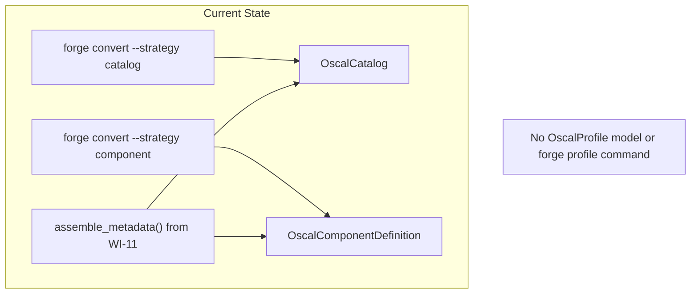
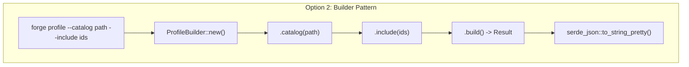
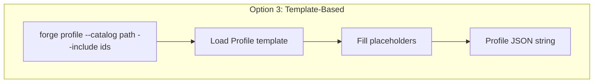
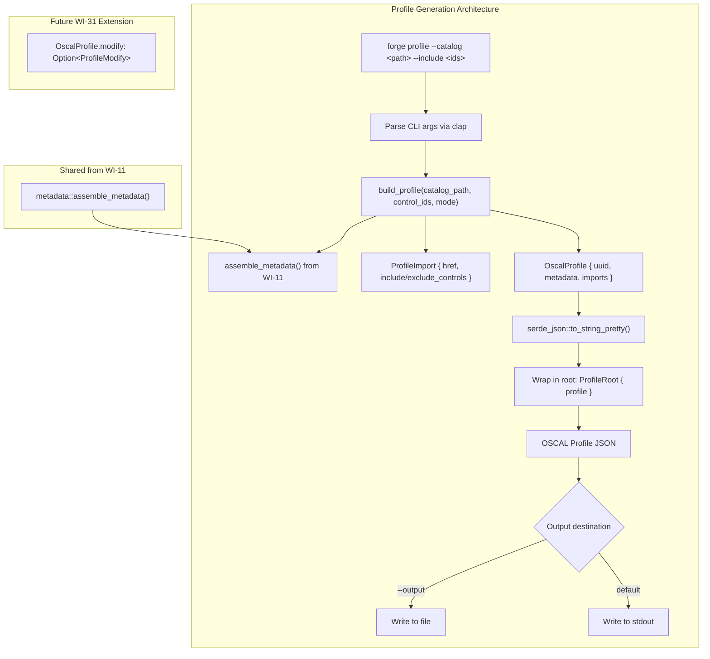
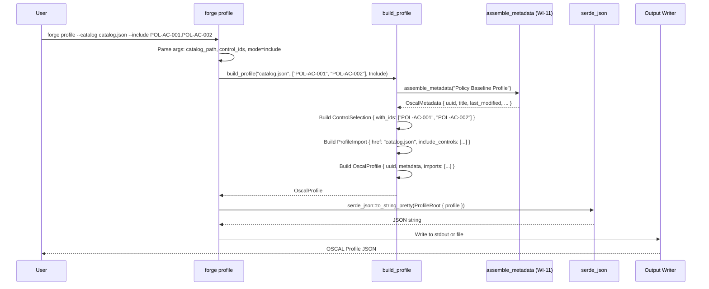

# 030-ar-profile-generation

> **Document Type:** Architecture Review
> **Audience:** LLM agents, human reviewers
> **Status:** Proposed
> **Last Updated:** 2026-02-10 <!-- @auto -->
> **Owner:** Brian Luby <!-- @human-required -->
> **Deciders:** Brian Luby <!-- @human-required -->

---

## Review Tier Legend

| Marker | Tier | Speckit Behavior |
|--------|------|------------------|
| 🔴 `@human-required` | Human Generated | Prompt human to author; blocks until complete |
| 🟡 `@human-review` | LLM + Human Review | LLM drafts → prompt human to confirm/edit; blocks until confirmed |
| 🟢 `@llm-autonomous` | LLM Autonomous | LLM completes; no prompt; logged for audit |
| ⚪ `@auto` | Auto-generated | System fills (timestamps, links); no prompt |

---

## Document Completion Order

> ⚠️ **For LLM Agents:** Complete sections in this order. Do not fill downstream sections until upstream human-required inputs exist.

1. **Summary (Decision)** → requires human input first
2. **Context (Problem Space)** → requires human input
3. **Decision Drivers** → requires human input (prioritized)
4. **Driving Requirements** → extract from PRD, human confirms
5. **Options Considered** → LLM drafts after drivers exist, human reviews
6. **Decision (Selected + Rationale)** → requires human decision
7. **Implementation Guardrails** → LLM drafts, human reviews
8. **Everything else** → can proceed after decision is made

---

## Linkage ⚪ `@auto`

| Document | ID | Relationship |
|----------|-----|--------------|
| Parent PRD | [030-prd-profile-generation](../PRD/030-prd-profile-generation.md) | Requirements this architecture satisfies |
| Security Review | N/A | Local CLI tool; no network or untrusted input processing |
| Supersedes | — | N/A |
| Superseded By | — | |

---

## Summary

### Decision 🔴 `@human-required`
> Use direct struct building with a `build_profile()` function that constructs the `OscalProfile` struct from CLI arguments (catalog path, include/exclude control IDs), reuses the WI-11 shared metadata assembly, and serializes to JSON via serde_json. The Profile struct models `imports[]` with `include-controls` or `exclude-controls` containing `with-ids` arrays, matching the OSCAL v1.2.0 Profile JSON schema.

### TL;DR for Agents 🟡 `@human-review`
> `forge profile --catalog <path> --include <ids>` (or `--exclude <ids>`) builds an `OscalProfile` struct directly, populates `imports[0]` with the catalog href and control selection, generates metadata via WI-11's `assemble_metadata`, and serializes with `serde_json::to_string_pretty`. `--include` and `--exclude` are mutually exclusive (clap `conflicts_with`). The root JSON key is `"profile"`. Do NOT implement parameter tailoring (WI-31), merge directives, or profile resolution. Do NOT read/parse the source catalog -- Profile references controls by ID only.

---

## Context

### Problem Space 🔴 `@human-required`
FORGE can generate OSCAL Catalogs from policy documents, but organizations need baseline selections -- subsets of controls applicable to specific teams, systems, or risk levels. OSCAL Profiles are the standard mechanism for expressing these selections. A Profile's `imports[]` array references a source Catalog and specifies which controls to include or exclude. The architectural question is how to construct the Profile struct: direct construction from CLI args, a builder pattern with fluent API, or a template-based system that fills in placeholders.

### Decision Scope 🟡 `@human-review`

**This AR decides:**
- How the OscalProfile struct and its nested types are defined
- How CLI arguments map to the Profile's `imports[]` structure
- How `include-controls` and `exclude-controls` are modeled
- How Profile metadata is generated
- How the `forge profile` subcommand is structured

**This AR does NOT decide:**
- Parameter tailoring (`modify` section) -- deferred to WI-31
- Profile validation and golden-file testing -- deferred to WI-32
- Profile Resolution (import -> merge -> modify algorithm) -- deferred; delegates to NIST oscal-cli
- Multi-catalog imports -- deferred to future enhancement
- XML/YAML Profile output -- uses existing WI-26/WI-27 infrastructure

### Current State 🟢 `@llm-autonomous`
FORGE generates OSCAL Catalogs and Component Definitions. The shared metadata assembly from WI-11 produces OSCAL-compliant metadata blocks. The CLI uses clap 4.x with derive macros and has `convert`, `validate`, and `export` subcommands. No Profile model or generation capability exists.



### Driving Requirements 🟡 `@human-review`

| PRD Req ID | Requirement Summary | Architectural Implication |
|------------|---------------------|---------------------------|
| M-1 | `forge profile` subcommand | New clap subcommand with ProfileArgs |
| M-2 | `--catalog <path>` flag | ProfileImport.href set from this argument |
| M-3 | `--include <ids>` flag | ControlSelection with include-controls |
| M-4 | `--exclude <ids>` flag | ControlSelection with exclude-controls |
| M-5 | `imports[]` with href to source Catalog | ProfileImport struct with href field |
| M-6 | `include-controls` with `with-ids` | ControlSelection struct with with_ids Vec |
| M-7 | `exclude-controls` with `with-ids` | Same ControlSelection for exclude path |
| M-8 | Valid metadata (uuid, title, etc.) | Reuse WI-11 assemble_metadata |
| M-9 | Valid OSCAL v1.2.0 Profile JSON | serde Serialize with correct field names |

**PRD Constraints inherited:**
- From constitution: Rust latest stable, clap 4.x, serde, thiserror, TDD mandatory
- From parent PRD: OSCAL v1.2.0, Profile with `imports[]` structure

---

## Decision Drivers 🔴 `@human-required`

1. **OSCAL conformance:** Generated Profile JSON must match the OSCAL v1.2.0 Profile JSON schema structure *(traces to PRD M-9)*
2. **Simplicity:** Profile generation from CLI args should be straightforward -- minimal layers between input and output *(constitution principle X)*
3. **Reuse:** Metadata generation must reuse the shared WI-11 assembly, not duplicate it *(DRY)*
4. **Extensibility:** The Profile struct must accommodate WI-31 parameter tailoring (`modify` section) without restructuring *(traces to roadmap T-5)*

---

## Options Considered 🟡 `@human-review`

### Option 0: Status Quo / Do Nothing

**Description:** Users manually author OSCAL Profile JSON or use external tools to create baselines.

| Driver | Rating | Notes |
|--------|--------|-------|
| OSCAL conformance | N/A | No Profile generation |
| Simplicity | ✅ Good | No new code |
| Reuse | N/A | No metadata to reuse |
| Extensibility | ❌ Poor | Blocks WI-31 (parameter tailoring) and WI-32 (validation) |

**Why not viable:** Parent PRD S-5 and AC-12 mandate Profile generation capability. WI-31 and WI-32 are blocked.

---

### Option 1: Direct Struct Building (Recommended)

**Description:** Define `OscalProfile`, `ProfileImport`, and `ControlSelection` structs with serde derives. A `build_profile()` function takes CLI arguments, constructs the struct hierarchy directly, and returns the populated `OscalProfile`. Serialize to JSON with `serde_json::to_string_pretty()`.

```mermaid
graph TD
    subgraph "Option 1: Direct Struct Building"
        CLI1["forge profile --catalog path --include ids"]
        CLI1 --> Parse1[Parse CLI args]
        Parse1 --> Build1["build_profile(catalog, ids, mode)"]
        Build1 --> Meta1["assemble_metadata() from WI-11"]
        Build1 --> Import1["ProfileImport { href, include_controls }"]
        Build1 --> Profile1["OscalProfile { uuid, metadata, imports }"]
        Profile1 --> Ser1["serde_json::to_string_pretty()"]
        Ser1 --> Wrap1['{"profile": {...}}']
        Wrap1 --> Out1[stdout / file]
    end
```

| Driver | Rating | Notes |
|--------|--------|-------|
| OSCAL conformance | ✅ Good | Structs map directly to OSCAL Profile JSON schema |
| Simplicity | ✅ Good | Minimal code; direct construction; no indirection |
| Reuse | ✅ Good | Calls assemble_metadata from WI-11 |
| Extensibility | ✅ Good | WI-31 adds `modify` field to OscalProfile; no restructuring needed |

**Pros:**
- Most direct mapping from CLI args to OSCAL Profile structure
- Serde derives handle correct JSON field naming via `#[serde(rename = "...")]`
- Easy to test -- construct a Profile, serialize, verify JSON structure
- Minimal abstraction layers -- function builds struct, serde serializes
- WI-31 extension is trivial: add `modify: Option<ProfileModify>` field

**Cons:**
- No fluent API for complex Profile construction (acceptable for WI-30 scope with single catalog import)
- Construction logic is inline rather than behind a builder abstraction (adequate for current complexity)

---

### Option 2: Builder Pattern with Fluent API

**Description:** Implement a `ProfileBuilder` with methods like `.catalog(path)`, `.include(ids)`, `.exclude(ids)`, `.build()` that constructs the Profile with validation at each step.



| Driver | Rating | Notes |
|--------|--------|-------|
| OSCAL conformance | ✅ Good | Builder validates structure at build time |
| Simplicity | ⚠️ Medium | Adds builder abstraction layer; more code for same result |
| Reuse | ✅ Good | Builder can call assemble_metadata |
| Extensibility | ✅ Good | Builder methods chain naturally for WI-31 additions |

**Pros:**
- Fluent API enables complex Profile construction in the future
- Validation at build time catches structural errors early
- Builder pattern is idiomatic for complex object construction

**Cons:**
- Over-engineered for WI-30 scope (single catalog, simple include/exclude)
- Adds ~100 lines of builder code that provides no value over direct construction
- Builder would need restructuring anyway for WI-31's very different `modify` section
- YAGNI (constitution principle X) -- build the builder when complexity justifies it

---

### Option 3: Template-Based Generation

**Description:** Define a Profile JSON template with placeholders (`{{catalog_href}}`, `{{control_ids}}`) and use a template engine (e.g., Tera, Handlebars) to generate the output.



| Driver | Rating | Notes |
|--------|--------|-------|
| OSCAL conformance | ⚠️ Medium | Template must be kept in sync with OSCAL schema; no compile-time verification |
| Simplicity | ❌ Poor | Adds template engine dependency; string-based generation is error-prone |
| Reuse | ❌ Poor | Cannot reuse assemble_metadata (which returns a struct, not a string) |
| Extensibility | ❌ Poor | Each new field requires updating the template and placeholder logic |

**Pros:**
- Easy to visualize the output format by reading the template

**Cons:**
- Template engine is a heavyweight dependency for a simple task
- No compile-time type safety -- typos in placeholders are runtime errors
- Cannot reuse WI-11 metadata assembly (struct-based, not string-based)
- Template must be updated for every OSCAL schema change
- Fundamentally wrong approach for typed struct generation

---

## Decision

### Selected Option 🔴 `@human-required`
> **Option 1: Direct Struct Building**

### Rationale 🔴 `@human-required`
Option 1 is the simplest, most direct approach for WI-30's scope. The Profile struct is small (uuid, metadata, imports with one entry), and the construction logic is straightforward (parse IDs, build ControlSelection, wrap in ProfileImport, assemble Profile). A builder pattern (Option 2) adds abstraction without value at this scope -- YAGNI per constitution principle X. Template-based generation (Option 3) is fundamentally wrong for typed struct construction. When WI-31 adds parameter tailoring, the `modify` field is simply added to `OscalProfile` as `Option<ProfileModify>` -- no restructuring needed.

#### Simplest Implementation Comparison 🟡 `@human-review`

| Aspect | Simplest Possible | Selected Option | Justification for Complexity |
|--------|-------------------|-----------------|------------------------------|
| Components | Single function constructing JSON string | OscalProfile struct + build_profile function + serde | PRD M-9 requires valid OSCAL JSON; serde guarantees correct structure |
| Dependencies | None new | None new (serde_json, clap already present) | All deps already in use |
| Patterns | Inline struct construction | build_profile function with WI-11 metadata call | PRD M-8 requires metadata reuse; function provides testability |

**Complexity justified by:** The selected option IS the simplest type-safe approach. Direct struct building with serde is the minimum code that produces guaranteed-correct OSCAL Profile JSON.

### Architecture Diagram 🟡 `@human-review`



---

## Technical Specification

### Component Overview 🟡 `@human-review`

| Component | Responsibility | Interface | Dependencies |
|-----------|---------------|-----------|--------------|
| ProfileArgs (clap struct) | CLI argument parsing for profile subcommand | Clap derive struct | clap 4.x |
| OscalProfile | OSCAL Profile model struct | `#[derive(Debug, Serialize)]` | serde |
| ProfileImport | Single import entry in imports[] | `#[derive(Debug, Serialize)]` | serde |
| ControlSelection | Control ID selection (with-ids) | `#[derive(Debug, Serialize)]` | serde |
| ProfileRoot | Root wrapper `{"profile": {...}}` | `#[derive(Debug, Serialize)]` | serde |
| build_profile | Constructs OscalProfile from CLI args | `fn(path, ids, mode) -> Result<OscalProfile, ForgeError>` | assemble_metadata |
| assemble_metadata (WI-11) | Generates OSCAL metadata block | Existing function | uuid, chrono |

### Data Flow 🟢 `@llm-autonomous`



### Interface Definitions 🟡 `@human-review`

```rust
use clap::Args;
use serde::Serialize;

/// CLI arguments for the profile subcommand
#[derive(Debug, Args)]
pub struct ProfileArgs {
    /// Path to the source Catalog file
    #[arg(long)]
    pub catalog: PathBuf,

    /// Comma-separated control IDs to include
    #[arg(long, conflicts_with = "exclude")]
    pub include: Option<String>,

    /// Comma-separated control IDs to exclude
    #[arg(long, conflicts_with = "include")]
    pub exclude: Option<String>,

    /// Output format (default: json)
    #[arg(long, default_value = "json")]
    pub format: String,

    /// Output file path (default: stdout)
    #[arg(long)]
    pub output: Option<PathBuf>,
}

/// Root wrapper for OSCAL Profile JSON: {"profile": {...}}
#[derive(Debug, Serialize)]
pub struct ProfileRoot {
    pub profile: OscalProfile,
}

/// OSCAL Profile model
#[derive(Debug, Serialize)]
pub struct OscalProfile {
    pub uuid: String,
    pub metadata: OscalMetadata,
    pub imports: Vec<ProfileImport>,
    // Future: WI-31 adds modify: Option<ProfileModify>
}

/// A single import entry in the Profile's imports[] array
#[derive(Debug, Serialize)]
pub struct ProfileImport {
    pub href: String,
    #[serde(skip_serializing_if = "Option::is_none", rename = "include-controls")]
    pub include_controls: Option<Vec<ControlSelection>>,
    #[serde(skip_serializing_if = "Option::is_none", rename = "exclude-controls")]
    pub exclude_controls: Option<Vec<ControlSelection>>,
}

/// Control selection with a list of control IDs
#[derive(Debug, Serialize)]
pub struct ControlSelection {
    #[serde(rename = "with-ids")]
    pub with_ids: Vec<String>,
}

/// Selection mode: include or exclude
pub enum SelectionMode {
    Include,
    Exclude,
}

/// Build an OSCAL Profile from CLI arguments
pub fn build_profile(
    catalog_path: &str,
    control_ids: Vec<String>,
    mode: SelectionMode,
) -> Result<OscalProfile, ForgeError> {
    let metadata = assemble_metadata("Policy Baseline Profile")?;

    let selection = ControlSelection {
        with_ids: control_ids,
    };

    let import = match mode {
        SelectionMode::Include => ProfileImport {
            href: catalog_path.to_string(),
            include_controls: Some(vec![selection]),
            exclude_controls: None,
        },
        SelectionMode::Exclude => ProfileImport {
            href: catalog_path.to_string(),
            include_controls: None,
            exclude_controls: Some(vec![selection]),
        },
    };

    Ok(OscalProfile {
        uuid: uuid::Uuid::new_v4().to_string(),
        metadata,
        imports: vec![import],
    })
}
```

### Key Algorithms/Patterns 🟡 `@human-review`

**Pattern:** Direct struct construction from CLI args
```
1. Parse --catalog, --include/--exclude from CLI args
2. Split comma-separated control IDs into Vec<String>
3. Trim whitespace from each ID
4. Deduplicate IDs (preserve order)
5. Build ControlSelection with with_ids
6. Build ProfileImport with href and include/exclude_controls
7. Call assemble_metadata from WI-11
8. Build OscalProfile with uuid, metadata, imports
9. Wrap in ProfileRoot {"profile": ...}
10. Serialize with serde_json::to_string_pretty
```

**Pattern:** Mutual exclusivity enforcement
```
clap #[arg(conflicts_with = "exclude")] on --include
clap #[arg(conflicts_with = "include")] on --exclude
Result: clap rejects commands with both flags before build_profile is called
```

---

## Constraints & Boundaries

### Technical Constraints 🟡 `@human-review`

**Inherited from PRD:**
- Rust latest stable, clap 4.x derive macros
- OSCAL v1.2.0 Profile JSON schema structure
- Reuse WI-11 shared metadata assembly
- TDD mandatory (constitution principle IV)

**Added by this Architecture:**
- `--include` and `--exclude` are mutually exclusive via clap `conflicts_with`
- Control IDs are used as-is (no validation against source Catalog -- that is WI-32)
- The `href` field stores the catalog path exactly as provided by the user (no normalization)
- The root JSON object uses `"profile"` as the key (OSCAL convention)
- Profile title defaults to "Policy Baseline Profile" (can be overridden in future WI)

### Architectural Boundaries 🟡 `@human-review`

- **Owns:** `OscalProfile`, `ProfileImport`, `ControlSelection` structs; `build_profile` function; `ProfileArgs` clap struct
- **Interfaces With:** WI-11 metadata assembly (calls), serde_json (serializes), CLI Command enum (registered as subcommand)
- **Must Not Touch:** Catalog generation code, export subcommand, validation infrastructure

### Implementation Guardrails 🟡 `@human-review`

> ⚠️ **Critical for LLM Agents:**

- [x] **DO NOT** implement parameter tailoring (`modify` section) -- that is WI-31 *(PRD W-1)*
- [x] **DO NOT** implement Profile Resolution -- that delegates to NIST oscal-cli *(PRD W-3)*
- [x] **DO NOT** read or parse the source Catalog file -- Profile references controls by ID; validation is WI-32 *(PRD scope boundary)*
- [x] **DO NOT** embed control content in the Profile -- Profiles reference, not contain *(OSCAL specification)*
- [x] **MUST** make `--include` and `--exclude` mutually exclusive *(PRD S-4)*
- [x] **MUST** wrap output in `{"profile": {...}}` root object *(OSCAL convention, PRD M-9)*
- [x] **MUST** reuse `assemble_metadata` from WI-11 *(PRD M-8, DRY)*
- [x] **MUST** use the catalog path as-is for `href` -- no normalization *(PRD design decision)*

---

## Consequences 🟡 `@human-review`

### Positive
- Minimal code -- Profile generation is approximately 100-150 LOC including struct definitions
- Direct struct building is easy to understand and test
- Serde guarantees correct JSON field naming and structure
- WI-31 extension is trivial: add `modify: Option<ProfileModify>` to `OscalProfile`
- Metadata reuse from WI-11 ensures consistency across all OSCAL artifact types

### Negative
- No builder pattern -- complex Profile construction (multi-catalog, merge directives) would benefit from it in the future
- No validation of control IDs against the source Catalog -- incorrect IDs produce valid but possibly useless Profiles

### Risks & Mitigations

| Risk | Likelihood | Impact | Mitigation |
|------|------------|--------|------------|
| Users provide non-existent control IDs | Med | Low | Profile is structurally valid regardless; C-1 (Could Have) adds optional warning; WI-32 adds validation |
| OSCAL Profile JSON schema has additional required fields | Low | Med | Verify generated JSON against NIST OSCAL Profile examples and schema |
| WI-31 requires restructuring Profile struct | Low | Low | Adding `modify: Option<ProfileModify>` is backward compatible |

---

## Implementation Guidance

### Suggested Implementation Order 🟢 `@llm-autonomous`
1. Define `OscalProfile`, `ProfileImport`, `ControlSelection`, `ProfileRoot` structs with serde derives
2. Write unit test: serialize Profile with include-controls, verify JSON structure
3. Write unit test: serialize Profile with exclude-controls, verify JSON structure
4. Implement `build_profile` function
5. Write unit test: build_profile produces correct imports structure
6. Write unit test: metadata fields are present and valid
7. Define `ProfileArgs` clap struct with `conflicts_with`
8. Add `Profile(ProfileArgs)` variant to CLI `Command` enum
9. Wire CLI dispatch to call `build_profile` and serialize
10. Write integration test: `forge profile --help` shows expected flags
11. Write integration test: full profile generation with include IDs
12. Write integration test: mutual exclusivity error

### Testing Strategy 🟢 `@llm-autonomous`

| Layer | Test Type | Coverage Target | Notes |
|-------|-----------|-----------------|-------|
| Unit | Profile with include-controls JSON shape | 100% | Verify imports[0].include-controls[0].with-ids |
| Unit | Profile with exclude-controls JSON shape | 100% | Verify imports[0].exclude-controls[0].with-ids |
| Unit | Metadata fields present | 100% | uuid, title, last-modified, version, oscal-version |
| Unit | href matches catalog path | 100% | Verify imports[0].href |
| Unit | Root JSON key is "profile" | 100% | Verify ProfileRoot serialization |
| Unit | Control ID parsing (comma-split, trim, dedup) | 100% | Edge cases: single ID, whitespace, duplicates |
| Integration | forge profile --include | Happy path | Full CLI invocation |
| Integration | forge profile --exclude | Happy path | Full CLI invocation |
| Integration | --include + --exclude conflict | Error path | clap reports mutual exclusivity error |
| Integration | Missing --catalog | Error path | clap reports required argument |

### Anti-patterns to Avoid 🟡 `@human-review`
- **Don't:** Read and parse the source Catalog to validate control IDs
  - **Why:** Couples generation to validation; adds latency; validation is WI-32's scope
  - **Instead:** Use control IDs as-is; optionally warn if Catalog is readable (C-1)
- **Don't:** Construct Profile JSON via string concatenation or template
  - **Why:** Bypasses type safety; risks malformed JSON; cannot reuse metadata struct
  - **Instead:** Use serde Serialize on typed structs
- **Don't:** Generate a `modify` section
  - **Why:** Parameter tailoring is WI-31's scope
  - **Instead:** Leave `modify` field absent from generated Profiles
- **Don't:** Hardcode the catalog href as an absolute path
  - **Why:** Breaks portability when Profiles are shared between environments
  - **Instead:** Use the path exactly as the user provides it

---

## Compliance & Cross-cutting Concerns

### Security Considerations 🟡 `@human-review`
- Authentication: N/A -- local CLI tool
- Authorization: N/A
- Data handling: Profile contains control IDs and a catalog file path reference; no sensitive policy text is embedded. Low data sensitivity.

### Observability 🟢 `@llm-autonomous`
- **Logging:** Log Profile generation at INFO level with catalog path and number of selected controls
- **Metrics:** N/A for CLI tool
- **Tracing:** N/A for CLI tool

### Error Handling Strategy 🟢 `@llm-autonomous`
```
Error Category → Handling Approach
├── Neither --include nor --exclude provided → clap argument group error
├── Both --include and --exclude provided → clap conflicts_with error
├── --catalog file does not exist → ForgeError::Io with descriptive path (S-3)
├── --include with empty string → ForgeError::Validation("No control IDs provided")
├── Metadata assembly failure → Propagate ForgeError from assemble_metadata
├── JSON serialization failure → ForgeError::Serialization (should not occur for valid structs)
└── File write error (--output) → ForgeError::Io with descriptive path
```

---

## Migration Plan (if applicable) 🟡 `@human-review`

N/A -- greenfield addition of Profile generation capability.

### Rollback Plan 🔴 `@human-required`

N/A -- additive feature. Remove `Profile` variant from CLI `Command` enum and the `OscalProfile` struct to revert. Catalog and Component Definition generation are unaffected.

---

## Open Questions 🟡 `@human-review`

No open questions for this work item.

---

## Changelog ⚪ `@auto`

| Version | Date | Author | Changes |
|---------|------|--------|---------|
| 0.1 | 2026-02-10 | LLM (Claude) | Initial proposal |

---

## Decision Record ⚪ `@auto`

| Date | Event | Details |
|------|-------|---------|
| 2026-02-10 | Proposed | Initial draft created from PRD 030 |

---

## Traceability Matrix 🟢 `@llm-autonomous`

| PRD Req ID | Decision Driver | Option Rating | Component | Notes |
|------------|-----------------|---------------|-----------|-------|
| M-1 | Simplicity | Option 1: ✅ | ProfileArgs + CLI Command | forge profile subcommand |
| M-2 | OSCAL conformance | Option 1: ✅ | ProfileArgs.catalog | --catalog flag maps to href |
| M-3 | OSCAL conformance | Option 1: ✅ | ProfileArgs.include + build_profile | --include maps to include-controls |
| M-4 | OSCAL conformance | Option 1: ✅ | ProfileArgs.exclude + build_profile | --exclude maps to exclude-controls |
| M-5 | OSCAL conformance | Option 1: ✅ | ProfileImport.href | href set from --catalog arg |
| M-6 | OSCAL conformance | Option 1: ✅ | ControlSelection.with_ids | with-ids populated from parsed IDs |
| M-7 | OSCAL conformance | Option 1: ✅ | ControlSelection.with_ids | Same struct for exclude path |
| M-8 | Reuse | Option 1: ✅ | assemble_metadata (WI-11) | Metadata generated via shared function |
| M-9 | OSCAL conformance | Option 1: ✅ | ProfileRoot + serde Serialize | Root "profile" key, correct field names |

---

## Review Checklist 🟢 `@llm-autonomous`

Before marking as Accepted:
- [x] All PRD Must Have requirements appear in Driving Requirements
- [x] Option 0 (Status Quo) is documented
- [x] Simplest Implementation comparison is completed
- [x] Decision drivers are prioritized and addressed
- [x] At least 2 options were seriously considered
- [x] Constraints distinguish inherited vs. new
- [x] Component names are consistent across all diagrams and tables
- [x] Implementation guardrails reference specific PRD constraints
- [x] Rollback triggers and authority are defined (N/A -- additive feature)
- [x] Security review is linked or N/A documented
- [x] No open questions blocking implementation
