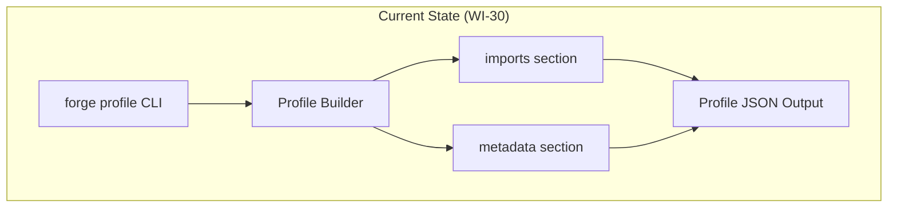
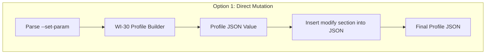
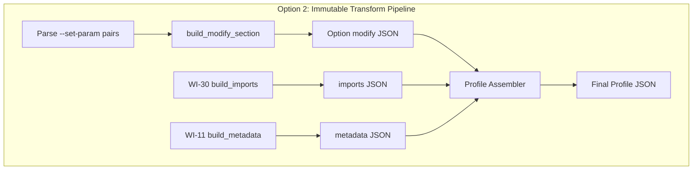
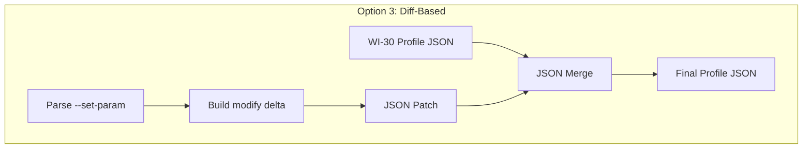
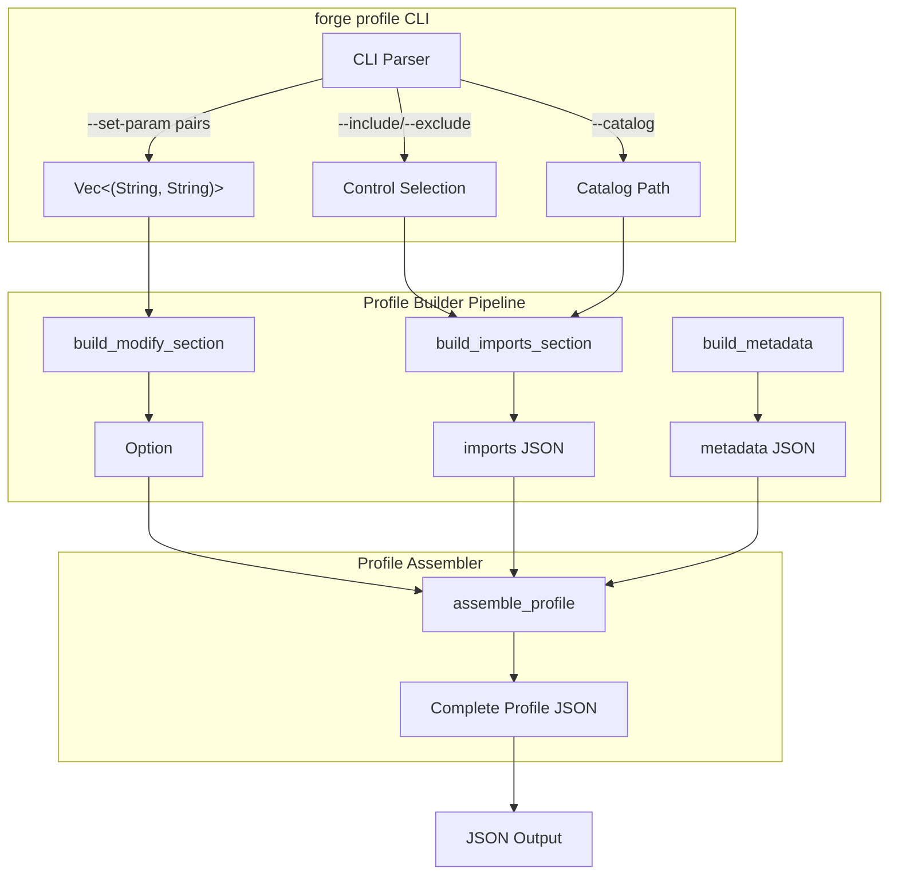
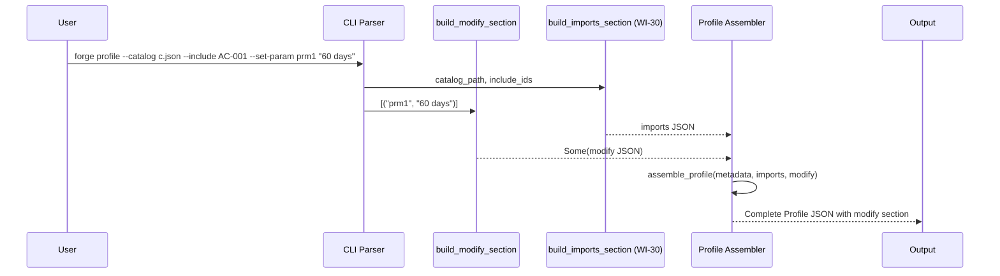
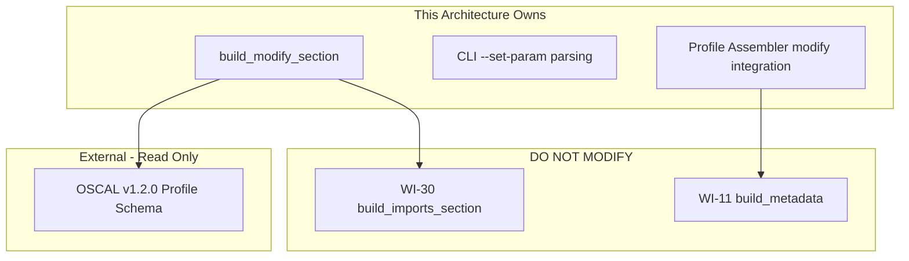

# 031-ar-profile-parameter-tailoring

> **Document Type:** Architecture Review
> **Audience:** LLM agents, human reviewers
> **Status:** Proposed
> **Last Updated:** 2026-02-10 <!-- @auto -->
> **Owner:** Brian Luby <!-- @human-required -->
> **Deciders:** Brian Luby <!-- @human-required -->

---

## Review Tier Legend

| Marker | Tier | Speckit Behavior |
|--------|------|------------------|
| 🔴 `@human-required` | Human Generated | Prompt human to author; blocks until complete |
| 🟡 `@human-review` | LLM + Human Review | LLM drafts → prompt human to confirm/edit; blocks until confirmed |
| 🟢 `@llm-autonomous` | LLM Autonomous | LLM completes; no prompt; logged for audit |
| ⚪ `@auto` | Auto-generated | System fills (timestamps, links); no prompt |

---

## Document Completion Order

> ⚠️ **For LLM Agents:** Complete sections in this order. Do not fill downstream sections until upstream human-required inputs exist.

1. **Summary (Decision)** → requires human input first
2. **Context (Problem Space)** → requires human input
3. **Decision Drivers** → requires human input (prioritized)
4. **Driving Requirements** → extract from PRD, human confirms
5. **Options Considered** → LLM drafts after drivers exist, human reviews
6. **Decision (Selected + Rationale)** → requires human decision
7. **Implementation Guardrails** → LLM drafts, human reviews
8. **Everything else** → can proceed after decision is made

---

## Linkage ⚪ `@auto`

| Document | ID | Relationship |
|----------|-----|--------------|
| Parent PRD | [031-prd-profile-parameter-tailoring](../PRD/031-prd-profile-parameter-tailoring.md) | Requirements this architecture satisfies |
| Security Review | N/A | No new attack surface — CLI argument extension |
| Supersedes | — | N/A |
| Superseded By | — | |

---

## Summary

### Decision 🔴 `@human-required`
> Extend the existing WI-30 Profile builder with an immutable transform pipeline that appends a `modify` section containing `set-parameters` entries from `--set-param` CLI flags, using clap 4 derive-style `num_args = 2` with `ArgAction::Append` for argument parsing and deterministic alphabetical ordering of parameter entries.

### TL;DR for Agents 🟡 `@human-review`
> WI-31 adds parameter tailoring to Profile generation by extending the WI-30 builder with a `build_modify_section` function that takes `--set-param` pairs and produces an OSCAL `modify.set-parameters` array. Use clap 4 derive macros with `num_args = 2` and `ArgAction::Append` for the `--set-param` flag. When no `--set-param` flags are provided, the `modify` section MUST be omitted entirely. Do NOT validate param IDs against the source catalog — that is WI-32's responsibility. Do NOT implement `alter` directives or the `merge` section.

---

## Context

### Problem Space 🔴 `@human-required`
WI-30 delivers Profile generation with control inclusion/exclusion via the `imports` section, but OSCAL Profiles without parameter tailoring are incomplete baselines. Organizations routinely need to override default parameter values — changing a password rotation interval from "90 days" to "60 days" or adjusting a review frequency from "annually" to "quarterly." The OSCAL `modify` section with `set-parameters` is the canonical mechanism for this tailoring. The architectural challenge is how to integrate `modify` section generation into the existing Profile builder pipeline without introducing coupling to catalog validation (deferred to WI-32) while keeping the output deterministic and backward-compatible with WI-30's Profile structure.

### Decision Scope 🟡 `@human-review`

**This AR decides:**
- How the `--set-param` CLI arguments are parsed and routed to the Profile builder
- How the `modify` section with `set-parameters` is constructed and merged into the Profile JSON
- How multiple `--set-param` flags (including duplicate param IDs) are aggregated
- The ordering strategy for `set-parameters` entries in output

**This AR does NOT decide:**
- Catalog-aware validation of param IDs — deferred to WI-32
- `alter` directives within the `modify` section — future extension
- The `merge` section of the Profile — not addressed
- Profile Resolution processing — delegated to NIST oscal-cli

### Current State 🟢 `@llm-autonomous`
WI-30 provides a Profile builder that generates OSCAL Profile JSON with `uuid`, `metadata`, and `imports[]` sections. The builder accepts `--catalog`, `--include`, `--exclude`, and `--format` flags. There is no `modify` section in the current output. The Profile builder produces valid OSCAL Profile JSON that passes schema validation for the imports-only case.



### Driving Requirements 🟡 `@human-review`

| PRD Req ID | Requirement Summary | Architectural Implication |
|------------|---------------------|---------------------------|
| M-1 | `--set-param <id> <value>` repeatable CLI flag | CLI argument parser must handle multi-value repeatable options |
| M-2 | Generate `modify` section with `set-parameters` array | Profile builder must support optional modify section construction |
| M-3 | Each entry has `param-id` and `values` fields | Serialization must produce OSCAL-compliant JSON key naming |
| M-4 | Multiple `--set-param` flags produce multiple entries | Aggregation logic for distinct param IDs required |
| M-5 | `modify` section as sibling of `imports` and `metadata` | JSON assembly must place modify at the correct nesting level |
| M-6 | No `modify` when no `--set-param` provided | Conditional section inclusion for backward compatibility |

**PRD Constraints inherited:**
- From constitution: Rust latest stable, clap 4.x derive macros, serde for serialization
- From PRD: OSCAL v1.2.0 Profile model, TDD mandatory

---

## Decision Drivers 🔴 `@human-required`

1. **Backward compatibility:** No `--set-param` flags must produce identical output to WI-30 *(traces to PRD M-6)*
2. **OSCAL correctness:** Generated `modify.set-parameters` must conform to OSCAL v1.2.0 Profile schema *(traces to PRD M-3, M-5)*
3. **Deterministic output:** Same inputs must produce byte-for-byte identical output *(traces to constitution principle P-3)*
4. **Simplicity:** Extend existing builder, avoid over-engineering *(traces to constitution principle X)*
5. **Extensibility:** Architecture must accommodate future `alter` directives without refactoring *(traces to PRD W-2)*

---

## Options Considered 🟡 `@human-review`

### Option 0: Status Quo / Do Nothing

**Description:** Keep the WI-30 Profile builder as-is with only `imports` support. Users cannot tailor parameter values in Profiles.

| Driver | Rating | Notes |
|--------|--------|-------|
| Backward compatibility | ✅ Good | No changes, no risk |
| OSCAL correctness | ❌ Poor | Profiles without parameter tailoring are incomplete baselines |
| Deterministic output | ✅ Good | No changes |
| Simplicity | ✅ Good | No additional code |
| Extensibility | ❌ Poor | No foundation for future modify section features |

**Why not viable:** Parent PRD S-5 requires "support for control inclusion/exclusion and parameter setting." Profiles without parameter tailoring do not satisfy AC-2 of US-4.

---

### Option 1: Direct Mutation of Profile JSON

**Description:** After building the base Profile JSON (imports + metadata), directly insert the `modify` section by mutating the `serde_json::Value` in place. Parse `--set-param` pairs, construct `set-parameters` entries, and inject them into the existing JSON object.



| Driver | Rating | Notes |
|--------|--------|-------|
| Backward compatibility | ✅ Good | Mutation only happens when --set-param provided |
| OSCAL correctness | ⚠️ Medium | Manual JSON insertion risks incorrect nesting |
| Deterministic output | ⚠️ Medium | JSON key ordering depends on insertion order |
| Simplicity | ⚠️ Medium | Direct mutation is simple but error-prone |
| Extensibility | ❌ Poor | Adding alter directives requires more ad-hoc mutations |

**Pros:**
- Minimal code change — just add a post-processing step
- No new types or structs required

**Cons:**
- Mutating JSON values in place is brittle and hard to test
- JSON key ordering is not guaranteed with direct insertion
- Future `alter` support would require more ad-hoc mutations

---

### Option 2: Immutable Transform Pipeline (Recommended)

**Description:** Introduce a `build_modify_section` function that takes `--set-param` pairs and returns an `Option<serde_json::Value>` representing the `modify` section. The Profile builder assembles the final JSON by composing independently-built sections (metadata, imports, modify) into the Profile root. Each section builder is a pure function that can be tested independently.



| Driver | Rating | Notes |
|--------|--------|-------|
| Backward compatibility | ✅ Good | modify section only included when set-param pairs exist |
| OSCAL correctness | ✅ Good | Each section builder tested independently against schema |
| Deterministic output | ✅ Good | Alphabetical sorting of set-parameters entries |
| Simplicity | ✅ Good | Pure functions, composable, minimal new code |
| Extensibility | ✅ Good | Alter directives become another section builder composed in the assembler |

**Pros:**
- Pure functions are easy to test (unit test `build_modify_section` independently)
- Composable assembly — each section is built independently and composed
- Alphabetical ordering of entries gives deterministic output
- Future `alter` directives simply add another builder function to the compose step

**Cons:**
- Slightly more code than direct mutation (one new function + tests)

---

### Option 3: Diff-Based Approach

**Description:** Build the base Profile JSON (WI-30 output), then construct a "delta" representing the modifications, and merge them using a JSON diff/patch mechanism. The `modify` section is treated as a patch applied to the base Profile.



| Driver | Rating | Notes |
|--------|--------|-------|
| Backward compatibility | ✅ Good | No delta applied when no --set-param |
| OSCAL correctness | ⚠️ Medium | Merge semantics must be carefully defined for OSCAL |
| Deterministic output | ⚠️ Medium | Merge ordering depends on patch library behavior |
| Simplicity | ❌ Poor | Introduces JSON merge/patch dependency; over-engineering |
| Extensibility | ⚠️ Medium | Diffs can represent any change, but add abstraction overhead |

**Pros:**
- Conceptually clean separation between base and modifications
- JSON patch is a well-defined standard (RFC 6902)

**Cons:**
- Adds unnecessary dependency (json-patch crate) for a simple insertion
- Over-engineering for appending a single section to a JSON object
- Merge semantics add complexity without proportional benefit
- Violates YAGNI — the modify section is straightforward JSON construction

---

## Decision

### Selected Option 🔴 `@human-required`
> **Option 2: Immutable Transform Pipeline**

### Rationale 🔴 `@human-required`
Option 2 provides the cleanest separation of concerns: each Profile section (metadata, imports, modify) is built by an independent pure function and composed in an assembler. This makes testing straightforward — `build_modify_section` can be unit-tested in isolation with known inputs and expected outputs. The immutable approach avoids the brittleness of direct JSON mutation (Option 1) and the over-engineering of diff-based merging (Option 3). The composable pattern naturally accommodates future `alter` directives as another builder function, satisfying the extensibility driver without premature abstraction.

#### Simplest Implementation Comparison 🟡 `@human-review`

| Aspect | Simplest Possible | Selected Option | Justification for Complexity |
|--------|-------------------|-----------------|------------------------------|
| Components | Direct JSON insertion after WI-30 build | build_modify_section function + assembler | PRD M-3/M-4 require correct OSCAL structure; pure function is testable |
| Dependencies | stdlib only | serde_json (already present) | PRD requires JSON output; serde_json already in use |
| Patterns | Mutable JSON manipulation | Immutable section builders composed | Deterministic output (driver 3) requires controlled assembly |

**Complexity justified by:** The selected option adds one function (`build_modify_section`) and modifies the existing assembler to accept an optional modify section. This is the minimum complexity needed to satisfy PRD requirements M-1 through M-6 while keeping the output deterministic and testable.

### Architecture Diagram 🟡 `@human-review`



---

## Technical Specification

### Component Overview 🟡 `@human-review`

| Component | Responsibility | Interface | Dependencies |
|-----------|---------------|-----------|--------------|
| CLI Parser | Parse `--set-param` repeatable flag into `Vec<(String, String)>` | clap derive macro | clap 4.x |
| build_modify_section | Construct `modify.set-parameters` JSON from param pairs | `fn(&[(String, String)]) -> Option<Value>` | serde_json |
| Profile Assembler | Compose metadata + imports + optional modify into Profile JSON | `fn(Value, Value, Option<Value>) -> Value` | serde_json |
| Profile Builder (WI-30) | Existing builder extended with modify support | Library API | WI-30 codebase |

### Data Flow 🟢 `@llm-autonomous`



### Interface Definitions 🟡 `@human-review`

```rust
/// CLI argument for --set-param (repeatable, two values per occurrence).
///
/// clap parses each `--set-param <id> <value>` occurrence as two contiguous
/// elements in a flattened Vec<String>. The caller MUST convert the flattened
/// Vec into `Vec<(String, String)>` pairs before passing to `build_modify_section`.
#[derive(Parser)]
struct ProfileArgs {
    /// Set parameter value: --set-param <param-id> <value>
    /// Can be repeated: --set-param prm1 "60 days" --set-param prm2 "quarterly"
    #[arg(long = "set-param", num_args = 2, action = clap::ArgAction::Append)]
    set_params: Vec<String>, // Flattened pairs: [id1, val1, id2, val2, ...]
}

/// Convert the flattened CLI Vec<String> into typed pairs.
/// Panics if set_params has an odd length (should not happen with num_args = 2).
fn parse_set_param_pairs(set_params: &[String]) -> Vec<(String, String)> {
    set_params
        .chunks_exact(2)
        .map(|chunk| (chunk[0].clone(), chunk[1].clone()))
        .collect()
}

/// Build the modify section from --set-param pairs.
/// Returns None if no parameters provided (backward compatible with WI-30).
/// Aggregates duplicate param-ids into a single entry with combined values.
/// Sorts entries alphabetically by param-id for deterministic output.
pub fn build_modify_section(
    param_overrides: &[(String, String)],
) -> Option<serde_json::Value> {
    if param_overrides.is_empty() {
        return None;
    }
    // Group by param-id, aggregate values, sort by param-id
    // Return modify JSON with set-parameters array
    todo!()
}

// Output structure:
// {
//   "profile": {
//     "uuid": "...",
//     "metadata": { ... },
//     "imports": [ ... ],
//     "modify": {
//       "set-parameters": [
//         { "param-id": "POL-AC-001_prm", "values": ["60 days"] }
//       ]
//     }
//   }
// }
```

### Key Algorithms/Patterns 🟡 `@human-review`

**Pattern:** Parameter Aggregation and Deterministic Ordering
```
1. Collect all --set-param pairs as Vec<(String, String)>
2. Group pairs by param-id into BTreeMap<String, Vec<String>>
   (BTreeMap provides alphabetical key ordering)
3. For each entry, build {"param-id": key, "values": values_vec}
4. Collect into set-parameters array
5. Wrap in {"modify": {"set-parameters": [...]}}
6. Return Some(modify_json) — or None if input was empty
```

---

## Constraints & Boundaries

### Technical Constraints 🟡 `@human-review`

**Inherited from PRD:**
- Rust latest stable, clap 4.x derive macros
- OSCAL v1.2.0 Profile model for `modify.set-parameters` structure
- serde + serde_json for serialization with `#[serde(rename)]` for OSCAL key names
- TDD mandatory

**Added by this Architecture:**
- `build_modify_section` must be a pure function (no side effects, no I/O)
- Parameter entries sorted alphabetically by `param-id` (deterministic output)
- `BTreeMap` used for aggregation to guarantee ordering
- The modify section is assembled independently and composed, not mutated in place

### Architectural Boundaries 🟡 `@human-review`



- **Owns:** `build_modify_section`, `--set-param` CLI argument definition, Profile assembler integration
- **Interfaces With:** WI-30 imports builder, WI-11 metadata builder
- **Must Not Touch:** Catalog validation logic (WI-32), alter directives (future), merge section (future)

### Implementation Guardrails 🟡 `@human-review`

> ⚠️ **Critical for LLM Agents:**

- [x] **DO NOT** validate param-id values against the source catalog — that is WI-32's responsibility *(from PRD W-1)*
- [x] **DO NOT** implement `alter` directives or the `merge` section — stay focused on `set-parameters` only *(from PRD W-2, W-4)*
- [x] **DO NOT** add the `modify` section when no `--set-param` flags are provided *(from PRD M-6)*
- [x] **MUST** use clap derive macros with `num_args = 2` for `--set-param` parsing *(from PRD Technical Constraints)*
- [x] **MUST** sort `set-parameters` entries alphabetically by `param-id` for deterministic output *(from PRD S-2)*
- [x] **MUST** aggregate duplicate `param-id` entries into a single entry with combined `values` array *(from PRD S-1)*

---

## Consequences 🟡 `@human-review`

### Positive
- Profile generation now supports the full range of OSCAL baseline tailoring (include/exclude + parameter setting)
- Pure function architecture enables isolated unit testing of modify section construction
- Composable assembly pattern extends naturally to future `alter` directives
- Backward compatibility maintained — no --set-param means identical WI-30 output

### Negative
- Slightly more code than a direct JSON mutation approach (one additional function)
- The flattened `Vec<String>` from clap requires an explicit `parse_set_param_pairs` conversion step before calling `build_modify_section`

### Risks & Mitigations

| Risk | Likelihood | Impact | Mitigation |
|------|------------|--------|------------|
| clap flattened Vec pairing logic introduces off-by-one errors | Low | Med | Unit tests for odd-length input, empty input, single pair |
| BTreeMap aggregation hides duplicate param-id intent | Low | Low | Document behavior: duplicates aggregate; add warning log |

---

## Implementation Guidance

### Suggested Implementation Order 🟢 `@llm-autonomous`
1. Add `--set-param` argument to the `forge profile` CLI definition using clap derive
2. Write unit tests for `build_modify_section` with empty, single, multiple, and duplicate inputs
3. Implement `build_modify_section` as a pure function using BTreeMap for aggregation
4. Integrate modify section into the Profile assembler (compose alongside imports and metadata)
5. Write integration tests verifying Profile JSON output with and without --set-param
6. Verify backward compatibility: Profile without --set-param matches WI-30 output exactly

### Testing Strategy 🟢 `@llm-autonomous`

| Layer | Test Type | Coverage Target | Notes |
|-------|-----------|-----------------|-------|
| Unit | build_modify_section | 95% | Empty input, single pair, multiple pairs, duplicate param-ids |
| Unit | CLI argument parsing | 90% | --set-param with spaces, quoting, empty values |
| Integration | Profile JSON output | Key paths | With and without --set-param; schema shape validation |
| Regression | WI-30 backward compatibility | 100% | No --set-param produces identical output to WI-30 |

### Reference Implementations 🟡 `@human-review`
- WI-30 Profile builder pattern in the codebase *(internal)*
- OSCAL Profile model reference: https://pages.nist.gov/OSCAL/reference/latest/profile/json-outline/ *(external)*

### Anti-patterns to Avoid 🟡 `@human-review`
- **Don't:** Add the `modify` section unconditionally (even when empty)
  - **Why:** An empty modify section is valid but noisy and breaks backward compatibility with WI-30
  - **Instead:** Return `None` from `build_modify_section` when no params provided
- **Don't:** Validate param-id against the source catalog
  - **Why:** WI-32's explicit responsibility; violates scope boundary
  - **Instead:** Treat param-ids as opaque strings passed through to output
- **Don't:** Use `HashMap` for aggregation
  - **Why:** Non-deterministic iteration order breaks output determinism
  - **Instead:** Use `BTreeMap` for guaranteed alphabetical ordering

---

## Compliance & Cross-cutting Concerns

### Security Considerations 🟡 `@human-review`
- Authentication: N/A — local CLI tool
- Authorization: N/A
- Data handling: Parameter values are user-supplied CLI arguments; no additional sensitive data processing beyond what clap already handles

### Observability 🟢 `@llm-autonomous`
- **Logging:** Log parameter pair count at INFO level; log individual pairs at DEBUG level
- **Metrics:** N/A for CLI tool
- **Tracing:** N/A for this scope

### Error Handling Strategy 🟢 `@llm-autonomous`
```
Error Category → Handling Approach
├── Odd number of --set-param values → Return descriptive error (clap validates num_args = 2)
├── Empty param-id string → Preserve as-is (opaque string, validated in WI-32)
├── Empty value string → Valid per OSCAL; generate entry with values: [""]
└── Serialization errors → Propagate via ForgeError::Serialization
```

---

## Migration Plan (if applicable) 🟡 `@human-review`

N/A — This is an additive extension to the WI-30 Profile builder. No migration required. The change is backward-compatible: existing `forge profile` invocations without `--set-param` produce identical output.

### Rollback Plan 🔴 `@human-required`

N/A — Additive feature. If the modify section proves problematic, it can be removed by reverting the `--set-param` CLI flag and `build_modify_section` function without affecting existing Profile generation.

---

## Open Questions 🟡 `@human-review`

No open questions for this work item.

---

## Changelog ⚪ `@auto`

| Version | Date | Author | Changes |
|---------|------|--------|---------|
| 0.1 | 2026-02-10 | LLM (Claude) | Initial proposal |

---

## Decision Record ⚪ `@auto`

| Date | Event | Details |
|------|-------|---------|
| 2026-02-10 | Proposed | Initial draft created from PRD 031 |

---

## Traceability Matrix 🟢 `@llm-autonomous`

| PRD Req ID | Decision Driver | Option Rating | Component | Notes |
|------------|-----------------|---------------|-----------|-------|
| M-1 | Simplicity | Option 2: ✅ | CLI Parser | clap derive with num_args = 2 |
| M-2 | OSCAL correctness | Option 2: ✅ | build_modify_section | Pure function returns modify JSON |
| M-3 | OSCAL correctness | Option 2: ✅ | build_modify_section | param-id and values fields per OSCAL model |
| M-4 | Deterministic output | Option 2: ✅ | build_modify_section | BTreeMap aggregation, alphabetical sort |
| M-5 | OSCAL correctness | Option 2: ✅ | Profile Assembler | modify as sibling of imports and metadata |
| M-6 | Backward compatibility | Option 2: ✅ | build_modify_section | Returns None when no params; assembler skips |
| S-1 | Deterministic output | Option 2: ✅ | build_modify_section | BTreeMap aggregates duplicate param-ids |
| S-2 | Deterministic output | Option 2: ✅ | build_modify_section | Alphabetical param-id ordering |

---

## Review Checklist 🟢 `@llm-autonomous`

Before marking as Accepted:
- [x] All PRD Must Have requirements appear in Driving Requirements
- [x] Option 0 (Status Quo) is documented
- [x] Simplest Implementation comparison is completed
- [x] Decision drivers are prioritized and addressed
- [x] At least 2 options were seriously considered
- [x] Constraints distinguish inherited vs. new
- [x] Component names are consistent across all diagrams and tables
- [x] Implementation guardrails reference specific PRD constraints
- [x] Rollback triggers and authority are defined (N/A — additive feature)
- [x] Security review is linked or N/A documented
- [x] No open questions blocking implementation
