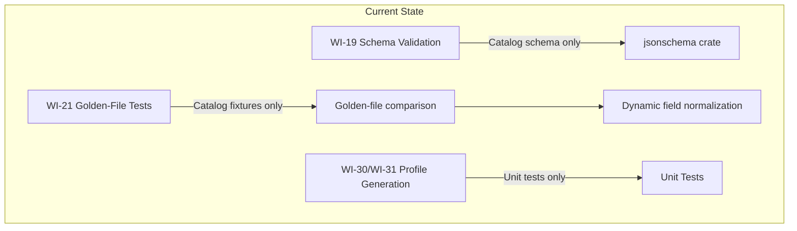
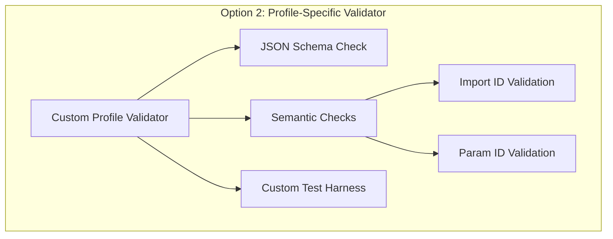
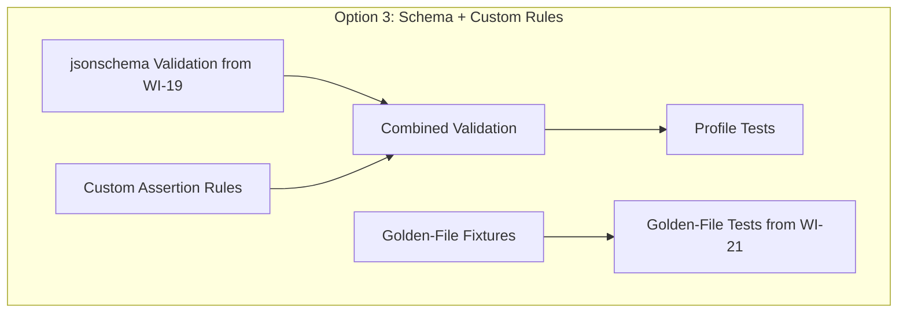
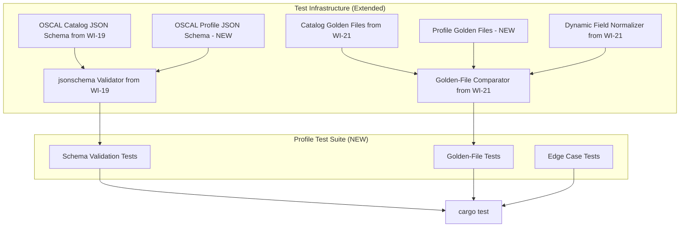
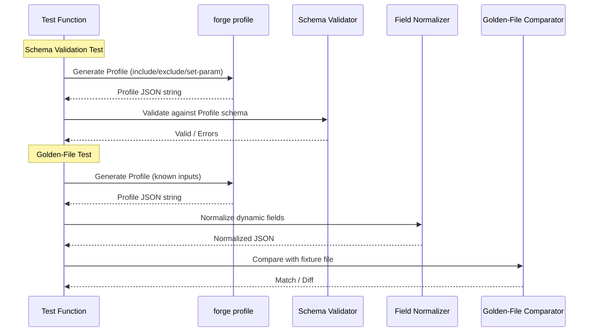
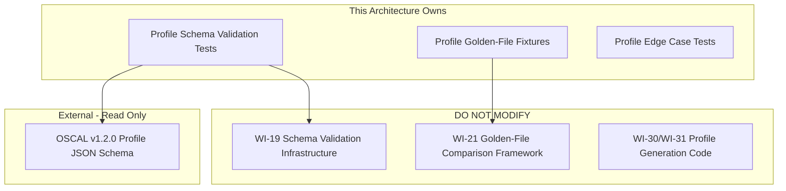

# 032-ar-profile-validation-tests

> **Document Type:** Architecture Review
> **Audience:** LLM agents, human reviewers
> **Status:** Proposed
> **Last Updated:** 2026-02-10 <!-- @auto -->
> **Owner:** Brian Luby <!-- @human-required -->
> **Deciders:** Brian Luby <!-- @human-required -->

---

## Review Tier Legend

| Marker | Tier | Speckit Behavior |
|--------|------|------------------|
| 🔴 `@human-required` | Human Generated | Prompt human to author; blocks until complete |
| 🟡 `@human-review` | LLM + Human Review | LLM drafts → prompt human to confirm/edit; blocks until confirmed |
| 🟢 `@llm-autonomous` | LLM Autonomous | LLM completes; no prompt; logged for audit |
| ⚪ `@auto` | Auto-generated | System fills (timestamps, links); no prompt |

---

## Document Completion Order

> ⚠️ **For LLM Agents:** Complete sections in this order. Do not fill downstream sections until upstream human-required inputs exist.

1. **Summary (Decision)** → requires human input first
2. **Context (Problem Space)** → requires human input
3. **Decision Drivers** → requires human input (prioritized)
4. **Driving Requirements** → extract from PRD, human confirms
5. **Options Considered** → LLM drafts after drivers exist, human reviews
6. **Decision (Selected + Rationale)** → requires human decision
7. **Implementation Guardrails** → LLM drafts, human reviews
8. **Everything else** → can proceed after decision is made

---

## Linkage ⚪ `@auto`

| Document | ID | Relationship |
|----------|-----|--------------|
| Parent PRD | [032-prd-profile-validation-tests](../PRD/032-prd-profile-validation-tests.md) | Requirements this architecture satisfies |
| Security Review | N/A | Test-only work item; no new attack surface |
| Supersedes | — | N/A |
| Superseded By | — | |

---

## Summary

### Decision 🔴 `@human-required`
> Extend the existing WI-19 schema validation and WI-21 golden-file test infrastructure to cover OSCAL Profile validation, adding the Profile JSON schema alongside the Catalog schema and creating Profile-specific golden-file fixtures with the established dynamic field normalization pattern.

### TL;DR for Agents 🟡 `@human-review`
> WI-32 is a test-only work item that adds three test layers for Profile generation: (1) schema validation against the OSCAL v1.2.0 Profile JSON schema using the `jsonschema` crate from WI-19, (2) golden-file comparison tests with at least 3 fixtures (include-only, exclude-only, include+set-param), and (3) edge case tests (empty selection, all controls, conflicting params). Reuse existing infrastructure from WI-19 and WI-21 — do NOT build new validation or comparison frameworks. Do NOT add any new generation features. Dynamic fields (UUIDs, timestamps) must be normalized before golden-file comparison using the WI-21 pattern.

---

## Context

### Problem Space 🔴 `@human-required`
Profile generation (WI-30) and parameter tailoring (WI-31) are functionally complete but lack two critical quality assurance layers: schema validation confirming OSCAL v1.2.0 conformance, and golden-file tests that lock down expected output to catch regressions. Without schema validation, generated Profiles could have incorrect structure that downstream tools reject. Without golden-file tests, changes in WI-33 (normative tagging) or WI-34 (parameter extraction) could silently alter Profile output. The architectural question is whether to build new validation/testing infrastructure or reuse the patterns established in WI-19 (schema validation) and WI-21/WI-22 (golden-file tests).

### Decision Scope 🟡 `@human-review`

**This AR decides:**
- How Profile schema validation is integrated (new infrastructure vs. extend existing)
- How golden-file tests are organized, structured, and compared
- How dynamic fields (UUIDs, timestamps) are handled in golden-file comparison
- How edge case tests are structured and organized

**This AR does NOT decide:**
- Profile generation features — already decided in WI-30/WI-31 ARs
- Normative/advisory detection — deferred to WI-33
- XML/YAML Profile output validation — JSON only for this WI
- Profile Resolution validation — delegated to oscal-cli in WI-36

### Current State 🟢 `@llm-autonomous`
WI-19 established schema validation infrastructure using the `jsonschema` crate with the OSCAL v1.2.0 Catalog JSON schema. WI-21/WI-22 established golden-file test infrastructure with dynamic field normalization (UUID and timestamp masking) for Catalog and Component Definition output. Profile generation (WI-30/WI-31) has unit tests but no schema validation or golden-file regression tests.



### Driving Requirements 🟡 `@human-review`

| PRD Req ID | Requirement Summary | Architectural Implication |
|------------|---------------------|---------------------------|
| M-1 | Schema validation against OSCAL v1.2.0 Profile JSON schema | Must add Profile schema to validation infrastructure |
| M-2 | Validate include-based Profiles | Schema validation test for include path |
| M-3 | Validate exclude-based Profiles | Schema validation test for exclude path |
| M-4 | Validate set-param Profiles | Schema validation test for modify section |
| M-5 | Golden-file tests for at least 3 scenarios | Need fixture files and comparison tests |
| M-6 | Dynamic field normalization in golden-file comparison | Reuse or extend UUID/timestamp masking |
| M-7 | Edge case: empty control selection | Test for boundary behavior |
| M-8 | Edge case: all-controls selection | Test for boundary behavior |
| M-9 | Edge case: conflicting parameter values | Test for defined behavior |
| M-10 | All tests runnable via `cargo test` | Standard Rust test organization |

**PRD Constraints inherited:**
- From constitution: TDD mandatory, `cargo clippy -- -D warnings` must pass
- From WI-19: `jsonschema` crate for schema validation
- From WI-21: Golden-file comparison pattern with dynamic field normalization

---

## Decision Drivers 🔴 `@human-required`

1. **Infrastructure reuse:** Minimize new code by reusing WI-19/WI-21 patterns *(traces to constitution principle X)*
2. **Regression confidence:** Golden-file tests must catch unintended output changes from WI-33/WI-34 *(traces to PRD M-5)*
3. **Schema coverage:** Every Profile generation path must be validated against the OSCAL schema *(traces to PRD M-1 through M-4)*
4. **Edge case robustness:** Boundary conditions must be tested to prevent surprises in WI-35 *(traces to PRD M-7 through M-9)*
5. **Developer experience:** Tests must be fast, clear, and easy to maintain *(traces to constitution principle X)*

---

## Options Considered 🟡 `@human-review`

### Option 0: Status Quo / Do Nothing

**Description:** Rely on WI-30/WI-31 unit tests and manual inspection to verify Profile correctness. No schema validation or golden-file tests.

| Driver | Rating | Notes |
|--------|--------|-------|
| Infrastructure reuse | N/A | Nothing to reuse |
| Regression confidence | ❌ Poor | No automated regression detection for Profile output |
| Schema coverage | ❌ Poor | No schema validation — structural issues go undetected |
| Edge case robustness | ❌ Poor | No systematic edge case testing |
| Developer experience | ❌ Poor | Manual verification is slow and error-prone |

**Why not viable:** AC-12 from the parent PRD cannot be validated without schema validation. WI-35 (Phase 2 release) is blocked until this validation layer exists.

---

### Option 1: Extend WI-19 Validator + WI-21 Golden-File Framework (Recommended)

**Description:** Add the OSCAL v1.2.0 Profile JSON schema alongside the existing Catalog schema in the validation infrastructure. Create a `validate_profile` helper that wraps the existing `jsonschema` validation. For golden files, add Profile fixtures in `tests/fixtures/profiles/` using the same dynamic field normalization pattern from WI-21. Edge case tests are standard Rust `#[test]` functions.

```mermaid
graph TD
    subgraph "Option 1: Extend Existing Infrastructure"
        Schema[OSCAL Profile JSON Schema] --> Validator[jsonschema Validator from WI-19]
        Validator --> SchemaTests[Profile Schema Validation Tests]
        Fixtures[Profile Golden-File Fixtures] --> Compare[Golden-File Comparator from WI-21]
        Compare --> Normalize[Dynamic Field Normalization from WI-21]
        Normalize --> GoldenTests[Profile Golden-File Tests]
        EdgeInputs[Edge Case Inputs] --> EdgeTests[Standard #[test] Functions]
    end
```

| Driver | Rating | Notes |
|--------|--------|-------|
| Infrastructure reuse | ✅ Good | Reuses jsonschema and golden-file infrastructure directly |
| Regression confidence | ✅ Good | Golden files catch any unintended output change |
| Schema coverage | ✅ Good | Profile schema added alongside Catalog schema |
| Edge case robustness | ✅ Good | Standard tests for boundary conditions |
| Developer experience | ✅ Good | Consistent patterns — developers already know the framework |

**Pros:**
- Minimal new code — just add the Profile schema and fixture files
- Consistent developer experience across Catalog and Profile testing
- Dynamic field normalization already handles UUIDs and timestamps
- Tests run as part of `cargo test` — no new tooling

**Cons:**
- Tied to the `jsonschema` crate's capabilities (proven for Catalogs in WI-19)
- Golden files need updating when intentional output changes occur

---

### Option 2: Profile-Specific Validator

**Description:** Build a separate Profile validation module with custom validation logic beyond JSON schema, including semantic checks (e.g., imported control IDs exist in catalog, parameter IDs reference valid params). Use a dedicated test runner or harness for Profile-specific testing.



| Driver | Rating | Notes |
|--------|--------|-------|
| Infrastructure reuse | ❌ Poor | New validator, new test harness — duplicates existing infrastructure |
| Regression confidence | ✅ Good | More thorough validation catches more issues |
| Schema coverage | ✅ Good | Schema + semantic validation |
| Edge case robustness | ✅ Good | Semantic checks catch logical errors |
| Developer experience | ⚠️ Medium | New patterns to learn; inconsistent with WI-19/WI-21 |

**Pros:**
- Catches semantic errors beyond schema compliance (orphaned IDs, invalid references)
- Purpose-built for Profile-specific concerns

**Cons:**
- Significant new code for validation logic that goes beyond PRD scope
- Semantic validation (control ID exists in catalog) is explicitly deferred to WI-32 scope for "descriptive error or warning" — not full cross-referencing
- Over-engineering for a test-focused sprint
- Inconsistent with established patterns

---

### Option 3: Schema Validation + Custom Assertion Rules

**Description:** Use the WI-19 `jsonschema` validator for structural validation, then add a layer of custom assertion rules (not a full validator) that check Profile-specific properties: `modify` section presence when expected, `set-parameters` entry count, `imports` structure. Golden files remain as in Option 1.



| Driver | Rating | Notes |
|--------|--------|-------|
| Infrastructure reuse | ⚠️ Medium | Reuses jsonschema but adds custom rule layer |
| Regression confidence | ✅ Good | Custom rules plus golden files |
| Schema coverage | ✅ Good | Schema plus targeted assertions |
| Edge case robustness | ✅ Good | Custom rules can encode edge case expectations |
| Developer experience | ⚠️ Medium | Mixed approach — some standard, some custom |

**Pros:**
- Combines schema validation strength with targeted structural assertions
- More thorough than schema-only without full semantic validation

**Cons:**
- Custom assertion rules add maintenance burden
- The assertions duplicate what golden-file tests already catch
- Slightly over-engineered for the PRD requirements

---

## Decision

### Selected Option 🔴 `@human-required`
> **Option 1: Extend WI-19 Validator + WI-21 Golden-File Framework**

### Rationale 🔴 `@human-required`
Option 1 maximizes infrastructure reuse while providing comprehensive validation coverage. The `jsonschema` crate is proven for OSCAL schema validation from WI-19, and adding the Profile schema is a minimal change. The golden-file framework from WI-21 already handles the tricky parts (dynamic field normalization, fixture management). Option 2 over-engineers with semantic validation beyond PRD scope, and Option 3 adds a custom rule layer that duplicates golden-file coverage. Constitution principle X (YAGNI) favors the simplest approach that meets all PRD requirements.

#### Simplest Implementation Comparison 🟡 `@human-review`

| Aspect | Simplest Possible | Selected Option | Justification for Complexity |
|--------|-------------------|-----------------|------------------------------|
| Components | Manual JSON inspection | Schema validator + golden-file comparator | PRD M-1 requires automated schema validation; M-5 requires golden-file tests |
| Dependencies | None | jsonschema (already present from WI-19) | Reusing existing dependency, no new additions |
| Patterns | Ad-hoc test assertions | Consistent schema + golden-file pattern | PRD M-10 requires all tests in `cargo test`; consistency with WI-19/WI-21 |

**Complexity justified by:** The selected option reuses existing infrastructure with minimal additions (one schema file, fixture files, and test functions). The complexity IS the simplest approach that meets PRD M-1 through M-10.

### Architecture Diagram 🟡 `@human-review`



---

## Technical Specification

### Component Overview 🟡 `@human-review`

| Component | Responsibility | Interface | Dependencies |
|-----------|---------------|-----------|--------------|
| OSCAL Profile JSON Schema | Schema definition for Profile validation | JSON file in schema resources | NIST OSCAL v1.2.0 |
| validate_profile | Validate Profile JSON against schema | `fn(&str, &Path) -> Result<(), Vec<ValidationError>>` | jsonschema crate (WI-19) |
| Profile Golden-File Fixtures | Expected output files for comparison | JSON files in tests/fixtures/profiles/ | WI-30/WI-31 output |
| Dynamic Field Normalizer | Mask UUIDs and timestamps in output | `fn(&str) -> String` | WI-21 infrastructure |
| Schema Validation Tests | Test functions for schema compliance | `#[test]` functions | validate_profile |
| Golden-File Tests | Test functions for output comparison | `#[test]` functions | Normalizer, Comparator |
| Edge Case Tests | Test functions for boundary conditions | `#[test]` functions | forge profile CLI |

### Data Flow 🟢 `@llm-autonomous`



### Interface Definitions 🟡 `@human-review`

```rust
// No new public API — this WI adds tests only.
// Test infrastructure reused from WI-19 and WI-21:

/// Validate a JSON string against the OSCAL Profile schema.
/// Reuses the jsonschema infrastructure from WI-19.
fn validate_profile_schema(json: &str) -> Result<(), Vec<ValidationError>> {
    let schema = load_oscal_schema("profile")?; // Extend WI-19 to support profile schema
    validate_against_schema(json, &schema)
}

/// Normalize dynamic fields for golden-file comparison.
/// Reuses the normalizer from WI-21.
fn normalize_dynamic_fields(json: &str) -> String {
    // Replace UUIDs with "00000000-0000-0000-0000-000000000000"
    // Replace last-modified timestamps with "2026-01-01T00:00:00Z"
    // Existing WI-21 implementation
    todo!()
}

/// Compare normalized output against a golden-file fixture.
fn compare_golden_file(actual: &str, fixture_path: &Path) -> Result<(), String> {
    let expected = std::fs::read_to_string(fixture_path)?;
    let actual_normalized = normalize_dynamic_fields(actual);
    let expected_normalized = normalize_dynamic_fields(&expected);
    if actual_normalized == expected_normalized {
        Ok(())
    } else {
        Err(format!("Golden file mismatch:\n{}", diff(&actual_normalized, &expected_normalized)))
    }
}

// Golden-file fixtures (new files):
//   tests/fixtures/profiles/include_only.json
//   tests/fixtures/profiles/exclude_only.json
//   tests/fixtures/profiles/include_with_params.json
//   tests/fixtures/profiles/all_controls.json
//   tests/fixtures/profiles/include_and_exclude.json
```

### Key Algorithms/Patterns 🟡 `@human-review`

**Pattern:** Three-Layer Test Architecture
```
1. Schema Validation Layer:
   - Load OSCAL Profile JSON schema
   - Generate Profile for each path (include, exclude, set-param)
   - Validate output against schema
   - Assert zero validation errors

2. Golden-File Layer:
   - Generate Profile for each fixture scenario
   - Normalize dynamic fields (UUIDs, timestamps)
   - Compare against stored fixture files
   - Fail on any difference (explicit update required)

3. Edge Case Layer:
   - Test boundary inputs (empty, all, conflicting)
   - Assert defined behavior (correct output or expected error)
   - Use standard Rust assertions, not golden files
```

---

## Constraints & Boundaries

### Technical Constraints 🟡 `@human-review`

**Inherited from PRD:**
- `jsonschema` crate from WI-19 for schema validation
- Golden-file comparison framework from WI-21/WI-22
- OSCAL v1.2.0 Profile JSON schema (NIST-published)
- TDD mandatory; all tests in `cargo test`

**Added by this Architecture:**
- Profile schema stored alongside Catalog schema in the project's schema resources directory
- Profile golden-file fixtures stored in `tests/fixtures/profiles/`
- Dynamic field normalization applied before all golden-file comparisons (UUIDs, timestamps)
- Edge case tests use standard `#[test]` assertions, not golden-file comparison
- Test modules organized in `tests/profile_validation.rs` or `tests/profile_golden_files.rs`

### Architectural Boundaries 🟡 `@human-review`



- **Owns:** Profile test suite (schema tests, golden-file tests, edge case tests), Profile fixtures
- **Interfaces With:** WI-19 validation infrastructure, WI-21 golden-file framework, WI-30/WI-31 Profile generation
- **Must Not Touch:** Profile generation code, Catalog validation tests, existing golden-file fixtures

### Implementation Guardrails 🟡 `@human-review`

> ⚠️ **Critical for LLM Agents:**

- [x] **DO NOT** build a new validation framework — reuse WI-19 jsonschema infrastructure *(constitution principle X)*
- [x] **DO NOT** build a new golden-file comparison framework — reuse WI-21 infrastructure *(constitution principle X)*
- [x] **DO NOT** modify Profile generation code — this WI adds tests only *(PRD scope boundary)*
- [x] **DO NOT** hard-code UUIDs or timestamps in golden files — use dynamic field normalization *(PRD M-6)*
- [x] **MUST** include at least 3 golden-file scenarios: include-only, exclude-only, include+set-param *(PRD M-5)*
- [x] **MUST** test edge cases: empty selection, all controls, conflicting params *(PRD M-7, M-8, M-9)*
- [x] **MUST** ensure all tests run via `cargo test` with zero failures *(PRD M-10)*

---

## Consequences 🟡 `@human-review`

### Positive
- Automated schema validation ensures generated Profiles are structurally valid OSCAL
- Golden-file tests provide regression safety net as WI-33/WI-34 modify Profile-related code
- Edge case tests document expected boundary behavior
- AC-12 from the parent PRD is fully validated
- Consistent testing patterns across Catalog and Profile generation

### Negative
- Golden files require explicit updates when intentional output changes are made
- Schema validation is limited to structural correctness — semantic issues beyond schema scope

### Risks & Mitigations

| Risk | Likelihood | Impact | Mitigation |
|------|------------|--------|------------|
| jsonschema crate has limitations with Profile schema | Low | Med | Profile schema uses same OSCAL metaschema framework as Catalog; tested for Catalogs in WI-19 |
| Golden files are brittle due to JSON key ordering | Med | Low | Use serde_json with consistent serialization; normalize before comparison |
| Edge cases reveal bugs in WI-30/WI-31 | Med | Med | File issues for WI-30/WI-31 fixes; use `#[ignore]` for known failures |

---

## Implementation Guidance

### Suggested Implementation Order 🟢 `@llm-autonomous`
1. Add OSCAL v1.2.0 Profile JSON schema to the schema resources directory
2. Extend the schema validation helper to support loading the Profile schema
3. Write schema validation tests for include-only, exclude-only, and set-param Profiles
4. Create golden-file fixture files for at least 3 representative scenarios
5. Write golden-file comparison tests using the WI-21 normalizer and comparator
6. Write edge case tests for empty selection, all controls, conflicting params
7. Write the end-to-end AC-12 verification test
8. Verify all tests pass via `cargo test`

### Testing Strategy 🟢 `@llm-autonomous`

| Layer | Test Type | Coverage Target | Notes |
|-------|-----------|-----------------|-------|
| Schema | Profile schema validation | All generation paths | Include, exclude, set-param |
| Golden-file | Output regression | 3+ scenarios | Include-only, exclude-only, include+set-param |
| Edge case | Boundary conditions | 3+ edge cases | Empty, all, conflicting |
| E2E | AC-12 verification | 1 test | Full include/exclude flow |

### Reference Implementations 🟡 `@human-review`
- WI-19 schema validation test pattern *(internal)*
- WI-21/WI-22 golden-file test pattern *(internal)*
- OSCAL v1.2.0 Profile JSON schema: https://pages.nist.gov/OSCAL/concepts/layer/control/profile/ *(external)*

### Anti-patterns to Avoid 🟡 `@human-review`
- **Don't:** Write golden-file tests that are sensitive to JSON key ordering
  - **Why:** Different serialization settings may produce different key orders
  - **Instead:** Use consistent serialization or order-insensitive comparison
- **Don't:** Hard-code UUIDs or timestamps in golden files
  - **Why:** Dynamic fields change every run, causing spurious failures
  - **Instead:** Normalize dynamic fields before comparison
- **Don't:** Skip schema validation and rely only on golden files
  - **Why:** Golden files might be incorrect; schema validation catches structural issues independently
  - **Instead:** Always validate against schema AND compare against golden files

---

## Compliance & Cross-cutting Concerns

### Security Considerations 🟡 `@human-review`
- Authentication: N/A — local test suite
- Authorization: N/A
- Data handling: Tests use synthetic fixture data, not real policy content

### Observability 🟢 `@llm-autonomous`
- **Logging:** Test output via `cargo test` standard output
- **Metrics:** N/A — test suite
- **Tracing:** N/A — test suite

### Error Handling Strategy 🟢 `@llm-autonomous`
```
Error Category → Handling Approach
├── Schema validation failure → Test fails with validation error details
├── Golden-file mismatch → Test fails with diff output
├── Missing fixture file → Test fails with descriptive file-not-found error
└── Profile generation error → Test fails, propagating ForgeError
```

---

## Migration Plan (if applicable) 🟡 `@human-review`

N/A — This is a test-only work item adding new test files and fixtures. No existing code is modified.

### Rollback Plan 🔴 `@human-required`

N/A — Test-only work item. Tests can be removed without affecting production code. If the Profile schema proves incompatible with the jsonschema crate, fall back to oscal-cli validation as documented in risk mitigation.

---

## Open Questions 🟡 `@human-review`

No open questions for this work item.

---

## Changelog ⚪ `@auto`

| Version | Date | Author | Changes |
|---------|------|--------|---------|
| 0.1 | 2026-02-10 | LLM (Claude) | Initial proposal |

---

## Decision Record ⚪ `@auto`

| Date | Event | Details |
|------|-------|---------|
| 2026-02-10 | Proposed | Initial draft created from PRD 032 |

---

## Traceability Matrix 🟢 `@llm-autonomous`

| PRD Req ID | Decision Driver | Option Rating | Component | Notes |
|------------|-----------------|---------------|-----------|-------|
| M-1 | Schema coverage | Option 1: ✅ | validate_profile | Profile schema added to WI-19 infrastructure |
| M-2 | Schema coverage | Option 1: ✅ | Schema Validation Tests | Include path validated |
| M-3 | Schema coverage | Option 1: ✅ | Schema Validation Tests | Exclude path validated |
| M-4 | Schema coverage | Option 1: ✅ | Schema Validation Tests | Set-param path validated |
| M-5 | Regression confidence | Option 1: ✅ | Profile Golden-File Fixtures | 3+ fixture scenarios |
| M-6 | Regression confidence | Option 1: ✅ | Dynamic Field Normalizer | UUID/timestamp normalization from WI-21 |
| M-7 | Edge case robustness | Option 1: ✅ | Edge Case Tests | Empty selection tested |
| M-8 | Edge case robustness | Option 1: ✅ | Edge Case Tests | All-controls selection tested |
| M-9 | Edge case robustness | Option 1: ✅ | Edge Case Tests | Conflicting params tested |
| M-10 | Developer experience | Option 1: ✅ | cargo test | All tests in standard Rust test framework |

---

## Review Checklist 🟢 `@llm-autonomous`

Before marking as Accepted:
- [x] All PRD Must Have requirements appear in Driving Requirements
- [x] Option 0 (Status Quo) is documented
- [x] Simplest Implementation comparison is completed
- [x] Decision drivers are prioritized and addressed
- [x] At least 2 options were seriously considered
- [x] Constraints distinguish inherited vs. new
- [x] Component names are consistent across all diagrams and tables
- [x] Implementation guardrails reference specific PRD constraints
- [x] Rollback triggers and authority are defined (N/A — test-only)
- [x] Security review is linked or N/A documented
- [x] No open questions blocking implementation
