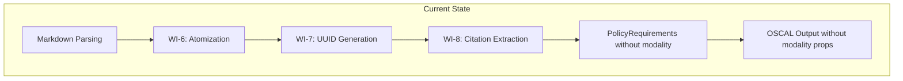
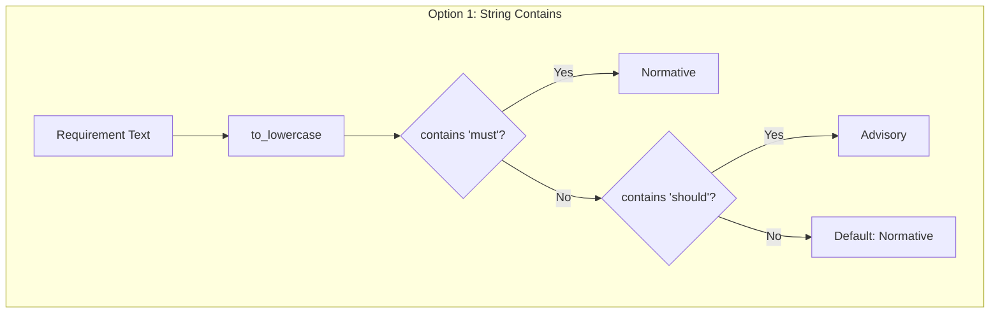
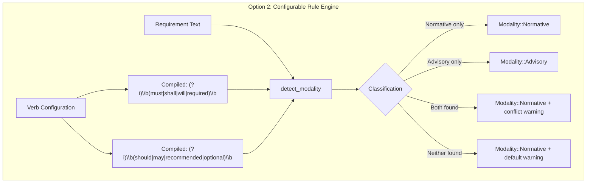
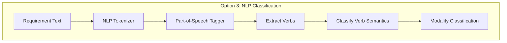
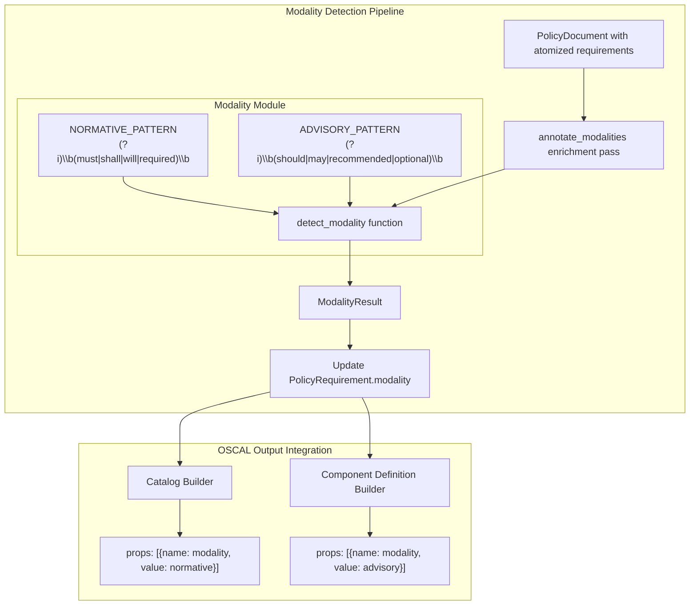
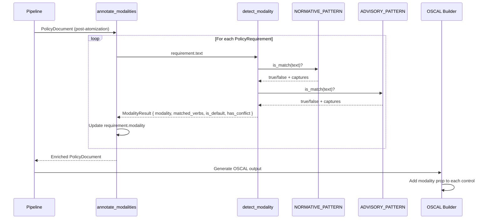
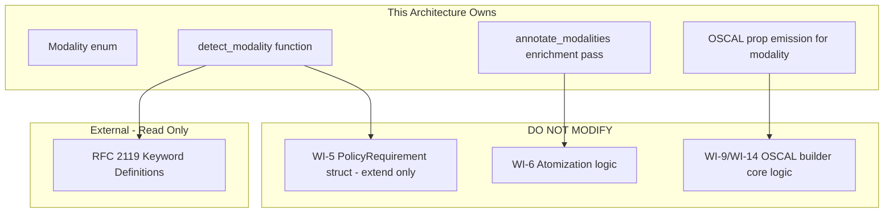

# 033-ar-normative-advisory-detection

> **Document Type:** Architecture Review
> **Audience:** LLM agents, human reviewers
> **Status:** Proposed
> **Last Updated:** 2026-02-10 <!-- @auto -->
> **Owner:** Brian Luby <!-- @human-required -->
> **Deciders:** Brian Luby <!-- @human-required -->

---

## Review Tier Legend

| Marker | Tier | Speckit Behavior |
|--------|------|------------------|
| 🔴 `@human-required` | Human Generated | Prompt human to author; blocks until complete |
| 🟡 `@human-review` | LLM + Human Review | LLM drafts → prompt human to confirm/edit; blocks until confirmed |
| 🟢 `@llm-autonomous` | LLM Autonomous | LLM completes; no prompt; logged for audit |
| ⚪ `@auto` | Auto-generated | System fills (timestamps, links); no prompt |

---

## Document Completion Order

> ⚠️ **For LLM Agents:** Complete sections in this order. Do not fill downstream sections until upstream human-required inputs exist.

1. **Summary (Decision)** → requires human input first
2. **Context (Problem Space)** → requires human input
3. **Decision Drivers** → requires human input (prioritized)
4. **Driving Requirements** → extract from PRD, human confirms
5. **Options Considered** → LLM drafts after drivers exist, human reviews
6. **Decision (Selected + Rationale)** → requires human decision
7. **Implementation Guardrails** → LLM drafts, human reviews
8. **Everything else** → can proceed after decision is made

---

## Linkage ⚪ `@auto`

| Document | ID | Relationship |
|----------|-----|--------------|
| Parent PRD | [033-prd-normative-advisory-detection](../PRD/033-prd-normative-advisory-detection.md) | Requirements this architecture satisfies |
| Security Review | N/A | Regex on already-parsed text; no new attack surface |
| Supersedes | — | N/A |
| Superseded By | — | |

---

## Summary

### Decision 🔴 `@human-required`
> Implement normative/advisory detection as a configurable rule engine using cached regex patterns with word boundary anchors, operating as a separate pipeline enrichment pass on `PolicyRequirement` structs, with results emitted as OSCAL `prop` annotations on controls in both Catalog and Component Definition output.

### TL;DR for Agents 🟡 `@human-review`
> WI-33 adds modality detection using `regex` crate patterns with `\b` word boundaries and `(?i)` case-insensitive matching. Implement as a `modality` module with a `detect_modality` function and an `annotate_modalities` enrichment pass. Normative verbs: "must", "shall", "will", "required". Advisory verbs: "should", "may", "recommended", "optional". Default to normative when no verb detected. Emit as OSCAL `prop` with `name: "modality"` and `value: "normative"` or `"advisory"`. Do NOT use NLP/ML. Do NOT use `String::contains` — word boundaries prevent false matches. Cache compiled regex patterns with `once_cell::sync::Lazy`.

---

## Context

### Problem Space 🔴 `@human-required`
Policy documents mix normative language ("must", "shall") with advisory language ("should", "may"). These carry fundamentally different compliance implications. Without distinguishing them, all policy statements are treated with equal weight, undermining the compliance value of generated OSCAL artifacts. The architectural challenge is choosing a detection mechanism that is deterministic, auditable, fast, and correct for well-structured policy documents — while avoiding the complexity of NLP/ML approaches that would violate the project's determinism and simplicity principles.

### Decision Scope 🟡 `@human-review`

**This AR decides:**
- The detection mechanism for normative vs advisory classification (regex vs NLP vs rule engine)
- The domain model extension for modality (enum type, field on PolicyRequirement)
- The pipeline integration point (separate enrichment pass vs inline during parsing)
- The OSCAL output format for modality annotations (`prop` element structure)
- Default behavior when no modality verb is detected
- Conflict resolution when both normative and advisory verbs appear

**This AR does NOT decide:**
- Parameter extraction from requirement text — deferred to WI-34
- Profile generation or tailoring — handled by WI-30/WI-31
- NLP/ML-based semantic analysis — explicitly deferred per PRD W-1
- Modality-based control grouping or reorganization — future extension

### Current State 🟢 `@llm-autonomous`
The pipeline processes `PolicyRequirement` structs through atomization (WI-6), UUID generation (WI-7), and citation extraction (WI-8). Requirements have `text`, `stable_id`, `source_line`, and `citations` fields but no modality classification. OSCAL output includes controls with `props` arrays but no modality-specific properties.



### Driving Requirements 🟡 `@human-review`

| PRD Req ID | Requirement Summary | Architectural Implication |
|------------|---------------------|---------------------------|
| M-1 | Detect normative verbs: must, shall, will, required | Pattern matching infrastructure for normative verb list |
| M-2 | Detect advisory verbs: should, may, recommended, optional | Pattern matching infrastructure for advisory verb list |
| M-3 | Annotate with OSCAL `prop`: name="modality", value="normative"/"advisory" | OSCAL output builder must emit prop elements |
| M-4 | Extend PolicyRequirement with `modality` field | Domain model modification |
| M-5 | Modality prop on controls in Catalog and Component Definition output | Both OSCAL output paths must emit modality props |
| M-6 | Case-insensitive verb matching | Pattern matching must be case-insensitive |

**PRD Constraints inherited:**
- From constitution: Rust latest stable, TDD mandatory, `regex` crate available
- From PRD: Word-boundary-aware matching, no NLP/ML, OSCAL `prop` (not `remarks`)

---

## Decision Drivers 🔴 `@human-required`

1. **Correctness:** Must correctly classify normative vs advisory with zero false positives on word boundaries *(traces to PRD M-1, M-2, M-6)*
2. **Determinism:** Same input must always produce the same classification *(traces to constitution principle P-3)*
3. **Simplicity:** Heuristic verb matching is sufficient; no NLP complexity *(traces to constitution principle X, PRD W-1)*
4. **Performance:** Classification must be fast — sub-millisecond per requirement *(traces to constitution principle VI)*
5. **Extensibility:** Architecture must allow adding new verbs or categories without structural changes *(traces to PRD C-1)*

---

## Options Considered 🟡 `@human-review`

### Option 0: Status Quo / Do Nothing

**Description:** All requirements are treated with equal weight. No normative/advisory distinction in OSCAL output.

| Driver | Rating | Notes |
|--------|--------|-------|
| Correctness | ❌ Poor | No classification means no distinction |
| Determinism | ✅ Good | No classification, nothing to be non-deterministic |
| Simplicity | ✅ Good | No additional code |
| Performance | ✅ Good | No processing |
| Extensibility | ❌ Poor | No foundation for future modality features |

**Why not viable:** Parent PRD S-7 requires normative/advisory distinction. AC-13 requires tagged output. MS-6 exit criteria include normative/advisory detection.

---

### Option 1: Keyword Matching with String Contains

**Description:** Use `str::contains()` (case-insensitive via `.to_lowercase()`) to search for normative and advisory keywords in requirement text. Simple string matching without word boundary awareness.



| Driver | Rating | Notes |
|--------|--------|-------|
| Correctness | ❌ Poor | "customize" matches "must"; "display" matches "may"; false positives |
| Determinism | ✅ Good | String matching is deterministic |
| Simplicity | ✅ Good | Minimal code, no dependencies |
| Performance | ✅ Good | Very fast string operations |
| Extensibility | ⚠️ Medium | Adding verbs is easy but no word boundary protection |

**Pros:**
- Zero external dependencies — stdlib only
- Trivially simple implementation

**Cons:**
- False positives: "customize" matches "must", "dismay" matches "may", "shouldering" matches "should"
- Partial word matches violate PRD Technical Constraint for word-boundary-aware matching
- No way to add word boundary protection without rebuilding the matching logic

---

### Option 2: Configurable Rule Engine with Cached Regex (Recommended)

**Description:** Define normative and advisory verb lists as configuration. Compile case-insensitive regex patterns with `\b` word boundary anchors using `once_cell::sync::Lazy` for one-time compilation. The `detect_modality` function scans requirement text against both patterns and returns a `ModalityResult` with the classification, matched verbs, default/conflict flags.



| Driver | Rating | Notes |
|--------|--------|-------|
| Correctness | ✅ Good | \b word boundaries prevent false positives; case-insensitive |
| Determinism | ✅ Good | Regex matching is deterministic; cached patterns |
| Simplicity | ✅ Good | Two regex patterns, one function; regex crate already in dependency tree |
| Performance | ✅ Good | Compiled regex cached via Lazy; sub-microsecond per match |
| Extensibility | ✅ Good | Add verbs to configuration; add categories by adding patterns |

**Pros:**
- Word boundary anchors (`\b`) prevent false positives on partial word matches
- Case-insensitive matching via `(?i)` flag handles "Must", "MUST", "must"
- `once_cell::sync::Lazy` compiles regex once, reused across all requirements
- ModalityResult struct provides matched verbs, default flag, and conflict flag for diagnostics
- Verb lists can be extended or configured without changing detection logic
- `regex` crate is already a transitive dependency in the project

**Cons:**
- Regex dependency (but already present)
- Slightly more code than String::contains (but substantially more correct)

---

### Option 3: NLP-Based Classification

**Description:** Use an NLP tokenizer or part-of-speech tagger (e.g., `rust-tokenizers`) to parse requirement text, identify verbs, and classify based on linguistic context rather than simple pattern matching.



| Driver | Rating | Notes |
|--------|--------|-------|
| Correctness | ✅ Good | Context-aware classification reduces false positives |
| Determinism | ⚠️ Medium | Model behavior may vary across versions; harder to audit |
| Simplicity | ❌ Poor | Heavy NLP dependency; significant implementation complexity |
| Performance | ⚠️ Medium | Tokenization and POS tagging add overhead per requirement |
| Extensibility | ⚠️ Medium | Model-dependent; not as transparent as verb lists |

**Pros:**
- Better handling of complex sentence structures
- Context-aware: distinguishes "must" as obligation from "must" as emphasis

**Cons:**
- Heavy dependency (NLP model, tokenizer crate)
- Violates constitution principle X (YAGNI) and PRD W-1 (explicitly deferred)
- Non-deterministic behavior across model versions violates principle P-3
- Significantly slower than regex matching
- Overkill for well-structured policy documents with RFC 2119 keywords

---

## Decision

### Selected Option 🔴 `@human-required`
> **Option 2: Configurable Rule Engine with Cached Regex**

### Rationale 🔴 `@human-required`
Option 2 provides the best balance of correctness, simplicity, and performance. Word boundary anchors prevent the false positives that plague Option 1 (String::contains), while avoiding the complexity and non-determinism of Option 3 (NLP). The `regex` crate is already in the dependency tree, and `once_cell::sync::Lazy` ensures patterns are compiled once. The ModalityResult struct provides rich diagnostic information (matched verbs, default/conflict flags) without adding NLP complexity. The verb lists are configurable, satisfying the extensibility driver for future enhancements (PRD C-1). This approach is deterministic and auditable per constitution principle P-3.

#### Simplest Implementation Comparison 🟡 `@human-review`

| Aspect | Simplest Possible | Selected Option | Justification for Complexity |
|--------|-------------------|-----------------|------------------------------|
| Components | String::contains check | Cached regex with word boundaries | PRD requires word-boundary-aware matching; contains produces false positives |
| Dependencies | stdlib only | regex (already present) | Word boundaries require regex; crate already in dep tree |
| Patterns | If-else chain | ModalityResult struct with metadata | PRD S-1/S-2 require default/conflict handling with warnings |

**Complexity justified by:** Word boundary matching is a hard requirement from the PRD Technical Constraints. The ModalityResult struct adds minimal overhead while providing the diagnostic information needed for PRD S-1 (default warning) and S-2 (conflict warning).

### Architecture Diagram 🟡 `@human-review`



---

## Technical Specification

### Component Overview 🟡 `@human-review`

| Component | Responsibility | Interface | Dependencies |
|-----------|---------------|-----------|--------------|
| Modality enum | Represent normative/advisory classification | `pub enum Modality { Normative, Advisory }` | None |
| ModalityResult struct | Carry detection metadata (matched verbs, default/conflict flags) | `pub struct ModalityResult` | Modality enum |
| NORMATIVE_PATTERN | Compiled regex for normative verb detection | `Lazy<Regex>` | regex, once_cell |
| ADVISORY_PATTERN | Compiled regex for advisory verb detection | `Lazy<Regex>` | regex, once_cell |
| detect_modality | Classify a single requirement's text | `fn(&PolicyRequirement) -> ModalityResult` | Regex patterns |
| annotate_modalities | Enrich all requirements in a document | `fn(PolicyDocument) -> Result<PolicyDocument, ForgeError>` | detect_modality |
| OSCAL prop emitter | Add modality prop to control output | Integrated in Catalog/CompDef builders | Modality enum |

### Data Flow 🟢 `@llm-autonomous`



### Interface Definitions 🟡 `@human-review`

```rust
use once_cell::sync::Lazy;
use regex::Regex;

/// Modality classification for a policy requirement
#[derive(Debug, Clone, Copy, PartialEq, Eq, serde::Serialize)]
#[serde(rename_all = "lowercase")]
pub enum Modality {
    /// Mandatory obligation: must, shall, will, required
    Normative,
    /// Recommendation or option: should, may, recommended, optional
    Advisory,
}

/// Result of modality detection for a single requirement
#[derive(Debug)]
pub struct ModalityResult {
    pub modality: Modality,
    pub matched_verbs: Vec<String>,
    pub is_default: bool,
    pub has_conflict: bool,
}

/// Cached compiled regex for normative verbs
static NORMATIVE_PATTERN: Lazy<Regex> = Lazy::new(|| {
    Regex::new(r"(?i)\b(must|shall|will|required)\b").unwrap()
});

/// Cached compiled regex for advisory verbs
static ADVISORY_PATTERN: Lazy<Regex> = Lazy::new(|| {
    Regex::new(r"(?i)\b(should|may|recommended|optional)\b").unwrap()
});

/// Detect modality for a single requirement
pub fn detect_modality(requirement: &PolicyRequirement) -> ModalityResult {
    // 1. Check for normative verbs
    // 2. Check for advisory verbs
    // 3. Both found → Normative (strongest wins), has_conflict = true
    // 4. Neither found → Normative (default), is_default = true
    todo!()
}

/// Annotate all requirements in a document with modality
pub fn annotate_modalities(
    document: PolicyDocument,
) -> Result<PolicyDocument, ForgeError> {
    // Iterate requirements, call detect_modality, update modality field
    // Log warnings for defaults and conflicts
    todo!()
}

// OSCAL output prop:
// { "name": "modality", "value": "normative" }
// { "name": "modality", "value": "advisory" }
```

### Key Algorithms/Patterns 🟡 `@human-review`

**Pattern:** Two-Phase Classification with Conflict Resolution
```
1. Match normative regex against requirement text → normative_matches: Vec<String>
2. Match advisory regex against requirement text → advisory_matches: Vec<String>
3. Classification logic:
   a. normative_matches.not_empty AND advisory_matches.empty → Normative
   b. normative_matches.empty AND advisory_matches.not_empty → Advisory
   c. normative_matches.not_empty AND advisory_matches.not_empty → Normative (conflict)
   d. normative_matches.empty AND advisory_matches.empty → Normative (default)
4. Return ModalityResult with classification, all matched verbs, and flags
5. Emit warning to stderr for cases (c) and (d)
```

**Pattern:** Pipeline Enrichment Pass
```
annotate_modalities(document):
  for each requirement in document.sections.requirements:
    result = detect_modality(requirement)
    requirement.modality = Some(result.modality)
    if result.is_default:
      warn("Requirement at line {} has no modality verb; defaulting to normative", requirement.source_line)
    if result.has_conflict:
      warn("Requirement at line {} has conflicting modality verbs; using normative (strongest)", requirement.source_line)
  return document
```

---

## Constraints & Boundaries

### Technical Constraints 🟡 `@human-review`

**Inherited from PRD:**
- Rust latest stable
- Word-boundary-aware matching (PRD Technical Constraints)
- Case-insensitive matching (PRD M-6)
- OSCAL `prop` format: `name: "modality"`, `value: "normative"|"advisory"` (PRD M-3)
- TDD mandatory

**Added by this Architecture:**
- `regex` crate for pattern matching with `\b` word boundary anchors
- `once_cell::sync::Lazy` for one-time regex compilation
- Modality detection runs as a separate pipeline enrichment pass after atomization (WI-6)
- Modality prop emitted in both Catalog and Component Definition output paths
- Static verb lists (no runtime configuration in this sprint; C-1 deferred)
- Default classification: Normative (conservative for compliance)
- Conflict resolution: Normative wins (strongest modality)

### Architectural Boundaries 🟡 `@human-review`



- **Owns:** `Modality` enum, `ModalityResult` struct, `detect_modality`, `annotate_modalities`, modality prop emission in OSCAL builders
- **Interfaces With:** WI-5 domain model (extends `PolicyRequirement` with `modality` field), WI-9/WI-14 OSCAL builders (adds prop to output)
- **Must Not Touch:** Atomization logic (WI-6), parsing logic (WI-3/WI-4), Profile generation (WI-30/WI-31)

### Implementation Guardrails 🟡 `@human-review`

> ⚠️ **Critical for LLM Agents:**

- [x] **DO NOT** use `String::contains()` for verb matching — word boundaries prevent false positives *(PRD Technical Constraints)*
- [x] **DO NOT** implement NLP or ML-based analysis — heuristic verb matching only *(PRD W-1)*
- [x] **DO NOT** classify "must not" or "shall not" as non-normative — negated obligations are still normative *(PRD EC-1)*
- [x] **DO NOT** use `remarks` for modality metadata — use `prop` per NIST guidance *(PRD M-3)*
- [x] **MUST** compile regex patterns once using `once_cell::sync::Lazy` — not on every call *(Performance driver)*
- [x] **MUST** default to normative when no modality verb is detected *(PRD S-1)*
- [x] **MUST** use normative (strongest) when both normative and advisory verbs are detected *(PRD S-2)*
- [x] **MUST** emit modality props in both Catalog and Component Definition output *(PRD M-5)*

---

## Consequences 🟡 `@human-review`

### Positive
- Requirements are classified with correct modality using word-boundary-aware matching
- OSCAL output includes modality props enabling downstream filtering and prioritization
- Cached regex patterns provide sub-microsecond classification per requirement
- Separate enrichment pass keeps detection logic decoupled from parsing and OSCAL generation
- Conservative defaults (normative) ensure mandatory obligations are never silently downgraded

### Negative
- Heuristic matching has known false positive cases (e.g., "this must be understood" classified as normative)
- "may" in month names (e.g., "May 2026") requires word boundary handling but may still match in some contexts
- No confidence scoring — binary classification only

### Risks & Mitigations

| Risk | Likelihood | Impact | Mitigation |
|------|------------|--------|------------|
| False positives on non-RFC-2119 usage of "must"/"should" | Med | Low | Word boundaries prevent most partial matches; accepted limitation for heuristic approach |
| "may" matches month name "May" | Low | Low | Word boundary `\b` handles most cases; "May 2026" typically appears in context where it would still be flagged, but the requirement text is expected to be about obligations, not dates |
| Non-standard normative language missed ("is required to", "is expected to") | Med | Med | Start with core RFC 2119 verbs; PRD C-1 allows extending verb lists in the future |

---

## Implementation Guidance

### Suggested Implementation Order 🟢 `@llm-autonomous`
1. Define `Modality` enum and `ModalityResult` struct in domain model
2. Add `modality: Option<Modality>` field to `PolicyRequirement` struct
3. Write unit tests for `detect_modality` covering all verb categories, defaults, conflicts
4. Implement `detect_modality` with cached regex patterns
5. Write unit tests for `annotate_modalities` document enrichment
6. Implement `annotate_modalities` enrichment pass
7. Add modality prop emission to Catalog builder (WI-9)
8. Add modality prop emission to Component Definition builder (WI-14)
9. Write integration tests verifying prop presence in OSCAL output

### Testing Strategy 🟢 `@llm-autonomous`

| Layer | Test Type | Coverage Target | Notes |
|-------|-----------|-----------------|-------|
| Unit | detect_modality | 95% | Each normative verb, each advisory verb, mixed, default, case variations |
| Unit | annotate_modalities | 90% | Document with mixed requirements, empty document |
| Integration | OSCAL output with props | Key paths | Catalog and Component Definition both emit modality props |
| Edge case | Word boundary | 100% | "customize", "dismay", "shouldering", "May 2026" do not false-match |

### Reference Implementations 🟡 `@human-review`
- RFC 2119 keyword definitions: https://datatracker.ietf.org/doc/html/rfc2119 *(external)*
- OSCAL prop model: https://pages.nist.gov/OSCAL/reference/latest/catalog/json-outline/#/catalog/controls/props *(external)*

### Anti-patterns to Avoid 🟡 `@human-review`
- **Don't:** Use `String::contains()` without word boundary checks
  - **Why:** "customize" matches "must", "display" matches "may" — false positives
  - **Instead:** Use `regex` with `\b` word boundary anchors
- **Don't:** Compile regex patterns inside `detect_modality` on every call
  - **Why:** Regex compilation is expensive; wasteful when processing hundreds of requirements
  - **Instead:** Use `once_cell::sync::Lazy` for one-time compilation
- **Don't:** Classify "must not" / "shall not" as non-normative
  - **Why:** Negated obligations are still normative requirements ("you must not share passwords")
  - **Instead:** Treat any occurrence of normative verbs as normative, regardless of negation
- **Don't:** Hard-code modality logic inside the OSCAL builder
  - **Why:** Tight coupling makes testing and future extension difficult
  - **Instead:** Implement as a separate enrichment pass; builders read the `modality` field

---

## Compliance & Cross-cutting Concerns

### Security Considerations 🟡 `@human-review`
- Authentication: N/A — local CLI tool
- Authorization: N/A
- Data handling: Modality detection operates on already-parsed policy text; regex patterns are static (no ReDoS risk from user input)

### Observability 🟢 `@llm-autonomous`
- **Logging:** Warn on default modality (no verb detected); warn on conflict (both normative and advisory verbs)
- **Metrics:** N/A for CLI tool
- **Tracing:** Log matched verbs at DEBUG level for diagnostic purposes

### Error Handling Strategy 🟢 `@llm-autonomous`
```
Error Category → Handling Approach
├── No modality verb detected → Default to Normative + warn to stderr
├── Conflicting verbs detected → Normative wins + warn to stderr
├── Empty requirement text → Default to Normative + warn
├── Regex compilation failure → Panic at startup (static patterns should never fail)
└── Document enrichment error → Propagate via ForgeError
```

---

## Migration Plan (if applicable) 🟡 `@human-review`

N/A — This is a new enrichment pass added to the pipeline. The `PolicyRequirement` struct is extended with an `Option<Modality>` field, which defaults to `None` for requirements processed before WI-33.

### Rollback Plan 🔴 `@human-required`

N/A — Additive feature. If modality detection proves problematic, the enrichment pass can be skipped (modality field stays `None`) and the prop emission can be disabled in OSCAL builders without affecting other pipeline functionality.

---

## Open Questions 🟡 `@human-review`

No open questions for this work item.

---

## Changelog ⚪ `@auto`

| Version | Date | Author | Changes |
|---------|------|--------|---------|
| 0.1 | 2026-02-10 | LLM (Claude) | Initial proposal |

---

## Decision Record ⚪ `@auto`

| Date | Event | Details |
|------|-------|---------|
| 2026-02-10 | Proposed | Initial draft created from PRD 033 |

---

## Traceability Matrix 🟢 `@llm-autonomous`

| PRD Req ID | Decision Driver | Option Rating | Component | Notes |
|------------|-----------------|---------------|-----------|-------|
| M-1 | Correctness | Option 2: ✅ | NORMATIVE_PATTERN | Regex with \b word boundaries |
| M-2 | Correctness | Option 2: ✅ | ADVISORY_PATTERN | Regex with \b word boundaries |
| M-3 | Correctness | Option 2: ✅ | OSCAL prop emitter | prop with name="modality" |
| M-4 | Simplicity | Option 2: ✅ | Modality enum | Normative/Advisory enum on PolicyRequirement |
| M-5 | Correctness | Option 2: ✅ | Catalog/CompDef builders | Both output paths emit modality props |
| M-6 | Correctness | Option 2: ✅ | Regex patterns | (?i) flag for case-insensitive matching |
| S-1 | Correctness | Option 2: ✅ | detect_modality | Default to Normative with warning |
| S-2 | Correctness | Option 2: ✅ | detect_modality | Normative wins on conflict |
| S-3 | Extensibility | Option 2: ✅ | OSCAL prop emitter | Modality visible in JSON/YAML output |

---

## Review Checklist 🟢 `@llm-autonomous`

Before marking as Accepted:
- [x] All PRD Must Have requirements appear in Driving Requirements
- [x] Option 0 (Status Quo) is documented
- [x] Simplest Implementation comparison is completed
- [x] Decision drivers are prioritized and addressed
- [x] At least 2 options were seriously considered
- [x] Constraints distinguish inherited vs. new
- [x] Component names are consistent across all diagrams and tables
- [x] Implementation guardrails reference specific PRD constraints
- [x] Rollback triggers and authority are defined (N/A — additive feature)
- [x] Security review is linked or N/A documented
- [x] No open questions blocking implementation
