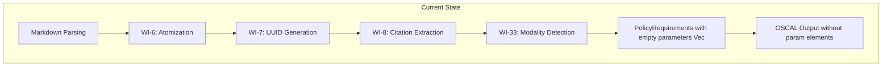
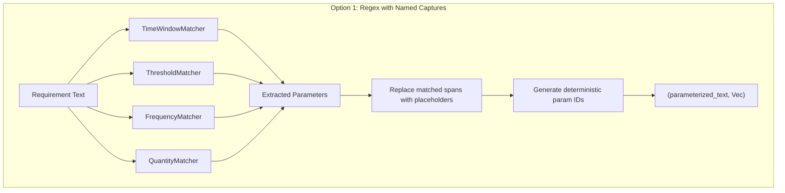
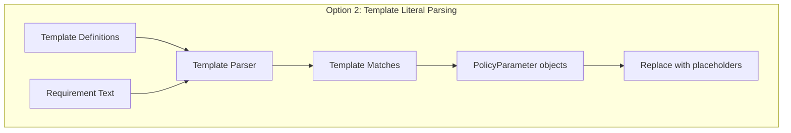
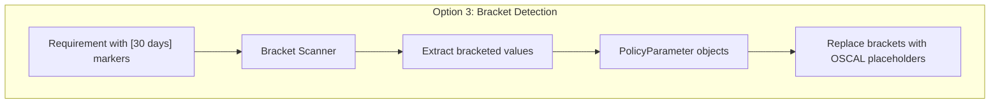
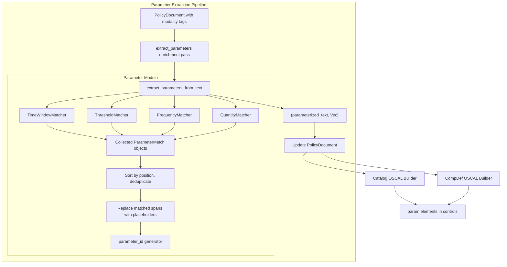
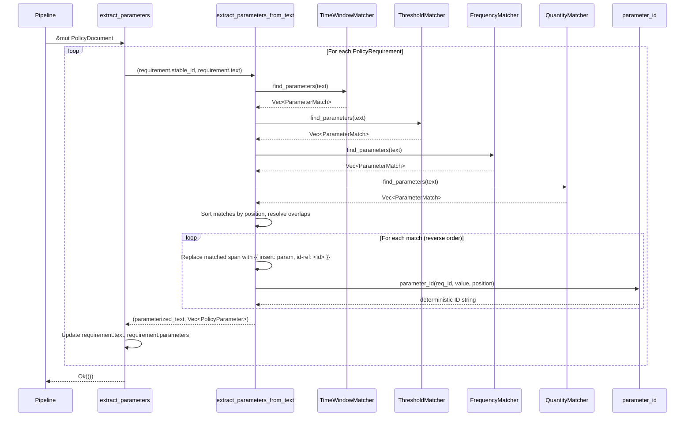
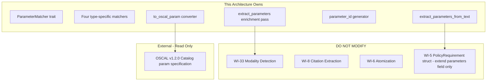

# 034-ar-parameter-extraction

> **Document Type:** Architecture Review
> **Audience:** LLM agents, human reviewers
> **Status:** Proposed
> **Last Updated:** 2026-02-10 <!-- @auto -->
> **Owner:** Brian Luby <!-- @human-required -->
> **Deciders:** Brian Luby <!-- @human-required -->

---

## Review Tier Legend

| Marker | Tier | Speckit Behavior |
|--------|------|------------------|
| 🔴 `@human-required` | Human Generated | Prompt human to author; blocks until complete |
| 🟡 `@human-review` | LLM + Human Review | LLM drafts → prompt human to confirm/edit; blocks until confirmed |
| 🟢 `@llm-autonomous` | LLM Autonomous | LLM completes; no prompt; logged for audit |
| ⚪ `@auto` | Auto-generated | System fills (timestamps, links); no prompt |

---

## Document Completion Order

> ⚠️ **For LLM Agents:** Complete sections in this order. Do not fill downstream sections until upstream human-required inputs exist.

1. **Summary (Decision)** → requires human input first
2. **Context (Problem Space)** → requires human input
3. **Decision Drivers** → requires human input (prioritized)
4. **Driving Requirements** → extract from PRD, human confirms
5. **Options Considered** → LLM drafts after drivers exist, human reviews
6. **Decision (Selected + Rationale)** → requires human decision
7. **Implementation Guardrails** → LLM drafts, human reviews
8. **Everything else** → can proceed after decision is made

---

## Linkage ⚪ `@auto`

| Document | ID | Relationship |
|----------|-----|--------------|
| Parent PRD | [034-prd-parameter-extraction](../PRD/034-prd-parameter-extraction.md) | Requirements this architecture satisfies |
| Security Review | N/A | Regex on already-parsed text; no new attack surface |
| Supersedes | — | N/A |
| Superseded By | — | |

---

## Summary

### Decision 🔴 `@human-required`
> Implement parameter extraction as a pipeline enrichment pass using regex patterns with named capture groups, organized into type-specific matchers (time window, threshold, frequency, quantity) that share a common extraction interface. Each matcher returns `PolicyParameter` objects with deterministic content-based IDs, and the enrichment function replaces matched text with OSCAL parameter insertion placeholders.

### TL;DR for Agents 🟡 `@human-review`
> WI-34 extracts parameterizable values from policy requirement text using four regex-based matchers: time windows ("within 30 days"), thresholds ("at least 128-bit"), frequencies ("annually"), and quantities ("no fewer than 3"). Implement as a `parameter` module with `extract_parameters` enrichment function and `extract_parameters_from_text` lower-level function. Use `regex` crate with named capture groups. Replace extracted values with `{{ insert: param, id-ref: <param-id> }}` placeholders. Generate deterministic parameter IDs from requirement stable_id + position only (value is intentionally excluded per S-3 — IDs must remain stable if values are corrected post-extraction). Do NOT use NLP/ML. Do NOT extract numeric values without contextual qualifier words. Do NOT extract section references or standard numbers.

---

## Context

### Problem Space 🔴 `@human-required`
Policy documents embed configurable values inline within requirement prose: time windows ("within 30 days"), thresholds ("at least 128-bit"), frequencies ("at least annually"), and quantities ("no fewer than 3"). These values represent policy parameters that should be tailorable per deployment context. When embedded in prose, they are invisible to tooling, cannot be queried programmatically, and resist automated compliance checking. OSCAL provides a `param` element to represent these as first-class configurable values. The architectural challenge is designing a parameter extraction pipeline that correctly identifies these patterns without false positives (section references, standard numbers), replaces them with OSCAL insertion placeholders, and produces deterministic output.

### Decision Scope 🟡 `@human-review`

**This AR decides:**
- The pattern matching strategy for parameter detection (regex with named captures vs template parsing vs bracket detection)
- How matchers are organized and composed (per-type matchers vs monolithic regex)
- How extracted values are replaced with OSCAL parameter insertion placeholders
- How parameter IDs are deterministically generated
- How constraint types (minimum, maximum, exact) are inferred from qualifier words
- How parameter extraction integrates into the pipeline as an enrichment pass

**This AR does NOT decide:**
- Profile parameter tailoring via `--set-param` — already decided in WI-31
- Normative/advisory detection — handled by WI-33
- Parameter validation against external schemas or databases — out of scope
- ML/NLP-based parameter detection — explicitly deferred per PRD W-1
- Value normalization to ISO 8601 or other standard formats — deferred per PRD W-4

### Current State 🟢 `@llm-autonomous`
The pipeline processes `PolicyRequirement` structs through atomization (WI-6), UUID generation (WI-7), citation extraction (WI-8), and modality detection (WI-33). Requirements have `text`, `stable_id`, `modality`, `source_line`, and `citations` fields. The `parameters` field exists on `PolicyRequirement` (from WI-5) but is always empty. OSCAL output includes controls but no `param` elements.



### Driving Requirements 🟡 `@human-review`

| PRD Req ID | Requirement Summary | Architectural Implication |
|------------|---------------------|---------------------------|
| M-1 | Detect time window parameters (within N days/weeks/months/years) | Time-window-specific regex matcher |
| M-2 | Detect threshold parameters (at least N, minimum N, no more than N) | Threshold-specific regex matcher with qualifier inference |
| M-3 | Detect frequency parameters (annually, quarterly, monthly) | Frequency-specific regex matcher |
| M-4 | PolicyParameter includes id, label, value, parameter_type, constraint | PolicyParameter struct design |
| M-5 | Generate OSCAL `param` elements with id, label, value, constraint | OSCAL param builder |
| M-6 | Link parameters to parent PolicyRequirement via requirement_id | Relational linkage design |
| M-7 | Replace extracted values with OSCAL insertion placeholders | Text replacement with placeholder generation |
| M-8 | Pipeline enrichment function on PolicyDocument | Enrichment pass design |

**PRD Constraints inherited:**
- From constitution: Rust latest stable, `regex` crate, TDD mandatory, deterministic output (P-3)
- From PRD: No NLP/ML, no value normalization, linear-time O(n) performance

---

## Decision Drivers 🔴 `@human-required`

1. **Extraction accuracy:** Must correctly identify parameter patterns without false positives on section references or standard numbers *(traces to PRD M-1, M-2, M-3, EC-2)*
2. **Determinism:** Same input must always produce the same parameters with the same IDs *(traces to constitution principle P-3, PRD S-3)*
3. **OSCAL compliance:** Generated `param` elements must conform to OSCAL v1.2.0 specification *(traces to PRD M-5)*
4. **Idempotence:** Running extraction twice must produce the same result *(traces to PRD S-4)*
5. **Extensibility:** Adding new parameter types must not require refactoring the extraction pipeline *(traces to future phases)*

---

## Options Considered 🟡 `@human-review`

### Option 0: Status Quo / Do Nothing

**Description:** Leave configurable values embedded in prose. No parameter extraction, no OSCAL `param` elements.

| Driver | Rating | Notes |
|--------|--------|-------|
| Extraction accuracy | N/A | No extraction |
| Determinism | ✅ Good | Nothing to be non-deterministic |
| OSCAL compliance | ❌ Poor | No param elements in output |
| Idempotence | ✅ Good | No operation to repeat |
| Extensibility | ❌ Poor | No foundation for parameter support |

**Why not viable:** Parent PRD S-8 requires parameter extraction. WI-35 (Phase 2 release) depends on parameter extraction being complete.

---

### Option 1: Regex with Named Capture Groups (Recommended)

**Description:** Define type-specific regex matchers using named capture groups for each parameter category (time window, threshold, frequency, quantity). Each matcher implements a common `ParameterMatcher` trait, returning zero or more `PolicyParameter` objects from a given text. The matchers are composed into an extraction pipeline that processes each requirement's text, collects parameters, replaces matched spans with OSCAL insertion placeholders, and assigns deterministic IDs.



| Driver | Rating | Notes |
|--------|--------|-------|
| Extraction accuracy | ✅ Good | Named captures with contextual qualifiers prevent false positives |
| Determinism | ✅ Good | Regex matching is deterministic; ID generation is content-based |
| OSCAL compliance | ✅ Good | Type-specific matchers map directly to OSCAL param structure |
| Idempotence | ✅ Good | Insertion placeholders are not re-matched by parameter regexes |
| Extensibility | ✅ Good | Add a new matcher implementing the trait; compose into pipeline |

**Pros:**
- Named capture groups provide clear, readable extraction: `(?P<value>\d+)\s+(?P<unit>days?|weeks?|months?|years?)`
- Type-specific matchers keep each pattern focused and independently testable
- Common trait (`ParameterMatcher`) enables uniform composition and easy addition of new types
- Contextual qualifier words (e.g., "within", "at least", "minimum") prevent extraction of bare numbers
- `regex` crate already in dependency tree; `once_cell::sync::Lazy` for caching
- Span-based replacement preserves surrounding punctuation and whitespace

**Cons:**
- Multiple regex patterns to maintain (one per parameter type)
- Complex patterns may be harder to read than template-based approaches
- Requires careful ordering when multiple matchers overlap on the same text span

---

### Option 2: Template Literal Parsing

**Description:** Define extraction templates as structured patterns (not regex) using a simple DSL: `"within {value:number} {unit:duration_unit}"`. A template parser matches these patterns against requirement text and extracts named fields. Templates are more readable than regex and can be defined in configuration.



| Driver | Rating | Notes |
|--------|--------|-------|
| Extraction accuracy | ⚠️ Medium | Templates less expressive than regex; harder to handle variations |
| Determinism | ✅ Good | Template matching is deterministic |
| OSCAL compliance | ✅ Good | Templates can map to OSCAL param structure |
| Idempotence | ✅ Good | Templates would not match insertion placeholders |
| Extensibility | ✅ Good | Add new templates to configuration |

**Pros:**
- More readable than regex patterns
- Configuration-driven: templates could be defined in a TOML/YAML file
- Clear mapping from template fields to PolicyParameter fields

**Cons:**
- Requires building a template parser — significant new code
- Less expressive than regex for handling variations (e.g., "at least" vs "no fewer than" vs "a minimum of")
- Not a standard Rust ecosystem pattern — custom DSL adds maintenance burden
- Over-engineering for the current scope per constitution principle X

---

### Option 3: Bracket/Placeholder Detection

**Description:** Instead of detecting parameters in natural prose, require policy authors to pre-mark parameters with brackets or delimiters in the source document (e.g., `[30 days]` or `${30 days}`). Extraction simply finds these delimited regions and converts them to OSCAL params.



| Driver | Rating | Notes |
|--------|--------|-------|
| Extraction accuracy | ✅ Good | No ambiguity — parameters are explicitly marked |
| Determinism | ✅ Good | Bracket scanning is deterministic |
| OSCAL compliance | ✅ Good | Extracted values map to param elements |
| Idempotence | ✅ Good | OSCAL placeholders use different syntax than brackets |
| Extensibility | ⚠️ Medium | Limited to what authors pre-mark |

**Pros:**
- Zero false positives — parameters are explicitly marked by the author
- Trivially simple extraction logic
- No regex complexity

**Cons:**
- Requires policy documents to be pre-annotated with brackets — this burden on authors defeats the purpose of automated extraction
- Existing policy documents (the primary use case) do not have bracket annotations
- Violates the parent PRD intent: S-8 requires extracting parameters from natural prose, not pre-annotated text
- Cannot be applied retroactively to existing policies without manual annotation

---

## Decision

### Selected Option 🔴 `@human-required`
> **Option 1: Regex with Named Capture Groups**

### Rationale 🔴 `@human-required`
Option 1 provides the best balance of extraction accuracy, extensibility, and practical feasibility. Named capture groups make regex patterns readable and maintainable. Type-specific matchers with a common trait enable independent testing and easy addition of new parameter types. Contextual qualifier words prevent the false positives that would plague a more naive approach. Option 2 (template parsing) requires building a custom DSL parser — over-engineering per principle X. Option 3 (bracket detection) requires pre-annotated documents, which defeats the automation purpose of WI-34. The `regex` crate is already in the dependency tree, and the pattern-per-type approach aligns with how parameter types naturally decompose.

#### Simplest Implementation Comparison 🟡 `@human-review`

| Aspect | Simplest Possible | Selected Option | Justification for Complexity |
|--------|-------------------|-----------------|------------------------------|
| Components | Single regex for all parameter types | Per-type matchers with common trait | Different parameter types have fundamentally different patterns; single regex would be unmaintainable |
| Dependencies | regex (already present) | regex + once_cell (already present) | Cached compilation for performance with many requirements |
| Patterns | Flat extraction function | ParameterMatcher trait with type-specific implementations | PRD M-1/M-2/M-3 require type-specific extraction; trait enables independent testing |

**Complexity justified by:** Parameter types (time windows, thresholds, frequencies, quantities) have fundamentally different regex patterns and constraint inference logic. A single monolithic regex would be unmaintainable. The trait-based approach adds minimal code while keeping each matcher focused and testable.

### Architecture Diagram 🟡 `@human-review`



---

## Technical Specification

### Component Overview 🟡 `@human-review`

| Component | Responsibility | Interface | Dependencies |
|-----------|---------------|-----------|--------------|
| ParameterMatcher trait | Common interface for type-specific matchers | `fn find_parameters(&self, text: &str) -> Vec<ParameterMatch>` | None |
| TimeWindowMatcher | Detect time window patterns | Implements ParameterMatcher | regex, once_cell |
| ThresholdMatcher | Detect threshold patterns | Implements ParameterMatcher | regex, once_cell |
| FrequencyMatcher | Detect frequency patterns | Implements ParameterMatcher | regex, once_cell |
| QuantityMatcher | Detect quantity patterns | Implements ParameterMatcher | regex, once_cell |
| extract_parameters_from_text | Orchestrate matchers, replace spans, assign IDs | `fn(&str, &str) -> Result<(String, Vec<PolicyParameter>), ForgeError>` | All matchers |
| extract_parameters | Document-level enrichment pass | `fn(&mut PolicyDocument) -> Result<(), ForgeError>` | extract_parameters_from_text |
| parameter_id | Generate deterministic parameter ID | `fn(&str, usize) -> String` | None |
| to_oscal_param | Convert PolicyParameter to OSCAL param element | `fn(&PolicyParameter) -> OscalParam` | serde_json |

### Data Flow 🟢 `@llm-autonomous`



### Interface Definitions 🟡 `@human-review`

```rust
use std::sync::LazyLock;
use regex::Regex;

/// Intermediate match result from a parameter matcher
#[derive(Debug)]
struct ParameterMatch {
    /// Start byte offset in the source text
    pub start: usize,
    /// End byte offset in the source text
    pub end: usize,
    /// The matched text span (for replacement)
    pub matched_text: String,
    /// The extracted parameter value (e.g., "30 days", "128-bit")
    pub value: String,
    /// The parameter type
    pub parameter_type: ParameterType,
    /// Human-readable label (e.g., "password change time window")
    pub label: String,
    /// Inferred constraint, if any
    pub constraint: Option<ParameterConstraint>,
}

/// Trait for type-specific parameter matchers
trait ParameterMatcher {
    /// Find all parameter matches in the given text
    fn find_parameters(&self, text: &str) -> Vec<ParameterMatch>;
}

/// Time window matcher: "within N days", "after N weeks", "every N months"
struct TimeWindowMatcher;

static TIME_WINDOW_PATTERN: LazyLock<Regex> = LazyLock::new(|| {
    Regex::new(
        r"(?i)(?P<qualifier>within|after|every)\s+(?P<value>\d+)\s+(?P<unit>days?|weeks?|months?|years?)"
    ).unwrap()
});

/// Threshold matcher: "at least N", "minimum N", "no more than N"
struct ThresholdMatcher;

static THRESHOLD_MIN_PATTERN: LazyLock<Regex> = LazyLock::new(|| {
    Regex::new(
        r"(?i)(?P<qualifier>at\s+least|minimum|no\s+fewer\s+than|no\s+less\s+than)\s+(?P<value>\d+[\w-]*)"
    ).unwrap()
});

static THRESHOLD_MAX_PATTERN: LazyLock<Regex> = LazyLock::new(|| {
    Regex::new(
        r"(?i)(?P<qualifier>no\s+more\s+than|maximum|at\s+most)\s+(?P<value>\d+[\w-]*)"
    ).unwrap()
});

/// Frequency matcher: "annually", "quarterly", "monthly", etc.
struct FrequencyMatcher;

static FREQUENCY_PATTERN: LazyLock<Regex> = LazyLock::new(|| {
    Regex::new(
        r"(?i)(?:at\s+least\s+)?(?P<value>annually|quarterly|monthly|weekly|daily|biannually|semi-annually)"
    ).unwrap()
});

/// Quantity matcher: "no fewer than 3 factors", "at least 2 generations"
struct QuantityMatcher;

static QUANTITY_PATTERN: LazyLock<Regex> = LazyLock::new(|| {
    Regex::new(
        r"(?i)(?P<qualifier>at\s+least|no\s+fewer\s+than|minimum)\s+(?P<value>\d+)\s+(?P<unit>\w+)"
    ).unwrap()
});

/// Lower-level extraction from a single requirement's text
pub fn extract_parameters_from_text(
    requirement_id: &str,
    text: &str,
) -> Result<(String, Vec<PolicyParameter>), ForgeError> {
    // 1. Run all matchers against text
    // 2. Collect ParameterMatch objects
    // 3. Sort by start position
    // 4. Resolve overlapping matches (first match wins)
    // 5. Replace spans in reverse order with insertion placeholders
    // 6. Generate deterministic IDs
    // 7. Return (parameterized_text, parameters)
    todo!()
}

/// Document-level enrichment pass
pub fn extract_parameters(
    document: &mut PolicyDocument,
) -> Result<(), ForgeError> {
    // For each requirement with a stable_id:
    //   (text, params) = extract_parameters_from_text(stable_id, text)
    //   requirement.text = text
    //   requirement.parameters = params
    todo!()
}

/// Generate deterministic parameter ID.
/// ID is derived from the parent requirement's stable_id and the parameter's
/// zero-based position within that requirement. The value is intentionally
/// excluded so that IDs remain stable if a value is corrected post-extraction.
pub fn parameter_id(
    requirement_id: &str,
    position: usize,
) -> String {
    // Format: "{requirement_id}_prm_{position}"
    // Example: "POL-AC-001_prm_0", "POL-AC-001_prm_1"
    format!("{}_prm_{}", requirement_id, position)
}

/// Convert PolicyParameter to OSCAL param element
pub fn to_oscal_param(parameter: &PolicyParameter) -> serde_json::Value {
    // { "id": "POL-AC-001_prm_0", "label": "...", "values": ["30 days"],
    //   "constraints": [{"description": "minimum duration"}] }
    todo!()
}
```

### Key Algorithms/Patterns 🟡 `@human-review`

**Pattern:** Multi-Matcher Extraction with Span-Based Replacement

> **Matcher execution order and overlap design**: QuantityMatcher and ThresholdMatcher both match patterns of the form "no fewer than N" / "at least N". For inputs that include a unit noun (e.g., "no fewer than 3 authentication factors"), QuantityMatcher produces a longer match (includes the unit word) than ThresholdMatcher (stops at the digit). The "same start position → longer match wins" rule therefore correctly classifies these as `Quantity` type. For bare numeric thresholds without a unit noun (e.g., "no fewer than 3"), only ThresholdMatcher fires. This design is intentional — no explicit matcher ordering is required; the overlap resolution rule alone produces correct classification.

```
1. Run all four matchers against requirement text → Vec<ParameterMatch>
2. Sort matches by start position (ascending)
3. Resolve overlapping matches:
   - If two matches overlap, keep the one that starts first
   - If they start at the same position, keep the longer match
     (e.g., QuantityMatcher "no fewer than 3 factors" wins over
      ThresholdMatcher "no fewer than 3" for the same start offset)
4. Process matches in REVERSE order (to preserve byte offsets):
   a. Generate deterministic parameter ID
   b. Build PolicyParameter from ParameterMatch
   c. Replace matched span in text with {{ insert: param, id-ref: <param-id> }}
5. Return parameterized text and collected parameters
```

**Pattern:** Constraint Inference from Qualifier Words
```
Qualifier → ConstraintType mapping:
  "within"         → Minimum (duration bound)
  "after"          → Minimum (duration bound)
  "every"          → Exact (recurring interval)
  "at least"       → Minimum
  "minimum"        → Minimum
  "no fewer than"  → Minimum
  "no less than"   → Minimum
  "no more than"   → Maximum
  "maximum"        → Maximum
  "at most"        → Maximum
  (no qualifier)   → Exact
```

**Pattern:** False Positive Avoidance
```
Exclusion rules to avoid extracting non-parameters:
  - Section references: "Section 3.2", "paragraph 4.1" → skip (no qualifier word)
  - Standard references: "NIST SP 800-53", "ISO 27001" → skip (no qualifier word, alphanumeric patterns)
  - Bare numbers without context: "3" alone → skip (require qualifier word or unit)
```

---

## Constraints & Boundaries

### Technical Constraints 🟡 `@human-review`

**Inherited from PRD:**
- Rust latest stable, `regex` crate for pattern matching
- Deterministic output: same input always produces same parameters and IDs (P-3)
- No NLP/ML (PRD W-1)
- No value normalization to ISO 8601 (PRD W-4)
- Linear time O(n) performance in number of requirements
- TDD mandatory

**Added by this Architecture:**
- Named capture groups for readable, maintainable regex patterns
- `once_cell::sync::Lazy` for one-time regex compilation (four+ patterns)
- `ParameterMatcher` trait for uniform matcher interface
- Span-based replacement in reverse order to preserve byte offsets
- Overlap resolution: first match (by position) wins; ties broken by longer match
- Parameter IDs: `{requirement_id}_prm_{position}` format
- Extraction is a pure enrichment pass: reads text, extracts parameters, updates text and parameters field
- OSCAL insertion placeholder format: `{{ insert: param, id-ref: <param-id> }}`

### Architectural Boundaries 🟡 `@human-review`



- **Owns:** `ParameterMatcher` trait, all matchers, extraction functions, ID generator, OSCAL param converter
- **Interfaces With:** WI-5 domain model (populates `parameters` field on `PolicyRequirement`), WI-9/WI-14 OSCAL builders (emit `param` elements in controls)
- **Must Not Touch:** Modality detection (WI-33), citation extraction (WI-8), atomization (WI-6), Profile generation (WI-30/WI-31)

### Implementation Guardrails 🟡 `@human-review`

> ⚠️ **Critical for LLM Agents:**

- [x] **DO NOT** extract bare numbers without contextual qualifier words — "3" alone is not a parameter *(PRD EC-2)*
- [x] **DO NOT** extract section references ("Section 3.2") or standard numbers ("NIST SP 800-53") *(PRD EC-2)*
- [x] **DO NOT** use NLP or ML for parameter detection — regex/heuristic only *(PRD W-1)*
- [x] **DO NOT** normalize values to ISO 8601 or other standard formats *(PRD W-4)*
- [x] **DO NOT** modify requirements that contain no parameterized values *(PRD EC-1)*
- [x] **MUST** use contextual qualifier words to trigger extraction ("within", "at least", "minimum", etc.) *(PRD M-1, M-2)*
- [x] **MUST** generate deterministic parameter IDs from requirement ID + position *(PRD S-3)*
- [x] **MUST** ensure idempotence — running extraction twice produces the same result *(PRD S-4)*
- [x] **MUST** replace matched spans in reverse order to preserve byte offsets *(implementation correctness)*
- [x] **MUST** use OSCAL insertion placeholder format: `{{ insert: param, id-ref: <param-id> }}` *(PRD M-7)*

---

## Consequences 🟡 `@human-review`

### Positive
- Policy parameters are extracted from prose and represented as OSCAL `param` elements
- Parameterized prose enables downstream Profile tailoring (WI-31) to substitute values
- Type-specific matchers are independently testable and maintainable
- Deterministic IDs ensure reproducible output across runs
- Contextual qualifier words prevent false positive extraction of bare numbers

### Negative
- Regex patterns may miss uncommon phrasings ("not to exceed 72 hours", "a period of no less than one year")
- Multiple regex patterns to maintain — one per parameter type
- Insertion placeholders alter the readability of requirement text in the domain model

### Risks & Mitigations

| Risk | Likelihood | Impact | Mitigation |
|------|------------|--------|------------|
| Heuristic patterns miss uncommon parameter phrasings | Med | Med | Start with common patterns from PRD; expand iteratively based on real-world documents |
| False positive extraction of non-parameter values | Med | Med | Require qualifier words; exclude known non-parameter patterns; unit test with negative fixtures |
| Overlapping matches from different matchers | Low | Med | Position-based sorting and first-match-wins resolution; comprehensive overlap tests |
| Insertion placeholders break prose readability | Low | Low | Placeholders include param-id for reference; downstream rendering resolves them |

---

## Implementation Guidance

### Suggested Implementation Order 🟢 `@llm-autonomous`
1. Define `ParameterMatch` struct and `ParameterMatcher` trait
2. Implement `TimeWindowMatcher` with unit tests (highest-frequency parameter type)
3. Implement `ThresholdMatcher` with unit tests (min/max qualifier inference)
4. Implement `FrequencyMatcher` with unit tests (standalone frequency words)
5. Implement `QuantityMatcher` with unit tests
6. Implement `extract_parameters_from_text` with multi-matcher orchestration and span replacement
7. Implement `parameter_id` deterministic ID generator
8. Implement `extract_parameters` document-level enrichment pass
9. Implement `to_oscal_param` OSCAL param element converter
10. Write integration tests with OSCAL output verification
11. Verify idempotence: extract twice, assert identical results

### Testing Strategy 🟢 `@llm-autonomous`

| Layer | Test Type | Coverage Target | Notes |
|-------|-----------|-----------------|-------|
| Unit | TimeWindowMatcher | 95% | "within 30 days", "after 6 months", "every 2 years" |
| Unit | ThresholdMatcher | 95% | "at least 128-bit", "minimum 12", "no more than 15 minutes" |
| Unit | FrequencyMatcher | 95% | "annually", "quarterly", "at least monthly" |
| Unit | QuantityMatcher | 90% | "no fewer than 3", "at least 2 generations" |
| Unit | extract_parameters_from_text | 90% | Multi-parameter, no-parameter, overlap cases |
| Unit | parameter_id | 100% | Determinism, uniqueness |
| Integration | OSCAL output with params | Key paths | param elements in Catalog controls |
| Negative | False positive prevention | 100% | Section refs, standard numbers, bare numbers |
| Idempotence | Double extraction | 100% | Same result on second pass |

### Reference Implementations 🟡 `@human-review`
- OSCAL `param` element: https://pages.nist.gov/OSCAL-Reference/models/latest/catalog/json-reference/#/catalog/groups/controls/params *(external)*
- OSCAL parameter insertion: `{{ insert: param, id-ref: param-id }}` *(OSCAL markup convention)*

### Anti-patterns to Avoid 🟡 `@human-review`
- **Don't:** Extract numeric values without contextual cues
  - **Why:** Bare numbers like "3" or "12" are not parameters; "Section 3.2" is not a parameter
  - **Instead:** Require qualifier words ("within", "at least", "minimum") to trigger extraction
- **Don't:** Use a single monolithic regex for all parameter types
  - **Why:** Unmaintainable; different types have fundamentally different patterns
  - **Instead:** Type-specific matchers with a common trait
- **Don't:** Replace spans in forward order
  - **Why:** Replacing earlier spans shifts byte offsets for later spans
  - **Instead:** Process replacements in reverse order (highest position first)
- **Don't:** Generate random or timestamp-based parameter IDs
  - **Why:** Violates determinism requirement (P-3, PRD S-3)
  - **Instead:** Content-based deterministic IDs from requirement_id + position

---

## Compliance & Cross-cutting Concerns

### Security Considerations 🟡 `@human-review`
- Authentication: N/A — local CLI tool
- Authorization: N/A
- Data handling: Extracted parameter values (key lengths, timeout durations) may reveal security posture; avoid logging at production log levels
- ReDoS: Regex patterns must be tested with adversarial input; use bounded quantifiers; avoid nested repetition

### Observability 🟢 `@llm-autonomous`
- **Logging:** Log parameter extraction count per document at INFO level; log individual extractions at DEBUG level
- **Metrics:** N/A for CLI tool
- **Tracing:** Log matched patterns and constraint inferences at TRACE level

### Error Handling Strategy 🟢 `@llm-autonomous`
```
Error Category → Handling Approach
├── No parameters detected in requirement → Preserve text as-is, empty parameters Vec
├── Regex compilation failure → Panic at startup (static patterns should never fail)
├── Overlapping matches → First-match-wins resolution (logged at DEBUG)
├── Empty requirement text → Preserve as-is, no extraction attempt
├── Empty stable_id → Skip extraction for this requirement (cannot generate param ID)
└── Serialization error (to_oscal_param) → Propagate via ForgeError::Serialization
```

---

## Migration Plan (if applicable) 🟡 `@human-review`

N/A — This is a new enrichment pass added to the pipeline. The `PolicyRequirement.parameters` field exists from WI-5 but is currently always empty. This WI populates it.

### Rollback Plan 🔴 `@human-required`

N/A — Additive feature. If parameter extraction proves problematic, the enrichment pass can be skipped (parameters field stays empty) and OSCAL output omits `param` elements without affecting other pipeline functionality.

---

## Open Questions 🟡 `@human-review`

No open questions for this work item.

---

## Changelog ⚪ `@auto`

| Version | Date | Author | Changes |
|---------|------|--------|---------|
| 0.1 | 2026-02-10 | LLM (Claude) | Initial proposal |

---

## Decision Record ⚪ `@auto`

| Date | Event | Details |
|------|-------|---------|
| 2026-02-10 | Proposed | Initial draft created from PRD 034 |

---

## Traceability Matrix 🟢 `@llm-autonomous`

| PRD Req ID | Decision Driver | Option Rating | Component | Notes |
|------------|-----------------|---------------|-----------|-------|
| M-1 | Extraction accuracy | Option 1: ✅ | TimeWindowMatcher | "within N days", "after N weeks", "every N months" |
| M-2 | Extraction accuracy | Option 1: ✅ | ThresholdMatcher | "at least N", "minimum N", "no more than N" |
| M-3 | Extraction accuracy | Option 1: ✅ | FrequencyMatcher | "annually", "quarterly", "monthly" |
| M-4 | OSCAL compliance | Option 1: ✅ | PolicyParameter struct | id, label, value, parameter_type, constraint |
| M-5 | OSCAL compliance | Option 1: ✅ | to_oscal_param | OSCAL param with id, label, values, constraints |
| M-6 | OSCAL compliance | Option 1: ✅ | PolicyParameter.requirement_id | Links parameter to source requirement |
| M-7 | Idempotence | Option 1: ✅ | extract_parameters_from_text | Span replacement with insertion placeholders |
| M-8 | Extensibility | Option 1: ✅ | extract_parameters | Document-level enrichment pass |
| S-1 | Extraction accuracy | Option 1: ✅ | QuantityMatcher | "no fewer than 3", "at least 2 generations" |
| S-2 | Extraction accuracy | Option 1: ✅ | Constraint inference | Qualifier words map to constraint types |
| S-3 | Determinism | Option 1: ✅ | parameter_id | Content-based deterministic IDs |
| S-4 | Idempotence | Option 1: ✅ | extract_parameters | Insertion placeholders not re-matched |

---

## Review Checklist 🟢 `@llm-autonomous`

Before marking as Accepted:
- [x] All PRD Must Have requirements appear in Driving Requirements
- [x] Option 0 (Status Quo) is documented
- [x] Simplest Implementation comparison is completed
- [x] Decision drivers are prioritized and addressed
- [x] At least 2 options were seriously considered
- [x] Constraints distinguish inherited vs. new
- [x] Component names are consistent across all diagrams and tables
- [x] Implementation guardrails reference specific PRD constraints
- [x] Rollback triggers and authority are defined (N/A — additive feature)
- [x] Security review is linked or N/A documented
- [x] No open questions blocking implementation
