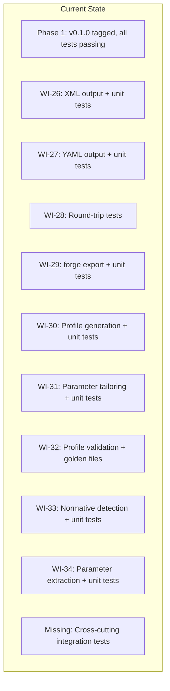
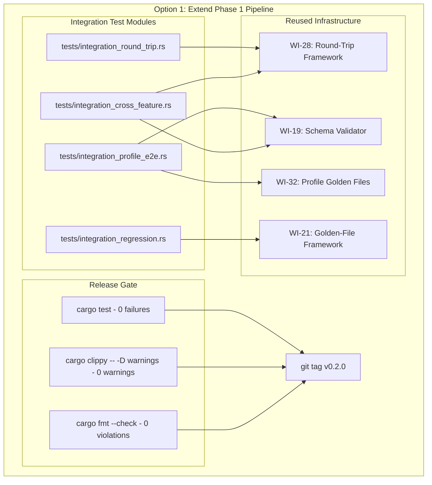
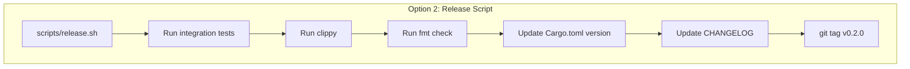
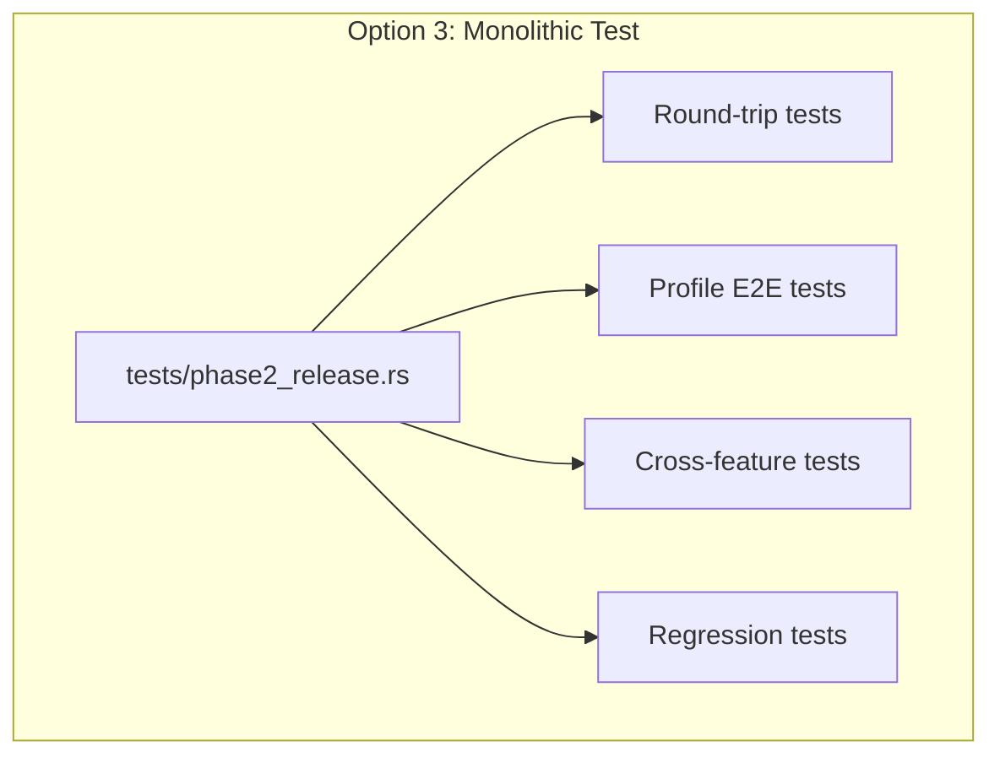
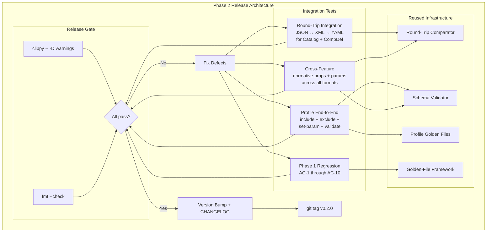
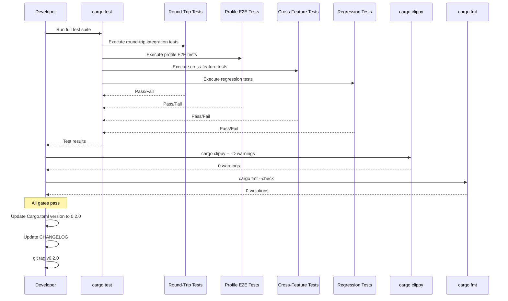
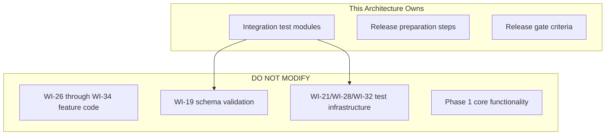

# 035-ar-phase2-release

> **Document Type:** Architecture Review
> **Audience:** LLM agents, human reviewers
> **Status:** Implemented
> **Last Updated:** 2026-02-10 <!-- @auto -->
> **Owner:** Brian Luby <!-- @human-required -->
> **Deciders:** Brian Luby <!-- @human-required -->

---

## Review Tier Legend

| Marker | Tier | Speckit Behavior |
|--------|------|------------------|
| 🔴 `@human-required` | Human Generated | Prompt human to author; blocks until complete |
| 🟡 `@human-review` | LLM + Human Review | LLM drafts → prompt human to confirm/edit; blocks until confirmed |
| 🟢 `@llm-autonomous` | LLM Autonomous | LLM completes; no prompt; logged for audit |
| ⚪ `@auto` | Auto-generated | System fills (timestamps, links); no prompt |

---

## Document Completion Order

> ⚠️ **For LLM Agents:** Complete sections in this order. Do not fill downstream sections until upstream human-required inputs exist.

1. **Summary (Decision)** → requires human input first
2. **Context (Problem Space)** → requires human input
3. **Decision Drivers** → requires human input (prioritized)
4. **Driving Requirements** → extract from PRD, human confirms
5. **Options Considered** → LLM drafts after drivers exist, human reviews
6. **Decision (Selected + Rationale)** → requires human decision
7. **Implementation Guardrails** → LLM drafts, human reviews
8. **Everything else** → can proceed after decision is made

---

## Linkage ⚪ `@auto`

| Document | ID | Relationship |
|----------|-----|--------------|
| Parent PRD | [035-prd-phase2-release](../PRD/035-prd-phase2-release.md) | Requirements this architecture satisfies |
| Security Review | N/A | Integration testing and release — no new attack surface |
| Supersedes | — | N/A |
| Superseded By | — | |

---

## Summary

### Decision 🔴 `@human-required`
> Extend the Phase 1 release pipeline (WI-25 pattern) with additional integration test modules covering cross-feature verification of all Phase 2 work items (WI-26 through WI-34), using the existing `cargo test` framework, golden-file infrastructure from WI-21/WI-22/WI-32, and schema validation from WI-19. Tag `v0.2.0` only after all quality gates pass.

### TL;DR for Agents 🟡 `@human-review`
> WI-35 is a pure integration testing and release sprint. Add integration test modules in `tests/` that exercise cross-cutting scenarios: multi-format round-trip (JSON/XML/YAML), Profile end-to-end (include/exclude/set-param + validate), normative/advisory prop preservation across formats, parameter extraction across formats, and Phase 1 regression. Do NOT write new features. Do NOT skip any quality gates. Update `Cargo.toml` version to `0.2.0` and CHANGELOG before tagging. Tag `v0.2.0` only when `cargo test`, `cargo clippy -- -D warnings`, and `cargo fmt --check` all pass with zero issues.

---

## Context

### Problem Space 🔴 `@human-required`
Phase 2 delivered 10 work items (WI-26 through WI-34) across two themes (T-4: Output Format Expansion, T-5: Profile & Tailoring), each developed and unit-tested independently. While individual sprints verified their own features, no cross-cutting integration testing has confirmed that all Phase 2 capabilities work together correctly. Multi-format output must round-trip with semantic equivalence. Profile generation must work end-to-end with tailoring, parameter setting, and schema validation. Normative/advisory tagging and parameter extraction must appear correctly in all output formats and survive format round-trips. The architectural challenge is how to organize cross-cutting integration tests efficiently using existing test infrastructure, and how to define the release gate criteria.

### Decision Scope 🟡 `@human-review`

**This AR decides:**
- How cross-cutting integration tests are organized and structured
- How existing test infrastructure (WI-19, WI-21, WI-28, WI-32) is composed for integration verification
- What the release gate criteria are (quality gates that must pass before tagging)
- How the release is prepared (version bump, CHANGELOG, tag)

**This AR does NOT decide:**
- New features — all features complete in WI-26 through WI-34
- PDF/DOCX ingestion — excluded per ADR-001
- oscal-cli integration — deferred to WI-36 (Phase 3)
- Could Have features — deferred to Phase 3
- Performance optimization — already addressed in WI-24

### Current State 🟢 `@llm-autonomous`
Each Phase 2 work item has its own unit test suite. WI-28 provides round-trip test infrastructure. WI-32 provides Profile golden-file tests. WI-19 provides schema validation. The project is at v0.1.0 with Phase 1 tests passing. Phase 2 features are implemented but not cross-validated.



### Driving Requirements 🟡 `@human-review`

| PRD Req ID | Requirement Summary | Architectural Implication |
|------------|---------------------|---------------------------|
| M-1 | Multi-format round-trip tests pass (JSON/XML/YAML) | Integration test for format conversion equivalence |
| M-2 | End-to-end profile with --include produces valid OSCAL | Integration test for profile generation path |
| M-3 | End-to-end profile with --set-param produces modify section | Integration test for parameter tailoring path |
| M-4 | Generated Profiles pass schema validation | Integration with WI-19 validator |
| M-5 | Normative/advisory props and params survive round-trips | Cross-feature integration test |
| M-6 | All Phase 1 tests pass (zero regressions) | Regression test suite |
| M-7 | v0.2.0 tag on commit where cargo test + clippy + fmt pass | Release gate criteria |
| M-8 | forge --version reports 0.2.0 | Version bump in Cargo.toml |

**PRD Constraints inherited:**
- From constitution: Rust latest stable, TDD mandatory, `cargo clippy -- -D warnings`, `cargo fmt --check`
- From Phase 1 (WI-25): Release pattern — version bump, CHANGELOG, quality gates, git tag

---

## Decision Drivers 🔴 `@human-required`

1. **Cross-cutting confidence:** All Phase 2 features must work together, not just individually *(traces to PRD M-1 through M-5)*
2. **Regression safety:** Phase 1 functionality must not be broken *(traces to PRD M-6)*
3. **Infrastructure reuse:** Use existing test frameworks, not new ones *(traces to constitution principle X)*
4. **Release reproducibility:** Tagged commit must pass all quality gates, always *(traces to PRD M-7)*
5. **Minimal scope:** No new features in the release sprint *(traces to PRD W-5)*

---

## Options Considered 🟡 `@human-review`

### Option 0: Status Quo / Do Nothing

**Description:** Tag v0.2.0 based on individual WI unit tests passing. No cross-cutting integration tests.

| Driver | Rating | Notes |
|--------|--------|-------|
| Cross-cutting confidence | ❌ Poor | No verification that features work together |
| Regression safety | ⚠️ Medium | Phase 1 tests exist but no explicit regression check |
| Infrastructure reuse | ✅ Good | No new code needed |
| Release reproducibility | ⚠️ Medium | Unit tests pass but integration issues unknown |
| Minimal scope | ✅ Good | Minimal effort |

**Why not viable:** MS-6 exit criteria require verified integration of Profile generation with tailoring and parameter setting. Tagging without cross-cutting verification risks releasing a broken v0.2.0.

---

### Option 1: Extend Phase 1 Release Pipeline (Recommended)

**Description:** Follow the WI-25 (Phase 1 release) pattern. Add integration test modules in `tests/` directory that compose existing infrastructure: round-trip tests from WI-28, schema validation from WI-19, golden-file comparison from WI-21/WI-32. Organize tests by cross-cutting concern (round-trip, profile E2E, cross-feature, regression). All tests run as part of `cargo test`. Release gate: `cargo test` + `cargo clippy -- -D warnings` + `cargo fmt --check` all pass with zero issues.



| Driver | Rating | Notes |
|--------|--------|-------|
| Cross-cutting confidence | ✅ Good | Dedicated integration tests for each cross-cutting concern |
| Regression safety | ✅ Good | Explicit Phase 1 regression test module |
| Infrastructure reuse | ✅ Good | All infrastructure reused from WI-19, WI-21, WI-28, WI-32 |
| Release reproducibility | ✅ Good | Three quality gates must pass before tag |
| Minimal scope | ✅ Good | Tests only, no new features |

**Pros:**
- Consistent with WI-25 (Phase 1 release) pattern — same process, same quality gates
- All existing test infrastructure reused — minimal new code
- Tests organized by cross-cutting concern for maintainability
- Standard `cargo test` integration — no new tooling
- Three-gate quality check (test, clippy, fmt) ensures clean release

**Cons:**
- Integration tests add time to `cargo test` runs (mitigated by parallel execution)
- Test fixtures need to exercise multiple features simultaneously (more complex assertions)

---

### Option 2: Separate Release Workflow

**Description:** Create a dedicated release script (`scripts/release.sh`) that orchestrates the integration testing, version bump, CHANGELOG update, and tag creation as a single automated workflow. The script runs checks in sequence and aborts if any fail.



| Driver | Rating | Notes |
|--------|--------|-------|
| Cross-cutting confidence | ✅ Good | Same integration tests as Option 1 |
| Regression safety | ✅ Good | Same regression tests |
| Infrastructure reuse | ⚠️ Medium | Adds a release script on top of existing infrastructure |
| Release reproducibility | ✅ Good | Automated sequence ensures all gates pass |
| Minimal scope | ⚠️ Medium | Release script is additional code to maintain |

**Pros:**
- Automated release workflow reduces human error
- Single command to validate and release
- Could be reused for future phase releases

**Cons:**
- Shell script adds a maintenance burden and is platform-specific
- Over-engineering for a project with a single developer and simple release process
- Integration tests still need to be written regardless of the orchestration wrapper
- Premature automation per constitution principle X (YAGNI)

---

### Option 3: Monolithic Release Test Module

**Description:** Create a single large integration test file (`tests/phase2_release.rs`) that runs all cross-cutting scenarios in sequence within a single test module. All verification logic in one place.



| Driver | Rating | Notes |
|--------|--------|-------|
| Cross-cutting confidence | ✅ Good | All scenarios tested |
| Regression safety | ✅ Good | Regression tests included |
| Infrastructure reuse | ✅ Good | Reuses existing infrastructure |
| Release reproducibility | ✅ Good | Tests are part of cargo test |
| Minimal scope | ✅ Good | Single file, focused |

**Pros:**
- Single file to review and maintain
- All release verification in one place

**Cons:**
- Large monolithic test file becomes unwieldy as test count grows
- Harder to run individual test categories (e.g., just round-trip tests)
- Mixes concerns that are conceptually distinct
- Harder to maintain as Phase 3 adds more features

---

## Decision

### Selected Option 🔴 `@human-required`
> **Option 1: Extend Phase 1 Release Pipeline**

### Rationale 🔴 `@human-required`
Option 1 follows the established WI-25 pattern: integration tests in standard `cargo test` modules, quality gates before tagging. The modular test organization (one file per cross-cutting concern) keeps tests focused and independently runnable, unlike Option 3's monolithic approach. Option 2's release script adds automation overhead that is premature for a single-developer project. Option 1 maximizes infrastructure reuse from WI-19/WI-21/WI-28/WI-32 while providing comprehensive cross-cutting verification.

#### Simplest Implementation Comparison 🟡 `@human-review`

| Aspect | Simplest Possible | Selected Option | Justification for Complexity |
|--------|-------------------|-----------------|------------------------------|
| Components | Single test file with all scenarios | Modular test files by concern | Modularity enables running categories independently; maintainable as Phase 3 adds features |
| Dependencies | Existing test infrastructure | Existing test infrastructure | No additional dependencies |
| Patterns | Ad-hoc test assertions | Reused golden-file + schema validation | PRD M-1 through M-5 require specific verification patterns already implemented |

**Complexity justified by:** The modular test organization adds minimal overhead (file separation) while providing significant benefits: independent execution of test categories, clear ownership of concerns, and maintainability for Phase 3 additions.

### Architecture Diagram 🟡 `@human-review`



---

## Technical Specification

### Component Overview 🟡 `@human-review`

| Component | Responsibility | Interface | Dependencies |
|-----------|---------------|-----------|--------------|
| Round-Trip Integration Tests | Verify JSON/XML/YAML semantic equivalence for Catalog and CompDef | `#[test]` functions | WI-28 round-trip framework |
| Profile E2E Tests | Verify profile generation with include/exclude/set-param and schema validation | `#[test]` functions | WI-19 schema validator, WI-32 golden files |
| Cross-Feature Tests | Verify normative props and param elements across all formats | `#[test]` functions | WI-19, WI-28 |
| Regression Tests | Verify all Phase 1 acceptance criteria still pass | `#[test]` functions | WI-21 golden-file framework |
| Release Preparation | Version bump in Cargo.toml, CHANGELOG update | Manual steps | None |

### Data Flow 🟢 `@llm-autonomous`



### Interface Definitions 🟡 `@human-review`

```rust
// No new public API — this WI adds integration tests and release preparation only.

// Integration test modules (in tests/ directory):

// tests/integration_round_trip.rs
#[cfg(test)]
mod round_trip_integration {
    /// JSON -> XML -> JSON round-trip for Catalog
    #[test]
    fn catalog_json_xml_json_round_trip() { /* ... */ }

    /// JSON -> YAML -> JSON round-trip for Catalog
    #[test]
    fn catalog_json_yaml_json_round_trip() { /* ... */ }

    /// JSON -> XML -> JSON round-trip for Component Definition
    #[test]
    fn component_definition_json_xml_json_round_trip() { /* ... */ }

    /// JSON -> YAML -> JSON round-trip for Component Definition
    #[test]
    fn component_definition_json_yaml_json_round_trip() { /* ... */ }
}

// tests/integration_profile_e2e.rs
#[cfg(test)]
mod profile_e2e_integration {
    /// Profile with --include produces valid OSCAL with correct imports
    #[test]
    fn profile_include_produces_valid_oscal() { /* ... */ }

    /// Profile with --exclude produces valid OSCAL with exclude-controls
    #[test]
    fn profile_exclude_produces_valid_oscal() { /* ... */ }

    /// Profile with --set-param produces modify section
    #[test]
    fn profile_set_param_produces_modify_section() { /* ... */ }

    /// Profile passes schema validation
    #[test]
    fn profile_passes_schema_validation() { /* ... */ }
}

// tests/integration_cross_feature.rs
#[cfg(test)]
mod cross_feature_integration {
    /// Normative/advisory props present in JSON output
    #[test]
    fn normative_advisory_props_in_json() { /* ... */ }

    /// Normative/advisory props survive XML round-trip
    #[test]
    fn normative_advisory_props_survive_xml_round_trip() { /* ... */ }

    /// Normative/advisory props survive YAML round-trip
    #[test]
    fn normative_advisory_props_survive_yaml_round_trip() { /* ... */ }

    /// Parameter elements present in JSON output
    #[test]
    fn param_elements_in_json() { /* ... */ }

    /// Parameter elements survive XML round-trip
    #[test]
    fn param_elements_survive_xml_round_trip() { /* ... */ }

    /// Parameter elements survive YAML round-trip
    #[test]
    fn param_elements_survive_yaml_round_trip() { /* ... */ }
}

// tests/integration_regression.rs
#[cfg(test)]
mod regression_integration {
    /// All Phase 1 acceptance criteria still pass
    #[test]
    fn phase1_acceptance_criteria_pass() { /* ... */ }

    /// Catalog golden-file comparison (additive changes allowed)
    #[test]
    fn catalog_golden_file_regression() { /* ... */ }

    /// Component Definition golden-file comparison (additive changes allowed)
    #[test]
    fn component_definition_golden_file_regression() { /* ... */ }
}

// Release preparation (manual steps):
// 1. Update Cargo.toml: version = "0.2.0"
// 2. Update CHANGELOG.md with Phase 2 feature summary
// 3. cargo test (all pass)
// 4. cargo clippy -- -D warnings (0 warnings)
// 5. cargo fmt --check (0 violations)
// 6. git add -A && git commit -m "Release v0.2.0"
// 7. git tag v0.2.0
// 8. Verify: forge --version reports "0.2.0"
```

### Key Algorithms/Patterns 🟡 `@human-review`

**Pattern:** Cross-Feature Verification
```
For each cross-cutting property (normative props, param elements):
  1. Generate OSCAL output from a known policy with the property
  2. Assert the property is present in JSON output
  3. Convert to XML via forge export
  4. Assert the property is present in XML output
  5. Convert XML back to JSON
  6. Assert the property is preserved (semantic equivalence)
  7. Repeat for YAML
```

**Pattern:** Release Gate Sequence
```
1. cargo test → 0 failures
   (Includes unit tests from all WIs + integration tests from this WI)
2. cargo clippy -- -D warnings → 0 warnings
3. cargo fmt --check → 0 violations
4. If any gate fails → fix defect, re-run from step 1
5. All gates pass → proceed with release preparation
6. Update Cargo.toml version to "0.2.0"
7. Update CHANGELOG with Phase 2 feature summary
8. Commit release preparation changes
9. git tag v0.2.0
10. Verify: forge --version reports "0.2.0"
```

**Pattern:** Regression Testing with Additive Changes
```
Phase 2 adds new properties to output (normative props, param elements).
Phase 1 golden files may differ from Phase 2 output in these additive ways.
Regression strategy:
  - Compare core structure (controls, groups, metadata) for exact match
  - Allow additive differences (new props, new params) that are Phase 2 features
  - OR update Phase 1 golden files to reflect expected Phase 2 additions
```

---

## Constraints & Boundaries

### Technical Constraints 🟡 `@human-review`

**Inherited from PRD:**
- `cargo test` for all testing (standard Rust test framework)
- `cargo clippy -- -D warnings` must pass for release
- `cargo fmt --check` must pass for release
- OSCAL v1.2.0 schemas for validation (WI-19)
- Git tag naming: `v0.2.0`
- `Cargo.toml` version: `"0.2.0"`

**Added by this Architecture:**
- Integration test modules organized by cross-cutting concern
- Round-trip tests use deserialized comparison (not string comparison) for semantic equivalence
- Cross-feature tests verify property presence after format conversion
- Regression tests allow additive differences from Phase 2 features
- Three-gate quality check must pass before tagging (test, clippy, fmt)
- No new feature code in this sprint

### Architectural Boundaries 🟡 `@human-review`



- **Owns:** Integration test modules, release preparation steps, release gate criteria
- **Interfaces With:** All Phase 2 work items (as test subjects), WI-19/WI-21/WI-28/WI-32 test infrastructure (as test frameworks)
- **Must Not Touch:** Feature code from WI-26 through WI-34 (test only), Phase 1 core functionality

### Implementation Guardrails 🟡 `@human-review`

> ⚠️ **Critical for LLM Agents:**

- [x] **DO NOT** write new feature code — this sprint is integration testing and release only *(PRD W-5)*
- [x] **DO NOT** tag v0.2.0 until ALL quality gates pass (cargo test, clippy, fmt) *(PRD M-7)*
- [x] **DO NOT** skip regression testing — Phase 1 functionality must be verified *(PRD M-6)*
- [x] **DO NOT** test only JSON output — verify XML and YAML as well *(PRD M-1, M-5)*
- [x] **DO NOT** hard-code test expectations to specific serialization ordering — use deserialized comparison *(round-trip correctness)*
- [x] **MUST** verify normative/advisory props survive format round-trips *(PRD M-5)*
- [x] **MUST** verify param elements survive format round-trips *(PRD M-5)*
- [x] **MUST** update Cargo.toml version to "0.2.0" before tagging *(PRD M-8)*
- [x] **MUST** update CHANGELOG before tagging *(PRD S-3)*

---

## Consequences 🟡 `@human-review`

### Positive
- Cross-cutting integration tests catch interface mismatches between Phase 2 features
- Regression tests ensure Phase 1 functionality is preserved
- Three-gate quality check ensures a clean, verified release
- Consistent release process following WI-25 pattern
- v0.2.0 tag represents a fully verified milestone

### Negative
- Integration tests add time to `cargo test` runs
- Defects found during integration may require fixes in upstream WIs (WI-26 through WI-34)

### Risks & Mitigations

| Risk | Likelihood | Impact | Mitigation |
|------|------------|--------|------------|
| Integration reveals interface mismatches between WI features | Med | Med | Each WI was independently tested; integration tests catch boundary issues; 5-day sprint provides time to fix |
| Normative props or params lost during format conversion | Low | High | Explicit round-trip assertions for these properties |
| Phase 2 changes regress Phase 1 functionality | Low | High | Full Phase 1 test suite + golden-file comparison |
| Blocking defect delays v0.2.0 tag | Med | Low | Defect fixes prioritized over polish; can use a patch release if needed |

---

## Implementation Guidance

### Suggested Implementation Order 🟢 `@llm-autonomous`
1. Write round-trip integration tests (JSON/XML/YAML for Catalog and CompDef)
2. Write Profile end-to-end integration tests (include, exclude, set-param, validate)
3. Write cross-feature tests (normative props and params across all formats)
4. Write regression tests (Phase 1 acceptance criteria verification)
5. Run `cargo test` and fix any failures found
6. Run `cargo clippy -- -D warnings` and fix any warnings
7. Run `cargo fmt --check` and fix any formatting issues
8. Update `Cargo.toml` version to `"0.2.0"`
9. Update CHANGELOG with Phase 2 feature summary
10. Review and polish `--help` text for new subcommands
11. Commit all changes
12. Create `v0.2.0` git tag
13. Verify `forge --version` reports `0.2.0`

### Testing Strategy 🟢 `@llm-autonomous`

| Layer | Test Type | Coverage Target | Notes |
|-------|-----------|-----------------|-------|
| Round-trip | Format conversion equivalence | 4 tests: Catalog JSON↔XML, Catalog JSON↔YAML, CompDef JSON↔XML, CompDef JSON↔YAML |
| Profile E2E | Generation + validation | 4 tests: include, exclude, set-param, schema validation |
| Cross-feature | Props + params across formats | 6 tests: normative props in JSON/XML/YAML, params in JSON/XML/YAML |
| Regression | Phase 1 AC-1 through AC-10 | 3 tests: full test suite, Catalog golden file, CompDef golden file |
| Quality gate | clippy + fmt | 0 warnings, 0 violations | Run before tagging |

### Reference Implementations 🟡 `@human-review`
- WI-25 (Phase 1 release) pattern *(internal)*
- WI-28 round-trip test infrastructure *(internal)*
- WI-32 Profile golden-file tests *(internal)*

### Anti-patterns to Avoid 🟡 `@human-review`
- **Don't:** Write new feature code during the release sprint
  - **Why:** WI-35 is integration testing and release only; new features risk introducing bugs
  - **Instead:** Fix only defects found during integration testing
- **Don't:** Test only JSON output and assume XML/YAML work
  - **Why:** Each serialization format has its own edge cases (XML attributes, YAML indentation)
  - **Instead:** Explicit tests for each format and format round-trips
- **Don't:** Hard-code test expectations to specific JSON key ordering
  - **Why:** Serialization ordering may vary; string comparison fails on equivalent documents
  - **Instead:** Use deserialized comparison for semantic equivalence
- **Don't:** Tag v0.2.0 before all quality gates pass
  - **Why:** The tag represents a verified release; incomplete verification undermines trust
  - **Instead:** Run all gates, fix issues, re-run, then tag

---

## Compliance & Cross-cutting Concerns

### Security Considerations 🟡 `@human-review`
- Authentication: N/A — local CLI tool and test suite
- Authorization: N/A
- Data handling: Integration test fixtures use synthetic policy content, not real organizational policies
- Release verification: The v0.2.0 tag is created on a verified commit (all CI checks passing)

### Observability 🟢 `@llm-autonomous`
- **Logging:** Test output via standard `cargo test` output
- **Metrics:** N/A
- **Tracing:** N/A

### Error Handling Strategy 🟢 `@llm-autonomous`
```
Error Category → Handling Approach
├── Integration test failure → Investigate root cause; fix in upstream WI; re-run
├── Round-trip semantic mismatch → Debug serialization path; compare deserialized structures
├── Schema validation failure → Fix OSCAL structure in generating WI; re-validate
├── clippy warning → Fix in source code; re-run
├── fmt violation → Run cargo fmt; re-check
└── Regression failure → Identify which Phase 2 change caused it; fix and verify
```

---

## Migration Plan (if applicable) 🟡 `@human-review`

N/A — This is a testing and release sprint. The only change to production code is the version bump in `Cargo.toml`.

### Rollback Plan 🔴 `@human-required`

If a critical defect is found after tagging v0.2.0:
- Option A: Delete the tag, fix the defect, re-tag (acceptable if not yet published)
- Option B: Fix the defect and publish v0.2.1 as a patch release
- Decision authority: Product Owner (Brian Luby)

---

## Open Questions 🟡 `@human-review`

No open questions for this work item.

---

## Changelog ⚪ `@auto`

| Version | Date | Author | Changes |
|---------|------|--------|---------|
| 0.1 | 2026-02-10 | LLM (Claude) | Initial proposal |

---

## Decision Record ⚪ `@auto`

| Date | Event | Details |
|------|-------|---------|
| 2026-02-10 | Proposed | Initial draft created from PRD 035 |

---

## Traceability Matrix 🟢 `@llm-autonomous`

| PRD Req ID | Decision Driver | Option Rating | Component | Notes |
|------------|-----------------|---------------|-----------|-------|
| M-1 | Cross-cutting confidence | Option 1: ✅ | Round-Trip Integration Tests | JSON/XML/YAML equivalence verified |
| M-2 | Cross-cutting confidence | Option 1: ✅ | Profile E2E Tests | Include path validated |
| M-3 | Cross-cutting confidence | Option 1: ✅ | Profile E2E Tests | Set-param produces modify section |
| M-4 | Cross-cutting confidence | Option 1: ✅ | Profile E2E Tests | Schema validation passes |
| M-5 | Cross-cutting confidence | Option 1: ✅ | Cross-Feature Tests | Props and params survive round-trips |
| M-6 | Regression safety | Option 1: ✅ | Regression Tests | Phase 1 AC-1 through AC-10 verified |
| M-7 | Release reproducibility | Option 1: ✅ | Release Gate | cargo test + clippy + fmt all pass |
| M-8 | Release reproducibility | Option 1: ✅ | Release Preparation | Cargo.toml version = "0.2.0" |
| S-1 | Cross-cutting confidence | Option 1: ✅ | Profile E2E Tests | Exclude path tested |
| S-2 | Cross-cutting confidence | Option 1: ✅ | Profile E2E Tests | XML and YAML Profile output tested |
| S-3 | Release reproducibility | Option 1: ✅ | Release Preparation | CHANGELOG updated |
| S-4 | Minimal scope | Option 1: ✅ | Release Preparation | Help text reviewed |

---

## Review Checklist 🟢 `@llm-autonomous`

Before marking as Accepted:
- [x] All PRD Must Have requirements appear in Driving Requirements
- [x] Option 0 (Status Quo) is documented
- [x] Simplest Implementation comparison is completed
- [x] Decision drivers are prioritized and addressed
- [x] At least 2 options were seriously considered
- [x] Constraints distinguish inherited vs. new
- [x] Component names are consistent across all diagrams and tables
- [x] Implementation guardrails reference specific PRD constraints
- [x] Rollback triggers and authority are defined
- [x] Security review is linked or N/A documented
- [x] No open questions blocking implementation
