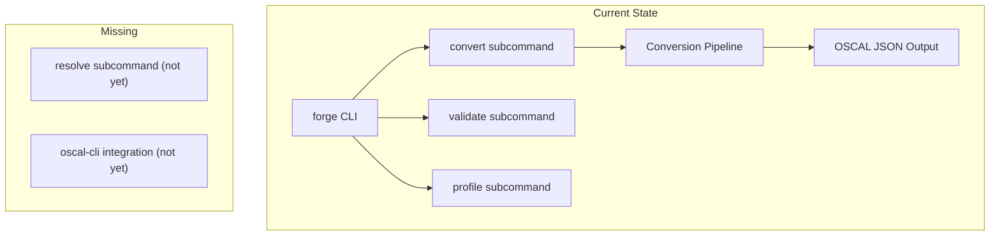
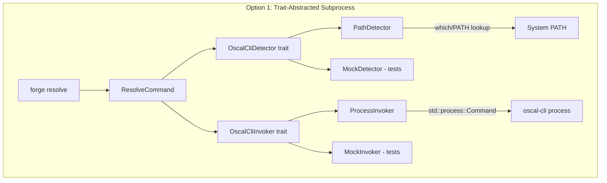
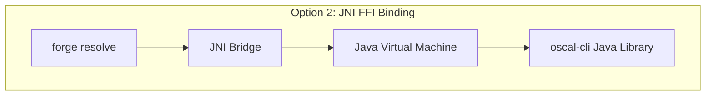
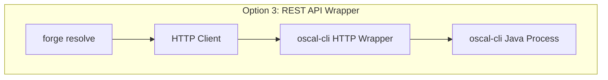
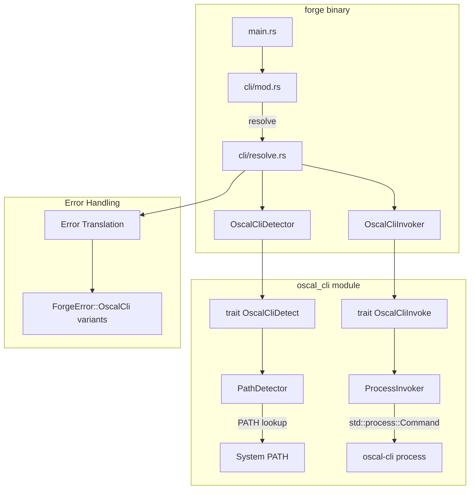
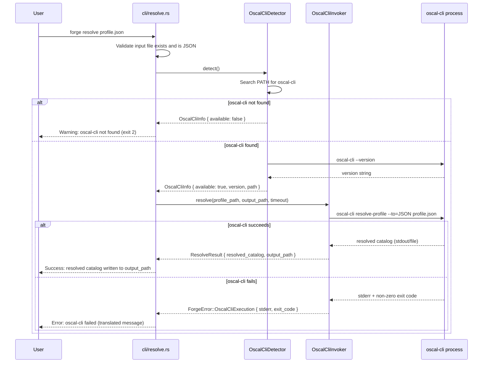
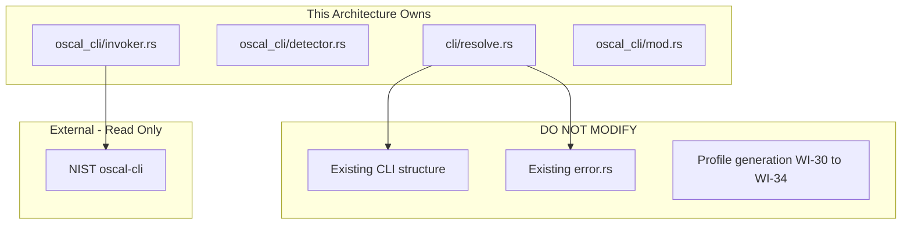

# 036-ar-oscal-cli-profile-resolution

> **Document Type:** Architecture Review
> **Audience:** LLM agents, human reviewers
> **Status:** Proposed
> **Last Updated:** 2026-02-10 <!-- @auto -->
> **Owner:** Brian Luby <!-- @human-required -->
> **Deciders:** Brian Luby <!-- @human-required -->

---

## Review Tier Legend

| Marker | Tier | Speckit Behavior |
|--------|------|------------------|
| 🔴 `@human-required` | Human Generated | Prompt human to author; blocks until complete |
| 🟡 `@human-review` | LLM + Human Review | LLM drafts → prompt human to confirm/edit; blocks until confirmed |
| 🟢 `@llm-autonomous` | LLM Autonomous | LLM completes; no prompt; logged for audit |
| ⚪ `@auto` | Auto-generated | System fills (timestamps, links); no prompt |

---

## Document Completion Order

> ⚠️ **For LLM Agents:** Complete sections in this order. Do not fill downstream sections until upstream human-required inputs exist.

1. **Summary (Decision)** → requires human input first
2. **Context (Problem Space)** → requires human input
3. **Decision Drivers** → requires human input (prioritized)
4. **Driving Requirements** → extract from PRD, human confirms
5. **Options Considered** → LLM drafts after drivers exist, human reviews
6. **Decision (Selected + Rationale)** → requires human decision
7. **Implementation Guardrails** → LLM drafts, human reviews
8. **Everything else** → can proceed after decision is made

---

## Linkage ⚪ `@auto`

| Document | ID | Relationship |
|----------|-----|--------------|
| Parent PRD | [036-prd-oscal-cli-profile-resolution](../PRD/036-prd-oscal-cli-profile-resolution.md) | Requirements this architecture satisfies |
| Security Review | N/A | Command injection mitigated via argument arrays |
| Supersedes | — | N/A |
| Superseded By | — | |

---

## Summary

### Decision 🔴 `@human-required`
> Use `std::process::Command` for subprocess invocation of NIST oscal-cli, with a dedicated `OscalCliDetector` and `OscalCliInvoker` abstraction behind a trait interface, enabling testability via mock implementations and graceful degradation when oscal-cli is unavailable.

### TL;DR for Agents 🟡 `@human-review`
> FORGE delegates Profile Resolution to NIST oscal-cli via subprocess invocation using `std::process::Command`. The integration is structured as two components: `OscalCliDetector` (finds and validates oscal-cli on PATH) and `OscalCliInvoker` (executes `resolve-profile` with timeout). Both sit behind trait abstractions for testability. Do NOT implement any Profile Resolution logic natively — delegation to oscal-cli is the deliberate architectural choice. Do NOT use shell string interpolation for process arguments — always use argument arrays to prevent command injection.

---

## Context

### Problem Space 🔴 `@human-required`
FORGE generates OSCAL Profiles (Phase 2, WI-30 through WI-34) with import, merge, and modify directives, but cannot resolve those Profiles into flat Catalog baselines. Profile Resolution is a complex NIST-defined algorithm involving recursive import processing, merge conflict resolution, and modify directive application. Building a conformant resolver is explicitly deferred (Parent PRD W-3). NIST provides this capability through oscal-cli. The architectural challenge is: how should FORGE invoke an external Java-based CLI tool from a Rust binary, handle its absence gracefully, parse its output, translate its errors, and remain testable without requiring the external tool in every CI environment?

### Decision Scope 🟡 `@human-review`

**This AR decides:**
- How FORGE detects and invokes oscal-cli as an external process
- The abstraction layer for external tool integration (trait design)
- Error handling and graceful degradation strategy
- The `forge resolve` subcommand architecture

**This AR does NOT decide:**
- Native Profile Resolution algorithm — explicitly deferred per Parent PRD W-3
- oscal-cli round-trip validation — deferred to AR-037
- Profile generation logic — completed in WI-30 through WI-34
- Batch resolution of multiple profiles — deferred to WI-40

### Current State 🟢 `@llm-autonomous`
FORGE has a working CLI with `convert` and `validate` subcommands (WI-1 through WI-35). Profile generation is complete (WI-30 through WI-34). No external tool integration exists. The `forge resolve` subcommand does not yet exist.



### Driving Requirements 🟡 `@human-review`

| PRD Req ID | Requirement Summary | Architectural Implication |
|------------|---------------------|---------------------------|
| M-1 | Detect oscal-cli on system PATH | Need cross-platform executable detection mechanism |
| M-2 | Invoke oscal-cli resolve-profile | Need subprocess management with argument passing |
| M-3 | Capture resolved Catalog output | Need stdout/file capture from subprocess |
| M-4 | Graceful degradation when oscal-cli absent | Need detection-before-invocation pattern with fallback path |
| M-5 | Descriptive error messages from oscal-cli failures | Need stderr parsing and error translation |
| M-6 | `forge resolve` subcommand | Need clap subcommand wiring |
| M-7 | Validate input file before invocation | Need pre-invocation validation layer |

**PRD Constraints inherited:**
- From Parent PRD W-3: No native Profile Resolution — delegate to oscal-cli
- From constitution principle X: Simplicity & Pragmatism — YAGNI
- From constitution principle II: Rust-first with strategic FFI integration
- From PRD Technical Constraints: Use `std::process::Command` for process invocation

---

## Decision Drivers 🔴 `@human-required`

1. **Testability:** Integration must be testable without requiring oscal-cli in CI *(critical for TDD, constitution principle IV)*
2. **Graceful degradation:** FORGE must function fully when oscal-cli is absent *(PRD M-4, Roadmap risk D-9)*
3. **Security:** No command injection via process arguments *(PRD security constraint)*
4. **Simplicity:** Minimal dependencies; use stdlib where possible *(constitution principle X)*
5. **Cross-platform:** Must work on Linux, macOS, and Windows *(PRD technical constraint)*

---

## Options Considered 🟡 `@human-review`

### Option 0: Status Quo / Do Nothing

**Description:** Users manually run oscal-cli outside of FORGE to resolve Profiles.

| Driver | Rating | Notes |
|--------|--------|-------|
| Testability | N/A | Nothing to test |
| Graceful degradation | N/A | No integration to degrade |
| Security | ✅ Good | No process invocation |
| Simplicity | ✅ Good | No code to write |
| Cross-platform | N/A | Not applicable |

**Why not viable:** Breaks workflow continuity; users must manually invoke a separate tool with correct arguments, copy output, and manage file paths. Fails PRD M-1 through M-7.

---

### Option 1: Direct `std::process::Command` with Trait Abstraction (Recommended)

**Description:** Use `std::process::Command` from Rust stdlib for subprocess invocation. Wrap detection and invocation behind trait interfaces (`OscalCliDetector` trait and `OscalCliInvoker` trait) to enable mock implementations for testing. Detection uses PATH lookup; invocation uses argument arrays (never shell strings).



| Driver | Rating | Notes |
|--------|--------|-------|
| Testability | ✅ Good | Trait abstractions enable mock implementations; no oscal-cli needed in unit tests |
| Graceful degradation | ✅ Good | Detector returns availability status; invoker only called when available |
| Security | ✅ Good | Argument arrays prevent shell injection; no shell string interpolation |
| Simplicity | ✅ Good | stdlib only for process management; one optional crate (which) for PATH detection |
| Cross-platform | ✅ Good | std::process::Command is cross-platform; PATH detection handles OS differences |

**Pros:**
- No external process management crates required (stdlib sufficient)
- Trait interfaces make unit testing straightforward without oscal-cli
- Argument array API eliminates command injection by construction
- Clear separation of detection, invocation, and error translation concerns

**Cons:**
- Manual timeout implementation needed (std::process has no built-in timeout)
- Trait indirection adds a small amount of boilerplate

---

### Option 2: FFI Binding to oscal-cli Java Library

**Description:** Use JNI (Java Native Interface) to call oscal-cli's Java library directly from Rust, bypassing subprocess invocation entirely.



| Driver | Rating | Notes |
|--------|--------|-------|
| Testability | ❌ Poor | Requires JVM in test environment; FFI complexity |
| Graceful degradation | ❌ Poor | JVM must be loaded; failure modes are complex (JVM crash, classpath issues) |
| Security | ⚠️ Medium | JNI boundary requires careful memory management; unsafe code required |
| Simplicity | ❌ Poor | Massive complexity: JNI binding, JVM lifecycle management, classpath configuration |
| Cross-platform | ⚠️ Medium | JVM differences across platforms; shared library loading varies |

**Pros:**
- Eliminates subprocess overhead
- Could access oscal-cli internals more directly

**Cons:**
- Enormous complexity for a simple "invoke external tool" use case
- Requires JVM in every environment (build + test + runtime)
- Unsafe FFI code violates constitution principle II
- Tightly couples FORGE to oscal-cli's Java implementation internals
- JVM startup time may exceed subprocess invocation time

---

### Option 3: REST API Wrapper Around oscal-cli

**Description:** Run oscal-cli as a long-lived HTTP server (or wrap it in a thin HTTP layer) and call it via HTTP requests from FORGE.



| Driver | Rating | Notes |
|--------|--------|-------|
| Testability | ⚠️ Medium | Can mock HTTP server; but requires server management in integration tests |
| Graceful degradation | ⚠️ Medium | Must detect running server; adds service lifecycle management |
| Security | ⚠️ Medium | HTTP API adds attack surface (even localhost); authentication needed |
| Simplicity | ❌ Poor | Requires building/deploying an HTTP wrapper; adds reqwest dependency and server management |
| Cross-platform | ⚠️ Medium | HTTP is platform-independent; but server lifecycle management varies |

**Pros:**
- Could keep JVM warm for repeated invocations (amortized startup cost)
- HTTP is a well-understood integration pattern

**Cons:**
- Massive over-engineering for a CLI tool that invokes another CLI tool occasionally
- Requires building or sourcing an HTTP wrapper around oscal-cli
- Adds network stack dependency for a local operation
- User must manage a server process in addition to FORGE
- Violates constitution principle X (YAGNI) dramatically

---

## Decision

### Selected Option 🔴 `@human-required`
> **Option 1: Direct `std::process::Command` with Trait Abstraction**

### Rationale 🔴 `@human-required`
Option 1 is the simplest approach that meets all requirements. Subprocess invocation via `std::process::Command` is the standard Rust pattern for calling external tools, requires no additional dependencies for process management, and provides cross-platform support out of the box. The trait abstraction layer adds minimal complexity while enabling full testability — unit tests can mock both detection and invocation without requiring oscal-cli. Options 2 (FFI) and 3 (REST) introduce orders-of-magnitude more complexity for negligible benefit in a CLI tool that invokes oscal-cli occasionally (not in a hot loop). The integration is inherently synchronous (user invokes `forge resolve`, waits for result), so async or persistent-process patterns add no value.

#### Simplest Implementation Comparison 🟡 `@human-review`

| Aspect | Simplest Possible | Selected Option | Justification for Complexity |
|--------|-------------------|-----------------|------------------------------|
| Components | Raw `Command::new("oscal-cli")` in handler | Detector + Invoker behind traits | Testability (PRD requires TDD; constitution principle IV) |
| Dependencies | stdlib only | stdlib + optional `which` crate | Cross-platform PATH detection (PRD cross-platform constraint) |
| Patterns | Direct function calls | Trait-based dependency injection | Mock implementations for CI without oscal-cli (M-4 graceful degradation) |

**Complexity justified by:** The trait abstraction is the minimum structure needed to achieve testability without requiring oscal-cli in every test environment, which is a non-negotiable requirement given constitution principle IV (TDD mandatory) and the external dependency risk (Roadmap D-9).

### Architecture Diagram 🟡 `@human-review`



---

## Technical Specification

### Component Overview 🟡 `@human-review`

| Component | Responsibility | Interface | Dependencies |
|-----------|---------------|-----------|--------------|
| cli/resolve.rs | Clap subcommand definition and handler | CLI subcommand | OscalCliDetector, OscalCliInvoker |
| OscalCliDetector | Detect oscal-cli on PATH, report version | `trait OscalCliDetect` | std::process::Command, optional `which` crate |
| OscalCliInvoker | Execute oscal-cli resolve-profile, capture output | `trait OscalCliInvoke` | std::process::Command |
| OscalCliInfo | Data struct for detection results | Struct | None |
| ResolveResult | Data struct for invocation results | Struct | None |
| ForgeError::OscalCli | Error variants for oscal-cli integration | Error enum variant | thiserror |

### Data Flow 🟢 `@llm-autonomous`



### Interface Definitions 🟡 `@human-review`

```rust
use std::path::{Path, PathBuf};
use std::time::Duration;

/// Information about the detected oscal-cli installation
#[derive(Debug, Clone)]
pub struct OscalCliInfo {
    /// Whether oscal-cli was found on the system
    pub available: bool,
    /// The version string (e.g., "1.0.3"), if detected
    pub version: Option<String>,
    /// The full path to the oscal-cli executable
    pub executable_path: Option<PathBuf>,
}

/// Result of an oscal-cli resolve-profile invocation
#[derive(Debug)]
pub struct ResolveResult {
    /// The path where the resolved Catalog was written
    pub output_path: PathBuf,
}

/// Trait for detecting oscal-cli availability (enables mocking)
pub trait OscalCliDetect {
    fn detect(&self) -> OscalCliInfo;
}

/// Trait for invoking oscal-cli operations (enables mocking)
pub trait OscalCliInvoke {
    fn resolve_profile(
        &self,
        profile_path: &Path,
        output_path: &Path,
        timeout: Duration,
    ) -> Result<ResolveResult, ForgeError>;
}

/// Production implementation using PATH lookup
pub struct PathDetector;

impl OscalCliDetect for PathDetector {
    fn detect(&self) -> OscalCliInfo {
        // 1. Search PATH for "oscal-cli" executable
        // 2. If found, run "oscal-cli --version" to capture version
        // 3. Return OscalCliInfo
        todo!()
    }
}

/// Production implementation using std::process::Command
pub struct ProcessInvoker {
    pub executable_path: PathBuf,
}

impl OscalCliInvoke for ProcessInvoker {
    fn resolve_profile(
        &self,
        profile_path: &Path,
        output_path: &Path,
        timeout: Duration,
    ) -> Result<ResolveResult, ForgeError> {
        // 1. Build Command with argument array (no shell interpolation)
        // 2. Spawn child process
        // 3. Wait with timeout
        // 4. Capture stdout, stderr, exit code
        // 5. On success: return ResolveResult
        // 6. On failure: parse stderr, return ForgeError
        todo!()
    }
}

/// Error variants for oscal-cli integration
#[derive(Debug, thiserror::Error)]
pub enum ForgeError {
    #[error("oscal-cli not found on system PATH. Install from: https://github.com/usnistgov/oscal-cli")]
    OscalCliNotFound,

    #[error("oscal-cli execution failed (exit code {exit_code}): {message}")]
    OscalCliExecution {
        exit_code: i32,
        message: String,
        stderr: String,
    },

    #[error("oscal-cli execution timed out after {timeout:?}")]
    OscalCliTimeout { timeout: Duration },

    #[error("Input file not found: {path}")]
    InputNotFound { path: PathBuf },

    // ... existing ForgeError variants
}
```

### Key Algorithms/Patterns 🟡 `@human-review`

**Pattern:** Detection-before-invocation with trait-based dependency injection
```
1. User invokes `forge resolve profile.json`
2. CLI handler receives parsed arguments
3. Validate input file exists and is JSON
4. Call OscalCliDetector.detect()
5. If not available → warn and exit with code 2
6. If available → call OscalCliInvoker.resolve_profile()
7. On success → write output path to stdout
8. On failure → translate oscal-cli error to ForgeError
```

**Pattern:** Timeout via thread-based watchdog
```
1. Spawn oscal-cli as child process
2. Spawn watchdog thread with timeout duration
3. Wait for child process completion or timeout
4. If timeout → kill child process, return OscalCliTimeout error
5. If complete → capture exit code, stdout, stderr
```

---

## Constraints & Boundaries

### Technical Constraints 🟡 `@human-review`

**Inherited from PRD:**
- Rust latest stable toolchain
- clap 4.x for CLI (constitution technology stack)
- thiserror for error types (constitution principle VIII)
- TDD mandatory (constitution principle IV)
- Cross-platform: Linux, macOS, Windows

**Added by this Architecture:**
- `std::process::Command` for all process invocation (no shell strings)
- Argument arrays only — never `sh -c "..."` pattern
- Trait interfaces for OscalCliDetector and OscalCliInvoker
- Optional `which` crate for cross-platform PATH detection (or manual PATH search)
- Timeout implementation via thread-based watchdog (stdlib)

### Architectural Boundaries 🟡 `@human-review`



- **Owns:** `oscal_cli` module (detector, invoker), `cli/resolve.rs` subcommand
- **Interfaces With:** Existing CLI structure (clap), existing ForgeError enum, NIST oscal-cli binary
- **Must Not Touch:** Profile generation logic (WI-30-34), existing conversion pipeline, oscal-cli itself

### Implementation Guardrails 🟡 `@human-review`

> ⚠️ **Critical for LLM Agents:**

- [x] **DO NOT** implement any Profile Resolution logic natively — delegate to oscal-cli only *(Parent PRD W-3)*
- [x] **DO NOT** use `Command::new("sh").arg("-c").arg(format!(...))` — always use argument arrays *(security constraint)*
- [x] **DO NOT** panic when oscal-cli is not found — return graceful degradation *(PRD M-4)*
- [x] **DO NOT** silently swallow oscal-cli stderr — surface errors to the user *(PRD M-5)*
- [x] **MUST** use trait abstractions for detector and invoker *(testability, constitution principle IV)*
- [x] **MUST** validate input file exists and is JSON before invoking oscal-cli *(PRD M-7)*
- [x] **MUST** implement timeout for oscal-cli execution *(PRD S-3)*

---

## Consequences 🟡 `@human-review`

### Positive
- Full testability without requiring oscal-cli in CI environments
- Clean separation of detection, invocation, and error translation
- No unsafe code or FFI complexity
- Graceful degradation path is architecturally enforced by detection-before-invocation pattern
- Reusable infrastructure for WI-37 (round-trip validation via oscal-cli)

### Negative
- Subprocess invocation has higher latency than in-process calls (~100-500ms JVM startup per invocation)
- Users must install oscal-cli separately (not bundled)
- Trait indirection adds ~50 lines of boilerplate over direct function calls

### Risks & Mitigations

| Risk | Likelihood | Impact | Mitigation |
|------|------------|--------|------------|
| oscal-cli CLI interface changes between versions | Med | Med | Detect version at runtime; warn on untested versions; pin to known-compatible range |
| oscal-cli requires Java which may not be installed | Med | Med | Detect Java as part of detection flow; include Java requirement in warning messages |
| Timeout implementation is imprecise on some platforms | Low | Low | Use generous default timeout (60s); allow user override via `--timeout` flag |

---

## Implementation Guidance

### Suggested Implementation Order 🟢 `@llm-autonomous`
1. Define `OscalCliDetect` and `OscalCliInvoke` traits with data structs
2. Implement `PathDetector` with cross-platform PATH lookup
3. Implement `ProcessInvoker` with argument-array Command building and timeout
4. Add `ForgeError::OscalCli*` error variants
5. Implement `ResolveCommand` clap subcommand with `--output`, `--check`, `--timeout` flags
6. Wire subcommand to detector and invoker with graceful degradation
7. Write unit tests with mock detector and invoker
8. Write integration tests (conditional on oscal-cli availability)

### Testing Strategy 🟢 `@llm-autonomous`

| Layer | Test Type | Coverage Target | Notes |
|-------|-----------|-----------------|-------|
| Unit | OscalCliDetector (mocked PATH) | 90% | Test found/not-found/permissions scenarios |
| Unit | OscalCliInvoker (mocked process) | 90% | Test success/failure/timeout scenarios |
| Unit | Error translation | 100% | All error variants produce readable messages |
| Unit | Input validation | 100% | Missing file, non-JSON file, empty path |
| Integration | Full resolve flow | Happy path + errors | Conditional on oscal-cli availability |
| Integration | `forge resolve --check` | Happy path | Conditional on oscal-cli availability |

### Reference Implementations 🟡 `@human-review`
- Rust `std::process::Command` documentation *(internal)*
- NIST oscal-cli repository: https://github.com/usnistgov/oscal-cli *(external — requires human approval)*

### Anti-patterns to Avoid 🟡 `@human-review`
- **Don't:** Use shell string interpolation for command arguments
  - **Why:** Command injection vulnerability
  - **Instead:** Use `Command::new("oscal-cli").arg("resolve-profile").arg(path)` argument arrays
- **Don't:** Implement a "simplified" Profile Resolution as fallback
  - **Why:** Non-conformant resolution is worse than no resolution (Parent PRD W-3)
  - **Instead:** Return clear error when oscal-cli is unavailable
- **Don't:** Block indefinitely on oscal-cli execution
  - **Why:** Java process may hang or take extremely long on malformed input
  - **Instead:** Implement configurable timeout with default 60 seconds

---

## Compliance & Cross-cutting Concerns

### Security Considerations 🟡 `@human-review`
- Authentication: N/A — local CLI tool
- Authorization: N/A
- Data handling: Profile content passes through subprocess; no network exposure
- Command injection: Mitigated by argument array API (never shell strings)

### Observability 🟢 `@llm-autonomous`
- **Logging:** Log oscal-cli detection result (available/not, version, path) at INFO level
- **Logging:** Log oscal-cli invocation command (arguments) at DEBUG level
- **Logging:** Log oscal-cli stderr output at WARN level
- **Metrics:** N/A for CLI tool
- **Tracing:** N/A for CLI tool

### Error Handling Strategy 🟢 `@llm-autonomous`
```
Error Category → Handling Approach
├── oscal-cli not found → Warn with installation guidance, exit code 2
├── Input file not found → Descriptive error with path, exit code 1
├── Input file not JSON → Descriptive error, exit code 1
├── oscal-cli non-zero exit → Parse stderr, extract root cause, exit code 1
├── oscal-cli timeout → Kill process, report timeout duration, exit code 1
└── oscal-cli stdout empty → Report unexpected empty output, exit code 1
```

---

## Migration Plan (if applicable) 🟡 `@human-review`

N/A — new feature addition. No existing resolve functionality to migrate from.

### Rollback Plan 🔴 `@human-required`

N/A — new subcommand. If the architecture proves wrong, the `resolve` subcommand can be removed or refactored without affecting existing functionality. The oscal-cli integration module is isolated and does not touch the core conversion pipeline.

---

## Open Questions 🟡 `@human-review`

No open questions for this work item.

---

## Changelog ⚪ `@auto`

| Version | Date | Author | Changes |
|---------|------|--------|---------|
| 0.1 | 2026-02-10 | LLM (Claude) | Initial proposal |

---

## Decision Record ⚪ `@auto`

| Date | Event | Details |
|------|-------|---------|
| 2026-02-10 | Proposed | Initial draft created from PRD 036 |

---

## Traceability Matrix 🟢 `@llm-autonomous`

| PRD Req ID | Decision Driver | Option Rating | Component | Notes |
|------------|-----------------|---------------|-----------|-------|
| M-1 | Cross-platform | Option 1: ✅ | PathDetector | PATH lookup via std or `which` crate |
| M-2 | Simplicity | Option 1: ✅ | ProcessInvoker | std::process::Command with arg arrays |
| M-3 | Simplicity | Option 1: ✅ | ProcessInvoker | Capture stdout/file output from subprocess |
| M-4 | Graceful degradation | Option 1: ✅ | PathDetector + ResolveCommand | Detection-before-invocation pattern |
| M-5 | Testability | Option 1: ✅ | ProcessInvoker + Error Translation | Parse stderr, translate to ForgeError |
| M-6 | Simplicity | Option 1: ✅ | cli/resolve.rs | clap derive subcommand |
| M-7 | Security | Option 1: ✅ | ResolveCommand | Pre-invocation file validation |
| S-1 | Testability | Option 1: ✅ | PathDetector | Version detection via `--version` |
| S-2 | Testability | Option 1: ✅ | cli/resolve.rs | `--check` flag routes to detection only |
| S-3 | Security | Option 1: ✅ | ProcessInvoker | Thread-based timeout watchdog |

---

## Review Checklist 🟢 `@llm-autonomous`

Before marking as Accepted:
- [x] All PRD Must Have requirements appear in Driving Requirements
- [x] Option 0 (Status Quo) is documented
- [x] Simplest Implementation comparison is completed
- [x] Decision drivers are prioritized and addressed
- [x] At least 2 options were seriously considered
- [x] Constraints distinguish inherited vs. new
- [x] Component names are consistent across all diagrams and tables
- [x] Implementation guardrails reference specific PRD constraints
- [x] Rollback triggers and authority are defined (N/A — new feature)
- [x] Security review is linked or N/A documented
- [x] No open questions blocking implementation
