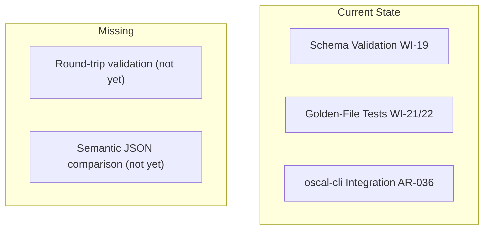
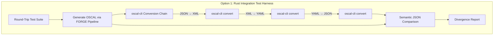
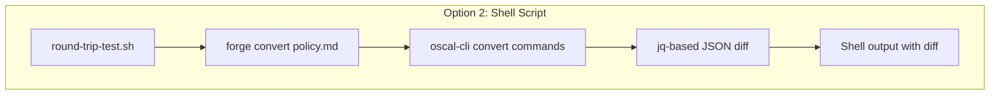
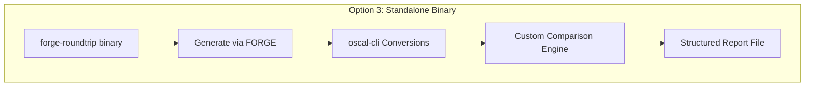
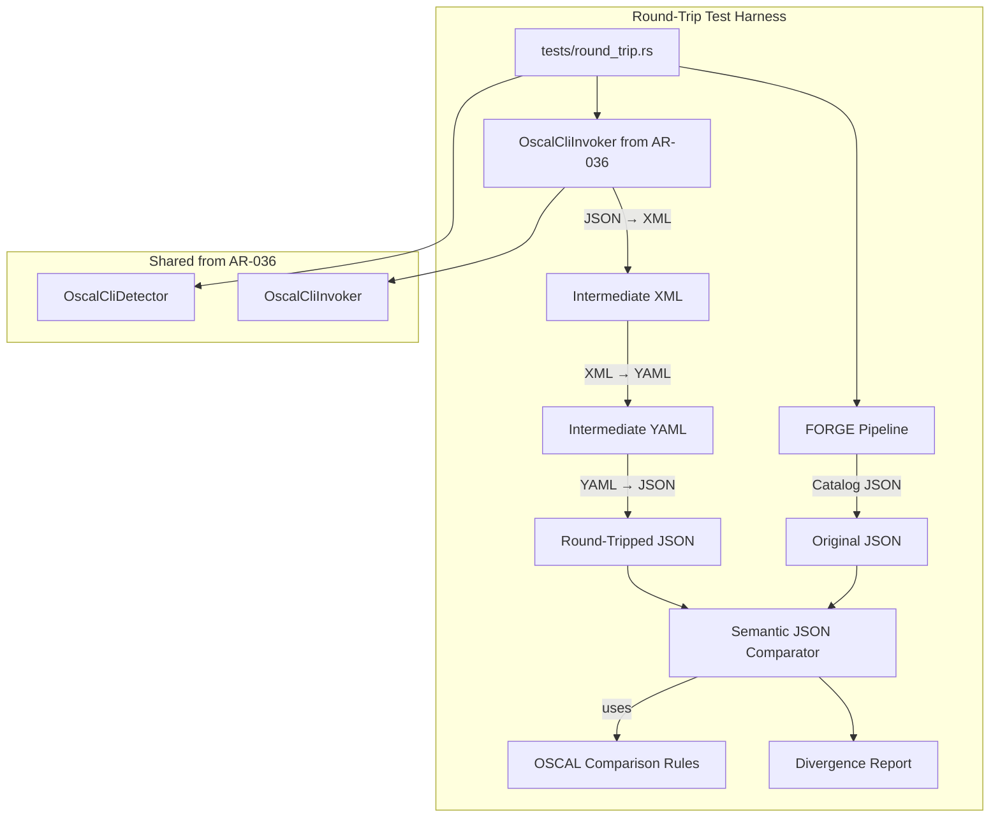
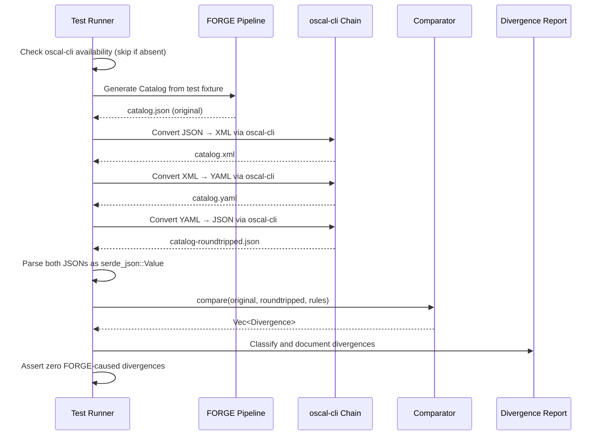
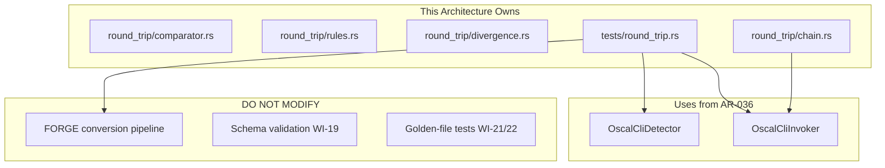

# 037-ar-oscal-cli-round-trip

> **Document Type:** Architecture Review
> **Audience:** LLM agents, human reviewers
> **Status:** Proposed
> **Last Updated:** 2026-02-10 <!-- @auto -->
> **Owner:** Brian Luby <!-- @human-required -->
> **Deciders:** Brian Luby <!-- @human-required -->

---

## Review Tier Legend

| Marker | Tier | Speckit Behavior |
|--------|------|------------------|
| 🔴 `@human-required` | Human Generated | Prompt human to author; blocks until complete |
| 🟡 `@human-review` | LLM + Human Review | LLM drafts → prompt human to confirm/edit; blocks until confirmed |
| 🟢 `@llm-autonomous` | LLM Autonomous | LLM completes; no prompt; logged for audit |
| ⚪ `@auto` | Auto-generated | System fills (timestamps, links); no prompt |

---

## Document Completion Order

> ⚠️ **For LLM Agents:** Complete sections in this order. Do not fill downstream sections until upstream human-required inputs exist.

1. **Summary (Decision)** → requires human input first
2. **Context (Problem Space)** → requires human input
3. **Decision Drivers** → requires human input (prioritized)
4. **Driving Requirements** → extract from PRD, human confirms
5. **Options Considered** → LLM drafts after drivers exist, human reviews
6. **Decision (Selected + Rationale)** → requires human decision
7. **Implementation Guardrails** → LLM drafts, human reviews
8. **Everything else** → can proceed after decision is made

---

## Linkage ⚪ `@auto`

| Document | ID | Relationship |
|----------|-----|--------------|
| Parent PRD | [037-prd-oscal-cli-round-trip](../PRD/037-prd-oscal-cli-round-trip.md) | Requirements this architecture satisfies |
| Security Review | N/A | Subprocess security covered by AR-036 |
| Supersedes | — | N/A |
| Superseded By | — | |

---

## Summary

### Decision 🔴 `@human-required`
> Implement round-trip validation as a Rust integration test harness that reuses the oscal-cli subprocess infrastructure from AR-036, chains JSON-to-XML-to-YAML-to-JSON conversions via `std::process::Command`, and compares results using recursive `serde_json::Value` tree comparison with OSCAL-aware semantic equivalence rules.

### TL;DR for Agents 🟡 `@human-review`
> Round-trip testing reuses the oscal-cli invocation layer from WI-36 (AR-036) to convert FORGE output through JSON, XML, and YAML formats, then compares the round-tripped JSON against the original using `serde_json::Value` recursive tree comparison. The comparison must be semantic (ignoring field order and whitespace) with OSCAL-specific rules for unordered arrays. Tests are integration tests that conditionally skip when oscal-cli is unavailable. Do NOT use string comparison for JSON — always parse and compare value trees. Do NOT ignore divergences — every divergence must be classified and documented.

---

## Context

### Problem Space 🔴 `@human-required`
FORGE generates OSCAL artifacts in JSON format, and schema validation (WI-19) confirms structural validity, but schema validation does not catch subtle interoperability issues: field ordering conventions, optional field omission patterns, whitespace handling, or serialization differences between FORGE's serde-based output and oscal-cli's canonical output. Without round-trip validation through the NIST reference toolchain, there is no automated confidence that FORGE output will be correctly consumed by other OSCAL tools. The architectural challenge is designing a comparison system that is robust (no false positives from acceptable variations), informative (pinpoints exact divergence locations), and maintainable (can evolve as OSCAL conventions are clarified).

### Decision Scope 🟡 `@human-review`

**This AR decides:**
- How to orchestrate oscal-cli format conversions for round-trip testing
- The semantic comparison algorithm for OSCAL JSON equivalence
- The divergence classification and documentation strategy
- How round-trip tests integrate into the CI pipeline

**This AR does NOT decide:**
- oscal-cli detection and invocation mechanics — decided in AR-036
- Schema validation approach — decided in WI-19
- Golden-file test strategy — decided in WI-21/WI-22
- Profile Resolution delegation — decided in AR-036

### Current State 🟢 `@llm-autonomous`
AR-036 establishes the oscal-cli subprocess integration layer (detection, invocation, error handling). Schema validation exists (WI-19). Golden-file tests exist (WI-21/WI-22). No round-trip validation through oscal-cli exists.



### Driving Requirements 🟡 `@human-review`

| PRD Req ID | Requirement Summary | Architectural Implication |
|------------|---------------------|---------------------------|
| M-1 | Automated round-trip for Catalog JSON via oscal-cli | Need conversion chain orchestration (JSON → XML → JSON) |
| M-2 | Automated round-trip for Component Definition JSON | Same orchestration for different artifact type |
| M-3 | Semantic equivalence comparison (not string comparison) | Need recursive JSON value tree comparison |
| M-4 | Divergences reported with JSON path, values, description | Need tree-walking diff algorithm with path tracking |
| M-5 | All FORGE-caused divergences resolved | Need divergence classification to distinguish FORGE bugs from acceptable variation |
| M-6 | Divergence log documenting all discoveries | Need structured divergence reporting and documentation format |

**PRD Constraints inherited:**
- From AR-036: oscal-cli invocation via `std::process::Command`
- From constitution principle IV: TDD mandatory
- From constitution principle X: Simplicity & Pragmatism

---

## Decision Drivers 🔴 `@human-required`

1. **Comparison reliability:** Zero false positives from acceptable variations (field ordering, whitespace) *(PRD M-3)*
2. **Diagnostic clarity:** Divergences must pinpoint the exact JSON path and values *(PRD M-4)*
3. **CI integration:** Tests must run in CI when oscal-cli is available, skip gracefully when not *(PRD S-2)*
4. **Reuse:** Leverage oscal-cli infrastructure from AR-036 *(constitution principle X)*
5. **Maintainability:** Comparison rules must be extensible as OSCAL conventions evolve

---

## Options Considered 🟡 `@human-review`

### Option 0: Status Quo / Do Nothing

**Description:** Rely on schema validation and golden-file tests only. No round-trip validation through oscal-cli.

| Driver | Rating | Notes |
|--------|--------|-------|
| Comparison reliability | ❌ Poor | Schema validation misses interoperability issues |
| Diagnostic clarity | ❌ Poor | No divergence detection at all |
| CI integration | N/A | Nothing to integrate |
| Reuse | N/A | No oscal-cli usage |
| Maintainability | N/A | Nothing to maintain |

**Why not viable:** Without round-trip validation, FORGE users have no automated assurance that output is interoperable with the NIST reference toolchain. Divergences may only be discovered by end users in production compliance workflows.

---

### Option 1: Rust `std::process::Command` Integration Test Harness (Recommended)

**Description:** Build the round-trip test as a Rust integration test module that: (1) reuses the oscal-cli `OscalCliInvoker` from AR-036 to chain format conversions, (2) implements a recursive `serde_json::Value` comparison function that walks both JSON trees and collects divergences at each path, (3) applies OSCAL-specific comparison rules (unordered arrays for props, ordered arrays for controls), (4) writes divergence reports as structured data.



| Driver | Rating | Notes |
|--------|--------|-------|
| Comparison reliability | ✅ Good | serde_json::Value comparison ignores field ordering by construction; OSCAL rules handle array semantics |
| Diagnostic clarity | ✅ Good | Recursive tree walk tracks exact JSON path for each divergence |
| CI integration | ✅ Good | `#[cfg(feature = "oscal-cli-tests")]` or runtime detection for conditional execution |
| Reuse | ✅ Good | Reuses OscalCliInvoker from AR-036 |
| Maintainability | ✅ Good | Comparison rules are data-driven (list of unordered array paths) and easily updated |

**Pros:**
- serde_json::Value is a native Rust JSON tree representation — comparison naturally ignores field ordering
- Recursive tree walk provides exact path to each divergence
- OSCAL-specific rules (unordered arrays) can be maintained as a configuration list
- Reuses existing oscal-cli subprocess infrastructure from AR-036
- Integration tests are standard Rust testing infrastructure — no additional frameworks

**Cons:**
- Integration tests depend on oscal-cli availability (must be conditional)
- Comparison function must handle OSCAL-specific array ordering semantics (non-trivial)
- Intermediate files (XML, YAML) need cleanup

---

### Option 2: Shell Script Wrapper

**Description:** Write a shell script (bash) that invokes oscal-cli for conversions and uses `jq` for JSON comparison. Run as a CI step separate from `cargo test`.



| Driver | Rating | Notes |
|--------|--------|-------|
| Comparison reliability | ⚠️ Medium | jq comparison handles ordering but is less configurable for OSCAL-specific rules |
| Diagnostic clarity | ⚠️ Medium | Shell diff output is less structured; no JSON path tracking |
| CI integration | ⚠️ Medium | Separate CI step; not part of `cargo test` |
| Reuse | ❌ Poor | Does not reuse Rust oscal-cli infrastructure from AR-036 |
| Maintainability | ❌ Poor | Shell scripts are brittle; cross-platform issues on Windows |

**Pros:**
- Quick to prototype
- jq is widely available

**Cons:**
- Does not reuse AR-036 infrastructure
- Shell scripts are not cross-platform (Windows compatibility)
- Cannot apply OSCAL-specific comparison rules easily
- Not integrated with `cargo test`; separate CI step required
- Divergence reporting is unstructured text

---

### Option 3: Dedicated Test Harness Framework (custom binary)

**Description:** Build a standalone `forge-roundtrip` binary that orchestrates round-trip testing, comparison, and reporting as a separate tool rather than as integration tests.



| Driver | Rating | Notes |
|--------|--------|-------|
| Comparison reliability | ✅ Good | Same comparison logic as Option 1 |
| Diagnostic clarity | ✅ Good | Same divergence reporting as Option 1 |
| CI integration | ⚠️ Medium | Separate binary to build and invoke; not part of `cargo test` |
| Reuse | ⚠️ Medium | Reuses library code but requires separate binary crate |
| Maintainability | ⚠️ Medium | Additional binary to maintain; testing the test tool becomes meta |

**Pros:**
- Could be distributed as a standalone verification tool
- Rich reporting capabilities (HTML, JSON)

**Cons:**
- Over-engineered for internal testing use case
- Adds a new binary crate to the workspace
- Violates YAGNI — integration tests are sufficient
- Must be tested separately from the main test suite

---

## Decision

### Selected Option 🔴 `@human-required`
> **Option 1: Rust `std::process::Command` Integration Test Harness**

### Rationale 🔴 `@human-required`
Option 1 is the simplest approach that meets all requirements while maximizing reuse of existing infrastructure. The round-trip comparison is fundamentally a test concern — it verifies FORGE output quality against an authoritative reference. Rust's integration test infrastructure is the natural home for this. The `serde_json::Value` comparison handles JSON field ordering differences by construction (JSON objects are inherently unordered), and OSCAL-specific array ordering rules can be maintained as a simple configuration list. Option 2 (shell script) fails on cross-platform compatibility and does not integrate with the Rust test suite. Option 3 (standalone binary) is over-engineered for what is essentially a sophisticated integration test.

#### Simplest Implementation Comparison 🟡 `@human-review`

| Aspect | Simplest Possible | Selected Option | Justification for Complexity |
|--------|-------------------|-----------------|------------------------------|
| Components | Single test function with string diff | Test module with recursive Value comparison | PRD M-3 requires semantic comparison; string diff produces false positives |
| Dependencies | None beyond serde_json | serde_json + OSCAL-aware rules | OSCAL arrays have specific ordering semantics that must be respected |
| Patterns | Direct function | Conversion chain + comparison + classification | PRD M-4 requires path-level divergence reporting; PRD M-6 requires classification |

**Complexity justified by:** Semantic comparison with OSCAL-aware rules is the minimum structure needed to avoid false positives (PRD M-3) while providing actionable divergence reports (PRD M-4).

### Architecture Diagram 🟡 `@human-review`



---

## Technical Specification

### Component Overview 🟡 `@human-review`

| Component | Responsibility | Interface | Dependencies |
|-----------|---------------|-----------|--------------|
| tests/round_trip.rs | Integration test orchestration | `#[test]` functions | FORGE pipeline, OscalCliInvoker |
| round_trip/comparator.rs | Recursive serde_json::Value comparison | Library function | serde_json |
| round_trip/rules.rs | OSCAL-specific comparison rules (unordered array paths) | Configuration data | None |
| round_trip/divergence.rs | Divergence data structures and classification | Structs + enums | serde (for serialization) |
| round_trip/chain.rs | oscal-cli conversion chain orchestration | Library function | OscalCliInvoker from AR-036 |

### Data Flow 🟢 `@llm-autonomous`



### Interface Definitions 🟡 `@human-review`

```rust
use serde::{Deserialize, Serialize};
use std::path::PathBuf;

/// A single divergence between original and round-tripped JSON
#[derive(Debug, Serialize, Deserialize)]
pub struct Divergence {
    /// JSON path where the divergence occurs (e.g., "catalog.metadata.title")
    pub json_path: String,
    /// Value from FORGE output
    pub expected: serde_json::Value,
    /// Value from round-tripped output
    pub actual: serde_json::Value,
    /// Classification of the divergence
    pub classification: DivergenceClass,
    /// Human-readable description
    pub description: String,
}

/// Classification of a divergence
#[derive(Debug, Serialize, Deserialize, PartialEq)]
pub enum DivergenceClass {
    /// FORGE output is non-conformant; fix needed
    ForgeFix,
    /// oscal-cli behaves differently; report upstream
    OscalCliDiff,
    /// Acceptable variation (ordering, whitespace, null vs absent)
    Acceptable,
}

/// Result of a round-trip validation run
#[derive(Debug, Serialize)]
pub struct RoundTripResult {
    /// The type of OSCAL artifact tested
    pub artifact_type: String,
    /// Path to the original FORGE-generated artifact
    pub source_path: PathBuf,
    /// Whether the round-trip passed (no non-acceptable divergences)
    pub passed: bool,
    /// List of divergences found
    pub divergences: Vec<Divergence>,
}

/// Compare two serde_json::Value trees with OSCAL-aware rules
///
/// Returns a list of all divergences found between expected and actual.
/// Field ordering in JSON objects is ignored (serde_json::Map is unordered).
/// Array ordering follows OSCAL-specific rules: some arrays are ordered
/// (controls within a group), some are unordered (props, links).
pub fn compare_oscal_json(
    expected: &serde_json::Value,
    actual: &serde_json::Value,
    path: &str,
    rules: &OscalComparisonRules,
) -> Vec<Divergence>;

/// OSCAL-specific comparison rules
pub struct OscalComparisonRules {
    /// JSON paths where array elements are unordered
    /// (comparison should match by identity key, not position)
    pub unordered_array_paths: Vec<String>,
    /// JSON paths to ignore entirely (e.g., timestamp fields that change)
    pub ignored_paths: Vec<String>,
}

/// Run the full round-trip conversion chain via oscal-cli
///
/// Converts input JSON → XML → YAML → JSON and returns the path
/// to the final round-tripped JSON file.
pub fn run_round_trip_chain(
    input_json_path: &Path,
    invoker: &dyn OscalCliInvoke,
    temp_dir: &Path,
) -> Result<PathBuf, ForgeError>;
```

### Key Algorithms/Patterns 🟡 `@human-review`

**Pattern:** Recursive JSON tree comparison with path tracking
```
compare(expected, actual, path, rules):
  1. If path is in rules.ignored_paths → return empty
  2. Match on (expected.type, actual.type):
     - (Object, Object) → compare key sets, then recurse for each shared key
       - Missing keys in actual → Divergence at path.key
       - Extra keys in actual → Divergence at path.key
     - (Array, Array) →
       - If path in rules.unordered_array_paths →
         match elements by identity key (e.g., "uuid" or "name")
       - Else → compare element-by-element by index
     - (same primitive type) → compare values directly
     - (different types) → Divergence at path
  3. Return collected divergences
```

**Pattern:** Conditional integration test with oscal-cli detection
```
#[test]
fn round_trip_catalog() {
    let detector = PathDetector;
    let info = detector.detect();
    if !info.available {
        eprintln!("SKIP: oscal-cli not available");
        return;
    }
    // ... proceed with round-trip test
}
```

---

## Constraints & Boundaries

### Technical Constraints 🟡 `@human-review`

**Inherited from PRD:**
- Rust latest stable toolchain
- oscal-cli invocation via AR-036 infrastructure
- TDD mandatory (constitution principle IV)
- serde_json for JSON parsing

**Added by this Architecture:**
- `serde_json::Value` for semantic comparison (not string comparison)
- OSCAL-specific comparison rules as configurable data
- Integration tests conditional on oscal-cli availability
- Temporary files for intermediate XML/YAML cleaned up after tests
- Divergence log as structured data (JSON-serializable)

### Architectural Boundaries 🟡 `@human-review`



- **Owns:** `round_trip` module (comparator, rules, divergence, chain), integration tests
- **Interfaces With:** AR-036 oscal-cli infrastructure, FORGE conversion pipeline
- **Must Not Touch:** Conversion pipeline, schema validation, golden-file tests, oscal-cli itself

### Implementation Guardrails 🟡 `@human-review`

> ⚠️ **Critical for LLM Agents:**

- [x] **DO NOT** use string comparison for JSON — always parse as `serde_json::Value` and compare trees *(PRD M-3)*
- [x] **DO NOT** ignore divergences silently — every divergence must be classified *(PRD M-6)*
- [x] **DO NOT** fail tests when oscal-cli is unavailable — skip gracefully *(PRD S-2)*
- [x] **DO NOT** leave intermediate files (XML, YAML) after tests — clean up temp directory *(good practice)*
- [x] **MUST** track full JSON path for each divergence *(PRD M-4)*
- [x] **MUST** reuse oscal-cli infrastructure from AR-036 *(architecture reuse)*
- [x] **MUST** handle OSCAL-specific array ordering (some ordered, some unordered) *(comparison correctness)*

---

## Consequences 🟡 `@human-review`

### Positive
- Automated confidence that FORGE output is interoperable with NIST reference toolchain
- Divergences are caught during development, not by end users in production
- Comparison rules are data-driven and easily updated as OSCAL conventions evolve
- Reuses existing oscal-cli infrastructure — no duplicate process management code

### Negative
- Integration tests require oscal-cli (Java-based) in CI environment
- OSCAL-specific array ordering rules require domain knowledge to maintain
- Intermediate files add temporary disk usage during tests

### Risks & Mitigations

| Risk | Likelihood | Impact | Mitigation |
|------|------------|--------|------------|
| oscal-cli not available in CI | Med | Med | Conditional test execution; Docker-based oscal-cli as alternative |
| OSCAL array ordering rules are incomplete | Med | Low | Start with known unordered arrays (props, links); extend as divergences are discovered |
| oscal-cli version differences produce false divergences | Low | Low | Pin oscal-cli version in CI; document version compatibility |

---

## Implementation Guidance

### Suggested Implementation Order 🟢 `@llm-autonomous`
1. Implement `Divergence` and `DivergenceClass` data structures
2. Implement `OscalComparisonRules` with initial OSCAL-specific rules
3. Implement recursive `compare_oscal_json` function with unit tests (no oscal-cli needed)
4. Implement `run_round_trip_chain` using AR-036 OscalCliInvoker
5. Write integration test for Catalog round-trip (conditional on oscal-cli)
6. Write integration test for Component Definition round-trip
7. Classify and document any divergences discovered
8. Resolve FORGE-caused divergences in the conversion pipeline

### Testing Strategy 🟢 `@llm-autonomous`

| Layer | Test Type | Coverage Target | Notes |
|-------|-----------|-----------------|-------|
| Unit | compare_oscal_json (identical values) | 100% | Returns empty divergence list |
| Unit | compare_oscal_json (field order difference) | 100% | Returns empty (acceptable) |
| Unit | compare_oscal_json (value difference) | 100% | Returns divergence with correct path |
| Unit | compare_oscal_json (array ordering rules) | 90% | Unordered arrays matched by key |
| Unit | Divergence serialization | 100% | JSON round-trip of divergence report |
| Integration | Catalog round-trip via oscal-cli | Happy path | Conditional on oscal-cli |
| Integration | Component Definition round-trip | Happy path | Conditional on oscal-cli |

### Reference Implementations 🟡 `@human-review`
- serde_json::Value recursive comparison patterns *(internal)*
- assert_json_diff crate (MIT) as reference for JSON diff approach *(external — requires human approval)*
- NIST oscal-cli repository for conversion command syntax *(external — requires human approval)*

### Anti-patterns to Avoid 🟡 `@human-review`
- **Don't:** Compare JSON as strings
  - **Why:** JSON field ordering is not significant; produces false positives
  - **Instead:** Parse as serde_json::Value and compare recursively
- **Don't:** Classify all divergences as "acceptable" without investigation
  - **Why:** Hides real interoperability issues
  - **Instead:** Investigate each divergence; classify as FORGE fix, oscal-cli diff, or acceptable
- **Don't:** Hard-fail tests when oscal-cli is absent
  - **Why:** Blocks development on non-Java environments
  - **Instead:** Skip with warning message

---

## Compliance & Cross-cutting Concerns

### Security Considerations 🟡 `@human-review`
- Authentication: N/A — local testing infrastructure
- Authorization: N/A
- Data handling: Test fixtures and intermediate files may contain policy content; cleaned up after tests
- Subprocess security: Covered by AR-036 (argument arrays, no shell strings)

### Observability 🟢 `@llm-autonomous`
- **Logging:** Log each conversion step at DEBUG level (JSON → XML, XML → YAML, etc.)
- **Logging:** Log divergence count and classification summary at INFO level
- **Metrics:** N/A for testing infrastructure
- **Tracing:** N/A for testing infrastructure

### Error Handling Strategy 🟢 `@llm-autonomous`
```
Error Category → Handling Approach
├── oscal-cli not available → Skip test with warning (not failure)
├── oscal-cli conversion fails → Test failure with oscal-cli error detail
├── Comparison finds divergences → Report all divergences; fail only on FORGE-caused ones
├── Temp file cleanup fails → Log warning, do not fail test
└── FORGE pipeline fails → Test failure with pipeline error detail
```

---

## Migration Plan (if applicable) 🟡 `@human-review`

N/A — new testing capability. No existing round-trip validation to migrate from.

### Rollback Plan 🔴 `@human-required`

N/A — testing infrastructure. If the approach proves inadequate, the round-trip tests can be replaced or removed without affecting FORGE's production functionality. The comparison module is isolated and does not affect the conversion pipeline.

---

## Open Questions 🟡 `@human-review`

No open questions for this work item.

---

## Changelog ⚪ `@auto`

| Version | Date | Author | Changes |
|---------|------|--------|---------|
| 0.1 | 2026-02-10 | LLM (Claude) | Initial proposal |

---

## Decision Record ⚪ `@auto`

| Date | Event | Details |
|------|-------|---------|
| 2026-02-10 | Proposed | Initial draft created from PRD 037 |

---

## Traceability Matrix 🟢 `@llm-autonomous`

| PRD Req ID | Decision Driver | Option Rating | Component | Notes |
|------------|-----------------|---------------|-----------|-------|
| M-1 | Reuse | Option 1: ✅ | chain.rs + tests/round_trip.rs | Reuses AR-036 OscalCliInvoker for Catalog conversion |
| M-2 | Reuse | Option 1: ✅ | chain.rs + tests/round_trip.rs | Same chain for Component Definition |
| M-3 | Comparison reliability | Option 1: ✅ | comparator.rs | serde_json::Value tree comparison ignores field order |
| M-4 | Diagnostic clarity | Option 1: ✅ | comparator.rs + divergence.rs | Recursive walk tracks full JSON path |
| M-5 | Comparison reliability | Option 1: ✅ | divergence.rs | Classification distinguishes FORGE bugs from acceptable variation |
| M-6 | Maintainability | Option 1: ✅ | divergence.rs | Serializable divergence structs enable structured logging |
| S-1 | Comparison reliability | Option 1: ✅ | chain.rs | Full JSON → XML → YAML → JSON chain supported |
| S-2 | CI integration | Option 1: ✅ | tests/round_trip.rs | Conditional execution based on oscal-cli detection |
| S-3 | Diagnostic clarity | Option 1: ✅ | divergence.rs | Three-way classification (ForgeFix, OscalCliDiff, Acceptable) |

---

## Review Checklist 🟢 `@llm-autonomous`

Before marking as Accepted:
- [x] All PRD Must Have requirements appear in Driving Requirements
- [x] Option 0 (Status Quo) is documented
- [x] Simplest Implementation comparison is completed
- [x] Decision drivers are prioritized and addressed
- [x] At least 2 options were seriously considered
- [x] Constraints distinguish inherited vs. new
- [x] Component names are consistent across all diagrams and tables
- [x] Implementation guardrails reference specific PRD constraints
- [x] Rollback triggers and authority are defined (N/A — testing infrastructure)
- [x] Security review is linked or N/A documented
- [x] No open questions blocking implementation
