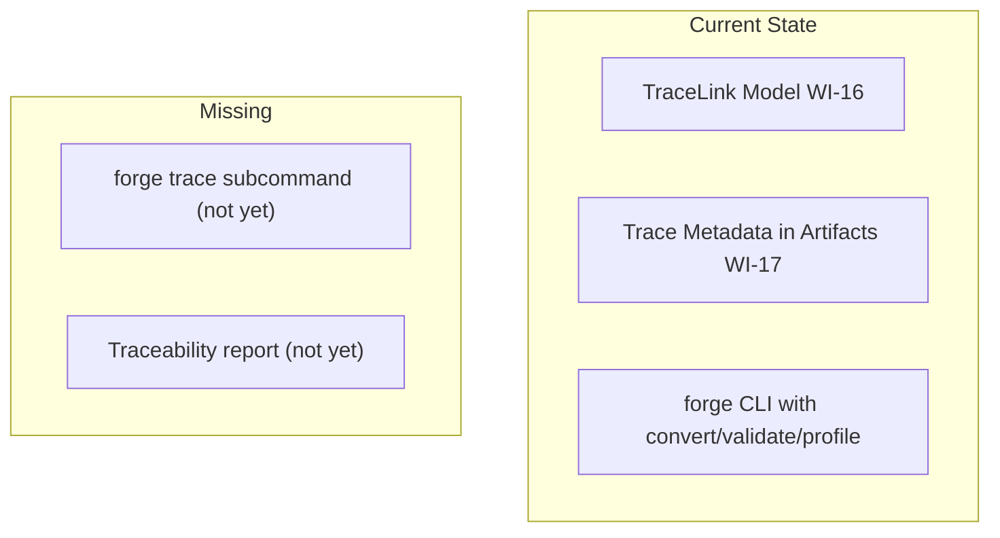
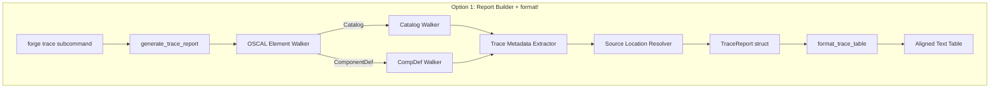
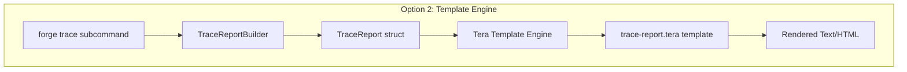
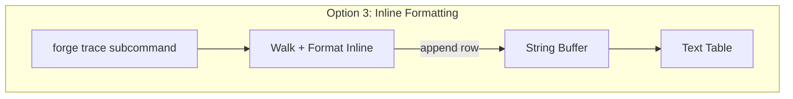
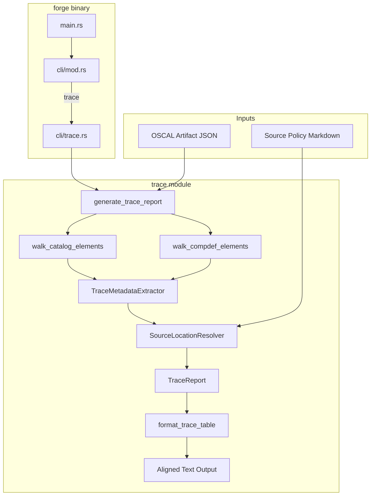
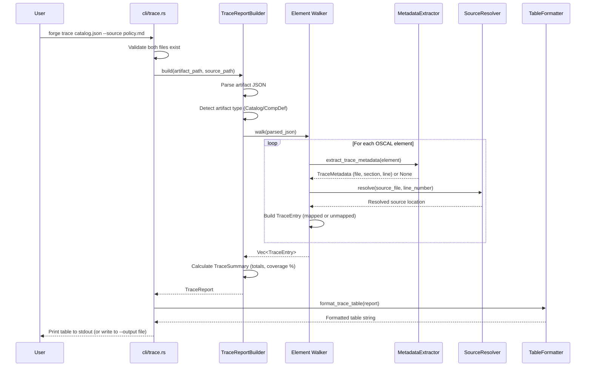
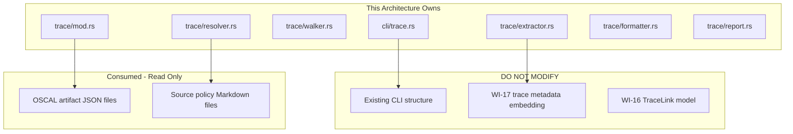

# 038-ar-traceability-report

> **Document Type:** Architecture Review
> **Audience:** LLM agents, human reviewers
> **Status:** Proposed
> **Last Updated:** 2026-02-10 <!-- @auto -->
> **Owner:** Brian Luby <!-- @human-required -->
> **Deciders:** Brian Luby <!-- @human-required -->

---

## Review Tier Legend

| Marker | Tier | Speckit Behavior |
|--------|------|------------------|
| 🔴 `@human-required` | Human Generated | Prompt human to author; blocks until complete |
| 🟡 `@human-review` | LLM + Human Review | LLM drafts → prompt human to confirm/edit; blocks until confirmed |
| 🟢 `@llm-autonomous` | LLM Autonomous | LLM completes; no prompt; logged for audit |
| ⚪ `@auto` | Auto-generated | System fills (timestamps, links); no prompt |

---

## Document Completion Order

> ⚠️ **For LLM Agents:** Complete sections in this order. Do not fill downstream sections until upstream human-required inputs exist.

1. **Summary (Decision)** → requires human input first
2. **Context (Problem Space)** → requires human input
3. **Decision Drivers** → requires human input (prioritized)
4. **Driving Requirements** → extract from PRD, human confirms
5. **Options Considered** → LLM drafts after drivers exist, human reviews
6. **Decision (Selected + Rationale)** → requires human decision
7. **Implementation Guardrails** → LLM drafts, human reviews
8. **Everything else** → can proceed after decision is made

---

## Linkage ⚪ `@auto`

| Document | ID | Relationship |
|----------|-----|--------------|
| Parent PRD | [038-prd-traceability-report](../PRD/038-prd-traceability-report.md) | Requirements this architecture satisfies |
| Security Review | N/A | No new attack surface; reads existing files |
| Supersedes | — | N/A |
| Superseded By | — | |

---

## Summary

### Decision 🔴 `@human-required`
> Use a structured report builder pattern with direct `format!` string formatting for table output, consuming WI-17 trace metadata (props/links) from parsed OSCAL JSON via serde_json, and resolving source locations by line-number lookup against the source policy file.

### TL;DR for Agents 🟡 `@human-review`
> The `forge trace` subcommand reads an OSCAL artifact JSON, walks its element tree to extract WI-17 trace props/links, reads the source policy file, resolves trace references to source locations by line number, and produces an aligned text table. The report builder is a pure function: OSCAL artifact + source file in, TraceReport struct out. Table formatting is a separate concern using `format!` macros. Do NOT introduce a template engine for this — direct string formatting is sufficient for a text table. Do NOT silently omit elements that lack trace metadata — they must appear as "unmapped".

---

## Context

### Problem Space 🔴 `@human-required`
WI-17 embeds trace metadata (source section, paragraph, and line references) within generated OSCAL artifacts as props and links, but there is no user-facing way to view this traceability information. Compliance engineers need a structured report that maps every OSCAL element back to its source policy location for audit purposes. The architectural challenge is: how to extract trace metadata from arbitrary OSCAL artifact structures (Catalogs and Component Definitions have different element hierarchies), resolve those references against the source document, and present the result as a readable, well-formatted table that also detects coverage gaps (unmapped elements).

### Decision Scope 🟡 `@human-review`

**This AR decides:**
- How to extract trace metadata from OSCAL artifact JSON
- How to resolve trace references against the source policy
- The report generation pattern (builder, template, or direct formatting)
- The table output format and alignment strategy
- Coverage gap detection approach

**This AR does NOT decide:**
- Source text excerpts in the report — deferred to AR-039
- JSON output format for the report — deferred to AR-039
- TraceLink model definition — completed in WI-16
- Trace metadata embedding format — completed in WI-17
- Diff report between conversions — deferred to WI-43

### Current State 🟢 `@llm-autonomous`
WI-16 defined the TraceLink model. WI-17 embedded trace metadata as props/links in OSCAL artifacts. The `forge trace` subcommand does not yet exist. No user-facing traceability report is available.



### Driving Requirements 🟡 `@human-review`

| PRD Req ID | Requirement Summary | Architectural Implication |
|------------|---------------------|---------------------------|
| M-1 | `forge trace <artifact> --source <policy>` subcommand | Need clap subcommand with two required inputs |
| M-2 | Map each OSCAL element to source section and line | Need OSCAL element tree walker + trace metadata extractor |
| M-3 | Structured table with specific columns | Need table formatting with column alignment |
| M-4 | Support both Catalog and Component Definition | Need polymorphic OSCAL element walker |
| M-5 | Extract trace metadata from WI-17 props/links | Need knowledge of WI-17 prop/link naming conventions |
| M-6 | Flag unmapped elements with coverage summary | Need coverage calculation + gap detection |

**PRD Constraints inherited:**
- From Parent PRD S-6: CLI shall produce a traceability report
- From Parent PRD AC-10: Each element links back to source section and line
- From constitution principle X: Simplicity & Pragmatism — YAGNI
- From constitution principle IV: TDD mandatory

---

## Decision Drivers 🔴 `@human-required`

1. **Readability:** Report must be visually clear in a terminal with aligned columns *(PRD M-3)*
2. **Completeness:** Every OSCAL element must appear — unmapped elements must be visible *(PRD M-6)*
3. **Extensibility:** Architecture must support WI-39 extensions (excerpts, JSON output) without refactoring *(forward compatibility)*
4. **Simplicity:** Minimize dependencies for a text table report *(constitution principle X)*
5. **Accuracy:** Source location resolution must match actual source file positions *(PRD M-2)*

---

## Options Considered 🟡 `@human-review`

### Option 0: Status Quo / Do Nothing

**Description:** Users manually inspect OSCAL artifact JSON to find trace props/links and cross-reference with the source policy.

| Driver | Rating | Notes |
|--------|--------|-------|
| Readability | ❌ Poor | Raw JSON is not human-readable for audit purposes |
| Completeness | ❌ Poor | No automated coverage detection |
| Extensibility | N/A | Nothing to extend |
| Simplicity | ✅ Good | No code to write |
| Accuracy | ⚠️ Medium | User may misinterpret JSON paths |

**Why not viable:** Manual JSON inspection is impractical for audit workflows. Compliance engineers need a structured report they can include in audit documentation. Fails PRD M-1 through M-6.

---

### Option 1: Structured Report Builder with Direct String Formatting (Recommended)

**Description:** Implement a `generate_trace_report()` function that walks the OSCAL element tree, extracts trace metadata, resolves source locations, and builds a `TraceReport` data structure. A separate `format_trace_table` function produces the aligned text table using Rust's `format!` macros with fixed-width column specifications.



| Driver | Rating | Notes |
|--------|--------|-------|
| Readability | ✅ Good | format! with fixed-width columns produces clean aligned tables |
| Completeness | ✅ Good | Walker visits all elements; gap detection is a simple filter on mapped flag |
| Extensibility | ✅ Good | TraceReport struct can be extended for WI-39 (add excerpt, prose fields); separate formatters for table vs JSON |
| Simplicity | ✅ Good | No dependencies beyond serde_json; format! is stdlib |
| Accuracy | ✅ Good | Line-number lookup against source file is deterministic |

**Pros:**
- Zero additional dependencies — format! and serde_json are already in the project
- Clean separation of concerns: building (data) vs formatting (presentation)
- TraceReport struct is the extensibility point for WI-39 (add fields, add formatters)
- Element walker pattern handles Catalog and Component Definition polymorphically
- Coverage calculation is a trivial aggregation over TraceReport entries

**Cons:**
- Manual column alignment requires calculating max widths per column
- Adding new columns requires updating the format string
- No Unicode table borders (plain ASCII separators)

---

### Option 2: Template Engine (Tera/Handlebars)

**Description:** Use a template engine (Tera or Handlebars) to render the traceability report from a TraceReport data structure and a template file.



| Driver | Rating | Notes |
|--------|--------|-------|
| Readability | ✅ Good | Templates can produce well-formatted output |
| Completeness | ✅ Good | Same walker approach as Option 1 |
| Extensibility | ✅ Good | New output formats = new templates |
| Simplicity | ❌ Poor | Adds Tera/Handlebars dependency + template files for a text table |
| Accuracy | ✅ Good | Same source resolution as Option 1 |

**Pros:**
- Templates are easy to modify without recompiling
- Could support multiple output formats (text, HTML, Markdown) via different templates
- Separation of data and presentation is cleaner

**Cons:**
- Massive over-engineering for a text table — Tera adds ~20 transitive dependencies
- Template language is less familiar to Rust developers than format! macros
- Column alignment in templates is awkward (templates are not designed for fixed-width text)
- Violates constitution principle X (YAGNI) — text table is the only required format

---

### Option 3: Direct String Formatting Without Report Builder (Inline)

**Description:** Generate the table output directly while walking the OSCAL element tree, without an intermediate TraceReport data structure. Each element is formatted and appended to a string as it is discovered.



| Driver | Rating | Notes |
|--------|--------|-------|
| Readability | ⚠️ Medium | Column alignment is harder without pre-calculating max widths |
| Completeness | ⚠️ Medium | Coverage summary requires a second pass or running counter |
| Extensibility | ❌ Poor | No intermediate data structure; WI-39 would require refactoring to add fields |
| Simplicity | ✅ Good | Least code for initial implementation |
| Accuracy | ✅ Good | Same source resolution |

**Pros:**
- Simplest initial implementation
- No intermediate data structure

**Cons:**
- Column alignment requires knowing max widths before formatting (needs two passes anyway)
- No intermediate data structure means WI-39 must refactor to add excerpt/prose fields
- Coverage summary requires separate counter or second pass
- Mixing data extraction with formatting violates separation of concerns

---

## Decision

### Selected Option 🔴 `@human-required`
> **Option 1: Structured Report Builder with Direct String Formatting**

### Rationale 🔴 `@human-required`
Option 1 provides the right balance of simplicity and extensibility. The TraceReport intermediate data structure is the critical architectural choice — it separates data extraction from formatting, enabling WI-39 to add excerpt and JSON output by extending the struct and adding new formatters rather than refactoring the walker. Direct `format!` for table output avoids adding a template engine dependency for what is a simple text table (Option 2). The inline approach (Option 3) would need immediate refactoring for WI-39, violating the principle of minimal-refactoring architecture decisions.

#### Simplest Implementation Comparison 🟡 `@human-review`

| Aspect | Simplest Possible | Selected Option | Justification for Complexity |
|--------|-------------------|-----------------|------------------------------|
| Components | Inline walk + print | Builder + Report struct + Formatter | WI-39 extensibility — adding excerpts/JSON without refactoring |
| Dependencies | serde_json only | serde_json only | No additional complexity |
| Patterns | Single function | Walker + Builder + Formatter | Separation of concerns; testability of each component |

**Complexity justified by:** The TraceReport intermediate struct is the minimum structure needed to support WI-39 extensions (excerpts, JSON output) without refactoring, while keeping each concern independently testable.

### Architecture Diagram 🟡 `@human-review`



---

## Technical Specification

### Component Overview 🟡 `@human-review`

| Component | Responsibility | Interface | Dependencies |
|-----------|---------------|-----------|--------------|
| cli/trace.rs | Clap subcommand definition and handler | CLI subcommand | generate_trace_report, format_trace_table |
| trace/mod.rs (generate_trace_report) | Orchestrate report generation from artifact + source | Public function | walk_catalog_elements, walk_compdef_elements, check_source_staleness |
| trace/walker.rs (walk_catalog_elements) | Walk Catalog elements (groups, controls — parts excluded) | Public function | serde_json |
| trace/walker.rs (walk_compdef_elements) | Walk Component Definition elements (components, implemented-requirements) | Public function | serde_json |
| TraceMetadataExtractor | Extract trace props/links from OSCAL element | Pure function | serde_json, WI-17 prop names |
| SourceLocationResolver | Read source file, resolve line numbers to text | Pure function | std::fs |
| TraceReport | Data structure holding all trace entries and summary | Struct | None |
| format_trace_table | Format TraceReport as aligned text table | Pure function | std::fmt |

### Data Flow 🟢 `@llm-autonomous`



### Interface Definitions 🟡 `@human-review`

```rust
use std::path::{Path, PathBuf};

/// Trace metadata extracted from an OSCAL element's WI-17 trace props.
#[derive(Debug, Clone, PartialEq, Eq)]
pub struct TraceMetadata {
    /// Source file name (from `source-file` prop).
    pub source_file: String,
    /// Source section title (from `source-section` prop).
    pub source_section: String,
    /// 1-based source line number (from `source-line` prop, parsed).
    pub source_line: usize,
}

/// A single entry in the traceability report
#[derive(Debug, Clone)]
pub struct TraceEntry {
    /// OSCAL element identifier (UUID or control-id)
    pub element_id: String,
    /// Type of OSCAL element (group, control, or implemented-requirement)
    pub element_type: String,
    /// Resolved trace metadata (None if unmapped)
    pub trace: Option<TraceMetadata>,
}

/// Summary statistics for the traceability report
#[derive(Debug, Clone)]
pub struct TraceSummary {
    pub total_elements: usize,
    pub mapped_elements: usize,
    pub unmapped_elements: usize,
    pub coverage_percent: f64,
}

/// Full traceability report
#[derive(Debug)]
pub struct TraceReport {
    pub artifact_path: PathBuf,
    pub source_path: PathBuf,
    pub artifact_type: String,
    pub entries: Vec<TraceEntry>,
    pub summary: TraceSummary,
}

// Trace prop names: imported from crate::oscal::trace_embedding
// (FORGE_TRACE_NS, PROP_SOURCE_FILE, PROP_SOURCE_SECTION, PROP_SOURCE_LINE)
// Do NOT hardcode — use shared WI-17 constants.

/// Generate a traceability report from an OSCAL artifact and source policy
pub fn generate_trace_report(
    artifact_path: &Path,
    source_path: &Path,
) -> Result<TraceReport, ForgeError>;

/// Extract trace metadata from an OSCAL element's props array
pub fn extract_trace_metadata(
    element: &serde_json::Value,
) -> Option<TraceMetadata>;

/// Format the trace report as a structured text table
pub fn format_trace_table(report: &TraceReport) -> String;
```

### Key Algorithms/Patterns 🟡 `@human-review`

**Pattern:** Polymorphic OSCAL element walker
```
walk_oscal_elements(artifact_json):
  1. Detect artifact type from top-level key ("catalog" vs "component-definition")
  2. If Catalog:
     - Walk catalog.groups[] → yield group elements
     - For each group, walk controls[] → yield control elements
     - Parts are excluded (WI-17 does not embed trace metadata on parts)
  3. If Component Definition:
     - Walk components[] → yield component elements
     - For each component, walk control-implementations[] →
       walk implemented-requirements[] → yield impl-req elements
  4. For each yielded element:
     - Extract element_id (uuid or id field)
     - Extract element_type (from JSON structure)
     - Call extract_trace_metadata() on element's props/links
     - Build TraceEntry
```

**Pattern:** Column-aligned table formatting
```
format_trace_table(report):
  1. Calculate max width for each column across all entries
  2. Build header row with column names padded to max width
  3. Build separator row with dashes
  4. For each entry, format row with padded columns
  5. Append summary section (total, mapped, unmapped, coverage %)
  6. Return complete formatted string
```

---

## Constraints & Boundaries

### Technical Constraints 🟡 `@human-review`

**Inherited from PRD:**
- Rust latest stable toolchain
- clap 4.x for CLI (constitution technology stack)
- thiserror for error types (constitution principle VIII)
- TDD mandatory (constitution principle IV)
- serde_json for OSCAL parsing

**Added by this Architecture:**
- WI-17 prop/link naming convention as constants (shared between embedding and extraction)
- Column alignment via max-width pre-calculation (no external table crate)
- TraceReport as the extensibility point for WI-39
- Source file read into `Vec<String>` (line vector) for O(1) line lookup

### Architectural Boundaries 🟡 `@human-review`



- **Owns:** `trace` module (builder, walker, extractor, resolver, formatter), `cli/trace.rs` subcommand
- **Interfaces With:** Existing CLI structure, WI-17 trace prop/link names, OSCAL artifact files, source policy files
- **Must Not Touch:** WI-17 embedding logic, WI-16 TraceLink model, conversion pipeline

### Implementation Guardrails 🟡 `@human-review`

> ⚠️ **Critical for LLM Agents:**

- [x] **DO NOT** silently omit elements that lack trace metadata — they must appear as "unmapped" *(PRD M-6)*
- [x] **DO NOT** introduce a template engine dependency for text table output *(constitution principle X, YAGNI)*
- [x] **DO NOT** hardcode trace metadata prop names — use shared constants with WI-17 *(maintainability)*
- [x] **DO NOT** couple the report builder to a specific output format — keep TraceReport as data *(WI-39 extensibility)*
- [x] **MUST** support both Catalog and Component Definition artifact types *(PRD M-4)*
- [x] **MUST** produce aligned columns in table output *(PRD M-3, readability)*
- [x] **MUST** include coverage summary (total, mapped, unmapped, percentage) *(PRD M-6, S-2)*

---

## Consequences 🟡 `@human-review`

### Positive
- TraceReport struct provides clean extensibility point for WI-39 (excerpts, JSON output)
- Zero additional dependencies — serde_json and format! are already available
- Separation of building and formatting enables independent testing of each
- Coverage detection is automatic — every element is visited, unmapped ones are flagged
- Shared trace prop constants prevent naming drift between embedding (WI-17) and extraction

### Negative
- Manual column alignment is more code than using a table formatting crate
- Adding new columns requires updating both the TraceEntry struct and the formatter
- Plain ASCII table lacks visual polish of Unicode box-drawing characters

### Risks & Mitigations

| Risk | Likelihood | Impact | Mitigation |
|------|------------|--------|------------|
| WI-17 trace metadata format changes | Low | Med | Use shared constants; update both embedding and extraction together |
| Source file modified since conversion (line numbers mismatch) | Med | Low | Compare source file mtime against OSCAL `metadata.last-modified` timestamp (PRD S-3); warn if source is newer |
| Large artifacts produce very long tables | Low | Low | PRD S-1 defers to WI-39 for this; file output via --output |

---

## Implementation Guidance

### Suggested Implementation Order 🟢 `@llm-autonomous`
1. Define trace metadata prop name constants (shared with WI-17)
2. Implement `TraceMetadata`, `TraceEntry`, `TraceSummary`, `TraceReport` structs
3. Implement `extract_trace_metadata` function (from serde_json::Value props)
4. Implement `CatalogWalker` for walking Catalog element trees
5. Implement `CompDefWalker` for walking Component Definition element trees
6. Implement `SourceLocationResolver` (read file into line vector, look up by number)
7. Implement `generate_trace_report` (orchestrate walker + extractor + resolver)
8. Implement `format_trace_table` with column alignment
9. Add `trace` clap subcommand with `--source` and `--output` flags
10. Write unit tests for each component; integration test with fixture

### Testing Strategy 🟢 `@llm-autonomous`

| Layer | Test Type | Coverage Target | Notes |
|-------|-----------|-----------------|-------|
| Unit | extract_trace_metadata (with props) | 100% | Test found/not-found/partial metadata |
| Unit | extract_trace_metadata (no props) | 100% | Returns None (unmapped element) |
| Unit | CatalogWalker | 90% | Test with mock Catalog JSON |
| Unit | CompDefWalker | 90% | Test with mock Component Definition JSON |
| Unit | SourceLocationResolver | 100% | Test line lookup, out-of-range, empty file |
| Unit | TraceSummary calculation | 100% | Coverage percentage edge cases (0%, 100%, partial) |
| Unit | format_trace_table | 90% | Column alignment, long values, empty report |
| Integration | Full trace report from fixture | Happy path | End-to-end with sample artifact and source |

### Reference Implementations 🟡 `@human-review`
- WI-17 trace metadata prop/link format documentation *(internal)*
- Parent PRD US-7 acceptance scenarios *(internal)*

### Anti-patterns to Avoid 🟡 `@human-review`
- **Don't:** Use tab-separated output without alignment
  - **Why:** Tabs produce inconsistent alignment across terminal widths
  - **Instead:** Calculate max column widths and use fixed-width padding
- **Don't:** Walk only controls, ignoring groups
  - **Why:** Groups also have trace metadata (source-section); incomplete report if omitted
  - **Instead:** Walk groups and controls (parts excluded — WI-17 does not trace them)
- **Don't:** Read the entire source policy for every trace entry
  - **Why:** O(n*m) file reads for n entries
  - **Instead:** Read source file once into Vec<String>, look up lines by index

---

## Compliance & Cross-cutting Concerns

### Security Considerations 🟡 `@human-review`
- Authentication: N/A — local CLI tool
- Authorization: N/A
- Data handling: Reads OSCAL artifact and source policy (may contain sensitive content); report output inherits sensitivity

### Observability 🟢 `@llm-autonomous`
- **Logging:** Log artifact type detection at DEBUG level
- **Logging:** Log total element count and coverage at INFO level
- **Metrics:** N/A for CLI tool
- **Tracing:** N/A for CLI tool

### Error Handling Strategy 🟢 `@llm-autonomous`
```
Error Category → Handling Approach
├── Artifact file not found → Descriptive error with path, exit code 1
├── Source file not found → Descriptive error with path, exit code 1
├── Artifact is invalid JSON → Descriptive parsing error, exit code 1
├── Artifact is unknown type → Error indicating unsupported type, exit code 1
├── Source line out of range → Flag entry with "source modified" warning
└── No trace metadata in artifact → All elements unmapped; warning emitted
```

---

## Migration Plan (if applicable) 🟡 `@human-review`

N/A — new feature addition. No existing trace subcommand to migrate from.

### Rollback Plan 🔴 `@human-required`

N/A — new subcommand. The `trace` subcommand can be removed without affecting existing functionality. The trace module is isolated and reads data without modifying it.

---

## Open Questions 🟡 `@human-review`

No open questions for this work item.

---

## Changelog ⚪ `@auto`

| Version | Date | Author | Changes |
|---------|------|--------|---------|
| 0.1 | 2026-02-10 | LLM (Claude) | Initial proposal |

---

## Decision Record ⚪ `@auto`

| Date | Event | Details |
|------|-------|---------|
| 2026-02-10 | Proposed | Initial draft created from PRD 038 |

---

## Traceability Matrix 🟢 `@llm-autonomous`

| PRD Req ID | Decision Driver | Option Rating | Component | Notes |
|------------|-----------------|---------------|-----------|-------|
| M-1 | Simplicity | Option 1: ✅ | cli/trace.rs | clap subcommand with artifact + source args |
| M-2 | Accuracy | Option 1: ✅ | walker + extractor + resolver | Trace metadata → source location resolution |
| M-3 | Readability | Option 1: ✅ | format_trace_table | Column-aligned text table via format! |
| M-4 | Completeness | Option 1: ✅ | CatalogWalker + CompDefWalker | Polymorphic walkers for both artifact types |
| M-5 | Accuracy | Option 1: ✅ | TraceMetadataExtractor | Extracts WI-17 props/links using shared constants |
| M-6 | Completeness | Option 1: ✅ | TraceReport + TraceSummary | Unmapped elements flagged; coverage % calculated |
| S-1 | Simplicity | Option 1: ✅ | cli/trace.rs | --output flag for file output |
| S-2 | Readability | Option 1: ✅ | format_trace_table | Summary section appended to table |
| S-3 | Accuracy | Option 1: ✅ | SourceResolver | Source file mtime comparison against OSCAL metadata.last-modified |

---

## Review Checklist 🟢 `@llm-autonomous`

Before marking as Accepted:
- [x] All PRD Must Have requirements appear in Driving Requirements
- [x] Option 0 (Status Quo) is documented
- [x] Simplest Implementation comparison is completed
- [x] Decision drivers are prioritized and addressed
- [x] At least 2 options were seriously considered
- [x] Constraints distinguish inherited vs. new
- [x] Component names are consistent across all diagrams and tables
- [x] Implementation guardrails reference specific PRD constraints
- [x] Rollback triggers and authority are defined (N/A — new feature)
- [x] Security review is linked or N/A documented
- [x] No open questions blocking implementation
