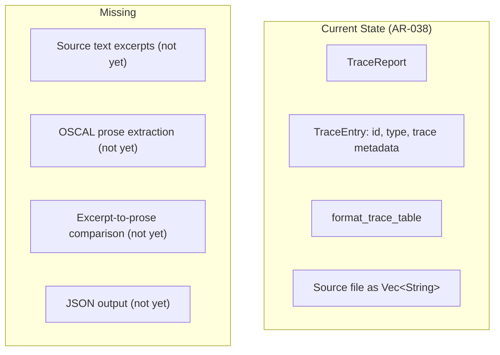
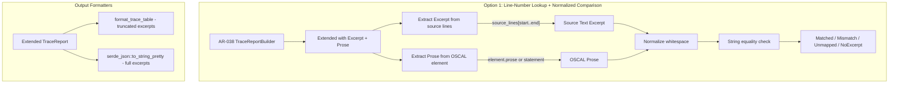
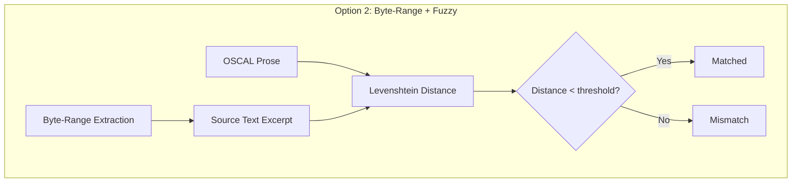
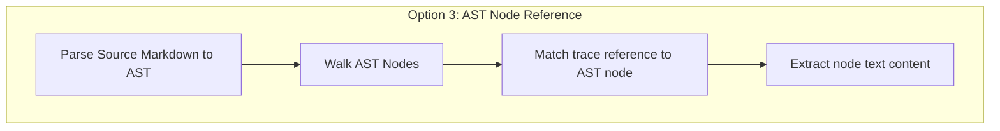
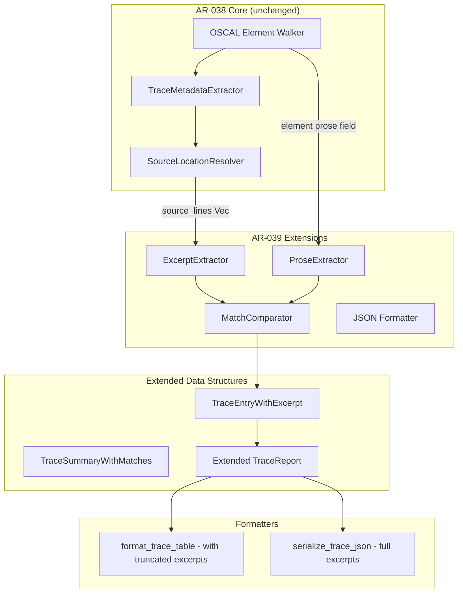
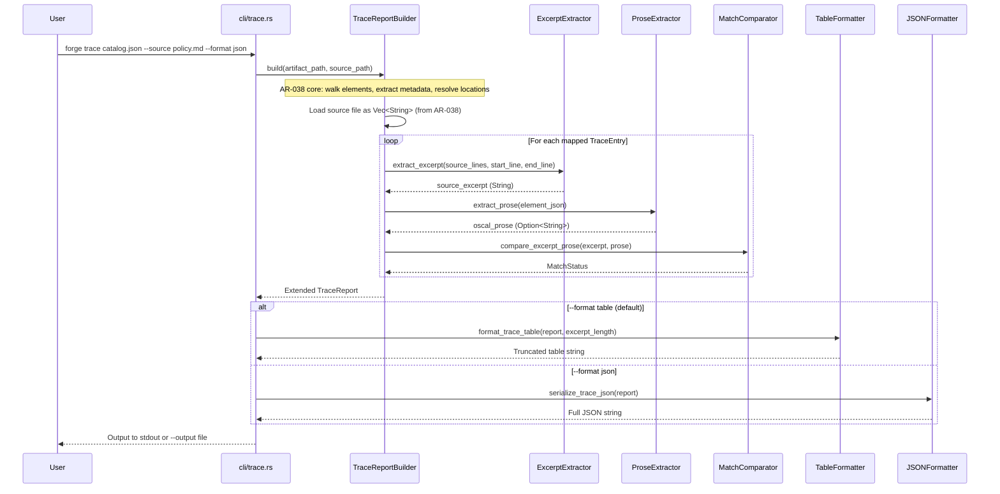
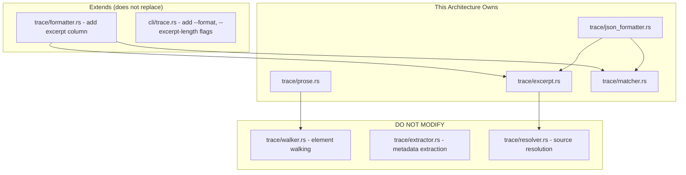

# 039-ar-traceability-report-excerpts

> **Document Type:** Architecture Review
> **Audience:** LLM agents, human reviewers
> **Status:** Proposed
> **Last Updated:** 2026-02-10 <!-- @auto -->
> **Owner:** Brian Luby <!-- @human-required -->
> **Deciders:** Brian Luby <!-- @human-required -->

---

## Review Tier Legend

| Marker | Tier | Speckit Behavior |
|--------|------|------------------|
| 🔴 `@human-required` | Human Generated | Prompt human to author; blocks until complete |
| 🟡 `@human-review` | LLM + Human Review | LLM drafts → prompt human to confirm/edit; blocks until confirmed |
| 🟢 `@llm-autonomous` | LLM Autonomous | LLM completes; no prompt; logged for audit |
| ⚪ `@auto` | Auto-generated | System fills (timestamps, links); no prompt |

---

## Document Completion Order

> ⚠️ **For LLM Agents:** Complete sections in this order. Do not fill downstream sections until upstream human-required inputs exist.

1. **Summary (Decision)** → requires human input first
2. **Context (Problem Space)** → requires human input
3. **Decision Drivers** → requires human input (prioritized)
4. **Driving Requirements** → extract from PRD, human confirms
5. **Options Considered** → LLM drafts after drivers exist, human reviews
6. **Decision (Selected + Rationale)** → requires human decision
7. **Implementation Guardrails** → LLM drafts, human reviews
8. **Everything else** → can proceed after decision is made

---

## Linkage ⚪ `@auto`

| Document | ID | Relationship |
|----------|-----|--------------|
| Parent PRD | [039-prd-traceability-report-excerpts](../PRD/039-prd-traceability-report-excerpts.md) | Requirements this architecture satisfies |
| Depends On | [038-ar-traceability-report](./038-ar-traceability-report.md) | Extends the core trace report architecture |
| Security Review | N/A | No new attack surface; extends existing file reads |
| Supersedes | — | N/A |
| Superseded By | — | |

---

## Summary

### Decision 🔴 `@human-required`
> Extend the AR-038 TraceReport with excerpt and prose fields using line-number lookup from the source file (already loaded by AR-038's SourceLocationResolver), add normalized string comparison for excerpt-to-prose match verification, and add a JSON serialization path using serde's `Serialize` derive alongside the existing text table formatter.

### TL;DR for Agents 🟡 `@human-review`
> WI-39 extends the AR-038 TraceReport struct with `source_excerpt`, `oscal_prose`, and `match_status` fields. Source excerpts are extracted by line-number range from the source file (already loaded as `Vec<String>` by AR-038). Prose is extracted from the OSCAL element's prose/statement fields. Match comparison uses normalized strings (trim + collapse whitespace). JSON output uses `#[derive(Serialize)]` on the report structs. Do NOT use byte-range extraction — use line numbers from trace metadata. Do NOT use exact string comparison — normalize whitespace before matching. Do NOT truncate excerpts in JSON output — only truncate in the text table formatter.

---

## Context

### Problem Space 🔴 `@human-required`
AR-038 produces a traceability report mapping OSCAL elements to source locations (section, paragraph, line number), but without the actual source text, a reviewer must manually open the source policy and navigate to each line. Additionally, there is no automated verification that the OSCAL prose faithfully matches the source text, and the report is only available as a text table (no programmatic consumption). WI-39 addresses three gaps: (1) include source text excerpts in each report entry, (2) verify that excerpts match OSCAL prose, and (3) add JSON output for downstream automation. The architectural challenge is extending the existing TraceReport cleanly (without refactoring AR-038) while adding excerpt extraction, prose comparison, and a second output format.

### Decision Scope 🟡 `@human-review`

**This AR decides:**
- How to extract source text excerpts from the source file using trace metadata line ranges
- How to extract OSCAL control statement prose for comparison
- The normalization and comparison algorithm for excerpt-to-prose matching
- How to add JSON output alongside the existing text table output
- How to extend AR-038's TraceReport without breaking the core report

**This AR does NOT decide:**
- Core trace report generation — decided in AR-038
- OSCAL element walking — decided in AR-038
- Trace metadata extraction — decided in AR-038
- HTML or rich-format output — deferred per PRD W-2

### Current State 🟢 `@llm-autonomous`
AR-038 defines the TraceReport struct with entries (element_id, element_type, trace metadata) and a text table formatter. The source file is already loaded as `Vec<String>` by the SourceLocationResolver. No excerpts, prose comparison, or JSON output exist.



### Driving Requirements 🟡 `@human-review`

| PRD Req ID | Requirement Summary | Architectural Implication |
|------------|---------------------|---------------------------|
| M-1 | Source text excerpts in each report entry | Need line-range extraction from source Vec<String> |
| M-2 | Compare excerpts with OSCAL prose, flag mismatches | Need prose extraction + normalized comparison |
| M-3 | `--format json` output option | Need Serialize derive on report structs + JSON formatter |
| M-4 | JSON includes element_id, element_type, source_section, source_line, source_excerpt, oscal_prose, match_status | Need extended TraceEntry with all fields |
| M-5 | JSON summary with totals + match/mismatch counts | Need extended TraceSummary |
| M-6 | Multi-line excerpts extracted as complete text | Need line-range (start to end) extraction |

**PRD Constraints inherited:**
- From AR-038: TraceReport as extensibility point
- From PRD Technical Constraints: serde + serde_json for JSON
- From constitution principle X: Simplicity & Pragmatism
- From constitution principle IV: TDD mandatory

---

## Decision Drivers 🔴 `@human-required`

1. **Extension cleanliness:** Must extend AR-038 without refactoring its core structures *(forward compatibility promise)*
2. **Comparison accuracy:** Minimize false positives and false negatives in excerpt-to-prose matching *(PRD M-2)*
3. **JSON completeness:** Full data in JSON; no truncation *(PRD M-4, M-5)*
4. **Table readability:** Long excerpts must not break table layout *(PRD S-1)*
5. **Simplicity:** Use what is already available (serde, source Vec<String>) *(constitution principle X)*

---

## Options Considered 🟡 `@human-review`

### Option 0: Status Quo / Do Nothing

**Description:** Leave the AR-038 trace report as location-only. Users manually cross-reference source text.

| Driver | Rating | Notes |
|--------|--------|-------|
| Extension cleanliness | N/A | No extension |
| Comparison accuracy | ❌ Poor | No comparison at all |
| JSON completeness | ❌ Poor | No JSON output |
| Table readability | N/A | No change |
| Simplicity | ✅ Good | No code to write |

**Why not viable:** Without excerpts, the traceability report requires manual cross-referencing for every element. Without JSON output, downstream automation tools cannot consume traceability data. Fails PRD M-1 through M-6.

---

### Option 1: Line-Number Lookup with Normalized String Comparison (Recommended)

**Description:** Extend TraceEntry with `source_excerpt`, `oscal_prose`, and `match_status` fields. Extract excerpts by slicing the source `Vec<String>` using the line range from trace metadata (already available from AR-038's SourceLocationResolver). Extract OSCAL prose from the element's `prose` or `statement` fields via serde_json. Compare normalized strings (trim whitespace, collapse multiple spaces to single space). Add `#[derive(Serialize)]` to report structs for JSON output.



| Driver | Rating | Notes |
|--------|--------|-------|
| Extension cleanliness | ✅ Good | Adds fields to TraceEntry; does not change AR-038 walker or builder structure |
| Comparison accuracy | ✅ Good | Normalized comparison handles whitespace differences; clear match/mismatch classification |
| JSON completeness | ✅ Good | Serialize derive provides complete JSON with all fields |
| Table readability | ✅ Good | Truncation with ellipsis in table; full text in JSON |
| Simplicity | ✅ Good | Line-based extraction reuses existing Vec<String>; serde Serialize is one derive |

**Pros:**
- Line-number extraction is O(1) per entry — source file is already loaded as Vec<String>
- Normalized string comparison is simple, deterministic, and covers common whitespace variations
- Serialize derive on structs automatically generates JSON output with correct field names
- Truncation is a formatting concern only — data layer always has full excerpts
- MatchStatus enum provides clear classification for each entry

**Cons:**
- Line-number extraction depends on accurate line ranges in trace metadata (set by WI-17)
- Normalized comparison may miss non-whitespace formatting differences (e.g., Markdown → plain text)
- Four-state MatchStatus enum requires handling all cases in formatters

---

### Option 2: Byte-Range Extraction with Fuzzy Matching

**Description:** Extract source text by byte offset ranges stored in trace metadata, rather than line numbers. Use a fuzzy string matching algorithm (edit distance / Levenshtein) for excerpt-to-prose comparison.



| Driver | Rating | Notes |
|--------|--------|-------|
| Extension cleanliness | ⚠️ Medium | Requires different source file representation (bytes vs lines) |
| Comparison accuracy | ⚠️ Medium | Fuzzy matching adds configurable threshold complexity; may over-match |
| JSON completeness | ✅ Good | Same JSON output regardless of extraction method |
| Table readability | ✅ Good | Same truncation approach |
| Simplicity | ❌ Poor | Byte offsets are fragile (encoding-dependent); fuzzy matching adds dependency |

**Pros:**
- Byte offsets could capture partial-line text more precisely
- Fuzzy matching handles minor text transformations

**Cons:**
- WI-17 trace metadata uses line numbers, not byte offsets — this approach requires metadata format change
- Byte offsets are encoding-dependent (UTF-8 multi-byte characters)
- Fuzzy matching requires additional crate (edit-distance or strsim) and threshold tuning
- Threshold-based matching is non-deterministic from user perspective — "how close is close enough?"
- Violates constitution principle X (over-engineering for a match/mismatch flag)

---

### Option 3: AST Node Reference

**Description:** Instead of extracting text by line number, reference AST nodes from the parsed Markdown source. Walk the Markdown AST to find the node corresponding to each trace reference, then extract the node's text content.



| Driver | Rating | Notes |
|--------|--------|-------|
| Extension cleanliness | ❌ Poor | Requires Markdown AST parser; changes source file representation fundamentally |
| Comparison accuracy | ✅ Good | AST nodes provide semantically precise text extraction |
| JSON completeness | ✅ Good | Same JSON output |
| Table readability | ✅ Good | Same truncation approach |
| Simplicity | ❌ Poor | Requires pulldown-cmark or similar parser; AST node matching is complex |

**Pros:**
- Semantically precise — extracts exactly the text node that produced the OSCAL element
- Resilient to minor source file edits (AST structure is more stable than line numbers)

**Cons:**
- WI-17 trace metadata uses line numbers, not AST node references — requires metadata format change
- Adds pulldown-cmark as a dependency for this one feature
- AST node matching is significantly more complex than line-number indexing
- Over-engineered for the current use case (line numbers are sufficient)
- Violates constitution principle X (YAGNI)

---

## Decision

### Selected Option 🔴 `@human-required`
> **Option 1: Line-Number Lookup with Normalized String Comparison**

### Rationale 🔴 `@human-required`
Option 1 is the natural extension of AR-038. The source file is already loaded as `Vec<String>` by the SourceLocationResolver, so line-range extraction is an O(1) slice operation — zero additional file I/O or parsing. WI-17 trace metadata already provides line numbers, so no metadata format changes are needed (unlike Options 2 and 3). Normalized string comparison handles the common case (whitespace differences between Markdown source and OSCAL prose) without introducing fuzzy matching complexity (Option 2) or AST parsing overhead (Option 3). JSON output via serde Serialize derive is a one-line annotation that provides complete data with no custom serialization code. The truncation-only-in-table pattern keeps the data layer clean while maintaining table readability.

#### Simplest Implementation Comparison 🟡 `@human-review`

| Aspect | Simplest Possible | Selected Option | Justification for Complexity |
|--------|-------------------|-----------------|------------------------------|
| Excerpt extraction | source_lines[line_number] single line | source_lines[start..end] line range | PRD M-6 requires multi-line excerpts |
| Prose comparison | Exact string equality | Normalized comparison (trim + collapse whitespace) | PRD S-2 requires normalization to avoid false mismatches |
| JSON output | Manual JSON string construction | #[derive(Serialize)] + serde_json | Correct, maintainable, type-safe JSON; negligible additional complexity |
| Match status | Boolean (match/no-match) | Four-state enum (Matched, Mismatch, Unmapped, NoExcerpt) | PRD M-2 requires mismatch flagging; unmapped/no-excerpt are distinct error states |

**Complexity justified by:** Multi-line extraction (PRD M-6), normalized comparison (PRD S-2), and four-state match classification (PRD M-2 + unmapped handling from AR-038 M-6) are all direct PRD requirements.

### Architecture Diagram 🟡 `@human-review`



---

## Technical Specification

### Component Overview 🟡 `@human-review`

| Component | Responsibility | Interface | Dependencies |
|-----------|---------------|-----------|--------------|
| trace/excerpt.rs | Extract source text by line range from Vec<String> | Pure function | None |
| trace/prose.rs | Extract OSCAL prose/statement from element JSON | Pure function | serde_json |
| trace/matcher.rs | Normalize and compare excerpt vs prose | Pure function | None |
| trace/json_formatter.rs | Serialize TraceReport to JSON | Pure function | serde, serde_json |
| trace/formatter.rs (extended) | Extended table formatter with excerpt column | Pure function | std::fmt |
| cli/trace.rs (extended) | Add --format and --excerpt-length flags | CLI subcommand | clap |

### Data Flow 🟢 `@llm-autonomous`



### Interface Definitions 🟡 `@human-review`

```rust
use serde::{Deserialize, Serialize};
use std::path::{Path, PathBuf};

/// Match status between source excerpt and OSCAL prose
#[derive(Debug, Clone, Serialize, Deserialize, PartialEq)]
#[serde(rename_all = "snake_case")]
pub enum MatchStatus {
    /// Excerpt and prose match after normalization
    Matched,
    /// Excerpt and prose differ
    Mismatch,
    /// No trace metadata for this element; cannot compare
    Unmapped,
    /// Trace metadata exists but excerpt could not be extracted
    /// (e.g., source line out of range)
    NoExcerpt,
}

/// Extended trace entry with source excerpt and prose comparison
#[derive(Debug, Clone, Serialize)]
pub struct TraceEntryWithExcerpt {
    pub element_id: String,
    pub element_type: String,
    pub source_section: Option<String>,
    pub source_paragraph: Option<String>,
    pub source_line: Option<usize>,
    pub mapped: bool,
    /// Source text excerpt extracted from the source policy
    pub source_excerpt: Option<String>,
    /// OSCAL control statement prose
    pub oscal_prose: Option<String>,
    /// Match status between excerpt and prose
    pub match_status: MatchStatus,
}

/// Extended summary with match statistics
#[derive(Debug, Clone, Serialize)]
pub struct TraceSummaryWithMatches {
    pub total_elements: usize,
    pub mapped_elements: usize,
    pub unmapped_elements: usize,
    pub matched_elements: usize,
    pub mismatched_elements: usize,
    pub coverage_percent: f64,
}

/// Extended trace report (JSON-serializable)
#[derive(Debug, Serialize)]
pub struct TraceReportFull {
    pub artifact_path: PathBuf,
    pub source_path: PathBuf,
    pub artifact_type: String,
    pub entries: Vec<TraceEntryWithExcerpt>,
    pub summary: TraceSummaryWithMatches,
}

/// Extract source text excerpt for a given line range
///
/// Lines are 1-indexed (matching trace metadata convention).
/// Returns None if start_line is out of range.
/// Returns the joined text of lines [start_line, end_line] inclusive.
pub fn extract_excerpt(
    source_lines: &[String],
    start_line: usize,
    end_line: usize,
) -> Option<String>;

/// Extract OSCAL prose from an element's prose or statement field
pub fn extract_prose(
    element: &serde_json::Value,
) -> Option<String>;

/// Normalize a string for comparison: trim whitespace, collapse
/// multiple whitespace characters to a single space
pub fn normalize_for_comparison(text: &str) -> String;

/// Compare source excerpt with OSCAL prose using normalized comparison
pub fn compare_excerpt_prose(
    excerpt: &str,
    prose: &str,
) -> MatchStatus;

/// Serialize the full trace report as pretty-printed JSON
pub fn serialize_trace_json(
    report: &TraceReportFull,
) -> Result<String, ForgeError>;

/// Format trace report as text table with truncated excerpts
///
/// excerpt_max_len controls truncation (0 = no truncation)
pub fn format_trace_table_with_excerpts(
    report: &TraceReportFull,
    excerpt_max_len: usize,
) -> String;
```

### Key Algorithms/Patterns 🟡 `@human-review`

**Pattern:** Line-range excerpt extraction
```
extract_excerpt(source_lines, start_line, end_line):
  1. Convert 1-indexed line numbers to 0-indexed array indices
  2. If start_index >= source_lines.len() → return None
  3. Clamp end_index to source_lines.len() - 1
  4. Join source_lines[start_index..=end_index] with newline
  5. Return Some(joined_text)
```

**Pattern:** Normalized string comparison
```
compare_excerpt_prose(excerpt, prose):
  1. normalized_excerpt = normalize_for_comparison(excerpt)
  2. normalized_prose = normalize_for_comparison(prose)
  3. If normalized_excerpt == normalized_prose → Matched
  4. Else → Mismatch

normalize_for_comparison(text):
  1. Trim leading and trailing whitespace
  2. Replace all sequences of whitespace (spaces, tabs, newlines) with single space
  3. Return normalized text
```

**Pattern:** Excerpt truncation in table output
```
truncate_excerpt(text, max_len):
  1. If max_len == 0 → return text as-is (no truncation)
  2. Replace newlines with " | " for single-line display
  3. If text.len() <= max_len → return text
  4. Return text[..max_len-3] + "..."
```

---

## Constraints & Boundaries

### Technical Constraints 🟡 `@human-review`

**Inherited from AR-038:**
- TraceReport as extensibility point
- Source file loaded as Vec<String> by SourceLocationResolver
- WI-17 trace metadata prop names as shared constants
- clap 4.x for CLI

**Inherited from PRD:**
- serde + serde_json for JSON output
- thiserror for error types
- TDD mandatory

**Added by this Architecture:**
- `#[derive(Serialize)]` on all report structs (enables JSON output)
- MatchStatus enum with serde rename_all for JSON field naming
- Normalized string comparison using only stdlib (no fuzzy matching crate)
- Default excerpt truncation length of 80 characters in table output
- Excerpts are never truncated in JSON output

### Architectural Boundaries 🟡 `@human-review`



- **Owns:** excerpt extraction, prose extraction, match comparison, JSON formatter
- **Extends:** trace table formatter (add excerpt column), CLI (add --format, --excerpt-length)
- **Must Not Touch:** Element walker, metadata extractor, source resolver (AR-038 core)

### Implementation Guardrails 🟡 `@human-review`

> ⚠️ **Critical for LLM Agents:**

- [x] **DO NOT** use byte-range extraction — use line numbers from trace metadata *(consistency with WI-17)*
- [x] **DO NOT** use exact string comparison without normalization — whitespace differences are common *(PRD S-2)*
- [x] **DO NOT** truncate excerpts in JSON output — JSON is for programmatic consumption *(PRD M-4)*
- [x] **DO NOT** modify AR-038's core walker, extractor, or resolver — extend only *(architecture boundary)*
- [x] **MUST** include full untruncated excerpts in JSON output *(PRD M-4)*
- [x] **MUST** classify all entries with MatchStatus (Matched, Mismatch, Unmapped, NoExcerpt) *(PRD M-2)*
- [x] **MUST** use `#[derive(Serialize)]` for JSON output — no manual JSON construction *(reliability)*

---

## Consequences 🟡 `@human-review`

### Positive
- Clean extension of AR-038 — no refactoring of core components
- Line-number extraction is O(1) using the already-loaded Vec<String>
- Normalized comparison handles whitespace differences with zero additional dependencies
- Serialize derive provides type-safe, complete JSON with correct field naming
- Four-state MatchStatus provides unambiguous classification for every entry

### Negative
- Normalized comparison will not catch non-whitespace formatting differences (e.g., Markdown formatting stripped during conversion)
- Table output with excerpt column may be wide (80+ character column)
- Adding Serialize derive to report structs adds serde as a compile-time dependency for the data layer

### Risks & Mitigations

| Risk | Likelihood | Impact | Mitigation |
|------|------------|--------|------------|
| Source file modified since conversion (wrong excerpts) | Med | Med | Check file hash (AR-038 S-3); warn if mismatch; proceed but flag results |
| Normalized comparison produces false matches (text transformed beyond whitespace) | Low | Low | Start with normalized comparison; can add stricter comparison in future WI |
| Long excerpts make table output unwieldy | Med | Low | Default truncation to 80 chars; --excerpt-length flag for user control; full text in JSON |

---

## Implementation Guidance

### Suggested Implementation Order 🟢 `@llm-autonomous`
1. Define `MatchStatus` enum with Serialize derive
2. Implement `extract_excerpt` function (line-range from Vec<String>)
3. Implement `extract_prose` function (from serde_json::Value)
4. Implement `normalize_for_comparison` function
5. Implement `compare_excerpt_prose` function
6. Extend `TraceEntry` with excerpt, prose, and match_status fields → `TraceEntryWithExcerpt`
7. Extend `TraceSummary` with match/mismatch counts → `TraceSummaryWithMatches`
8. Add Serialize derive to all report structs
9. Implement `serialize_trace_json` function
10. Extend `format_trace_table` to include truncated excerpt column
11. Add `--format table|json` and `--excerpt-length <n>` flags to cli/trace.rs
12. Write unit tests for each component; integration test with fixture

### Testing Strategy 🟢 `@llm-autonomous`

| Layer | Test Type | Coverage Target | Notes |
|-------|-----------|-----------------|-------|
| Unit | extract_excerpt (single line) | 100% | Normal case |
| Unit | extract_excerpt (multi-line range) | 100% | PRD M-6 |
| Unit | extract_excerpt (out of range) | 100% | Returns None |
| Unit | extract_prose (prose field exists) | 100% | Normal case |
| Unit | extract_prose (no prose field) | 100% | Returns None |
| Unit | normalize_for_comparison | 100% | Whitespace variations: tabs, newlines, multiple spaces |
| Unit | compare_excerpt_prose (exact match) | 100% | Matched |
| Unit | compare_excerpt_prose (whitespace difference) | 100% | Matched after normalization |
| Unit | compare_excerpt_prose (real difference) | 100% | Mismatch |
| Unit | serialize_trace_json | 100% | Valid JSON with all fields |
| Unit | format_trace_table_with_excerpts (truncation) | 100% | Excerpt truncated at boundary |
| Integration | Full report with excerpts and JSON | Happy path | End-to-end with fixture |

### Reference Implementations 🟡 `@human-review`
- AR-038 TraceReport structure for base fields *(internal)*
- serde_json Serialize derive documentation *(external — requires human approval)*

### Anti-patterns to Avoid 🟡 `@human-review`
- **Don't:** Extract excerpts by byte offset
  - **Why:** WI-17 trace metadata uses line numbers; byte offsets are encoding-dependent
  - **Instead:** Use line-number range from trace metadata against Vec<String>
- **Don't:** Use exact string comparison without normalization
  - **Why:** Whitespace differences between Markdown and OSCAL prose are common
  - **Instead:** Normalize both strings before comparison
- **Don't:** Truncate excerpts in the data layer (TraceReport struct)
  - **Why:** JSON output needs full text; truncation is a presentation concern
  - **Instead:** Truncate only in the table formatter function

---

## Compliance & Cross-cutting Concerns

### Security Considerations 🟡 `@human-review`
- Authentication: N/A — local CLI tool
- Authorization: N/A
- Data handling: Excerpts contain verbatim policy text (may be sensitive); JSON output should be treated with same sensitivity as source policy

### Observability 🟢 `@llm-autonomous`
- **Logging:** Log match/mismatch statistics at INFO level
- **Logging:** Log individual mismatches at DEBUG level (with element ID)
- **Metrics:** N/A for CLI tool
- **Tracing:** N/A for CLI tool

### Error Handling Strategy 🟢 `@llm-autonomous`
```
Error Category → Handling Approach
├── Excerpt extraction: line out of range → Set match_status to NoExcerpt; emit warning
├── Prose extraction: no prose field → Set oscal_prose to None; match_status reflects it
├── JSON serialization failure → Descriptive error, exit code 1
├── Unmapped element → source_excerpt and oscal_prose are None; match_status = Unmapped
└── --excerpt-length invalid value → CLI argument error via clap
```

---

## Migration Plan (if applicable) 🟡 `@human-review`

N/A — extension of AR-038. The base TraceReport can be upgraded to TraceReportFull by adding fields. Existing text table output remains available as the default format.

### Rollback Plan 🔴 `@human-required`

N/A — additive extension. The excerpt and JSON features can be removed without affecting the base trace report functionality from AR-038. The --format flag simply routes to the appropriate formatter.

---

## Open Questions 🟡 `@human-review`

No open questions for this work item.

---

## Changelog ⚪ `@auto`

| Version | Date | Author | Changes |
|---------|------|--------|---------|
| 0.1 | 2026-02-10 | LLM (Claude) | Initial proposal |

---

## Decision Record ⚪ `@auto`

| Date | Event | Details |
|------|-------|---------|
| 2026-02-10 | Proposed | Initial draft created from PRD 039 |

---

## Traceability Matrix 🟢 `@llm-autonomous`

| PRD Req ID | Decision Driver | Option Rating | Component | Notes |
|------------|-----------------|---------------|-----------|-------|
| M-1 | Extension cleanliness | Option 1: ✅ | trace/excerpt.rs | Line-range extraction from Vec<String> |
| M-2 | Comparison accuracy | Option 1: ✅ | trace/matcher.rs | Normalized string comparison |
| M-3 | JSON completeness | Option 1: ✅ | trace/json_formatter.rs | Serialize derive + serde_json |
| M-4 | JSON completeness | Option 1: ✅ | TraceEntryWithExcerpt | All required fields in struct |
| M-5 | JSON completeness | Option 1: ✅ | TraceSummaryWithMatches | Match/mismatch counts in summary |
| M-6 | Extension cleanliness | Option 1: ✅ | trace/excerpt.rs | source_lines[start..end] range extraction |
| S-1 | Table readability | Option 1: ✅ | trace/formatter.rs | Truncation with --excerpt-length override |
| S-2 | Comparison accuracy | Option 1: ✅ | trace/matcher.rs | Whitespace normalization before comparison |
| S-3 | Table readability | Option 1: ✅ | trace/formatter.rs | Mismatch entries prefixed with warning marker |

---

## Review Checklist 🟢 `@llm-autonomous`

Before marking as Accepted:
- [x] All PRD Must Have requirements appear in Driving Requirements
- [x] Option 0 (Status Quo) is documented
- [x] Simplest Implementation comparison is completed
- [x] Decision drivers are prioritized and addressed
- [x] At least 2 options were seriously considered
- [x] Constraints distinguish inherited vs. new
- [x] Component names are consistent across all diagrams and tables
- [x] Implementation guardrails reference specific PRD constraints
- [x] Rollback triggers and authority are defined (N/A — additive extension)
- [x] Security review is linked or N/A documented
- [x] No open questions blocking implementation
