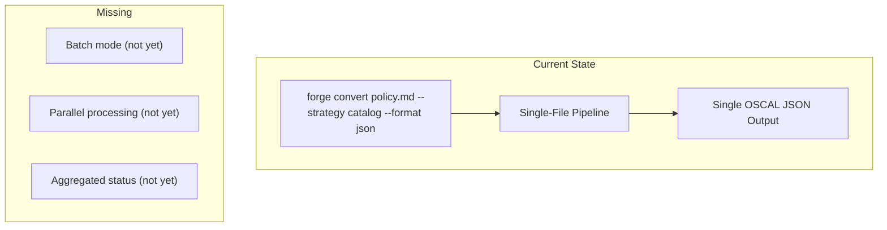
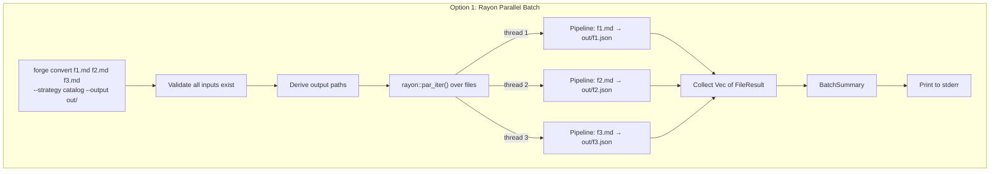
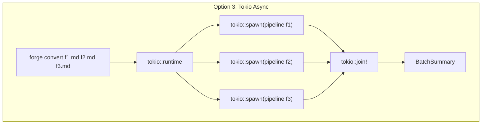
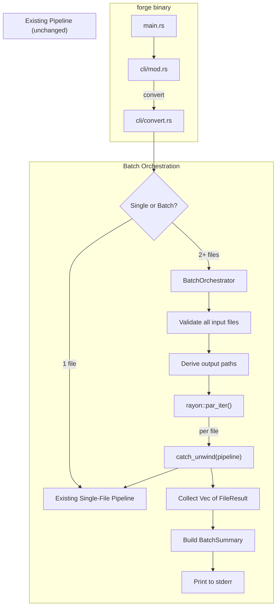
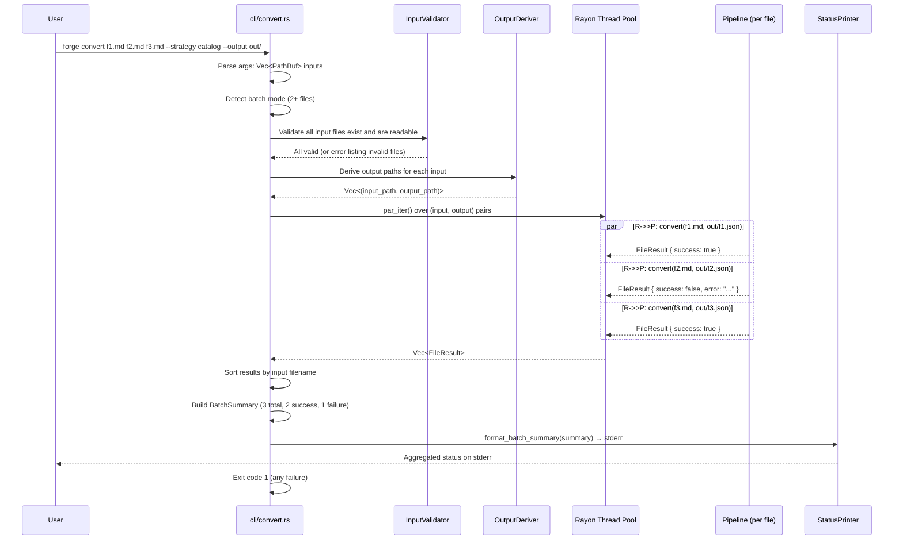
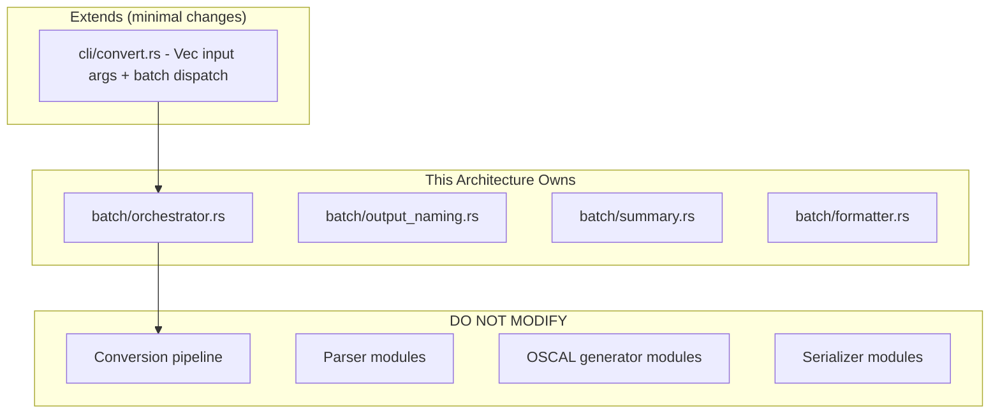

# 040-ar-batch-conversion

> **Document Type:** Architecture Review
> **Audience:** LLM agents, human reviewers
> **Status:** Proposed
> **Last Updated:** 2026-02-10 <!-- @auto -->
> **Owner:** Brian Luby <!-- @human-required -->
> **Deciders:** Brian Luby <!-- @human-required -->

---

## Review Tier Legend

| Marker | Tier | Speckit Behavior |
|--------|------|------------------|
| 🔴 `@human-required` | Human Generated | Prompt human to author; blocks until complete |
| 🟡 `@human-review` | LLM + Human Review | LLM drafts → prompt human to confirm/edit; blocks until confirmed |
| 🟢 `@llm-autonomous` | LLM Autonomous | LLM completes; no prompt; logged for audit |
| ⚪ `@auto` | Auto-generated | System fills (timestamps, links); no prompt |

---

## Document Completion Order

> ⚠️ **For LLM Agents:** Complete sections in this order. Do not fill downstream sections until upstream human-required inputs exist.

1. **Summary (Decision)** → requires human input first
2. **Context (Problem Space)** → requires human input
3. **Decision Drivers** → requires human input (prioritized)
4. **Driving Requirements** → extract from PRD, human confirms
5. **Options Considered** → LLM drafts after drivers exist, human reviews
6. **Decision (Selected + Rationale)** → requires human decision
7. **Implementation Guardrails** → LLM drafts, human reviews
8. **Everything else** → can proceed after decision is made

---

## Linkage ⚪ `@auto`

| Document | ID | Relationship |
|----------|-----|--------------|
| Parent PRD | [040-prd-batch-conversion](../PRD/040-prd-batch-conversion.md) | Requirements this architecture satisfies |
| Security Review | N/A | No new attack surface; extends existing file processing |
| Supersedes | — | N/A |
| Superseded By | — | |

---

## Summary

### Decision 🔴 `@human-required`
> Use `rayon::par_iter()` for parallel batch conversion with per-file error isolation via `catch_unwind`, deterministic output filename derivation, and aggregated status summary printed to stderr. The existing single-file conversion pipeline is treated as a pure function invoked per file — no modifications to the pipeline itself.

### TL;DR for Agents 🟡 `@human-review`
> The `forge convert` subcommand is extended to accept multiple input file paths. When 2+ files are provided, batch mode activates: input files are validated upfront, output paths are derived deterministically (`{stem}.{format}` in the output directory), and files are processed in parallel via `rayon::par_iter()`. Each file's conversion is isolated — a failure in one does not affect others. After all files are processed, an aggregated status summary (successes, failures, total time) is printed to stderr. Do NOT modify the single-file pipeline to be "batch-aware" — wrap it, do not change it. Do NOT print OSCAL output to stdout in batch mode — require file output. Do NOT use `unwrap()` or `expect()` in per-file processing — panics terminate the entire batch.

---

## Context

### Problem Space 🔴 `@human-required`
Organizations maintain multiple policy documents that all need conversion to OSCAL. The current single-file CLI requires separate invocations per document, each with repeated flags, with no parallelism and no aggregated status. Shell scripting can work around this but places the burden on users and does not provide error isolation or status aggregation. The architectural challenge is: how to orchestrate parallel processing of independent file conversions while maintaining error isolation (one failure cannot crash others), deterministic output naming (no file collisions), and backward compatibility (single-file mode is unchanged).

### Decision Scope 🟡 `@human-review`

**This AR decides:**
- How to extend the CLI to accept multiple input files
- The parallelism strategy (library, thread pool, concurrency control)
- Output filename derivation and collision avoidance
- Error isolation and aggregated status reporting
- Single-file backward compatibility guarantee

**This AR does NOT decide:**
- Single-file conversion pipeline internals — stable from WI-35
- Cross-document merging or linking — out of scope per PRD
- Batch traceability reports — deferred per PRD
- Progress bars or streaming status — deferred per PRD W-3

### Current State 🟢 `@llm-autonomous`
The `forge convert` subcommand accepts a single input file path and produces a single OSCAL artifact. The conversion pipeline (parse → transform → generate → serialize) is a deterministic, pure function of the input file and strategy/format flags. No batch mode exists.



### Driving Requirements 🟡 `@human-review`

| PRD Req ID | Requirement Summary | Architectural Implication |
|------------|---------------------|---------------------------|
| M-1 | Accept multiple input file paths | Need Vec<PathBuf> positional argument in clap |
| M-2 | Each file independently converted | Need per-file pipeline invocation |
| M-3 | Output files in --output directory with derived names | Need deterministic filename derivation with collision avoidance |
| M-4 | Aggregated status to stderr | Need result collection + summary formatter |
| M-5 | One failure does not prevent others | Need error isolation per file |
| M-6 | Non-zero exit on any failure | Need exit code logic based on batch results |

**PRD Constraints inherited:**
- From constitution principle X: Simplicity & Pragmatism — YAGNI
- From constitution principle IV: TDD mandatory
- From constitution principle VIII: thiserror for errors
- From PRD: rayon for parallelism

---

## Decision Drivers 🔴 `@human-required`

1. **Error isolation:** One file failure must never crash or abort other conversions *(PRD M-5, critical)*
2. **Backward compatibility:** Single-file mode behavior must be unchanged *(existing user expectations)*
3. **Parallelism simplicity:** Parallel processing must be easy to implement and debug *(constitution principle X)*
4. **Output predictability:** Output filenames must be deterministic and collision-free *(PRD M-3)*
5. **Status clarity:** Aggregated summary must clearly show per-file results *(PRD M-4)*

---

## Options Considered 🟡 `@human-review`

### Option 0: Status Quo / Do Nothing

**Description:** Users invoke `forge convert` once per file, manually or via shell scripts.

| Driver | Rating | Notes |
|--------|--------|-------|
| Error isolation | N/A | Each invocation is isolated (separate process) |
| Backward compatibility | ✅ Good | No changes |
| Parallelism simplicity | N/A | No parallelism (user could use xargs -P) |
| Output predictability | N/A | User controls output per invocation |
| Status clarity | ❌ Poor | No aggregated status; user must check each invocation |

**Why not viable:** Requires users to repeat flags for every file, provides no aggregated status, and offers no parallelism. Fails PRD M-1 through M-6.

---

### Option 1: Parallel Processing with Rayon (Recommended)

**Description:** Extend the clap `convert` subcommand to accept `Vec<PathBuf>` for input files. When 2+ files are provided, enter batch mode: validate all inputs, derive output paths, process files in parallel via `rayon::par_iter()`, collect results, and print aggregated status to stderr. The existing single-file pipeline is called as a function for each file — no modifications to the pipeline.



| Driver | Rating | Notes |
|--------|--------|-------|
| Error isolation | ✅ Good | rayon + catch_unwind isolates panics; Result type isolates errors |
| Backward compatibility | ✅ Good | Single-file path = existing behavior; Vec<PathBuf> with one element = same behavior |
| Parallelism simplicity | ✅ Good | rayon::par_iter() is one line change from sequential iter() |
| Output predictability | ✅ Good | Deterministic: {stem}.{format} in output dir; collision avoidance via suffix |
| Status clarity | ✅ Good | Structured BatchSummary with per-file results printed to stderr |

**Pros:**
- rayon provides thread pool management, work stealing, and automatic CPU core detection
- `par_iter()` is a drop-in replacement for `iter()` — trivial to switch between sequential and parallel
- Per-file error isolation via Result + catch_unwind prevents one file from affecting others
- Single-file mode is unchanged (Vec<PathBuf> with one element bypasses batch logic)
- Status on stderr keeps stdout clean for OSCAL output in single-file mode

**Cons:**
- rayon adds a dependency (~130KB, well-maintained, MIT/Apache-2.0)
- Parallel output ordering is non-deterministic (mitigated by sorting results by filename)
- rayon thread pool is process-global (but this is acceptable for a CLI tool)

---

### Option 2: Sequential Loop (No Parallelism)

**Description:** Process files sequentially in a simple for loop, collecting results into a BatchSummary. No parallel processing.


| Driver | Rating | Notes |
|--------|--------|-------|
| Error isolation | ✅ Good | Each iteration is independent; Result type isolates errors |
| Backward compatibility | ✅ Good | Same as Option 1 |
| Parallelism simplicity | ✅ Good | No parallelism to debug — simplest possible |
| Output predictability | ✅ Good | Sequential ordering is deterministic |
| Status clarity | ✅ Good | Same summary approach |

**Pros:**
- Zero additional dependencies
- Deterministic ordering
- Simplest implementation

**Cons:**
- No performance benefit for large batches (10 files takes 10x single-file time)
- Fails PRD S-1 (parallel processing for performance)
- Does not meet User Story 3 (parallel processing benefit)

---

### Option 3: Async Processing with Tokio

**Description:** Use the tokio async runtime for concurrent file processing with async I/O.



| Driver | Rating | Notes |
|--------|--------|-------|
| Error isolation | ✅ Good | Each task is independent |
| Backward compatibility | ⚠️ Medium | tokio runtime changes the execution model globally |
| Parallelism simplicity | ❌ Poor | Async introduces colored functions, Pin/Future complexity, runtime dependency |
| Output predictability | ✅ Good | Results collected via join |
| Status clarity | ✅ Good | Same summary approach |

**Pros:**
- Async I/O could benefit I/O-bound workloads
- tokio is a mature runtime

**Cons:**
- The FORGE conversion pipeline is CPU-bound (parsing, transforming), not I/O-bound — async provides no benefit over rayon's thread-level parallelism
- tokio is a much heavier dependency (~5MB, 200+ transitive deps) than rayon (~130KB)
- Async infects the entire call chain (colored function problem) — would require making the pipeline async
- Over-engineered for a CLI tool that processes files (constitution principle X, YAGNI)
- Violates constitution principle II — Rust-first, strategic dependencies only

---

## Decision

### Selected Option 🔴 `@human-required`
> **Option 1: Parallel Processing with Rayon**

### Rationale 🔴 `@human-required`
Option 1 provides the optimal balance of simplicity, performance, and error isolation. Rayon's `par_iter()` is a one-line replacement for sequential iteration, provides automatic thread pool management with CPU core detection, and handles work-stealing for uneven file sizes. The FORGE pipeline is CPU-bound (parsing and transformation), making thread-level parallelism (rayon) the correct concurrency model — async (Option 3) provides no benefit for CPU-bound work and adds massive complexity. Sequential processing (Option 2) meets correctness requirements but fails the parallel processing expectations (PRD S-1, User Story 3). Error isolation is achieved through the combination of `Result` types (for recoverable errors) and `catch_unwind` (for unexpected panics in the pipeline), ensuring one file failure cannot affect others.

#### Simplest Implementation Comparison 🟡 `@human-review`

| Aspect | Simplest Possible | Selected Option | Justification for Complexity |
|--------|-------------------|-----------------|------------------------------|
| Multi-file argument | Vec<PathBuf> in clap | Vec<PathBuf> in clap | No additional complexity |
| Processing | Sequential for loop | rayon::par_iter() | PRD S-1 requires parallel processing; par_iter is one line change |
| Error isolation | Result<> per iteration | Result + catch_unwind | Pipeline may panic on unexpected input; catch_unwind prevents batch abort |
| Output naming | {stem}.{format} | {stem}.{format} + collision suffix | PRD EC-3 requires collision avoidance for same-name files from different dirs |
| Status | println! count | Structured BatchSummary to stderr | PRD M-4 requires per-file results; PRD S-4 requires total time |

**Complexity justified by:** Parallel processing (PRD S-1), panic isolation (PRD M-5), filename collision avoidance (PRD EC-3), and structured status summary (PRD M-4, S-4) are all direct requirements.

### Architecture Diagram 🟡 `@human-review`



---

## Technical Specification

### Component Overview 🟡 `@human-review`

| Component | Responsibility | Interface | Dependencies |
|-----------|---------------|-----------|--------------|
| cli/convert.rs (extended) | Accept multiple positional args; dispatch to single or batch | CLI subcommand | clap, BatchOrchestrator |
| batch/orchestrator.rs | Validate inputs, derive outputs, dispatch parallel processing | Library function | rayon, pipeline |
| batch/output_naming.rs | Derive output filenames with collision avoidance | Pure function | std::path |
| batch/summary.rs | FileResult and BatchSummary data structures | Structs | std::time |
| batch/formatter.rs | Format BatchSummary as human-readable status | Pure function | std::fmt |

### Data Flow 🟢 `@llm-autonomous`



### Interface Definitions 🟡 `@human-review`

```rust
use std::path::{Path, PathBuf};
use std::time::{Duration, Instant};

/// Result of converting a single file in a batch
#[derive(Debug)]
pub struct FileResult {
    /// Path to the input file
    pub input_path: PathBuf,
    /// Path to the generated output file (if successful)
    pub output_path: Option<PathBuf>,
    /// Whether the conversion succeeded
    pub success: bool,
    /// Error message if conversion failed
    pub error_message: Option<String>,
    /// Duration of this file's conversion
    pub duration: Duration,
}

/// Summary of a batch conversion run
#[derive(Debug)]
pub struct BatchSummary {
    /// Total files in batch
    pub total_files: usize,
    /// Number of successful conversions
    pub succeeded: usize,
    /// Number of failed conversions
    pub failed: usize,
    /// Total wall-clock duration of the batch
    pub total_duration: Duration,
    /// Per-file results, sorted by input filename
    pub results: Vec<FileResult>,
}

/// Run batch conversion on multiple input files
///
/// Processes files in parallel using rayon with the specified
/// parallelism level. Each file is converted independently;
/// a failure in one does not affect others.
pub fn run_batch_conversion(
    input_paths: &[PathBuf],
    strategy: &str,
    format: &str,
    output_dir: Option<&Path>,
    parallelism: usize,
) -> BatchSummary;

/// Derive output filename from input path and format
///
/// Rules:
/// 1. Output filename = {input_stem}.{format_extension}
/// 2. If output_dir is Some, place in that directory
/// 3. If output_dir is None, place in current directory
/// 4. If collision detected, append numeric suffix: {stem}_2.{ext}
pub fn derive_output_path(
    input_path: &Path,
    format: &str,
    output_dir: Option<&Path>,
    existing_outputs: &[PathBuf],
) -> PathBuf;

/// Validate that all input files exist and are readable
///
/// Returns Ok(()) if all valid, or Err with list of invalid paths.
pub fn validate_inputs(
    input_paths: &[PathBuf],
) -> Result<(), Vec<(PathBuf, String)>>;

/// Format aggregated status summary for stderr display
pub fn format_batch_summary(summary: &BatchSummary) -> String;
```

### Key Algorithms/Patterns 🟡 `@human-review`

**Pattern:** Batch dispatch with single-file backward compatibility
```
dispatch_conversion(args):
  1. If args.inputs.len() == 1:
     → Call existing single-file pipeline (unchanged behavior)
  2. If args.inputs.len() > 1:
     → Enter batch mode
     a. Validate all inputs exist (upfront, before processing)
     b. If --output is a file (not dir) → error: must be directory for batch
     c. Derive output paths for all inputs
     d. Process via run_batch_conversion
     e. Print summary to stderr
     f. Exit code 0 if all success, 1 if any failure
  3. If args.inputs.len() == 0:
     → Error: no input files provided
```

**Pattern:** Per-file error isolation with catch_unwind
```
process_file(input, output):
  1. record start_time
  2. result = std::panic::catch_unwind(|| {
       pipeline::convert(input, output, strategy, format)
     })
  3. match result:
     - Ok(Ok(())) → FileResult { success: true }
     - Ok(Err(e)) → FileResult { success: false, error: e.to_string() }
     - Err(panic) → FileResult { success: false, error: "Internal error (panic)" }
  4. record duration
```

**Pattern:** Output filename collision avoidance
```
derive_output_path(input, format, output_dir, existing):
  1. stem = input.file_stem()
  2. ext = format_to_extension(format) // "json", "xml", "yaml"
  3. base = output_dir / "{stem}.{ext}"
  4. If base not in existing → return base
  5. For i in 2..100:
     candidate = output_dir / "{stem}_{i}.{ext}"
     If candidate not in existing → return candidate
  6. Error: too many collisions
```

---

## Constraints & Boundaries

### Technical Constraints 🟡 `@human-review`

**Inherited from PRD:**
- Rust latest stable toolchain
- clap 4.x for CLI (multiple positional args via `num_args = 1..`)
- thiserror for error types
- TDD mandatory

**Added by this Architecture:**
- `rayon` crate (MIT/Apache-2.0) for parallel iteration
- Aggregated status to stderr (not stdout)
- `--output` must be a directory when in batch mode
- `catch_unwind` for panic isolation per file
- Results sorted by input filename for deterministic display order

### Architectural Boundaries 🟡 `@human-review`



- **Owns:** `batch` module (orchestrator, output_naming, summary, formatter)
- **Extends:** `cli/convert.rs` (multi-file argument, batch dispatch)
- **Must Not Touch:** Conversion pipeline, parser, generator, serializer — these are wrapped, never modified

### Implementation Guardrails 🟡 `@human-review`

> ⚠️ **Critical for LLM Agents:**

- [x] **DO NOT** modify the single-file conversion pipeline to be "batch-aware" — wrap it, do not change it *(backward compatibility)*
- [x] **DO NOT** print OSCAL output to stdout in batch mode — require `--output` directory or auto-generate file names *(PRD R-3 stdout interleaving)*
- [x] **DO NOT** use `unwrap()` or `expect()` in per-file processing — panics terminate the thread *(PRD M-5 error isolation)*
- [x] **DO NOT** process files before validating all inputs — fail fast on invalid inputs *(PRD anti-pattern: partial output from validation failures)*
- [x] **MUST** maintain single-file backward compatibility — one input file = existing behavior *(backward compatibility)*
- [x] **MUST** sort results by input filename before display *(deterministic output order)*
- [x] **MUST** print aggregated status to stderr, not stdout *(PRD technical constraint)*
- [x] **MUST** exit with non-zero code if any file in batch fails *(PRD M-6)*

---

## Consequences 🟡 `@human-review`

### Positive
- Parallel processing provides measurable speedup on multi-core systems for large batches
- Error isolation ensures batch resilience — one bad file does not waste the work on other files
- Single-file mode is completely unchanged — zero regression risk for existing users
- Deterministic output naming with collision avoidance prevents file overwrites
- Aggregated status on stderr provides clear operational visibility without polluting stdout

### Negative
- rayon adds a dependency (well-maintained, small footprint, but still a dependency)
- Process-global rayon thread pool means batch parallelism cannot be composed with other rayon users (acceptable for CLI)
- catch_unwind does not catch all panics (e.g., abort) — but these are rare and indicate fundamental issues

### Risks & Mitigations

| Risk | Likelihood | Impact | Mitigation |
|------|------------|--------|------------|
| Non-deterministic output ordering from parallel processing | Med | Low | Sort FileResults by input filename before display |
| Filename collision from same-name files in different directories | Low | Med | Collision avoidance with numeric suffix |
| rayon thread pool exhausts memory with many large files | Low | Low | rayon defaults to num_cpus threads; --jobs flag allows user control |
| Single-file mode behavior changes accidentally | Low | High | Integration test asserting single-file behavior is unchanged |

---

## Implementation Guidance

### Suggested Implementation Order 🟢 `@llm-autonomous`
1. Extend clap `convert` subcommand to accept `Vec<PathBuf>` input (`num_args = 1..`)
2. Implement `validate_inputs` function
3. Implement `derive_output_path` with collision avoidance
4. Implement `FileResult` and `BatchSummary` structs
5. Implement `format_batch_summary` for stderr display
6. Implement `run_batch_conversion` with rayon::par_iter()
7. Add catch_unwind isolation around per-file pipeline invocation
8. Implement batch dispatch logic in cli/convert.rs (single vs batch mode)
9. Add `--jobs <n>` flag for parallelism control
10. Write unit tests for output naming, validation, summary formatting
11. Write integration test for batch mode with multiple files
12. Write integration test for error isolation (one bad file in batch)
13. Write integration test for single-file backward compatibility

### Testing Strategy 🟢 `@llm-autonomous`

| Layer | Test Type | Coverage Target | Notes |
|-------|-----------|-----------------|-------|
| Unit | derive_output_path (normal case) | 100% | {stem}.{format} in output dir |
| Unit | derive_output_path (collision) | 100% | Numeric suffix appended |
| Unit | derive_output_path (no output dir) | 100% | Current directory used |
| Unit | validate_inputs (all valid) | 100% | Returns Ok |
| Unit | validate_inputs (some invalid) | 100% | Returns Err with invalid paths |
| Unit | format_batch_summary | 90% | All success, all failure, mixed |
| Unit | FileResult construction | 100% | Success and failure variants |
| Integration | Batch conversion (3 valid files) | Happy path | All succeed, correct output files |
| Integration | Batch conversion (1 invalid file) | Error isolation | 2 succeed, 1 fails, summary correct |
| Integration | Single-file backward compatibility | 100% | Behavior unchanged |
| Integration | Filename collision handling | Edge case | Same-name files from different dirs |
| Integration | --output not a directory | Error case | Descriptive error message |

### Reference Implementations 🟡 `@human-review`
- rayon::par_iter() documentation: https://docs.rs/rayon *(external — requires human approval)*
- clap `num_args` for multiple positional arguments *(external — requires human approval)*

### Anti-patterns to Avoid 🟡 `@human-review`
- **Don't:** Modify the pipeline to accept batch-specific parameters
  - **Why:** Breaks separation of concerns; pipeline should remain a pure single-file function
  - **Instead:** Call the pipeline function per file from the batch orchestrator
- **Don't:** Print OSCAL output to stdout for multiple files
  - **Why:** Output from different files would be interleaved and unusable
  - **Instead:** Require file output in batch mode; status to stderr
- **Don't:** Use `unwrap()` in parallel file processing
  - **Why:** A panic in one rayon thread can terminate the entire pool
  - **Instead:** Use `catch_unwind` + Result for complete error isolation
- **Don't:** Create output files before validating all inputs
  - **Why:** Partial output from a validation failure leaves artifacts on disk
  - **Instead:** Validate all inputs first, then process

---

## Compliance & Cross-cutting Concerns

### Security Considerations 🟡 `@human-review`
- Authentication: N/A — local CLI tool
- Authorization: N/A
- Data handling: Multiple policy files processed; each is independent; standard file path validation applies
- Input validation: All file paths validated (exists, readable) before processing

### Observability 🟢 `@llm-autonomous`
- **Logging:** Log batch mode activation at INFO level (file count, parallelism level)
- **Logging:** Log per-file start/completion at DEBUG level
- **Logging:** Log per-file errors at WARN level
- **Metrics:** N/A for CLI tool
- **Tracing:** N/A for CLI tool

### Error Handling Strategy 🟢 `@llm-autonomous`
```
Error Category → Handling Approach
├── Zero input files → CLI error: "no input files provided", exit code 1
├── Input file not found → Upfront validation; list all missing files in error, exit code 1
├── --output is file, not dir (batch mode) → CLI error, exit code 1
├── --output dir does not exist → Create with std::fs::create_dir_all()
├── Per-file conversion error → Capture as FileResult { success: false }; continue batch
├── Per-file panic → catch_unwind captures; FileResult { success: false, error: "internal error" }
├── All files fail → BatchSummary with 0 succeeded; exit code 1
└── Some files fail → BatchSummary with mixed results; exit code 1
```

---

## Migration Plan (if applicable) 🟡 `@human-review`

N/A — new feature addition. The single-file mode is unchanged. Users who currently pass one file see identical behavior. Users who want batch mode pass multiple files — a new capability that was previously impossible.

### Rollback Plan 🔴 `@human-required`

N/A — new feature. If the batch mode proves problematic, the multi-file argument can be restricted back to a single file. The batch orchestration module is isolated from the core pipeline. The rayon dependency can be removed by replacing `par_iter()` with `iter()` (falling back to Option 2 sequential processing).

---

## Open Questions 🟡 `@human-review`

No open questions for this work item.

---

## Changelog ⚪ `@auto`

| Version | Date | Author | Changes |
|---------|------|--------|---------|
| 0.1 | 2026-02-10 | LLM (Claude) | Initial proposal |

---

## Decision Record ⚪ `@auto`

| Date | Event | Details |
|------|-------|---------|
| 2026-02-10 | Proposed | Initial draft created from PRD 040 |

---

## Traceability Matrix 🟢 `@llm-autonomous`

| PRD Req ID | Decision Driver | Option Rating | Component | Notes |
|------------|-----------------|---------------|-----------|-------|
| M-1 | Backward compatibility | Option 1: ✅ | cli/convert.rs | Vec<PathBuf> with num_args = 1.. |
| M-2 | Backward compatibility | Option 1: ✅ | batch/orchestrator.rs | Per-file pipeline invocation |
| M-3 | Output predictability | Option 1: ✅ | batch/output_naming.rs | {stem}.{format} with collision suffix |
| M-4 | Status clarity | Option 1: ✅ | batch/formatter.rs | Structured summary to stderr |
| M-5 | Error isolation | Option 1: ✅ | batch/orchestrator.rs | catch_unwind + Result per file |
| M-6 | Status clarity | Option 1: ✅ | cli/convert.rs | Exit code logic based on BatchSummary |
| S-1 | Parallelism simplicity | Option 1: ✅ | batch/orchestrator.rs | rayon::par_iter() with ThreadPoolBuilder |
| S-2 | Parallelism simplicity | Option 1: ✅ | cli/convert.rs | --jobs flag → rayon thread count |
| S-3 | Output predictability | Option 1: ✅ | batch/output_naming.rs | Auto-generated filenames in current dir |
| S-4 | Status clarity | Option 1: ✅ | batch/summary.rs | Total time tracked via Instant |

---

## Review Checklist 🟢 `@llm-autonomous`

Before marking as Accepted:
- [x] All PRD Must Have requirements appear in Driving Requirements
- [x] Option 0 (Status Quo) is documented
- [x] Simplest Implementation comparison is completed
- [x] Decision drivers are prioritized and addressed
- [x] At least 2 options were seriously considered
- [x] Constraints distinguish inherited vs. new
- [x] Component names are consistent across all diagrams and tables
- [x] Implementation guardrails reference specific PRD constraints
- [x] Rollback triggers and authority are defined (N/A — new feature, reversible)
- [x] Security review is linked or N/A documented
- [x] No open questions blocking implementation
