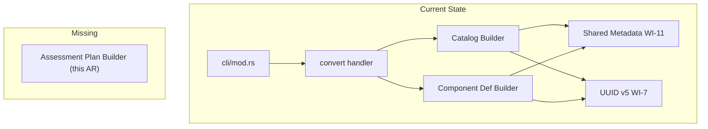
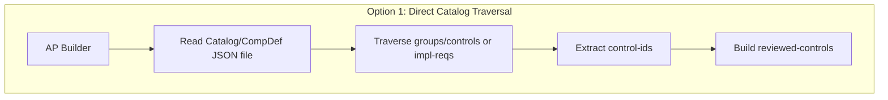
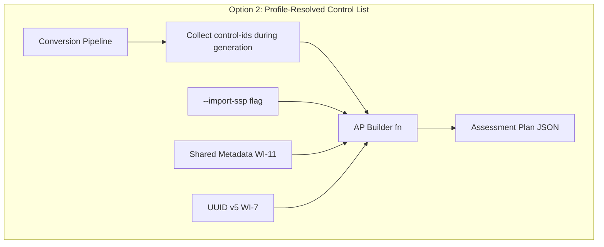
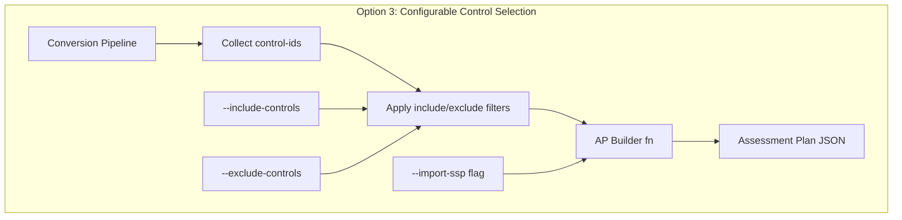
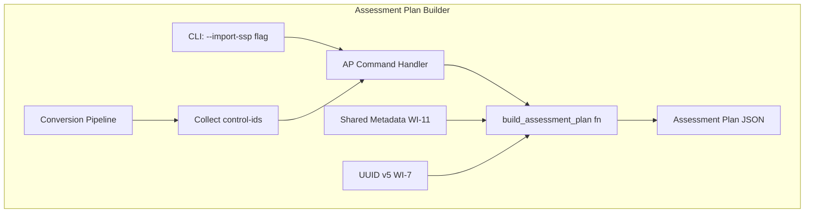
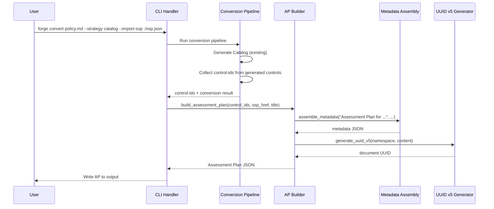

# 041-ar-assessment-plan-controls

> **Document Type:** Architecture Review
> **Audience:** LLM agents, human reviewers
> **Status:** Proposed
> **Last Updated:** 2026-02-10 <!-- @auto -->
> **Owner:** Brian Luby <!-- @human-required -->
> **Deciders:** Brian Luby <!-- @human-required -->

---

## Review Tier Legend

| Marker | Tier | Speckit Behavior |
|--------|------|------------------|
| 🔴 `@human-required` | Human Generated | Prompt human to author; blocks until complete |
| 🟡 `@human-review` | LLM + Human Review | LLM drafts → prompt human to confirm/edit; blocks until confirmed |
| 🟢 `@llm-autonomous` | LLM Autonomous | LLM completes; no prompt; logged for audit |
| ⚪ `@auto` | Auto-generated | System fills (timestamps, links); no prompt |

---

## Document Completion Order

> ⚠️ **For LLM Agents:** Complete sections in this order. Do not fill downstream sections until upstream human-required inputs exist.

1. **Summary (Decision)** → requires human input first
2. **Context (Problem Space)** → requires human input
3. **Decision Drivers** → requires human input (prioritized)
4. **Driving Requirements** → extract from PRD, human confirms
5. **Options Considered** → LLM drafts after drivers exist, human reviews
6. **Decision (Selected + Rationale)** → requires human decision
7. **Implementation Guardrails** → LLM drafts, human reviews
8. **Everything else** → can proceed after decision is made

---

## Linkage ⚪ `@auto`

| Document | ID | Relationship |
|----------|-----|--------------|
| Parent PRD | [041-prd-assessment-plan-controls](../PRD/041-prd-assessment-plan-controls.md) | Requirements this architecture satisfies |
| Security Review | N/A | No new attack surface — JSON builder only |
| Supersedes | — | N/A (new feature) |
| Superseded By | — | |

---

## Summary

### Decision 🔴 `@human-required`
> Use a profile-resolved control list approach: traverse the Catalog or Component Definition output to collect control-ids, then build `reviewed-controls` with `control-selections` using typed OSCAL structs with serde rename annotations, with shared metadata assembly from WI-11 and UUID v5 from WI-7.

### TL;DR for Agents 🟡 `@human-review`
> The Assessment Plan builder receives a list of control-ids from the conversion output (Catalog groups/controls or Component Definition implemented-requirements) and constructs a `reviewed-controls` structure with a single `control-selections` entry containing all control-ids in `include-controls`. The `import-ssp` href comes from an optional `--import-ssp` CLI flag (AP generation is skipped when the flag is omitted; an error is returned only if the flag is provided with an empty value). Use typed OSCAL structs (`AssessmentPlanEnvelope`, `AssessmentPlan`, `ApMetadata`, `ImportSsp`, `ReviewedControls`, `ApControlSelection`, `ApIncludeControl`) with serde rename annotations — see `contracts/assessment_plan.rs` for the authoritative struct definitions. Do NOT use dynamic `serde_json::Value` builders. Do NOT read or validate the SSP file content — it is a reference only. Do NOT generate tasks or subjects — that is WI-42's scope.

---

## Context

### Problem Space 🔴 `@human-required`
FORGE's pipeline produces Catalogs and Component Definitions, but no Assessment Plan artifacts. Compliance engineers who need to plan assessments must manually enumerate every control from their SSP into the Assessment Plan's `reviewed-controls` structure. The architectural challenge is: how should the Assessment Plan builder obtain and organize the control list? The controls may come from a Catalog (flat list within groups) or a Component Definition (nested within control-implementations). The builder must handle both sources, produce deterministic UUIDs, and integrate with the existing CLI and metadata assembly infrastructure without coupling tightly to upstream pipeline internals.

### Decision Scope 🟡 `@human-review`

**This AR decides:**
- How the Assessment Plan builder obtains control-ids from conversion output
- The structure of the `reviewed-controls` and `control-selections` JSON assembly
- How `import-ssp` is integrated from CLI input
- The builder function signature and module placement

**This AR does NOT decide:**
- Assessment task or subject generation — deferred to 042-ar-assessment-plan-subjects
- Full OSCAL AP schema validation — deferred to future validation work
- SSP generation or content reading — import-ssp is a reference only
- Whether to migrate all OSCAL builders to typed structs globally — that is a cross-cutting decision (WI-41 uses typed structs for the AP builder)

### Current State 🟢 `@llm-autonomous`
The FORGE pipeline currently produces OSCAL Catalogs (WI-9/WI-10/WI-13) and Component Definitions (WI-14/WI-15/WI-18). Shared infrastructure exists for metadata assembly (WI-11), UUID v5 generation (WI-7), and back matter (WI-12). No Assessment Plan generation capability exists. The `oscal` module contains builders for Catalog and Component Definition using typed OSCAL structs with serde annotations.



### Driving Requirements 🟡 `@human-review`

| PRD Req ID | Requirement Summary | Architectural Implication |
|------------|---------------------|---------------------------|
| M-1 | Produce JSON with root key `"assessment-plan"` | Builder must construct OSCAL AP structure |
| M-2 | Include required OSCAL metadata | Must reuse WI-11 shared metadata assembly |
| M-3 | Include `import-ssp` with href from CLI | Requires new CLI flag; builder accepts href string |
| M-4 | Include `reviewed-controls` with `control-selections` | Core assembly logic — extract and organize control-ids |
| M-5 | Populate `include-controls` from conversion output | Must traverse Catalog groups or Component Definition implemented-requirements |
| M-6 | `--import-ssp` is optional; when omitted AP generation is skipped (backward compatible); when provided value must be non-empty | CLI optional flag handling; error only when value is empty string |
| M-7 | Deterministic UUID v5 for all AP elements | Reuse WI-7 UUID generation infrastructure |

**PRD Constraints inherited:**
- From constitution: Rust latest stable, thiserror, TDD mandatory
- From PRD: JSON output via serde_json, clap 4.x for CLI

---

## Decision Drivers 🔴 `@human-required`

1. **Consistency:** Builder pattern must match established Catalog and Component Definition patterns *(traces to constitution principle X — Simplicity)*
2. **Control source flexibility:** Must work with both Catalog and Component Definition outputs as control-id sources *(traces to PRD M-4, M-5)*
3. **Simplicity:** Phase 3 exploratory feature — minimize coupling and new abstractions *(traces to constitution principle X — YAGNI)*
4. **Determinism:** All UUIDs must be reproducible for the same input *(traces to PRD M-7, Parent PRD M-8)*

---

## Options Considered 🟡 `@human-review`

### Option 0: Status Quo / Do Nothing

**Description:** No Assessment Plan generation. Users must manually create AP JSON files.

| Driver | Rating | Notes |
|--------|--------|-------|
| Consistency | N/A | No builder to evaluate |
| Control source flexibility | ❌ Poor | Users must manually enumerate controls |
| Simplicity | ✅ Good | No code to maintain |
| Determinism | N/A | No generation to evaluate |

**Why not viable:** Parent PRD C-2 requires Assessment Plan scaffold generation. Without it, FORGE cannot extend into the OSCAL Assessment layer, blocking MS-7 exit criteria.

---

### Option 1: Direct Catalog Traversal

**Description:** The AP builder directly reads the Catalog JSON output file, traverses `catalog.groups[].controls[]` to extract control-ids, and builds `reviewed-controls`. For Component Definitions, it traverses `components[].control-implementations[].implemented-requirements[]`.



| Driver | Rating | Notes |
|--------|--------|-------|
| Consistency | ⚠️ Medium | Other builders receive domain model structs, not raw JSON files |
| Control source flexibility | ✅ Good | Can traverse both Catalog and Component Definition JSON |
| Simplicity | ⚠️ Medium | Requires file I/O and JSON traversal; duplicates parsing logic |
| Determinism | ✅ Good | Traversal order is deterministic |

**Pros:**
- Works with any OSCAL artifact file, including externally generated ones
- No dependency on in-memory pipeline state

**Cons:**
- Requires file I/O at build time — breaks the pattern of in-memory pipeline processing
- Duplicates JSON traversal logic that the pipeline already performs
- Tightly coupled to OSCAL JSON structure (fragile if schema evolves)

---

### Option 2: Profile-Resolved Control List (Recommended)

**Description:** The AP builder receives a `Vec<String>` of control-ids already extracted by the conversion pipeline. The pipeline is responsible for collecting control-ids during Catalog or Component Definition generation and passing them to the AP builder. The builder focuses solely on assembling the AP JSON structure.



| Driver | Rating | Notes |
|--------|--------|-------|
| Consistency | ✅ Good | Follows same pattern as other builders: receive typed data, produce JSON |
| Control source flexibility | ✅ Good | Pipeline handles both Catalog and CompDef extraction; builder is source-agnostic |
| Simplicity | ✅ Good | Builder is a pure function: control-ids in, JSON out; no file I/O |
| Determinism | ✅ Good | Deterministic given same input list and SSP href |

**Pros:**
- Clean separation of concerns: pipeline extracts, builder assembles
- No file I/O in the builder — testable as a pure function
- Source-agnostic: works with any control-id source without conditional logic
- Consistent with established builder pattern

**Cons:**
- Requires pipeline modification to collect and pass control-ids
- Cannot generate AP from an externally produced artifact without re-parsing

---

### Option 3: Configurable Control Selection

**Description:** The AP builder accepts an optional control selection configuration (include/exclude lists from CLI flags) in addition to the conversion output. Users can override which controls appear in `reviewed-controls` via `--include-controls` and `--exclude-controls` flags.



| Driver | Rating | Notes |
|--------|--------|-------|
| Consistency | ⚠️ Medium | Adds CLI complexity beyond established patterns |
| Control source flexibility | ✅ Good | Maximum flexibility with include/exclude |
| Simplicity | ❌ Poor | Adds filtering logic, CLI flags, and edge case handling prematurely |
| Determinism | ✅ Good | Deterministic given same inputs and filter configuration |

**Pros:**
- Maximum flexibility for control selection
- Users can scope assessment to specific controls

**Cons:**
- Over-engineering for Phase 3 exploratory scope — PRD C-1 (exclude-controls) is a Could Have
- Adds CLI complexity (multiple new flags)
- Violates YAGNI — filtering can be added later when justified by user need

---

## Decision

### Selected Option 🔴 `@human-required`
> **Option 2: Profile-Resolved Control List**

### Rationale 🔴 `@human-required`
Option 2 provides the cleanest architecture for a Phase 3 exploratory feature. The builder receives a simple `Vec<String>` of control-ids and focuses on JSON assembly — no file I/O, no JSON traversal, no filtering logic. The pipeline already knows which controls it generated; passing them to the AP builder is a minimal extension. Option 1's file reading breaks the in-memory pipeline pattern, and Option 3's configurable selection is premature for an exploratory feature. If control filtering is needed later (PRD C-1), it can be added as a thin layer on top of Option 2.

#### Simplest Implementation Comparison 🟡 `@human-review`

| Aspect | Simplest Possible | Selected Option | Justification for Complexity |
|--------|-------------------|-----------------|------------------------------|
| Components | Single function with hardcoded structure | Builder fn with shared metadata and UUID | PRD M-2 and M-7 require metadata assembly and deterministic UUIDs |
| Dependencies | println! JSON | serde_json + uuid + shared metadata fn | PRD M-1 requires valid JSON; M-7 requires UUID v5 |
| Patterns | Inline JSON construction | Builder fn matching Catalog/CompDef pattern | Consistency with established codebase patterns |

**Complexity justified by:** The selected option IS the simplest approach that meets PRD M-1 through M-7 while maintaining consistency with established patterns. No unnecessary abstractions are introduced.

### Architecture Diagram 🟡 `@human-review`



---

## Technical Specification

### Component Overview 🟡 `@human-review`

| Component | Responsibility | Interface | Dependencies |
|-----------|---------------|-----------|--------------|
| build_assessment_plan | Assemble AP JSON from control-ids, SSP href, and policy title | Library fn: `(&[String], &str, &str) -> Result<AssessmentPlanEnvelope, ForgeError>` | serde_json, uuid, shared metadata |
| CLI handler (assess or convert extension) | Parse --import-ssp flag, invoke builder | CLI subcommand or strategy | clap 4.x |
| Control-id collector | Collect control-ids during pipeline execution | Internal pipeline extension | Catalog/Component builders |

### Data Flow 🟢 `@llm-autonomous`



### Interface Definitions 🟡 `@human-review`

```rust
/// Build an OSCAL Assessment Plan JSON skeleton.
///
/// # Arguments
/// * `control_ids` - Control-ids from conversion output (Catalog or Component Definition)
/// * `import_ssp_href` - Path to SSP, from --import-ssp CLI flag
/// * `policy_title` - Title of the source policy document
///
/// # Returns
/// An `AssessmentPlanEnvelope` ready for `serde_json::to_string_pretty`.
pub fn build_assessment_plan(
    control_ids: &[String],
    import_ssp_href: &str,
    policy_title: &str,
) -> Result<AssessmentPlanEnvelope, ForgeError>;

/// CLI integration: optional flag on convert subcommand
/// --import-ssp <path>  Optional SSP reference for Assessment Plan generation
///                      When omitted, AP generation is skipped (backward compatible).
///                      When provided with empty value, returns ForgeError::Validation.
```

### Key Algorithms/Patterns 🟡 `@human-review`

**Pattern:** Pure builder function with shared infrastructure reuse
```
1. Validate import_ssp_href is non-empty
2. Deduplicate control_ids (preserve order)
3. Call shared metadata assembly (WI-11) with AP-specific title
4. Generate document UUID v5 from (control_ids + ssp_href) content
5. Build import-ssp object from href
6. Build control-selections with include-controls from control_ids
7. Build reviewed-controls wrapping control-selections
8. Assemble root AssessmentPlanEnvelope
9. Return AssessmentPlanEnvelope
```

---

## Constraints & Boundaries

### Technical Constraints 🟡 `@human-review`

**Inherited from PRD:**
- Rust latest stable, serde_json for JSON output
- UUID v5 deterministic generation (WI-7 pattern)
- thiserror for error types
- TDD mandatory

**Added by this Architecture:**
- Builder function is pure: no file I/O, no side effects
- Control-ids are received as `&[String]`, not extracted from JSON files
- Single `control-selections` entry for all controls (no multi-group splitting)
- Deduplication of control-ids performed before building include-controls

### Architectural Boundaries 🟡 `@human-review`

- **Owns:** `build_assessment_plan` function, AP-specific CLI handling
- **Interfaces With:** Shared metadata assembly (WI-11), UUID v5 generator (WI-7), conversion pipeline (for control-id collection)
- **Must Not Touch:** Catalog builder, Component Definition builder, domain model structs

### Implementation Guardrails 🟡 `@human-review`

> ⚠️ **Critical for LLM Agents:**

- [x] **DO NOT** read or validate the SSP file content — `import-ssp` is a reference (href) only *(PRD W-4)*
- [x] **DO NOT** generate assessment tasks or subjects — that is WI-42's responsibility *(PRD W-1, W-2)*
- [x] **DO NOT** use random UUID v4 — all UUIDs must be deterministic v5 *(PRD M-7)*
- [x] **MUST** reuse shared metadata assembly from WI-11 *(PRD S-2)*
- [x] **MUST** deduplicate control-ids before populating include-controls *(PRD EC-3)*
- [x] **MUST** skip AP generation when --import-ssp is omitted (backward compatible); produce a descriptive error when --import-ssp value is empty *(PRD M-6)*

---

## Consequences 🟡 `@human-review`

### Positive
- Clean builder function testable in isolation — no file I/O dependencies
- Consistent with Catalog and Component Definition builder patterns
- Minimal new code — reuses shared metadata and UUID infrastructure
- Pipeline control-id collection is a minor extension of existing generation logic

### Negative
- Cannot generate AP from externally produced OSCAL artifacts without re-parsing
- Requires pipeline modification to collect and propagate control-ids

### Risks & Mitigations

| Risk | Likelihood | Impact | Mitigation |
|------|------------|--------|------------|
| Control-id collection adds complexity to pipeline | Low | Low | Collection is a simple Vec::push during existing iteration |
| AP schema edge cases not covered by builder | Low | Med | Test against NIST AP examples; defer full validation to future WI |

---

## Implementation Guidance

### Suggested Implementation Order 🟢 `@llm-autonomous`
1. Add `--import-ssp` CLI flag to the appropriate subcommand
2. Implement `build_assessment_plan` function in the `oscal` module
3. Add control-id collection to the Catalog and Component Definition builders
4. Wire CLI handler to invoke AP builder after conversion
5. Write unit tests for all acceptance criteria and edge cases

### Testing Strategy 🟢 `@llm-autonomous`

| Layer | Test Type | Coverage Target | Notes |
|-------|-----------|-----------------|-------|
| Unit | build_assessment_plan | 90% | All AC-1 through AC-7 and EC-1 through EC-5 |
| Unit | Control-id deduplication | 100% | EC-3 edge case |
| Integration | CLI --import-ssp flag | Key paths | Flag omitted → AP skipped (AC-5); empty value → error (EC-2) |

### Anti-patterns to Avoid 🟡 `@human-review`
- **Don't:** Read SSP file content to validate or extract data
  - **Why:** SSP is a reference only; reading it adds I/O, error handling, and coupling
  - **Instead:** Pass href string directly to import-ssp field
- **Don't:** Duplicate metadata assembly logic
  - **Why:** Drift from shared metadata pattern across artifact types
  - **Instead:** Call the WI-11 shared function with AP-specific parameters

---

## Compliance & Cross-cutting Concerns

### Security Considerations 🟡 `@human-review`
- Authentication: N/A — local CLI tool
- Authorization: N/A
- Data handling: Control-ids in reviewed-controls may reveal security posture; treat generated AP as sensitive

### Observability 🟢 `@llm-autonomous`
- **Logging:** Log control-id count and SSP href at INFO level
- **Metrics:** N/A for CLI tool
- **Tracing:** N/A for Phase 3 exploratory feature

### Error Handling Strategy 🟢 `@llm-autonomous`
```
Error Category → Handling Approach
├── Missing --import-ssp → AP generation skipped; convert completes normally (backward compatible)
├── Empty import-ssp value → ForgeError::Validation + non-zero exit
├── Batch mode + --import-ssp → Warning emitted; AP generation skipped
├── Zero control-ids → Warning emitted; empty include-controls array
└── Serialization failure → ForgeError::Serialization + non-zero exit
```

---

## Migration Plan (if applicable) 🟡 `@human-review`

N/A — new feature addition. No migration required.

### Rollback Plan 🔴 `@human-required`

N/A — Phase 3 exploratory feature. If the architecture proves inadequate, the AP builder is a self-contained function that can be replaced without affecting existing Catalog or Component Definition functionality.

---

## Open Questions 🟡 `@human-review`

No open questions for this work item.

---

## Changelog ⚪ `@auto`

| Version | Date | Author | Changes |
|---------|------|--------|---------|
| 0.1 | 2026-02-10 | LLM (Claude) | Initial proposal |

---

## Decision Record ⚪ `@auto`

| Date | Event | Details |
|------|-------|---------|
| 2026-02-10 | Proposed | Initial draft created from PRD 041 |

---

## Traceability Matrix 🟢 `@llm-autonomous`

| PRD Req ID | Decision Driver | Option Rating | Component | Notes |
|------------|-----------------|---------------|-----------|-------|
| M-1 | Consistency | Option 2: ✅ | build_assessment_plan | Produces root key "assessment-plan" |
| M-2 | Consistency | Option 2: ✅ | Shared Metadata WI-11 | Reuses metadata assembly |
| M-3 | Simplicity | Option 2: ✅ | build_assessment_plan | import-ssp.href from CLI flag |
| M-4 | Control source flexibility | Option 2: ✅ | build_assessment_plan | reviewed-controls with control-selections |
| M-5 | Control source flexibility | Option 2: ✅ | Control-id collector | Pipeline provides control-ids |
| M-6 | Simplicity | Option 2: ✅ | CLI handler + builder | Optional flag; builder validates non-empty when provided |
| M-7 | Determinism | Option 2: ✅ | UUID v5 WI-7 | Deterministic from content |

---

## Review Checklist 🟢 `@llm-autonomous`

Before marking as Accepted:
- [x] All PRD Must Have requirements appear in Driving Requirements
- [x] Option 0 (Status Quo) is documented
- [x] Simplest Implementation comparison is completed
- [x] Decision drivers are prioritized and addressed
- [x] At least 2 options were seriously considered
- [x] Constraints distinguish inherited vs. new
- [x] Component names are consistent across all diagrams and tables
- [x] Implementation guardrails reference specific PRD constraints
- [x] Rollback triggers and authority are defined (N/A — new exploratory feature)
- [x] Security review is linked or N/A documented
- [x] No open questions blocking implementation
