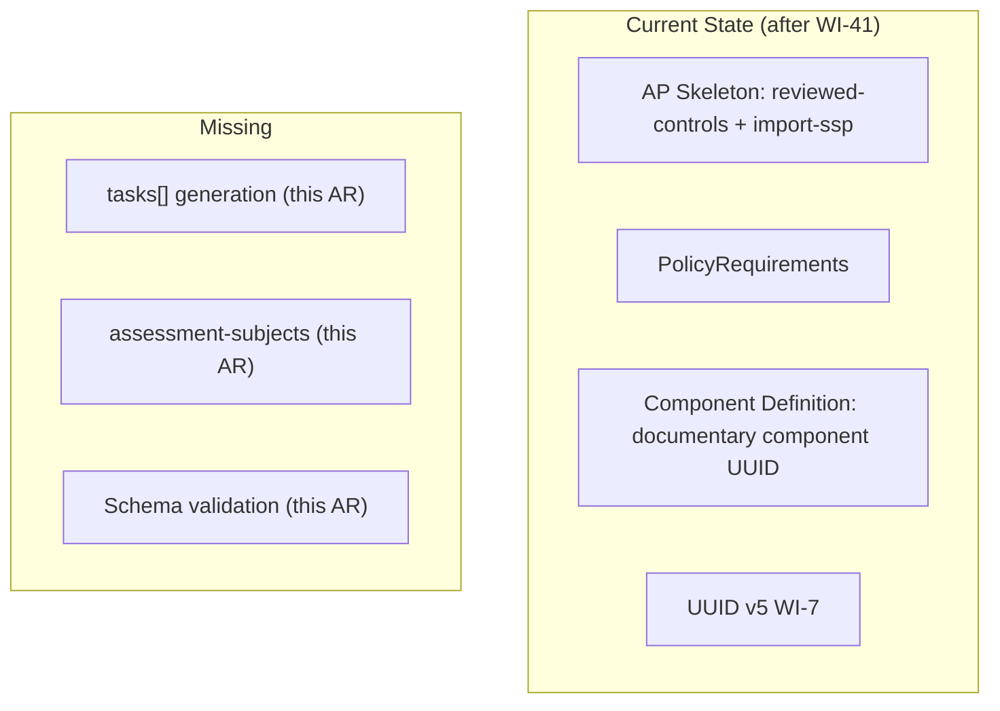
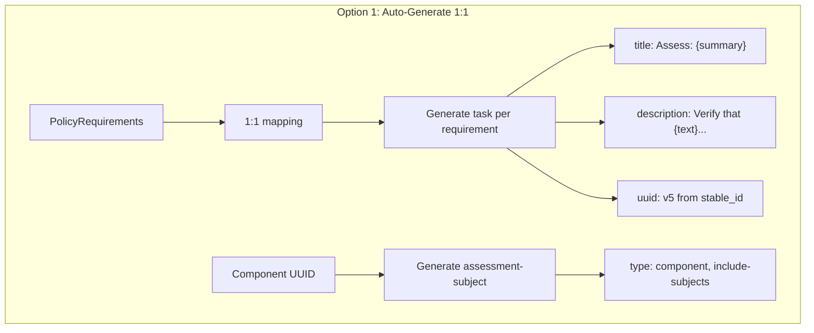
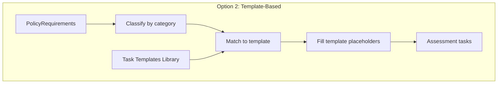
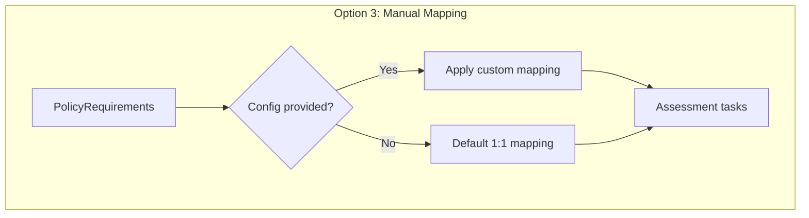
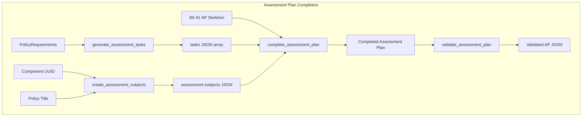
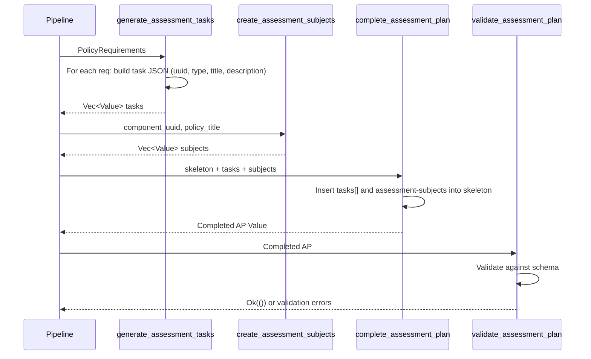

# 042-ar-assessment-plan-subjects

> **Document Type:** Architecture Review
> **Audience:** LLM agents, human reviewers
> **Status:** Proposed
> **Last Updated:** 2026-02-10 <!-- @auto -->
> **Owner:** Brian Luby <!-- @human-required -->
> **Deciders:** Brian Luby <!-- @human-required -->

---

## Review Tier Legend

| Marker | Tier | Speckit Behavior |
|--------|------|------------------|
| 🔴 `@human-required` | Human Generated | Prompt human to author; blocks until complete |
| 🟡 `@human-review` | LLM + Human Review | LLM drafts → prompt human to confirm/edit; blocks until confirmed |
| 🟢 `@llm-autonomous` | LLM Autonomous | LLM completes; no prompt; logged for audit |
| ⚪ `@auto` | Auto-generated | System fills (timestamps, links); no prompt |

---

## Document Completion Order

> ⚠️ **For LLM Agents:** Complete sections in this order. Do not fill downstream sections until upstream human-required inputs exist.

1. **Summary (Decision)** → requires human input first
2. **Context (Problem Space)** → requires human input
3. **Decision Drivers** → requires human input (prioritized)
4. **Driving Requirements** → extract from PRD, human confirms
5. **Options Considered** → LLM drafts after drivers exist, human reviews
6. **Decision (Selected + Rationale)** → requires human decision
7. **Implementation Guardrails** → LLM drafts, human reviews
8. **Everything else** → can proceed after decision is made

---

## Linkage ⚪ `@auto`

| Document | ID | Relationship |
|----------|-----|--------------|
| Parent PRD | [042-prd-assessment-plan-subjects](../PRD/042-prd-assessment-plan-subjects.md) | Requirements this architecture satisfies |
| Depends On AR | [041-ar-assessment-plan-controls](041-ar-assessment-plan-controls.md) | AP skeleton this AR extends |
| Security Review | N/A | Extends existing builder; no new attack surface |
| Supersedes | — | N/A (new feature) |
| Superseded By | — | |

---

## Summary

### Decision 🔴 `@human-required`
> Use an auto-generate-from-controls approach: generate one assessment task per `PolicyRequirement` with assessment-framed descriptions, and create assessment-subjects from the documentary component metadata. Tasks and subjects are merged into the WI-41 skeleton via a `complete_assessment_plan` function. Validate the completed AP against the OSCAL AP schema structure.

### TL;DR for Agents 🟡 `@human-review`
> WI-42 extends the WI-41 Assessment Plan skeleton by adding `tasks[]` (one per PolicyRequirement, type "action", with assessment-framed descriptions) and `assessment-subjects` (one entry referencing the documentary component). The `complete_assessment_plan` function merges these into the skeleton. Use `serde_json::Value` builder pattern. Do NOT modify reviewed-controls or import-ssp from WI-41. Do NOT generate random UUIDs — use deterministic v5 with requirement stable_id as seed.

---

## Context

### Problem Space 🔴 `@human-required`
WI-41 produces an Assessment Plan skeleton with `reviewed-controls` and `import-ssp`, but without `tasks[]` and `assessment-subjects`, the plan defines scope without providing execution guidance. The architectural challenge is: how should assessment tasks be generated from policy requirements? Options range from fully automatic 1:1 mapping (each requirement becomes a task) to template-based generation (predefined task templates filled with requirement data) to manual mapping with defaults (user specifies groupings). Additionally, assessment-subjects must reference the documentary component from the Component Definition pipeline, requiring cross-artifact data flow. The completed AP must pass OSCAL schema validation.

### Decision Scope 🟡 `@human-review`

**This AR decides:**
- How PolicyRequirements map to assessment tasks
- The task structure (type, title, description format)
- How assessment-subjects reference documentary components
- How tasks and subjects merge into the WI-41 skeleton
- Schema validation approach for the completed AP

**This AR does NOT decide:**
- Assessment Plan skeleton structure (reviewed-controls, import-ssp) — decided in 041-ar
- Assessment execution or results recording — out of scope
- Detailed assessment methodology — assessors refine manually

### Current State 🟢 `@llm-autonomous`
WI-41 provides an Assessment Plan skeleton with `reviewed-controls` and `import-ssp`. The domain model includes `PolicyRequirement` structs with `stable_id`, `text`, and `source_line` fields. The Component Definition pipeline (WI-14/WI-15) produces documentary components with UUIDs. UUID v5 generation (WI-7) and shared metadata (WI-11) are available.



### Driving Requirements 🟡 `@human-review`

| PRD Req ID | Requirement Summary | Architectural Implication |
|------------|---------------------|---------------------------|
| M-1 | tasks[] with one entry per PolicyRequirement | 1:1 mapping from requirements to tasks |
| M-2 | Each task has deterministic UUID v5 | Task UUID derived from requirement stable_id |
| M-3 | Task type set to "action" | Static field assignment |
| M-4 | Task title derived from requirement | Title generation function needed |
| M-5 | Task description with assessment guidance from requirement prose | Description framing function needed |
| M-6 | assessment-subjects with documentary component reference | Cross-artifact data flow for component UUID |
| M-7 | Subject type and description for policy document | Subject builder function |
| M-8 | Completed AP passes OSCAL AP schema validation | Schema validation integration |

**PRD Constraints inherited:**
- From constitution: Rust latest stable, thiserror, TDD mandatory
- From PRD: serde_json for JSON output, UUID v5 deterministic generation

---

## Decision Drivers 🔴 `@human-required`

1. **Traceability:** Every requirement must be represented as a task with a clear link to its source *(traces to PRD M-1, Parent PRD M-10)*
2. **Assessment value:** Generated tasks must provide meaningful guidance to assessors, not empty boilerplate *(traces to PRD M-5)*
3. **Simplicity:** Phase 3 exploratory feature — 1:1 mapping is the simplest correct approach *(constitution principle X)*
4. **Schema compliance:** The completed AP must pass OSCAL AP schema validation *(traces to PRD M-8)*

---

## Options Considered 🟡 `@human-review`

### Option 0: Status Quo / Do Nothing

**Description:** Leave the WI-41 skeleton without tasks or subjects. Assessors manually create tasks.

| Driver | Rating | Notes |
|--------|--------|-------|
| Traceability | ❌ Poor | No automated requirement-to-task mapping |
| Assessment value | ❌ Poor | No task guidance provided |
| Simplicity | ✅ Good | No code to maintain |
| Schema compliance | ❌ Poor | AP without tasks may be structurally incomplete |

**Why not viable:** Parent PRD C-2 requires "assessment tasks derived from policy requirements." The WI-41 skeleton without tasks provides incomplete value.

---

### Option 1: Auto-Generate from Controls (1:1 Mapping) (Recommended)

**Description:** Each `PolicyRequirement` maps to exactly one assessment task. The task title is derived from the requirement text (truncated/summarized), the description frames the requirement as an assessment activity ("Verify that {requirement text} is implemented"), and the type is always "action". Assessment-subjects reference the documentary component UUID.



| Driver | Rating | Notes |
|--------|--------|-------|
| Traceability | ✅ Good | Every requirement has exactly one task; clear 1:1 mapping |
| Assessment value | ✅ Good | Requirement text preserved with assessment framing |
| Simplicity | ✅ Good | Straightforward iteration; no grouping logic |
| Schema compliance | ✅ Good | Tasks and subjects satisfy AP schema requirements |

**Pros:**
- Simplest mapping — every requirement becomes a task, no grouping decisions
- Full traceability — each task maps to exactly one requirement
- Assessment descriptions use actual requirement text (not generic boilerplate)
- Deterministic — same requirements always produce same tasks

**Cons:**
- May produce many tasks for policies with many requirements (verbose AP)
- No grouping by section or topic — flat task list
- Title truncation may lose context for long requirements

---

### Option 2: Template-Based Subjects

**Description:** Use predefined assessment task templates for common requirement categories (access control, encryption, incident response). Each template provides structured assessment guidance with placeholders filled by requirement data. Requirements are classified into categories and matched to templates.



| Driver | Rating | Notes |
|--------|--------|-------|
| Traceability | ⚠️ Medium | Category-based matching may lose 1:1 precision |
| Assessment value | ✅ Good | Templates provide structured, domain-specific guidance |
| Simplicity | ❌ Poor | Requires category classification, template library, matching logic |
| Schema compliance | ✅ Good | Template output designed for schema compliance |

**Pros:**
- Richer, more structured assessment guidance
- Domain-specific templates improve assessment quality

**Cons:**
- Significant complexity: template library, category classifier, matching logic
- Category classification is heuristic and error-prone without NLP
- Violates YAGNI for Phase 3 exploratory scope
- Template maintenance burden — must update templates when OSCAL evolves

---

### Option 3: Manual Mapping with Defaults

**Description:** Users specify task groupings and mappings via a configuration file or CLI flags. Default behavior generates one task per requirement (like Option 1), but users can override with custom mappings that group requirements into composite tasks.



| Driver | Rating | Notes |
|--------|--------|-------|
| Traceability | ✅ Good | User-controlled mapping preserves traceability |
| Assessment value | ✅ Good | Custom groupings can improve assessment structure |
| Simplicity | ❌ Poor | Configuration file schema, parsing, validation, CLI flags |
| Schema compliance | ✅ Good | Same output structure regardless of mapping source |

**Pros:**
- Maximum flexibility for experienced users
- Default behavior matches Option 1 (no configuration needed)

**Cons:**
- Configuration schema adds complexity for Phase 3 exploratory feature
- Configuration file parsing, validation, and error handling
- Two code paths (default and custom) to test and maintain
- Violates YAGNI — custom mappings can be added when user demand justifies it

---

## Decision

### Selected Option 🔴 `@human-required`
> **Option 1: Auto-Generate from Controls (1:1 Mapping)**

### Rationale 🔴 `@human-required`
Option 1 is the right choice for a Phase 3 exploratory feature. The 1:1 mapping from PolicyRequirement to assessment task is the simplest approach that provides complete traceability and meaningful assessment guidance. Assessors who need custom groupings or template-based guidance can refine the generated scaffold. Option 2's template library and Option 3's configuration file are premature abstractions — they add significant complexity without validated user demand. Option 1 can be extended to support templates or custom mappings in a future iteration if justified.

#### Simplest Implementation Comparison 🟡 `@human-review`

| Aspect | Simplest Possible | Selected Option | Justification for Complexity |
|--------|-------------------|-----------------|------------------------------|
| Components | Single function for tasks | Task gen fn + subject gen fn + merge fn + validation | PRD requires tasks (M-1-M-5), subjects (M-6-M-7), and validation (M-8) |
| Dependencies | serde_json only | serde_json + uuid + jsonschema (if available) | PRD M-2 requires UUID v5; M-8 requires schema validation |
| Patterns | Inline JSON for each task | Iterator-based task generation | Multiple requirements mapped uniformly |

**Complexity justified by:** The selected option provides the minimum set of functions needed to satisfy PRD M-1 through M-8. No abstractions beyond what is required.

### Architecture Diagram 🟡 `@human-review`



---

## Technical Specification

### Component Overview 🟡 `@human-review`

| Component | Responsibility | Interface | Dependencies |
|-----------|---------------|-----------|--------------|
| generate_assessment_tasks | Map PolicyRequirements to task JSON entries | `(&[PolicyRequirement]) -> Result<Vec<Value>>` | uuid (v5), serde_json |
| create_assessment_subjects | Build assessment-subjects from component metadata | `(&str, &str) -> Result<Vec<Value>>` | serde_json |
| complete_assessment_plan | Merge tasks and subjects into WI-41 skeleton | `(Value, Vec<Value>, Vec<Value>) -> Result<Value>` | serde_json |
| validate_assessment_plan | Check completed AP against OSCAL AP schema | `(&Value) -> Result<()>` | jsonschema or structural checks |

### Data Flow 🟢 `@llm-autonomous`



### Interface Definitions 🟡 `@human-review`

```rust
/// Generate assessment tasks from PolicyRequirements.
/// Each requirement maps to one task with assessment guidance.
pub fn generate_assessment_tasks(
    requirements: &[PolicyRequirement],
) -> Result<Vec<serde_json::Value>, ForgeError>;

/// Create assessment-subjects referencing the documentary component.
pub fn create_assessment_subjects(
    component_uuid: &str,
    policy_title: &str,
) -> Result<Vec<serde_json::Value>, ForgeError>;

/// Merge tasks and subjects into the WI-41 AP skeleton.
pub fn complete_assessment_plan(
    skeleton: serde_json::Value,
    tasks: Vec<serde_json::Value>,
    subjects: Vec<serde_json::Value>,
) -> Result<serde_json::Value, ForgeError>;

/// Validate the completed AP against the OSCAL AP schema.
pub fn validate_assessment_plan(
    plan: &serde_json::Value,
) -> Result<(), ForgeError>;
```

### Key Algorithms/Patterns 🟡 `@human-review`

**Pattern:** 1:1 requirement-to-task mapping with assessment framing
```
For each PolicyRequirement:
  1. Generate task UUID v5 from (AP namespace + requirement.stable_id)
  2. Set type = "action"
  3. Set title = "Assess: {first 80 chars of requirement.text}"
  4. Set description = "Verify that {requirement.text} is implemented as specified in the policy."
  5. Optionally add related-controls referencing the control-id
  6. Add to tasks array
```

**Pattern:** Subject creation from component metadata
```
1. Build assessment-subject with type = "component"
2. Set description = "Policy document: {policy_title}"
3. Add include-subjects with subject-uuid = component_uuid, type = "component"
```

---

## Constraints & Boundaries

### Technical Constraints 🟡 `@human-review`

**Inherited from PRD:**
- Rust latest stable, serde_json for JSON output
- UUID v5 deterministic generation
- thiserror for error types
- TDD mandatory

**Added by this Architecture:**
- Task UUID v5 seed includes requirement stable_id to ensure uniqueness per requirement
- Task description uses requirement text directly — no AI summarization or paraphrasing
- `complete_assessment_plan` performs additive merge only — does not modify reviewed-controls or import-ssp
- Schema validation uses jsonschema crate if available from WI-19; falls back to structural checks

### Architectural Boundaries 🟡 `@human-review`

- **Owns:** Task generation, subject generation, skeleton merge, schema validation functions
- **Interfaces With:** WI-41 AP skeleton, PolicyRequirement domain model, Component Definition UUID
- **Must Not Touch:** WI-41 skeleton structure (reviewed-controls, import-ssp), Catalog/Component Definition builders

### Implementation Guardrails 🟡 `@human-review`

> ⚠️ **Critical for LLM Agents:**

- [x] **DO NOT** modify reviewed-controls or import-ssp from the WI-41 skeleton *(WI-41 owns those)*
- [x] **DO NOT** generate random UUID v4 for tasks — must use v5 with requirement stable_id *(PRD M-2)*
- [x] **DO NOT** paraphrase or AI-summarize requirement text for task descriptions — use original text *(Decision Log)*
- [x] **MUST** produce one task per PolicyRequirement — 1:1 mapping *(PRD M-1)*
- [x] **MUST** validate the completed AP against OSCAL AP schema *(PRD M-8)*
- [x] **MUST** handle the edge case where no documentary component UUID is available *(PRD EC-3)*

---

## Consequences 🟡 `@human-review`

### Positive
- Complete Assessment Plan scaffold with tasks and subjects — assessors have a starting point
- Full traceability from assessment task back to source requirement
- Schema validation catches structural issues before delivery
- 1:1 mapping is deterministic and easy to understand

### Negative
- Large policies produce many tasks — AP may be verbose
- No grouping or categorization of tasks — flat list
- Assessment guidance is formulaic ("Verify that...") — assessors will refine

### Risks & Mitigations

| Risk | Likelihood | Impact | Mitigation |
|------|------------|--------|------------|
| Boilerplate task descriptions ignored by assessors | Med | Low | Use actual requirement text; assessors can refine but have complete coverage |
| Schema validation fails on edge cases | Low | Med | Test against NIST AP examples; log validation warnings without blocking |

---

## Implementation Guidance

### Suggested Implementation Order 🟢 `@llm-autonomous`
1. Implement `generate_assessment_tasks` with unit tests
2. Implement `create_assessment_subjects` with unit tests
3. Implement `complete_assessment_plan` (merge function) with unit tests
4. Implement `validate_assessment_plan` with schema validation
5. Wire into CLI and end-to-end pipeline

### Testing Strategy 🟢 `@llm-autonomous`

| Layer | Test Type | Coverage Target | Notes |
|-------|-----------|-----------------|-------|
| Unit | Task generation (1:1 mapping) | 90% | AC-1, AC-2, EC-1, EC-2, EC-4 |
| Unit | Subject creation | 90% | AC-3, AC-4, EC-3 |
| Unit | Skeleton merge | 90% | Verify tasks/subjects added without modifying skeleton |
| Integration | Schema validation | Key paths | AC-5, EC-5 |

### Anti-patterns to Avoid 🟡 `@human-review`
- **Don't:** Group requirements into composite tasks without explicit user configuration
  - **Why:** Loses 1:1 traceability; grouping decisions are subjective
  - **Instead:** One task per requirement; assessors group during refinement
- **Don't:** Skip schema validation because "it's exploratory"
  - **Why:** Structurally invalid output has no value
  - **Instead:** Validate and report errors; AP should be usable

---

## Compliance & Cross-cutting Concerns

### Security Considerations 🟡 `@human-review`
- Authentication: N/A — local CLI tool
- Authorization: N/A
- Data handling: Task descriptions contain policy requirement text; treat generated AP as sensitive

### Observability 🟢 `@llm-autonomous`
- **Logging:** Log task count and validation result at INFO level
- **Metrics:** N/A for CLI tool
- **Tracing:** N/A for Phase 3 exploratory feature

### Error Handling Strategy 🟢 `@llm-autonomous`
```
Error Category → Handling Approach
├── Zero requirements → Warning emitted; empty tasks array
├── Empty requirement text → Placeholder description; warning
├── No component UUID → Generic subject without include-subjects; warning
├── Schema validation failure → Descriptive error with field path
└── Merge failure → ForgeError with context
```

---

## Migration Plan (if applicable) 🟡 `@human-review`

N/A — new feature extending WI-41. No migration required.

### Rollback Plan 🔴 `@human-required`

N/A — Phase 3 exploratory feature. If the approach proves inadequate, the task/subject generation functions can be replaced independently of the WI-41 skeleton.

---

## Open Questions 🟡 `@human-review`

No open questions for this work item.

---

## Changelog ⚪ `@auto`

| Version | Date | Author | Changes |
|---------|------|--------|---------|
| 0.1 | 2026-02-10 | LLM (Claude) | Initial proposal |

---

## Decision Record ⚪ `@auto`

| Date | Event | Details |
|------|-------|---------|
| 2026-02-10 | Proposed | Initial draft created from PRD 042 |

---

## Traceability Matrix 🟢 `@llm-autonomous`

| PRD Req ID | Decision Driver | Option Rating | Component | Notes |
|------------|-----------------|---------------|-----------|-------|
| M-1 | Traceability | Option 1: ✅ | generate_assessment_tasks | One task per requirement |
| M-2 | Traceability | Option 1: ✅ | UUID v5 WI-7 | Deterministic from stable_id |
| M-3 | Simplicity | Option 1: ✅ | generate_assessment_tasks | type = "action" |
| M-4 | Assessment value | Option 1: ✅ | generate_assessment_tasks | Title from requirement text |
| M-5 | Assessment value | Option 1: ✅ | generate_assessment_tasks | "Verify that..." framing |
| M-6 | Traceability | Option 1: ✅ | create_assessment_subjects | Component reference |
| M-7 | Simplicity | Option 1: ✅ | create_assessment_subjects | type and description set |
| M-8 | Schema compliance | Option 1: ✅ | validate_assessment_plan | OSCAL AP validation |

---

## Review Checklist 🟢 `@llm-autonomous`

Before marking as Accepted:
- [x] All PRD Must Have requirements appear in Driving Requirements
- [x] Option 0 (Status Quo) is documented
- [x] Simplest Implementation comparison is completed
- [x] Decision drivers are prioritized and addressed
- [x] At least 2 options were seriously considered
- [x] Constraints distinguish inherited vs. new
- [x] Component names are consistent across all diagrams and tables
- [x] Implementation guardrails reference specific PRD constraints
- [x] Rollback triggers and authority are defined (N/A — new exploratory feature)
- [x] Security review is linked or N/A documented
- [x] No open questions blocking implementation
