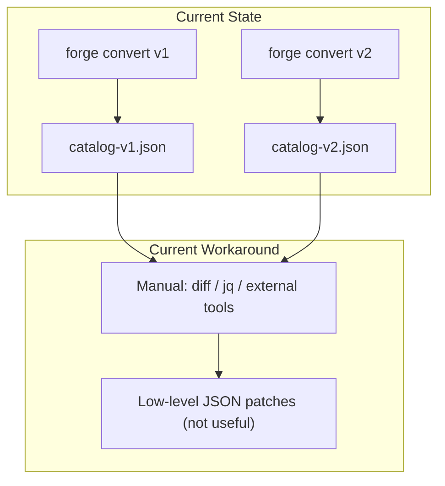
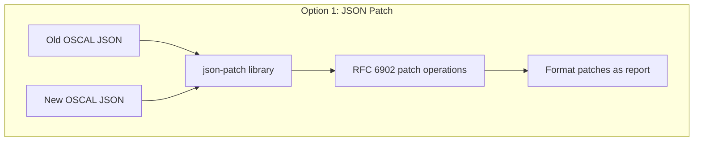
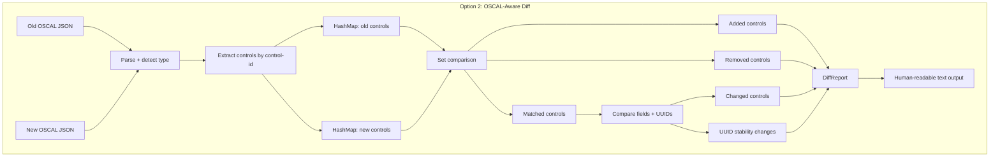
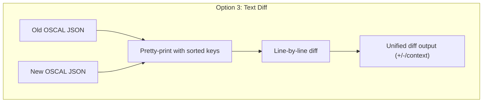
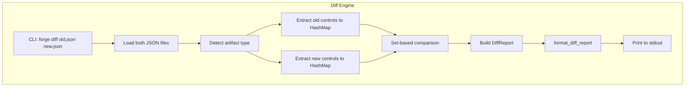
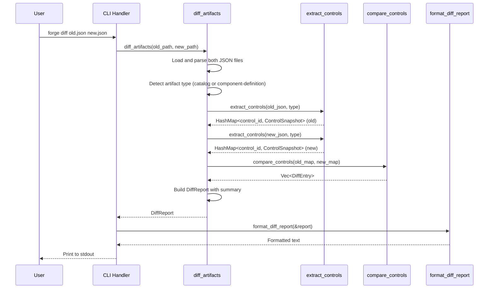

# 043-ar-diff-report

> **Document Type:** Architecture Review
> **Audience:** LLM agents, human reviewers
> **Status:** Proposed
> **Last Updated:** 2026-02-10 <!-- @auto -->
> **Owner:** Brian Luby <!-- @human-required -->
> **Deciders:** Brian Luby <!-- @human-required -->

---

## Review Tier Legend

| Marker | Tier | Speckit Behavior |
|--------|------|------------------|
| 🔴 `@human-required` | Human Generated | Prompt human to author; blocks until complete |
| 🟡 `@human-review` | LLM + Human Review | LLM drafts → prompt human to confirm/edit; blocks until confirmed |
| 🟢 `@llm-autonomous` | LLM Autonomous | LLM completes; no prompt; logged for audit |
| ⚪ `@auto` | Auto-generated | System fills (timestamps, links); no prompt |

---

## Document Completion Order

> ⚠️ **For LLM Agents:** Complete sections in this order. Do not fill downstream sections until upstream human-required inputs exist.

1. **Summary (Decision)** → requires human input first
2. **Context (Problem Space)** → requires human input
3. **Decision Drivers** → requires human input (prioritized)
4. **Driving Requirements** → extract from PRD, human confirms
5. **Options Considered** → LLM drafts after drivers exist, human reviews
6. **Decision (Selected + Rationale)** → requires human decision
7. **Implementation Guardrails** → LLM drafts, human reviews
8. **Everything else** → can proceed after decision is made

---

## Linkage ⚪ `@auto`

| Document | ID | Relationship |
|----------|-----|--------------|
| Parent PRD | [043-prd-diff-report](../PRD/043-prd-diff-report.md) | Requirements this architecture satisfies |
| Security Review | N/A | Read-only comparison of existing JSON files |
| Supersedes | — | N/A (new feature) |
| Superseded By | — | |

---

## Summary

### Decision 🔴 `@human-required`
> Build a custom OSCAL-aware structural diff engine that loads two OSCAL JSON artifacts, extracts controls by control-id into HashMaps, performs set-based comparison (added/removed/changed/unchanged), detects UUID stability changes, and produces a structured `DiffReport` with human-readable text formatting for stdout.

### TL;DR for Agents 🟡 `@human-review`
> The diff engine loads two OSCAL JSON files with `serde_json`, detects artifact type (Catalog or Component Definition), extracts controls keyed by control-id into `HashMap<String, ControlSnapshot>`, then compares: keys only in new = added, keys only in old = removed, keys in both = compare fields and UUIDs. Do NOT use generic JSON diff (json-patch) — it lacks OSCAL semantics. Do NOT use line-by-line text diff. The diff operates on control-ids as primary matching keys, NOT UUIDs. Report format is human-readable text to stdout with a summary header.

---

## Context

### Problem Space 🔴 `@human-required`
When policies evolve, compliance engineers re-convert through FORGE and need to understand what changed in the OSCAL output. Generic JSON diff tools produce low-level structural patches that are unreadable and lack OSCAL semantics. The architectural challenge is choosing a diff strategy: should we use a generic JSON diff library (json-patch RFC 6902), build a custom OSCAL-aware diff engine using control-id matching, or use text-based diff on serialized output? Each approach has different trade-offs between implementation effort, readability, and OSCAL awareness. The diff must handle both Catalog (controls in groups) and Component Definition (implemented-requirements in control-implementations) artifact types.

### Decision Scope 🟡 `@human-review`

**This AR decides:**
- The diff algorithm and matching strategy (control-id based vs JSON path vs text)
- The internal data model for diff results (`DiffReport`, `DiffEntry`)
- The output format for human-readable reporting
- Which artifact types are supported and how controls are extracted from each

**This AR does NOT decide:**
- Diffing Assessment Plans, Profiles, or SSPs — future extension
- Three-way merge or conflict resolution — diff is read-only
- Semantic understanding of change impact — structural diff only
- GUI or web-based diff visualization — stdout text only

### Current State 🟢 `@llm-autonomous`
FORGE produces Catalog and Component Definition JSON artifacts via `forge convert`. No diff capability exists. Users must manually compare JSON files using external tools like `jq`, `diff`, or JSON diff websites, none of which understand OSCAL semantics.



### Driving Requirements 🟡 `@human-review`

| PRD Req ID | Requirement Summary | Architectural Implication |
|------------|---------------------|---------------------------|
| M-1 | `forge diff <old> <new>` subcommand | New CLI subcommand with two positional args |
| M-2 | Identify added controls | Set difference: new keys not in old |
| M-3 | Identify removed controls | Set difference: old keys not in new |
| M-4 | Identify changed controls with field details | Content comparison for matched control-ids |
| M-5 | Detect UUID stability changes | Compare UUIDs for same control-id |
| M-6 | Human-readable report to stdout | Text formatting function |
| M-7 | Support Catalog artifacts | Extract controls from catalog.groups[].controls[] |
| M-8 | Descriptive errors for invalid input | Error handling for bad JSON, non-OSCAL, mismatched types |

**PRD Constraints inherited:**
- From constitution: Rust latest stable, thiserror, TDD mandatory
- From PRD: serde_json for JSON parsing, clap 4.x for CLI

---

## Decision Drivers 🔴 `@human-required`

1. **OSCAL awareness:** Diff must produce meaningful output like "control POL-AC-003 was added" — not raw JSON patches *(traces to PRD M-2, M-3, M-4)*
2. **Readability:** Output must be immediately useful to compliance engineers without OSCAL expertise *(traces to PRD M-6)*
3. **UUID stability visibility:** UUID changes must be explicitly flagged because they break downstream tool references *(traces to PRD M-5)*
4. **Simplicity:** Phase 3 exploratory — build the minimum useful diff engine *(constitution principle X)*

---

## Options Considered 🟡 `@human-review`

### Option 0: Status Quo / Do Nothing

**Description:** No diff capability. Users use external tools.

| Driver | Rating | Notes |
|--------|--------|-------|
| OSCAL awareness | ❌ Poor | External tools have no OSCAL knowledge |
| Readability | ❌ Poor | Raw JSON diffs are unreadable for compliance engineers |
| UUID stability visibility | ❌ Poor | No UUID change detection |
| Simplicity | ✅ Good | No code to build |

**Why not viable:** Parent PRD C-3 requires diff reporting. External tools cannot provide OSCAL-aware diffing.

---

### Option 1: JSON Diff (json-patch RFC 6902)

**Description:** Use a JSON diff library (e.g., `json-patch` or `treediff` crate) to compute RFC 6902 JSON Patch operations between two OSCAL files. The patch operations describe additions, removals, and replacements at JSON path level.



| Driver | Rating | Notes |
|--------|--------|-------|
| OSCAL awareness | ❌ Poor | Produces paths like `/catalog/groups/0/controls/2` — no semantic meaning |
| Readability | ❌ Poor | Patch operations are developer-oriented, not compliance-engineer-oriented |
| UUID stability visibility | ❌ Poor | UUID changes show as value replacements, not flagged as stability issues |
| Simplicity | ⚠️ Medium | Library handles diff computation, but post-processing needed to extract meaning |

**Pros:**
- Standard algorithm; well-tested library
- Catches every structural change (complete)

**Cons:**
- Output is semantically meaningless for OSCAL — paths like `/catalog/groups/0/controls/2/parts/0/prose` tell the user nothing
- No concept of "control added" or "control removed" — only low-level operations
- Array index changes (e.g., inserting a control shifts all subsequent indices) produce noisy diffs
- Requires significant post-processing to translate patches into OSCAL-meaningful reports

---

### Option 2: Structural OSCAL-Aware Diff (Recommended)

**Description:** Build a custom diff engine that understands OSCAL structure. Load both JSON files, detect artifact type, extract controls into `HashMap<control_id, ControlSnapshot>`, and perform set-based comparison. Report results as OSCAL-semantic entries: "control POL-AC-003 added", "control POL-IA-002 description changed", "UUID stability change for POL-AC-001".



| Driver | Rating | Notes |
|--------|--------|-------|
| OSCAL awareness | ✅ Good | Outputs "control POL-AC-003 added" — directly meaningful |
| Readability | ✅ Good | Compliance-engineer-friendly language with summary header |
| UUID stability visibility | ✅ Good | Explicit UUID change detection and flagging |
| Simplicity | ✅ Good | HashMap-based set comparison is straightforward to implement |

**Pros:**
- OSCAL-semantic output: added/removed/changed controls with control-ids
- UUID stability changes explicitly detected and reported
- Summary header with counts gives at-a-glance overview
- control-id is a natural, stable matching key
- Extensible to Component Definitions by extracting from different JSON paths

**Cons:**
- Must be built from scratch (no library for OSCAL-aware diffing)
- Only compares fields that are explicitly extracted (may miss deep structural changes)
- Requires separate extraction logic for Catalog and Component Definition

---

### Option 3: Text-Based Diff on Serialized Output

**Description:** Serialize both OSCAL JSON files to pretty-printed text with sorted keys, then perform line-by-line text diff (similar to `diff -u`). Report changes as unified diff output.



| Driver | Rating | Notes |
|--------|--------|-------|
| OSCAL awareness | ❌ Poor | No understanding of OSCAL structure; just text lines |
| Readability | ⚠️ Medium | Familiar unified diff format, but context is JSON structure not OSCAL meaning |
| UUID stability visibility | ❌ Poor | UUID changes appear as line changes without flagging |
| Simplicity | ✅ Good | Leverage existing diff algorithms; minimal code |

**Pros:**
- Simple to implement — text diff algorithms are well-established
- Familiar output format for developers
- Catches every byte-level change

**Cons:**
- No OSCAL semantics — cannot tell "control added" vs "formatting changed"
- JSON key ordering and whitespace changes produce false diffs
- Large JSON files produce very long diffs that are hard to navigate
- No summary counts or categorization

---

## Decision

### Selected Option 🔴 `@human-required`
> **Option 2: Structural OSCAL-Aware Diff**

### Rationale 🔴 `@human-required`
The diff feature's core value is OSCAL-semantic reporting. Generic JSON diff (Option 1) and text diff (Option 3) both fail this requirement — they produce low-level changes that require the user to mentally reconstruct what happened in OSCAL terms. Option 2 uses control-id as the natural matching key to produce reports like "control POL-AC-003 was added, POL-IA-002 description changed." The implementation is a straightforward HashMap-based set comparison — not complex despite being custom. UUID stability detection (critical per PRD M-5) falls naturally out of the control-id matching approach.

#### Simplest Implementation Comparison 🟡 `@human-review`

| Aspect | Simplest Possible | Selected Option | Justification for Complexity |
|--------|-------------------|-----------------|------------------------------|
| Components | Single diff function | DiffReport struct + extraction + comparison + formatting | PRD requires categorized output (M-2, M-3, M-4) and UUID tracking (M-5) |
| Dependencies | serde_json only | serde_json only (no external diff library) | No additional deps needed — HashMap comparison is stdlib |
| Patterns | Print all differences | Summary header + categorized detail sections | PRD M-6 requires human-readable format |

**Complexity justified by:** The categorization of changes into added/removed/changed/uuid-changed is the core value proposition. A simpler approach that does not categorize would not meet PRD requirements.

### Architecture Diagram 🟡 `@human-review`



---

## Technical Specification

### Component Overview 🟡 `@human-review`

| Component | Responsibility | Interface | Dependencies |
|-----------|---------------|-----------|--------------|
| diff_artifacts | Main entry point: load, extract, compare, report | `(&Path, &Path) -> Result<DiffReport>` | serde_json, std::collections::HashMap |
| extract_controls | Extract controls from OSCAL JSON by artifact type | `(&Value, ArtifactType) -> HashMap<String, ControlSnapshot>` | serde_json |
| compare_controls | Set-based comparison of two HashMaps | `(HashMap, HashMap) -> Vec<DiffEntry>` | std::collections |
| format_diff_report | Human-readable text formatting | `(&DiffReport) -> String` | std::fmt |
| DiffReport | Result struct with entries and summary | Data struct | — |
| DiffEntry | Enum: Added, Removed, Changed, UuidChanged | Data enum | — |
| ControlSnapshot | Captured fields for comparison | Data struct | — |

### Data Flow 🟢 `@llm-autonomous`



### Interface Definitions 🟡 `@human-review`

```rust
/// Snapshot of a control's key fields for comparison.
pub struct ControlSnapshot {
    pub control_id: String,
    pub uuid: String,
    pub title: Option<String>,
    pub description: Option<String>,
    pub parts_prose: Vec<String>,
}

/// A categorized diff entry.
pub enum DiffEntry {
    Added { control_id: String, new_uuid: String },
    Removed { control_id: String, old_uuid: String },
    Changed {
        control_id: String,
        old_uuid: String,
        new_uuid: String,
        field_changes: Vec<FieldChange>,
    },
    UuidChanged {
        control_id: String,
        old_uuid: String,
        new_uuid: String,
    },
}

pub struct FieldChange {
    pub field_name: String,
    pub old_value: String,
    pub new_value: String,
}

pub struct DiffSummary {
    pub total_old: usize,
    pub total_new: usize,
    pub added: usize,
    pub removed: usize,
    pub changed: usize,
    pub unchanged: usize,
    pub uuid_changes: usize,
}

pub struct DiffReport {
    pub old_file: String,
    pub new_file: String,
    pub artifact_type: ArtifactType,
    pub entries: Vec<DiffEntry>,
    pub summary: DiffSummary,
}

/// Compare two OSCAL JSON artifacts and produce a diff report.
pub fn diff_artifacts(
    old_path: &Path,
    new_path: &Path,
) -> Result<DiffReport, ForgeError>;

/// Format a DiffReport as human-readable text for stdout.
pub fn format_diff_report(report: &DiffReport) -> String;
```

### Key Algorithms/Patterns 🟡 `@human-review`

**Pattern:** HashMap-based set comparison with control-id as key
```
1. Load old_json and new_json from file paths
2. Detect artifact type by checking root keys ("catalog" or "component-definition")
3. Validate both files are same artifact type
4. Extract controls:
   - Catalog: iterate catalog.groups[].controls[] → HashMap<control_id, ControlSnapshot>
   - ComponentDef: iterate components[].control-implementations[].implemented-requirements[]
5. Compare:
   - For each key in new_map NOT in old_map → Added
   - For each key in old_map NOT in new_map → Removed
   - For each key in BOTH maps:
     - Compare UUID: if different → UuidChanged flag
     - Compare title, description, parts_prose: if different → Changed with FieldChange list
     - If all same → Unchanged (not reported)
6. Build DiffSummary with counts
7. Build DiffReport
```

---

## Constraints & Boundaries

### Technical Constraints 🟡 `@human-review`

**Inherited from PRD:**
- Rust latest stable, serde_json for JSON parsing
- thiserror for error types
- TDD mandatory
- Human-readable text output to stdout

**Added by this Architecture:**
- control-id is the sole matching key — not UUID, not title, not position
- ControlSnapshot captures only diffable fields (uuid, title, description, parts prose)
- No external diff library dependency — HashMap comparison in stdlib
- Artifact type detection by root key presence
- Both files must be the same artifact type — cross-type comparison produces an error

### Architectural Boundaries 🟡 `@human-review`

- **Owns:** `diff_artifacts`, `extract_controls`, `compare_controls`, `format_diff_report`, data types
- **Interfaces With:** CLI module (new `diff` subcommand), filesystem (reads two JSON files)
- **Must Not Touch:** Conversion pipeline, OSCAL builders, domain model

### Implementation Guardrails 🟡 `@human-review`

> ⚠️ **Critical for LLM Agents:**

- [x] **DO NOT** use generic JSON diff libraries (json-patch, treediff) as the primary diff mechanism *(Decision: OSCAL-aware diff)*
- [x] **DO NOT** use line-by-line text diff on JSON files *(lacks OSCAL semantics)*
- [x] **DO NOT** match controls by UUID — use control-id *(UUIDs change when content changes)*
- [x] **DO NOT** panic on invalid input — return descriptive ForgeError *(PRD M-8)*
- [x] **MUST** detect and explicitly report UUID stability changes *(PRD M-5)*
- [x] **MUST** support Catalog artifacts as the primary artifact type *(PRD M-7)*
- [x] **MUST** include a summary section with counts at the top of the report *(PRD S-2)*

---

## Consequences 🟡 `@human-review`

### Positive
- OSCAL-meaningful output: "control POL-AC-003 added" instead of JSON path changes
- UUID stability changes explicitly flagged — prevents silent downstream breakage
- Summary counts provide at-a-glance change overview
- No external dependencies — HashMap comparison is lightweight

### Negative
- Custom implementation requires more code than using a JSON diff library
- Only compares explicitly extracted fields — deep structural changes within non-extracted fields are not reported
- Catalog and Component Definition extraction logic must be maintained separately

### Risks & Mitigations

| Risk | Likelihood | Impact | Mitigation |
|------|------------|--------|------------|
| Field extraction misses important changes | Low | Med | Extract title, description, and parts prose — the primary meaningful fields; extend extraction if users report gaps |
| Large policies produce verbose reports | Med | Low | Summary header gives quick overview; Could Have C-2 (--summary-only) can suppress details |

---

## Implementation Guidance

### Suggested Implementation Order 🟢 `@llm-autonomous`
1. Define data types: `ControlSnapshot`, `DiffEntry`, `DiffSummary`, `DiffReport`
2. Implement `extract_controls` for Catalog artifact type
3. Implement `compare_controls` with set-based comparison
4. Implement `format_diff_report` with summary header and categorized entries
5. Implement `diff_artifacts` as the orchestration function
6. Add `forge diff` subcommand to CLI
7. Extend `extract_controls` for Component Definition (PRD S-1)
8. Write unit tests for all acceptance criteria and edge cases

### Testing Strategy 🟢 `@llm-autonomous`

| Layer | Test Type | Coverage Target | Notes |
|-------|-----------|-----------------|-------|
| Unit | extract_controls (Catalog) | 90% | Test with various group/control structures |
| Unit | compare_controls | 90% | AC-2 through AC-5: added, removed, changed, UUID changes |
| Unit | format_diff_report | 80% | AC-6: readable output formatting |
| Unit | Error handling | 100% | AC-7: invalid JSON, non-OSCAL, mismatched types |
| Unit | Edge cases | 100% | EC-1 through EC-7 |

### Anti-patterns to Avoid 🟡 `@human-review`
- **Don't:** Compare entire JSON subtrees without extracting meaningful fields
  - **Why:** Too noisy; captures formatting and ordering changes that are not meaningful
  - **Instead:** Extract specific fields (title, description, parts prose) for comparison
- **Don't:** Sort diff output randomly
  - **Why:** Unpredictable output order makes reports harder to review
  - **Instead:** Sort by control-id for consistent, predictable output

---

## Compliance & Cross-cutting Concerns

### Security Considerations 🟡 `@human-review`
- Authentication: N/A — local CLI tool
- Authorization: N/A
- Data handling: Diff output reveals policy changes; treat as sensitive

### Observability 🟢 `@llm-autonomous`
- **Logging:** Log file paths and artifact types at INFO; log control counts at DEBUG
- **Metrics:** N/A for CLI tool
- **Tracing:** N/A for Phase 3 exploratory feature

### Error Handling Strategy 🟢 `@llm-autonomous`
```
Error Category → Handling Approach
├── File not found → ForgeError with descriptive message
├── Invalid JSON → ForgeError with parse error details
├── Not an OSCAL artifact → ForgeError indicating missing root key
├── Mismatched artifact types → ForgeError listing both types
├── Empty artifact (zero controls) → Valid: report all as added/removed
└── Identical files → Valid: "No differences found"
```

---

## Migration Plan (if applicable) 🟡 `@human-review`

N/A — new feature addition. No migration required.

### Rollback Plan 🔴 `@human-required`

N/A — Phase 3 exploratory feature. The diff engine is a standalone module with no coupling to existing conversion pipelines. Removing it has zero impact on core functionality.

---

## Open Questions 🟡 `@human-review`

No open questions for this work item.

---

## Changelog ⚪ `@auto`

| Version | Date | Author | Changes |
|---------|------|--------|---------|
| 0.1 | 2026-02-10 | LLM (Claude) | Initial proposal |

---

## Decision Record ⚪ `@auto`

| Date | Event | Details |
|------|-------|---------|
| 2026-02-10 | Proposed | Initial draft created from PRD 043 |

---

## Traceability Matrix 🟢 `@llm-autonomous`

| PRD Req ID | Decision Driver | Option Rating | Component | Notes |
|------------|-----------------|---------------|-----------|-------|
| M-1 | Simplicity | Option 2: ✅ | CLI diff subcommand | Two positional args via clap |
| M-2 | OSCAL awareness | Option 2: ✅ | compare_controls | Set difference: new not in old |
| M-3 | OSCAL awareness | Option 2: ✅ | compare_controls | Set difference: old not in new |
| M-4 | OSCAL awareness | Option 2: ✅ | compare_controls | Field comparison for matched controls |
| M-5 | UUID stability visibility | Option 2: ✅ | compare_controls | UUID comparison for matched control-ids |
| M-6 | Readability | Option 2: ✅ | format_diff_report | Human-readable text with summary |
| M-7 | OSCAL awareness | Option 2: ✅ | extract_controls | Catalog groups/controls extraction |
| M-8 | Simplicity | Option 2: ✅ | diff_artifacts | Error handling for invalid input |

---

## Review Checklist 🟢 `@llm-autonomous`

Before marking as Accepted:
- [x] All PRD Must Have requirements appear in Driving Requirements
- [x] Option 0 (Status Quo) is documented
- [x] Simplest Implementation comparison is completed
- [x] Decision drivers are prioritized and addressed
- [x] At least 2 options were seriously considered
- [x] Constraints distinguish inherited vs. new
- [x] Component names are consistent across all diagrams and tables
- [x] Implementation guardrails reference specific PRD constraints
- [x] Rollback triggers and authority are defined (N/A — new exploratory feature)
- [x] Security review is linked or N/A documented
- [x] No open questions blocking implementation
