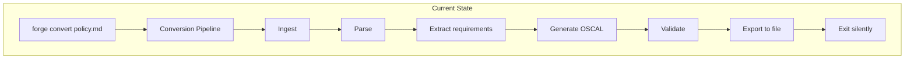
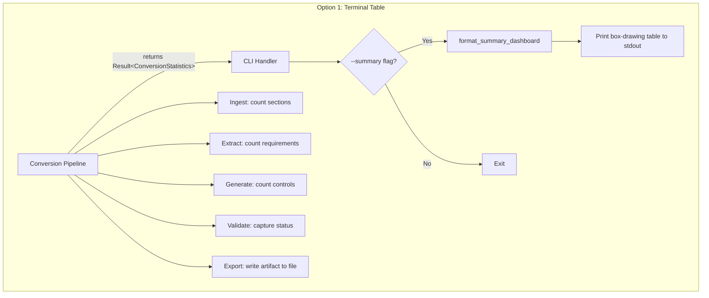
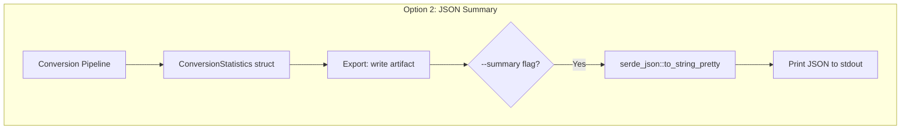
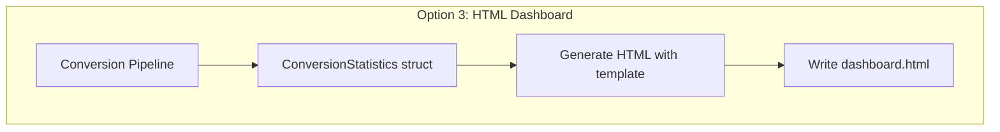
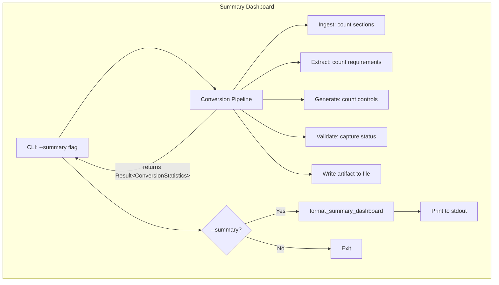
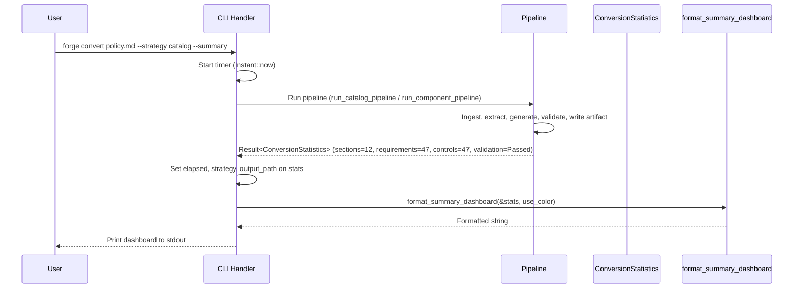

# 044-ar-summary-dashboard

> **Document Type:** Architecture Review
> **Audience:** LLM agents, human reviewers
> **Status:** Proposed
> **Last Updated:** 2026-02-10 <!-- @auto -->
> **Owner:** Brian Luby <!-- @human-required -->
> **Deciders:** Brian Luby <!-- @human-required -->

---

## Review Tier Legend

| Marker | Tier | Speckit Behavior |
|--------|------|------------------|
| 🔴 `@human-required` | Human Generated | Prompt human to author; blocks until complete |
| 🟡 `@human-review` | LLM + Human Review | LLM drafts → prompt human to confirm/edit; blocks until confirmed |
| 🟢 `@llm-autonomous` | LLM Autonomous | LLM completes; no prompt; logged for audit |
| ⚪ `@auto` | Auto-generated | System fills (timestamps, links); no prompt |

---

## Document Completion Order

> ⚠️ **For LLM Agents:** Complete sections in this order. Do not fill downstream sections until upstream human-required inputs exist.

1. **Summary (Decision)** → requires human input first
2. **Context (Problem Space)** → requires human input
3. **Decision Drivers** → requires human input (prioritized)
4. **Driving Requirements** → extract from PRD, human confirms
5. **Options Considered** → LLM drafts after drivers exist, human reviews
6. **Decision (Selected + Rationale)** → requires human decision
7. **Implementation Guardrails** → LLM drafts, human reviews
8. **Everything else** → can proceed after decision is made

---

## Linkage ⚪ `@auto`

| Document | ID | Relationship |
|----------|-----|--------------|
| Parent PRD | [044-prd-summary-dashboard](../PRD/044-prd-summary-dashboard.md) | Requirements this architecture satisfies |
| Security Review | N/A | Statistics display only; no sensitive data in dashboard |
| Supersedes | — | N/A (new feature) |
| Superseded By | — | |

---

## Summary

### Decision 🔴 `@human-required`
> Use a lightweight `ConversionStatistics` struct passed through the pipeline, with terminal table output using box-drawing characters for the `--summary` flag on the `convert` subcommand. No external dependencies for formatting. Statistics are collected at pipeline stage boundaries with negligible performance overhead.

### TL;DR for Agents 🟡 `@human-review`
> Add a `--summary` flag to `forge convert`. Define a `ConversionStatistics` struct that accumulates counts (sections parsed, requirements extracted, controls generated, validation status, mapping coverage). Instrument the pipeline to populate this struct at stage boundaries. After the artifact file is written, if `--summary` is set, call `format_summary_dashboard()` to produce a box-drawing formatted table and print to stdout. Do NOT print the summary before the artifact is written. Do NOT mix summary output with artifact JSON. Do NOT add external table formatting dependencies — use custom box-drawing characters.

---

## Context

### Problem Space 🔴 `@human-required`
Currently, `forge convert` produces an OSCAL artifact and exits with minimal feedback. Users have no visibility into pipeline behavior — how many sections were found, how many requirements were extracted, whether validation passed, or what percentage of requirements mapped to controls. The architectural challenge is choosing the right approach for statistics collection and display: should we emit a structured JSON summary, a formatted terminal table, or an HTML dashboard? For collection, should statistics be gathered in a separate post-processing pass or inline during pipeline execution? This is an XS-sized feature, so the architecture must minimize complexity.

### Decision Scope 🟡 `@human-review`

**This AR decides:**
- How statistics are collected during pipeline execution
- The data structure for conversion statistics
- The output format for the summary dashboard
- How the `--summary` flag integrates with the CLI

**This AR does NOT decide:**
- Persistent storage of statistics — stdout only
- Historical tracking or trend analysis — single-run statistics
- Performance benchmarking or timing metrics — content statistics focus
- Whether statistics collection affects pipeline behavior — it must not

### Current State 🟢 `@llm-autonomous`
The conversion pipeline runs through stages: ingest, parse, extract, generate OSCAL, validate, export. Each stage produces intermediate results but no aggregate statistics are collected. The CLI outputs the artifact to a file (or stdout) and exits. No conversion feedback is provided beyond success/failure.



### Driving Requirements 🟡 `@human-review`

| PRD Req ID | Requirement Summary | Architectural Implication |
|------------|---------------------|---------------------------|
| M-1 | `--summary` flag on `forge convert` | New clap flag; conditional output |
| M-2 | Print sections parsed count | Collect count during ingestion/parsing stage |
| M-3 | Print requirements extracted count | Collect count during extraction stage |
| M-4 | Print controls generated count | Collect count during OSCAL generation stage |
| M-5 | Print validation status | Capture validation result after validate stage |
| M-6 | Print mapping coverage percentage | Calculate (controls / requirements) * 100 |
| M-7 | Summary printed after artifact is written, as distinct section | Sequencing: file write first, then summary |

**PRD Constraints inherited:**
- From constitution: Rust latest stable, TDD mandatory
- From PRD: No new external dependencies; box-drawing formatting

---

## Decision Drivers 🔴 `@human-required`

1. **Zero overhead:** Statistics collection must not impact conversion performance *(traces to PRD constraint: no performance regression)*
2. **Clarity:** Dashboard must be immediately readable at a glance *(traces to PRD M-6, M-7)*
3. **Minimal dependencies:** XS-sized feature — no new crates for formatting *(constitution principle X — YAGNI)*
4. **Non-interference:** Summary must not corrupt or interfere with artifact output *(traces to PRD M-7)*

---

## Options Considered 🟡 `@human-review`

### Option 0: Status Quo / Do Nothing

**Description:** No summary output. Users must manually inspect JSON output to assess conversion quality.

| Driver | Rating | Notes |
|--------|--------|-------|
| Zero overhead | ✅ Good | No collection, no overhead |
| Clarity | ❌ Poor | No feedback provided |
| Minimal dependencies | ✅ Good | No code to maintain |
| Non-interference | ✅ Good | Nothing to interfere |

**Why not viable:** Parent PRD C-4 requires conversion statistics. Without feedback, users cannot assess conversion quality without manual JSON inspection.

---

### Option 1: Terminal Table Output (Recommended)

**Description:** Define a `ConversionStatistics` struct that is passed through the pipeline and populated at each stage boundary. After the artifact is written, if `--summary` is set, format the statistics as a box-drawing character table and print to stdout.



| Driver | Rating | Notes |
|--------|--------|-------|
| Zero overhead | ✅ Good | Incrementing counters: O(1) per stage, negligible |
| Clarity | ✅ Good | Box-drawing table is clean, aligned, scannable |
| Minimal dependencies | ✅ Good | Box-drawing characters are Unicode; no crate needed |
| Non-interference | ✅ Good | Summary printed after file write; separate from artifact |

**Pros:**
- Zero new dependencies — box-drawing chars are Unicode string formatting
- Negligible performance impact — incrementing usize counters
- Clean, professional terminal output
- Familiar format (similar to cargo build output)

**Cons:**
- Box-drawing characters may not render in all terminals (rare; most modern terminals support Unicode)
- Manual formatting code (not a big concern for XS scope)

---

### Option 2: JSON Summary

**Description:** After conversion, output a JSON object with statistics fields to stdout (or a separate file). The summary is machine-readable.



| Driver | Rating | Notes |
|--------|--------|-------|
| Zero overhead | ✅ Good | Same struct population |
| Clarity | ⚠️ Medium | JSON is readable but not as scannable as a table |
| Minimal dependencies | ✅ Good | Uses existing serde_json |
| Non-interference | ⚠️ Medium | JSON summary on stdout could be confused with artifact output |

**Pros:**
- Machine-readable for scripting and automation
- Trivial to implement with serde_json serialization

**Cons:**
- Less readable for humans than a formatted table
- JSON on stdout after artifact may confuse automation that expects only the artifact
- Not as visually clear for "at a glance" quality assessment

---

### Option 3: HTML Dashboard

**Description:** Generate an HTML file with styled statistics tables, charts, and visual indicators. Open in browser or write to file.



| Driver | Rating | Notes |
|--------|--------|-------|
| Zero overhead | ⚠️ Medium | HTML generation adds some overhead |
| Clarity | ✅ Good | Rich visual presentation with colors and charts |
| Minimal dependencies | ❌ Poor | Requires HTML template engine (tera, askama) or embedded HTML strings |
| Non-interference | ✅ Good | Separate file output |

**Pros:**
- Rich visual presentation with charts and color coding
- Shareable and archivable as a standalone file

**Cons:**
- Massive over-engineering for an XS-sized feature
- Adds HTML template dependency
- Requires opening a browser or HTML viewer — not CLI-native
- Violates YAGNI entirely — far beyond what C-4 requires

---

## Decision

### Selected Option 🔴 `@human-required`
> **Option 1: Terminal Table Output**

### Rationale 🔴 `@human-required`
Option 1 is the clear choice for an XS-sized Phase 3 feature. A `ConversionStatistics` struct with counter fields is the simplest possible data model. Box-drawing character formatting produces clean, professional output with zero dependencies. Option 2's JSON output is less readable for the primary use case (human glancing at conversion quality), though it could be added later as PRD C-1 (`--summary-format json`). Option 3 is absurd over-engineering for printing a few numbers to stdout.

#### Simplest Implementation Comparison 🟡 `@human-review`

| Aspect | Simplest Possible | Selected Option | Justification for Complexity |
|--------|-------------------|-----------------|------------------------------|
| Components | println! with raw numbers | ConversionStatistics struct + format function | PRD M-6 requires calculated coverage; struct organizes data cleanly |
| Dependencies | None | None (box-drawing is Unicode strings) | No new dependencies added |
| Patterns | Inline formatting | Dedicated format function | Testable formatting; reusable for C-1 JSON option |

**Complexity justified by:** The selected option IS the simplest approach. A struct with counters and a format function is the minimum needed to satisfy M-1 through M-7.

### Architecture Diagram 🟡 `@human-review`



---

## Technical Specification

### Component Overview 🟡 `@human-review`

| Component | Responsibility | Interface | Dependencies |
|-----------|---------------|-----------|--------------|
| ConversionStatistics | Accumulate pipeline stage counts | Data struct with counter fields | None |
| format_summary_dashboard | Format statistics as box-drawing table | `(&ConversionStatistics, bool) -> String` | std::fmt |
| CLI --summary flag | Enable/disable dashboard output | clap 4.x bool flag | clap |
| Pipeline instrumentation | Populate counters at stage boundaries | Returns `Result<ConversionStatistics, ForgeError>` | Existing pipeline stages |

### Data Flow 🟢 `@llm-autonomous`



### Interface Definitions 🟡 `@human-review`

```rust
/// Statistics collected during a conversion pipeline run.
#[derive(Debug, Default)]
pub struct ConversionStatistics {
    pub sections_parsed: usize,
    pub requirements_extracted: usize,
    pub controls_generated: usize,
    pub validation_status: ValidationStatus,
    pub validation_errors: usize,
    pub validation_warnings: usize,
    /// Up to 3 validation error messages for dashboard display (see spec FR-005).
    pub validation_error_messages: Vec<String>,
    pub strategy: String,
    pub output_path: String,
    /// Elapsed conversion time from pipeline start to artifact write (see S-3).
    pub elapsed: Duration,
}

#[derive(Debug, Default)]
pub enum ValidationStatus {
    Passed,
    PassedWithWarnings,
    Failed,
    #[default]
    NotRun,
}

impl ConversionStatistics {
    /// Calculate mapping coverage as a percentage.
    pub fn mapping_coverage(&self) -> f64 {
        if self.requirements_extracted == 0 {
            return 0.0;
        }
        (self.controls_generated as f64 / self.requirements_extracted as f64) * 100.0
    }
}

/// Format conversion statistics as a human-readable dashboard string.
/// When `use_color` is true, ANSI color codes are applied to status indicators.
pub fn format_summary_dashboard(stats: &ConversionStatistics, use_color: bool) -> String;
```

### Key Algorithms/Patterns 🟡 `@human-review`

**Pattern:** Pipeline returns `ConversionStatistics` alongside result
```
Pipeline execution flow:
1. Pipeline function builds ConversionStatistics internally
2. After ingestion:  stats.sections_parsed = sections.len()
3. After extraction: stats.requirements_extracted = requirements.len()
4. After generation: stats.controls_generated = controls.len()
5. After validation: stats.validation_status = result; stats.validation_errors = errors.len()
6. Pipeline returns Result<ConversionStatistics, ForgeError>
7. CLI sets stats.strategy, stats.output_path, stats.elapsed from CLI context
8. If --summary: format_summary_dashboard(&stats, use_color) → stdout
```

**Pattern:** Box-drawing formatted output
```
┌─────────────────────────────────────────┐
│          FORGE Conversion Summary        │
├─────────────────────────────────────────┤
│ Strategy:           catalog              │
│ Output:             output/catalog.json  │
├─────────────────────────────────────────┤
│ Sections parsed:    12                   │
│ Requirements:       47                   │
│ Controls generated: 47                   │
│ Mapping coverage:   100.0% (47/47)       │
├─────────────────────────────────────────┤
│ Validation:         PASSED               │
└─────────────────────────────────────────┘
```

---

## Constraints & Boundaries

### Technical Constraints 🟡 `@human-review`

**Inherited from PRD:**
- Rust latest stable
- TDD mandatory
- No performance regression from instrumentation

**Added by this Architecture:**
- `ConversionStatistics` is a simple struct with usize/enum fields — no heap allocation during collection
- Statistics are set at stage boundaries (5 assignments), not per-element — O(1) overhead
- Dashboard is printed to stdout; artifact goes to file — no mixing
- `--summary` flag has no effect on pipeline behavior — conversion is identical with or without it

### Architectural Boundaries 🟡 `@human-review`

- **Owns:** `ConversionStatistics` struct, `format_summary_dashboard` function, `--summary` CLI flag
- **Interfaces With:** Pipeline stages (for counter population), CLI module (for flag and output)
- **Must Not Touch:** Pipeline logic (only instrument, not modify), OSCAL builders, validation logic

### Implementation Guardrails 🟡 `@human-review`

> ⚠️ **Critical for LLM Agents:**

- [x] **DO NOT** print the summary before the artifact file is written *(PRD M-7)*
- [x] **DO NOT** mix summary output with artifact JSON on stdout *(artifact goes to file)*
- [x] **DO NOT** modify pipeline behavior based on `--summary` — the flag is purely for output *(PRD constraint)*
- [x] **DO NOT** add external table formatting crate dependencies *(Decision: custom box-drawing)*
- [x] **MUST** handle zero requirements edge case in mapping coverage calculation *(PRD EC-1)*
- [x] **MUST** show "Not run" when validation is not available *(PRD EC-2)*

---

## Consequences 🟡 `@human-review`

### Positive
- Immediate quality feedback after conversion — users see counts and coverage at a glance
- Zero new dependencies — box-drawing is Unicode string formatting
- Negligible performance impact — 5 counter assignments per conversion
- Foundation for future enhancements (JSON summary, per-section breakdown)

### Negative
- Box-drawing characters may not render in terminals without Unicode support (rare edge case)
- Mapping coverage is a simple ratio that may be misleading when atomization produces more controls than input requirements

### Risks & Mitigations

| Risk | Likelihood | Impact | Mitigation |
|------|------------|--------|------------|
| Coverage exceeds 100% due to atomization | Low | Low | Display as-is; document that coverage reflects control-to-requirement ratio |
| Statistics collection adds latency | Very Low | Very Low | Counters are usize assignments — negligible compared to JSON serialization |

---

## Implementation Guidance

### Suggested Implementation Order 🟢 `@llm-autonomous`
1. Define `ConversionStatistics` struct and `ValidationStatus` enum
2. Implement `mapping_coverage()` method with zero-division guard
3. Implement `format_summary_dashboard()` with box-drawing formatting
4. Add `--summary` flag to `convert` subcommand via clap
5. Instrument pipeline stages to populate statistics
6. Wire summary printing after artifact file write
7. Write unit tests for formatting, coverage calculation, and edge cases

### Testing Strategy 🟢 `@llm-autonomous`

| Layer | Test Type | Coverage Target | Notes |
|-------|-----------|-----------------|-------|
| Unit | mapping_coverage calculation | 100% | Zero, partial, full, >100% cases |
| Unit | format_summary_dashboard | 90% | Output contains expected strings and formatting |
| Unit | ValidationStatus display | 100% | All enum variants |
| Integration | --summary flag | Key paths | Flag present vs absent; verify output ordering |

### Anti-patterns to Avoid 🟡 `@human-review`
- **Don't:** Use floating-point equality in tests for coverage percentage
  - **Why:** Float precision issues cause flaky tests
  - **Instead:** Use approximate comparison with epsilon (e.g., `(actual - expected).abs() < 0.01`)
- **Don't:** Hard-code statistics values in formatting tests
  - **Why:** Brittle; breaks when format changes
  - **Instead:** Assert that key substrings are present (e.g., contains "Sections parsed:")

---

## Compliance & Cross-cutting Concerns

### Security Considerations 🟡 `@human-review`
- Authentication: N/A — local CLI tool
- Authorization: N/A
- Data handling: Dashboard shows aggregate counts only — no policy content exposed in statistics

### Observability 🟢 `@llm-autonomous`
- **Logging:** Statistics values logged at DEBUG level regardless of --summary flag
- **Metrics:** N/A for CLI tool
- **Tracing:** N/A for Phase 3 exploratory feature

### Error Handling Strategy 🟢 `@llm-autonomous`
```
Error Category → Handling Approach
├── Zero requirements extracted → mapping_coverage returns 0.0; warning in dashboard
├── Validation not available → Display "Not run" in validation status
├── Conversion failure → Summary not printed; only error message shown
└── Format errors → Unreachable (string formatting cannot fail)
```

---

## Migration Plan (if applicable) 🟡 `@human-review`

N/A — new feature addition. No migration required.

### Rollback Plan 🔴 `@human-required`

N/A — Phase 3 exploratory feature. The `--summary` flag and `ConversionStatistics` struct can be removed without any impact on conversion functionality. The flag is purely additive output.

---

## Open Questions 🟡 `@human-review`

No open questions for this work item.

---

## Changelog ⚪ `@auto`

| Version | Date | Author | Changes |
|---------|------|--------|---------|
| 0.1 | 2026-02-10 | LLM (Claude) | Initial proposal |

---

## Decision Record ⚪ `@auto`

| Date | Event | Details |
|------|-------|---------|
| 2026-02-10 | Proposed | Initial draft created from PRD 044 |

---

## Traceability Matrix 🟢 `@llm-autonomous`

| PRD Req ID | Decision Driver | Option Rating | Component | Notes |
|------------|-----------------|---------------|-----------|-------|
| M-1 | Minimal dependencies | Option 1: ✅ | CLI --summary flag | clap bool flag |
| M-2 | Clarity | Option 1: ✅ | Pipeline instrumentation | sections_parsed counter |
| M-3 | Clarity | Option 1: ✅ | Pipeline instrumentation | requirements_extracted counter |
| M-4 | Clarity | Option 1: ✅ | Pipeline instrumentation | controls_generated counter |
| M-5 | Clarity | Option 1: ✅ | Pipeline instrumentation | validation_status capture |
| M-6 | Clarity | Option 1: ✅ | ConversionStatistics | mapping_coverage() method |
| M-7 | Non-interference | Option 1: ✅ | CLI handler | Summary after file write |

---

## Review Checklist 🟢 `@llm-autonomous`

Before marking as Accepted:
- [x] All PRD Must Have requirements appear in Driving Requirements
- [x] Option 0 (Status Quo) is documented
- [x] Simplest Implementation comparison is completed
- [x] Decision drivers are prioritized and addressed
- [x] At least 2 options were seriously considered
- [x] Constraints distinguish inherited vs. new
- [x] Component names are consistent across all diagrams and tables
- [x] Implementation guardrails reference specific PRD constraints
- [x] Rollback triggers and authority are defined (N/A — new exploratory feature)
- [x] Security review is linked or N/A documented
- [x] No open questions blocking implementation
