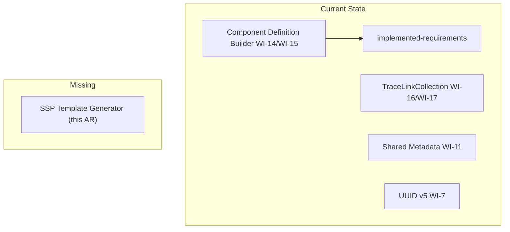
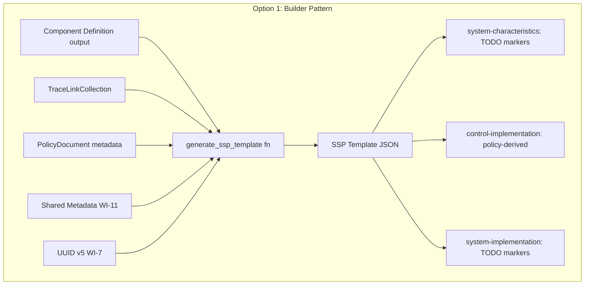
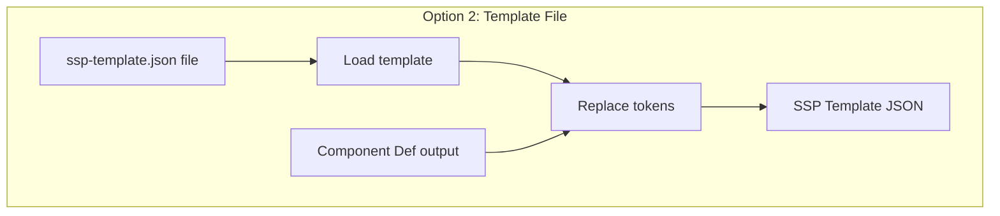
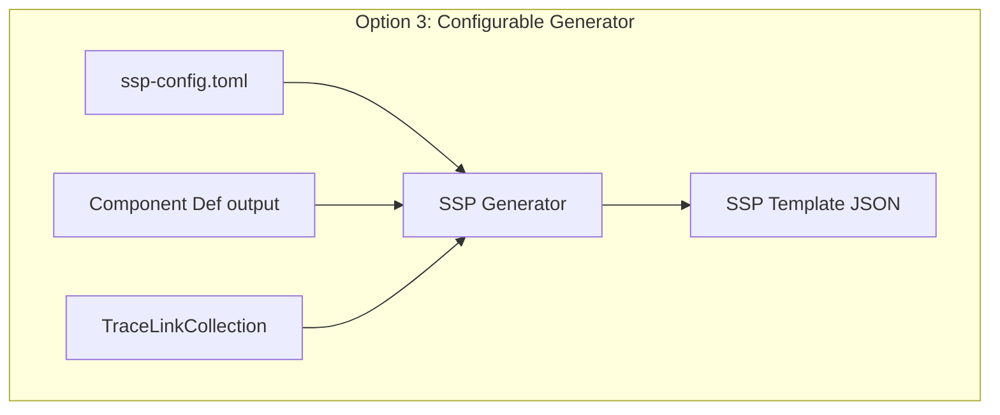
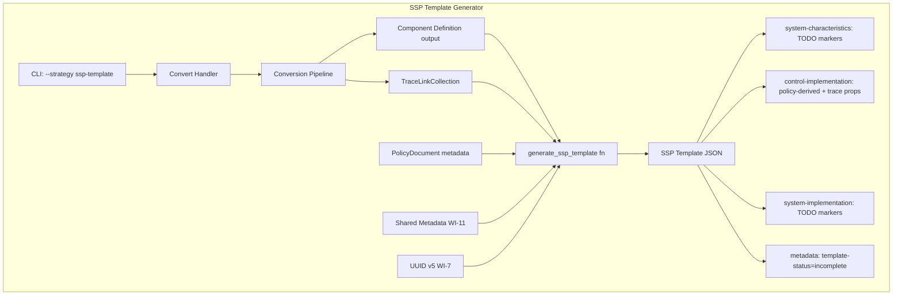
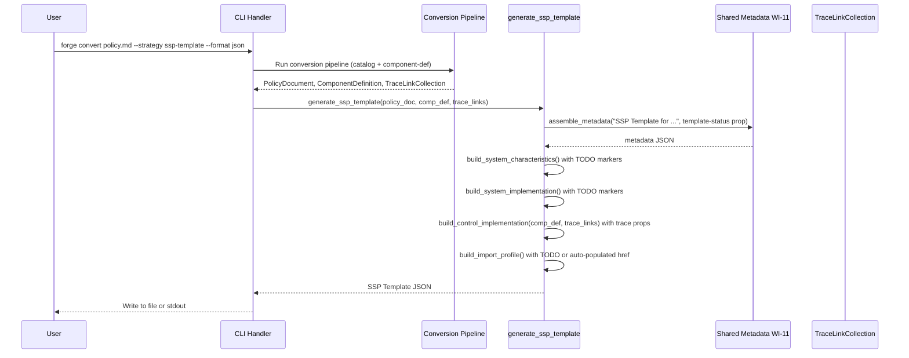
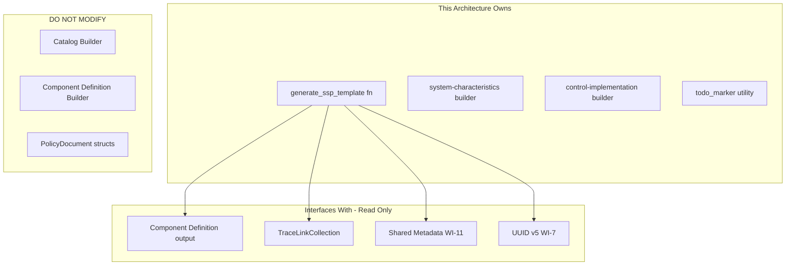

# 045-ar-ssp-template-structure

> **Document Type:** Architecture Review
> **Audience:** LLM agents, human reviewers
> **Status:** Proposed
> **Last Updated:** 2026-02-10 <!-- @auto -->
> **Owner:** Brian Luby <!-- @human-required -->
> **Deciders:** Brian Luby <!-- @human-required -->

---

## Review Tier Legend

| Marker | Tier | Speckit Behavior |
|--------|------|------------------|
| 🔴 `@human-required` | Human Generated | Prompt human to author; blocks until complete |
| 🟡 `@human-review` | LLM + Human Review | LLM drafts → prompt human to confirm/edit; blocks until confirmed |
| 🟢 `@llm-autonomous` | LLM Autonomous | LLM completes; no prompt; logged for audit |
| ⚪ `@auto` | Auto-generated | System fills (timestamps, links); no prompt |

---

## Document Completion Order

> ⚠️ **For LLM Agents:** Complete sections in this order. Do not fill downstream sections until upstream human-required inputs exist.

1. **Summary (Decision)** → requires human input first
2. **Context (Problem Space)** → requires human input
3. **Decision Drivers** → requires human input (prioritized)
4. **Driving Requirements** → extract from PRD, human confirms
5. **Options Considered** → LLM drafts after drivers exist, human reviews
6. **Decision (Selected + Rationale)** → requires human decision
7. **Implementation Guardrails** → LLM drafts, human reviews
8. **Everything else** → can proceed after decision is made

---

## Linkage ⚪ `@auto`

| Document | ID | Relationship |
|----------|-----|--------------|
| Parent PRD | [045-prd-ssp-template-structure](../PRD/045-prd-ssp-template-structure.md) | Requirements this architecture satisfies |
| Security Review | N/A | Template generation only; no system-specific sensitive data |
| Supersedes | — | N/A (new feature) |
| Superseded By | — | |

---

## Summary

### Decision 🔴 `@human-required`
> Use a configurable SSP generator approach: build the SSP template with direct `serde_json::Value` construction (matching the Catalog/Component Definition builder pattern), populate `control-implementation` from Component Definition pipeline output with embedded trace link props, and fill system-specific sections with structured TODO markers. Expose via `--strategy ssp-template` on the `forge convert` subcommand.

### TL;DR for Agents 🟡 `@human-review`
> The SSP template generator creates a JSON scaffold with all 6 required OSCAL SSP top-level sections. `control-implementation` is populated from Component Definition implemented-requirements with `source-requirement-id` trace props. `system-characteristics` and `system-implementation` contain structured TODO markers. Metadata includes `template-status=incomplete` prop. Use `serde_json::Value` construction (NOT a template engine). Do NOT attempt full schema validation (TODO placeholders will fail required-field checks). Do NOT generate system-specific data — only policy-derivable content plus TODO markers.

---

## Context

### Problem Space 🔴 `@human-required`
FORGE generates Catalogs, Profiles, and Component Definitions, but compliance engineers who need System Security Plans must start from scratch. The parent PRD (FORGE_PRD.md) explicitly defers "Full SSP generation" as W-1 because it requires system-specific data beyond policy text. However, a significant portion of the SSP — specifically `control-implementation` with implementation statements — can be pre-populated from existing Component Definition output. The architectural challenge is: how should the SSP template be constructed? Options include a builder pattern (consistent with other OSCAL generators), a template file approach (external JSON template with placeholders), or a configurable generator with extensible TODO marker patterns. The solution must embed trace links for traceability and clearly distinguish policy-derived content from TODO placeholders.

### Decision Scope 🟡 `@human-review`

**This AR decides:**
- How the SSP template JSON structure is assembled
- How implementation statements are sourced from Component Definition output
- How TODO markers are structured and placed in system-specific sections
- How trace links are embedded in implementation statements
- How the SSP template integrates with the CLI

**This AR does NOT decide:**
- System inventory, boundaries, or hosting placeholders — deferred to WI-46
- Full SSP schema validation — TODO placeholders prevent full validation
- XML or YAML SSP output — JSON only in this work item
- Profile resolution for import-profile — may be TODO or auto-populated

### Current State 🟢 `@llm-autonomous`
The FORGE pipeline produces Catalogs (WI-9/WI-10/WI-13), Component Definitions with implemented-requirements (WI-14/WI-15/WI-18), and TraceLinkCollections (WI-16/WI-17). Shared infrastructure exists for metadata assembly (WI-11), UUID v5 (WI-7), and back matter (WI-12). No SSP generation capability exists. The `oscal` module follows a `serde_json::Value` builder pattern.



### Driving Requirements 🟡 `@human-review`

| PRD Req ID | Requirement Summary | Architectural Implication |
|------------|---------------------|---------------------------|
| M-1 | Generate SSP template JSON with `--strategy ssp-template` | New strategy variant in CLI; new builder function |
| M-2 | Template contains all 6 OSCAL SSP top-level sections | Builder must construct complete SSP structure |
| M-3 | system-characteristics has TODO markers for system name, description, sensitivity level, authorization boundary | TODO marker generation with descriptive instructions |
| M-4 | control-implementation populated from Component Definition output | Cross-artifact data flow from CompDef to SSP |
| M-5 | Implementation statements include `source-requirement-id` trace prop | Trace link embedding using TraceLinkCollection |
| M-6 | Metadata includes `template-status=incomplete` prop | Metadata prop to indicate template status |

**PRD Constraints inherited:**
- From constitution: Rust latest stable, thiserror, TDD mandatory
- From PRD: serde_json for JSON output, no new external crates, consistent TODO marker format
- From parent PRD W-1: This is template generation, not full SSP generation

---

## Decision Drivers 🔴 `@human-required`

1. **Consistency:** Builder pattern must match Catalog/Component Definition generators *(constitution principle X)*
2. **Traceability:** Every implementation statement must trace back to source policy requirement *(Product Principle P-2)*
3. **Clarity of incompleteness:** Users must clearly see what is policy-derived vs what needs manual completion *(PRD M-3, M-6)*
4. **Extensibility:** WI-46 will extend the template with detailed system-specific placeholders *(PRD dependency)*

---

## Options Considered 🟡 `@human-review`

### Option 0: Status Quo / Do Nothing

**Description:** No SSP template generation. Users create SSPs from scratch.

| Driver | Rating | Notes |
|--------|--------|-------|
| Consistency | N/A | No builder to evaluate |
| Traceability | ❌ Poor | Manual SSP creation loses policy traceability |
| Clarity of incompleteness | N/A | No template to evaluate |
| Extensibility | ❌ Poor | No foundation for WI-46 |

**Why not viable:** Without SSP templates, compliance engineers redundantly re-enter policy-derived implementation narratives. This blocks strategic goal G-4 (Implementation Layer) and leaves no foundation for WI-46.

---

### Option 1: Builder Pattern (Recommended)

**Description:** Build the SSP template using direct `serde_json::Value` construction, consistent with the Catalog (WI-9) and Component Definition (WI-14) generators. A `generate_ssp_template` function receives the Component Definition output (for implementation statements) and TraceLinkCollection (for trace props), then assembles the SSP JSON with TODO markers in system-specific sections.



| Driver | Rating | Notes |
|--------|--------|-------|
| Consistency | ✅ Good | Same pattern as Catalog/CompDef builders |
| Traceability | ✅ Good | Trace props embedded during construction |
| Clarity of incompleteness | ✅ Good | TODO markers as string values; template-status prop |
| Extensibility | ✅ Good | WI-46 can extend by adding sections to the builder |

**Pros:**
- Consistent with established codebase pattern — LLM agents and developers know the pattern
- Full control over JSON structure including trace link embedding
- No new dependencies
- Type-safe construction with compile-time catches for missing fields
- Easily extensible by WI-46

**Cons:**
- More verbose code than a template file approach
- TODO markers are string literals embedded in Rust code

---

### Option 2: Template File

**Description:** Define an external JSON template file (e.g., `templates/ssp-template.json`) with placeholder tokens (e.g., `{{SYSTEM_NAME}}`, `{{CONTROL_IMPLEMENTATIONS}}`). At generation time, load the template, replace tokens with actual data or TODO markers, and write the result.



| Driver | Rating | Notes |
|--------|--------|-------|
| Consistency | ❌ Poor | Different pattern from all other OSCAL generators |
| Traceability | ⚠️ Medium | Trace links must be injected into template tokens |
| Clarity of incompleteness | ✅ Good | Template explicitly shows placeholder locations |
| Extensibility | ⚠️ Medium | Template file must be updated for WI-46 changes |

**Pros:**
- SSP structure is visible as a standalone file — easy to review and modify
- Non-developers can update the template
- Token replacement is conceptually simple

**Cons:**
- Breaks the established builder pattern — inconsistent with Catalog/CompDef generators
- Token replacement for nested structures (control-implementation with variable-length arrays) is complex
- Embedding trace links as props requires dynamic JSON construction within the template, negating the simplicity
- Template file management adds a deployment concern (must be bundled with binary)
- Adds a template engine dependency (tera, handlebars) or custom token replacement code

---

### Option 3: Configurable SSP Generator

**Description:** Define a configuration schema that specifies which SSP sections to generate, which fields are TODO markers, and how implementation statements map from Component Definitions. The generator reads the config and produces the SSP template accordingly.



| Driver | Rating | Notes |
|--------|--------|-------|
| Consistency | ⚠️ Medium | Adds configuration layer not present in other generators |
| Traceability | ✅ Good | Config can specify trace link behavior |
| Clarity of incompleteness | ✅ Good | Config explicitly marks TODO sections |
| Extensibility | ✅ Good | WI-46 adds config options |

**Pros:**
- Maximum flexibility for different SSP requirements
- Configuration-driven approach allows customization without code changes

**Cons:**
- Massive over-engineering for Phase 3 exploratory scope
- Configuration schema design, parsing, and validation adds significant complexity
- Violates YAGNI — no validated user need for customizable SSP template generation
- Configuration is another file to manage, document, and deploy

---

## Decision

### Selected Option 🔴 `@human-required`
> **Option 1: Builder Pattern**

### Rationale 🔴 `@human-required`
Option 1 maintains consistency with the established OSCAL builder pattern used throughout FORGE. The SSP template generator follows the same approach as Catalog (WI-9) and Component Definition (WI-14) generators — receive domain data, construct `serde_json::Value`, return JSON. This consistency reduces cognitive load for developers and LLM agents. Trace link embedding fits naturally into the builder pattern. Option 2's template file approach introduces a different pattern and struggles with dynamic structures (variable-length control-implementation arrays). Option 3's configuration layer is premature for an exploratory feature. The builder pattern is extensible for WI-46 without architectural changes.

#### Simplest Implementation Comparison 🟡 `@human-review`

| Aspect | Simplest Possible | Selected Option | Justification for Complexity |
|--------|-------------------|-----------------|------------------------------|
| Components | Single function, hardcoded JSON | Builder fn with metadata, TODO markers, trace props | PRD M-2 requires 6 sections; M-5 requires trace props; M-6 requires status prop |
| Dependencies | serde_json only | serde_json + uuid + shared metadata fn | PRD M-5 requires trace links; consistency with WI-11 metadata |
| Patterns | Inline JSON construction | Builder fn matching Catalog/CompDef pattern | Codebase consistency |

**Complexity justified by:** The selected option is the simplest approach that satisfies all Must Have requirements (M-1 through M-6) while maintaining codebase consistency. No abstractions beyond what the PRD requires.

### Architecture Diagram 🟡 `@human-review`



---

## Technical Specification

### Component Overview 🟡 `@human-review`

| Component | Responsibility | Interface | Dependencies |
|-----------|---------------|-----------|--------------|
| generate_ssp_template | Assemble SSP template JSON from pipeline outputs | `(&PolicyDocument, &ComponentDefinition, &TraceLinkCollection) -> Result<SspTemplate>` | serde_json, uuid, shared metadata |
| build_system_characteristics | Create system-characteristics with TODO markers | Internal fn | None |
| build_control_implementation | Create control-implementation from CompDef output with trace props | Internal fn | TraceLinkCollection |
| todo_marker | Generate consistent TODO marker strings | Utility fn: `(&str) -> String` | None |
| CLI strategy extension | Add `ssp-template` to strategy enum | CLI enum variant | clap 4.x |

### Data Flow 🟢 `@llm-autonomous`



### Interface Definitions 🟡 `@human-review`

```rust
/// Generate an SSP template JSON from pipeline outputs.
///
/// # Arguments
/// * `policy_doc` - Source policy document metadata
/// * `component_def` - Component Definition with implemented-requirements
/// * `trace_links` - TraceLinkCollection for source traceability
///
/// # Returns
/// A `serde_json::Value` representing the SSP template JSON.
pub fn generate_ssp_template(
    policy_doc: &PolicyDocument,
    component_def: &serde_json::Value,
    trace_links: &TraceLinkCollection,
) -> Result<serde_json::Value, ForgeError>;

/// Generate a consistent TODO marker string.
const TODO_MARKER_PREFIX: &str = "TODO: ";

fn todo_marker(instruction: &str) -> String {
    format!("{}{}", TODO_MARKER_PREFIX, instruction)
}

// Expected SSP template structure:
// {
//   "system-security-plan": {
//     "uuid": "<generated-uuid>",
//     "metadata": {
//       "title": "SSP Template for <Policy Title>",
//       "last-modified": "<ISO 8601>",
//       "version": "0.0.0",
//       "oscal-version": "1.2.0",
//       "props": [
//         { "name": "template-status", "value": "incomplete" }
//       ]
//     },
//     "import-profile": {
//       "href": "TODO: Enter the path to the applicable security baseline profile"
//     },
//     "system-characteristics": {
//       "system-name": "TODO: Enter the system name",
//       "description": "TODO: Enter a description of the system",
//       "security-sensitivity-level": "TODO: Enter FIPS 199 categorization (low/moderate/high)",
//       "system-information": { ... },
//       "security-impact-level": { ... },
//       "authorization-boundary": {
//         "description": "TODO: Describe the system authorization boundary"
//       }
//     },
//     "system-implementation": {
//       "users": [],
//       "components": []
//     },
//     "control-implementation": {
//       "description": "Control implementations derived from <Policy Title>",
//       "implemented-requirements": [
//         {
//           "uuid": "<generated-uuid>",
//           "control-id": "POL-AC-001",
//           "statements": { ... },
//           "props": [
//             { "name": "source-requirement-id", "value": "<stable-id>" }
//           ]
//         }
//       ]
//     }
//   }
// }
```

### Key Algorithms/Patterns 🟡 `@human-review`

**Pattern:** Builder function with policy-derived content and TODO markers
```
1. Generate SSP template UUID (v4 or v5 from policy content)
2. Build metadata with title, timestamp, version, oscal-version, template-status prop
3. Build import-profile with TODO marker for profile href (or auto-populate if available)
4. Build system-characteristics with TODO markers:
   - system-name: TODO marker
   - description: TODO marker
   - security-sensitivity-level: TODO marker
   - authorization-boundary.description: TODO marker
5. Build system-implementation with empty arrays (TODO markers via WI-46)
6. Build control-implementation:
   - For each implemented-requirement in Component Definition:
     a. Copy control-id, statements, description
     b. Look up trace link by requirement ID
     c. Add prop: name="source-requirement-id", value=stable_id
7. Assemble root system-security-plan object
8. Return serde_json::Value
```

**Pattern:** Consistent TODO marker format
```
TODO: Enter the system name as registered in the authorization package
TODO: Enter a description of the system's purpose and functionality
TODO: Enter the FIPS 199 security categorization (low/moderate/high)
TODO: Describe the system authorization boundary
TODO: Enter the path to the applicable security baseline profile
```

---

## Constraints & Boundaries

### Technical Constraints 🟡 `@human-review`

**Inherited from PRD:**
- Rust latest stable, serde_json for JSON output
- No new external crates
- thiserror for error types
- TDD mandatory

**Added by this Architecture:**
- SSP template is NOT expected to pass full OSCAL SSP schema validation (TODO placeholders violate required-field type constraints)
- TODO markers follow the format `"TODO: [descriptive instruction]"` — consistent, searchable
- Implementation statements are sourced from Component Definition output — not re-derived from policy text
- Trace links are embedded as props on individual implemented-requirements, not as a separate sidecar

### Architectural Boundaries 🟡 `@human-review'



- **Owns:** SSP template generator, system-characteristics builder, control-implementation builder, TODO marker utility
- **Interfaces With:** Component Definition output, TraceLinkCollection, shared metadata, UUID generator
- **Must Not Touch:** Catalog builder, Component Definition builder, domain model structs, validation pipeline

### Implementation Guardrails 🟡 `@human-review`

> ⚠️ **Critical for LLM Agents:**

- [x] **DO NOT** attempt full OSCAL SSP schema validation on templates — TODO placeholders will fail required-field checks *(PRD R-1)*
- [x] **DO NOT** generate system-specific data (inventory, boundaries, hosting) — use TODO markers only *(parent PRD W-1)*
- [x] **DO NOT** use a template engine (tera, handlebars) — use direct serde_json::Value construction *(Decision)*
- [x] **DO NOT** re-derive implementation statements from policy text — source from Component Definition output *(PRD M-4)*
- [x] **MUST** include `template-status=incomplete` prop in metadata *(PRD M-6)*
- [x] **MUST** embed `source-requirement-id` trace props on every implementation statement *(PRD M-5, Product Principle P-2)*
- [x] **MUST** use the consistent `TODO: ` prefix for all placeholder markers *(PRD Technical Constraints)*

---

## Consequences 🟡 `@human-review`

### Positive
- Compliance engineers get a head start on SSP authoring — implementation statements pre-populated
- End-to-end traceability maintained from policy source through SSP implementation statements
- Clear TODO markers make incompleteness obvious — no confusion about what needs manual completion
- Consistent with established builder pattern — no new paradigms

### Negative
- SSP template does not pass full OSCAL schema validation due to TODO string placeholders
- Only JSON output — XML/YAML SSP templates require WI-26-WI-29 pattern extension
- system-implementation and system-characteristics are mostly empty placeholders until WI-46

### Risks & Mitigations

| Risk | Likelihood | Impact | Mitigation |
|------|------------|--------|------------|
| Users confuse template with complete SSP | Low | Med | template-status=incomplete prop; TODO markers throughout; CLI output message stating "template" |
| Trace link lookup fails for some implementation statements | Low | Low | Log warning; omit prop rather than including invalid reference |
| OSCAL SSP structure evolves in v1.3.0 | Low | Med | Pin to v1.2.0; update when NIST publishes new schema |

---

## Implementation Guidance

### Suggested Implementation Order 🟢 `@llm-autonomous`
1. Define `todo_marker` utility function and TODO marker constants
2. Implement `build_system_characteristics` with TODO markers
3. Implement `build_control_implementation` from Component Definition output with trace props
4. Implement `generate_ssp_template` as the orchestrating builder function
5. Add `ssp-template` variant to the CLI strategy enum
6. Wire the SSP template generator into the CLI convert handler
7. Write unit tests for template structure, TODO markers, trace links, and edge cases

### Testing Strategy 🟢 `@llm-autonomous`

| Layer | Test Type | Coverage Target | Notes |
|-------|-----------|-----------------|-------|
| Unit | generate_ssp_template structure | 90% | AC-1, AC-2: all 6 top-level sections present |
| Unit | TODO markers in system-characteristics | 100% | AC-3: all system-specific fields have markers |
| Unit | control-implementation population | 90% | AC-4: implementation statements from CompDef |
| Unit | Trace link embedding | 100% | AC-5: source-requirement-id prop on each statement |
| Unit | template-status prop | 100% | AC-6: metadata prop present |
| Unit | Edge cases | 100% | EC-1 through EC-4 |

### Reference Implementations 🟡 `@human-review`

- NIST OSCAL SSP examples: https://github.com/usnistgov/oscal-content/tree/main/examples/ssp *(external, requires human approval)*
- Catalog builder (WI-9) in codebase for structural pattern *(internal)*
- Component Definition builder (WI-14) in codebase for implementation statement handling *(internal)*

### Anti-patterns to Avoid 🟡 `@human-review`
- **Don't:** Generate implementation statements from raw policy text instead of Component Definition output
  - **Why:** Duplicates the CompDef pipeline; loses consistency between artifacts
  - **Instead:** Source from Component Definition implemented-requirements
- **Don't:** Hardcode OSCAL field names as magic strings throughout the builder
  - **Why:** Fragile; typo-prone; inconsistent across modules
  - **Instead:** Use constants for OSCAL field names (e.g., `SYSTEM_SECURITY_PLAN`, `CONTROL_IMPLEMENTATION`)

---

## Compliance & Cross-cutting Concerns

### Security Considerations 🟡 `@human-review`
- Authentication: N/A — local CLI tool
- Authorization: N/A
- Data handling: SSP templates contain policy-derived implementation narratives revealing security posture; treat as sensitive

### Observability 🟢 `@llm-autonomous`
- **Logging:** Log implementation statement count and TODO marker count at INFO level
- **Metrics:** N/A for CLI tool
- **Tracing:** N/A for Phase 3 exploratory feature

### Error Handling Strategy 🟢 `@llm-autonomous`
```
Error Category → Handling Approach
├── No Component Definition output available → ForgeError with descriptive message
├── Trace link lookup failure → Warning logged; prop omitted for that statement
├── Empty implementation statements → Valid: empty control-implementation with warning
├── Serialization failure → ForgeError::Serialization
└── Invalid strategy flag → clap handles with auto-generated error
```

---

## Migration Plan (if applicable) 🟡 `@human-review`

N/A — new feature addition. No migration required.

### Rollback Plan 🔴 `@human-required`

N/A — Phase 3 exploratory feature. The SSP template generator is a self-contained builder function. Removing it has no impact on existing Catalog, Profile, or Component Definition functionality. The `ssp-template` strategy variant can be removed from the CLI enum.

---

## Open Questions 🟡 `@human-review`

- [ ] **Q1:** Should `import-profile` auto-populate from Profile pipeline output if available, or always use a TODO marker? Auto-populating is more useful but creates a dependency on Profile generation having been run first.
- [ ] **Q2:** Should TODO markers use a machine-parseable format (e.g., `TODO(system-name): description`) to enable automated tooling to enumerate incomplete fields?

These are non-blocking design preferences. Default behavior (TODO markers for both) is acceptable.

---

## Changelog ⚪ `@auto`

| Version | Date | Author | Changes |
|---------|------|--------|---------|
| 0.1 | 2026-02-10 | LLM (Claude) | Initial proposal |

---

## Decision Record ⚪ `@auto`

| Date | Event | Details |
|------|-------|---------|
| 2026-02-10 | Proposed | Initial draft created from PRD 045 |

---

## Traceability Matrix 🟢 `@llm-autonomous`

| PRD Req ID | Decision Driver | Option Rating | Component | Notes |
|------------|-----------------|---------------|-----------|-------|
| M-1 | Consistency | Option 1: ✅ | CLI strategy extension | `--strategy ssp-template` |
| M-2 | Consistency | Option 1: ✅ | generate_ssp_template | All 6 top-level sections built |
| M-3 | Clarity of incompleteness | Option 1: ✅ | build_system_characteristics | TODO markers with instructions |
| M-4 | Traceability | Option 1: ✅ | build_control_implementation | Sourced from CompDef output |
| M-5 | Traceability | Option 1: ✅ | build_control_implementation | source-requirement-id trace props |
| M-6 | Clarity of incompleteness | Option 1: ✅ | Shared Metadata WI-11 | template-status=incomplete prop |

---

## Review Checklist 🟢 `@llm-autonomous`

Before marking as Accepted:
- [x] All PRD Must Have requirements appear in Driving Requirements
- [x] Option 0 (Status Quo) is documented
- [x] Simplest Implementation comparison is completed
- [x] Decision drivers are prioritized and addressed
- [x] At least 2 options were seriously considered
- [x] Constraints distinguish inherited vs. new
- [x] Component names are consistent across all diagrams and tables
- [x] Implementation guardrails reference specific PRD constraints
- [x] Rollback triggers and authority are defined (N/A — new exploratory feature)
- [x] Security review is linked or N/A documented
- [x] No open questions blocking implementation (Q1 and Q2 are non-blocking design preferences)
