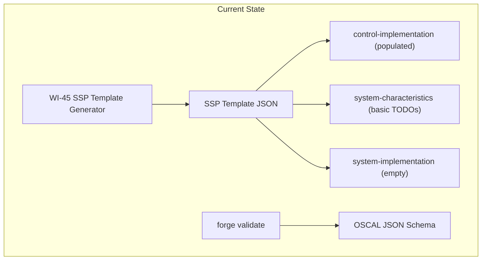
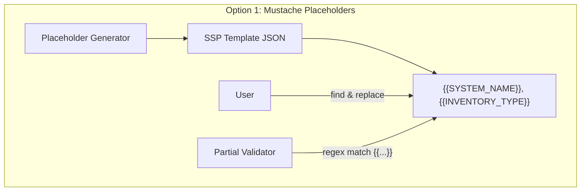
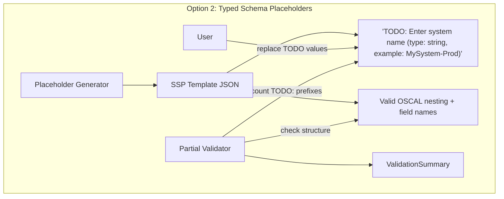
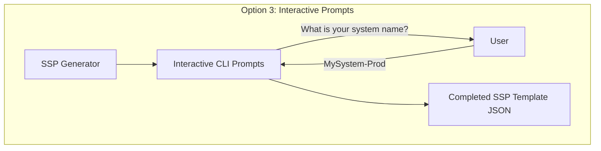
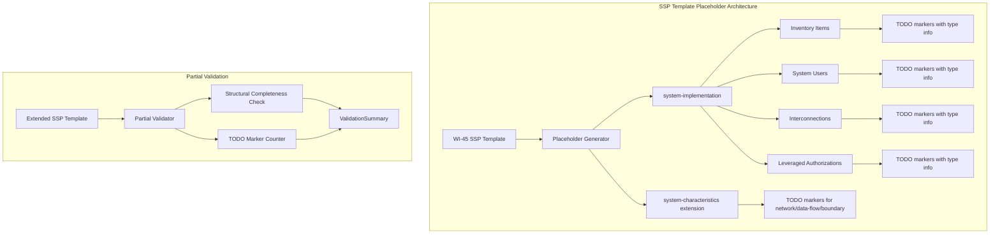
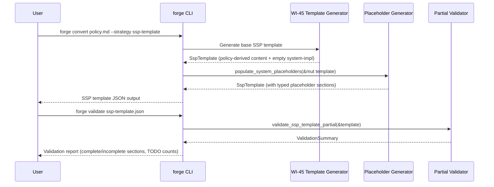
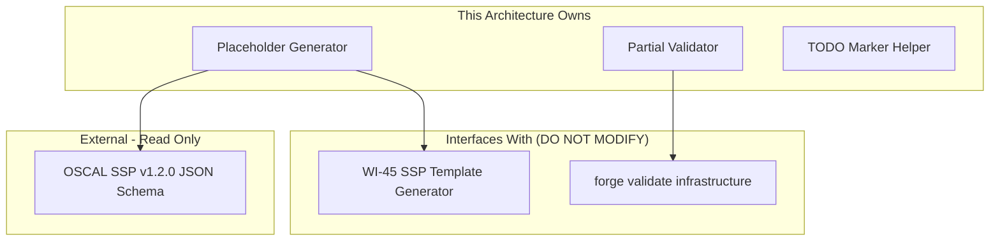

# 046-ar-ssp-template-placeholders

> **Document Type:** Architecture Review
> **Audience:** LLM agents, human reviewers
> **Status:** Proposed
> **Last Updated:** 2026-02-10 <!-- @auto -->
> **Owner:** Brian Luby <!-- @human-required -->
> **Deciders:** Brian Luby <!-- @human-required -->

---

## Review Tier Legend

| Marker | Tier | Speckit Behavior |
|--------|------|------------------|
| :red_circle: `@human-required` | Human Generated | Prompt human to author; blocks until complete |
| :yellow_circle: `@human-review` | LLM + Human Review | LLM drafts -> prompt human to confirm/edit; blocks until confirmed |
| :green_circle: `@llm-autonomous` | LLM Autonomous | LLM completes; no prompt; logged for audit |
| :white_circle: `@auto` | Auto-generated | System fills (timestamps, links); no prompt |

---

## Document Completion Order

> :warning: **For LLM Agents:** Complete sections in this order. Do not fill downstream sections until upstream human-required inputs exist.

1. **Summary (Decision)** -> requires human input first
2. **Context (Problem Space)** -> requires human input
3. **Decision Drivers** -> requires human input (prioritized)
4. **Driving Requirements** -> extract from PRD, human confirms
5. **Options Considered** -> LLM drafts after drivers exist, human reviews
6. **Decision (Selected + Rationale)** -> requires human decision
7. **Implementation Guardrails** -> LLM drafts, human reviews
8. **Everything else** -> can proceed after decision is made

---

## Linkage :white_circle: `@auto`

| Document | ID | Relationship |
|----------|-----|--------------|
| Parent PRD | [046-prd-ssp-template-placeholders](../PRD/046-prd-ssp-template-placeholders.md) | Requirements this architecture satisfies |
| Security Review | N/A | No security surface; placeholder generation only |
| Supersedes | -- | N/A |
| Superseded By | -- | |

---

## Summary

### Decision :red_circle: `@human-required`
> Use a typed schema placeholder system with serde_json construction where placeholder values are structured TODO markers carrying data type, description, and example information, validated by a structural-only partial validator that checks section presence and nesting while tolerating TODO strings.

### TL;DR for Agents :yellow_circle: `@human-review`
> SSP template placeholder generation extends the WI-45 SSP template by populating `system-implementation` with typed placeholder structures for inventory items, system users, interconnections, and leveraged authorizations. Each placeholder uses a consistent TODO marker format: `"TODO: [instruction] (type: [data-type], example: [value])"`. Partial validation checks structural completeness only -- it does NOT enforce value constraints on TODO-containing fields. Do NOT generate multiple empty placeholder items per category; one annotated example per category is sufficient.

---

## Context

### Problem Space :red_circle: `@human-required`
WI-45 produces an SSP template with policy-derived implementation statements but leaves the `system-implementation` section empty. Compliance engineers need structured placeholder sections for inventory items, users, interconnections, and leveraged authorizations -- with clear annotation on what each field expects. Without this, users must manually construct OSCAL SSP structures from scratch, which is error-prone and time-consuming. The architectural challenge is designing a placeholder system that is self-documenting, machine-parseable (for partial validation), and extensible without being overly complex.

### Decision Scope :yellow_circle: `@human-review`

**This AR decides:**
- How placeholder values are represented (format and structure of TODO markers)
- How placeholder sections are generated and injected into the SSP template
- How partial schema validation works (what it checks vs. what it tolerates)
- The interface between placeholder generation and the existing SSP template pipeline

**This AR does NOT decide:**
- Full SSP generation with real system data -- deferred per parent PRD W-1
- Interactive completion or wizard-based authoring -- W-1 in 046-prd
- XML or YAML SSP template output -- JSON only in this work item
- Assessment Plan or POA&M generation -- separate work items

### Current State :green_circle: `@llm-autonomous`
WI-45 established the SSP template structure with policy-derived `control-implementation` statements and basic TODO markers in `system-characteristics`. The `system-implementation` section exists as an empty placeholder. The template is produced as JSON via `serde_json` construction. The `forge validate` subcommand (WI-19+) supports OSCAL JSON schema validation for Catalog and Component Definition artifacts.



### Driving Requirements :yellow_circle: `@human-review`

| PRD Req ID | Requirement Summary | Architectural Implication |
|------------|---------------------|---------------------------|
| M-1 | Inventory item placeholders with TODO-annotated fields | Placeholder generator must produce valid OSCAL SSP inventory-item structure |
| M-2 | System user placeholders with TODO-annotated fields | Placeholder generator must produce valid OSCAL SSP system-user structure |
| M-3 | Interconnection placeholders with TODO-annotated fields | Placeholder generator must produce valid OSCAL SSP interconnection structure |
| M-4 | TODO markers include instruction, data type, and example | Marker format must be consistent, machine-parseable, and self-documenting |
| M-5 | Extended system-characteristics with network/data-flow/boundary TODOs | Placeholder generator must extend existing system-characteristics section |
| M-6 | Partial schema validation checking structural completeness | Validator must distinguish structural checks from value checks |
| M-7 | Validation summary listing complete vs. incomplete sections | Validator must produce a structured report with per-section TODO counts |

**PRD Constraints inherited:**
- From PRD Technical Constraints: JSON output only; `serde_json` for construction; consistent TODO marker format with WI-45
- From constitution: Rust latest stable, thiserror for errors, TDD mandatory

---

## Decision Drivers :red_circle: `@human-required`

1. **Usability:** TODO markers must be self-documenting so compliance engineers can complete fields without consulting the OSCAL specification *(traces to PRD M-4)*
2. **Consistency:** Placeholder format must be uniform across all system-implementation sub-sections and compatible with WI-45 markers *(traces to PRD M-4)*
3. **Parseability:** Partial validator must be able to detect TODO markers programmatically to count and report them *(traces to PRD M-6, M-7)*
4. **Simplicity:** Placeholder generation should extend the existing WI-45 approach without introducing new dependencies or abstractions *(constitution principle X)*

---

## Options Considered :yellow_circle: `@human-review`

### Option 0: Status Quo / Do Nothing

**Description:** Leave the `system-implementation` section empty. Users construct OSCAL SSP structures manually.

| Driver | Rating | Notes |
|--------|--------|-------|
| Usability | :x: Poor | Users must build complex OSCAL structures from scratch |
| Consistency | :x: Poor | No guidance; each user produces different structures |
| Parseability | N/A | Nothing to parse |
| Simplicity | :white_check_mark: Good | No code needed |

**Why not viable:** The empty system-implementation section is the primary barrier to SSP template completion. Without structural guidance, compliance engineers waste hours constructing OSCAL structures and frequently produce invalid output.

---

### Option 1: Mustache-Style String Placeholders

**Description:** Use mustache/handlebars-style template variables (e.g., `{{SYSTEM_NAME}}`, `{{INVENTORY_DESCRIPTION}}`) in string fields. Users find-and-replace variables with actual values.



| Driver | Rating | Notes |
|--------|--------|-------|
| Usability | :warning: Medium | Variables are recognizable but carry no type or format info |
| Consistency | :white_check_mark: Good | Uniform `{{VAR}}` pattern across all fields |
| Parseability | :white_check_mark: Good | Simple regex `\{\{.*\}\}` detects remaining placeholders |
| Simplicity | :white_check_mark: Good | Pure string substitution; no new dependencies |

**Pros:**
- Familiar pattern from web templating
- Easy to detect incomplete fields via regex
- No new dependencies

**Cons:**
- Variables carry no data type or example information -- users still need external reference
- Does not describe what valid values look like (e.g., enum options, date formats)
- Harder to extend with structured guidance per field

---

### Option 2: Typed Schema Placeholders with Structured TODO Markers

**Description:** Use descriptive TODO strings that embed data type, instruction, and example directly in the placeholder value. Each placeholder is a valid JSON string with a consistent format: `"TODO: [instruction] (type: [data-type], example: [value])"`. Partial validation uses string prefix matching (`TODO:`) to identify incomplete fields and structural checks to verify section presence and nesting.



| Driver | Rating | Notes |
|--------|--------|-------|
| Usability | :white_check_mark: Good | Each TODO marker tells the user exactly what to enter, in what format, with an example |
| Consistency | :white_check_mark: Good | Uniform `TODO:` prefix; consistent `(type: ..., example: ...)` format |
| Parseability | :white_check_mark: Good | `TODO:` prefix is trivially detectable; structured suffix is parseable |
| Simplicity | :white_check_mark: Good | Pure `serde_json` construction; extends WI-45 pattern; no new dependencies |

**Pros:**
- Self-documenting: users can complete fields without consulting the OSCAL specification
- Consistent with WI-45 TODO marker pattern (extends it with type/example info)
- Machine-parseable for partial validation (string prefix detection)
- No new dependencies; pure serde_json construction

**Cons:**
- TODO strings are longer and more verbose than simple template variables
- If TODO format changes, existing templates may need regeneration

---

### Option 3: Interactive Prompt System

**Description:** Instead of static placeholders, implement a guided prompt system that interactively asks users for system-specific data during SSP template generation.



| Driver | Rating | Notes |
|--------|--------|-------|
| Usability | :white_check_mark: Good | Guided experience; user cannot skip fields |
| Consistency | :white_check_mark: Good | All fields filled via same mechanism |
| Parseability | N/A | No placeholders remain; template is complete |
| Simplicity | :x: Poor | Requires interactive CLI framework (dialoguer/inquire); changes FORGE from batch to interactive tool |

**Pros:**
- Best user experience -- guided completion with validation at each step
- No placeholder cleanup needed; template is fully populated

**Cons:**
- Fundamentally changes FORGE's architectural model from batch CLI to interactive tool
- Violates constitution principle X (YAGNI) -- significant complexity for a Phase 3 exploratory item
- Explicitly deferred by PRD W-1: "FORGE is a CLI conversion tool, not an authoring environment"
- Cannot be used in CI/CD pipelines or scripts
- Requires new dependency (dialoguer, inquire, or similar)

---

## Decision

### Selected Option :red_circle: `@human-required`
> **Option 2: Typed Schema Placeholders with Structured TODO Markers**

### Rationale :red_circle: `@human-required`

Option 2 provides the best balance of usability and simplicity. The structured TODO markers are self-documenting, eliminating the need for users to consult the OSCAL specification for common fields. The format extends the WI-45 TODO pattern consistently, requires no new dependencies, and is trivially parseable for partial validation. Option 1's mustache variables lack the embedded guidance that makes Option 2 superior for compliance engineers. Option 3 is explicitly out of scope per PRD W-1 and would require a fundamental architectural shift.

#### Simplest Implementation Comparison :yellow_circle: `@human-review`

| Aspect | Simplest Possible | Selected Option | Justification for Complexity |
|--------|-------------------|-----------------|------------------------------|
| Components | Empty strings in placeholder fields | Structured TODO marker strings | PRD M-4 requires instruction + data type + example in markers |
| Dependencies | serde_json only | serde_json only | No additional dependencies needed |
| Patterns | Direct JSON construction | Direct JSON construction + string formatting | TODO marker format helper function adds minimal complexity |
| Validation | None | Structural validation + TODO counting | PRD M-6 and M-7 require partial validation with summary |

**Complexity justified by:** PRD M-4 requires self-documenting placeholders, and PRD M-6/M-7 require partial validation. The selected option is the simplest approach that meets these requirements.

### Architecture Diagram :yellow_circle: `@human-review`



---

## Technical Specification

### Component Overview :yellow_circle: `@human-review`

| Component | Responsibility | Interface | Dependencies |
|-----------|---------------|-----------|--------------|
| Placeholder Generator | Populates system-implementation with typed placeholder structures | `populate_system_placeholders(&mut SspTemplate)` | serde_json, WI-45 SspTemplate |
| TODO Marker Helper | Generates consistent TODO marker strings with type and example info | `todo_marker_with_type(instruction, data_type, example)` | None (pure string formatting) |
| Partial Validator | Checks structural completeness and counts TODO markers | `validate_ssp_template_partial(&SspTemplate) -> ValidationSummary` | serde_json |
| ValidationSummary | Report of complete/incomplete sections with TODO counts | Struct returned by Partial Validator | None |

### Data Flow :green_circle: `@llm-autonomous`



### Interface Definitions :yellow_circle: `@human-review`

```rust
/// Extend an SSP template with system-specific placeholder sections.
/// Populates system-implementation with inventory items, users,
/// interconnections, and leveraged authorizations -- all with typed TODO markers.
pub fn populate_system_placeholders(
    template: &mut SspTemplate,
) -> Result<(), ForgeError>;

/// Run partial schema validation on an SSP template.
/// Checks structural completeness (section presence, nesting, field names)
/// while tolerating TODO placeholder strings in value fields.
pub fn validate_ssp_template_partial(
    template: &SspTemplate,
) -> Result<ValidationSummary, ForgeError>;

/// Validation summary for partial SSP template checking.
pub struct ValidationSummary {
    /// Sections that are structurally complete (all fields present, no TODOs)
    pub complete_sections: Vec<String>,
    /// Sections with remaining TODO placeholders
    pub incomplete_sections: Vec<IncompleteSectionReport>,
    /// Total TODO markers remaining across all sections
    pub total_todo_count: usize,
}

/// Per-section report of remaining TODO markers.
pub struct IncompleteSectionReport {
    /// Section name (e.g., "system-characteristics", "system-implementation")
    pub section: String,
    /// Number of TODO markers in this section
    pub todo_count: usize,
    /// List of field paths with TODO markers
    pub todo_fields: Vec<String>,
}

/// Generate a consistent TODO marker string with embedded type and example info.
///
/// Format: "TODO: [instruction] (type: [data_type], example: [example])"
fn todo_marker_with_type(
    instruction: &str,
    data_type: &str,
    example: Option<&str>,
) -> String {
    match example {
        Some(ex) => format!("TODO: {} (type: {}, example: {})", instruction, data_type, ex),
        None => format!("TODO: {} (type: {})", instruction, data_type),
    }
}
```

### Key Algorithms/Patterns :yellow_circle: `@human-review`

**Pattern:** Structural Partial Validation
```
1. Parse SSP template JSON into serde_json::Value
2. Check section presence: metadata, system-characteristics, system-implementation, control-implementation
3. For each section, check required field names and nesting depth
4. Walk all string values; count those starting with "TODO:"
5. Group TODO counts by parent section path
6. Produce ValidationSummary with complete/incomplete sections
```

**Pattern:** TODO Marker Detection
```
1. Recursively walk JSON value tree
2. For each string value, check if it starts with "TODO:"
3. Record the JSON path (e.g., "system-implementation.inventory-items[0].description")
4. Return collected paths grouped by top-level section
```

---

## Constraints & Boundaries

### Technical Constraints :yellow_circle: `@human-review`

**Inherited from PRD:**
- JSON output only (OSCAL SSP v1.2.0 structure)
- TODO marker format: `"TODO: [instruction] (type: [data-type], example: [value])"` -- consistent with WI-45
- Partial validation must tolerate TODO strings in value fields
- TDD mandatory (constitution principle IV)

**Added by this Architecture:**
- TODO markers must start with the literal prefix `"TODO: "` for machine detection
- Placeholder generator must produce structurally valid OSCAL SSP JSON (correct field names, nesting)
- One annotated example per category (inventory, user, interconnection, leveraged auth) -- not multiple empties
- Partial validator checks structure only; does NOT attempt full schema validation on TODO-containing templates

### Architectural Boundaries :yellow_circle: `@human-review`



- **Owns:** Placeholder Generator, Partial Validator, TODO Marker Helper, ValidationSummary
- **Interfaces With:** WI-45 SSP Template Generator (produces the base template), `forge validate` (extends validation for SSP templates)
- **Must Not Touch:** Core conversion pipeline (ingest, parse, model, oscal), existing schema validation logic for Catalog/Component Definition

### Implementation Guardrails :yellow_circle: `@human-review`

> :warning: **Critical for LLM Agents:**

- [x] **DO NOT** generate multiple empty placeholder items per category -- one annotated example per category is sufficient *(PRD implementation guidance)*
- [x] **DO NOT** implement full strict schema validation on templates with TODO markers -- TODOs intentionally violate value constraints *(PRD W-4)*
- [x] **DO NOT** implement interactive completion or wizard -- FORGE is a batch CLI tool *(PRD W-1)*
- [x] **MUST** use consistent TODO marker format: `"TODO: [instruction] (type: [data-type], example: [value])"` *(PRD M-4)*
- [x] **MUST** ensure placeholder structures use correct OSCAL SSP field names and nesting *(PRD M-1, M-2, M-3)*
- [x] **MUST** produce a ValidationSummary distinguishing complete from incomplete sections *(PRD M-7)*

---

## Consequences :yellow_circle: `@human-review`

### Positive
- Self-documenting placeholders eliminate the need for users to consult the OSCAL specification for common SSP fields
- Consistent TODO marker format enables automated detection and progress tracking
- Partial validation gives users visibility into completion status without requiring a fully populated SSP
- No new dependencies; extends existing serde_json construction pattern from WI-45

### Negative
- TODO strings are verbose; templates are larger than they would be with empty strings or nulls
- If OSCAL SSP schema changes field names or structure, placeholder templates must be regenerated

### Risks & Mitigations

| Risk | Likelihood | Impact | Mitigation |
|------|------------|--------|------------|
| OSCAL SSP schema has complex co-occurrence rules that partial validation cannot handle | Medium | Medium | Check structure and presence only; defer complex constraint checking to full validation after manual completion |
| Users misinterpret TODO markers and enter incorrect data | Low | Low | Include explicit examples and data type info in every marker; validation catches format errors after completion |
| TODO marker format becomes inconsistent between WI-45 and WI-46 | Low | Low | Use a shared `todo_marker_with_type()` helper for all marker generation |

---

## Implementation Guidance

### Suggested Implementation Order :green_circle: `@llm-autonomous`
1. Implement `todo_marker_with_type()` helper function
2. Implement `populate_system_placeholders()` for inventory items
3. Extend for system users, interconnections, and leveraged authorizations
4. Extend `system-characteristics` with network/data-flow/boundary placeholders
5. Implement `validate_ssp_template_partial()` with structural checks
6. Implement TODO marker counting and ValidationSummary generation
7. Integrate partial validation into `forge validate` command

### Testing Strategy :green_circle: `@llm-autonomous`

| Layer | Test Type | Coverage Target | Notes |
|-------|-----------|-----------------|-------|
| Unit | todo_marker_with_type() | 100% | All variants: with example, without example, enumerated values |
| Unit | populate_system_placeholders() | 90% | Verify each category has correct OSCAL field names |
| Unit | validate_ssp_template_partial() | 90% | Test with: all TODOs, some completed, all completed |
| Integration | Full SSP template pipeline | Key paths | Generate template -> add placeholders -> validate partial |

### Anti-patterns to Avoid :yellow_circle: `@human-review`
- **Don't:** Use opaque placeholder values (empty strings, nulls, generic "TBD")
  - **Why:** Not self-documenting; users cannot determine what to enter
  - **Instead:** Use structured TODO markers with instruction, type, and example
- **Don't:** Generate 10 empty inventory item placeholders to cover common cases
  - **Why:** Clutters the template; users may think all 10 are required
  - **Instead:** One annotated example per category with instructions to duplicate
- **Don't:** Attempt full OSCAL schema validation on templates with TODO strings
  - **Why:** TODO strings violate value constraints by design; full validation will always fail
  - **Instead:** Check structural completeness only; count remaining TODOs

---

## Compliance & Cross-cutting Concerns

### Security Considerations :yellow_circle: `@human-review`
- Authentication: N/A -- local CLI tool
- Authorization: N/A
- Data handling: FORGE generates only placeholder values; actual system data is entered by users post-generation. Completed SSP templates should be treated as sensitive (contain system inventory and boundary details).

### Observability :green_circle: `@llm-autonomous`
- **Logging:** Log placeholder generation start/complete with section counts
- **Metrics:** N/A for this component
- **Tracing:** N/A for this component

### Error Handling Strategy :green_circle: `@llm-autonomous`
```
Error Category -> Handling Approach
+-- Template missing system-implementation section -> ForgeError::Config with descriptive message
+-- Invalid base template structure -> ForgeError::Validation with field path
+-- Partial validation I/O error -> ForgeError::Io with context
```

---

## Migration Plan (if applicable) :yellow_circle: `@human-review`

N/A -- This is new functionality extending the WI-45 SSP template. No migration from existing system required.

### Rollback Plan :red_circle: `@human-required`

N/A -- Phase 3 exploratory feature. If placeholders prove unhelpful, they can be removed from the SSP template generation pipeline without affecting other FORGE functionality. Rollback is trivial: revert to WI-45 SSP template output without system-implementation placeholders.

---

## Open Questions :yellow_circle: `@human-review`

No open questions blocking implementation.

---

## Changelog :white_circle: `@auto`

| Version | Date | Author | Changes |
|---------|------|--------|---------|
| 0.1 | 2026-02-10 | LLM (Claude) | Initial proposal |

---

## Decision Record :white_circle: `@auto`

| Date | Event | Details |
|------|-------|---------|
| 2026-02-10 | Proposed | Initial draft created from PRD 046 |

---

## Traceability Matrix :green_circle: `@llm-autonomous`

| PRD Req ID | Decision Driver | Option Rating | Component | Notes |
|------------|-----------------|---------------|-----------|-------|
| M-1 | Consistency | Option 2: :white_check_mark: | Placeholder Generator | Inventory item structure with correct OSCAL field names |
| M-2 | Consistency | Option 2: :white_check_mark: | Placeholder Generator | System user structure with correct OSCAL field names |
| M-3 | Consistency | Option 2: :white_check_mark: | Placeholder Generator | Interconnection structure with correct OSCAL field names |
| M-4 | Usability | Option 2: :white_check_mark: | TODO Marker Helper | Structured format with instruction + type + example |
| M-5 | Usability | Option 2: :white_check_mark: | Placeholder Generator | Extended system-characteristics with network/data-flow/boundary |
| M-6 | Parseability | Option 2: :white_check_mark: | Partial Validator | Structural checks + TODO prefix detection |
| M-7 | Parseability | Option 2: :white_check_mark: | ValidationSummary | Complete/incomplete sections with per-section TODO counts |

---

## Review Checklist :green_circle: `@llm-autonomous`

Before marking as Accepted:
- [x] All PRD Must Have requirements appear in Driving Requirements
- [x] Option 0 (Status Quo) is documented
- [x] Simplest Implementation comparison is completed
- [x] Decision drivers are prioritized and addressed
- [x] At least 2 options were seriously considered
- [x] Constraints distinguish inherited vs. new
- [x] Component names are consistent across all diagrams and tables
- [x] Implementation guardrails reference specific PRD constraints
- [x] Rollback triggers and authority are defined (N/A -- exploratory, trivial rollback)
- [x] Security review is linked or N/A documented
- [x] No open questions blocking implementation
