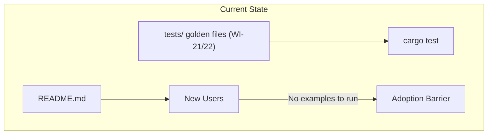
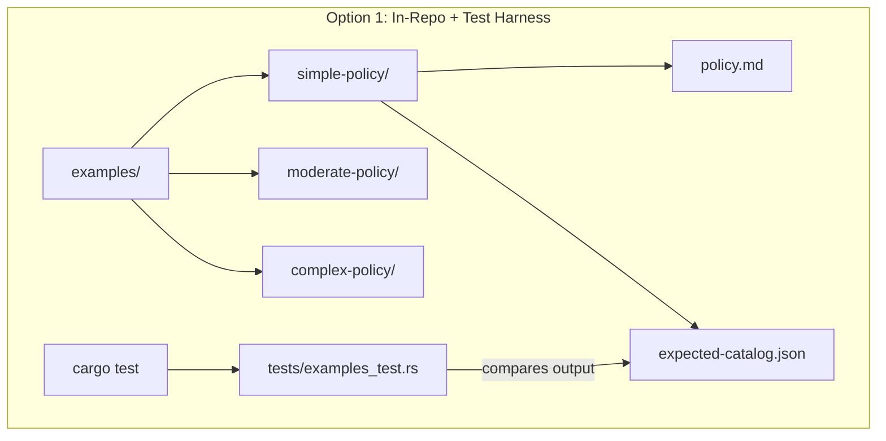
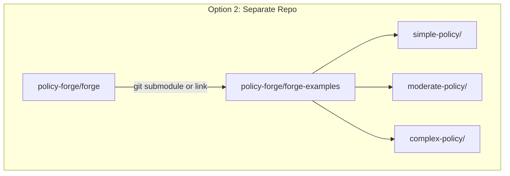
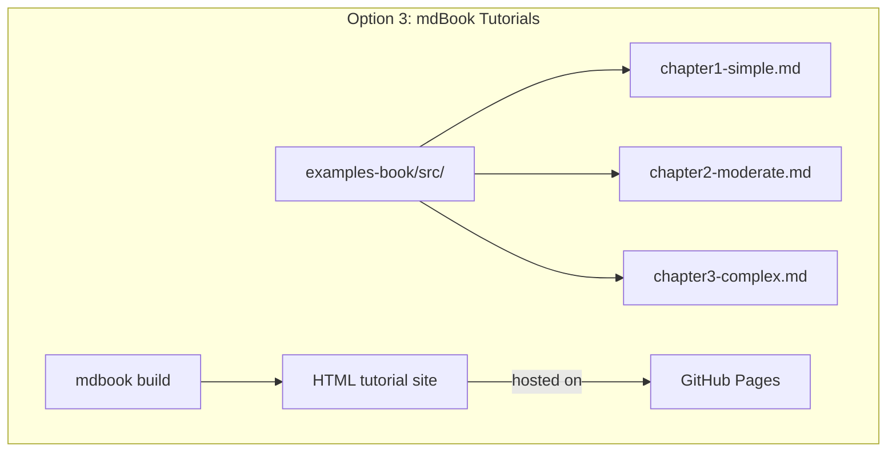
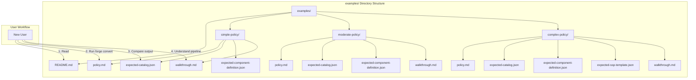
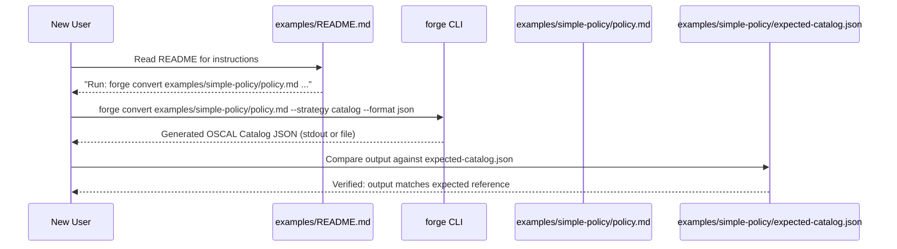

# 047-ar-community-examples

> **Document Type:** Architecture Review
> **Audience:** LLM agents, human reviewers
> **Status:** Proposed
> **Last Updated:** 2026-02-10 <!-- @auto -->
> **Owner:** Brian Luby <!-- @human-required -->
> **Deciders:** Brian Luby <!-- @human-required -->

---

## Review Tier Legend

| Marker | Tier | Speckit Behavior |
|--------|------|------------------|
| :red_circle: `@human-required` | Human Generated | Prompt human to author; blocks until complete |
| :yellow_circle: `@human-review` | LLM + Human Review | LLM drafts -> prompt human to confirm/edit; blocks until confirmed |
| :green_circle: `@llm-autonomous` | LLM Autonomous | LLM completes; no prompt; logged for audit |
| :white_circle: `@auto` | Auto-generated | System fills (timestamps, links); no prompt |

---

## Document Completion Order

> :warning: **For LLM Agents:** Complete sections in this order. Do not fill downstream sections until upstream human-required inputs exist.

1. **Summary (Decision)** -> requires human input first
2. **Context (Problem Space)** -> requires human input
3. **Decision Drivers** -> requires human input (prioritized)
4. **Driving Requirements** -> extract from PRD, human confirms
5. **Options Considered** -> LLM drafts after drivers exist, human reviews
6. **Decision (Selected + Rationale)** -> requires human decision
7. **Implementation Guardrails** -> LLM drafts, human reviews
8. **Everything else** -> can proceed after decision is made

---

## Linkage :white_circle: `@auto`

| Document | ID | Relationship |
|----------|-----|--------------|
| Parent PRD | [047-prd-community-examples](../PRD/047-prd-community-examples.md) | Requirements this architecture satisfies |
| Security Review | N/A | Static example files; no code execution surface |
| Supersedes | -- | N/A |
| Superseded By | -- | |

---

## Summary

### Decision :red_circle: `@human-required`
> Use in-repo static example files in an `examples/` directory at the repository root, organized by complexity level (simple, moderate, complex), with each subdirectory containing a sample Markdown policy, expected OSCAL outputs, and an annotated pipeline walkthrough.

### TL;DR for Agents :yellow_circle: `@human-review`
> Community examples are static files committed to the `examples/` directory. Each example has a `policy.md` input, expected OSCAL output files (`expected-catalog.json`, `expected-component-definition.json`), and a `walkthrough.md` explaining the conversion pipeline. All sample policies are synthetic/fictional. Expected outputs must be reproducible by running FORGE on the sample policy and must pass `forge validate`. Do NOT use real organizational policies. Do NOT create an automated test harness here -- golden-file testing is WI-21/WI-22.

---

## Context

### Problem Space :red_circle: `@human-required`
FORGE's README and documentation explain what the tool does, but without concrete, runnable examples, potential users and contributors cannot quickly understand its capabilities. New users face three barriers: (1) they must find or write a Markdown policy to test with, (2) they cannot verify output correctness without a known-good reference, and (3) they cannot understand the conversion pipeline without tracing a real example. The architectural question is how to organize, maintain, and present these examples to maximize community adoption and contributor onboarding.

### Decision Scope :yellow_circle: `@human-review`

**This AR decides:**
- How examples are organized in the repository (directory structure, file naming)
- What content each example contains (input, outputs, walkthroughs)
- How examples are maintained and kept in sync with FORGE's evolving output
- The relationship between examples and the automated test suite

**This AR does NOT decide:**
- Automated golden-file testing infrastructure -- that is WI-21/WI-22
- Documentation site hosting -- deferred to WI-48 / post-release
- Real-world policy content -- all examples are synthetic

### Current State :green_circle: `@llm-autonomous`
No community examples exist. The repository has golden-file test fixtures in the test suite (WI-21/WI-22) but these are optimized for automated testing, not human learning. Users must write their own sample policies or discover the test fixtures buried in the `tests/` directory.



### Driving Requirements :yellow_circle: `@human-review`

| PRD Req ID | Requirement Summary | Architectural Implication |
|------------|---------------------|---------------------------|
| M-1 | 3+ sample Markdown policies at varying complexity | Directory structure must accommodate multiple examples |
| M-2 | Expected OSCAL Catalog JSON for each sample | Each example needs companion output files |
| M-3 | Expected OSCAL Component Definition JSON for each sample | Each example needs companion output files |
| M-4 | All expected outputs pass `forge validate` | Outputs must be regenerable and schema-valid |
| M-5 | README.md in examples/ with instructions | README must explain structure, run commands, comparison workflow |
| M-6 | At least one annotated walkthrough | Walkthrough file explaining pipeline stages |

**PRD Constraints inherited:**
- All sample policies must be synthetic/fictional (no real organizational data)
- Expected outputs must be reproducible by running FORGE on the sample
- UUIDs should be deterministic (WI-7 stable UUIDs) for reproducible comparison
- MIT license applies to all example content

---

## Decision Drivers :red_circle: `@human-required`

1. **Onboarding speed:** New users must be able to run their first example within 5 minutes of cloning the repo *(traces to PRD evaluation criteria)*
2. **Correctness:** Expected outputs must be verifiably correct (pass schema validation) and reproducible *(traces to PRD M-4, S-4)*
3. **Maintainability:** Examples must be easy to update when FORGE's output format evolves *(traces to PRD risk R-1)*
4. **Discoverability:** Examples must be easy to find in the repository and clearly organized *(traces to PRD M-5)*

---

## Options Considered :yellow_circle: `@human-review`

### Option 0: Status Quo / Do Nothing

**Description:** No community examples. Users rely on README text, --help output, and test fixtures.

| Driver | Rating | Notes |
|--------|--------|-------|
| Onboarding speed | :x: Poor | Users must write their own sample policies |
| Correctness | N/A | No reference outputs to compare against |
| Maintainability | :white_check_mark: Good | Nothing to maintain |
| Discoverability | :x: Poor | Test fixtures are not designed for learning |

**Why not viable:** Vision Goal G-3 targets community adoption. Without examples, the learning curve is too steep for new users and the 5-minute onboarding target is impossible to meet.

---

### Option 1: In-Repo Examples with Test Harness

**Description:** Create an `examples/` directory with sample policies and expected outputs, AND integrate them into the automated test suite so `cargo test` validates examples are in sync.



| Driver | Rating | Notes |
|--------|--------|-------|
| Onboarding speed | :white_check_mark: Good | Examples immediately available on clone |
| Correctness | :white_check_mark: Good | CI verifies examples stay in sync with FORGE output |
| Maintainability | :warning: Medium | Test harness adds coupling; examples must update with every output change |
| Discoverability | :white_check_mark: Good | examples/ at repo root is standard convention |

**Pros:**
- Examples are verified correct by CI on every commit
- Stale examples are caught automatically
- Immediate availability on clone

**Cons:**
- Test harness for examples overlaps with golden-file testing (WI-21/WI-22)
- Output format changes trigger example update AND test update
- Adds CI time for what are conceptually documentation files
- Blurs the line between examples (for humans) and test fixtures (for CI)

---

### Option 2: Separate Examples Repository

**Description:** Create a separate `policy-forge/forge-examples` repository containing sample policies, expected outputs, and walkthroughs.



| Driver | Rating | Notes |
|--------|--------|-------|
| Onboarding speed | :warning: Medium | Requires separate clone or submodule setup |
| Correctness | :warning: Medium | Not automatically verified against main repo |
| Maintainability | :warning: Medium | Separate repo can drift from main FORGE version |
| Discoverability | :x: Poor | Users may not find the separate repo; adds friction |

**Pros:**
- Keeps the main repo lean
- Examples can have their own release cadence
- Separate contribution workflow for content vs. code

**Cons:**
- Discoverability problem: users must know to look for a separate repo
- Version drift: examples may not match the installed FORGE version
- Extra git operations for users (submodule checkout or separate clone)
- More complex CI to verify examples against the main FORGE binary

---

### Option 3: mdBook-Based Interactive Tutorials

**Description:** Create an mdBook (Rust documentation book framework) with interactive tutorials that embed sample policies, show conversion steps, and display expected outputs in a browsable format.



| Driver | Rating | Notes |
|--------|--------|-------|
| Onboarding speed | :warning: Medium | Rich experience but requires hosting; not available on clone |
| Correctness | :warning: Medium | Embedded examples not automatically validated against FORGE |
| Maintainability | :x: Poor | mdBook content + hosting + CI for site builds |
| Discoverability | :white_check_mark: Good | Published site is highly discoverable via search engines |

**Pros:**
- Best presentation quality: formatted, navigable, searchable
- SEO benefits: discoverable via search engines
- Rich formatting for walkthroughs (syntax highlighting, callouts)

**Cons:**
- Requires mdBook dependency and hosting infrastructure (GitHub Pages)
- Embedded code snippets are not automatically validated
- Higher maintenance burden: content authoring + build pipeline + hosting
- Not available offline without building the book
- Explicitly deferred by PRD: "Hosted documentation site -- deferred to post-release"

---

## Decision

### Selected Option :red_circle: `@human-required`
> **Option 1 (modified): In-Repo Static Examples without Integrated Test Harness**

### Rationale :red_circle: `@human-required`

The selected approach combines the best of Option 1 (in-repo, immediately available, discoverable) while deferring the test harness integration to avoid overlap with WI-21/WI-22 golden-file testing. Examples are static files committed to `examples/` at the repository root. They are verified manually or via an optional regeneration script (PRD C-1), not by `cargo test`. This keeps examples focused on human learning rather than automated regression. Option 2's separate repo adds friction and discoverability problems. Option 3's mdBook is explicitly deferred by the PRD to post-release.

#### Simplest Implementation Comparison :yellow_circle: `@human-review`

| Aspect | Simplest Possible | Selected Option | Justification for Complexity |
|--------|-------------------|-----------------|------------------------------|
| Components | Single example in README | 3 examples in examples/ with walkthroughs | PRD M-1 requires 3+ examples at varying complexity |
| Dependencies | None | None (static files) | No additional dependencies |
| Patterns | Copy-paste in docs | Organized directory structure | PRD M-5 requires structured README with instructions |
| Maintenance | None | Optional regeneration script | PRD C-1 suggests script; not required for MVP |

**Complexity justified by:** PRD M-1 requires 3+ examples at varying complexity with expected outputs (M-2, M-3) and walkthroughs (M-6). A single inline example would not satisfy these requirements.

### Architecture Diagram :yellow_circle: `@human-review`



---

## Technical Specification

### Component Overview :yellow_circle: `@human-review`

| Component | Responsibility | Interface | Dependencies |
|-----------|---------------|-----------|--------------|
| examples/README.md | Explains purpose, structure, run instructions, comparison workflow | Human-readable Markdown | None |
| simple-policy/ | Minimal example: flat policy, few requirements, no citations | Static files | None |
| moderate-policy/ | Mid-complexity: nested sections, citations, requirement atomization | Static files | None |
| complex-policy/ | Full-featured: compound statements, cross-refs, normative/advisory, SSP template | Static files | None |
| walkthrough.md (per example) | Pipeline stage-by-stage explanation with input/output snippets | Human-readable Markdown | None |

### Data Flow :green_circle: `@llm-autonomous`



### Interface Definitions :yellow_circle: `@human-review`

N/A -- This work item produces static content files, not code interfaces. The interface is the existing FORGE CLI:

```bash
# Convert a sample policy to OSCAL Catalog
forge convert examples/simple-policy/policy.md --strategy catalog --format json --output output.json

# Compare against expected output
diff output.json examples/simple-policy/expected-catalog.json

# Validate expected output
forge validate examples/simple-policy/expected-catalog.json
```

### Key Algorithms/Patterns :yellow_circle: `@human-review`

**Pattern:** Three-tier complexity progression
```
1. Simple: 1 section, 3-5 flat requirements, no citations
   - Demonstrates: basic conversion, control generation
2. Moderate: 3-4 sections, 8-12 requirements, nested headings, citations
   - Demonstrates: section hierarchy, atomization, back-matter
3. Complex: 5+ sections, 15-20 requirements, compound statements, cross-refs
   - Demonstrates: full pipeline including SSP template generation
```

**Pattern:** Walkthrough structure
```
1. Input: Show raw policy Markdown
2. Parse: Explain heading -> section mapping, requirement extraction
3. Model: Show PolicyDocument -> PolicySection -> PolicyRequirement
4. Generate: Show OSCAL element mapping (controls, statements, back-matter)
5. Validate: Confirm schema validity
```

---

## Constraints & Boundaries

### Technical Constraints :yellow_circle: `@human-review`

**Inherited from PRD:**
- All sample policies must be synthetic/fictional -- no real organizational data
- Expected outputs must pass `forge validate` (schema validation)
- UUIDs should be deterministic (WI-7 stable UUID generation) for reproducible comparison
- MIT license covers all example content

**Added by this Architecture:**
- File naming convention: `policy.md`, `expected-catalog.json`, `expected-component-definition.json`, `expected-ssp-template.json`, `walkthrough.md`
- Directory naming: `simple-policy/`, `moderate-policy/`, `complex-policy/`
- No build step or tooling required to use examples -- clone and run
- Expected outputs committed as-is (not gitignored)

### Architectural Boundaries :yellow_circle: `@human-review`

- **Owns:** All files under `examples/`
- **Interfaces With:** FORGE CLI (users run `forge convert` on example policies), `forge validate` (for output verification)
- **Must Not Touch:** Test suite fixtures (tests/), source code, CI pipeline configuration

### Implementation Guardrails :yellow_circle: `@human-review`

> :warning: **Critical for LLM Agents:**

- [x] **DO NOT** use real organizational policy text -- all content must be synthetic/fictional *(PRD constraint)*
- [x] **DO NOT** create an automated test harness for examples -- golden-file testing is WI-21/WI-22 *(PRD W-2)*
- [x] **DO NOT** make expected outputs dependent on non-deterministic behavior (random UUIDs, timestamps) *(PRD S-4)*
- [x] **MUST** include at least 3 sample policies at different complexity levels *(PRD M-1)*
- [x] **MUST** include expected Catalog and Component Definition JSON for each sample *(PRD M-2, M-3)*
- [x] **MUST** verify all expected outputs pass `forge validate` *(PRD M-4)*
- [x] **MUST** include README.md with structure explanation and run instructions *(PRD M-5)*

---

## Consequences :yellow_circle: `@human-review`

### Positive
- Immediate onboarding: new users can run their first FORGE conversion within 5 minutes
- Reference correctness: expected outputs serve as known-good references for contributors
- Pipeline understanding: walkthroughs bridge the gap between documentation and code
- No tooling overhead: static files require no build step or hosting

### Negative
- Expected outputs may become stale as FORGE output format evolves (mitigated by optional regeneration script)
- Static walkthroughs may not reflect implementation changes (mitigated by keeping walkthroughs conceptual)

### Risks & Mitigations

| Risk | Likelihood | Impact | Mitigation |
|------|------------|--------|------------|
| Expected outputs become stale after FORGE updates | Medium | Medium | Optional regeneration script (PRD C-1); version note in README |
| Sample policies are too simple or too complex | Low | Medium | Three complexity levels cover the range; community feedback post-release |
| Walkthroughs become outdated with pipeline changes | Medium | Low | Keep walkthroughs conceptual (how elements map) rather than implementation-specific |

---

## Implementation Guidance

### Suggested Implementation Order :green_circle: `@llm-autonomous`
1. Create `examples/` directory structure with subdirectories
2. Write `simple-policy/policy.md` (3-5 flat requirements)
3. Generate expected outputs by running FORGE on simple policy; verify with `forge validate`
4. Write `simple-policy/walkthrough.md`
5. Repeat for moderate-policy (nested sections, citations)
6. Repeat for complex-policy (compound statements, cross-refs, SSP template)
7. Write `examples/README.md` with structure, instructions, and comparison guidance
8. Optional: create regeneration script (PRD C-1)

### Testing Strategy :green_circle: `@llm-autonomous`

| Layer | Test Type | Coverage Target | Notes |
|-------|-----------|-----------------|-------|
| Manual | Run forge convert on each sample | All examples | Verify output matches expected files |
| Manual | Run forge validate on each expected output | All outputs | Verify schema validity |
| Manual | Follow README instructions on clean clone | Happy path | Verify 5-minute onboarding target |
| Optional | Regeneration script | All examples | Automated expected output refresh |

### Anti-patterns to Avoid :yellow_circle: `@human-review`
- **Don't:** Use real organizational policy text
  - **Why:** IP and sensitivity concerns; legal complications
  - **Instead:** Use obviously fictional organization names and policy content
- **Don't:** Write walkthroughs that reference internal function names or module structure
  - **Why:** Couples documentation to implementation; breaks when code changes
  - **Instead:** Keep walkthroughs focused on conceptual pipeline stages
- **Don't:** Create overly trivial examples (e.g., single requirement)
  - **Why:** Fails to demonstrate meaningful conversion features
  - **Instead:** Even the simple example should have 3-5 requirements across a minimal structure

---

## Compliance & Cross-cutting Concerns

### Security Considerations :yellow_circle: `@human-review`
- Authentication: N/A -- static files in public repository
- Authorization: N/A
- Data handling: All sample policies are synthetic. No sensitive data. Care must be taken that sample policies do not inadvertently resemble real organizational policies.

### Observability :green_circle: `@llm-autonomous`
- **Logging:** N/A -- static files
- **Metrics:** N/A -- static files
- **Tracing:** N/A -- static files

### Error Handling Strategy :green_circle: `@llm-autonomous`
N/A -- This work item produces static files, not executable code. Error handling is in the FORGE CLI, not in examples.

---

## Migration Plan (if applicable) :yellow_circle: `@human-review`

N/A -- No migration. Creating new content from scratch.

### Rollback Plan :red_circle: `@human-required`

N/A -- Examples are additive. Removing the `examples/` directory has no impact on FORGE functionality. If examples prove unhelpful, they can be replaced or removed without affecting any other component.

---

## Open Questions :yellow_circle: `@human-review`

No open questions blocking implementation.

---

## Changelog :white_circle: `@auto`

| Version | Date | Author | Changes |
|---------|------|--------|---------|
| 0.1 | 2026-02-10 | LLM (Claude) | Initial proposal |

---

## Decision Record :white_circle: `@auto`

| Date | Event | Details |
|------|-------|---------|
| 2026-02-10 | Proposed | Initial draft created from PRD 047 |

---

## Traceability Matrix :green_circle: `@llm-autonomous`

| PRD Req ID | Decision Driver | Option Rating | Component | Notes |
|------------|-----------------|---------------|-----------|-------|
| M-1 | Discoverability | Option 1: :white_check_mark: | examples/ directory | 3+ subdirectories with varying complexity |
| M-2 | Correctness | Option 1: :white_check_mark: | expected-catalog.json | Reproducible, schema-valid Catalog outputs |
| M-3 | Correctness | Option 1: :white_check_mark: | expected-component-definition.json | Reproducible, schema-valid Component Definition outputs |
| M-4 | Correctness | Option 1: :white_check_mark: | forge validate | All expected outputs pass schema validation |
| M-5 | Onboarding speed | Option 1: :white_check_mark: | examples/README.md | Instructions, structure, run commands |
| M-6 | Onboarding speed | Option 1: :white_check_mark: | walkthrough.md | Pipeline stage-by-stage explanation |

---

## Review Checklist :green_circle: `@llm-autonomous`

Before marking as Accepted:
- [x] All PRD Must Have requirements appear in Driving Requirements
- [x] Option 0 (Status Quo) is documented
- [x] Simplest Implementation comparison is completed
- [x] Decision drivers are prioritized and addressed
- [x] At least 2 options were seriously considered
- [x] Constraints distinguish inherited vs. new
- [x] Component names are consistent across all diagrams and tables
- [x] Implementation guardrails reference specific PRD constraints
- [x] Rollback triggers and authority are defined (N/A -- additive content, trivial removal)
- [x] Security review is linked or N/A documented
- [x] No open questions blocking implementation
