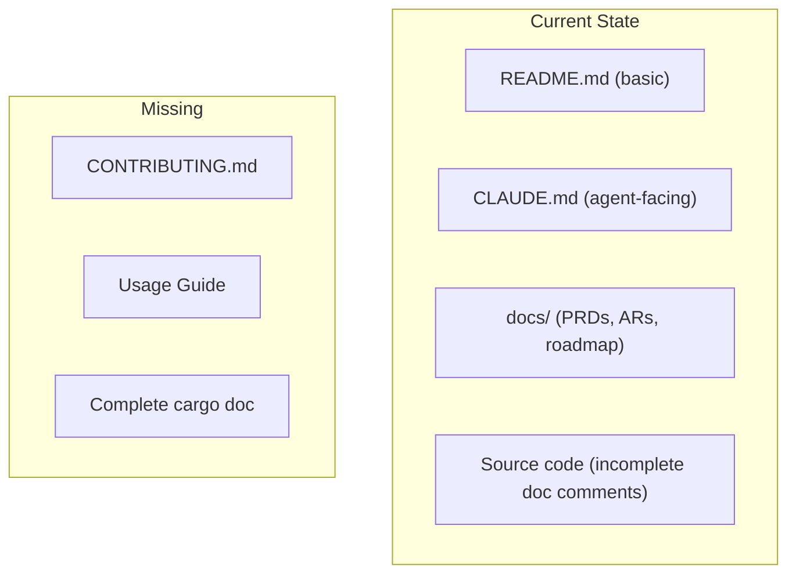
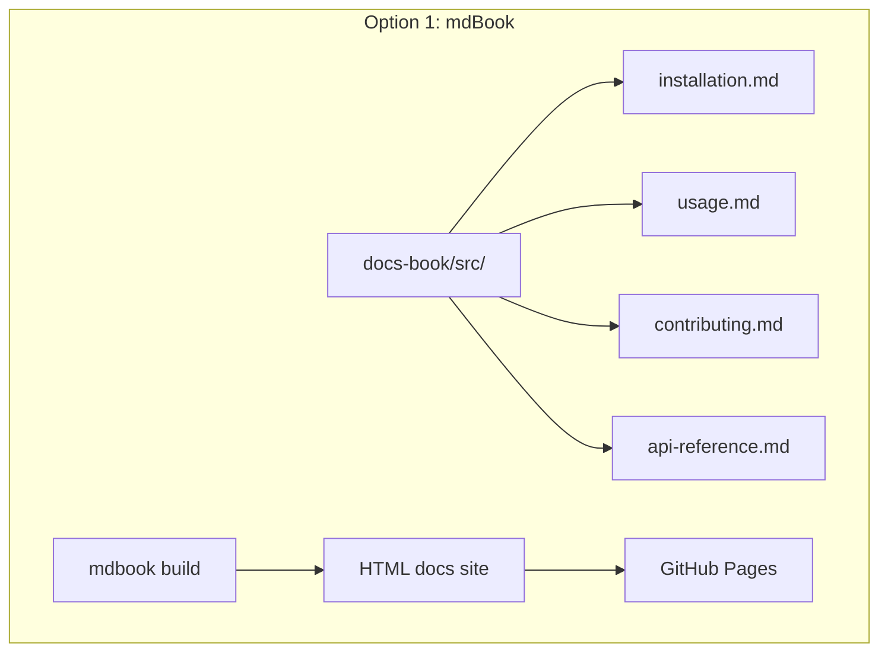
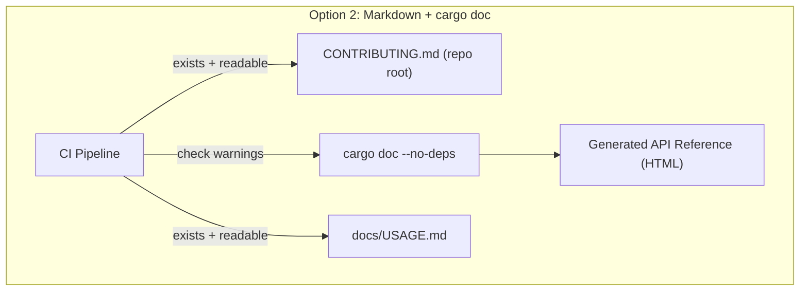
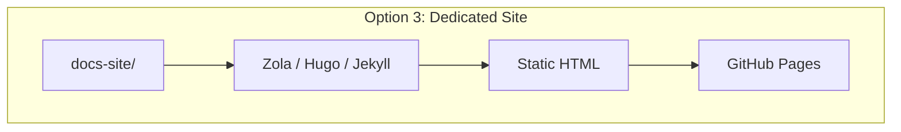
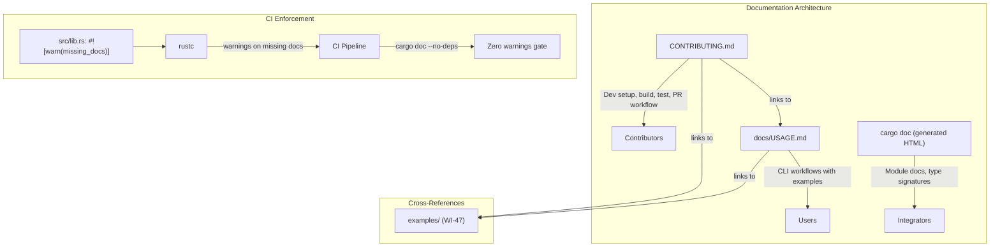
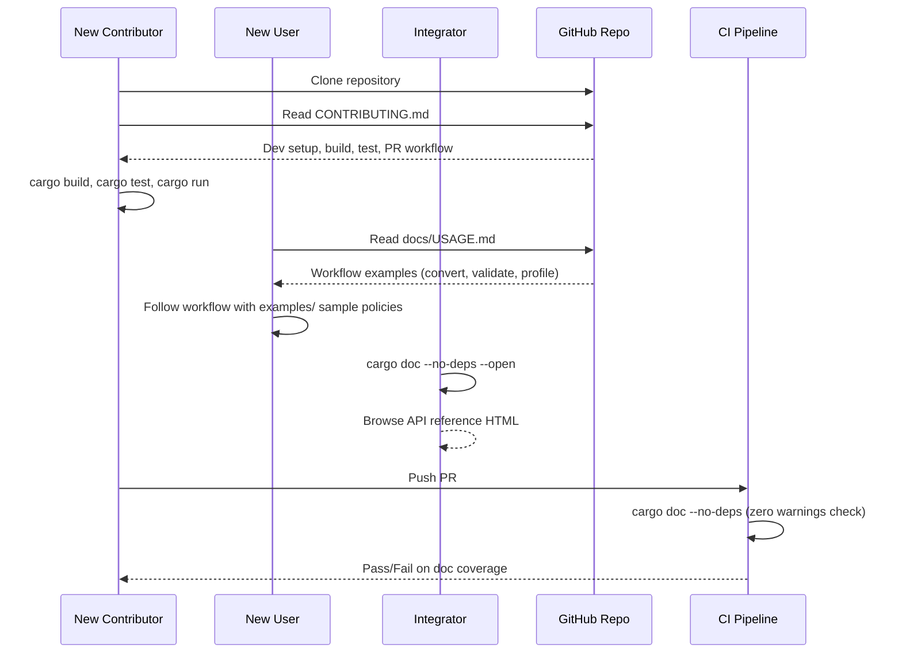

# 048-ar-community-documentation

> **Document Type:** Architecture Review
> **Audience:** LLM agents, human reviewers
> **Status:** Proposed
> **Last Updated:** 2026-02-10 <!-- @auto -->
> **Owner:** Brian Luby <!-- @human-required -->
> **Deciders:** Brian Luby <!-- @human-required -->

---

## Review Tier Legend

| Marker | Tier | Speckit Behavior |
|--------|------|------------------|
| :red_circle: `@human-required` | Human Generated | Prompt human to author; blocks until complete |
| :yellow_circle: `@human-review` | LLM + Human Review | LLM drafts -> prompt human to confirm/edit; blocks until confirmed |
| :green_circle: `@llm-autonomous` | LLM Autonomous | LLM completes; no prompt; logged for audit |
| :white_circle: `@auto` | Auto-generated | System fills (timestamps, links); no prompt |

---

## Document Completion Order

> :warning: **For LLM Agents:** Complete sections in this order. Do not fill downstream sections until upstream human-required inputs exist.

1. **Summary (Decision)** -> requires human input first
2. **Context (Problem Space)** -> requires human input
3. **Decision Drivers** -> requires human input (prioritized)
4. **Driving Requirements** -> extract from PRD, human confirms
5. **Options Considered** -> LLM drafts after drivers exist, human reviews
6. **Decision (Selected + Rationale)** -> requires human decision
7. **Implementation Guardrails** -> LLM drafts, human reviews
8. **Everything else** -> can proceed after decision is made

---

## Linkage :white_circle: `@auto`

| Document | ID | Relationship |
|----------|-----|--------------|
| Parent PRD | [048-prd-community-documentation](../PRD/048-prd-community-documentation.md) | Requirements this architecture satisfies |
| Security Review | N/A | Documentation files only; no execution surface |
| Supersedes | -- | N/A |
| Superseded By | -- | |

---

## Summary

### Decision :red_circle: `@human-required`
> Use in-repo Markdown documentation (CONTRIBUTING.md at root, docs/USAGE.md for usage guide) combined with `cargo doc` API reference generation, with CI enforcement of doc comment coverage via `#![warn(missing_docs)]` and `cargo doc --no-deps` zero-warning gate.

### TL;DR for Agents :yellow_circle: `@human-review`
> Community documentation consists of three artifacts: (1) CONTRIBUTING.md at repo root with dev setup, build, test, and contribution workflow; (2) docs/USAGE.md with workflow-oriented usage guide covering all CLI subcommands; (3) `cargo doc` API reference with module-level `//!` doc comments on all public modules. Add `#![warn(missing_docs)]` to lib.rs and enforce zero warnings from `cargo doc --no-deps` in CI. Do NOT create a hosted documentation site (mdBook, GitHub Pages) -- that is deferred to post-release. Do NOT duplicate CLI --help text verbatim; provide workflow context instead.

---

## Context

### Problem Space :red_circle: `@human-required`
FORGE has been developed over 47 sprints with comprehensive functionality, but lacks the written documentation that external developers and users need to get started. Without CONTRIBUTING.md, potential contributors cannot set up a development environment. Without a usage guide, users must read source code or PRDs. Without `cargo doc` API documentation, integrators cannot understand the public API surface. This documentation gap is the primary barrier to community adoption.

### Decision Scope :yellow_circle: `@human-review`

**This AR decides:**
- What documentation artifacts to create and where they live in the repository
- How API documentation is generated and enforced
- How the usage guide is structured and what workflows it covers
- CI enforcement of documentation coverage

**This AR does NOT decide:**
- Hosted documentation site (mdBook, GitHub Pages) -- deferred to post-release
- Video tutorials or interactive walkthroughs -- out of scope
- Architecture or internals documentation -- existing docs/ directory covers this
- Content of community examples -- that is WI-47

### Current State :green_circle: `@llm-autonomous`
The repository has a README.md with basic project description and build commands (CLAUDE.md provides agent-facing guidance). No CONTRIBUTING.md exists. No usage guide exists. Public API doc comments are incomplete -- `cargo doc --no-deps` produces warnings for undocumented public items.



### Driving Requirements :yellow_circle: `@human-review`

| PRD Req ID | Requirement Summary | Architectural Implication |
|------------|---------------------|---------------------------|
| M-1 | CONTRIBUTING.md with dev setup instructions | File at repo root with prerequisites, build, test, run |
| M-2 | CONTRIBUTING.md with contribution workflow | Branch naming, commit conventions, PR process, CI expectations |
| M-3 | Usage guide with common workflows | Markdown file covering convert, validate, profile, trace, export |
| M-4 | Usage guide with concrete command examples | Each workflow includes runnable commands with expected output descriptions |
| M-5 | All public modules have module-level doc comments | `//!` comments on every public module |
| M-6 | `cargo doc --no-deps` completes without warnings | CI gate enforcing documentation coverage |

**PRD Constraints inherited:**
- From constitution: Rust latest stable, `cargo doc` for API reference, TDD mandatory
- From constitution: `#![warn(missing_docs)]` in lib.rs for doc coverage enforcement
- Documentation format: Markdown for human-readable docs; rustdoc for API reference

---

## Decision Drivers :red_circle: `@human-required`

1. **Contributor enablement:** Documentation must enable a new contributor to go from zero to first PR without external help *(traces to PRD M-1, M-2)*
2. **User adoption:** Usage guide must enable a compliance engineer to convert their first policy without reading source code *(traces to PRD M-3, M-4)*
3. **Maintenance burden:** Documentation approach must be sustainable for a solo developer *(constitution capacity: 1 engineer)*
4. **CI enforcement:** Documentation coverage must not regress as new public items are added *(traces to PRD M-6)*

---

## Options Considered :yellow_circle: `@human-review`

### Option 0: Status Quo / Do Nothing

**Description:** Rely on README.md, CLAUDE.md, and --help text. No dedicated contributor or user documentation.

| Driver | Rating | Notes |
|--------|--------|-------|
| Contributor enablement | :x: Poor | No setup guide; contributors must reverse-engineer workflow |
| User adoption | :x: Poor | No workflow guide; users must discover features via --help |
| Maintenance burden | :white_check_mark: Good | Nothing to maintain |
| CI enforcement | :x: Poor | No doc coverage gates; API docs degrade over time |

**Why not viable:** Community adoption (G-3) requires documentation. Without it, FORGE is accessible only to its original author.

---

### Option 1: mdBook Documentation Site

**Description:** Create a comprehensive mdBook-based documentation site with chapters for installation, usage, contributing, API reference, and tutorials. Host on GitHub Pages.



| Driver | Rating | Notes |
|--------|--------|-------|
| Contributor enablement | :white_check_mark: Good | Rich, navigable documentation |
| User adoption | :white_check_mark: Good | Professional presentation, searchable |
| Maintenance burden | :x: Poor | mdBook dependency, build pipeline, hosting, content authoring |
| CI enforcement | :warning: Medium | Must enforce mdBook builds + cargo doc separately |

**Pros:**
- Professional presentation with search, navigation, and rich formatting
- SEO benefits from hosted site
- Chapters can include embedded code examples

**Cons:**
- Adds mdBook dependency and build pipeline
- Requires GitHub Pages hosting setup and maintenance
- Content authoring and build pipeline overhead for solo developer
- Explicitly deferred by PRD W-1: "Hosted documentation site -- deferred to post-release"

---

### Option 2: In-Repo Markdown + cargo doc (Recommended)

**Description:** Create CONTRIBUTING.md at repo root and docs/USAGE.md for the usage guide, both in plain Markdown. Use `cargo doc` with enforced doc comments for API reference. Add `#![warn(missing_docs)]` to lib.rs and enforce zero warnings in CI.



| Driver | Rating | Notes |
|--------|--------|-------|
| Contributor enablement | :white_check_mark: Good | CONTRIBUTING.md is the standard open-source convention |
| User adoption | :white_check_mark: Good | Usage guide with concrete examples covers all workflows |
| Maintenance burden | :white_check_mark: Good | Markdown files are trivial to update; cargo doc is zero-config |
| CI enforcement | :white_check_mark: Good | `#![warn(missing_docs)]` + `cargo doc --no-deps` in CI |

**Pros:**
- Zero additional dependencies or tooling
- Standard open-source convention (CONTRIBUTING.md is universally recognized)
- Markdown renders natively on GitHub
- `cargo doc` is built into the Rust toolchain
- CI enforcement via compiler warnings prevents documentation regression
- Sustainable for solo developer

**Cons:**
- No search functionality beyond GitHub's built-in search
- No navigation structure beyond GitHub's file browser
- Less polished presentation than mdBook or dedicated site

---

### Option 3: Dedicated Documentation Site (GitHub Pages with Static Generator)

**Description:** Use a static site generator (e.g., Zola, Hugo, or Jekyll) to build a dedicated documentation site with custom branding, navigation, and search. Host on GitHub Pages.



| Driver | Rating | Notes |
|--------|--------|-------|
| Contributor enablement | :white_check_mark: Good | Professional docs site |
| User adoption | :white_check_mark: Good | Custom branding, search, navigation |
| Maintenance burden | :x: Poor | Site generator + theme + hosting + CI pipeline |
| CI enforcement | :warning: Medium | cargo doc still needed separately |

**Pros:**
- Most professional presentation
- Custom branding and design
- Full-text search

**Cons:**
- Significant tooling overhead (site generator, theme, CI, hosting)
- Non-Rust dependency (most static generators are Ruby, Go, or Rust but still add complexity)
- Overkill for initial community release with a solo developer
- PRD explicitly defers hosted site to post-release

---

## Decision

### Selected Option :red_circle: `@human-required`
> **Option 2: In-Repo Markdown + cargo doc**

### Rationale :red_circle: `@human-required`

Option 2 is the simplest approach that meets all PRD requirements. CONTRIBUTING.md at repo root is the universal open-source convention. docs/USAGE.md provides a workflow-oriented guide without requiring any build step. `cargo doc` with `#![warn(missing_docs)]` provides API reference with CI enforcement. No additional dependencies, hosting, or build pipelines are needed. Options 1 and 3 are explicitly deferred by the PRD (W-1) and add unsustainable tooling overhead for a solo developer at this stage. A hosted documentation site can be adopted post-release if community demand warrants it.

#### Simplest Implementation Comparison :yellow_circle: `@human-review`

| Aspect | Simplest Possible | Selected Option | Justification for Complexity |
|--------|-------------------|-----------------|------------------------------|
| Components | Expand README.md | CONTRIBUTING.md + docs/USAGE.md + cargo doc | PRD requires separate contribution guide (M-1/M-2) and usage guide (M-3/M-4) |
| Dependencies | None | None | No additional dependencies |
| Patterns | Plain text | Markdown + rustdoc | Standard conventions; zero additional tooling |
| CI enforcement | None | `#![warn(missing_docs)]` + cargo doc gate | PRD M-6 requires zero-warning cargo doc |

**Complexity justified by:** PRD M-1 through M-6 require three distinct documentation artifacts (contribution guide, usage guide, API docs) with CI enforcement. The selected option is the minimum implementation that satisfies all requirements.

### Architecture Diagram :yellow_circle: `@human-review`



---

## Technical Specification

### Component Overview :yellow_circle: `@human-review`

| Component | Responsibility | Interface | Dependencies |
|-----------|---------------|-----------|--------------|
| CONTRIBUTING.md | Developer setup, build commands, test commands, contribution workflow | Human-readable Markdown at repo root | None |
| docs/USAGE.md | Usage guide with workflow-oriented examples for all CLI subcommands | Human-readable Markdown in docs/ | WI-47 community examples (cross-referenced) |
| cargo doc output | API reference from doc comments on public modules, types, functions | Generated HTML via `cargo doc --no-deps` | Rust toolchain |
| CI doc gate | Enforces documentation coverage | `#![warn(missing_docs)]` + CI step | Rust compiler, CI pipeline |

### Data Flow :green_circle: `@llm-autonomous`



### Interface Definitions :yellow_circle: `@human-review`

N/A -- This work item produces documentation artifacts, not code interfaces. The only code change is adding `#![warn(missing_docs)]` to `src/lib.rs` and ensuring all public items have doc comments.

```rust
// src/lib.rs - Documentation enforcement
#![warn(missing_docs)]

//! # FORGE - Framework for OSCAL Risk & Governance Execution
//!
//! FORGE is a Rust CLI tool that converts security policies from Markdown
//! documents into OSCAL (Open Security Controls Assessment Language) artifacts.
//!
//! ## Modules
//!
//! - [`cli`] - Command-line interface and subcommand dispatch
//! - [`ingest`] - File reading and format detection
//! - [`parse`] - Markdown structural extraction
//! - [`model`] - Internal domain model (PolicyDocument, PolicyRequirement)
//! - [`oscal`] - OSCAL artifact generation (Catalog, Component Definition, Profile)
//! - [`validate`] - Schema validation against OSCAL v1.2.0
//! - [`export`] - Output serialization (JSON, XML, YAML)
```

### Key Algorithms/Patterns :yellow_circle: `@human-review`

**Pattern:** CONTRIBUTING.md structure
```
1. Prerequisites (Rust toolchain, cargo)
2. Getting Started (clone, build, test, run)
3. Project Structure (modules, directories)
4. Code Style (rustfmt, clippy, conventions)
5. Testing (cargo test, golden files, doc tests)
6. Submitting Changes (branch naming, commits, PR process)
7. CI Expectations (what must pass before merge)
8. Common Issues / FAQ
```

**Pattern:** Usage guide structure
```
1. Quick Start (5-minute first conversion)
2. Convert to OSCAL Catalog
3. Convert to Component Definition
4. Validate OSCAL Artifacts
5. Generate Profiles
6. Traceability Reports
7. Batch Conversion
8. Export Between Formats
9. SSP Template Generation
10. Command Reference (link to forge --help)
```

---

## Constraints & Boundaries

### Technical Constraints :yellow_circle: `@human-review`

**Inherited from PRD:**
- Rust latest stable toolchain
- `cargo doc` for API reference generation
- `cargo clippy -- -D warnings` must pass
- `cargo fmt --check` must pass
- TDD mandatory for any code changes (doc comments are code changes)

**Added by this Architecture:**
- `#![warn(missing_docs)]` in lib.rs to enforce documentation at compile time
- `cargo doc --no-deps` must complete with zero warnings in CI
- CONTRIBUTING.md located at repository root (standard convention)
- Usage guide located at docs/USAGE.md (consistent with existing docs/ structure)

### Architectural Boundaries :yellow_circle: `@human-review`

- **Owns:** CONTRIBUTING.md, docs/USAGE.md, doc comments on public items, CI doc gate
- **Interfaces With:** WI-47 community examples (cross-referenced from usage guide), README.md (updated to link to new docs)
- **Must Not Touch:** Existing docs/ structure (PRDs, ARs, roadmap), source code logic (only doc comments added)

### Implementation Guardrails :yellow_circle: `@human-review`

> :warning: **Critical for LLM Agents:**

- [x] **DO NOT** create a hosted documentation site (mdBook, GitHub Pages) -- deferred to post-release *(PRD W-1)*
- [x] **DO NOT** duplicate CLI `--help` text verbatim in the usage guide -- provide workflow context instead *(PRD anti-pattern)*
- [x] **DO NOT** write doc comments as trivial restatements of function names *(PRD anti-pattern)*
- [x] **MUST** add `#![warn(missing_docs)]` to lib.rs *(PRD M-6 enforcement)*
- [x] **MUST** ensure `cargo doc --no-deps` completes with zero warnings *(PRD M-6)*
- [x] **MUST** reference WI-47 community examples from the usage guide *(PRD S-2)*
- [x] **MUST** include concrete, runnable command examples in the usage guide *(PRD M-4)*

---

## Consequences :yellow_circle: `@human-review`

### Positive
- Contributors can set up and contribute without external help
- Users can discover and use all FORGE features via the usage guide
- API documentation is enforced by the compiler, preventing regression
- Zero additional dependencies or hosting infrastructure

### Negative
- Markdown-only documentation lacks search and navigation features of a hosted site
- Doc comments add maintenance burden to every code change (mitigated by CI enforcement)

### Risks & Mitigations

| Risk | Likelihood | Impact | Mitigation |
|------|------------|--------|------------|
| Documentation becomes stale as features evolve | Medium | Medium | CI enforces cargo doc coverage; usage guide references --help for current options |
| Usage guide does not cover edge cases | Low | Low | Community examples supplement the guide; GitHub Issues provide feedback |
| Doc comments are low quality (trivial restatements) | Low | Medium | Review doc comments in PRs; provide style examples in CONTRIBUTING.md |

---

## Implementation Guidance

### Suggested Implementation Order :green_circle: `@llm-autonomous`
1. Add `#![warn(missing_docs)]` to src/lib.rs
2. Add module-level `//!` doc comments to all public modules
3. Add `///` doc comments to all public types, functions, and methods
4. Verify `cargo doc --no-deps` produces zero warnings
5. Write CONTRIBUTING.md at repo root
6. Write docs/USAGE.md with Quick Start and all workflows
7. Update README.md to link to CONTRIBUTING.md, docs/USAGE.md, and examples/
8. Add `cargo doc --no-deps` check to CI pipeline

### Testing Strategy :green_circle: `@llm-autonomous`

| Layer | Test Type | Coverage Target | Notes |
|-------|-----------|-----------------|-------|
| CI | `cargo doc --no-deps` | Zero warnings | Prevents doc regression |
| CI | `cargo test --doc` | All doc tests pass | If C-1 doc examples are added |
| Manual | Follow CONTRIBUTING.md | Complete walkthrough | Verify dev setup works on clean machine |
| Manual | Follow USAGE.md Quick Start | 5-minute target | Verify new user can convert first policy |

### Anti-patterns to Avoid :yellow_circle: `@human-review`
- **Don't:** Write documentation that describes implementation details rather than user-facing behavior
  - **Why:** Couples docs to code internals; breaks on refactor
  - **Instead:** Focus on what the user can do, not how it works internally
- **Don't:** Leave doc comments as `/// TODO: document this`
  - **Why:** Defeats the purpose of doc enforcement
  - **Instead:** Write meaningful descriptions even if brief
- **Don't:** Assume readers know Rust or the OSCAL specification
  - **Why:** Target audience includes compliance engineers, not just Rust developers
  - **Instead:** Explain concepts in context; link to external references

---

## Compliance & Cross-cutting Concerns

### Security Considerations :yellow_circle: `@human-review`
- Authentication: N/A -- documentation files in public repository
- Authorization: N/A
- Data handling: Documentation only; no credentials or secrets. CONTRIBUTING.md must warn against committing secrets.

### Observability :green_circle: `@llm-autonomous`
- **Logging:** N/A -- documentation files
- **Metrics:** N/A -- documentation files
- **Tracing:** N/A -- documentation files

### Error Handling Strategy :green_circle: `@llm-autonomous`
N/A -- This work item produces documentation, not executable code.

---

## Migration Plan (if applicable) :yellow_circle: `@human-review`

N/A -- Creating new documentation from scratch. No migration required.

### Rollback Plan :red_circle: `@human-required`

N/A -- Documentation is additive. Removing CONTRIBUTING.md or docs/USAGE.md has no impact on FORGE functionality. The `#![warn(missing_docs)]` can be removed if doc enforcement proves too burdensome, though this is unlikely given the constitution's documentation standards.

---

## Open Questions :yellow_circle: `@human-review`

No open questions blocking implementation.

---

## Changelog :white_circle: `@auto`

| Version | Date | Author | Changes |
|---------|------|--------|---------|
| 0.1 | 2026-02-10 | LLM (Claude) | Initial proposal |

---

## Decision Record :white_circle: `@auto`

| Date | Event | Details |
|------|-------|---------|
| 2026-02-10 | Proposed | Initial draft created from PRD 048 |

---

## Traceability Matrix :green_circle: `@llm-autonomous`

| PRD Req ID | Decision Driver | Option Rating | Component | Notes |
|------------|-----------------|---------------|-----------|-------|
| M-1 | Contributor enablement | Option 2: :white_check_mark: | CONTRIBUTING.md | Dev setup instructions |
| M-2 | Contributor enablement | Option 2: :white_check_mark: | CONTRIBUTING.md | Contribution workflow |
| M-3 | User adoption | Option 2: :white_check_mark: | docs/USAGE.md | Common workflows documented |
| M-4 | User adoption | Option 2: :white_check_mark: | docs/USAGE.md | Concrete command examples |
| M-5 | CI enforcement | Option 2: :white_check_mark: | cargo doc + //! comments | Module-level doc comments on all public modules |
| M-6 | CI enforcement | Option 2: :white_check_mark: | CI doc gate | Zero warnings from cargo doc --no-deps |

---

## Review Checklist :green_circle: `@llm-autonomous`

Before marking as Accepted:
- [x] All PRD Must Have requirements appear in Driving Requirements
- [x] Option 0 (Status Quo) is documented
- [x] Simplest Implementation comparison is completed
- [x] Decision drivers are prioritized and addressed
- [x] At least 2 options were seriously considered
- [x] Constraints distinguish inherited vs. new
- [x] Component names are consistent across all diagrams and tables
- [x] Implementation guardrails reference specific PRD constraints
- [x] Rollback triggers and authority are defined (N/A -- additive docs, trivial removal)
- [x] Security review is linked or N/A documented
- [x] No open questions blocking implementation
