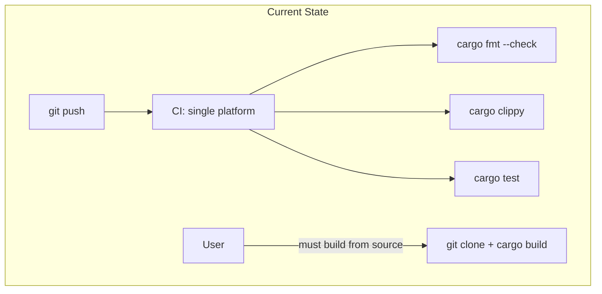
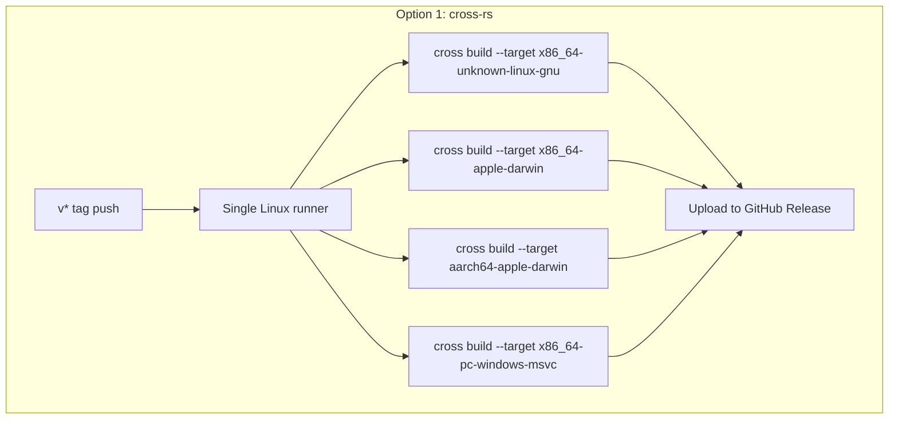
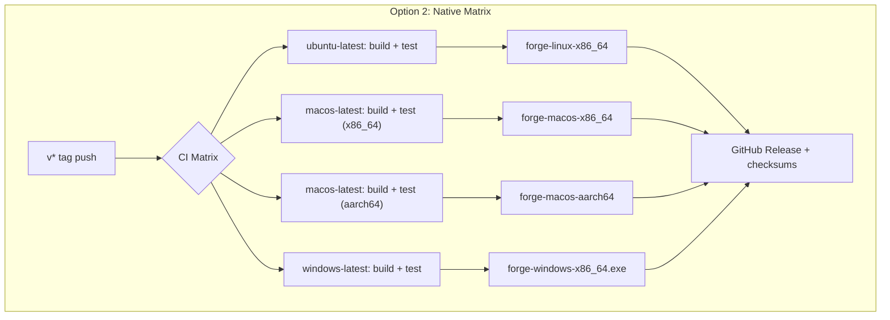
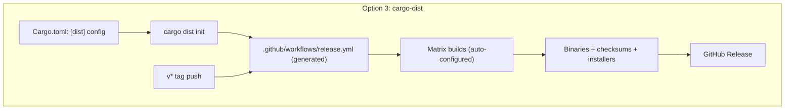
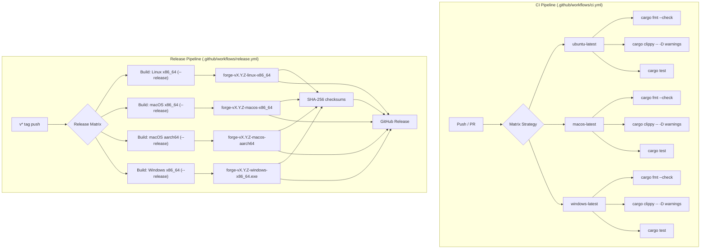
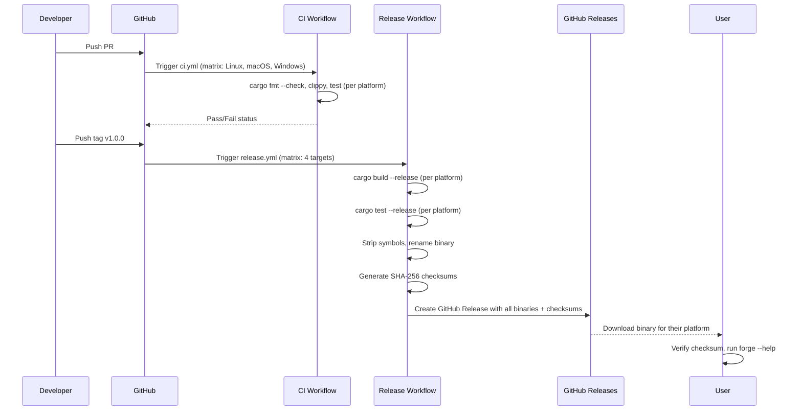
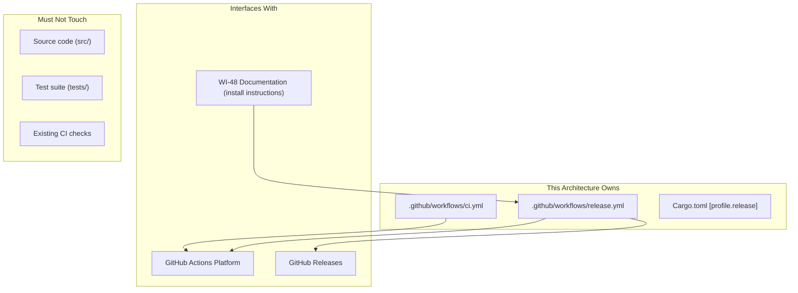
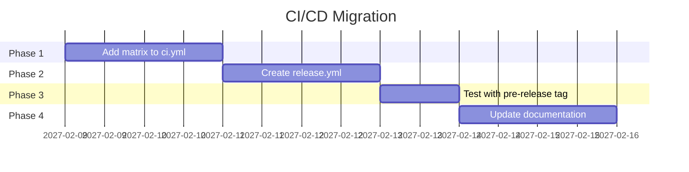

# 049-ar-cross-platform-release

> **Document Type:** Architecture Review
> **Audience:** LLM agents, human reviewers
> **Status:** Proposed
> **Last Updated:** 2026-02-10 <!-- @auto -->
> **Owner:** Brian Luby <!-- @human-required -->
> **Deciders:** Brian Luby <!-- @human-required -->

---

## Review Tier Legend

| Marker | Tier | Speckit Behavior |
|--------|------|------------------|
| :red_circle: `@human-required` | Human Generated | Prompt human to author; blocks until complete |
| :yellow_circle: `@human-review` | LLM + Human Review | LLM drafts -> prompt human to confirm/edit; blocks until confirmed |
| :green_circle: `@llm-autonomous` | LLM Autonomous | LLM completes; no prompt; logged for audit |
| :white_circle: `@auto` | Auto-generated | System fills (timestamps, links); no prompt |

---

## Document Completion Order

> :warning: **For LLM Agents:** Complete sections in this order. Do not fill downstream sections until upstream human-required inputs exist.

1. **Summary (Decision)** -> requires human input first
2. **Context (Problem Space)** -> requires human input
3. **Decision Drivers** -> requires human input (prioritized)
4. **Driving Requirements** -> extract from PRD, human confirms
5. **Options Considered** -> LLM drafts after drivers exist, human reviews
6. **Decision (Selected + Rationale)** -> requires human decision
7. **Implementation Guardrails** -> LLM drafts, human reviews
8. **Everything else** -> can proceed after decision is made

---

## Linkage :white_circle: `@auto`

| Document | ID | Relationship |
|----------|-----|--------------|
| Parent PRD | [049-prd-cross-platform-release](../PRD/049-prd-cross-platform-release.md) | Requirements this architecture satisfies |
| Security Review | N/A | CI/CD pipeline and binary distribution; SHA-256 checksums for integrity |
| Supersedes | -- | N/A |
| Superseded By | -- | |

---

## Summary

### Decision :red_circle: `@human-required`
> Use GitHub Actions with native platform runners (ubuntu-latest, macos-latest, windows-latest) in a matrix build strategy for CI, with a separate release workflow triggered by `v*` tags that builds optimized binaries, generates SHA-256 checksums, and publishes to GitHub Releases.

### TL;DR for Agents :yellow_circle: `@human-review`
> Cross-platform release uses two GitHub Actions workflows: (1) `ci.yml` runs on every push/PR with a matrix of Linux, macOS, and Windows runners executing `cargo fmt --check`, `cargo clippy -- -D warnings`, and `cargo test`; (2) `release.yml` triggers on `v*` tags, builds with `--release` profile (LTO enabled, symbols stripped), generates SHA-256 checksums, and uploads all binaries to a GitHub Release. Use native runners per platform -- do NOT use cross-compilation. Do NOT skip tests in the release workflow. Do NOT publish binaries without checksums.

---

## Context

### Problem Space :red_circle: `@human-required`
FORGE can currently only be obtained by building from source with `cargo build`, which requires the Rust toolchain -- a significant barrier for compliance engineers and security professionals who are not Rust developers. For community adoption (G-3), users on Linux, macOS, and Windows need pre-built binaries. The architectural challenge is establishing a reliable, maintainable CI/CD pipeline that builds and tests across all target platforms and produces trusted release artifacts.

### Decision Scope :yellow_circle: `@human-review`

**This AR decides:**
- CI platform and workflow structure (GitHub Actions configuration)
- Build matrix (platforms, architectures, runners)
- Release artifact packaging (binary naming, checksums)
- Release trigger mechanism (tag-based)
- Build profile configuration (release optimizations)

**This AR does NOT decide:**
- Package manager distribution (Homebrew, apt, chocolatey) -- deferred to post-release
- Docker/OCI container images -- deferred
- Code signing or macOS notarization -- deferred
- crates.io publication -- PRD C-1, not required for MVP

### Current State :green_circle: `@llm-autonomous`
FORGE has a basic CI pipeline running `cargo fmt`, `cargo clippy`, and `cargo test` on a single platform. No release workflow exists. No pre-built binaries are available. Installation requires `cargo build` from source.



### Driving Requirements :yellow_circle: `@human-review`

| PRD Req ID | Requirement Summary | Architectural Implication |
|------------|---------------------|---------------------------|
| M-1 | CI builds on Linux, macOS, Windows for every push/PR | GitHub Actions matrix strategy with 3+ runners |
| M-2 | CI runs cargo test on all platforms, fails on any test failure | Test step in matrix; fail-fast or individual reporting |
| M-3 | Release workflow triggered by v* tags produces binaries | Tag-triggered workflow separate from CI |
| M-4 | Release binaries with descriptive platform-specific names | Naming convention: `forge-vX.Y.Z-<platform>-<arch>` |
| M-5 | SHA-256 checksums alongside release binaries | Checksum generation step in release workflow |
| M-6 | Installation instructions for cargo install and binary download | Documentation update (links to WI-48) |

**PRD Constraints inherited:**
- From constitution: Rust latest stable, `cargo clippy -- -D warnings`, `cargo fmt --check`
- From constitution: All quality gates must pass before release
- From PRD: Native runners preferred over cross-compilation

---

## Decision Drivers :red_circle: `@human-required`

1. **Reliability:** Binaries must work correctly on target platforms -- native compilation is more trustworthy than cross-compilation *(traces to PRD selected approach)*
2. **Adoption:** Pre-built binaries eliminate the "must install Rust" barrier for non-developer users *(traces to Vision G-3)*
3. **Integrity:** Users must be able to verify download integrity via checksums *(traces to PRD M-5)*
4. **Simplicity:** CI/CD pipeline must be maintainable by a solo developer *(constitution principle X)*

---

## Options Considered :yellow_circle: `@human-review`

### Option 0: Status Quo / Do Nothing

**Description:** Continue requiring users to build from source with `cargo build`. No CI matrix, no release binaries.

| Driver | Rating | Notes |
|--------|--------|-------|
| Reliability | :x: Poor | No assurance FORGE compiles on all platforms |
| Adoption | :x: Poor | Rust toolchain is a hard prerequisite for all users |
| Integrity | N/A | No artifacts to verify |
| Simplicity | :white_check_mark: Good | Nothing to configure |

**Why not viable:** Community adoption (G-3) is impossible if FORGE can only be obtained by building from source. The "must install Rust" barrier excludes the primary target audience (compliance engineers).

---

### Option 1: Cross-Compilation with cross-rs

**Description:** Use the `cross` tool (cross-rs) to build binaries for all target platforms from a single Linux runner using Docker-based cross-compilation toolchains.



| Driver | Rating | Notes |
|--------|--------|-------|
| Reliability | :warning: Medium | Cross-compiled binaries may have subtle platform issues; Docker-based toolchains add a layer of abstraction |
| Adoption | :white_check_mark: Good | Pre-built binaries for all platforms |
| Integrity | :white_check_mark: Good | Checksums generated from built artifacts |
| Simplicity | :warning: Medium | cross-rs adds Docker dependency; macOS cross-compilation can be finicky |

**Pros:**
- Single runner builds all targets -- simpler CI minutes accounting
- cross-rs handles toolchain setup automatically
- Consistent build environment across targets

**Cons:**
- Docker-based cross-compilation is slower than native builds
- macOS cross-compilation is less reliable than native builds
- Windows MSVC target via cross has known limitations
- Cannot run tests on the target platform (only build, not test)
- Adds Docker dependency to CI

---

### Option 2: GitHub Actions Matrix with Native Runners

**Description:** Use GitHub Actions matrix strategy with native runners for each target platform. Each runner builds and tests natively, then uploads platform-specific artifacts. A separate release job collects all artifacts and publishes to GitHub Releases.



| Driver | Rating | Notes |
|--------|--------|-------|
| Reliability | :white_check_mark: Good | Native builds are most reliable; tests run on actual target platform |
| Adoption | :white_check_mark: Good | Pre-built binaries for all platforms |
| Integrity | :white_check_mark: Good | Checksums generated; builds from source on trusted GitHub runners |
| Simplicity | :white_check_mark: Good | Standard GitHub Actions patterns; no additional tools needed |

**Pros:**
- Native compilation -- most reliable, no cross-compile issues
- Tests run on the actual target platform, catching platform-specific bugs
- No Docker dependency
- Standard, well-documented GitHub Actions patterns
- Free for public repositories (unlimited minutes)
- Each platform reports independently (clear failure attribution)

**Cons:**
- Uses more CI runner minutes than single-runner cross-compilation (not a concern for public repos)
- macOS aarch64 may require cross-compilation from x86_64 runner or a dedicated aarch64 runner

---

### Option 3: cargo-dist

**Description:** Use `cargo-dist`, a purpose-built tool for Rust binary distribution that automates GitHub Actions release workflows, artifact naming, checksums, and optionally installers.



| Driver | Rating | Notes |
|--------|--------|-------|
| Reliability | :white_check_mark: Good | Uses native runners under the hood; well-tested by Rust community |
| Adoption | :white_check_mark: Good | Can generate shell/PowerShell install scripts |
| Integrity | :white_check_mark: Good | Auto-generates checksums and optionally signs artifacts |
| Simplicity | :warning: Medium | Adds cargo-dist dependency; generated workflow is opinionated and harder to customize |

**Pros:**
- Purpose-built for Rust binary distribution
- Generates install scripts and Homebrew formulae
- Handles artifact naming, checksums, and release notes automatically
- Active community, well-maintained

**Cons:**
- Adds an external tool dependency (cargo-dist)
- Generated workflow files are opinionated -- harder to customize for non-standard needs
- Abstraction layer can obscure what the CI is actually doing
- Learning curve for cargo-dist configuration
- May conflict with existing CI setup

---

## Decision

### Selected Option :red_circle: `@human-required`
> **Option 2: GitHub Actions Matrix with Native Runners**

### Rationale :red_circle: `@human-required`

Option 2 provides the highest reliability by building and testing natively on each target platform, with the simplest maintenance model (standard GitHub Actions YAML, no additional tools). Native runners catch platform-specific issues that cross-compilation would miss. Tests run on the actual target platform, providing real assurance of correctness. GitHub Actions is free for public repositories, so runner minute costs are not a concern. Option 1's cross-compilation introduces Docker complexity and cannot test on the target platform. Option 3's cargo-dist adds an opinionated abstraction that may conflict with existing CI and is harder to debug when issues arise. Option 2's manual workflow YAML provides full transparency and control.

#### Simplest Implementation Comparison :yellow_circle: `@human-review`

| Aspect | Simplest Possible | Selected Option | Justification for Complexity |
|--------|-------------------|-----------------|------------------------------|
| Components | Single-platform build | 4-platform matrix (Linux, macOS x2, Windows) | PRD M-1 requires Linux, macOS, Windows builds |
| Dependencies | cargo only | GitHub Actions + dtolnay/rust-toolchain | Standard CI tooling; no additional Rust tools |
| Patterns | Manual release | Tag-triggered automated release workflow | PRD M-3 requires automated release on tag |
| Artifacts | Binary only | Binary + SHA-256 checksums | PRD M-5 requires integrity verification |

**Complexity justified by:** PRD M-1 through M-5 require multi-platform CI, automated release on tag, and checksums. The selected option is the simplest native approach that satisfies all requirements.

### Architecture Diagram :yellow_circle: `@human-review`



---

## Technical Specification

### Component Overview :yellow_circle: `@human-review`

| Component | Responsibility | Interface | Dependencies |
|-----------|---------------|-----------|--------------|
| .github/workflows/ci.yml | Cross-platform CI: fmt, clippy, test on every push/PR | GitHub Actions workflow | GitHub Actions runners, dtolnay/rust-toolchain |
| .github/workflows/release.yml | Build optimized binaries and publish to GitHub Releases on v* tags | GitHub Actions workflow | GitHub Actions runners, softprops/action-gh-release or gh CLI |
| Cargo.toml [profile.release] | Release build profile with LTO and symbol stripping | Cargo configuration | None |
| Installation docs | Instructions for cargo install and binary download | Markdown (in README, CONTRIBUTING, USAGE) | WI-48 documentation |

### Data Flow :green_circle: `@llm-autonomous`



### Interface Definitions :yellow_circle: `@human-review`

```yaml
# .github/workflows/ci.yml (conceptual)
name: CI
on:
  push:
    branches: [main]
  pull_request:
    branches: [main]

jobs:
  check:
    strategy:
      matrix:
        os: [ubuntu-latest, macos-latest, windows-latest]
    runs-on: ${{ matrix.os }}
    steps:
      - uses: actions/checkout@v4
      - uses: dtolnay/rust-toolchain@stable
      - run: cargo fmt --all -- --check
      - run: cargo clippy --workspace --all-targets -- -D warnings
      - run: cargo test --workspace

# .github/workflows/release.yml (conceptual)
name: Release
on:
  push:
    tags: ['v*']

jobs:
  build:
    strategy:
      matrix:
        include:
          - os: ubuntu-latest
            target: x86_64-unknown-linux-gnu
            artifact_name: forge
            asset_name: forge-linux-x86_64
          - os: macos-latest
            target: x86_64-apple-darwin
            artifact_name: forge
            asset_name: forge-macos-x86_64
          - os: macos-latest
            target: aarch64-apple-darwin
            artifact_name: forge
            asset_name: forge-macos-aarch64
          - os: windows-latest
            target: x86_64-pc-windows-msvc
            artifact_name: forge.exe
            asset_name: forge-windows-x86_64.exe
    runs-on: ${{ matrix.os }}
    steps:
      - uses: actions/checkout@v4
      - uses: dtolnay/rust-toolchain@stable
        with:
          targets: ${{ matrix.target }}
      - run: cargo build --release --target ${{ matrix.target }}
      - run: cargo test --release --target ${{ matrix.target }}
      # Rename and upload artifact

  release:
    needs: build
    runs-on: ubuntu-latest
    steps:
      # Download all artifacts
      # Generate SHA-256 checksums
      # Create GitHub Release
```

```toml
# Cargo.toml [profile.release] configuration
[profile.release]
lto = true
strip = true
codegen-units = 1
```

### Key Algorithms/Patterns :yellow_circle: `@human-review`

**Pattern:** Tag-triggered release
```
1. Developer merges all changes to main
2. Developer creates and pushes tag: git tag v1.0.0 && git push origin v1.0.0
3. release.yml triggers on v* tag pattern
4. Matrix builds run in parallel (4 platform targets)
5. Each build: compile --release, test --release, rename binary
6. Release job collects all artifacts, generates checksums
7. GitHub Release created with binaries + checksums + auto-generated notes
```

**Pattern:** Binary naming convention
```
forge-v{VERSION}-{PLATFORM}-{ARCH}[.exe]
  - forge-v1.0.0-linux-x86_64
  - forge-v1.0.0-macos-x86_64
  - forge-v1.0.0-macos-aarch64
  - forge-v1.0.0-windows-x86_64.exe
```

**Pattern:** Checksum generation
```
sha256sum forge-v1.0.0-linux-x86_64 >> SHA256SUMS.txt
sha256sum forge-v1.0.0-macos-x86_64 >> SHA256SUMS.txt
sha256sum forge-v1.0.0-macos-aarch64 >> SHA256SUMS.txt
sha256sum forge-v1.0.0-windows-x86_64.exe >> SHA256SUMS.txt
```

---

## Constraints & Boundaries

### Technical Constraints :yellow_circle: `@human-review`

**Inherited from PRD:**
- Rust latest stable toolchain
- `cargo clippy -- -D warnings` must pass on all platforms
- `cargo fmt --check` must pass
- `cargo test` must pass on all target platforms
- Native runners preferred over cross-compilation

**Added by this Architecture:**
- Release profile: `lto = true`, `strip = true`, `codegen-units = 1` for optimized binaries
- Binary naming: `forge-v{VERSION}-{PLATFORM}-{ARCH}[.exe]`
- Checksum format: SHA-256 in a single `SHA256SUMS.txt` file
- Tag pattern: `v*` (e.g., `v1.0.0`, `v1.0.0`) triggers release workflow
- macOS aarch64 may require cross-compilation from x86_64 runner if no native aarch64 runner is available

### Architectural Boundaries :yellow_circle: `@human-review`



- **Owns:** CI workflow, release workflow, release profile configuration
- **Interfaces With:** GitHub Actions, GitHub Releases, WI-48 documentation
- **Must Not Touch:** Source code logic, test suite, existing CI checks (extend, do not replace)

### Implementation Guardrails :yellow_circle: `@human-review`

> :warning: **Critical for LLM Agents:**

- [x] **DO NOT** use cross-compilation when native runners are available -- native builds are more reliable *(decision rationale)*
- [x] **DO NOT** skip tests in the release workflow -- release binaries must pass all tests *(PRD M-2)*
- [x] **DO NOT** publish binaries without SHA-256 checksums *(PRD M-5)*
- [x] **DO NOT** hardcode version numbers in workflow files -- derive from git tag *(anti-pattern)*
- [x] **MUST** build and test on Linux, macOS, and Windows *(PRD M-1, M-2)*
- [x] **MUST** trigger release workflow only on `v*` tags *(PRD M-3)*
- [x] **MUST** use descriptive binary names with platform and architecture *(PRD M-4)*
- [x] **MUST** run `cargo fmt --check` and `cargo clippy -- -D warnings` in CI *(constitution quality gates)*

---

## Consequences :yellow_circle: `@human-review`

### Positive
- Users can install FORGE without the Rust toolchain -- eliminates the primary adoption barrier
- Cross-platform CI catches platform-specific issues early
- SHA-256 checksums provide download integrity verification
- Tag-triggered releases are reproducible and auditable
- Free for public repositories on GitHub Actions

### Negative
- CI runs take longer with 3-4 platform matrix (acceptable for public repos with free minutes)
- macOS aarch64 may require special handling if no native runner is available
- Release workflow adds maintenance surface (GitHub Actions YAML)

### Risks & Mitigations

| Risk | Likelihood | Impact | Mitigation |
|------|------------|--------|------------|
| Windows-specific compilation failures (path separators, file handling) | Medium | Medium | CI catches these on every PR; fix platform-specific issues as they surface |
| macOS aarch64 runner availability or cost | Low | Low | GitHub Actions supports aarch64 macOS; fallback to cross-compilation for this specific target |
| Binary size too large for convenient download | Low | Low | LTO + strip + codegen-units=1 minimize binary size |
| Release workflow fails mid-publish (partial release) | Low | Medium | Use release action that creates draft first, publishes after all uploads succeed |

---

## Implementation Guidance

### Suggested Implementation Order :green_circle: `@llm-autonomous`
1. Add `[profile.release]` section to Cargo.toml with LTO and strip settings
2. Create `.github/workflows/ci.yml` with matrix strategy (Linux, macOS, Windows)
3. Verify CI passes on all platforms
4. Create `.github/workflows/release.yml` with tag-triggered matrix builds
5. Test release workflow with a pre-release tag (e.g., `v1.0.0-rc.1`)
6. Verify binaries are functional on each platform (smoke test: `forge --help`)
7. Update installation instructions in README, CONTRIBUTING.md, and docs/USAGE.md
8. Document checksum verification process in installation instructions

### Testing Strategy :green_circle: `@llm-autonomous`

| Layer | Test Type | Coverage Target | Notes |
|-------|-----------|-----------------|-------|
| CI | Build + test on all platforms | 100% pass | Every push/PR |
| Release | Build --release + test --release | 100% pass | Every v* tag |
| Smoke | `forge --help` on released binary | All platforms | Verify binary is functional |
| Integrity | SHA-256 checksum verification | All binaries | Verify checksums match |

### Anti-patterns to Avoid :yellow_circle: `@human-review`
- **Don't:** Use `actions/upload-release-asset` (deprecated)
  - **Why:** Deprecated and unmaintained
  - **Instead:** Use `softprops/action-gh-release` or `gh release create`
- **Don't:** Hardcode version numbers in workflow files
  - **Why:** Out of sync with tags; manual error risk
  - **Instead:** Extract version from `GITHUB_REF_NAME` (the tag)
- **Don't:** Build without testing in release workflow
  - **Why:** Release binaries must be verified correct
  - **Instead:** Run `cargo test --release` before uploading artifacts
- **Don't:** Publish a GitHub Release before all platform builds succeed
  - **Why:** Partial releases confuse users
  - **Instead:** Use draft release; publish only after all artifacts uploaded

---

## Compliance & Cross-cutting Concerns

### Security Considerations :yellow_circle: `@human-review`
- Authentication: GitHub Actions secrets managed by GitHub for release publishing
- Authorization: Release workflow uses `GITHUB_TOKEN` with write permissions to releases
- Data handling: Builds from source on trusted GitHub runners; no third-party binary dependencies
- Supply chain: SHA-256 checksums provide integrity verification; code signing deferred to post-release

### Observability :green_circle: `@llm-autonomous`
- **Logging:** GitHub Actions provides full build logs per job and step
- **Metrics:** CI pass rate tracked via GitHub Actions status badges
- **Tracing:** Each release is tagged and linked to a specific commit

### Error Handling Strategy :green_circle: `@llm-autonomous`
```
Error Category -> Handling Approach
+-- Platform build failure -> CI reports which platform/step failed; PR blocks until fixed
+-- Platform test failure -> CI reports which platform/test failed; PR blocks
+-- Release upload failure -> Draft release; retry upload; do not publish partial release
+-- Checksum mismatch -> Regenerate checksums; re-upload affected artifacts
```

---

## Migration Plan (if applicable) :yellow_circle: `@human-review`

### From Current State to Target State

The existing single-platform CI workflow is extended (not replaced) by the matrix strategy. The release workflow is entirely new.



### Rollback Plan :red_circle: `@human-required`

**Rollback Triggers:**
- CI matrix causes persistent failures on one platform that cannot be resolved within the sprint
- Release workflow produces corrupt or non-functional binaries

**Rollback Decision Authority:** Brian Luby (product owner)

**Rollback Procedure:**
1. Revert `.github/workflows/ci.yml` to single-platform configuration
2. Delete `.github/workflows/release.yml`
3. Revert `[profile.release]` changes in Cargo.toml
4. Continue distributing via `cargo install` from source only
5. Document platform limitation in README

Rollback is low-risk: CI and release workflows are additive configurations that do not affect source code.

---

## Open Questions :yellow_circle: `@human-review`

No open questions blocking implementation.

---

## Changelog :white_circle: `@auto`

| Version | Date | Author | Changes |
|---------|------|--------|---------|
| 0.1 | 2026-02-10 | LLM (Claude) | Initial proposal |

---

## Decision Record :white_circle: `@auto`

| Date | Event | Details |
|------|-------|---------|
| 2026-02-10 | Proposed | Initial draft created from PRD 049 |

---

## Traceability Matrix :green_circle: `@llm-autonomous`

| PRD Req ID | Decision Driver | Option Rating | Component | Notes |
|------------|-----------------|---------------|-----------|-------|
| M-1 | Reliability | Option 2: :white_check_mark: | ci.yml matrix | Build + test on Linux, macOS, Windows |
| M-2 | Reliability | Option 2: :white_check_mark: | ci.yml + release.yml | cargo test on all platforms |
| M-3 | Simplicity | Option 2: :white_check_mark: | release.yml | Tag-triggered release workflow |
| M-4 | Adoption | Option 2: :white_check_mark: | release.yml | forge-vX.Y.Z-platform-arch naming |
| M-5 | Integrity | Option 2: :white_check_mark: | release.yml | SHA-256 checksums in SHA256SUMS.txt |
| M-6 | Adoption | Option 2: :white_check_mark: | Installation docs | cargo install + binary download instructions |

---

## Review Checklist :green_circle: `@llm-autonomous`

Before marking as Accepted:
- [x] All PRD Must Have requirements appear in Driving Requirements
- [x] Option 0 (Status Quo) is documented
- [x] Simplest Implementation comparison is completed
- [x] Decision drivers are prioritized and addressed
- [x] At least 2 options were seriously considered
- [x] Constraints distinguish inherited vs. new
- [x] Component names are consistent across all diagrams and tables
- [x] Implementation guardrails reference specific PRD constraints
- [x] Rollback triggers and authority are defined
- [x] Security review is linked or N/A documented
- [x] No open questions blocking implementation
